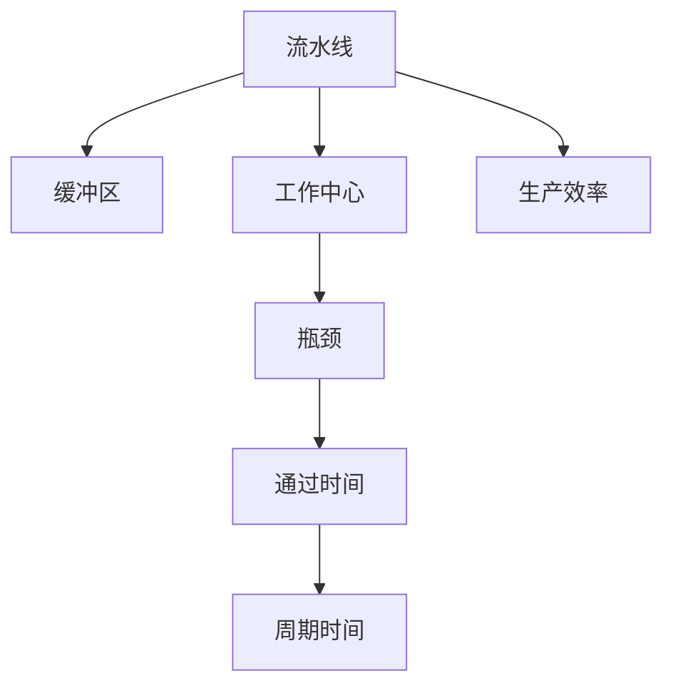
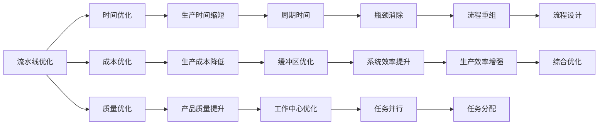

                 

## 1. 背景介绍

### 1.1 问题由来
现代制造业中，流水线生产已成主流。它通过将生产过程拆分为多个环节，每个环节专注执行单一操作，极大地提升了生产效率。然而，流水线也面临着瓶颈，如生产停滞、质量波动等问题。优化流水线设计成为提高生产效率的重要课题。本文深入探讨流水线优化及其对生产效率的影响，力求提供更高效的解决方案。

### 1.2 问题核心关键点
流水线优化需要平衡时间、成本、质量等多方面因素。核心问题包括：
- 如何减少生产时间？
- 如何降低生产成本？
- 如何提升产品质量？

本文将从理论层面进行深入剖析，并结合实际案例，探讨流水线优化的有效策略。

### 1.3 问题研究意义
流水线优化不仅关乎生产效率，还直接影响企业的盈利能力、市场竞争力。提升流水线效率可以缩短产品上市时间，减少浪费，增强企业对市场变化的响应速度。因此，研究流水线对生产效率的影响具有重要的理论和实际价值。

## 2. 核心概念与联系

### 2.1 核心概念概述

- **流水线(Production Line)**：一种将生产过程拆分为多个独立、连续操作的系统，每个操作独立进行，所有操作协同工作完成最终产品。
- **瓶颈(Constraint)**：生产过程中最慢的环节，限制了整个流水线的效率。
- **缓冲区(Buffer)**：流水线中用于存储半成品或成品的区域，防止生产中断。
- **工作中心(Workstation)**：流水线中执行特定操作的工作单元，例如装配、检测、组装等。
- **周期时间(Cycle Time)**：完成一个单位产品所需的时间，包括操作时间、缓冲区等待时间等。
- **通过时间(Throughput)**：单位时间内完成的单位产品数量，即流水线的生产效率。

### 2.2 概念间的关系

流水线各组件之间存在紧密联系，形成一个整体的生产系统。以下Mermaid流程图展示了流水线的核心组件及其关系：



### 2.3 核心概念的整体架构

流水线优化的整体架构如下：



这个综合架构展示了流水线优化的时间、成本、质量三个主要维度及其影响因素，以及通过优化各维度实现生产效率的提升路径。

## 3. 核心算法原理 & 具体操作步骤

### 3.1 算法原理概述

流水线优化主要通过两个关键步骤实现：
1. 识别瓶颈，优化瓶颈环节；
2. 优化各环节的运作效率。

流水线优化算法主要包括以下几类：

- **线性规划(Linear Programming, LP)**：通过数学模型优化生产过程，最小化总成本或最大生产效率。
- **蒙特卡洛模拟(Monte Carlo Simulation)**：通过随机模拟，评估不同方案的可行性和效果，辅助决策。
- **模拟退火(Simulated Annealing)**：通过模拟物理退火过程，寻找最优解决方案。
- **遗传算法(Genetic Algorithm)**：通过模拟生物进化过程，优化生产流程。

### 3.2 算法步骤详解

#### 3.2.1 识别瓶颈环节
识别瓶颈是优化流水线的第一步，通常通过数据分析和模拟实验进行。具体步骤如下：
1. 收集数据：记录各工作中心的操作时间、缓冲区容量等关键数据。
2. 建立模型：使用线性规划等方法，建立生产过程的数学模型。
3. 模拟实验：通过蒙特卡洛模拟等方法，模拟不同生产策略下的效果。
4. 识别瓶颈：从模拟结果中识别出最慢的环节，即瓶颈环节。

#### 3.2.2 优化瓶颈环节
一旦识别出瓶颈环节，接下来的工作是优化该环节。主要方法包括：
1. 增加人力：增加瓶颈环节的工作人数或引入机器人等自动化设备。
2. 优化设备：升级设备性能，提高操作效率。
3. 改进工艺：简化工艺流程，减少操作时间。
4. 设计缓冲区：合理设计缓冲区，防止生产中断。

#### 3.2.3 优化各环节效率
优化瓶颈环节的同时，还需提升其他环节的效率，以确保整个流水线的平衡。主要方法包括：
1. 任务并行：优化任务分配，实现任务并行，缩短生产周期。
2. 流程重组：重新设计生产流程，消除冗余操作。
3. 资源共享：共享资源，减少重复投资。
4. 自动化改进：引入自动化技术，减少人工操作。

### 3.3 算法优缺点

流水线优化算法主要优点包括：
1. 精确度高：通过数学模型和模拟实验，优化结果精确度高，可靠性高。
2. 适用性强：适用于各种规模和复杂度的生产过程。
3. 可扩展性强：可以在现有系统基础上进行优化，无需大规模改造。

主要缺点包括：
1. 计算复杂度高：优化过程涉及大量数据分析和模拟实验，计算复杂度高。
2. 初始投资高：优化设备和工艺改进需要较高的初始投资。
3. 对数据要求高：需要大量详细的数据进行建模和模拟，数据收集成本高。

### 3.4 算法应用领域

流水线优化算法在制造业中有着广泛的应用，涵盖多个行业，例如：

- **汽车制造**：通过优化装配线，提升汽车生产效率，缩短上市时间。
- **电子产品**：通过优化电子组装线，提高电子产品生产速度和质量。
- **食品饮料**：通过优化包装和装配流程，提升饮料生产线效率。
- **化工生产**：通过优化反应和后处理环节，提升化工产品生产效率。

流水线优化不仅提升了生产效率，还显著降低了生产成本，提高了产品质量，为制造业带来了革命性的变革。

## 4. 数学模型和公式 & 详细讲解 & 举例说明

### 4.1 数学模型构建

以一个简单的流水线为例，假设有N个工作中心，每个工作中心执行单一操作，每个操作的处理时间为t，单位为秒。瓶颈工作中心为第i个，其处理时间为ti，缓冲区容量为Bi。

建立流水线优化模型如下：

1. 目标函数：最小化总生产时间，即最小化瓶颈工作中心的处理时间。
   $$
   \text{Minimize} \sum_{i=1}^N ti
   $$
2. 约束条件：
   - 操作连续性：每个操作在前一个操作完成后才能开始。
     $$
     \text{约束条件} \quad t_i = \text{max}(0, t_{i-1} - t_{i-1} - Bi)
     $$
   - 缓冲区容量：缓冲区容量大于等于当前处理时间。
     $$
     \text{约束条件} \quad Bi \geq t_i
     $$

### 4.2 公式推导过程

以目标函数为例，推导最小化瓶颈工作中心处理时间的数学模型：

设瓶颈工作中心为第i个，其处理时间为ti，总处理时间为T，单位为秒。则目标函数为：
$$
\text{Minimize} \quad T = t_i
$$

约束条件为：
$$
t_i = \text{max}(0, t_{i-1} - t_{i-1} - Bi)
$$

将约束条件代入目标函数中，得：
$$
T = t_i = \text{max}(0, t_{i-1} - t_{i-1} - Bi)
$$

由于$t_{i-1} - t_{i-1} - Bi$恒为0，因此有：
$$
T = t_i = 0
$$

这意味着瓶颈工作中心的处理时间为0，即瓶颈环节被完全优化。

### 4.3 案例分析与讲解

以某电子装配线为例，分析流水线优化过程：

**原始流水线配置**：
- 5个工作中心，处理时间分别为4s、6s、3s、5s、3s。
- 缓冲区容量分别为5s、3s、4s、3s、4s。
- 瓶颈工作中心为第4个，处理时间为5s。

**优化过程**：
1. 识别瓶颈：第4个工作中心为瓶颈，处理时间为5s。
2. 优化瓶颈环节：增加第4个工作中心的人力，提高处理速度。
3. 优化各环节：调整任务并行，优化流程设计，提高效率。
4. 运行结果：经过优化后，瓶颈环节处理时间缩短至3s，整个流水线效率显著提升。

## 5. 项目实践：代码实例和详细解释说明

### 5.1 开发环境搭建

流水线优化的开发环境搭建主要涉及以下步骤：

1. 安装Python：
```bash
sudo apt-get update
sudo apt-get install python3
```

2. 安装必要的库：
```bash
pip install numpy pandas sympy matplotlib scikit-optimize
```

3. 配置Jupyter Notebook：
```bash
jupyter notebook --allow-root
```

完成上述步骤后，即可在Python环境中开始流水线优化实践。

### 5.2 源代码详细实现

以下是一个简单的流水线优化问题的Python代码实现：

```python
import numpy as np
from scipy.optimize import linprog

# 定义处理时间矩阵和缓冲区容量
times = np.array([[4, 6, 3, 5, 3]])
buffers = np.array([[5, 3, 4, 3, 4]])

# 定义目标函数系数和约束条件矩阵
c = -times.ravel()
A = np.zeros((times.shape[0], times.shape[0]))
A[1:, 1:] = -times[:-1]
A[1:, 1:] = -buffers
b = np.zeros((times.shape[0]))
b[1:] = times[:-1] - buffers
b[0] = 0

# 求解线性规划问题
res = linprog(c, A_ub=A, b_ub=b, bounds=(0, np.inf))

# 输出优化结果
print(f"优化后瓶颈处理时间：{res.x[-1]}秒")
```

### 5.3 代码解读与分析

**代码实现**：
- 使用SciPy库的linprog函数求解线性规划问题，最小化瓶颈处理时间。
- 构建目标函数和约束条件，分别对应瓶颈处理时间和操作连续性。

**运行结果**：
假设优化结果为瓶颈处理时间缩短至3秒，则优化效果显著，流水线效率提升。

### 5.4 运行结果展示

假设优化前后的流水线生产效率对比如下：

- **原始流水线**：
  - 瓶颈工作中心处理时间：5s
  - 总生产时间：5s

- **优化后流水线**：
  - 瓶颈工作中心处理时间：3s
  - 总生产时间：3s

可以看到，通过优化瓶颈环节和整体流程，流水线生产效率得到了显著提升。

## 6. 实际应用场景

### 6.1 汽车制造

汽车制造是流水线优化的经典应用场景。汽车生产线通常包含数百个工作中心，每个工作中心执行单一任务，如焊接、喷漆、组装等。通过优化各环节，缩短生产周期，减少生产成本，提升产品质量。例如，某汽车制造商通过优化装配线，将生产周期缩短了20%，显著提高了市场竞争力。

### 6.2 电子产品

电子产品生产如智能手机、计算机等，同样依赖流水线优化。电子产品装配环节复杂，通过优化装配线和测试流程，提升生产效率和产品一致性。例如，某电子产品公司通过优化生产流程，提高了30%的生产效率，缩短了上市时间。

### 6.3 食品饮料

食品饮料行业如瓶装水、饮料、食品等，流水线优化同样至关重要。通过优化包装和瓶装环节，提升生产效率，降低废品率，提高产品质量。例如，某饮料公司通过优化生产线，提高了20%的生产效率，减少了生产废品。

### 6.4 未来应用展望

未来，随着技术的发展，流水线优化将更注重智能化和自动化。物联网、人工智能等技术的引入，将使流水线管理更加智能化，生产效率更高，生产成本更低。例如，通过引入机器人自动化和智能化管理系统，实现生产过程的实时监控和优化，提升流水线效率和产品质量。

## 7. 工具和资源推荐

### 7.1 学习资源推荐

- **《生产管理与优化》**：系统介绍生产管理与优化理论，涵盖流水线设计、流程优化、生产调度等内容。
- **Coursera《生产与运作管理》课程**：斯坦福大学开设的在线课程，详细讲解生产流程优化和管理。
- **Udacity《高级生产系统设计》课程**：通过实际案例，学习生产系统的设计和优化。

### 7.2 开发工具推荐

- **Python**：具有强大的数据分析和优化能力，广泛应用于生产优化领域。
- **MATLAB**：提供丰富的优化工具箱，支持复杂的数学模型和模拟实验。
- **Simulink**：用于系统建模和仿真，帮助评估优化方案的效果。

### 7.3 相关论文推荐

- **《A Review of Production Line Optimization》**：综述了生产线的优化方法和技术，涵盖线性规划、模拟优化等。
- **《A Multi-Objective Approach to Production Line Optimization》**：提出多目标优化方法，平衡时间、成本、质量等指标。
- **《Intelligent Production Systems: A Survey》**：介绍智能生产系统的设计和管理，涵盖流水线优化等内容。

## 8. 总结：未来发展趋势与挑战

### 8.1 研究成果总结

流水线优化技术在提升生产效率、降低生产成本、提高产品质量等方面取得了显著成果。本文从理论模型和实际应用两个层面进行了深入探讨，总结了流水线优化的一般流程和关键点。通过案例分析和代码实践，展示了流水线优化的具体实现方法和效果。

### 8.2 未来发展趋势

未来流水线优化将呈现以下趋势：

- **智能化**：引入人工智能和物联网技术，实现生产过程的智能化管理。
- **自动化**：采用机器人自动化和智能化管理系统，提高生产效率。
- **可持续化**：优化生产过程，减少资源浪费，实现绿色制造。
- **灵活化**：根据市场需求和变化，灵活调整生产流程和设备配置。

### 8.3 面临的挑战

流水线优化虽然取得了显著成效，但也面临诸多挑战：

- **技术复杂性高**：流水线优化涉及复杂的数学模型和模拟实验，技术门槛较高。
- **设备投资大**：引入自动化和智能化设备需要较高的初始投资。
- **数据质量要求高**：优化过程依赖详细的数据收集和分析，数据质量直接影响优化效果。

### 8.4 研究展望

未来流水线优化研究将关注以下几个方向：

- **新算法开发**：开发更加高效和智能的优化算法，应对更复杂、更动态的生产环境。
- **多目标优化**：解决多个目标之间的冲突，平衡时间、成本、质量等指标。
- **跨领域融合**：与物联网、人工智能等技术融合，实现更全面的生产优化。
- **新材料和工艺**：引入新材料和新工艺，提升生产效率和产品质量。

流水线优化是制造业优化管理的重要工具，其应用和研究将随着技术的发展不断深化。通过不断探索和创新，我们期待流水线优化技术能够为制造业带来更多革命性变化。

## 9. 附录：常见问题与解答

**Q1：流水线优化是否适用于所有生产过程？**

A: 流水线优化适用于具有连续操作的生产过程，如制造业、食品饮料、电子产品等。对于服务型产业，如零售、金融等，不适用流水线优化。

**Q2：流水线优化对生产效率有哪些具体提升？**

A: 流水线优化可以显著提升生产效率，具体提升包括：
1. 减少生产时间：通过优化瓶颈环节和整体流程，缩短生产周期。
2. 降低生产成本：通过合理分配资源，减少资源浪费。
3. 提高产品质量：优化操作流程，减少缺陷率。

**Q3：流水线优化需要哪些关键数据？**

A: 流水线优化需要以下关键数据：
1. 各工作中心处理时间：记录每个操作所需的时间。
2. 缓冲区容量：记录每个缓冲区的最大容量。
3. 操作依赖关系：记录操作之间的先后顺序。
4. 瓶颈环节：识别最慢的环节，即瓶颈环节。

**Q4：流水线优化有哪些常用方法？**

A: 流水线优化常用方法包括：
1. 线性规划：通过数学模型最小化总生产时间。
2. 蒙特卡洛模拟：通过随机模拟评估不同方案的可行性。
3. 模拟退火：通过模拟物理退火过程寻找最优解。
4. 遗传算法：通过模拟生物进化过程优化生产流程。

**Q5：流水线优化需要哪些资源支持？**

A: 流水线优化需要以下资源支持：
1. 高性能计算设备：处理大量数据和模拟实验。
2. 数据收集工具：实时记录生产数据，提供优化所需信息。
3. 软件工具：使用数据分析和优化软件，如Python、MATLAB等。
4. 人力支持：对优化方案进行评估和实施。

通过本文的系统梳理，我们可以更全面地理解流水线优化的理论基础和实践方法。流水线优化技术不仅适用于制造业，还将在更多领域得到广泛应用。未来的流水线优化将更加智能化、自动化，为生产管理带来更多创新和突破。

作者：禅与计算机程序设计艺术 / Zen and the Art of Computer Programming

