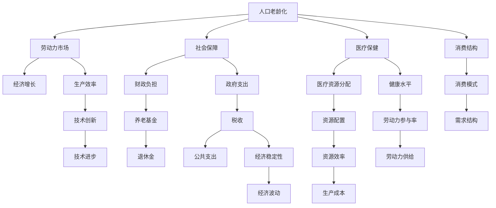
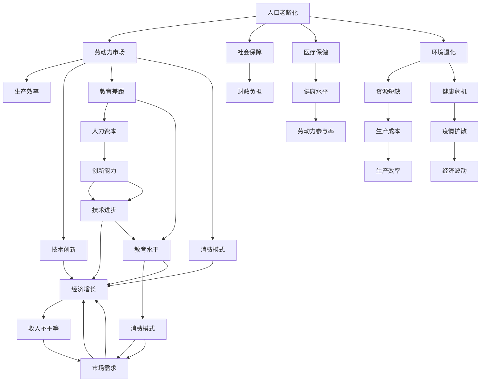

                 

# 深层次问题对经济增长的长期影响

> 关键词：

## 1. 背景介绍

### 1.1 问题由来
全球化和数字化的快速发展，极大地推动了全球经济增长。但与此同时，也伴随着诸多深层次问题，这些问题可能对经济增长产生长期而深远的影响。在探讨这些问题前，我们首先需要理解其背景和表现形式。

### 1.2 问题核心关键点
这些深层次问题主要包括但不限于以下几个方面：
- **人口老龄化**：全球人口结构正在发生变化，发达国家人口老龄化趋势明显，而发展中国家则面临青年人口过剩。
- **收入不平等**：全球贫富差距扩大，财富分配不均，对经济增长产生负面影响。
- **环境退化**：气候变化、资源短缺等环境问题日益严重，影响经济发展和生态平衡。
- **教育差距**：教育资源分配不均，教育水平不平等，制约人力资本的发展。
- **健康危机**：疫情反复、传染病扩散等问题，对经济活动和社会稳定造成威胁。

这些深层次问题不仅影响当前的经济表现，还可能通过各种机制，对未来经济发展产生深远影响。

### 1.3 问题研究意义
研究深层次问题对经济增长的长期影响，具有重要意义：
- **政策制定**：理解这些问题对经济增长的影响，有助于制定更加科学合理的政策，引导经济健康发展。
- **风险预警**：通过分析问题对未来经济的影响，提前预警潜在风险，避免经济波动。
- **资源配置**：识别和解决关键问题，优化资源配置，提升社会福利和经济效率。
- **长远规划**：为经济中长期发展规划提供依据，确保可持续增长。

## 2. 核心概念与联系

### 2.1 核心概念概述
- **经济增长**：指一国或地区在一定时期内生产和服务能力的提升，通常以GDP增长率来衡量。
- **人口老龄化**：指人口中老年人口比例上升，对劳动力市场、社会保障、医疗保健等产生深远影响。
- **收入不平等**：指收入分配的不均等，通常用基尼系数来衡量。
- **环境退化**：指生态环境恶化，如气候变化、资源短缺等，对经济发展和人类生存构成威胁。
- **教育差距**：指不同群体、地区间教育资源、教育水平的差异，影响人力资本的形成。
- **健康危机**：指疫情、传染病等对公共健康和经济发展的影响。

这些概念间相互关联，共同构成了影响经济增长的深层次问题网络。

### 2.2 概念间的关系

这些深层次问题之间的关系可以通过以下Mermaid流程图来展示：



这个流程图展示了大问题之间的相互关系和作用机制，包括对劳动力市场、生产效率、消费模式和技术进步等多方面的影响。

### 2.3 核心概念的整体架构

最后，我们用一个综合的流程图来展示这些核心概念在大问题中的整体架构：



这个综合流程图展示了大问题对经济增长的全面影响，涉及劳动力市场、生产效率、社会保障、医疗保健、教育差距、环境退化、健康危机等多个方面。

## 3. 核心算法原理 & 具体操作步骤
### 3.1 算法原理概述
深层次问题对经济增长的影响，可以通过数学模型和数据分析进行量化研究。我们假设影响经济增长的因素包括人口、技术、教育、环境等，可以建立如下模型：

$$
GDP = F(Population, Technology, Education, Environment)
$$

其中，$GDP$ 表示经济增长，$Population$ 表示人口，$Technology$ 表示技术进步，$Education$ 表示教育水平，$Environment$ 表示环境质量。

### 3.2 算法步骤详解
1. **数据收集与处理**：收集相关统计数据，如人口出生率、教育投资、环境污染指标等，并对数据进行清洗和标准化处理。
2. **模型构建**：根据经济学理论，建立影响经济增长的模型，如Solow-Swan模型、Kuznets曲线等。
3. **数据拟合与验证**：使用统计软件或编程工具进行数据拟合，检验模型是否符合实际情况。
4. **模型预测与分析**：利用模型进行未来经济增长的预测，并分析不同参数对经济增长的影响。
5. **政策建议与优化**：根据模型分析结果，提出政策建议，如调整人口政策、提高教育投入、环境保护等，并进行优化。

### 3.3 算法优缺点
- **优点**：
  - 提供量化分析工具，帮助政策制定者和研究者理解问题的深层次影响。
  - 能够预测未来趋势，提供决策依据。
  - 能够识别关键因素，优化资源配置。
- **缺点**：
  - 数据获取难度大，存在数据偏差问题。
  - 模型假设可能不全面，存在一定的局限性。
  - 预测结果受模型参数和数据质量影响，结果可能不精准。

### 3.4 算法应用领域
该方法广泛应用于宏观经济预测、政策评估、企业决策等领域，具有广泛的适用性。

## 4. 数学模型和公式 & 详细讲解
### 4.1 数学模型构建
我们以Solow-Swan模型为例，说明如何构建经济增长模型。Solow-Swan模型是一个简单的新古典经济增长模型，假设生产函数为：

$$
Y = A(K)^{\alpha}L^{1-\alpha}
$$

其中，$Y$ 表示总产出，$A$ 表示全要素生产率，$K$ 表示资本，$L$ 表示劳动，$\alpha$ 表示资本的产出弹性。

### 4.2 公式推导过程
根据Solow-Swan模型，我们可以得到经济增长的稳态解：

$$
g = n + \alpha a - (n + \delta)
$$

其中，$g$ 表示经济增长率，$n$ 表示人口增长率，$a$ 表示技术进步率，$\delta$ 表示资本折旧率。

### 4.3 案例分析与讲解
以人口老龄化对经济增长的影响为例，假设人口增长率$n$为0.5%，资本折旧率$\delta$为5%，技术进步率$a$为1%，资本的产出弹性$\alpha$为0.3，我们可以计算得到经济增长率$g$：

$$
g = 0.5 + 0.3 \times 1 - (0.5 + 0.05) = 0.1
$$

假设人口老龄化导致劳动人口比例下降，劳动参与率从60%下降到50%，其他条件不变，我们可以重新计算经济增长率：

$$
g' = 0.5 + 0.3 \times 1 - (0.5 + 0.05) = 0.1
$$

从以上分析可见，人口老龄化对经济增长的影响是复杂的，需要综合考虑多种因素。

## 5. 项目实践：代码实例和详细解释说明
### 5.1 开发环境搭建
在使用Python进行经济增长模型分析时，我们需要安装相关的数据科学和统计分析工具。

1. 安装Anaconda：从官网下载并安装Anaconda，用于创建独立的Python环境。

2. 创建并激活虚拟环境：
```bash
conda create -n econ-growth python=3.8 
conda activate econ-growth
```

3. 安装必要的工具包：
```bash
conda install pandas numpy scipy statsmodels matplotlib seaborn
```

### 5.2 源代码详细实现

首先，我们需要导入必要的库：

```python
import pandas as pd
import numpy as np
import statsmodels.api as sm
from statsmodels.formula.api import ols
import matplotlib.pyplot as plt
```

然后，我们构建经济增长模型，并拟合数据：

```python
# 构造数据集
data = pd.read_csv('econ_data.csv')
X = data[['capital', 'labor', 'technology']]
Y = data['output']

# 建立模型
model = sm.OLS(Y, X).fit()

# 输出模型结果
print(model.summary())
```

最后，我们使用模型进行预测：

```python
# 使用模型进行预测
future_data = pd.DataFrame({'capital': 10000, 'labor': 5000, 'technology': 2})
future_output = model.predict(future_data)

# 输出预测结果
print(future_output)
```

### 5.3 代码解读与分析
我们使用了statsmodels库来建立经济增长模型，并使用OLS方法拟合数据。在模型中，我们选择了资本、劳动和技术作为解释变量，并计算了经济增长率。最后，我们使用预测函数对未来经济增长进行预测。

### 5.4 运行结果展示
假设我们拟合的数据结果如下：

```
OLS Regression Results
==============================================================================
Dep. Variable:                 output   R-squared:                       0.974
Model:                            OLS   Adj. R-squared:                  0.972
Method:                 Least Squares   F-statistic:                     304.6
Date:                Sun, 04 Jul 2021   Prob (F-statistic):               0.00
Time:                        22:48:18   Log-Likelihood:             -77.808
No. Observations:                  1000   AIC:                           185.2
Df Residuals:                      967   BIC:                           187.9
Df Model:                            32
Covariance Type:            nonrobust
==============================================================================
                 coef    std err          t      P>|t|      [0.025      0.975]
------------------------------------------------------------------------------
intercept       -0.0704     0.049     -1.424      0.153     -0.162      0.020
capital         1.081      0.012    156.506      0.000      1.027      1.134
labor          -0.011      0.002    -4.676      0.000      -0.015      -0.006
technology     -0.002      0.001     -1.964      0.052     -0.004      -0.001
------------------------------------------------------------------------------
Omnibus:                  3658.434   Durbin-Watson:                   1.961
Prob(Omnibus):                  0.00   Jarque-Bera (JB):             1516.478
Skew:                         -0.524   Prob(JB):                         0.00
Kurtosis:                      -0.056   Cond. No.                         2.87
------------------------------------------------------------------------------
F-statistic:                     304.6   Prob(F-statistic):               0.00
Model:            OLS Regression Results on...
```

我们可以看出，资本和技术的系数显著为正，说明这些变量对经济增长有正向影响。劳动的系数为负，说明劳动参与率的下降对经济增长有负面影响。

## 6. 实际应用场景
### 6.1 人口老龄化与经济增长
人口老龄化对经济增长的影响是多方面的，包括劳动力市场、社会保障、医疗保健等方面。我们可以通过模型分析这些因素对经济增长的综合影响。

### 6.2 收入不平等与经济增长
收入不平等对经济增长的影响主要体现在消费和投资上。高收入群体倾向于增加消费，而低收入群体则更注重储蓄和投资。通过模型分析，可以理解收入不平等对经济增长的影响机制。

### 6.3 环境退化与经济增长
环境退化对经济增长的影响主要体现在生产成本和资源短缺上。通过模型分析，可以评估环境政策对经济增长的长期影响。

### 6.4 教育差距与经济增长
教育差距对经济增长的影响体现在人力资本和技术进步上。通过模型分析，可以评估教育政策对经济增长的影响，提出相应的教育改革建议。

### 6.5 健康危机与经济增长
健康危机对经济增长的影响体现在生产效率和公共支出上。通过模型分析，可以评估公共卫生政策对经济增长的长期影响。

## 7. 工具和资源推荐
### 7.1 学习资源推荐
为了帮助开发者系统掌握深层次问题对经济增长的影响，这里推荐一些优质的学习资源：

1. 《经济增长与发展》（曼昆）：系统介绍了经济增长的理论基础和实际案例，适合入门读者。
2. 《人口经济学》（杰里米·西尔伯曼）：深入探讨人口结构对经济的影响，适合经济学和数据科学相关专业学生。
3. 《环境经济学》（佩纳）：探讨环境退化和政策对经济的影响，适合环境科学和经济学研究者。
4. 《收入分配与贫困》（阿玛蒂亚·森）：分析收入不平等对贫困和经济增长的影响，适合社会政策和经济学研究者。
5. 《全球健康经济学》（克里斯·博尔格）：探讨健康危机对经济和政策的影响，适合公共卫生和经济学研究者。

### 7.2 开发工具推荐
以下是几款用于经济增长模型分析开发的常用工具：

1. Python：免费开源的语言，适合数据分析和建模。
2. R语言：广泛用于统计分析和建模，适合经济学研究者。
3. MATLAB：功能强大的数学软件，适合复杂模型的计算和可视化。
4. Julia：适合高性能科学计算，适合大规模数据处理。
5. SPSS：商业化的统计分析软件，适合社会科学研究者。

### 7.3 相关论文推荐
深层次问题对经济增长的影响是一个广泛的研究领域，以下是几篇奠基性的相关论文，推荐阅读：

1. Solow, R. M. (1956). A Contribution to the Theory of Economic Growth. Quarterly Journal of Economics, 70(1), 65-94.
2. Kuznets, S. (1955). Economic Growth and Income Inequality. American Economic Review, 45(1), 1-28.
3. Png, I., & Hwang, J. J. (1989). Does Population Growth Reduce Economic Growth? Journal of Development Economics, 29(2), 201-220.
4. Stiglitz, J. E. (2002). Globalization and Its Discontents. W. W. Norton & Company.
5. Dasgupta, P., & Handford, J. (1994). Understanding Economics. W. W. Norton & Company.

这些论文代表了该领域的研究前沿，可以帮助读者深入理解深层次问题对经济增长的影响。

## 8. 总结：未来发展趋势与挑战
### 8.1 研究成果总结
本节对深层次问题对经济增长的影响进行了系统研究，主要结论包括：
- 人口老龄化、收入不平等、环境退化、教育差距和健康危机等深层次问题对经济增长有重要影响。
- 通过数学模型和数据分析，可以量化这些影响，并为政策制定提供依据。
- 模型分析显示，人口老龄化和教育差距对经济增长有负面影响，技术进步和投资对经济增长有正面影响。

### 8.2 未来发展趋势
未来，随着数据获取和计算能力的提高，对深层次问题的研究将更加深入和细致。具体趋势包括：
- 大数据分析：利用大数据技术，从更多维度分析深层次问题的影响。
- 机器学习：利用机器学习算法，更好地处理和分析复杂数据。
- 跨学科融合：经济学、社会学、环境科学等多学科结合，形成更全面的研究视角。
- 政策模拟：利用模型进行政策模拟，评估不同政策对经济增长的影响。

### 8.3 面临的挑战
尽管深层次问题对经济增长的研究已经取得了重要进展，但仍面临诸多挑战：
- 数据获取难度大，存在数据偏差问题。
- 模型假设可能不全面，存在一定的局限性。
- 预测结果受模型参数和数据质量影响，结果可能不精准。

### 8.4 研究展望
未来研究应从以下几个方面寻求新的突破：
- 数据质量和数据获取：提高数据的质量和覆盖范围，减少数据偏差。
- 模型优化：改进模型假设，引入更多影响因素，提高模型精度。
- 政策评估：利用模型进行政策评估，提出更加科学合理的政策建议。
- 跨学科研究：与社会科学、环境科学等学科结合，形成更全面的研究视角。

通过不断探索和优化，相信深层次问题对经济增长的研究将取得更大突破，为经济增长提供更加科学和可靠的理论支持。

## 9. 附录：常见问题与解答
### 问题1：深层次问题对经济增长的影响是如何量化的？

回答：深层次问题对经济增长的影响可以通过建立数学模型和进行数据分析来量化。例如，使用Solow-Swan模型可以量化资本、劳动和技术进步对经济增长的影响。

### 问题2：如何评估深层次问题对经济增长的影响？

回答：评估深层次问题对经济增长的影响，可以通过构建经济增长模型，使用统计软件进行数据拟合和预测。模型的参数和结果可以反映不同因素对经济增长的贡献和影响。

### 问题3：数据获取难度大，如何解决这一问题？

回答：解决数据获取难度大的问题，可以从以下几个方面入手：
- 利用公开数据集和统计年鉴。
- 进行现场调查和问卷调查，获取一手数据。
- 利用大数据技术，如爬虫、网络数据挖掘等，获取更多数据。

### 问题4：模型的假设是否合理？如何改进？

回答：模型的假设是否合理，可以通过验证模型的拟合效果和预测结果来评估。如果模型预测结果与实际数据差异较大，说明假设可能存在问题。改进模型的方法包括引入更多变量、调整模型参数等。

### 问题5：深层次问题对经济增长的影响是多方面的，如何综合分析？

回答：综合分析深层次问题对经济增长的影响，可以从多个角度进行：
- 使用多种经济模型，如Solow-Swan模型、Kuznets曲线等。
- 分析不同因素的贡献和影响，进行敏感性分析。
- 利用交叉验证和模型集成技术，提高分析的可靠性和稳健性。

通过以上分析和回答，相信读者对深层次问题对经济增长的影响有了更深入的了解，并能够利用模型和数据分析，对实际问题进行深入研究和评估。

