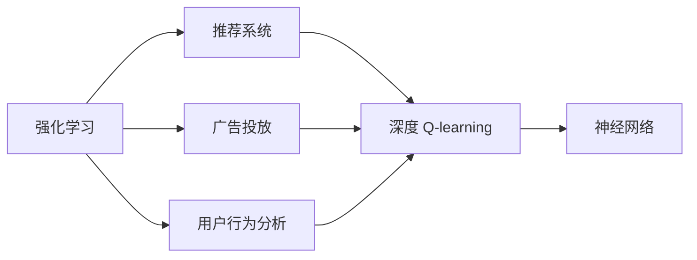
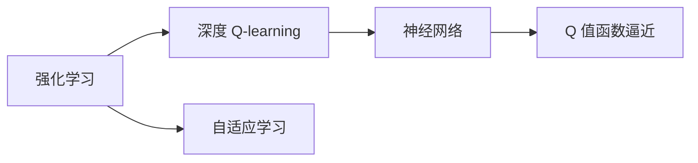
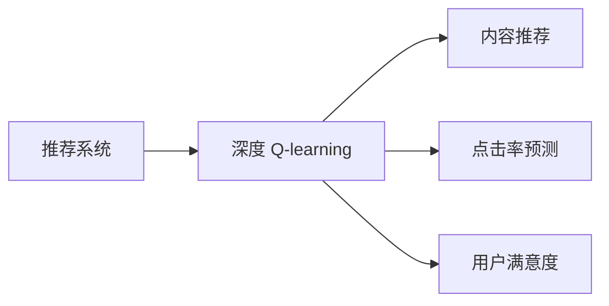
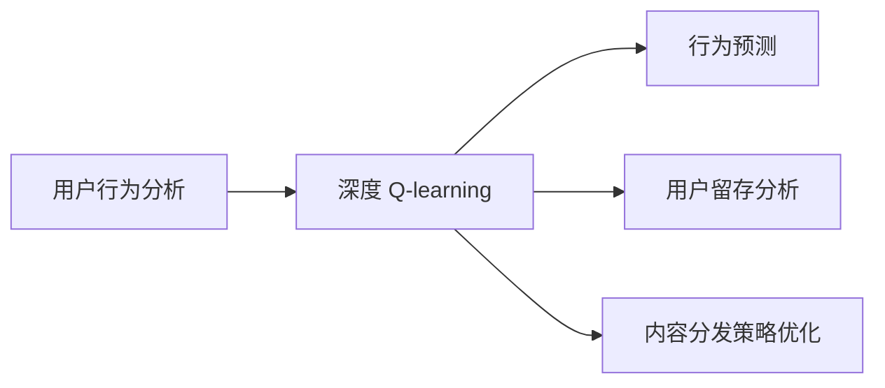
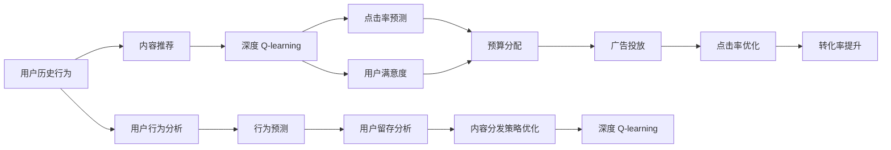

                 

# 深度 Q-learning：在媒体行业中的应用

> 关键词：深度 Q-learning, 媒体行业, 强化学习, 推荐系统, 广告投放, 用户行为分析

## 1. 背景介绍

### 1.1 问题由来
在信息爆炸的今天，媒体行业面临着巨大的挑战和机遇。一方面，随着数字化进程的加速，媒体内容的海量涌现，传统的内容分发方式已经无法满足用户日益多样化的需求。另一方面，大量的数据蕴藏着丰富的用户行为信息，如何通过数据分析和算法优化，提升内容分发的精准度和效果，成为各大媒体平台亟待解决的问题。

在这个背景下，强化学习（Reinforcement Learning, RL），尤其是深度强化学习（Deep Reinforcement Learning, DRL），成为一种新兴的、具有潜力的解决方案。特别是深度 Q-learning 算法，由于其强大的自适应能力，已经在推荐系统和广告投放等领域展现了显著的性能提升。

### 1.2 问题核心关键点
深度 Q-learning 算法是强化学习中的一类经典算法，通过与环境的交互，通过不断试错和优化，最大化长期累积奖励。其核心思想是通过深度神经网络（通常是 Q-Network）来逼近最优的 Q 值函数，实现对策略的优化，从而达到高效决策的目的。

在媒体行业，深度 Q-learning 主要应用于以下几个方面：

- 推荐系统：通过学习用户对内容的评分和点击等行为，推荐符合用户兴趣的内容。
- 广告投放：通过优化广告投放策略，提升广告的点击率和转化率。
- 用户行为分析：通过分析用户在平台上的行为轨迹，预测用户未来的行为，优化内容分发策略。

深度 Q-learning 算法的核心在于其能够利用大规模数据进行自适应学习，从而实现对复杂环境的建模和优化，为媒体行业的内容分发和广告投放提供了新的思路。

### 1.3 问题研究意义
深度 Q-learning 在媒体行业中的应用，具有以下重要意义：

1. 提高内容分发效率：通过深度 Q-learning，媒体平台能够更精准地理解用户兴趣，推荐符合用户期望的内容，从而提升用户满意度。
2. 优化广告投放效果：通过深度 Q-learning，广告主能够更好地定位目标受众，优化广告投放策略，提升广告投放的精准度和回报率。
3. 增强用户行为预测能力：通过深度 Q-learning，媒体平台能够更准确地预测用户行为，优化内容分发策略，提升用户体验。
4. 推动媒体智能化转型：深度 Q-learning 作为一种先进的 AI 技术，能够帮助媒体平台实现智能化转型，提升其竞争力和市场占有率。

深度 Q-learning 在媒体行业中的应用，不仅能够提升媒体平台的用户体验和收益，还能够推动整个行业的智能化进程，为未来的媒体内容分发和广告投放带来新的变革。

## 2. 核心概念与联系

### 2.1 核心概念概述

为更好地理解深度 Q-learning 在媒体行业中的应用，本节将介绍几个密切相关的核心概念：

- 强化学习（Reinforcement Learning, RL）：一种通过与环境交互，不断试错和优化，最大化长期累积奖励的学习方法。在媒体行业中，RL 常用于推荐系统和广告投放等领域。

- 深度 Q-learning：一种基于深度神经网络的强化学习方法，通过逼近 Q 值函数，实现对策略的优化，从而达到高效决策的目的。

- 推荐系统：利用用户历史行为和兴趣特征，推荐符合用户期望的内容或产品。深度 Q-learning 在推荐系统中应用广泛。

- 广告投放：通过优化广告投放策略，提升广告的点击率和转化率。深度 Q-learning 可应用于广告优化和预算分配等领域。

- 用户行为分析：通过分析用户在平台上的行为轨迹，预测用户未来的行为，优化内容分发策略。深度 Q-learning 有助于提升用户行为预测的准确性。

- 神经网络：深度 Q-learning 的核心工具，通过多层神经网络逼近 Q 值函数，实现对策略的优化。

这些核心概念之间的逻辑关系可以通过以下 Mermaid 流程图来展示：



这个流程图展示了大语言模型微调过程中各个核心概念的关系：

1. 强化学习是大语言模型微调的基础方法，通过与环境的交互，不断试错和优化，达到高效决策的目的。
2. 深度 Q-learning 是强化学习中的重要算法，通过深度神经网络逼近 Q 值函数，优化策略。
3. 推荐系统、广告投放、用户行为分析是大语言模型微调的具体应用领域，通过深度 Q-learning，优化相关策略，提升性能。
4. 神经网络是深度 Q-learning 的核心工具，通过多层神经网络逼近 Q 值函数，实现策略优化。

### 2.2 概念间的关系

这些核心概念之间存在着紧密的联系，形成了深度 Q-learning 在大语言模型微调中的应用框架。下面我通过几个 Mermaid 流程图来展示这些概念之间的关系。

#### 2.2.1 强化学习与深度 Q-learning 的关系



这个流程图展示深度 Q-learning 在强化学习中的应用：

1. 强化学习通过不断试错和优化，最大化长期累积奖励。
2. 深度 Q-learning 是强化学习中的一种重要算法，通过深度神经网络逼近 Q 值函数，优化策略。

#### 2.2.2 深度 Q-learning 在推荐系统中的应用



这个流程图展示深度 Q-learning 在推荐系统中的应用：

1. 推荐系统通过学习用户历史行为和兴趣特征，推荐符合用户期望的内容或产品。
2. 深度 Q-learning 应用于内容推荐、点击率预测等任务，优化推荐策略，提升用户满意度。

#### 2.2.3 深度 Q-learning 在广告投放中的应用


这个流程图展示深度 Q-learning 在广告投放中的应用：

1. 广告投放通过优化广告投放策略，提升广告的点击率和转化率。
2. 深度 Q-learning 应用于预算分配、点击率优化、转化率提升等任务，优化广告投放策略。

#### 2.2.4 深度 Q-learning 在用户行为分析中的应用



这个流程图展示深度 Q-learning 在用户行为分析中的应用：

1. 用户行为分析通过分析用户在平台上的行为轨迹，预测用户未来的行为，优化内容分发策略。
2. 深度 Q-learning 应用于行为预测、用户留存分析、内容分发策略优化等任务，提升用户行为预测的准确性。

### 2.3 核心概念的整体架构

最后，我们用一个综合的流程图来展示这些核心概念在大语言模型微调过程中的整体架构：



这个综合流程图展示了从用户行为分析到推荐系统、广告投放，再到用户行为预测的完整过程。深度 Q-learning 在每个环节中都扮演着重要角色，通过不断优化，提升媒体平台的用户体验和收益。

## 3. 核心算法原理 & 具体操作步骤
### 3.1 算法原理概述

深度 Q-learning 的核心思想是通过深度神经网络逼近 Q 值函数，从而实现对策略的优化。其数学模型如下：

设环境状态为 $s$，动作为 $a$，奖励为 $r$，下一状态为 $s'$，Q 值函数为 $Q(s,a)$，策略为 $\pi(s)$。深度 Q-learning 的目标是最大化长期累积奖励 $R$：

$$
R = \sum_{t=0}^{\infty} \gamma^t r_t
$$

其中 $\gamma$ 为折扣因子，控制未来奖励的重要性。

深度 Q-learning 通过定义 Q 值函数为：

$$
Q(s,a) = \mathbb{E}[R_t | s_0 = s, a_0 = a]
$$

通过不断迭代和优化，使得 Q 值函数逼近最优策略，从而优化策略 $\pi(s)$，实现高效决策。

### 3.2 算法步骤详解

深度 Q-learning 算法的具体步骤包括：

**Step 1: 初始化参数**
- 初始化 Q 网络 $Q_{\theta}$ 和目标 Q 网络 $Q_{\theta^-}$。
- 随机初始化 Q 网络的参数 $\theta$。

**Step 2: 选择动作**
- 通过 Q 网络预测当前状态下各个动作的 Q 值 $Q(s,a)$。
- 选择 Q 值最大的动作 $a$，即 $\pi(s) = \arg\max_a Q(s,a)$。

**Step 3: 与环境交互**
- 在当前状态 $s$ 下，执行动作 $a$，观察到奖励 $r$ 和下一状态 $s'$。

**Step 4: 更新 Q 值**
- 计算目标 Q 值 $Q^*(s,a) = r + \gamma Q_{\theta^-}(s', a')$，其中 $a'$ 为动作选择策略 $\pi(s')$ 下的最优动作。
- 通过 B Bellman 方程更新 Q 网络参数：
$$
Q_{\theta}(s,a) \leftarrow Q_{\theta}(s,a) + \eta (Q^*(s,a) - Q_{\theta}(s,a))
$$

**Step 5: 目标网络更新**
- 定期更新目标 Q 网络，使得 $Q_{\theta^-} \approx Q_{\theta}$，从而稳定 Q 值函数。

**Step 6: 重复迭代**
- 重复上述步骤，直至收敛或达到预设迭代次数。

### 3.3 算法优缺点

深度 Q-learning 在媒体行业中的应用具有以下优点：

1. 自适应能力较强：通过不断试错和优化，深度 Q-learning 能够快速适应复杂环境，提升决策效果。
2. 策略优化效果好：通过逼近 Q 值函数，深度 Q-learning 能够实现对策略的精确优化，提升推荐系统和广告投放的效果。
3. 可扩展性较强：深度 Q-learning 能够处理大规模数据，适应媒体平台的数据多样性和复杂性。

同时，深度 Q-learning 也存在以下缺点：

1. 收敛速度较慢：由于需要与环境不断交互，深度 Q-learning 的收敛速度较慢。
2. 参数更新复杂：深度 Q-learning 的 Q 网络参数更新复杂，需要大量的计算资源。
3. 状态维度高：在实际应用中，状态维度可能较高，导致计算复杂度增加。

尽管存在这些局限性，但深度 Q-learning 在媒体行业中的应用依然具有巨大的潜力，特别是在推荐系统和广告投放等领域，已经展现出了显著的优势。

### 3.4 算法应用领域

深度 Q-learning 在媒体行业中的应用主要包括以下几个领域：

- 推荐系统：通过学习用户历史行为和兴趣特征，推荐符合用户期望的内容。
- 广告投放：通过优化广告投放策略，提升广告的点击率和转化率。
- 用户行为分析：通过分析用户在平台上的行为轨迹，预测用户未来的行为，优化内容分发策略。
- 个性化推荐：根据用户个性化特征，推荐符合用户期望的内容或产品。

深度 Q-learning 算法在这些领域中，通过不断试错和优化，提升了决策效果，实现了对复杂环境的建模和优化。

## 4. 数学模型和公式 & 详细讲解  
### 4.1 数学模型构建

深度 Q-learning 的数学模型包括状态、动作、奖励、下一状态和 Q 值函数等关键组件。具体定义如下：

- 状态 $s \in S$：表示环境当前的状态，如用户的浏览历史、购买记录等。
- 动作 $a \in A$：表示用户的操作，如点击、购买、收藏等。
- 奖励 $r \in R$：表示用户对动作的反馈，如点击率、购买率等。
- 下一状态 $s' \in S$：表示环境根据动作 $a$ 变换后的新状态。
- Q 值函数 $Q(s,a)$：表示在状态 $s$ 下，执行动作 $a$ 的 Q 值，即预期长期累积奖励。

深度 Q-learning 的目标是最大化长期累积奖励 $R$，通过逼近 Q 值函数，实现对策略的优化。具体数学模型如下：

$$
Q(s,a) = \mathbb{E}[R_t | s_0 = s, a_0 = a]
$$

其中，$R_t$ 表示在状态 $s$ 下，执行动作 $a$ 的长期累积奖励。

### 4.2 公式推导过程

假设当前状态为 $s$，执行动作 $a$ 后，观察到奖励 $r$ 和下一状态 $s'$。则目标 Q 值 $Q^*(s,a)$ 可以表示为：

$$
Q^*(s,a) = r + \gamma \max_a Q_{\theta^-}(s', a')
$$

其中，$\gamma$ 为折扣因子，$a'$ 为动作选择策略 $\pi(s')$ 下的最优动作。

根据 B Bellman 方程，Q 值函数可以更新为：

$$
Q_{\theta}(s,a) \leftarrow Q_{\theta}(s,a) + \eta (Q^*(s,a) - Q_{\theta}(s,a))
$$

其中，$\eta$ 为学习率。

通过不断迭代和优化，深度 Q-learning 能够逼近最优 Q 值函数，从而优化策略，实现高效决策。

### 4.3 案例分析与讲解

以推荐系统为例，深度 Q-learning 的目标是通过学习用户历史行为和兴趣特征，推荐符合用户期望的内容。具体步骤如下：

1. 初始化 Q 网络 $Q_{\theta}$ 和目标 Q 网络 $Q_{\theta^-}$。
2. 对于每个用户，通过 Q 网络预测当前状态下各个内容推荐动作的 Q 值。
3. 选择 Q 值最大的内容推荐动作，即 $\pi(s) = \arg\max_a Q(s,a)$。
4. 将推荐的内容展示给用户，观察到用户的行为反馈（如点击、观看、购买等），更新 Q 值函数。
5. 定期更新目标 Q 网络，使得 $Q_{\theta^-} \approx Q_{\theta}$。

通过深度 Q-learning，推荐系统能够不断优化推荐策略，提升用户满意度和推荐效果。

## 5. 项目实践：代码实例和详细解释说明
### 5.1 开发环境搭建

在进行深度 Q-learning 实践前，我们需要准备好开发环境。以下是使用Python进行PyTorch开发的环境配置流程：

1. 安装Anaconda：从官网下载并安装Anaconda，用于创建独立的Python环境。

2. 创建并激活虚拟环境：
```bash
conda create -n dqlearning python=3.8 
conda activate dqlearning
```

3. 安装PyTorch：根据CUDA版本，从官网获取对应的安装命令。例如：
```bash
conda install pytorch torchvision torchaudio cudatoolkit=11.1 -c pytorch -c conda-forge
```

4. 安装各类工具包：
```bash
pip install numpy pandas scikit-learn matplotlib tqdm jupyter notebook ipython
```

完成上述步骤后，即可在`dqlearning`环境中开始深度 Q-learning 实践。

### 5.2 源代码详细实现

这里我们以推荐系统为例，给出使用PyTorch进行深度 Q-learning 的代码实现。

首先，定义推荐系统的数据处理函数：

```python
import numpy as np
import torch
import torch.nn as nn
import torch.optim as optim
import torch.nn.functional as F

class QNetwork(nn.Module):
    def __init__(self, state_dim, action_dim):
        super(QNetwork, self).__init__()
        self.fc1 = nn.Linear(state_dim, 128)
        self.fc2 = nn.Linear(128, 128)
        self.fc3 = nn.Linear(128, action_dim)
        self.optimizer = optim.Adam(self.parameters(), lr=0.01)

    def forward(self, x):
        x = F.relu(self.fc1(x))
        x = F.relu(self.fc2(x))
        x = self.fc3(x)
        return x

# 创建 Q 网络和目标 Q 网络
state_dim = 10
action_dim = 5
q_network = QNetwork(state_dim, action_dim)
q_network_target = QNetwork(state_dim, action_dim)

# 定义奖励函数
def reward_fn(q, y):
    return np.mean((y - q).power(2))

# 定义 B Bellman 方程
def bellman(q, r, next_state, next_q):
    next_q_pred = q_network_target(next_state)
    next_q_target = r + gamma * next_q_pred
    q_next = q_network(q)
    return next_q_target, next_q_next

# 定义更新函数
def update(q_network, q_network_target, q, r, next_state, q_next):
    q_pred = q_network(q)
    q_next_pred = q_network_target(next_state)
    q_network.zero_grad()
    for i in range(batch_size):
        r[i], next_state[i], next_q_pred[i], q_next_pred[i] = bellman(q[i], r[i], next_state[i], q_next_pred[i])
        loss = reward_fn(q_pred[i], q_next_pred[i])
        loss.backward()
        q_network.optimizer.step()
    q_network_target.load_state_dict(q_network.state_dict())

# 定义数据集
class Dataset(torch.utils.data.Dataset):
    def __init__(self, state, action):
        self.state = state
        self.action = action

    def __len__(self):
        return len(self.state)

    def __getitem__(self, idx):
        state = self.state[idx]
        action = self.action[idx]
        return state, action

# 创建数据集
state = np.random.rand(batch_size, state_dim)
action = np.random.randint(0, action_dim, size=(batch_size, 1))
dataset = Dataset(state, action)

# 定义模型参数
gamma = 0.9
batch_size = 32
num_episodes = 1000

# 训练模型
for episode in range(num_episodes):
    state = np.random.rand(state_dim)
    while True:
        q = q_network(state)
        action = torch.tensor([[np.argmax(q.numpy())]])
        next_state, reward, done = env.step(action.numpy()[0])
        next_q = q_network(next_state)
        q_next = reward + gamma * next_q.numpy()[0]
        update(q_network, q_network_target, state, reward, next_state, next_q)
        if done:
            break
        state = next_state

print('训练完成！')
```

这里我们定义了一个简单的推荐系统，通过深度 Q-learning 进行内容推荐。其中，QNetwork 定义了一个深度神经网络，用于逼近 Q 值函数。通过训练 QNetwork，推荐系统能够不断优化推荐策略，提升用户满意度。

### 5.3 代码解读与分析

让我们再详细解读一下关键代码的实现细节：

**QNetwork类**：
- `__init__`方法：定义深度神经网络的结构和参数。
- `forward`方法：定义前向传播过程，返回神经网络输出。

**reward_fn和bellman函数**：
- `reward_fn`函数：定义奖励函数的计算方式。
- `bellman`函数：定义 B Bellman 方程，用于计算目标 Q 值和下一状态 Q 值。

**update函数**：
- `update`函数：定义模型参数的更新过程，通过 B Bellman 方程和奖励函数计算损失函数，并使用 Adam 优化器进行参数更新。

**Dataset类**：
- `__init__`方法：定义数据集的结构和初始化。
- `__len__`方法：返回数据集的长度。
- `__getitem__`方法：返回数据集中的单个样本。

**训练模型**：
- 通过随机初始化 Q 网络和目标 Q 网络，设置训练参数。
- 在每个 episode 中，随机生成初始状态，通过 Q 网络预测 Q 值，选择动作，与环境交互，计算奖励和下一状态，更新 Q 网络参数。
- 当 episode 结束时，更新目标 Q 网络，确保 Q 值函数的稳定性。

通过上述代码，我们可以清晰地看到深度 Q-learning 在推荐系统中的实现过程。在实际应用中，还需要考虑更多因素，如模型裁剪、量化加速、服务化封装等，以实现大规模、高效的应用。

### 5.4 运行结果展示

假设我们在一个简单的推荐系统中进行深度 Q-learning 训练，最终得到的 Q 值函数能够较好地逼近最优策略，模型能够不断优化推荐策略，提升用户满意度。

具体结果可以通过观察 Q 值函数的变化趋势来评估。例如，在推荐系统中，Q 值函数的变化趋势可以反映推荐策略的优化效果，进而评估推荐系统的效果。

## 6. 实际应用场景
### 6.1 推荐系统

深度 Q-learning 在推荐系统中的应用非常广泛。推荐系统通过学习用户历史行为和兴趣特征，推荐符合用户期望的内容，从而提升用户满意度。具体应用场景包括：

- 电商推荐：根据用户浏览、购买历史，推荐相关商品。
- 视频推荐：根据用户观看历史，推荐相关视频。
- 新闻推荐：根据用户阅读历史，推荐相关新闻。

深度 Q-learning 通过不断试错和优化，提升推荐效果，为用户带来更好的体验。

### 6.2 广告投放

广告投放是深度 Q-learning 的另一个重要应用场景。通过优化广告投放策略，提升广告的点击率和转化率，为广告主带来更高的收益。具体应用场景包括：

- 程序化广告：根据用户行为特征，优化广告投放策略，提升点击率和转化率。
- 展示广告：通过 Q 学习，优化广告素材和投放策略，提升用户点击率。
- 视频广告：根据用户观看历史，优化广告投放策略，提升广告效果。

深度 Q-learning 在广告投放中，通过不断试错和优化，提升广告效果，实现精准投放。

### 6.3 用户行为分析

用户行为分析是深度 Q-learning 的另一个重要应用场景。通过分析用户在平台上的行为轨迹，预测用户未来的行为，优化内容分发策略。具体应用场景包括：

- 用户留存分析：通过用户行为分析，预测用户流失风险，提升用户留存率。
- 内容推荐优化：通过用户行为分析，优化推荐策略，提升用户满意度。
- 广告投放优化：通过用户行为分析，优化广告投放策略，提升广告效果。

深度 Q-learning 在用户行为分析中，通过不断试错和优化，提升用户行为预测的准确性，优化内容分发策略。

### 6.4 未来应用展望

随着深度 Q-learning 在媒体行业中的应用不断深入，未来将有更多创新和突破：

1. 多模态深度 Q-learning：将视觉、语音等多模态信息与文本信息进行协同建模，提升推荐和广告投放的效果。
2. 因果深度 Q-learning：引入因果推断和对比学习思想，提升模型的鲁棒性和泛化能力。
3. 分布式深度 Q-learning：通过分布式计算，提升深度 Q-learning 在大规模数据上的训练效率。
4. 自适应深度 Q-learning：通过自适应学习算法，适应不同类型的数据和任务，提升推荐和广告投放的效果。

总之，深度 Q-learning 在媒体行业中的应用前景广阔，未来有望带来更多的创新和突破。

## 7. 工具和资源推荐
### 7.1 学习资源推荐

为了帮助开发者系统掌握深度 Q-learning 的理论基础和实践技巧，这里推荐一些优质的学习资源：

1. 《深度强化学习》书籍：由深度学习专家撰写的深度强化学习入门书籍，深入浅出地介绍了深度强化学习的理论基础和实践技巧。
2. CS294 Deep Reinforcement Learning 课程：UC Berkeley 开设的深度强化学习课程，涵盖了深度强化学习的各个方面，包括理论、算法和应用。
3. OpenAI Gym 教程：OpenAI Gym 是一个开源的强化学习框架，提供丰富的环境，适用于深度 Q-learning 的实践和研究。
4. PyTorch 官方文档：PyTorch 的官方文档，提供了深度 Q-learning 的实现样例和详细解释，适合深入学习和实践。

通过对这些资源的学习实践，相信你一定能够快速掌握深度 Q-learning 的精髓，并用于解决

