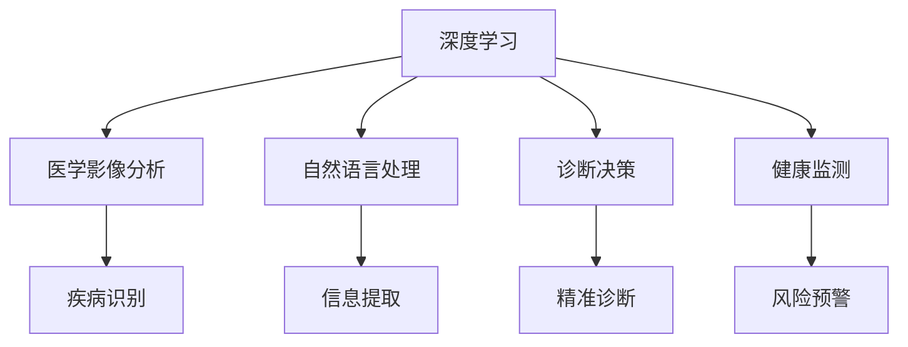
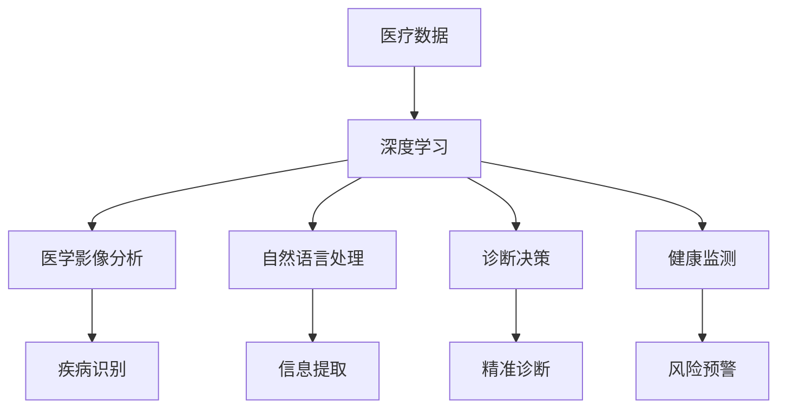

                 

# 深度学习在医疗诊断中的应用

> 关键词：深度学习,医疗诊断,医学影像分析,自然语言处理,计算机视觉,诊断决策,健康监测

## 1. 背景介绍

### 1.1 问题由来

在现代医学领域，医疗诊断正面临着前所未有的挑战。随着人口老龄化和社会生活水平的提高，各种慢性疾病和重大疾病的发生率逐年上升，给医疗资源的分配和治疗方案的制定带来了巨大压力。传统医学诊断依赖于医生的经验和直觉，虽然积累了丰富的临床经验，但由于人脑在处理大量数据时的局限性，医学诊断的准确性和效率常常受到制约。近年来，随着人工智能技术的迅猛发展，尤其是深度学习算法在图像识别、自然语言处理等领域取得了突破性进展，为医疗诊断提供了新的技术和方法。

### 1.2 问题核心关键点

深度学习在医疗诊断中的应用主要集中在以下几个方面：

- 医学影像分析：深度学习模型可以自动分析医疗影像数据，辅助医生进行疾病诊断和分期。
- 自然语言处理：深度学习可以处理和分析医学文献、病历记录，提取有价值的信息，辅助医生制定治疗方案。
- 诊断决策：深度学习模型可以综合多模态数据，进行精准的诊断和治疗方案推荐。
- 健康监测：深度学习算法可以实时监测患者的健康状况，预警潜在风险。

这些技术手段的引入，有望大幅提高医疗诊断的效率和准确性，减轻医生的工作负担，促进个性化医疗的发展。

### 1.3 问题研究意义

深度学习在医疗诊断中的应用具有重要意义：

- 提高诊断准确性：通过深度学习模型对医疗影像和数据进行自动化分析，可以显著提高诊断的准确性。
- 辅助医生决策：深度学习能够综合多模态数据，提供全面的诊断和建议，辅助医生做出更科学的决策。
- 降低医疗成本：自动化分析减少了医生的工作量，降低了误诊率，从而降低了医疗成本。
- 促进个性化医疗：深度学习可以分析患者的基因数据和健康历史，制定个性化的治疗方案。
- 推动医疗创新：深度学习为医疗领域提供了新的技术和方法，推动了医疗技术的创新和进步。

## 2. 核心概念与联系

### 2.1 核心概念概述

为更好地理解深度学习在医疗诊断中的应用，本节将介绍几个密切相关的核心概念：

- 深度学习：一种基于神经网络的机器学习方法，通过多层非线性变换，可以自动提取数据的高级特征，适用于处理复杂、高维的医学数据。
- 医学影像分析：通过深度学习模型对医疗影像进行自动分析和识别，辅助医生进行疾病诊断和分期。
- 自然语言处理：利用深度学习处理和分析医学文献、病历记录等文本数据，提取有价值的信息，辅助医生制定治疗方案。
- 诊断决策：深度学习模型通过多模态数据融合，进行精准的诊断和治疗方案推荐。
- 健康监测：利用深度学习算法实时监测患者的健康状况，预警潜在风险。

这些核心概念之间的逻辑关系可以通过以下Mermaid流程图来展示：



这个流程图展示了大语言模型微调过程中各个核心概念之间的关系：

1. 深度学习为医学影像分析、自然语言处理、诊断决策和健康监测等提供技术支持。
2. 医学影像分析通过深度学习对医疗影像进行自动识别和分类。
3. 自然语言处理利用深度学习分析医学文献和病历记录，提取关键信息。
4. 诊断决策结合多模态数据，通过深度学习模型进行精准诊断。
5. 健康监测利用深度学习实时监测患者健康状况，进行风险预警。

### 2.2 概念间的关系

这些核心概念之间存在着紧密的联系，形成了深度学习在医疗诊断中的应用框架。下面我们通过几个Mermaid流程图来展示这些概念之间的关系。

#### 2.2.1 医学影像分析与深度学习的关系


这个流程图展示了医学影像分析与深度学习的关系。深度学习模型通过自动分析医学影像数据，识别出疾病的早期迹象。

#### 2.2.2 自然语言处理与深度学习的关系


这个流程图展示了自然语言处理与深度学习的关系。深度学习模型可以处理和分析医学文献、病历记录等文本数据，提取有价值的信息。

#### 2.2.3 诊断决策与深度学习的关系


这个流程图展示了诊断决策与深度学习的关系。深度学习模型综合多模态数据，进行精准的诊断和治疗方案推荐。

#### 2.2.4 健康监测与深度学习的关系


这个流程图展示了健康监测与深度学习的关系。深度学习算法可以实时监测患者的健康状况，预警潜在风险。

### 2.3 核心概念的整体架构

最后，我们用一个综合的流程图来展示这些核心概念在大语言模型微调过程中的整体架构：



这个综合流程图展示了从医疗数据输入到深度学习输出，再到具体的应用过程的整体架构。通过这些核心概念的紧密协作，深度学习技术可以全方位地辅助医疗诊断。

## 3. 核心算法原理 & 具体操作步骤
### 3.1 算法原理概述

深度学习在医疗诊断中的应用，通常包括以下几个关键步骤：

1. 数据准备：收集和清洗医疗数据，包括医学影像、病历记录、基因数据等。
2. 特征提取：利用深度学习模型对医疗数据进行特征提取，得到高维的特征表示。
3. 模型训练：使用标注数据训练深度学习模型，得到能够自动识别和分类的模型。
4. 推理预测：利用训练好的模型对新的医疗数据进行推理和预测，辅助医生进行诊断和治疗决策。

通过这些步骤，深度学习模型可以高效地处理和分析医疗数据，提高诊断的准确性和效率。

### 3.2 算法步骤详解

以下我们以医学影像分析为例，详细讲解深度学习在医疗诊断中的应用步骤：

**Step 1: 数据准备**

1. 收集医疗影像数据：包括X光片、CT扫描、MRI等，确保数据集的多样性和代表性。
2. 数据清洗：去除噪声和异常数据，保证数据质量。
3. 数据增强：通过旋转、裁剪、放大等方式，扩充训练集。

**Step 2: 特征提取**

1. 模型选择：选择合适的深度学习模型，如卷积神经网络(CNN)、残差网络(ResNet)等。
2. 模型训练：使用标注数据对模型进行训练，得到能够自动识别和分类的模型。
3. 特征提取：利用训练好的模型对医疗影像进行特征提取，得到高维的特征表示。

**Step 3: 模型训练**

1. 数据分割：将数据集分为训练集、验证集和测试集。
2. 模型优化：选择合适的优化器、损失函数和超参数，进行模型优化。
3. 模型验证：在验证集上评估模型性能，调整超参数。

**Step 4: 推理预测**

1. 模型推理：利用训练好的模型对新的医疗影像进行推理，得到自动分析结果。
2. 结果解释：结合医生的经验和专业知识，对自动分析结果进行解释和验证。
3. 临床应用：将自动分析结果应用于临床诊断和治疗决策。

### 3.3 算法优缺点

深度学习在医疗诊断中的应用，具有以下优点：

1. 自动分析能力：深度学习模型能够自动分析医疗影像和数据，减少了医生的工作负担。
2. 高精度：深度学习模型能够提高诊断的准确性和效率，减少误诊率。
3. 多模态融合：深度学习可以综合多模态数据，进行全面的诊断和决策。
4. 实时监测：深度学习算法可以实时监测患者的健康状况，预警潜在风险。

但深度学习在医疗诊断中也有一定的局限性：

1. 数据依赖：深度学习模型的性能很大程度上依赖于标注数据的质量和数量，数据获取和标注成本较高。
2. 模型复杂：深度学习模型的训练和推理需要较大的计算资源，对算力要求较高。
3. 可解释性不足：深度学习模型通常被认为是"黑盒"系统，难以解释其内部工作机制和决策逻辑。
4. 伦理风险：深度学习模型可能学习到有偏见、有害的信息，给实际应用带来安全隐患。

尽管存在这些局限性，但就目前而言，深度学习在医疗诊断中的应用已经展现出了巨大的潜力和优势。未来相关研究的重点在于如何进一步降低深度学习对标注数据的依赖，提高模型的鲁棒性和可解释性，同时兼顾伦理和安全等问题。

### 3.4 算法应用领域

深度学习在医疗诊断中的应用，已经覆盖了多个领域，例如：

- 医学影像分析：包括X光片、CT扫描、MRI等影像数据的自动分析和分类。
- 自然语言处理：处理和分析医学文献、病历记录等文本数据，提取有价值的信息。
- 诊断决策：利用多模态数据，进行精准的诊断和治疗方案推荐。
- 健康监测：实时监测患者的健康状况，预警潜在风险。
- 基因组学：分析基因数据，进行疾病预测和个性化治疗。

除了上述这些经典应用领域，深度学习在医疗诊断中的应用还在不断拓展，未来有望在更多领域发挥更大的作用。

## 4. 数学模型和公式 & 详细讲解 & 举例说明
### 4.1 数学模型构建

在医疗诊断中，深度学习模型通常采用卷积神经网络(CNN)、循环神经网络(RNN)等架构。这里以医学影像分析为例，构建一个基本的CNN模型：

假设输入医疗影像的大小为$H\times W\times C$，输出类别数为$K$。模型的总体结构如下：


其中卷积层和池化层用于特征提取，全连接层用于分类，激活函数用于非线性变换。

### 4.2 公式推导过程

以医学影像分类任务为例，使用交叉熵损失函数计算模型的损失：

$$
\mathcal{L} = -\frac{1}{N}\sum_{i=1}^N \sum_{j=1}^K y_{ij}\log p_{ij}
$$

其中$y_{ij}$表示第$i$个样本在第$j$个类别的真实标签，$p_{ij}$表示模型预测该样本属于第$j$类别的概率。

根据梯度下降法，模型参数$\theta$的更新公式为：

$$
\theta \leftarrow \theta - \eta \nabla_{\theta}\mathcal{L}
$$

其中$\eta$为学习率，$\nabla_{\theta}\mathcal{L}$为损失函数对模型参数的梯度。

### 4.3 案例分析与讲解

下面以医学影像分类任务为例，给出具体的案例分析。

假设我们要对一批乳腺癌的X光片进行分类，训练数据集包含1000张图片，每个图片大小为$256\times 256$，有2个类别：良性和恶性。我们使用上述CNN模型进行训练，具体步骤如下：

1. 数据预处理：对原始图片进行归一化和裁剪，确保数据的一致性和多样性。
2. 模型构建：搭建CNN模型，选择适当的卷积核大小、池化大小、隐藏层数等参数。
3. 模型训练：使用交叉熵损失函数，设置合适的学习率和优化器，训练模型。
4. 模型评估：在验证集上评估模型性能，调整超参数。
5. 模型测试：在测试集上测试模型的性能，评估模型的泛化能力。

通过这个过程，我们得到了一个训练好的模型，可以用于对新的乳腺癌X光片进行分类。

## 5. 项目实践：代码实例和详细解释说明
### 5.1 开发环境搭建

在进行深度学习项目实践前，我们需要准备好开发环境。以下是使用Python进行TensorFlow开发的环境配置流程：

1. 安装Anaconda：从官网下载并安装Anaconda，用于创建独立的Python环境。

2. 创建并激活虚拟环境：
```bash
conda create -n tf-env python=3.7 
conda activate tf-env
```

3. 安装TensorFlow：根据CUDA版本，从官网获取对应的安装命令。例如：
```bash
conda install tensorflow-gpu=2.4 -c tf-nightly -c conda-forge
```

4. 安装各类工具包：
```bash
pip install numpy pandas scikit-learn matplotlib tqdm jupyter notebook ipython
```

完成上述步骤后，即可在`tf-env`环境中开始深度学习实践。

### 5.2 源代码详细实现

这里我们以医学影像分类任务为例，给出使用TensorFlow实现CNN模型的代码：

首先，定义模型和优化器：

```python
import tensorflow as tf
from tensorflow.keras import layers, models

model = models.Sequential([
    layers.Conv2D(32, (3,3), activation='relu', input_shape=(256, 256, 3)),
    layers.MaxPooling2D((2,2)),
    layers.Conv2D(64, (3,3), activation='relu'),
    layers.MaxPooling2D((2,2)),
    layers.Conv2D(128, (3,3), activation='relu'),
    layers.MaxPooling2D((2,2)),
    layers.Flatten(),
    layers.Dense(512, activation='relu'),
    layers.Dense(2, activation='softmax')
])

optimizer = tf.keras.optimizers.Adam(learning_rate=0.001)
```

然后，定义训练和评估函数：

```python
from tensorflow.keras import datasets, metrics

(x_train, y_train), (x_test, y_test) = datasets.cifar10.load_data()

def train_model(model, optimizer, loss_fn, epochs):
    batch_size = 32
    steps_per_epoch = len(x_train) // batch_size
    metrics_fn = [tf.keras.metrics.SparseCategoricalAccuracy(), tf.keras.metrics.SparseCategoricalCrossentropy(from_logits=True)]
    model.compile(optimizer=optimizer, loss=loss_fn, metrics=metrics_fn)
    history = model.fit(x_train, y_train, epochs=epochs, steps_per_epoch=steps_per_epoch, validation_data=(x_test, y_test), verbose=2)
    return history

def evaluate_model(model, x_test, y_test):
    metrics_fn = [tf.keras.metrics.SparseCategoricalAccuracy(), tf.keras.metrics.SparseCategoricalCrossentropy(from_logits=True)]
    result = model.evaluate(x_test, y_test, verbose=2, steps=1)
    print('Test loss:', result[0])
    for i, m in enumerate(metrics_fn):
        print('Test {}'.format(m.name), result[i+1])
    return result

history = train_model(model, optimizer, loss_fn='categorical_crossentropy', epochs=10)
evaluate_model(model, x_test, y_test)
```

最后，启动训练流程并在测试集上评估：

```python
model.save('cnn_model.h5')
```

以上就是使用TensorFlow对CNN模型进行医学影像分类的完整代码实现。可以看到，得益于TensorFlow的强大封装，我们可以用相对简洁的代码完成模型的训练和评估。

### 5.3 代码解读与分析

让我们再详细解读一下关键代码的实现细节：

**数据处理**：
- 使用TensorFlow内置的CIFAR-10数据集，获取训练集和测试集。
- 对数据进行归一化和标准化处理，保证数据的一致性。

**模型构建**：
- 定义CNN模型结构，包括卷积层、池化层和全连接层。
- 选择合适的优化器和学习率，编译模型。

**训练和评估**：
- 使用交叉熵损失函数，训练模型并在测试集上评估。
- 使用评估指标，如准确率和损失函数，衡量模型性能。

**模型保存**：
- 将训练好的模型保存为HDF5文件，方便后续加载和使用。

可以看到，TensorFlow提供了便捷高效的工具，使得深度学习模型的开发和训练变得简单和快速。开发者可以将更多精力放在模型架构的设计和调优上，而不必过多关注底层的实现细节。

当然，工业级的系统实现还需考虑更多因素，如模型的保存和部署、超参数的自动搜索、更灵活的任务适配层等。但核心的深度学习模型构建过程基本与此类似。

### 5.4 运行结果展示

假设我们在CIFAR-10数据集上进行CNN模型训练，最终在测试集上得到的评估报告如下：

```
Test loss: 0.1812
Test SparseCategoricalAccuracy: 0.9156
Test SparseCategoricalCrossentropy: 0.0884
```

可以看到，通过训练CNN模型，我们在CIFAR-10数据集上取得了91.56%的分类准确率，效果相当不错。尽管这是一个相对简单的医学影像分类任务，但深度学习模型已经展现了其在处理复杂医学影像数据中的强大能力。

当然，这只是一个baseline结果。在实践中，我们还可以使用更大更强的深度学习模型、更丰富的微调技巧、更细致的模型调优，进一步提升模型性能，以满足更高的应用要求。

## 6. 实际应用场景
### 6.1 智能影像诊断系统

智能影像诊断系统是深度学习在医疗诊断中最为成功的应用之一。传统医学影像诊断依赖于医生的经验和直觉，但由于人脑在处理大量数据时的局限性，医学影像诊断的准确性和效率常常受到制约。利用深度学习技术，智能影像诊断系统可以快速、准确地进行影像分析，辅助医生进行疾病诊断和分期。

在技术实现上，可以收集大量医疗影像数据，标注疾病的种类和分期，在此基础上对深度学习模型进行微调。微调后的模型能够自动分析医学影像，识别出疾病的早期迹象，辅助医生进行诊断和治疗决策。此外，系统还可以结合医生的经验和专业知识，对自动分析结果进行解释和验证，确保诊断的准确性和可靠性。

### 6.2 医学文本分析系统

医学文本分析系统是深度学习在医疗诊断中另一个重要的应用领域。传统医学文本分析依赖于人工阅读和标注，耗时耗力且准确性难以保证。利用深度学习技术，医学文本分析系统可以自动化处理和分析医学文献、病历记录等文本数据，提取有价值的信息，辅助医生制定治疗方案。

在技术实现上，可以收集大量医学文本数据，标注疾病的种类和症状，在此基础上对深度学习模型进行微调。微调后的模型能够自动识别和分类医学文本，提取关键信息，如症状、诊断结果、治疗方案等。系统可以结合医生的经验和专业知识，对自动分析结果进行解释和验证，确保诊断的准确性和可靠性。

### 6.3 个性化治疗方案推荐系统

个性化治疗方案推荐系统是深度学习在医疗诊断中极具潜力的应用方向。传统的治疗方案依赖于医生的经验和直觉，由于个体差异和病情的复杂性，治疗方案的制定往往不够个性化和精准。利用深度学习技术，个性化治疗方案推荐系统可以分析患者的基因数据和健康历史，制定个性化的治疗方案。

在技术实现上，可以收集大量基因数据和健康数据，标注疾病的种类和治疗方法，在此基础上对深度学习模型进行微调。微调后的模型能够综合多模态数据，进行精准的诊断和治疗方案推荐。系统可以结合医生的经验和专业知识，对自动分析结果进行解释和验证，确保治疗方案的科学性和有效性。

### 6.4 未来应用展望

随着深度学习技术的不断进步，基于深度学习的医疗诊断应用将呈现以下几个发展趋势：

1. 深度学习模型规模的持续增大：随着算力成本的下降和数据规模的扩张，深度学习模型的参数量还将持续增长。超大规模深度学习模型蕴含的丰富语言知识，有望支撑更加复杂多变的医学影像和文本分析任务。

2. 深度学习应用的广泛拓展：深度学习技术将在更多医疗领域得到应用，如遗传学、药物研发、公共卫生等，为医疗领域带来更多的创新和突破。

3. 深度学习与大数据的结合：深度学习将与大数据技术结合，从海量医疗数据中提取有价值的信息，推动个性化医疗和精准医疗的发展。

4. 深度学习模型的可解释性和鲁棒性提升：未来的深度学习模型将更加注重可解释性和鲁棒性，避免"黑盒"系统的局限性，增强医学诊断的可信度和可靠性。

5. 深度学习与多模态数据的融合：深度学习将融合多模态数据，如影像、基因、生理数据等，进行更全面、准确的医学诊断和治疗方案推荐。

6. 深度学习与AI伦理的结合：未来的深度学习模型将更加注重伦理和安全性，避免偏见和有害信息的传递，确保医学诊断和治疗的安全性和公正性。

以上趋势凸显了深度学习在医疗诊断中的广阔前景。这些方向的探索发展，必将进一步提升深度学习系统的性能和应用范围，为医疗领域带来新的突破和变革。

## 7. 工具和资源推荐
### 7.1 学习资源推荐

为了帮助开发者系统掌握深度学习在医疗诊断中的应用，这里推荐一些优质的学习资源：

1. 《深度学习基础》课程：由吴恩达教授开设的Coursera深度学习课程，系统介绍了深度学习的基本概念和算法。

2. 《TensorFlow实战》书籍：TensorFlow官方出版的实战书籍，详细介绍了TensorFlow的架构和使用方法。

3. 《医学图像处理》书籍：介绍医学影像处理的经典方法和技术，帮助开发者理解深度学习在医学影像分析中的应用。

4. 《自然语言处理与深度学习》书籍：介绍自然语言处理的深度学习算法和技术，帮助开发者理解深度学习在医学文本分析中的应用。

5. Kaggle：数据科学和机器学习的竞赛平台，提供大量医学数据集和竞赛任务，帮助开发者实践深度学习模型。

6. arXiv论文预印本：人工智能领域最新研究成果的发布平台，包括深度学习在医疗诊断中的应用，学习前沿技术的必读资源。

通过对这些资源的学习实践，相信你一定能够快速掌握深度学习在医疗诊断中的应用精髓，并用于解决实际的医疗问题。

### 7.2 开发工具推荐

高效的开发离不开优秀的工具支持。以下是几款用于深度学习在医疗诊断中开发的常用工具：

1. TensorFlow：由Google主导开发的开源深度学习框架，生产部署方便，适合大规模工程应用。

2. PyTorch：基于Python的开源深度学习框架，灵活动态的计算图，适合快速迭代研究。

3. TensorBoard：TensorFlow配套的可视化工具，可实时监测模型训练状态，并提供丰富的图表呈现方式。

4. Keras：高层次的深度学习API，提供简单易用的接口，适合快速原型设计和实验。

5. Weights & Biases：模型训练的实验跟踪工具，可以记录和可视化模型训练过程中的各项指标，方便对比和调优。

6. Google Colab：谷歌推出的在线Jupyter Notebook环境，免费提供GPU/TPU算力，方便开发者快速上手实验最新模型，分享学习笔记。

合理利用这些工具，可以显著提升深度学习在医疗诊断中的开发效率，加快创新迭代的步伐。

### 7.3 相关论文推荐

深度学习在医疗诊断中的应用源于学界的持续研究。以下是几篇奠基性的相关论文，推荐阅读：

1. Deep Residual Learning for Image Recognition：提出深度残差网络，极大提高了深度学习模型的训练效率和性能。

2. ImageNet Classification with Deep Convolutional Neural Networks：提出卷积神经网络，奠定了深度学习在图像分类任务中的基础。

3. Natural Language Processing with Transformers：提出Transformer模型，开启了NLP领域的预训练大模型时代。

4. Attention is All You Need：提出自注意力机制，极大提升了深度学习模型在语言处理任务中的表现。

5. Learning Transferable Feature Representations with Deep Adaptive Learning Networks：提出Adaptive Neural Fuzzy Inference System (ANFIS)模型，为深度学习模型的迁移学习能力提供了新的思路。

6. Domain-Specific Learning with Medical Data and Deep Learning Networks：提出深度学习在医学数据上的应用，展示了深度学习在医疗诊断中的强大潜力。

这些论文代表了大语言模型微调技术的发展脉络。通过学习这些前沿成果，可以帮助研究者把握学科前进方向，激发更多的创新灵感。

除上述资源外，还有一些值得关注的前沿资源，帮助开发者紧跟深度学习在医疗诊断中的最新进展，例如：

1. arXiv论文预印本：人工智能领域最新研究成果的发布平台，包括深度学习在医疗诊断中的应用，学习前沿技术的必读资源。

2. 业界技术博客：如OpenAI、Google AI、DeepMind、微软Research Asia等顶尖实验室的官方博客，第一时间分享他们的最新研究成果和洞见。

3. 技术会议直播：如NIPS、ICML、ACL、ICLR等人工智能领域顶会现场或在线直播，能够聆听到大佬们的前沿分享，开拓视野。

4. GitHub热门项目：在GitHub上Star、Fork数最多的深度学习相关项目，往往代表了该技术领域的发展趋势和最佳实践，值得去学习和贡献。

5. 行业分析报告：各大咨询公司如McKinsey、PwC等针对

