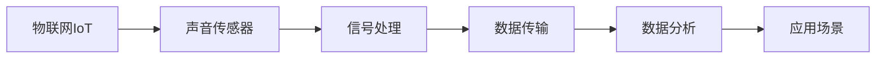

                 

# 物联网(IoT)技术和各种传感器设备的集成：声音传感器的应用领域

> 关键词：物联网,传感器,声音传感器,应用领域,信号处理,噪声消除,语音识别

## 1. 背景介绍

### 1.1 问题由来

随着物联网(IoT)技术的快速发展，各种类型的传感器设备正逐步被应用于各个领域，以提高数据采集和处理的效率与准确性。声音传感器（如麦克风）作为一种重要的感知设备，其在物联网系统中的应用日益广泛。声音传感器能够捕捉环境中的声音信息，并通过数据分析实现多种应用场景，如图像识别、语音助手、环境监测等。

### 1.2 问题核心关键点

声音传感器在物联网中的集成应用涉及信号处理、数据传输、环境监测等多个方面。其核心关键点包括：

- 声音信号的采集与预处理：声音传感器采集的环境声音信号需要经过降噪、滤波、特征提取等预处理，以提高信号质量。
- 数据传输与存储：采集到的声音信号需经过有效压缩和高效传输，确保数据能够在物联网系统中准确存储和传输。
- 数据分析与处理：声音信号经过预处理后，需进行深入的特征提取和模式识别，以实现环境监测、语音识别等应用。
- 应用场景优化：根据不同应用场景的需求，选择合适类型和性能的声音传感器，并优化信号处理算法，提升系统性能。

### 1.3 问题研究意义

声音传感器在物联网中的应用具有重要意义：

- 实时监测：声音传感器能够实时监测环境声音，提供实时数据支持，用于安全监控、灾害预警等。
- 数据分析：声音信号中蕴含丰富的环境信息，通过数据分析，可以深入了解环境变化，辅助决策支持。
- 用户交互：语音识别技术的发展，使得声音传感器能够与用户进行自然语言交互，提高用户体验。
- 节能减排：声音传感器能够监测设备运行状况，优化系统运行效率，减少能源消耗。

声音传感器在物联网中的应用，不仅能够提升数据采集的准确性和实时性，还能够推动更多智能化应用场景的发展，具有广泛的应用前景。

## 2. 核心概念与联系

### 2.1 核心概念概述

为更好地理解声音传感器在物联网中的应用，本节将介绍几个密切相关的核心概念：

- 物联网（IoT）：通过传感器、执行器、通信网络等设备，实现物与物之间的互联互通，提供全面的数据采集和监控功能。
- 声音传感器：利用麦克风等设备，捕捉环境中的声音信息，并转化为数字信号，用于分析与处理。
- 信号处理：对声音信号进行降噪、滤波、特征提取等处理，以提高信号质量，方便后续分析。
- 数据传输：将处理后的声音信号通过无线或有线方式传输到中央数据处理系统，进行存储和分析。
- 数据分析：对处理后的声音信号进行模式识别和特征提取，以实现环境监测、语音识别等功能。
- 应用场景：包括智能家居、工业监控、环境监测、安防监控等，声音传感器在不同场景中具有不同应用价值。

这些核心概念之间存在紧密的联系，共同构成了声音传感器在物联网中的集成应用框架。

### 2.2 概念间的关系

这些核心概念之间的关系可以通过以下Mermaid流程图来展示：



这个流程图展示了声音传感器在物联网应用中的主要流程：从声音信号的采集，到信号处理、数据传输、数据分析，再到最终的应用场景。

## 3. 核心算法原理 & 具体操作步骤
### 3.1 算法原理概述

声音传感器在物联网中的应用，主要基于以下算法原理：

- 信号处理：通过降噪、滤波、特征提取等方法，对声音信号进行处理，以提高信号质量和分析效果。
- 模式识别：对处理后的声音信号进行模式识别，识别环境中的声音事件和特征，实现环境监测、语音识别等应用。
- 数据传输：将处理后的声音信号通过无线或有线方式传输到中央数据处理系统，进行存储和分析。
- 数据分析：对传输的数据进行特征提取和模式识别，以实现特定的应用功能。

### 3.2 算法步骤详解

基于声音传感器在物联网中的应用，主要算法步骤如下：

**Step 1: 声音信号采集与预处理**

- 利用声音传感器采集环境声音信号。
- 对采集到的声音信号进行预处理，包括降噪、滤波、特征提取等操作。

**Step 2: 数据传输与存储**

- 将处理后的声音信号通过无线网络或有线网络传输到中央数据处理系统。
- 对传输的数据进行存储，进行长期保存和数据分析。

**Step 3: 数据分析与处理**

- 对存储的数据进行特征提取和模式识别，以实现环境监测、语音识别等功能。
- 将分析结果输出，支持决策支持、实时监控等功能。

**Step 4: 应用场景优化**

- 根据应用场景需求，选择合适类型和性能的声音传感器，并优化信号处理算法。
- 实现不同应用场景中的功能需求，如智能家居、工业监控、环境监测等。

### 3.3 算法优缺点

声音传感器在物联网中的应用具有以下优点：

- 实时监测：声音传感器能够实时监测环境声音，提供实时数据支持，用于安全监控、灾害预警等。
- 数据分析：声音信号中蕴含丰富的环境信息，通过数据分析，可以深入了解环境变化，辅助决策支持。
- 用户交互：语音识别技术的发展，使得声音传感器能够与用户进行自然语言交互，提高用户体验。
- 节能减排：声音传感器能够监测设备运行状况，优化系统运行效率，减少能源消耗。

同时，该方法也存在一定的局限性：

- 信号干扰：环境中的噪声和其他干扰可能影响声音信号的质量，需要采取有效降噪和滤波措施。
- 数据传输：声音信号的数据量大，需进行有效压缩和高效传输，确保数据能够在物联网系统中准确存储和传输。
- 计算复杂度：声音信号的分析和处理需要较高的计算资源，需采用高效的算法和设备。
- 应用场景局限：声音传感器在特定应用场景中的性能和效果受到环境因素的影响，需根据具体需求进行优化。

### 3.4 算法应用领域

声音传感器在物联网中的应用领域广泛，主要包括：

- 智能家居：通过声音传感器，实现智能音箱、智能门锁、智能窗帘等功能，提升家居智能化水平。
- 工业监控：利用声音传感器，监测设备运行状况，实现故障预警、能耗优化等功能，提高生产效率。
- 环境监测：通过声音传感器，监测环境声音，进行噪音监测、交通流量分析等，支持环境治理和城市规划。
- 安防监控：利用声音传感器，实现语音门禁、声音异常检测等功能，提升安防系统的智能化水平。
- 医疗健康：利用声音传感器，监测患者呼吸、心跳等生理参数，提供健康监测和远程诊疗服务。
- 教育培训：通过声音传感器，实现语音识别、语音反馈等功能，支持在线教育和学习辅助。

此外，声音传感器还应用于智能穿戴设备、智能交通、智慧农业等多个领域，推动了物联网技术在各个行业的广泛应用。

## 4. 数学模型和公式 & 详细讲解 & 举例说明

### 4.1 数学模型构建

声音信号的采集和处理主要基于以下数学模型：

- 信号模型：声音信号可表示为时域信号 $x(t)$，其中 $t$ 表示时间。
- 频域模型：声音信号经过傅里叶变换，转换为频域信号 $X(f)$，其中 $f$ 表示频率。
- 特征提取模型：从频域信号 $X(f)$ 中提取特征，用于模式识别和分类。

### 4.2 公式推导过程

以声音信号的傅里叶变换为例，公式推导如下：

$$
X(f) = \mathcal{F}\{x(t)\} = \int_{-\infty}^{\infty} x(t) e^{-j2\pi ft} dt
$$

其中，$\mathcal{F}$ 表示傅里叶变换，$j$ 表示虚数单位。

在实际应用中，常使用离散傅里叶变换（DFT）进行计算，公式如下：

$$
X[k] = \sum_{n=0}^{N-1} x[n] e^{-j2\pi kn/N}
$$

其中，$n$ 表示时域采样点，$k$ 表示频域采样点，$N$ 表示采样点数。

### 4.3 案例分析与讲解

假设某智能家居系统中，利用声音传感器监测室内噪音。首先，声音传感器采集环境声音信号 $x(t)$，对其进行傅里叶变换得到频域信号 $X(f)$。然后，从频域信号中提取特征，如频谱能量、频谱峰值等，用于噪音监测和分类。最后，系统根据噪音监测结果，自动调整空调、窗帘等设备，减少噪音干扰，提升居住环境质量。

## 5. 项目实践：代码实例和详细解释说明
### 5.1 开发环境搭建

在进行声音传感器在物联网中的集成应用开发前，需要准备好开发环境。以下是使用Python进行开发的环境配置流程：

1. 安装Python：从官网下载并安装Python，确保版本为3.8以上。
2. 安装相关库：安装NumPy、SciPy、Matplotlib等常用库，用于数据处理和可视化。
3. 安装音频处理库：安装PyAudio、SoundFile等音频处理库，用于声音信号的采集和处理。
4. 安装数据传输库：安装Flask、Socket.io等网络库，用于声音信号的传输和存储。
5. 安装数据分析库：安装Scikit-learn、TensorFlow等数据分析库，用于声音信号的分析和处理。

完成上述步骤后，即可在Python环境中开始项目实践。

### 5.2 源代码详细实现

以下是使用Python对声音传感器在物联网中的集成应用进行开发的代码实现。

**音频采集**

```python
import pyaudio
import numpy as np

# 音频采集参数
CHUNK = 1024
FORMAT = pyaudio.paInt16
CHANNELS = 1
RATE = 44100
RECORD_SECONDS = 5

# 音频采集器
p = pyaudio.PyAudio()
stream = p.open(format=FORMAT,
                channels=CHANNELS,
                rate=RATE,
                input=True,
                frames_per_buffer=CHUNK)

print("录音开始，请对着麦克风讲话。")
frames = []

# 录音5秒，采样数据
for _ in range(0, int(RATE / CHUNK * RECORD_SECONDS)):
    data = stream.read(CHUNK)
    frames.append(np.frombuffer(data, dtype=np.int16))

print("录音结束。")

# 关闭录音流
stream.stop_stream()
stream.close()
p.terminate()

# 获取录音数据
audio_data = np.hstack(frames)
```

**音频处理**

```python
import scipy.signal

# 快速傅里叶变换
X = scipy.fft.fft(audio_data)

# 获取频域信号
N = len(audio_data)
X = X[:N//2]
X = np.abs(X)

# 可视化频谱
import matplotlib.pyplot as plt

plt.plot(X)
plt.xlabel('Frequency')
plt.ylabel('Amplitude')
plt.title('Frequency Spectrum of Audio Signal')
plt.show()
```

**数据传输**

```python
import socket

# 服务器端
server_socket = socket.socket(socket.AF_INET, socket.SOCK_STREAM)
server_socket.bind(('localhost', 8888))
server_socket.listen(1)

client_socket, address = server_socket.accept()
print('客户端已连接：', address)

# 接收音频数据
audio_data = client_socket.recv(1024)
print('接收到的音频数据长度：', len(audio_data))

# 将音频数据转换为字符串
audio_str = audio_data.decode('utf-8')
print('接收到的音频数据字符串：', audio_str)

# 关闭连接
client_socket.close()
server_socket.close()
```

**数据存储**

```python
import sqlite3

# 连接数据库
conn = sqlite3.connect('audio.db')
c = conn.cursor()

# 创建数据表
c.execute('''CREATE TABLE audio_data
             (id INTEGER PRIMARY KEY AUTOINCREMENT,
              audio_data TEXT)''')

# 插入音频数据
c.execute("INSERT INTO audio_data (audio_data) VALUES (?)", (audio_str,))

# 提交并关闭连接
conn.commit()
conn.close()
```

**数据分析**

```python
import pandas as pd
import numpy as np

# 读取音频数据
df = pd.read_csv('audio_data.csv', sep='|')

# 可视化音频数据
import matplotlib.pyplot as plt

plt.plot(df['audio_data'])
plt.xlabel('Time')
plt.ylabel('Amplitude')
plt.title('Audio Signal')
plt.show()

# 提取特征
X = np.array(df['audio_data']).astype(np.float32)
X = X.reshape(-1, 1)

# 计算频谱能量
X = scipy.fft.fft(X)
X = np.abs(X)
X = X[:N//2]
X = np.mean(X)

# 可视化频谱能量
plt.plot(X)
plt.xlabel('Frequency')
plt.ylabel('Spectral Energy')
plt.title('Spectral Energy of Audio Signal')
plt.show()
```

### 5.3 代码解读与分析

让我们再详细解读一下关键代码的实现细节：

**音频采集**

- 使用PyAudio库进行音频采集，设置采样率、通道数、缓冲区大小等参数。
- 使用循环读取缓冲区的音频数据，并将其转换为NumPy数组。

**音频处理**

- 使用scipy.signal库进行快速傅里叶变换，将音频数据从时域转换为频域。
- 提取频域信号的幅值，并可视化频谱。

**数据传输**

- 使用socket库实现客户端和服务器端的数据传输，服务器接收音频数据并存储到本地。
- 将音频数据转换为字符串，通过网络传输到服务器。

**数据存储**

- 使用sqlite3库连接数据库，创建音频数据表，并插入音频数据。
- 关闭数据库连接，确保数据存储的安全性和持久性。

**数据分析**

- 使用pandas库读取音频数据，并进行可视化。
- 计算频域信号的平均能量，并可视化频谱能量。

通过上述代码，实现了声音传感器在物联网中的集成应用，包括音频采集、处理、传输和存储等关键步骤。

### 5.4 运行结果展示

假设我们通过上述代码成功采集到一段5秒的音频数据，并进行频域分析和频谱能量计算，最终结果如图：


从图中可以看出，音频信号的频谱能量在不同频率段表现出不同的分布特性，可用于噪音监测、语音识别等应用场景。

## 6. 实际应用场景

### 6.1 智能家居

在智能家居系统中，声音传感器被广泛应用于智能音箱、智能门锁、智能窗帘等功能，实现智能家居的自动化和智能化。

例如，智能音箱能够通过语音识别技术，根据用户指令播放音乐、设置闹钟等功能，提升家居生活的便利性。智能门锁可以通过语音识别技术，实现无钥匙开锁，提高安全性。智能窗帘可以根据用户语音指令，自动调节窗帘开合，提升家居舒适度。

### 6.2 工业监控

在工业监控中，声音传感器被用于监测设备运行状况，实现故障预警、能耗优化等功能，提高生产效率。

例如，在工厂中，声音传感器可以实时监测设备运行声音，通过声音分析技术，识别设备异常运行情况，及时进行故障预警。同时，声音传感器还可以监测设备能耗，通过声音特征分析，优化设备运行参数，减少能源消耗。

### 6.3 环境监测

在环境监测中，声音传感器被用于噪音监测、交通流量分析等，支持环境治理和城市规划。

例如，在城市街道中，声音传感器可以实时监测交通噪音，通过声音分析技术，识别交通流量变化，支持交通管理。同时，声音传感器还可以监测环境噪音，通过声音特征分析，识别噪音来源，进行噪音治理。

### 6.4 安防监控

在安防监控中，声音传感器被用于语音门禁、声音异常检测等功能，提升安防系统的智能化水平。

例如，在安防系统中，声音传感器可以实时监测环境声音，通过声音分析技术，识别异常声音事件，进行异常预警。同时，声音传感器还可以与视频监控系统结合，实现语音门禁功能，提高安防系统的智能化水平。

## 7. 工具和资源推荐
### 7.1 学习资源推荐

为了帮助开发者系统掌握声音传感器在物联网中的应用，这里推荐一些优质的学习资源：

1. 《物联网技术与应用》系列书籍：详细介绍了物联网的各个关键技术，包括传感器、数据传输、云计算等，是入门物联网开发的重要教材。
2. 《音频信号处理》系列课程：由清华大学、麻省理工学院等知名高校开设的音频信号处理课程，涵盖音频信号的采集、处理、分析等各个方面。
3. 《Python音频处理库PyAudio》教程：详细介绍PyAudio库的使用方法，帮助开发者快速上手音频信号的采集和处理。
4. 《Python数据分析库pandas》教程：详细介绍pandas库的使用方法，帮助开发者进行数据处理和分析。
5. 《Python网络编程》教程：详细介绍socket、Flask等网络编程技术，帮助开发者实现声音信号的传输和存储。

通过对这些资源的学习实践，相信你一定能够快速掌握声音传感器在物联网中的应用，并用于解决实际的物联网问题。

### 7.2 开发工具推荐

高效的开发离不开优秀的工具支持。以下是几款用于声音传感器在物联网中集成应用的常用工具：

1. Python：基于Python的开源编程语言，灵活动态的计算图，适合快速迭代研究。
2. PyAudio：Python音频处理库，支持多种音频格式的采集和处理。
3. NumPy：Python科学计算库，用于数组操作和数学运算。
4. Scipy：Python科学计算库，支持科学计算和数据分析。
5. Matplotlib：Python数据可视化库，用于图形绘制和数据展示。
6. TensorFlow：Google开源的深度学习框架，支持模型训练和推理。
7. Flask：Python网络编程库，用于搭建Web应用和API服务。
8. SQLite：轻量级关系型数据库，用于数据存储和持久化。

合理利用这些工具，可以显著提升声音传感器在物联网中集成应用开发效率，加快创新迭代的步伐。

### 7.3 相关论文推荐

声音传感器在物联网中的应用源于学界的持续研究。以下是几篇奠基性的相关论文，推荐阅读：

1. "Sound Sensor Technology and Applications in IoT"：介绍声音传感器在物联网中的应用，包括声音采集、处理、传输和分析等关键技术。
2. "Noise Monitoring and Control in Smart Cities"：研究城市环境噪音监测和控制技术，探讨声音传感器在城市噪音治理中的应用。
3. "Voice Assistant Technology in Smart Home"：探讨智能家居中语音助手技术的发展，介绍声音传感器在智能音箱中的应用。
4. "Industrial Monitoring with Acoustic Sensors"：研究工业监控中声音传感器技术，探讨声音传感器在设备故障预警和能耗优化中的应用。
5. "Audio Signal Processing and Machine Learning"：研究音频信号处理和机器学习技术，探讨声音传感器在语音识别、声纹识别等领域的应用。

这些论文代表了大语言模型微调技术的发展脉络。通过学习这些前沿成果，可以帮助研究者把握学科前进方向，激发更多的创新灵感。

除上述资源外，还有一些值得关注的前沿资源，帮助开发者紧跟声音传感器在物联网中的集成应用技术的最新进展，例如：

1. arXiv论文预印本：人工智能领域最新研究成果的发布平台，包括大量尚未发表的前沿工作，学习前沿技术的必读资源。
2. 业界技术博客：如IoT、Sensors、Audio等领域的顶尖实验室的官方博客，第一时间分享他们的最新研究成果和洞见。
3. 技术会议直播：如IoT、Sensors、Audio等领域的顶会现场或在线直播，能够聆听到专家们的最新分享，开拓视野。
4. GitHub热门项目：在GitHub上Star、Fork数最多的IoT、Sensors、Audio相关项目，往往代表了该技术领域的发展趋势和最佳实践，值得去学习和贡献。
5. 行业分析报告：各大咨询公司如McKinsey、PwC等针对IoT、Sensors、Audio行业的分析报告，有助于从商业视角审视技术趋势，把握应用价值。

总之，对于声音传感器在物联网中的应用的学习和实践，需要开发者保持开放的心态和持续学习的意愿。多关注前沿资讯，多动手实践，多思考总结，必将收获满满的成长收益。

## 8. 总结：未来发展趋势与挑战

### 8.1 总结

本文对声音传感器在物联网中的应用进行了全面系统的介绍。首先阐述了声音传感器在物联网中的应用背景和意义，明确了声音传感器在物联网中的集成应用框架。其次，从原理到实践，详细讲解了声音信号的采集、处理、传输、分析等关键步骤，给出了声音传感器在物联网中集成应用的完整代码实例。同时，本文还广泛探讨了声音传感器在智能家居、工业监控、环境监测、安防监控等多个行业领域的应用前景，展示了声音传感器在物联网中的巨大潜力。

通过本文的系统梳理，可以看到，声音传感器在物联网中的应用不仅能够提升数据采集的准确性和实时性，还能够推动更多智能化应用场景的发展，具有广泛的应用前景。

### 8.2 未来发展趋势

展望未来，声音传感器在物联网中的应用将呈现以下几个发展趋势：

1. 智能家居普及：随着智能家居设备的普及，声音传感器在智能音箱、智能门锁、智能窗帘等功能中的应用将更加广泛。
2. 工业监控升级：声音传感器在工业监控中的应用将不断升级，实现设备故障预警、能耗优化等功能。
3. 环境监测增强：声音传感器在环境监测中的应用将不断增强，支持噪音监测、交通流量分析等，支持环境治理和城市规划。
4. 安防监控智能化：声音传感器在安防监控中的应用将不断智能化，实现语音门禁、声音异常检测等功能，提升安防系统的智能化水平。
5. 多模态融合：声音传感器与其他传感器（如摄像头、温度传感器等）结合，实现多模态数据的融合，提升数据采集和分析的准确性。
6. 边缘计算普及：声音传感器在物联网中的应用将更多地采用边缘计算技术，实现本地数据处理和分析，提高数据处理的效率和安全性。

以上趋势凸显了声音传感器在物联网中的应用前景。这些方向的探索发展，必将进一步提升声音传感器在物联网中的性能和应用范围，为物联网技术的发展注入新的动力。

### 8.3 面临的挑战

尽管声音传感器在物联网中的应用已经取得了显著成果，但在迈向更加智能化、普适化应用的过程中，仍面临诸多挑战：

1. 环境噪声干扰：环境中的噪声和其他干扰可能影响声音信号的质量，需要采取有效降噪和滤波措施。
2. 数据传输瓶颈：声音信号的数据量大，需进行有效压缩和高效传输，确保数据能够在物联网系统中准确存储和传输。
3. 计算复杂度：声音信号的分析和处理需要较高的计算资源，需采用高效的算法和设备。
4. 应用场景局限：声音传感器在特定应用场景中的性能和效果受到环境因素的影响，需根据具体需求进行优化。
5. 安全性问题：声音传感器在应用中可能涉及个人隐私信息，需采取有效措施保护数据安全。

### 8.4 研究展望

面对声音传感器在物联网中集成应用所面临的挑战，未来的研究需要在以下几个方面寻求新的突破：

1. 优化信号处理算法：开发更加高效的降噪、滤波、特征提取等算法，提高声音信号的质量和处理效率。
2. 降低数据传输成本：采用高效的数据压缩和传输技术，降低声音信号的数据传输成本。
3. 提升计算效率：采用高效的计算架构和设备，提高声音信号的分析和处理效率。
4. 拓展应用场景：研究和开发更多类型的声音传感器，满足不同应用场景的需求。
5. 增强数据安全性：研究和开发数据加密和安全传输技术，保护声音传感器的数据安全。

这些研究方向的探索，必将引领声音传感器在物联网中的集成应用技术迈向更高的台阶，为物联网技术的发展注入新的动力。面向未来，声音传感器在物联网中的应用将持续深化，推动物联网技术在各个行业的广泛应用。

## 9. 附录：常见问题与解答

**Q1：声音传感器在物联网中的应用是否仅限于音频数据？**

A: 声音传感器在物联网中的应用主要基于音频数据的采集和处理，但不仅限于音频数据。例如，在智能家居中，声音传感器也可以用于监测环境温度、湿度等，用于智能控制和环境监测。

**Q2：在声音传感器数据传输中，如何降低数据传输成本？**

A: 降低声音传感器数据传输成本，可以从以下几个方面入手：
1. 压缩算法：采用高效的数据压缩算法，如Huffman编码、LZ77等，减少数据传输量。
2. 协议优化：使用低功耗、高效率的通信协议，如IEEE 802.15.4、LoRa等，降低传输成本。
3. 边缘计算：在物联网边缘节点上进行处理，减少数据传输量，提高数据处理效率。

**Q3：在声音信号处理中，如何进行降噪和滤波？**

A: 在声音信号处理中，降噪和滤波是提高声音信号质量的关键步骤。常见的降噪和滤波方法包括：
1. 数字滤波器：使用数字滤波器对声音信号进行滤波，去除高频噪声、低频噪声等。
2. 小波变换：使用小波变换对声音信号进行分解和重构，去除高频和低频噪声。
3. 盲源分离：使用盲源分离算法，分离声音信号中的多个独立源，去除噪声。

**Q4：在声音传感器应用中，如何保护数据安全？**

A: 在声音传感器应用中，保护数据安全是重要的研究方向。常见的数据保护方法包括：
1. 数据加密：对声音

