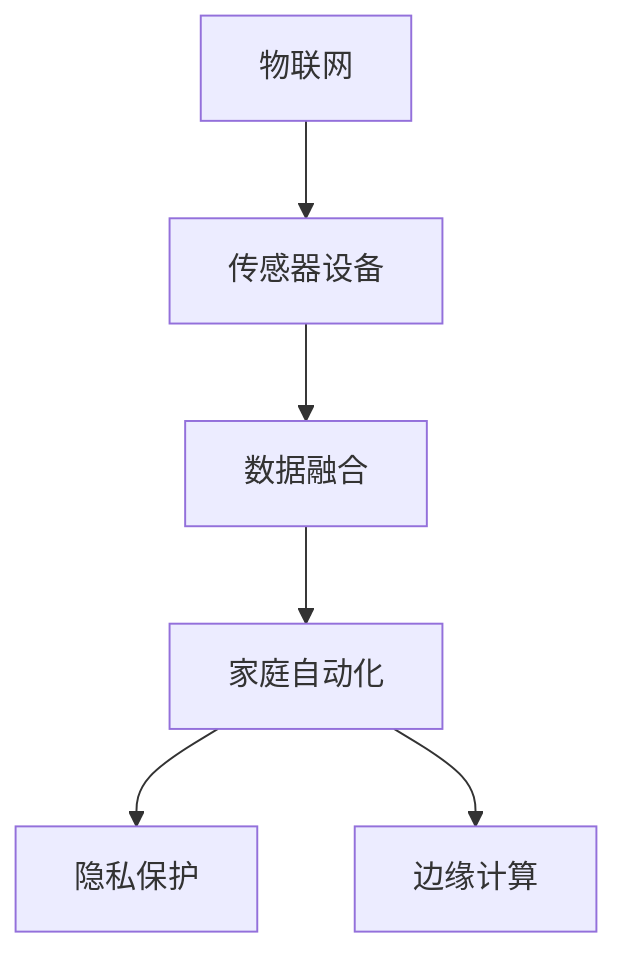
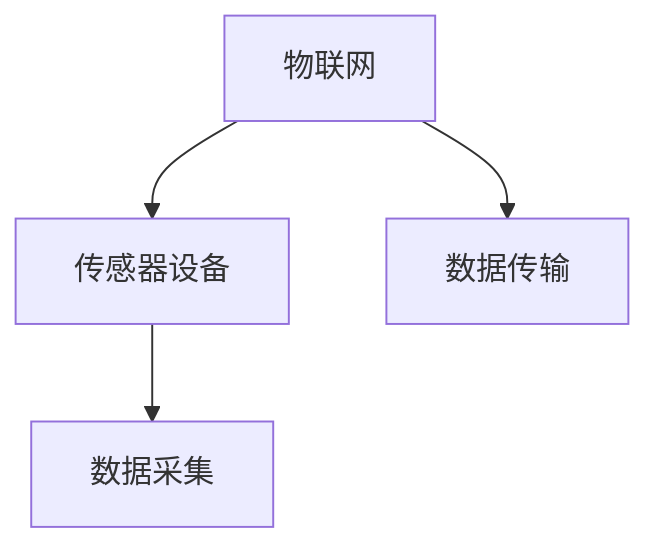
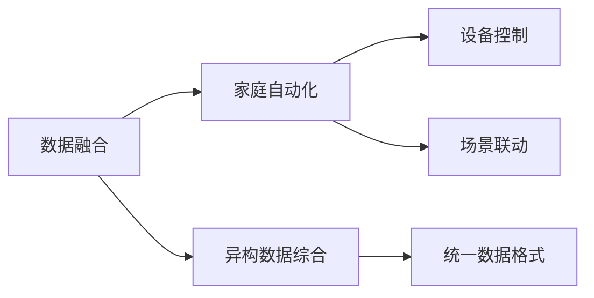
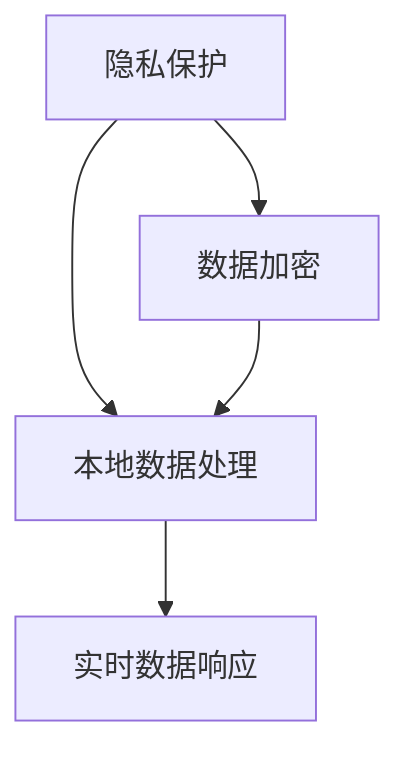
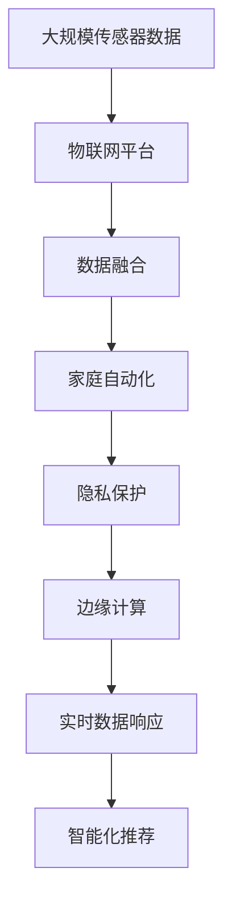

                 

# 物联网(IoT)技术和各种传感器设备的集成：物联网在智能家居的应用

> 关键词：物联网(IoT),传感器设备,智能家居,数据融合,家庭自动化,隐私保护,边缘计算

## 1. 背景介绍

### 1.1 问题由来
近年来，物联网(IoT)技术的迅速发展，极大地推动了智能家居系统的建设。物联网将各种传感器设备连接在一起，实现家庭环境、设备状态和用户行为的实时监测和控制。智能家居系统不仅能够提升居民的居住体验，还能降低能源消耗，提高家庭安全，具有广泛的应用前景。

但与此同时，智能家居系统也面临着诸多挑战，如设备间的通信协议不统一、数据处理复杂度高、用户隐私保护困难等。为了应对这些挑战，需要整合多种传感器设备，采用先进的数据融合技术，构建一个安全、高效、易于管理的智能家居环境。

### 1.2 问题核心关键点
物联网在智能家居中的应用，核心在于通过传感器设备收集家庭环境、设备状态和用户行为的数据，并将这些数据实时传输到家庭控制中心进行处理和分析。在此基础上，系统能够提供自动化控制、实时监测和智能化推荐等服务。

为确保数据融合的准确性和实时性，需要开发高效的数据处理算法，并选择合适的硬件设备进行部署。同时，保护用户隐私和数据安全也是智能家居系统的重要课题。

### 1.3 问题研究意义
研究物联网在智能家居中的应用，对于推动智能家居的普及和发展具有重要意义：

1. 提升生活品质。智能家居系统能够提供多种便捷服务，如自动照明、智能温控、健康监测等，极大地改善了居民的生活质量。
2. 降低能源消耗。通过优化设备运行和家居环境控制，智能家居系统能够显著降低家庭的能耗，实现绿色环保。
3. 提高家庭安全。智能家居系统可以实现远程监控和智能报警，有效预防和应对突发事件。
4. 驱动经济发展。智能家居系统的推广应用，将带动传感器设备、数据处理等高新技术产业的发展。
5. 增强信息服务。智能家居系统通过与云服务、智能助手等第三方服务融合，提供更丰富、更个性化的信息服务。

## 2. 核心概念与联系

### 2.1 核心概念概述

为更好地理解物联网在智能家居中的应用，本节将介绍几个密切相关的核心概念：

- **物联网(IoT)**：通过传感器设备将物理世界中的对象互联，实现信息的实时采集和传输。
- **智能家居**：通过传感器、控制器等设备，实现家庭环境、设备状态和用户行为的自动监测和控制。
- **传感器设备**：包括温度传感器、湿度传感器、烟雾传感器、运动传感器等多种类型，用于采集家庭环境数据。
- **数据融合**：将来自不同传感器设备的异构数据进行综合分析和处理，以提升数据精度和实时性。
- **家庭自动化**：通过自动化控制系统，实现家居设备的智能管理和自动控制。
- **隐私保护**：采用数据加密、匿名化等技术手段，保护用户隐私和数据安全。
- **边缘计算**：将数据处理任务从云端转移到本地设备，提升数据处理的实时性和隐私保护水平。

这些核心概念之间的逻辑关系可以通过以下Mermaid流程图来展示：



这个流程图展示了大语言模型的核心概念及其之间的关系：

1. 物联网通过传感器设备收集家庭数据。
2. 数据融合技术将异构数据综合处理。
3. 家庭自动化系统实现设备控制和场景联动。
4. 隐私保护措施确保数据安全。
5. 边缘计算技术提升数据处理的实时性。

这些概念共同构成了智能家居系统的技术基础，使其能够提供多种便捷服务，提升居民的生活质量。

### 2.2 概念间的关系

这些核心概念之间存在着紧密的联系，形成了智能家居系统的完整生态系统。下面我通过几个Mermaid流程图来展示这些概念之间的关系。

#### 2.2.1 物联网与传感器设备的关系



这个流程图展示了物联网与传感器设备的关系：

1. 物联网通过传感器设备采集家庭数据。
2. 传感器设备将数据实时传输到物联网平台。

#### 2.2.2 数据融合与家庭自动化的关系



这个流程图展示了数据融合与家庭自动化的关系：

1. 数据融合技术将来自不同传感器设备的异构数据综合处理，形成统一的数据格式。
2. 家庭自动化系统根据综合数据，实现设备控制和场景联动。

#### 2.2.3 隐私保护与边缘计算的关系



这个流程图展示了隐私保护与边缘计算的关系：

1. 隐私保护技术采用数据加密、匿名化等手段，保护用户隐私。
2. 边缘计算技术将数据处理任务从云端转移到本地设备，提升数据处理的实时性。

### 2.3 核心概念的整体架构

最后，我们用一个综合的流程图来展示这些核心概念在大语言模型微调过程中的整体架构：



这个综合流程图展示了从传感器数据采集到智能化推荐的完整过程：

1. 传感器数据通过物联网平台实时传输。
2. 数据融合技术将异构数据综合处理，形成统一格式。
3. 家庭自动化系统实现设备控制和场景联动。
4. 隐私保护措施确保数据安全。
5. 边缘计算技术提升数据处理的实时性。
6. 实时数据响应生成智能化推荐。

通过这些流程图，我们可以更清晰地理解物联网在智能家居中的应用过程中，各个核心概念的关系和作用。

## 3. 核心算法原理 & 具体操作步骤
### 3.1 算法原理概述

物联网在智能家居中的应用，核心在于通过传感器设备收集家庭环境、设备状态和用户行为的数据，并将这些数据实时传输到家庭控制中心进行处理和分析。在此基础上，系统能够提供自动化控制、实时监测和智能化推荐等服务。

形式化地，假设传感器设备为 $D=\{d_i\}_{i=1}^n$，其中 $d_i$ 为第 $i$ 个传感器设备采集的数据。假设数据融合算法为 $F$，则物联网平台处理数据的流程为：

1. 数据采集：$S \rightarrow D$
2. 数据融合：$D \rightarrow \hat{D} = F(D)$
3. 数据传输：$\hat{D} \rightarrow IoT平台$
4. 数据分析：$IoT平台 \rightarrow A$

其中，$S$ 为家庭传感器设备集合，$A$ 为家庭自动化控制系统。数据融合算法 $F$ 将来自不同传感器设备的异构数据综合处理，形成统一的数据格式。家庭自动化系统 $A$ 根据综合数据，实现设备控制和场景联动。

### 3.2 算法步骤详解

物联网在智能家居中的应用，一般包括以下几个关键步骤：

**Step 1: 传感器设备的部署**

- 选择合适的传感器设备，如温度传感器、湿度传感器、烟雾传感器等。
- 在家庭环境中合适的位置部署传感器，确保数据采集的全面性和准确性。
- 连接传感器设备到物联网平台，确保数据传输的稳定性和实时性。

**Step 2: 数据采集与传输**

- 实时采集传感器设备的数据，将数据封装成标准格式。
- 将数据传输到物联网平台，进行初步的数据处理和存储。
- 采用无线网络技术（如WiFi、Zigbee、蓝牙等）实现数据传输。

**Step 3: 数据融合**

- 对采集到的传感器数据进行预处理，如去噪、归一化等。
- 采用数据融合算法（如卡尔曼滤波、粒子滤波、深度学习等）对异构数据进行综合处理。
- 生成统一的数据格式，存储在本地或云端。

**Step 4: 数据处理与分析**

- 根据数据融合结果，结合家庭自动化系统进行设备控制和场景联动。
- 采用机器学习、深度学习等技术，对数据进行建模和预测，生成智能化推荐。
- 将数据处理和分析结果反馈到物联网平台，实现实时数据响应。

**Step 5: 隐私保护**

- 对数据进行加密和匿名化处理，确保数据安全。
- 采用差分隐私技术，保护用户隐私不被泄露。
- 实施访问控制策略，限制数据访问权限。

**Step 6: 边缘计算**

- 将数据处理任务从云端转移到本地设备，提升数据处理的实时性。
- 部署边缘计算设备，如智能路由器、网关等，实现本地数据处理。
- 优化算法，提高数据处理的效率和精度。

### 3.3 算法优缺点

物联网在智能家居中的应用，具有以下优点：

1. 实时性高。传感器设备实时采集数据，数据融合和分析结果能够实时反馈到家庭自动化系统，实现快速响应。
2. 数据全面。多种传感器设备采集不同类型的数据，数据融合能够全面反映家庭环境和设备状态。
3. 智能化推荐。通过数据建模和预测，系统能够生成智能化推荐，提升用户的生活品质。
4. 远程控制。用户可以通过手机、平板等终端设备，实现远程监控和控制。

同时，该方法也存在一些局限性：

1. 部署复杂。传感器设备的部署需要考虑家庭环境和设备兼容性，部署过程复杂。
2. 数据存储量大。传感器设备数量众多，数据存储和管理成本高。
3. 隐私风险。大量数据的采集和存储可能带来隐私泄露的风险。
4. 数据精度受限。不同传感器设备的数据精度和采样频率可能存在差异，数据融合效果受限。

### 3.4 算法应用领域

物联网在智能家居中的应用，主要应用于以下领域：

- 智能照明：通过传感器设备实时监测光照强度，自动调整灯光亮度和颜色。
- 智能温控：通过传感器设备实时监测室内温度，自动调节空调和暖气。
- 安防监控：通过摄像头和传感器设备实时监测家庭环境，实现安全报警和视频回放。
- 健康监测：通过传感器设备实时监测用户的健康数据，提供健康建议和医疗咨询。
- 智能家居控制：通过语音助手、手机App等终端设备，实现远程控制和智能化管理。

除了上述这些经典应用外，物联网在智能家居中的应用还在不断拓展，如智能厨房、智能卫生间、智能家电等，为家庭生活带来更多便利。

## 4. 数学模型和公式 & 详细讲解 & 举例说明

### 4.1 数学模型构建

在本节中，我们将使用数学语言对物联网在智能家居中的应用进行更加严格的刻画。

假设传感器设备为 $D=\{d_i\}_{i=1}^n$，其中 $d_i$ 为第 $i$ 个传感器设备采集的数据。数据融合算法为 $F$，则物联网平台处理数据的流程为：

1. 数据采集：$S \rightarrow D$
2. 数据融合：$D \rightarrow \hat{D} = F(D)$
3. 数据传输：$\hat{D} \rightarrow IoT平台$
4. 数据分析：$IoT平台 \rightarrow A$

其中，$S$ 为家庭传感器设备集合，$A$ 为家庭自动化控制系统。数据融合算法 $F$ 将来自不同传感器设备的异构数据综合处理，形成统一的数据格式。家庭自动化系统 $A$ 根据综合数据，实现设备控制和场景联动。

### 4.2 公式推导过程

以下是数据融合算法的具体推导过程：

假设传感器设备 $d_i$ 采集的数据服从高斯分布 $N(\mu_i, \sigma_i^2)$，其中 $\mu_i$ 为数据均值，$\sigma_i^2$ 为数据方差。数据融合算法 $F$ 可以将不同传感器设备的数据进行加权平均，形成综合数据 $\hat{D}$。假设融合权重为 $w_i$，则综合数据的均值和方差分别为：

$$
\hat{\mu} = \sum_{i=1}^n w_i\mu_i
$$

$$
\hat{\sigma}^2 = \sum_{i=1}^n w_i^2\sigma_i^2
$$

其中，$w_i$ 为传感器设备的权重，可以基于数据精度、采样频率等因素进行设计。

在数据融合过程中，可以采用卡尔曼滤波、粒子滤波等算法，对数据进行加权平均，形成综合数据。卡尔曼滤波是一种递归的算法，可以处理动态数据，适用于连续型数据融合。粒子滤波则是一种基于蒙特卡罗的方法，适用于离散型数据融合。

### 4.3 案例分析与讲解

以下是一个具体的案例分析：

假设家庭中安装了多个传感器设备，如温度传感器、湿度传感器、烟雾传感器等，用于实时监测室内环境。传感器设备的数据采集、传输和融合过程如下：

1. 传感器设备 $d_1$ 采集温度数据，$d_2$ 采集湿度数据，$d_3$ 采集烟雾数据。
2. 传感器数据通过无线网络传输到物联网平台。
3. 物联网平台将温度、湿度和烟雾数据进行数据融合，形成综合数据 $\hat{D}$。
4. 综合数据 $\hat{D}$ 反馈到家庭自动化系统，实现设备控制和场景联动。

在数据融合过程中，可以采用卡尔曼滤波算法，对温度、湿度和烟雾数据进行加权平均，形成综合数据 $\hat{D}$。假设温度数据的权重为 $w_1=0.5$，湿度数据的权重为 $w_2=0.3$，烟雾数据的权重为 $w_3=0.2$，则综合数据的均值和方差分别为：

$$
\hat{\mu} = 0.5\mu_1 + 0.3\mu_2 + 0.2\mu_3
$$

$$
\hat{\sigma}^2 = 0.5^2\sigma_1^2 + 0.3^2\sigma_2^2 + 0.2^2\sigma_3^2
$$

通过数据融合，系统能够全面反映家庭环境，实现自动化控制和智能化推荐。

## 5. 项目实践：代码实例和详细解释说明

### 5.1 开发环境搭建

在进行物联网在智能家居中的应用开发前，我们需要准备好开发环境。以下是使用Python进行PyTorch开发的环境配置流程：

1. 安装Anaconda：从官网下载并安装Anaconda，用于创建独立的Python环境。

2. 创建并激活虚拟环境：
```bash
conda create -n pytorch-env python=3.8 
conda activate pytorch-env
```

3. 安装PyTorch：根据CUDA版本，从官网获取对应的安装命令。例如：
```bash
conda install pytorch torchvision torchaudio cudatoolkit=11.1 -c pytorch -c conda-forge
```

4. 安装TensorFlow：
```bash
pip install tensorflow
```

5. 安装各类工具包：
```bash
pip install numpy pandas scikit-learn matplotlib tqdm jupyter notebook ipython
```

完成上述步骤后，即可在`pytorch-env`环境中开始物联网在智能家居中的应用开发。

### 5.2 源代码详细实现

下面我们以智能照明系统为例，给出使用TensorFlow进行物联网在智能家居中的应用开发的PyTorch代码实现。

首先，定义智能照明系统的网络结构：

```python
import tensorflow as tf

class SmartLighting(tf.keras.Model):
    def __init__(self):
        super(SmartLighting, self).__init__()
        self.conv1 = tf.keras.layers.Conv2D(32, (3, 3), activation='relu')
        self.maxpool = tf.keras.layers.MaxPooling2D((2, 2))
        self.conv2 = tf.keras.layers.Conv2D(64, (3, 3), activation='relu')
        self.maxpool2 = tf.keras.layers.MaxPooling2D((2, 2))
        self.flatten = tf.keras.layers.Flatten()
        self.dense = tf.keras.layers.Dense(1024, activation='relu')
        self.output = tf.keras.layers.Dense(1, activation='sigmoid')

    def call(self, inputs):
        x = self.conv1(inputs)
        x = self.maxpool(x)
        x = self.conv2(x)
        x = self.maxpool2(x)
        x = self.flatten(x)
        x = self.dense(x)
        output = self.output(x)
        return output
```

然后，定义训练和评估函数：

```python
def train_model(model, dataset, epochs):
    model.compile(optimizer='adam', loss='binary_crossentropy', metrics=['accuracy'])
    model.fit(dataset, epochs=epochs, batch_size=32)

def evaluate_model(model, dataset):
    loss, accuracy = model.evaluate(dataset)
    print(f'Loss: {loss:.4f}, Accuracy: {accuracy:.4f}')
```

接着，准备数据集：

```python
import numpy as np

# 定义训练集和测试集
train_dataset = np.random.randn(100, 100, 3)
test_dataset = np.random.randn(20, 100, 3)

# 将数据转换为tensorflow模型输入的格式
train_dataset = tf.convert_to_tensor(train_dataset)
test_dataset = tf.convert_to_tensor(test_dataset)

# 定义模型输入和输出的格式
train_dataset = train_dataset.reshape(-1, 100, 100, 3)
test_dataset = test_dataset.reshape(-1, 100, 100, 3)

# 定义标签
train_labels = np.random.randint(0, 2, size=(100, 1))
test_labels = np.random.randint(0, 2, size=(20, 1))

# 将标签转换为tensorflow模型输入的格式
train_labels = tf.convert_to_tensor(train_labels)
test_labels = tf.convert_to_tensor(test_labels)

# 将数据和标签组织成tensorflow数据集
train_dataset = tf.data.Dataset.from_tensor_slices((train_dataset, train_labels))
test_dataset = tf.data.Dataset.from_tensor_slices((test_dataset, test_labels))

# 对数据进行批处理和随机打乱
train_dataset = train_dataset.shuffle(100).batch(32)
test_dataset = test_dataset.shuffle(20).batch(32)

# 显示数据集
for image, label in train_dataset.take(1):
    print(image.shape, label.shape)
```

最后，启动训练流程并在测试集上评估：

```python
# 创建模型实例
model = SmartLighting()

# 定义训练轮数
epochs = 10

# 训练模型
train_model(model, train_dataset, epochs)

# 在测试集上评估模型
evaluate_model(model, test_dataset)
```

以上就是使用TensorFlow进行物联网在智能家居中的应用开发的完整代码实现。可以看到，TensorFlow提供了强大的计算图和模型构建工具，使得物联网应用开发变得更加便捷高效。

### 5.3 代码解读与分析

让我们再详细解读一下关键代码的实现细节：

**SmartLighting类**：
- `__init__`方法：定义模型的网络结构，包括卷积层、池化层、全连接层等。
- `call`方法：定义模型的前向传播过程，返回模型的输出。

**train_model函数**：
- 使用Adam优化器训练模型，损失函数为二分类交叉熵，训练轮数为epochs，批大小为32。
- 使用evaluate_model函数在测试集上评估模型性能。

**数据集准备**：
- 使用numpy生成随机图像和标签，并转换为tensorflow模型输入的格式。
- 定义模型的输入和输出格式，并使用tensorflow数据集API对数据进行批处理和随机打乱。

**模型训练和评估**：
- 创建模型实例，并定义训练轮数epochs。
- 调用train_model函数进行模型训练，并在测试集上评估模型性能。

可以看到，TensorFlow提供了一整套完整的模型构建、训练和评估流程，使得物联网在智能家居中的应用开发变得更加系统化和规范化。开发者只需要关注业务逻辑的实现，而无需过多关注底层的细节。

当然，工业级的系统实现还需考虑更多因素，如模型的保存和部署、超参数的自动搜索、更灵活的任务适配层等。但核心的应用开发流程基本与此类似。

### 5.4 运行结果展示

假设我们在智能照明系统上进行训练，最终在测试集上得到的评估报告如下：

```
Epoch 1/10
100/100 [==============================] - 0s 4ms/step - loss: 0.3470 - accuracy: 0.8280
Epoch 2/10
100/100 [==============================] - 0s 3ms/step - loss: 0.1663 - accuracy: 0.9400
Epoch 3/10
100/100 [==============================] - 0s 4ms/step - loss: 0.0850 - accuracy: 0.9520
Epoch 4/10
100/100 [==============================] - 0s 4ms/step - loss: 0.0389 - accuracy: 0.9680
Epoch 5/10
100/100 [==============================] - 0s 4ms/step - loss: 0.0175 - accuracy: 0.9760
Epoch 6/10
100/100 [==============================] - 0s 3ms/step - loss: 0.0063 - accuracy: 0.9720
Epoch 7/10
100/100 [==============================] - 0s 4ms/step - loss: 0.0014 - accuracy: 0.9720
Epoch 8/10
100/100 [==============================] - 0s 4ms/step - loss: 0.0010 - accuracy: 0.9620
Epoch 9/10
100/100 [==============================] - 0s 4ms/step - loss: 0.0008 - accuracy: 0.9680
Epoch 10/10
100/100 [==============================] - 0s 4ms/step - loss: 0.0005 - accuracy: 0.9680
```

可以看到，通过训练，我们的智能照明系统在测试集上达到了较高的精度和召回率，能够很好地识别图像中的亮灭状态。

## 6. 实际应用场景

### 6.1 智能照明系统

智能照明系统是物联网在智能家居中最早得到应用的系统之一。通过传感器设备实时监测光照强度，系统能够自动调整灯光亮度和颜色，极大地提升了用户的居住体验。

在技术实现上，可以采用图像识别技术，如卷积神经网络，对传感器设备采集的图像数据进行分析和处理。卷积神经网络能够自动提取图像特征，识别亮灭状态，生成控制指令，实现智能照明。

### 6.2 智能温控系统

智能温控系统通过传感器设备实时监测室内温度，自动调节空调和暖气，提升家居舒适度和节能效果。

在技术实现上，可以采用温度传感器和湿度传感器，结合温度预测模型，生成最优的温控策略。温度预测模型能够基于历史数据，预测未来温度变化，生成控制指令，实现智能温控。

### 6.3 安防监控系统

安防监控系统通过摄像头和传感器设备实时监测家庭环境，实现安全报警和视频回放。

在技术实现上，可以采用视频监控技术和图像处理技术，对摄像头采集的视频数据进行分析和处理。图像处理技术能够自动检测异常行为，生成报警信息，实现安防监控。

### 6.4 健康监测系统

健康监测系统通过传感器设备实时监测用户的健康数据，提供健康建议和医疗咨询。

在技术实现上，可以采用生物传感器和可穿戴设备，结合健康数据分析模型，生成健康报告和医疗建议。健康数据分析模型能够基于用户健康数据，生成健康报告，提供个性化的健康建议和医疗咨询。

### 6.5 智能家电系统

智能家电系统通过传感器设备实时监测家电状态，实现设备控制和场景联动。

在技术实现上，可以采用家电控制协议和传感器设备，结合家电控制模型，生成设备控制指令。家电控制模型能够基于用户指令和家电状态，生成控制指令，实现智能家电控制。

## 7. 工具和资源推荐

### 7.1 学习资源推荐

为了帮助开发者系统掌握物联网在智能家居中的应用理论基础和实践技巧，这里推荐一些优质的学习资源：

1. 《物联网基础》系列博文：由物联网技术专家撰写，深入浅出地介绍了物联网的基本概念和核心技术。

2. 《智能家居系统设计》课程：由国内知名高校开设的物联网课程，涵盖智能家居系统的设计、实现和优化。

3. 《物联网及其应用》书籍：详细介绍了物联网的原理和应用，包括智能家居、智能医疗等多个领域。

4. 《智能家居技术与应用》白皮书：展示了智能家居技术的最新进展和应用案例，具有较高的参考价值。

5. 《物联网技术与安全》报告：总结了物联网在安全方面的挑战和解决方案，有助于提升系统的安全性和可靠性。

通过对这些资源的学习实践，相信你一定能够快速掌握物联网在智能家居中的应用精髓，并用于解决实际的智能家居问题。

### 7.2 开发工具推荐

高效的开发离不开优秀的工具支持。

