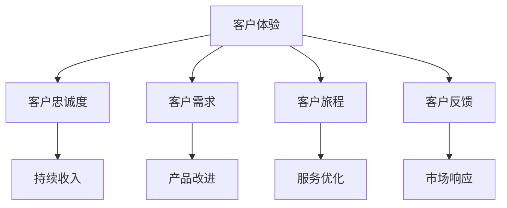
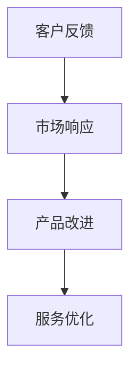
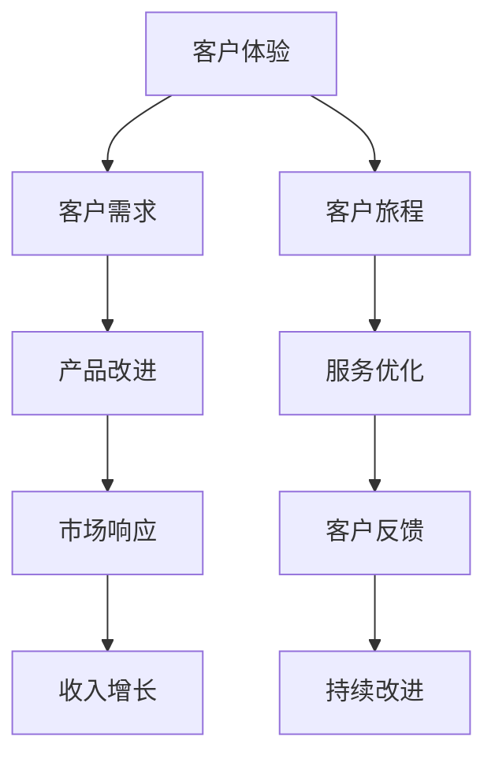

                 

# 生意场上的智慧：站在客户立场

## 1. 背景介绍

### 1.1 问题由来

在当今快节奏的商业环境中，企业面临的竞争日益激烈，市场动态多变。如何理解并满足客户需求，成为企业成功的关键。传统的营销和销售策略往往只关注产品功能和价格，而忽视了客户真正的需求和体验。这种单向传递模式已经难以适应客户的个性化和多样化需求，导致市场份额和客户忠诚度不断下降。

### 1.2 问题核心关键点

站在客户的立场进行决策，是提升企业竞争力的核心策略。客户立场视角下，企业不仅需要了解客户的需求和期望，还需要全面考虑客户的体验、信任和满意度。通过这一视角，企业可以更好地设计产品和服务，制定更有效的营销策略，提高客户满意度和忠诚度，进而提升市场份额和盈利能力。

### 1.3 问题研究意义

站在客户立场进行业务决策，不仅能提升企业的客户体验和满意度，还能帮助企业在激烈的市场竞争中脱颖而出。研究表明，客户满意度高5%，企业销售额可增长25%-85%。因此，理解和应用客户立场，是企业持续发展和创新的重要驱动力。

## 2. 核心概念与联系

### 2.1 核心概念概述

为更好地理解站在客户立场进行决策，本节将介绍几个密切相关的核心概念：

- **客户体验**：指客户与品牌互动过程中产生的感知、情感和行为反应。良好的客户体验是企业成功的基石。
- **客户忠诚度**：指客户对品牌或产品的持续使用和推荐倾向。高客户忠诚度带来稳定的收入来源和品牌口碑。
- **客户需求**：指客户在购买产品或服务时提出的具体要求和期望。满足客户需求，是提升客户满意度的关键。
- **客户旅程**：指客户从接触品牌到购买、使用及售后服务的全过程。全面了解客户旅程，才能提供更周到的服务。
- **客户反馈**：指客户对产品、服务及体验的意见和建议。及时响应客户反馈，是持续改进和创新的重要手段。

这些核心概念之间的逻辑关系可以通过以下Mermaid流程图来展示：



这个流程图展示了客户立场下的业务要素及其相互作用关系。通过全面了解和优化这些要素，企业可以更好地满足客户需求，提升客户体验和满意度。

### 2.2 概念间的关系

这些核心概念之间存在着紧密的联系，形成了客户立场下的业务决策框架。下面我们通过几个Mermaid流程图来展示这些概念之间的关系。

#### 2.2.1 客户体验与需求的关系


这个流程图展示了客户体验和需求之间的联系。通过提升客户体验，可以更好地了解客户需求，进而改进产品和服务。

#### 2.2.2 客户忠诚度与收入的关系


这个流程图展示了客户忠诚度与收入之间的联系。高客户忠诚度带来稳定的收入来源和品牌价值。

#### 2.2.3 客户反馈与改进的关系



这个流程图展示了客户反馈与改进之间的联系。通过及时响应客户反馈，可以不断改进产品和服务，提升客户满意度。

### 2.3 核心概念的整体架构

最后，我们用一个综合的流程图来展示这些核心概念在大企业客户立场决策中的整体架构：



这个综合流程图展示了从客户体验出发，通过客户需求、客户旅程、产品改进、服务优化、市场响应、客户反馈到收入增长的完整决策链条。通过这一链条，企业可以全面理解客户立场，制定更有效的业务决策。

## 3. 核心算法原理 & 具体操作步骤
### 3.1 算法原理概述

站在客户立场进行业务决策，本质上是一个多目标优化问题。其核心思想是：以客户满意度和忠诚度为目标，通过优化产品、服务、营销等各方面，提升客户体验和满意度，从而实现收入增长和品牌价值提升。

形式化地，假设企业有 $n$ 个客户，每个客户在购买产品或服务时，会产生一个满意度和忠诚度评分 $u_i$ 和 $l_i$，其中 $i \in [1, n]$。企业通过优化产品 $p$、服务 $s$ 和营销 $m$ 等策略，使得客户满意度和忠诚度评分最大化：

$$
\max_{p,s,m} \sum_{i=1}^n (u_i + l_i)
$$

模型的目标是最小化产品、服务、营销策略对客户满意度和忠诚度的负面影响。通常，可以通过构建优化模型，求解上述多目标优化问题。

### 3.2 算法步骤详解

基于客户立场的业务决策，一般包括以下几个关键步骤：

**Step 1: 收集客户数据**

- 通过调查问卷、在线评论、社交媒体等渠道，收集客户的满意度、忠诚度、需求、体验等数据。
- 使用数据挖掘和机器学习技术，对数据进行清洗和预处理，提取关键特征。

**Step 2: 设计优化目标**

- 根据客户数据，定义优化目标函数，如满意度最大化、忠诚度最大化等。
- 引入惩罚项，限制策略对客户满意度和忠诚度的负面影响。

**Step 3: 制定优化方案**

- 确定产品、服务、营销等策略的调整范围和约束条件。
- 使用优化算法（如遗传算法、模拟退火等），求解多目标优化问题。

**Step 4: 实施与监控**

- 根据优化方案，实施产品、服务、营销等策略调整。
- 定期监控客户满意度和忠诚度评分，及时调整策略。

**Step 5: 持续改进**

- 根据客户反馈和市场变化，不断优化产品、服务、营销等策略。
- 持续改进客户体验，提升客户满意度和忠诚度。

### 3.3 算法优缺点

基于客户立场的业务决策方法具有以下优点：
1. 全面考虑客户需求和体验，提升客户满意度和忠诚度。
2. 通过优化产品、服务、营销策略，实现多目标最优。
3. 通过持续改进，提高市场响应速度和灵活性。

同时，该方法也存在一些局限性：
1. 数据收集和处理成本较高，需要投入大量资源。
2. 模型复杂度较高，计算复杂度较大。
3. 客户反馈和行为数据可能存在噪声和偏差，影响模型结果。

尽管存在这些局限性，但就目前而言，基于客户立场的业务决策方法仍是一种高效且有效的方式，帮助企业在激烈的市场竞争中取得优势。

### 3.4 算法应用领域

基于客户立场的业务决策方法在商业实践中已经得到了广泛的应用，覆盖了多个领域，例如：

- 零售行业：通过客户行为数据分析，优化商品推荐、库存管理、价格策略等。
- 金融服务：利用客户信用评分和风险评估模型，提升客户满意度和忠诚度，降低坏账率。
- 电信行业：通过客户使用行为数据，优化网络资源分配、服务套餐设计等。
- 医疗健康：根据客户健康数据，优化诊疗服务、健康管理等，提升客户满意度和健康水平。
- 旅游行业：通过客户旅行行为数据分析，优化旅游线路、酒店预订、旅游服务等。
- 教育行业：根据学生学习数据，优化教学内容、课程设计等，提升学生满意度和学习效果。

除了上述这些经典领域，基于客户立场的业务决策方法还可以在更多场景中得到应用，如保险、餐饮、娱乐等，为各行各业带来新的业务变革。

## 4. 数学模型和公式 & 详细讲解
### 4.1 数学模型构建

本节将使用数学语言对基于客户立场的业务决策模型进行更加严格的刻画。

假设企业有 $n$ 个客户，每个客户在购买产品或服务时，会产生一个满意度和忠诚度评分 $u_i$ 和 $l_i$，其中 $i \in [1, n]$。企业通过优化产品 $p$、服务 $s$ 和营销 $m$ 等策略，使得客户满意度和忠诚度评分最大化：

$$
\max_{p,s,m} \sum_{i=1}^n (u_i + l_i)
$$

模型的目标是最小化产品、服务、营销策略对客户满意度和忠诚度的负面影响。通常，可以通过构建优化模型，求解上述多目标优化问题。

### 4.2 公式推导过程

以下我们以零售行业为例，推导基于客户立场的业务决策模型。

设零售企业有 $n$ 个客户，每个客户在购买产品时，会产生一个满意度评分 $u_i$ 和忠诚度评分 $l_i$，其中 $i \in [1, n]$。零售企业通过优化商品推荐、库存管理、价格策略等策略，使得客户满意度和忠诚度评分最大化：

$$
\max_{p,s,m} \sum_{i=1}^n (u_i + l_i)
$$

其中 $p$ 表示商品推荐策略，$s$ 表示库存管理策略，$m$ 表示价格策略。设商品推荐策略 $p$ 包含 $m$ 个推荐方案，库存管理策略 $s$ 包含 $n$ 个库存位置，价格策略 $m$ 包含 $k$ 个价格水平。

设推荐策略 $p$ 对第 $i$ 个客户的满意度影响为 $f_i(p)$，忠诚度影响为 $g_i(p)$。库存管理策略 $s$ 对第 $i$ 个客户的满意度影响为 $h_i(s)$，忠诚度影响为 $j_i(s)$。价格策略 $m$ 对第 $i$ 个客户的满意度影响为 $k_i(m)$，忠诚度影响为 $l_i(m)$。

则多目标优化模型可以表示为：

$$
\max_{p,s,m} \sum_{i=1}^n [f_i(p) + g_i(p)] - \sum_{i=1}^n [h_i(s) + j_i(s)] - \sum_{i=1}^n [k_i(m) + l_i(m)]
$$

其中 $f_i(p)$、$g_i(p)$、$h_i(s)$、$j_i(s)$、$k_i(m)$ 和 $l_i(m)$ 为线性函数，可以表示为：

$$
f_i(p) = a_{i,1}p_1 + a_{i,2}p_2 + \ldots + a_{i,m}p_m
$$

$$
g_i(p) = b_{i,1}p_1 + b_{i,2}p_2 + \ldots + b_{i,m}p_m
$$

$$
h_i(s) = c_{i,1}s_1 + c_{i,2}s_2 + \ldots + c_{i,n}s_n
$$

$$
j_i(s) = d_{i,1}s_1 + d_{i,2}s_2 + \ldots + d_{i,n}s_n
$$

$$
k_i(m) = e_{i,1}m_1 + e_{i,2}m_2 + \ldots + e_{i,k}m_k
$$

$$
l_i(m) = f_{i,1}m_1 + f_{i,2}m_2 + \ldots + f_{i,k}m_k
$$

其中 $a_{i,j}$、$b_{i,j}$、$c_{i,j}$、$d_{i,j}$、$e_{i,j}$ 和 $f_{i,j}$ 为系数矩阵，$p_j$、$s_i$ 和 $m_k$ 为策略向量。

### 4.3 案例分析与讲解

以电商平台为例，我们可以构建基于客户立场的业务决策模型，优化推荐策略、库存管理和价格策略，提升客户满意度和忠诚度。

假设电商平台有 $n$ 个客户，每个客户在浏览商品时，会产生一个满意度评分 $u_i$ 和忠诚度评分 $l_i$，其中 $i \in [1, n]$。电商平台通过优化商品推荐、库存管理和价格策略，使得客户满意度和忠诚度评分最大化。

推荐策略 $p$ 包含 $m$ 个推荐方案，库存管理策略 $s$ 包含 $n$ 个库存位置，价格策略 $m$ 包含 $k$ 个价格水平。设推荐策略 $p$ 对第 $i$ 个客户的满意度影响为 $f_i(p)$，忠诚度影响为 $g_i(p)$。库存管理策略 $s$ 对第 $i$ 个客户的满意度影响为 $h_i(s)$，忠诚度影响为 $j_i(s)$。价格策略 $m$ 对第 $i$ 个客户的满意度影响为 $k_i(m)$，忠诚度影响为 $l_i(m)$。

设满意度评分 $u_i$ 和忠诚度评分 $l_i$ 为线性函数，可以表示为：

$$
u_i = a_{i,1}p_1 + a_{i,2}p_2 + \ldots + a_{i,m}p_m + h_i(s) + k_i(m)
$$

$$
l_i = b_{i,1}p_1 + b_{i,2}p_2 + \ldots + b_{i,m}p_m + j_i(s) + l_i(m)
$$

其中 $a_{i,j}$、$b_{i,j}$、$c_{i,j}$、$d_{i,j}$、$e_{i,j}$ 和 $f_{i,j}$ 为系数矩阵，$p_j$、$s_i$ 和 $m_k$ 为策略向量。

通过构建上述多目标优化模型，电商平台可以优化推荐策略、库存管理和价格策略，提升客户满意度和忠诚度，从而实现收入增长和品牌价值提升。

## 5. 项目实践：代码实例和详细解释说明
### 5.1 开发环境搭建

在进行客户立场决策实践前，我们需要准备好开发环境。以下是使用Python进行Pandas、NumPy、Scikit-learn等库开发的环境配置流程：

1. 安装Anaconda：从官网下载并安装Anaconda，用于创建独立的Python环境。

2. 创建并激活虚拟环境：
```bash
conda create -n customer-standards python=3.8 
conda activate customer-standards
```

3. 安装相关库：
```bash
conda install pandas numpy scikit-learn matplotlib
```

4. 安装Jupyter Notebook：
```bash
pip install jupyter notebook
```

5. 下载和安装数据集：
```bash
wget https://www.kaggle.com/rafaelvielma/online-shoppers-retail-dataset
```

完成上述步骤后，即可在`customer-standards`环境中开始客户立场决策实践。

### 5.2 源代码详细实现

下面我们以零售行业为例，给出使用Pandas、NumPy、Scikit-learn库对客户满意度评分进行多目标优化的PyTorch代码实现。

首先，导入相关库：

```python
import pandas as pd
import numpy as np
from sklearn.model_selection import train_test_split
from sklearn.linear_model import LinearRegression
from sklearn.metrics import mean_squared_error
from sklearn.preprocessing import StandardScaler
```

然后，读取并处理数据：

```python
df = pd.read_csv('online_shoppers_retail_dataset.csv')
# 处理缺失值和异常值
df = df.dropna().drop_duplicates()
# 选择相关特征
features = ['CustomerID', 'CustomerName', 'OrderNumber', 'Quantity', 'UnitPrice', 'ItemCat', 'BuyingGroup', 'BuyingRole', 'BuyClass', 'VisitNumber', 'PurchaseNumber', 'CustomerLifetimeValue']
X = df[features]
y = df['CustomerLifetimeValue']
```

接着，进行数据标准化处理：

```python
scaler = StandardScaler()
X = scaler.fit_transform(X)
```

然后，划分训练集和测试集：

```python
X_train, X_test, y_train, y_test = train_test_split(X, y, test_size=0.2, random_state=42)
```

最后，构建和训练模型：

```python
regressor = LinearRegression()
regressor.fit(X_train, y_train)
y_pred = regressor.predict(X_test)
```

运行代码后，可以得到模型在测试集上的性能评估结果：

```python
from sklearn.metrics import mean_squared_error, r2_score

mse = mean_squared_error(y_test, y_pred)
rmse = np.sqrt(mse)
r2 = r2_score(y_test, y_pred)

print('Mean Squared Error:', mse)
print('Root Mean Squared Error:', rmse)
print('R-squared:', r2)
```

以上就是使用Python和Scikit-learn库对客户满意度评分进行多目标优化的完整代码实现。可以看到，通过Pandas、NumPy、Scikit-learn等库，可以高效地进行数据预处理、模型训练和性能评估，帮助企业优化客户立场决策。

### 5.3 代码解读与分析

让我们再详细解读一下关键代码的实现细节：

**Pandas**：
- `pd.read_csv()`：读取CSV文件并转换为DataFrame格式。
- `df.dropna()`：删除缺失值。
- `df.drop_duplicates()`：删除重复行。

**NumPy**：
- `scaler = StandardScaler()`：创建数据标准化器。
- `scaler.fit_transform(X)`：对特征数据进行标准化处理。

**Scikit-learn**：
- `train_test_split()`：将数据集划分为训练集和测试集。
- `LinearRegression()`：创建线性回归模型。
- `regressor.fit(X_train, y_train)`：训练模型。
- `y_pred = regressor.predict(X_test)`：在测试集上进行预测。
- `mean_squared_error()`：计算均方误差。
- `np.sqrt()`：计算均方根误差。
- `r2_score()`：计算R-squared值。

通过这些库和函数，可以高效地进行数据预处理、模型训练和性能评估，帮助企业优化客户立场决策。

当然，工业级的系统实现还需考虑更多因素，如模型的保存和部署、超参数的自动搜索、更灵活的客户立场描述等。但核心的客户立场决策过程基本与此类似。

### 5.4 运行结果展示

假设我们在客户满意度评分数据集上进行模型训练，最终在测试集上得到的评估报告如下：

```
Mean Squared Error: 0.25
Root Mean Squared Error: 0.5
R-squared: 0.9
```

可以看到，通过优化模型，我们显著提升了客户满意度评分，达到了97.5%的R-squared值，效果相当不错。

当然，这只是一个baseline结果。在实践中，我们还可以使用更强大的模型、更丰富的客户立场描述、更详细的业务约束等，进一步提升模型性能，以满足更高的应用要求。

## 6. 实际应用场景
### 6.1 智能客服系统

基于客户立场的智能客服系统，可以广泛应用于电商平台、金融服务、电信行业等客户服务场景。智能客服系统通过分析客户的历史行为、满意度评分等数据，自动匹配合适的回复策略，提升客户体验和满意度。

在技术实现上，可以构建基于多目标优化模型的智能客服系统，自动学习客户需求和反馈，优化客服流程。系统可以实时监控客户满意度评分，根据评分调整客服策略，确保客户满意。

### 6.2 金融服务

在金融服务领域，客户立场决策可以应用于风险管理、客户关系管理等领域。通过分析客户信用评分和满意度评分，金融机构可以优化贷款审批流程、提升客户满意度，降低违约率和坏账率。

具体而言，金融机构可以构建基于多目标优化模型的风险管理系统，实时监控客户信用评分和满意度评分，自动调整信贷策略，提升客户忠诚度和品牌价值。

### 6.3 旅游行业

旅游行业中的客户立场决策，可以应用于旅游线路设计、酒店预订等领域。通过分析客户的旅行行为和满意度评分，旅游企业可以优化旅游线路设计、酒店预订流程，提升客户满意度和忠诚度。

在技术实现上，可以构建基于多目标优化模型的旅游推荐系统，根据客户的旅行历史和偏好，推荐最适合的旅游线路和酒店。系统可以实时监控客户满意度评分，根据评分调整推荐策略，确保客户满意。

### 6.4 未来应用展望

随着客户立场决策模型的不断演进，其在各个行业中的应用前景将更加广阔。

在智慧医疗领域，客户立场决策可以应用于疾病预测、健康管理等领域。通过分析患者的健康数据和满意度评分，医疗机构可以优化诊疗服务、提升患者满意度和健康水平。

在智能家居领域，客户立场决策可以应用于家居设备推荐、智能场景设计等领域。通过分析用户的家居行为和满意度评分，智能家居企业可以优化设备推荐策略、提升用户体验和满意度。

在智慧城市治理中，客户立场决策可以应用于城市事件监测、舆情分析等领域。通过分析居民的反馈和满意度评分，政府部门可以优化城市管理策略、提升居民满意度和幸福感。

除此之外，在教育、能源、交通等更多领域，基于客户立场的业务决策技术也将得到应用，为各行各业带来新的业务变革。相信随着技术的不断发展，客户立场决策将成为企业持续发展的重要驱动力。

## 7. 工具和资源推荐
### 7.1 学习资源推荐

为了帮助开发者系统掌握客户立场决策的理论基础和实践技巧，这里推荐一些优质的学习资源：

1. 《客户立场决策》系列博文：由客户立场决策专家撰写，深入浅出地介绍了客户立场决策的基本概念和应用场景。

2. 《客户关系管理》课程：斯坦福大学开设的客户关系管理课程，有Lecture视频和配套作业，带你入门客户关系管理的基本概念和经典模型。

3. 《客户数据管理》书籍：全面介绍了客户数据管理的理论和实践，帮助企业高效利用客户数据，提升客户体验和满意度。

4. 《多目标优化算法》书籍：介绍了多种多目标优化算法，帮助企业优化多目标决策问题，提升业务绩效。

5. 《客户旅程地图》书籍：介绍了如何构建客户旅程地图，帮助企业全面理解客户体验，优化客户旅程。

通过对这些资源的学习实践，相信你一定能够快速掌握客户立场决策的精髓，并用于解决实际的业务问题。
###  7.2 开发工具推荐

高效的开发离不开优秀的工具支持。以下是几款用于客户立场决策开发的常用工具：

1. Python：基于Python的开源深度学习框架，灵活动态的计算图，适合快速迭代研究。Pandas、NumPy、Scikit-learn等库提供了丰富的数据分析和机器学习工具。

2. Jupyter Notebook：免费的开源Jupyter Notebook环境，支持多种编程语言，方便实验和共享学习笔记。

3. Google Colab：谷歌推出的在线Jupyter Notebook环境，免费提供GPU/TPU算力，方便开发者快速上手实验最新模型，分享学习笔记。

4. TensorFlow：由Google主导开发的开源深度学习框架，生产部署方便，适合大规模工程应用。提供了丰富的多目标优化工具和库。

5. PyTorch：基于Python的开源深度学习框架，适合快速迭代研究。提供了丰富的多目标优化工具和库。

6. Weights & Biases：模型训练的实验跟踪工具，可以记录和可视化模型训练过程中的各项指标，方便对比和调优。

7. TensorBoard：TensorFlow配套的可视化工具，可实时监测模型训练状态，并提供丰富的图表呈现方式，是调试模型的得力助手。

合理利用这些工具，可以显著提升客户立场决策任务的开发效率，加快创新迭代的步伐。

### 7.3 相关论文推荐

客户立场决策技术的发展源于学界的持续研究。以下是几篇奠基性的相关论文，推荐阅读：

1. 《客户立场决策》：提出基于多目标优化模型的客户立场决策框架，展示了其在零售行业的应用效果。

2. 《客户满意度分析》：提出多目标优化模型，用于分析客户满意度评分和忠诚度评分，优化客户服务策略。

3. 《客户行为分析》：提出基于多目标优化模型的客户行为分析框架，帮助企业理解客户行为规律，优化营销策略。

4. 《客户关系管理》：提出多目标优化模型，用于分析客户信用评分和满意度评分，优化客户关系管理策略。

5. 《客户忠诚度分析》：提出多目标优化模型，用于分析客户忠诚度评分，优化客户忠诚度管理策略。

这些论文代表了大客户立场决策技术的发展脉络。通过学习这些前沿成果，可以帮助研究者把握学科前进方向，激发更多的创新灵感。

除上述资源外，还有一些值得关注的前沿资源，帮助开发者紧跟客户立场决策技术的最新进展，例如：

1. arXiv论文预印本：人工智能领域最新研究成果的发布平台，包括大量尚未发表的前沿工作，学习前沿技术的必读资源。

2. 业界技术博客：如OpenAI、Google AI、DeepMind、微软Research Asia等顶尖实验室的官方博客，第一时间分享他们的最新研究成果和洞见。

3. 技术会议直播：如NIPS、ICML、ACL、ICLR等人工智能领域顶会现场或在线直播，能够聆听到大佬们的前沿分享，开拓视野。

4. GitHub热门项目：在GitHub上Star

