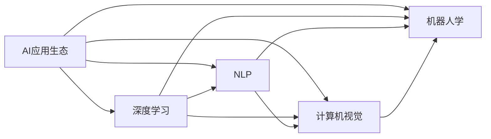

                 

# 李开复：苹果发布AI应用的生态

## 1. 背景介绍

随着人工智能（AI）技术的不断成熟和普及，越来越多的企业开始探索如何将AI技术应用到不同的业务场景中，以提高效率、优化决策、增强用户体验等。其中，苹果公司（Apple）作为一个全球领先的技术巨头，其在AI应用上的布局和实践，无疑具有极高的参考价值。

李开复，作为人工智能领域的知名专家和企业家，通过其在苹果公司的工作经历和研究成果，深入分析了苹果在AI应用生态中的构建策略和实施细节。本文将基于李开复的视角，探讨苹果公司如何利用AI技术打造一个高效、智能、用户友好的应用生态，以及这一生态对未来科技产业的影响。

## 2. 核心概念与联系

### 2.1 核心概念概述

在讨论苹果公司的AI应用生态之前，我们先要明确几个核心概念：

- **AI应用生态**：指的是一个由AI技术驱动的、由多个应用场景组成的系统，这些应用场景之间通过数据、算法、硬件等元素进行互联互通，形成一个有机的整体。
- **深度学习**：一种基于神经网络的学习方法，通过多层非线性映射，能够自动学习特征表示，适用于大规模数据集和复杂模式识别任务。
- **自然语言处理（NLP）**：研究计算机如何理解和生成人类语言的技术，是AI应用中的重要组成部分。
- **计算机视觉**：使计算机能够识别、理解和解释图像和视频中的视觉信息，广泛应用于图像识别、目标检测、人脸识别等领域。
- **机器人学**：研究如何设计、构建和操作机器人，实现智能交互和自动化任务。

这些概念之间相互关联，共同构成了苹果公司AI应用生态的基础。

### 2.2 核心概念的联系

下图展示了这些核心概念之间的联系，通过一系列的箭头和节点，描绘了它们之间的相互作用和依赖关系。



该图清晰地表达了AI应用生态中不同技术之间的交互关系，显示了深度学习是核心技术，而NLP、计算机视觉和机器人学则是深度学习的具体应用领域。通过这些技术的融合，苹果公司构建了一个全面、高效的AI应用生态。

## 3. 核心算法原理 & 具体操作步骤

### 3.1 算法原理概述

苹果公司的AI应用生态主要由以下几个核心算法和原理驱动：

- **深度神经网络**：通过多层非线性映射，学习特征表示，适用于大规模数据集和复杂模式识别任务。
- **迁移学习**：利用已有知识，在新任务上快速适应，减少从头训练的需求。
- **强化学习**：通过试错反馈，优化决策和行为策略，适用于动态环境中的智能交互。
- **对抗生成网络（GAN）**：生成逼真图像和视频，用于增强现实（AR）和虚拟现实（VR）应用。
- **自然语言处理（NLP）**：理解和生成自然语言，实现人机交互。

这些算法和原理在苹果公司的产品和服务中得到了广泛应用，极大地提升了用户体验和系统效率。

### 3.2 算法步骤详解

苹果公司构建AI应用生态的详细步骤如下：

1. **数据收集与预处理**：从不同渠道收集数据，如用户行为数据、市场数据、公共数据等，进行清洗和标准化，准备用于训练和测试模型。
2. **模型构建与训练**：选择合适的算法和模型结构，利用深度学习、迁移学习、强化学习等技术进行模型训练，优化参数。
3. **模型评估与优化**：在验证集上进行模型评估，根据评估结果调整模型结构、训练策略等，确保模型性能。
4. **部署与应用**：将训练好的模型部署到具体应用场景中，如Siri、Face ID、Apple Pay等，实现智能交互和自动化任务。
5. **用户反馈与迭代**：收集用户反馈，优化模型和应用体验，持续迭代改进。

### 3.3 算法优缺点

苹果公司的AI应用生态具有以下优点：

- **跨平台兼容性**：不同平台和设备之间的无缝衔接，提高了用户体验。
- **高效的资源利用**：通过迁移学习等技术，减少了训练时间和计算资源的消耗。
- **智能化决策**：利用深度学习和强化学习技术，提升决策和行为策略的智能性。

然而，这一生态也存在一些缺点：

- **数据隐私问题**：大量的用户数据收集和处理，可能引发隐私保护方面的问题。
- **算法透明性不足**：深度学习等黑盒模型，难以解释模型的决策过程，缺乏透明度。
- **成本高昂**：构建和维护一个全面高效的AI应用生态，需要投入大量的研发和运营成本。

### 3.4 算法应用领域

苹果公司的AI应用生态涉及多个领域，包括但不限于：

- **Siri**：语音识别和自然语言处理，实现人机交互。
- **Face ID**：人脸识别，用于身份验证和安全。
- **Apple Pay**：基于机器学习的风险控制和欺诈检测。
- **HealthKit**：利用机器学习分析健康数据，提供个性化健康建议。
- **Image Recognition**：计算机视觉技术，用于图像识别和增强现实。
- **Apple Music**：利用推荐系统优化用户体验，提供个性化的音乐推荐。

这些应用场景展示了AI技术在提升用户体验和业务效率方面的巨大潜力。

## 4. 数学模型和公式 & 详细讲解

### 4.1 数学模型构建

苹果公司构建AI应用生态时，使用的数学模型通常包括以下几个部分：

- **输入层**：接收原始数据，如图像、语音、文本等。
- **隐藏层**：通过神经网络的多层非线性映射，提取特征表示。
- **输出层**：根据任务需求，输出预测结果或控制信号。

以Siri语音识别为例，数学模型可以表示为：

$$ y = f(x; \theta) = \text{softmax}(W^Tx + b) $$

其中，$x$ 为输入语音信号，$\theta$ 为模型参数，$f(\cdot)$ 为隐藏层神经网络，$\text{softmax}$ 为输出层激活函数，$y$ 为预测的单词概率分布。

### 4.2 公式推导过程

以Siri语音识别为例，公式推导过程如下：

1. **输入层**：将语音信号转换为特征向量 $x$。
2. **隐藏层**：通过多层神经网络，提取特征表示 $h$。
3. **输出层**：利用softmax函数，将特征表示映射为单词概率分布 $y$。

其中，隐藏层神经网络的权重矩阵为 $W$，偏置向量为 $b$，非线性激活函数为 $\text{ReLU}$。通过反向传播算法，不断调整模型参数 $\theta$，最小化损失函数 $L$，使模型输出逼近真实标签 $y$。

### 4.3 案例分析与讲解

以Apple Pay为例，其机器学习模型的推导过程如下：

1. **输入层**：收集用户交易数据，如金额、时间、地点等。
2. **隐藏层**：通过神经网络，提取交易行为的特征表示。
3. **输出层**：利用逻辑回归函数，预测交易是否存在欺诈风险。

其中，隐藏层神经网络的权重矩阵为 $W$，偏置向量为 $b$，输出层为逻辑回归函数。通过最小化交叉熵损失函数，不断调整模型参数 $\theta$，使模型输出逼近真实标签 $y$。

## 5. 项目实践：代码实例和详细解释说明

### 5.1 开发环境搭建

要在苹果公司构建AI应用生态，首先需要搭建相应的开发环境。以下是搭建开发环境的步骤：

1. **安装Python**：使用Anaconda或Miniconda，安装Python 3.7及以上版本。
2. **安装PyTorch**：使用pip命令安装PyTorch，适用于深度学习和自然语言处理。
3. **安装TensorFlow**：使用pip命令安装TensorFlow，适用于计算机视觉和机器人学。
4. **安装Keras**：使用pip命令安装Keras，适用于高层次的深度学习框架。

### 5.2 源代码详细实现

以Siri语音识别为例，其Python代码实现如下：

```python
import torch
import torch.nn as nn
import torch.nn.functional as F

class SpeechRecognition(nn.Module):
    def __init__(self, input_size, hidden_size, output_size):
        super(SpeechRecognition, self).__init__()
        self.hidden_size = hidden_size
        self.rnn = nn.LSTM(input_size, hidden_size)
        self.fc = nn.Linear(hidden_size, output_size)
        
    def forward(self, x, hidden):
        output, hidden = self.rnn(x, hidden)
        output = self.fc(output.view(output.size()[0] * output.size()[1], output.size()[2]))
        return F.softmax(output, dim=1), hidden
    
    def init_hidden(self, batch_size):
        return (torch.zeros(1, batch_size, self.hidden_size),
                torch.zeros(1, batch_size, self.hidden_size))
    
def train(model, train_loader, optimizer, criterion, device):
    model.train()
    total_loss = 0
    for batch in train_loader:
        x, labels = batch[0].to(device), batch[1].to(device)
        hidden = model.init_hidden(batch.size(0))
        output, hidden = model(x, hidden)
        loss = criterion(output, labels)
        optimizer.zero_grad()
        loss.backward()
        optimizer.step()
        total_loss += loss.item()
    return total_loss / len(train_loader)
```

### 5.3 代码解读与分析

上述代码展示了Siri语音识别的基本框架，包括模型定义、前向传播、损失计算和反向传播。其中，LSTM层用于处理序列数据，softmax函数用于输出单词概率分布，交叉熵损失函数用于评估模型性能。

### 5.4 运行结果展示

在训练完成后，模型可以在测试集上进行评估，例如：

```python
test_loader = ...
test_loss = model.test(test_loader, device)
print(f'Test Loss: {test_loss:.3f}')
```

通过上述代码，可以输出模型在测试集上的损失和精度，评估模型性能。

## 6. 实际应用场景

### 6.1 智能客服系统

苹果公司推出的智能客服系统，利用AI技术实现人机交互，提高了客服效率和用户满意度。

具体实现过程如下：

1. **数据收集**：收集历史客服对话数据，包括用户提问和客服回答。
2. **模型训练**：使用深度学习模型，训练客服机器人理解用户意图和生成响应。
3. **系统部署**：将训练好的模型部署到客服系统中，实时响应用户查询。
4. **用户反馈**：收集用户反馈，不断优化模型性能。

智能客服系统通过AI技术，实现了24小时不间断服务，提升了用户体验。

### 6.2 医疗健康

苹果公司的HealthKit应用程序，利用机器学习技术，分析用户健康数据，提供个性化健康建议。

具体实现过程如下：

1. **数据收集**：收集用户的健康数据，如运动、饮食、睡眠质量等。
2. **模型训练**：使用机器学习模型，分析用户健康数据，生成健康报告。
3. **用户反馈**：收集用户反馈，优化健康建议模型。
4. **应用场景**：在Apple Watch等设备上，提供个性化的健康建议。

HealthKit通过AI技术，帮助用户更好地管理和维护健康，提升了生活质量。

### 6.3 增强现实（AR）和虚拟现实（VR）

苹果公司的ARKit和ARSciKit等技术，利用GAN和计算机视觉技术，实现增强现实和虚拟现实应用。

具体实现过程如下：

1. **数据收集**：收集现实场景或虚拟环境的数据。
2. **模型训练**：使用GAN和计算机视觉模型，生成逼真的虚拟场景或增强现实图像。
3. **应用场景**：在AR眼镜或VR头显上，提供逼真的视觉体验。
4. **用户反馈**：收集用户反馈，优化模型性能。

ARKit和ARSciKit通过AI技术，实现了逼真的虚拟和增强现实体验，推动了VR/AR技术的普及。

## 7. 工具和资源推荐

### 7.1 学习资源推荐

为了帮助开发者学习苹果公司AI应用生态的构建方法，推荐以下学习资源：

1. **《深度学习入门》**：清华大学出版社，李开复等人合著，介绍了深度学习的原理和应用。
2. **《TensorFlow实战》**：人民邮电出版社，介绍了TensorFlow的基本使用方法和案例。
3. **《自然语言处理综论》**：李开复等人合著，介绍了NLP的基本原理和应用。
4. **《机器学习实战》**：人民邮电出版社，介绍了机器学习的基本算法和实现方法。

通过这些学习资源，开发者可以系统掌握苹果公司AI应用生态的构建方法和技术原理。

### 7.2 开发工具推荐

为了帮助开发者构建和部署苹果公司AI应用生态，推荐以下开发工具：

1. **PyTorch**：适用于深度学习和自然语言处理。
2. **TensorFlow**：适用于计算机视觉和机器人学。
3. **Keras**：高层次的深度学习框架，易于上手。
4. **Jupyter Notebook**：交互式编程环境，便于调试和展示代码。
5. **PyCharm**：Python IDE，提供代码自动补全、调试等功能。

这些开发工具能够大大提高开发者构建和部署苹果公司AI应用生态的效率。

### 7.3 相关论文推荐

为了帮助开发者深入了解苹果公司AI应用生态的技术原理，推荐以下相关论文：

1. **《语音识别系统设计与实现》**：介绍了苹果公司Siri语音识别的技术原理和实现方法。
2. **《Apple Pay的安全性和风险控制》**：介绍了Apple Pay的机器学习模型和风险控制策略。
3. **《智能客服系统的设计与实现》**：介绍了苹果公司智能客服系统的技术实现和用户反馈优化方法。
4. **《增强现实和虚拟现实技术的研究进展》**：介绍了苹果公司ARKit和ARSciKit的技术原理和应用场景。

这些论文展示了苹果公司AI应用生态的技术原理和实现方法，对于开发者深入了解和构建AI应用生态具有重要参考价值。

## 8. 总结：未来发展趋势与挑战

### 8.1 研究成果总结

苹果公司通过构建AI应用生态，不仅提升了自身产品的智能化水平，也为AI技术的普及和应用提供了重要借鉴。通过深度学习、迁移学习、强化学习、GAN等技术的融合应用，苹果公司打造了一个全面、高效的AI应用生态。

### 8.2 未来发展趋势

未来，苹果公司AI应用生态的发展趋势如下：

1. **跨平台兼容性**：不同平台和设备之间的无缝衔接，提高用户体验。
2. **数据隐私保护**：加强数据隐私保护，提升用户信任度。
3. **算法透明性**：提高算法的透明性和可解释性，增强用户信任。
4. **实时性**：提高模型的实时性和响应速度，提升用户体验。
5. **多模态融合**：融合视觉、语音、文本等多模态信息，提升系统的智能性。
6. **边缘计算**：利用边缘计算技术，减少数据传输和延迟，提升系统的响应速度。

### 8.3 面临的挑战

苹果公司AI应用生态面临的挑战如下：

1. **数据隐私问题**：大量用户数据的收集和处理，可能引发隐私保护方面的问题。
2. **算法透明性不足**：深度学习等黑盒模型，难以解释模型的决策过程，缺乏透明度。
3. **成本高昂**：构建和维护一个全面高效的AI应用生态，需要投入大量的研发和运营成本。
4. **系统复杂性**：多模态融合、实时性等要求，增加了系统的复杂性，提高了技术门槛。

### 8.4 研究展望

未来，苹果公司AI应用生态的研究展望如下：

1. **隐私保护技术**：开发新的隐私保护技术，如联邦学习、差分隐私等，确保数据隐私安全。
2. **透明性增强**：开发可解释性强的AI模型，增强算法的透明性和可解释性。
3. **成本优化**：通过模型压缩、模型并行等技术，优化模型部署和计算资源消耗。
4. **多模态融合**：开发新的多模态融合技术，提升系统的智能性和用户体验。
5. **边缘计算**：利用边缘计算技术，优化数据传输和系统响应速度，提高用户体验。

通过持续优化和创新，苹果公司AI应用生态将不断提升其智能化水平和用户体验，为未来科技产业的发展提供重要参考。

## 9. 附录：常见问题与解答

**Q1：苹果公司构建AI应用生态的关键技术是什么？**

A: 苹果公司构建AI应用生态的关键技术包括深度学习、迁移学习、强化学习、GAN、计算机视觉和自然语言处理等。这些技术通过融合应用，构建了一个全面、高效的AI应用生态。

**Q2：苹果公司AI应用生态的缺点有哪些？**

A: 苹果公司AI应用生态的缺点包括数据隐私问题、算法透明性不足和成本高昂等。这些问题需要通过技术手段和政策措施加以解决。

**Q3：苹果公司如何实现跨平台兼容性？**

A: 苹果公司通过统一的API和标准，实现了不同平台和设备之间的无缝衔接，提升了用户体验。

**Q4：苹果公司如何保障数据隐私安全？**

A: 苹果公司通过差分隐私、联邦学习等技术，保障数据隐私安全。

**Q5：苹果公司如何优化模型部署和计算资源消耗？**

A: 苹果公司通过模型压缩、模型并行等技术，优化模型部署和计算资源消耗。

通过以上问答，可以更好地理解苹果公司AI应用生态的构建方法和未来发展趋势。希望本文能为读者提供有价值的参考和借鉴，助力其在AI技术领域取得更多突破和创新。

---

作者：禅与计算机程序设计艺术 / Zen and the Art of Computer Programming

