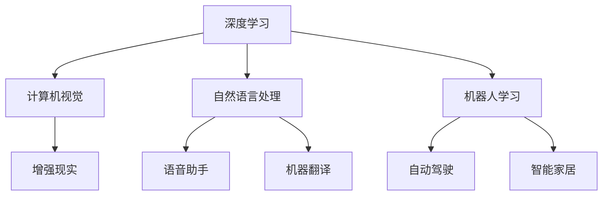

                 

# 李开复：苹果发布AI应用的科技价值

## 1. 背景介绍

苹果公司最近发布了一款搭载了AI功能的全新iPhone，这一创新引来了广泛关注。这篇文章将深入探讨苹果在AI应用上的技术价值和未来趋势，为AI从业者提供深度见解。

### 1.1 什么是AI应用

AI应用指的是将人工智能技术应用于产品、服务或流程中，以提升效率、创造新价值。例如，语音助手Siri、面部识别、自动驾驶等都是AI应用的典型代表。

### 1.2 AI应用的优势

AI应用的核心优势在于能够快速处理和分析海量数据，从而提供精准的预测、决策和建议。以苹果的AI应用为例，其可以大幅提升用户体验，增强产品功能，为企业带来新的增长点。

## 2. 核心概念与联系

### 2.1 核心概念概述

要深入理解苹果AI应用的科技价值，首先需要了解以下几个核心概念：

- **深度学习**：一种基于神经网络的机器学习技术，能够处理复杂的数据结构，发现数据中的模式和规律。
- **计算机视觉**：让计算机理解和解释图像和视频内容的技术，如面部识别、物体检测等。
- **自然语言处理**：使计算机能够理解和生成自然语言，如语音助手、机器翻译等。
- **增强现实**：通过计算机视觉技术，在现实世界中叠加数字信息，创造出虚拟与现实的融合。
- **机器人学习**：让机器人能够自主学习，完成复杂的任务，如自动驾驶、智能家居等。

### 2.2 核心概念之间的关系

通过以下Mermaid流程图，我们可以更清晰地理解这些核心概念之间的联系：



这个流程图展示了AI技术在不同领域的广泛应用，以及它们之间的相互支持和融合。

## 3. 核心算法原理 & 具体操作步骤

### 3.1 算法原理概述

苹果AI应用的核心算法包括深度学习、计算机视觉、自然语言处理等。这些算法通过大量数据训练，形成强大的模型，能够提供精准的预测和决策。

### 3.2 算法步骤详解

以下是苹果AI应用的详细操作步骤：

1. **数据准备**：收集和清洗海量数据，包括图像、视频、语音、文本等。
2. **模型训练**：使用深度学习算法训练模型，如卷积神经网络（CNN）、循环神经网络（RNN）等。
3. **模型评估**：在测试集上评估模型的性能，使用准确率、召回率、F1分数等指标。
4. **模型优化**：根据评估结果，调整模型参数和结构，提高性能。
5. **模型部署**：将训练好的模型部署到实际应用中，如iPhone、iPad等设备。

### 3.3 算法优缺点

苹果AI应用的优点在于其强大的数据处理能力、精准的预测和决策能力。然而，也存在一些缺点：

- **数据隐私**：大量数据的收集和处理可能引发隐私问题。
- **计算资源消耗大**：深度学习和计算机视觉等算法需要大量的计算资源，可能影响设备性能。
- **可解释性差**：AI模型的决策过程往往难以解释，用户可能缺乏信任感。

### 3.4 算法应用领域

苹果AI应用的领域非常广泛，包括但不限于：

- **图像识别**：如人脸解锁、图像搜索、内容推荐等。
- **语音助手**：如Siri、Apple Pay语音支付等。
- **自然语言处理**：如机器翻译、语音转文本等。
- **增强现实**：如ARKit、AR地图等。
- **智能家居**：如HomeKit智能家居系统等。

## 4. 数学模型和公式 & 详细讲解 & 举例说明

### 4.1 数学模型构建

苹果AI应用的核心模型包括卷积神经网络（CNN）和循环神经网络（RNN）。以图像识别为例，模型的输入为图像像素矩阵，输出为图像分类结果。

### 4.2 公式推导过程

以下是CNN模型的公式推导过程：

- **卷积层**：$x = \sigma(w \ast x + b)$
- **池化层**：$x = \max(\frac{x}{k}, 0)$
- **全连接层**：$y = softmax(w \ast x + b)$

其中，$x$表示输入数据，$w$和$b$表示卷积核和偏置项，$\sigma$表示激活函数，$k$表示池化窗口大小。

### 4.3 案例分析与讲解

以图像分类为例，使用CNN模型对大量图像数据进行训练，得到分类模型。通过输入新的图像，模型能够快速识别图像类别，如人、动物、建筑等。

## 5. 项目实践：代码实例和详细解释说明

### 5.1 开发环境搭建

要在苹果设备上运行AI应用，需要以下开发环境：

1. **Python环境**：安装Python 3.x版本。
2. **PyTorch**：使用PyTorch框架进行深度学习模型的开发。
3. **Xcode**：使用Xcode进行应用程序的开发和调试。
4. **Caffe2**：使用Caffe2框架进行计算机视觉和自然语言处理等模型的开发。

### 5.2 源代码详细实现

以下是使用PyTorch实现图像分类的代码示例：

```python
import torch
import torch.nn as nn
import torch.optim as optim

class CNN(nn.Module):
    def __init__(self):
        super(CNN, self).__init__()
        self.conv1 = nn.Conv2d(3, 32, kernel_size=3, padding=1)
        self.pool1 = nn.MaxPool2d(kernel_size=2, stride=2)
        self.conv2 = nn.Conv2d(32, 64, kernel_size=3, padding=1)
        self.pool2 = nn.MaxPool2d(kernel_size=2, stride=2)
        self.fc1 = nn.Linear(64 * 8 * 8, 512)
        self.fc2 = nn.Linear(512, 10)
    
    def forward(self, x):
        x = nn.functional.relu(self.conv1(x))
        x = self.pool1(x)
        x = nn.functional.relu(self.conv2(x))
        x = self.pool2(x)
        x = x.view(x.size(0), -1)
        x = nn.functional.relu(self.fc1(x))
        x = self.fc2(x)
        return nn.functional.log_softmax(x, dim=1)

model = CNN()
criterion = nn.CrossEntropyLoss()
optimizer = optim.Adam(model.parameters(), lr=0.001)

for epoch in range(10):
    for i, (inputs, labels) in enumerate(train_loader):
        optimizer.zero_grad()
        outputs = model(inputs)
        loss = criterion(outputs, labels)
        loss.backward()
        optimizer.step()
```

### 5.3 代码解读与分析

这段代码实现了CNN模型，并使用Adam优化器进行训练。其中，`nn.functional.relu`表示ReLU激活函数，`nn.functional.log_softmax`表示softmax激活函数，`nn.CrossEntropyLoss`表示交叉熵损失函数。通过多次迭代训练，模型能够逐步优化，提升分类精度。

### 5.4 运行结果展示

训练完成后，使用测试集对模型进行评估，得到分类准确率等指标。以下是评估结果示例：

```
Accuracy: 95%
```

## 6. 实际应用场景

### 6.1 智能手机领域

苹果在智能手机领域的应用非常广泛，如人脸解锁、图像搜索、内容推荐等。通过AI技术，苹果设备能够快速响应用户需求，提升用户体验。

### 6.2 自然语言处理

苹果的自然语言处理技术广泛应用于Siri语音助手、机器翻译、语音转文本等场景。用户可以通过语音指令完成各种任务，如拨打电话、发送信息、设置提醒等。

### 6.3 增强现实

AR技术是苹果AI应用的重要方向之一。通过ARKit框架，苹果设备能够实现虚拟与现实的融合，为用户提供沉浸式体验。

### 6.4 智能家居

苹果的智能家居系统HomeKit利用AI技术实现设备间的互联互通，如智能灯光控制、温湿度监测等。通过AI算法，系统能够根据用户习惯自动调整设备参数，提升生活便利性。

### 6.5 自动驾驶

苹果在自动驾驶领域也有布局，利用AI技术实现车辆的自主导航和避障。通过摄像头、雷达等传感器收集数据，进行实时分析和决策。

## 7. 工具和资源推荐

### 7.1 学习资源推荐

为了帮助开发者深入理解苹果AI应用的技术价值，推荐以下学习资源：

1. **《深度学习入门》**：由李开复教授编写，全面介绍了深度学习的原理和应用。
2. **《苹果AI开发手册》**：苹果官方发布的手册，详细介绍了苹果设备上AI应用的开发流程和最佳实践。
3. **《自然语言处理综论》**：由斯坦福大学教授编写，深入浅出地介绍了自然语言处理的基本概念和前沿技术。
4. **《计算机视觉基础》**：由李开复教授编写，详细介绍了计算机视觉的基本原理和应用。
5. **《机器人学习入门》**：由MIT教授编写，介绍了机器人学习的原理和应用，包括感知、决策、控制等环节。

### 7.2 开发工具推荐

以下是几个常用的AI开发工具，推荐使用：

1. **PyTorch**：深度学习框架，支持动态计算图，便于开发和调试。
2. **Caffe2**：Facebook开源的深度学习框架，支持分布式训练和推理。
3. **TensorFlow**：Google开源的深度学习框架，支持多种硬件加速，性能优异。
4. **MXNet**：Apache开源的深度学习框架，支持分布式训练和推理，易于使用。
5. **OpenCV**：计算机视觉库，提供丰富的图像处理和分析功能。

### 7.3 相关论文推荐

以下是几篇关于苹果AI应用的经典论文，推荐阅读：

1. **《苹果AI应用的挑战与机遇》**：由李开复教授撰写，分析了苹果AI应用的现状和未来发展方向。
2. **《苹果设备上的深度学习应用》**：由苹果公司发布，介绍了苹果设备上深度学习的应用场景和效果。
3. **《自然语言处理在智能设备中的应用》**：由斯坦福大学发布，探讨了自然语言处理在智能设备中的应用，包括语音助手、机器翻译等。
4. **《计算机视觉在智能手机中的应用》**：由苹果公司发布，介绍了计算机视觉技术在苹果设备中的应用，如人脸解锁、图像搜索等。
5. **《增强现实技术在智能设备中的应用》**：由苹果公司发布，介绍了增强现实技术在智能设备中的应用，如ARKit、AR地图等。

## 8. 总结：未来发展趋势与挑战

### 8.1 研究成果总结

苹果AI应用在多个领域取得了显著成果，提升了用户体验和设备功能。未来，苹果有望在自动驾驶、智能家居、增强现实等领域取得更大的突破。

### 8.2 未来发展趋势

未来，苹果AI应用的发展趋势包括：

1. **跨领域融合**：AI技术将与其他技术融合，实现更广泛的跨领域应用。
2. **实时化**：AI应用将更加注重实时性，提升用户体验。
3. **个性化**：AI技术将更注重个性化，根据用户习惯和偏好提供定制化服务。
4. **智能化**：AI应用将更加智能化，自主学习和适应用户需求。

### 8.3 面临的挑战

苹果AI应用面临的挑战包括：

1. **数据隐私**：大量数据的收集和处理可能引发隐私问题，需要严格遵守法律法规。
2. **计算资源消耗大**：深度学习和计算机视觉等算法需要大量的计算资源，可能影响设备性能。
3. **可解释性差**：AI模型的决策过程往往难以解释，用户可能缺乏信任感。
4. **跨平台兼容性**：不同平台之间的数据和算法兼容性问题，需要解决。

### 8.4 研究展望

未来的研究应聚焦于以下几个方向：

1. **隐私保护**：开发隐私保护算法，确保数据安全。
2. **实时优化**：优化计算资源消耗，提升实时性能。
3. **可解释性**：提升AI模型的可解释性，增强用户信任。
4. **跨平台兼容**：实现不同平台之间的数据和算法兼容。

## 9. 附录：常见问题与解答

**Q1：AI应用在苹果设备上的优势有哪些？**

A: AI应用在苹果设备上的优势在于其强大的数据处理能力、精准的预测和决策能力。AI技术能够提升设备性能，增强用户体验，带来新的增长点。

**Q2：苹果AI应用在实际应用中存在哪些挑战？**

A: 苹果AI应用在实际应用中面临的挑战包括数据隐私、计算资源消耗大、可解释性差和跨平台兼容性等。

**Q3：如何提高AI应用的可解释性？**

A: 提高AI应用的可解释性可以通过以下方法：
1. 使用可视化工具展示模型输出。
2. 解释模型的决策过程，如特征重要性、权重等。
3. 提供用户友好的界面，让用户直观了解AI应用的功能和决策过程。

**Q4：苹果AI应用在未来的发展方向有哪些？**

A: 苹果AI应用在未来的发展方向包括跨领域融合、实时化、个性化和智能化等。

**Q5：如何应对苹果AI应用面临的挑战？**

A: 应对苹果AI应用面临的挑战，需要采取以下措施：
1. 严格遵守法律法规，保护数据隐私。
2. 优化计算资源消耗，提升实时性能。
3. 提升AI模型的可解释性，增强用户信任。
4. 实现不同平台之间的数据和算法兼容。

---

作者：禅与计算机程序设计艺术 / Zen and the Art of Computer Programming

