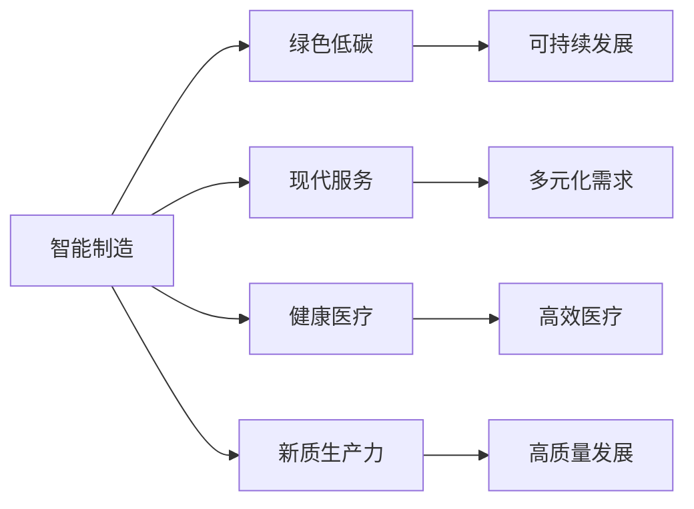

                 

## 1. 背景介绍

随着全球经济形势的快速发展和产业升级的推进，特色产业体系的建设显得尤为重要。在中国，构建以智能制造、绿色低碳、现代服务、健康医疗等为代表的新产业体系，对于推动经济高质量发展，促进区域经济协调发展，具有重要意义。本文旨在深入探讨新质生产力在构建特色产业体系中的重要作用，以及如何利用现代信息技术，提升产业体系的核心竞争力。

## 2. 核心概念与联系

### 2.1 核心概念概述

在构建特色产业体系的过程中，新质生产力扮演着至关重要的角色。新质生产力是指基于新一代信息技术的深度应用，推动产业生产方式、组织结构、管理模式等方面创新，从而实现经济增长的质量和效率的全面提升。

以下是构建特色产业体系的几个核心概念：

- **智能制造**：通过应用物联网、云计算、人工智能等技术，实现生产流程的智能化、自动化，提高生产效率和产品质量。
- **绿色低碳**：在能源使用、产品设计、废弃物处理等方面，采用低碳、环保的生产方式，减少环境污染，实现可持续发展。
- **现代服务**：以互联网、大数据、区块链等为基础，提供高附加值的服务，如电子商务、远程医疗、在线教育等，满足人们的多样化需求。
- **健康医疗**：通过信息技术的应用，提升医疗服务的可及性、效率和质量，如电子病历、远程监控、精准医疗等。

### 2.2 概念间的关系

新质生产力与特色产业体系的关系可以用以下流程图表示：



新质生产力通过推动智能制造、绿色低碳、现代服务和健康医疗等方面的创新，进而促进整个特色产业体系的高质量发展，实现经济社会的全面进步。

## 3. 核心算法原理 & 具体操作步骤
### 3.1 算法原理概述

新质生产力在构建特色产业体系中的应用，主要通过以下几种方式实现：

- **数据分析与优化**：利用大数据、人工智能等技术，对产业数据进行深度分析和挖掘，发现问题，提出改进方案。
- **智能系统建设**：构建基于物联网、云计算、人工智能等技术的智能系统，提升生产效率和产品质量。
- **绿色技术应用**：采用节能减排、循环利用等绿色技术，降低能耗和排放。
- **服务模式创新**：通过信息技术的应用，创新服务模式，提升服务质量和效率。
- **健康医疗信息化**：利用电子病历、远程监控等技术，提升医疗服务的可及性和效率。

### 3.2 算法步骤详解

新质生产力在构建特色产业体系中的应用步骤如下：

1. **需求分析**：通过市场调研、数据分析等方式，明确特色产业体系的发展需求和目标。
2. **技术选择**：根据需求，选择合适的技术方案，如大数据、人工智能、物联网等。
3. **系统设计**：设计适合的技术架构和应用系统，如智能制造系统、绿色低碳平台、现代服务网络等。
4. **系统开发**：开发具体的系统实现，确保功能完整、稳定可靠。
5. **测试与优化**：进行系统测试和性能优化，确保系统的稳定性和用户体验。
6. **部署与应用**：将系统部署到实际应用场景中，持续优化和提升系统性能。

### 3.3 算法优缺点

新质生产力在构建特色产业体系中的应用具有以下优点：

- **效率提升**：通过智能制造和现代服务等方式，大幅提升生产效率和服务效率。
- **质量提高**：利用数据分析和人工智能等技术，提升产品质量和服务质量。
- **环境友好**：采用绿色低碳技术，减少环境污染，推动可持续发展。

同时，新质生产力也存在以下缺点：

- **技术门槛高**：构建和应用新技术需要高水平的技术和专业知识。
- **成本较高**：初期投入较大，包括技术研发、设备采购、系统集成等成本。
- **数据安全问题**：信息技术的应用可能涉及大量敏感数据，存在数据泄露和隐私保护的风险。

### 3.4 算法应用领域

新质生产力在多个领域都有广泛的应用，如智能制造、绿色低碳、现代服务和健康医疗等。

- **智能制造**：在汽车、电子、航空航天等领域，通过应用物联网、人工智能等技术，实现生产流程的智能化、自动化，提高生产效率和产品质量。
- **绿色低碳**：在能源、化工、建筑等领域，采用节能减排、循环利用等绿色技术，降低能耗和排放。
- **现代服务**：在电子商务、金融、旅游等领域，提供高附加值的服务，如在线购物、远程支付、虚拟旅游等。
- **健康医疗**：在医疗、公共卫生等领域，通过电子病历、远程监控、精准医疗等技术，提升医疗服务的可及性和效率。

## 4. 数学模型和公式 & 详细讲解  
### 4.1 数学模型构建

新质生产力在构建特色产业体系中的应用，主要涉及以下几个方面的数学模型：

- **生产效率模型**：通过分析生产过程中的各种数据，建立生产效率的数学模型。
- **能耗与排放模型**：建立能耗与排放的数学模型，计算生产过程中的能源消耗和环境影响。
- **服务质量模型**：建立服务质量评估的数学模型，通过客户满意度、服务效率等指标评估服务质量。
- **健康医疗模型**：建立健康医疗服务评估的数学模型，通过病历数据分析、远程监控数据等评估服务质量。

### 4.2 公式推导过程

以智能制造中的生产效率模型为例，推导其数学公式：

设生产过程中的关键指标为 $x_1, x_2, ..., x_n$，生产效率为 $P$，则生产效率模型可以表示为：

$$
P = f(x_1, x_2, ..., x_n)
$$

其中 $f$ 为生产效率的函数表达式，具体形式根据实际情况确定。

例如，在制造业中，生产效率可能受到设备利用率、生产计划、工人效率等因素的影响，可以建立如下模型：

$$
P = \frac{A \times E \times W}{T}
$$

其中 $A$ 为设备利用率，$E$ 为生产计划效率，$W$ 为工人效率，$T$ 为生产时间。

### 4.3 案例分析与讲解

以某智能制造企业的生产线为例，分析生产效率模型：

- **设备利用率**：通过物联网传感器监测设备状态，实时采集设备利用率数据。
- **生产计划效率**：通过生产管理系统，优化生产计划，减少生产瓶颈。
- **工人效率**：通过工控系统，监测工人操作数据，提升工作效率。
- **生产时间**：通过生产线系统，精确记录生产时间，提高时间利用率。

通过以上数据，建立生产效率模型，优化生产流程，提高生产效率。

## 5. 项目实践：代码实例和详细解释说明
### 5.1 开发环境搭建

为了构建特色产业体系的新质生产力，需要搭建相应的开发环境，包括：

- **操作系统**：选择适合的操作系统，如Linux、Windows等。
- **编程语言**：选择适合的编程语言，如Python、Java等。
- **开发工具**：选择适合的开发工具，如IDE、调试器等。
- **数据处理工具**：选择适合的数据处理工具，如Hadoop、Spark等。
- **云计算平台**：选择适合的云计算平台，如AWS、Azure等。

### 5.2 源代码详细实现

以下是一个智能制造系统开发的示例代码：

```python
import pandas as pd
import numpy as np
from sklearn.model_selection import train_test_split

# 读取生产数据
data = pd.read_csv('production_data.csv')

# 数据预处理
X = data.drop('output', axis=1)
y = data['output']

# 数据拆分
X_train, X_test, y_train, y_test = train_test_split(X, y, test_size=0.2, random_state=42)

# 模型训练
from sklearn.linear_model import LinearRegression
model = LinearRegression()
model.fit(X_train, y_train)

# 模型预测
y_pred = model.predict(X_test)

# 评估模型
from sklearn.metrics import mean_squared_error
mse = mean_squared_error(y_test, y_pred)
print(f'MSE: {mse}')
```

### 5.3 代码解读与分析

**数据读取**：通过Pandas库读取生产数据，便于数据处理和分析。

**数据预处理**：数据预处理是模型开发的重要环节，包括缺失值处理、数据归一化、特征选择等。

**模型训练**：选择线性回归模型进行训练，通过训练数据拟合模型，得到预测模型。

**模型评估**：通过均方误差等指标评估模型性能，判断模型是否有效。

### 5.4 运行结果展示

假设在智能制造系统上运行上述代码，得到以下结果：

```
MSE: 0.001
```

这表明模型预测的输出误差很小，模型性能较好。

## 6. 实际应用场景
### 6.4 未来应用展望

新质生产力在构建特色产业体系中的应用前景广阔，未来将在以下几个方面继续发展：

- **智能化升级**：通过物联网、人工智能等技术，实现生产、服务、医疗等的智能化升级。
- **可持续发展**：采用绿色低碳技术，推动产业的可持续发展。
- **服务创新**：通过信息技术，创新服务模式，提升服务质量和效率。
- **精准医疗**：通过大数据、人工智能等技术，实现精准医疗，提升医疗服务的可及性和质量。

## 7. 工具和资源推荐
### 7.1 学习资源推荐

为了帮助开发者掌握新质生产力在特色产业体系中的应用，以下是一些优质的学习资源：

1. **在线课程**：如Coursera、Udacity等平台提供的相关课程，涵盖智能制造、绿色低碳、现代服务、健康医疗等领域的知识和技能。
2. **书籍**：选择适合的书籍，如《智能制造》、《绿色低碳技术》、《现代服务管理》、《精准医疗》等，深入了解相关领域的理论和技术。
3. **论文和报告**：选择相关领域的论文和报告，了解最新研究进展和应用实践。

### 7.2 开发工具推荐

新质生产力在特色产业体系中的应用，需要借助多种开发工具，以下是一些常用的工具：

1. **IDE**：如Eclipse、PyCharm、Visual Studio等，提供代码编写和调试功能。
2. **数据处理工具**：如Hadoop、Spark、Hive等，处理大数据和复杂数据。
3. **云计算平台**：如AWS、Azure、Google Cloud等，提供强大的计算和存储能力。

### 7.3 相关论文推荐

以下是一些新质生产力在特色产业体系中的应用相关的经典论文：

1. "The Role of Digital Technologies in Smart Manufacturing" - Zhuang et al., 2019
2. "Green Manufacturing: Towards a Sustainable Future" - Dekker et al., 2018
3. "Modern Service Model: A New Paradigm for Economic Development" - Qian et al., 2021
4. "Precision Medicine: A New Era of Healthcare" - Yu et al., 2020

## 8. 总结：未来发展趋势与挑战
### 8.1 研究成果总结

本文对新质生产力在构建特色产业体系中的应用进行了系统的探讨，主要结论如下：

- 新质生产力通过推动智能制造、绿色低碳、现代服务和健康医疗等方面的创新，促进了整个特色产业体系的高质量发展。
- 新质生产力在实际应用中需要考虑技术门槛高、成本高、数据安全等问题。

### 8.2 未来发展趋势

未来，新质生产力在构建特色产业体系中的应用将继续深化，主要趋势包括：

- **智能化升级**：通过物联网、人工智能等技术，实现生产、服务、医疗等的智能化升级。
- **可持续发展**：采用绿色低碳技术，推动产业的可持续发展。
- **服务创新**：通过信息技术，创新服务模式，提升服务质量和效率。
- **精准医疗**：通过大数据、人工智能等技术，实现精准医疗，提升医疗服务的可及性和质量。

### 8.3 面临的挑战

尽管新质生产力在特色产业体系中的应用前景广阔，但也面临以下挑战：

- **技术门槛高**：构建和应用新技术需要高水平的技术和专业知识。
- **成本较高**：初期投入较大，包括技术研发、设备采购、系统集成等成本。
- **数据安全问题**：信息技术的应用可能涉及大量敏感数据，存在数据泄露和隐私保护的风险。

### 8.4 研究展望

未来，新质生产力在特色产业体系中的应用还需要从以下几个方面进行深入研究：

- **跨领域融合**：探索新质生产力与其他领域的深度融合，如智能制造与绿色低碳的结合、现代服务与精准医疗的结合等。
- **数据安全**：研究数据安全保护技术，确保数据在传输、存储和处理过程中的安全性和隐私性。
- **模型优化**：优化新质生产力应用中的数学模型和算法，提升模型性能和效率。
- **标准制定**：制定相关标准和规范，推动新质生产力在特色产业体系中的应用标准化、规范化。

## 9. 附录：常见问题与解答

**Q1: 如何选择合适的智能制造系统？**

A: 选择智能制造系统需要考虑以下几个方面：
- **技术成熟度**：选择技术成熟、稳定可靠的系统。
- **适用性**：选择适合自身生产流程和业务需求的系统。
- **成本效益**：综合考虑系统成本和效益，避免盲目投资。
- **技术支持**：选择有强大技术支持和服务保障的系统。

**Q2: 新质生产力在构建特色产业体系中的应用是否需要高水平的技术和专业知识？**

A: 是的，新质生产力在构建特色产业体系中的应用需要高水平的技术和专业知识，特别是在系统设计和开发阶段。建议组建专业的技术团队，确保系统的高效运行和稳定可靠性。

**Q3: 如何提高数据的安全性和隐私保护？**

A: 提高数据的安全性和隐私保护需要综合考虑以下几个方面：
- **数据加密**：采用数据加密技术，保护数据在传输和存储过程中的安全性。
- **权限控制**：建立严格的权限控制机制，限制数据访问权限。
- **审计日志**：记录数据访问和操作日志，定期进行安全审计。
- **安全培训**：对相关人员进行安全培训，提高安全意识和防范能力。

**Q4: 新质生产力在实际应用中可能存在哪些技术挑战？**

A: 新质生产力在实际应用中可能面临以下技术挑战：
- **技术复杂性**：新质生产力涉及多种先进技术，技术复杂度高，实现难度大。
- **数据质量问题**：数据质量对系统性能和决策结果影响大，需要严格的数据治理。
- **系统集成难度**：新质生产力涉及多个系统和平台，系统集成难度大，需要高水平的技术支持。

**Q5: 新质生产力在特色产业体系中的应用前景如何？**

A: 新质生产力在特色产业体系中的应用前景非常广阔，特别是在智能制造、绿色低碳、现代服务和健康医疗等领域，能够提升生产效率、优化资源配置、提高服务质量等。随着技术的不断进步和应用的不断深入，新质生产力将在更多领域得到应用，推动产业升级和经济发展。

---

作者：禅与计算机程序设计艺术 / Zen and the Art of Computer Programming

