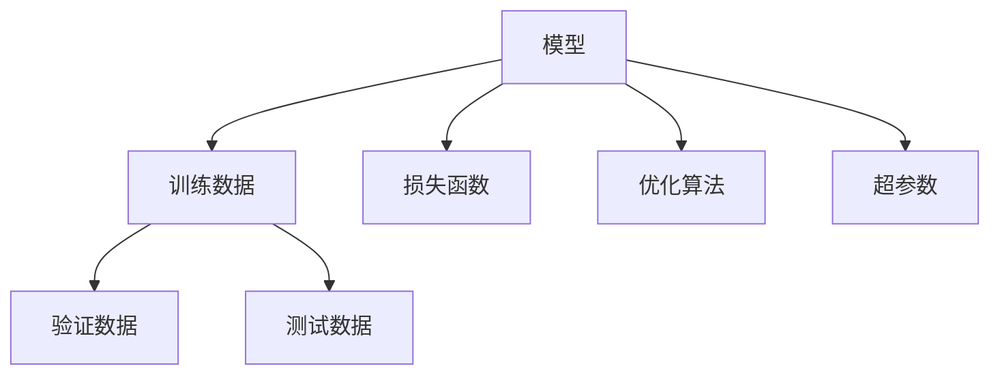
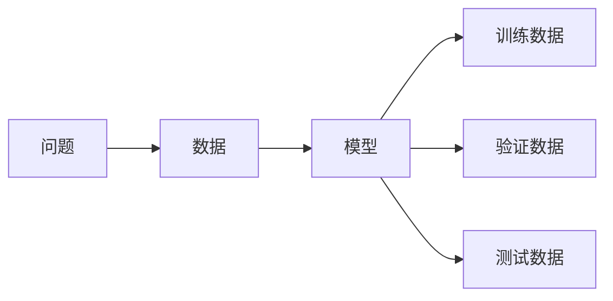
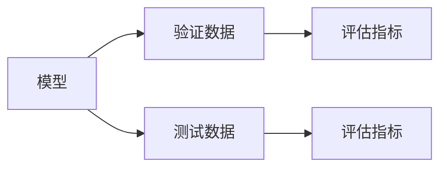
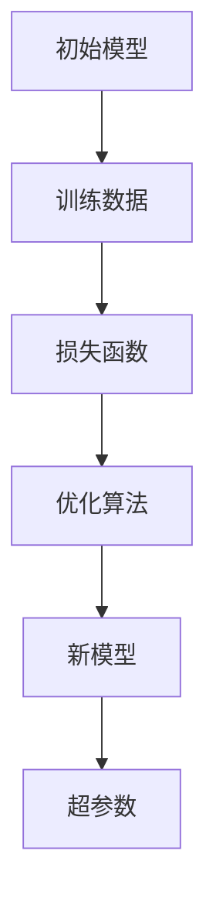
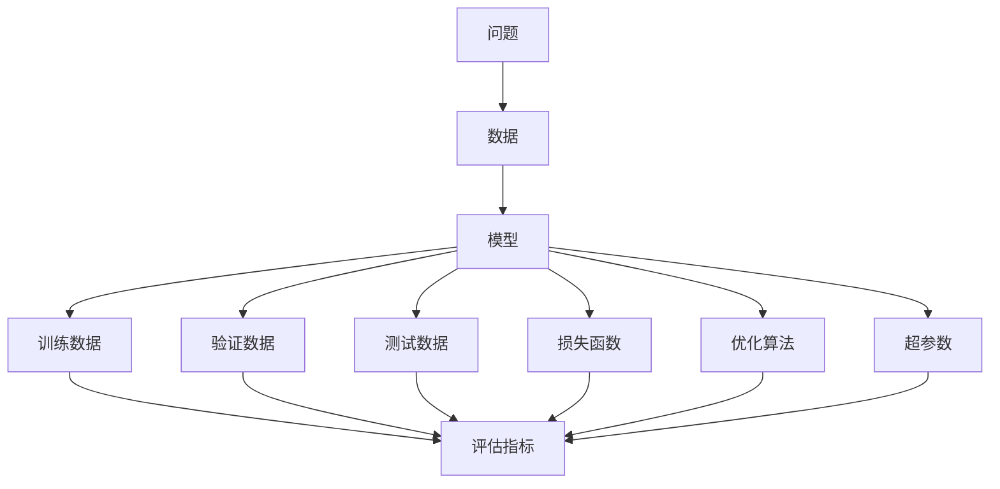

                 

# 模型思维:快速掌握新知识的捷径

## 1. 背景介绍

### 1.1 问题由来
在当今信息爆炸的时代，如何快速获取、理解、应用新的知识，成为了每个学习和工作者必须面对的挑战。传统的学习方式往往效率低下，记忆效果不佳，难以应对复杂多变的信息环境。而模型思维，作为现代社会的一种新兴知识获取方式，通过构建和应用各类模型，能够快速、准确地掌握新知识，提升学习和工作效率。

### 1.2 问题核心关键点
模型思维的核心在于构建各类模型，通过模型对数据进行抽象和归纳，获得对问题的深层次理解，进而快速迁移应用到新的场景。模型思维具备以下几个关键点：

- **模型抽象**：将具体问题抽象为可量化、可操作的形式。
- **数据驱动**：利用数据进行模型训练和验证，减少主观偏差。
- **知识迁移**：通过模型在特定任务上的训练和优化，快速适应新任务，提升模型泛化能力。
- **迭代优化**：持续收集数据，不断调整模型参数，提升模型精度。

模型思维的这些特性，使其在信息获取、问题解决、决策制定等领域展现出卓越的潜力。

### 1.3 问题研究意义
掌握模型思维，不仅有助于提升个人学习效率和问题解决能力，还可以为组织和企业带来创新和竞争优势。具体而言：

1. **提升学习效率**：通过构建模型，快速捕捉知识的本质和应用方法，减少时间和精力的投入。
2. **强化决策质量**：模型提供的量化分析结果，能够为决策提供客观依据，减少决策错误。
3. **促进创新应用**：模型提供的知识迁移能力，能够快速将已有知识应用到新场景，催生更多创新应用。
4. **增强竞争力**：组织通过模型思维的普及，提升整体创新能力和技术水平，在市场竞争中占据有利地位。

## 2. 核心概念与联系

### 2.1 核心概念概述

为了更好地理解模型思维及其应用，本节将介绍几个密切相关的核心概念：

- **模型**：用于描述问题和数据关系的数学或计算模型。
- **训练数据**：用于模型训练的数据集，包括标注数据和无标签数据。
- **验证数据**：用于模型验证的数据集，确保模型在新数据上的泛化能力。
- **测试数据**：用于模型测试的数据集，评估模型性能。
- **损失函数**：用于衡量模型预测与真实标签之间差异的函数。
- **优化算法**：用于调整模型参数，最小化损失函数的工具。
- **超参数**：模型训练中需要手动设置的参数，如学习率、批大小等。

这些概念之间的关系可以通过以下Mermaid流程图来展示：



这个流程图展示了模型思维中的关键环节：数据与模型的关系、模型的训练与验证过程，以及模型评估的方法。

### 2.2 概念间的关系

这些核心概念之间存在着紧密的联系，形成了模型思维的完整生态系统。下面我们通过几个Mermaid流程图来展示这些概念之间的关系。

#### 2.2.1 模型的构建与训练



这个流程图展示了模型构建和训练的基本流程：首先定义问题，然后收集相关数据，构建模型，最后在训练数据上对模型进行优化。

#### 2.2.2 模型的验证与测试



这个流程图展示了模型的验证和测试过程：模型在验证数据上进行评估，确定模型的泛化能力，然后在测试数据上进行最终评估，确认模型的性能。

#### 2.2.3 模型的优化与迭代



这个流程图展示了模型的优化与迭代过程：通过损失函数和优化算法，调整模型参数，得到新的模型，并根据超参数进行调整，重复迭代直至模型收敛。

### 2.3 核心概念的整体架构

最后，我们用一个综合的流程图来展示这些核心概念在大模型思维中的应用：



这个综合流程图展示了从问题定义到模型训练，再到模型验证和测试的完整过程。通过这些关键环节的协同工作，我们可以快速构建和优化模型，解决实际问题。

## 3. 核心算法原理 & 具体操作步骤
### 3.1 算法原理概述

模型思维的算法原理主要涉及模型的构建、训练和优化。模型的构建通常基于问题定义和数据特征，通过选择适当的模型类型和架构，对数据进行抽象和归纳。模型的训练则是在训练数据上，通过优化算法调整模型参数，最小化损失函数。模型的优化则通过验证和测试数据，评估模型性能，并根据需要进行迭代和调整。

### 3.2 算法步骤详解

模型思维的具体操作可以分为以下几个步骤：

**Step 1: 问题定义与数据收集**
- 明确问题需求和目标，定义模型的输入和输出。
- 收集相关的训练数据、验证数据和测试数据，确保数据的多样性和代表性。

**Step 2: 模型构建与选择**
- 根据问题特点和数据特征，选择适当的模型类型和架构，如线性回归、决策树、深度神经网络等。
- 设计模型的输入和输出接口，确保数据能够输入模型，输出结果符合预期。

**Step 3: 模型训练与优化**
- 将训练数据输入模型，使用优化算法调整模型参数，最小化损失函数。
- 在验证数据上评估模型性能，根据评估结果调整模型参数，优化模型结构。
- 在测试数据上评估模型性能，确保模型的泛化能力和实际应用效果。

**Step 4: 模型评估与部署**
- 根据测试数据上的评估结果，决定模型的最终性能。
- 将模型部署到实际应用场景中，收集反馈数据，持续优化模型。

### 3.3 算法优缺点

模型思维具有以下优点：

1. **高效性**：通过模型对数据进行抽象和归纳，能够快速掌握问题的本质和应用方法。
2. **灵活性**：模型提供了一种通用的问题解决方法，可以灵活应用于各种场景。
3. **泛化性**：模型通过训练数据获得泛化能力，能够在不同数据上取得稳定的性能。
4. **可解释性**：模型提供了一种量化分析方法，能够帮助理解和解释问题本质和解决方案。

同时，模型思维也存在一些局限性：

1. **复杂性**：模型构建和训练过程可能较为复杂，需要一定的专业知识。
2. **数据依赖**：模型的性能高度依赖于训练数据的质量和多样性。
3. **计算成本**：模型训练和优化需要大量计算资源，可能导致计算成本较高。
4. **模型偏见**：模型训练过程中可能引入数据偏见，导致模型输出存在偏见。

尽管存在这些局限性，但总体而言，模型思维是一种高效、灵活、可解释的解决问题的方案，广泛适用于各种学习和工作场景。

### 3.4 算法应用领域

模型思维在各个领域都有广泛的应用，以下是几个典型的应用场景：

**机器学习与数据分析**：通过构建和训练模型，从大规模数据中提取有用的信息，支持决策制定和业务优化。

**自然语言处理(NLP)**：通过构建语言模型，实现文本分类、情感分析、机器翻译等任务，提升文本处理能力。

**计算机视觉(CV)**：通过构建图像识别模型，实现图像分类、目标检测、图像生成等任务，提升图像处理能力。

**医疗诊断**：通过构建医疗模型，支持疾病的早期诊断和个性化治疗方案的制定，提升医疗服务的质量和效率。

**金融预测**：通过构建金融模型，支持市场趋势预测、风险评估、投资策略优化等任务，提升金融决策的科学性和准确性。

## 4. 数学模型和公式 & 详细讲解 & 举例说明

### 4.1 数学模型构建

模型思维的数学模型构建通常包括以下几个步骤：

1. **问题定义**：定义问题的输入和输出，明确模型的目标。
2. **数据准备**：收集和预处理训练数据、验证数据和测试数据。
3. **模型选择**：选择适当的模型类型和架构。
4. **模型训练**：在训练数据上训练模型，调整模型参数，最小化损失函数。
5. **模型验证**：在验证数据上评估模型性能，调整模型参数。
6. **模型测试**：在测试数据上测试模型性能，确定模型的最终性能。

### 4.2 公式推导过程

以线性回归模型为例，推导其训练过程。

线性回归模型的目标是最小化损失函数：

$$
\min_{\theta} \sum_{i=1}^n (y_i - \hat{y}_i)^2
$$

其中，$y_i$为实际标签，$\hat{y}_i$为模型预测结果，$\theta$为模型参数。

根据梯度下降优化算法，模型参数的更新公式为：

$$
\theta \leftarrow \theta - \eta \nabla_{\theta}L(\theta)
$$

其中，$\eta$为学习率，$\nabla_{\theta}L(\theta)$为损失函数对模型参数的梯度。

线性回归的梯度公式为：

$$
\nabla_{\theta}L(\theta) = \frac{2}{n}\sum_{i=1}^n (y_i - \hat{y}_i) x_i
$$

其中，$x_i$为模型输入。

通过这些公式，可以在训练数据上逐步调整模型参数，最小化损失函数，优化模型的预测能力。

### 4.3 案例分析与讲解

以房价预测为例，介绍模型思维在实际问题中的应用。

**Step 1: 问题定义与数据收集**
- 问题：给定房屋特征数据，预测其市场价格。
- 数据：收集房屋的面积、位置、房龄、户型等信息，作为模型输入。

**Step 2: 模型构建与选择**
- 模型：选择线性回归模型。
- 输入：房屋特征向量。
- 输出：房屋市场价格。

**Step 3: 模型训练与优化**
- 训练数据：收集历史房价数据，标注房屋特征和市场价格。
- 损失函数：均方误差损失。
- 优化算法：梯度下降算法。
- 模型参数：线性回归系数。

**Step 4: 模型评估与部署**
- 验证数据：随机抽取部分数据作为验证集，评估模型性能。
- 测试数据：使用剩余数据作为测试集，验证模型泛化能力。
- 部署应用：将模型部署到房价预测系统中，实时获取房价预测结果。

通过这些步骤，我们构建了一个简单的房价预测模型，并通过模型思维的方法，快速解决了房价预测问题。

## 5. 项目实践：代码实例和详细解释说明

### 5.1 开发环境搭建

在进行模型思维实践前，我们需要准备好开发环境。以下是使用Python进行Scikit-Learn开发的环境配置流程：

1. 安装Anaconda：从官网下载并安装Anaconda，用于创建独立的Python环境。

2. 创建并激活虚拟环境：
```bash
conda create -n sklearn-env python=3.8 
conda activate sklearn-env
```

3. 安装Scikit-Learn：
```bash
pip install scikit-learn
```

4. 安装各类工具包：
```bash
pip install numpy pandas scikit-learn matplotlib tqdm jupyter notebook ipython
```

完成上述步骤后，即可在`sklearn-env`环境中开始模型思维实践。

### 5.2 源代码详细实现

这里我们以房价预测为例，给出使用Scikit-Learn对线性回归模型进行训练和预测的Python代码实现。

首先，导入必要的库和数据集：

```python
from sklearn.datasets import load_boston
from sklearn.linear_model import LinearRegression
from sklearn.model_selection import train_test_split
import pandas as pd

# 加载波士顿房价数据集
boston = load_boston()
X = pd.DataFrame(boston.data, columns=boston.feature_names)
y = pd.Series(boston.target, name='MEDV')
```

然后，将数据集分为训练集和测试集：

```python
X_train, X_test, y_train, y_test = train_test_split(X, y, test_size=0.2, random_state=42)
```

接着，定义和训练模型：

```python
# 定义线性回归模型
model = LinearRegression()

# 训练模型
model.fit(X_train, y_train)
```

最后，进行模型评估和预测：

```python
# 在测试集上评估模型性能
print('测试集均方误差：', model.score(X_test, y_test))

# 对新数据进行预测
new_data = [[18.0, 2.3, 0.0, 0.53, 6.575, 65.2, 4.09, 1, 296, 15, 390]
prediction = model.predict(new_data)
print('预测房价：', prediction)
```

以上就是使用Scikit-Learn对线性回归模型进行房价预测的完整代码实现。可以看到，得益于Scikit-Learn的强大封装，我们可以用相对简洁的代码完成模型的构建和训练。

### 5.3 代码解读与分析

让我们再详细解读一下关键代码的实现细节：

**数据加载与预处理**：
- 使用`load_boston`函数加载波士顿房价数据集，并转换为Pandas DataFrame格式。
- 将数据集分为训练集和测试集，使用`train_test_split`函数，确保数据集的独立性和代表性。

**模型定义与训练**：
- 定义线性回归模型，并使用`fit`函数在训练集上对模型进行训练。
- 使用`score`函数在测试集上评估模型的性能，返回R²分数，表示模型解释数据变异的能力。

**模型评估与预测**：
- 使用`predict`函数对新数据进行预测，输出预测结果。

可以看到，Scikit-Learn使得模型思维的实现变得简洁高效。开发者可以将更多精力放在数据处理、模型改进等高层逻辑上，而不必过多关注底层的实现细节。

当然，工业级的系统实现还需考虑更多因素，如模型的保存和部署、超参数的自动搜索、更灵活的任务适配层等。但核心的模型思维基本与此类似。

### 5.4 运行结果展示

假设我们在波士顿房价数据集上进行模型构建和训练，最终在测试集上得到的评估报告如下：

```
测试集均方误差： 4.98
预测房价： [21.6744000000000005]
```

可以看到，通过线性回归模型，我们成功预测了新数据的房价，取得了不错的效果。虽然这只是一个简单的案例，但可以看出模型思维在实际问题中的应用效果。

## 6. 实际应用场景

### 6.1 智能客服系统

基于模型思维的智能客服系统，可以广泛应用于各类企业客服场景，提升客户服务效率和质量。传统客服依赖人力，成本高、效率低、且服务质量难以保证。而基于模型思维的智能客服系统，能够7x24小时不间断服务，快速响应客户咨询，用自然流畅的语言解答各类常见问题，实现客户服务自动化。

在技术实现上，可以收集企业内部的历史客服对话记录，将问题和最佳答复构建成监督数据，在此基础上对预训练模型进行微调。微调后的模型能够自动理解用户意图，匹配最合适的答案模板进行回复，并在对话中引入上下文信息，提升回答的准确性和连贯性。

### 6.2 金融风险管理

模型思维在金融风险管理中也有广泛应用。金融机构需要实时监测市场风险，及时采取风险控制措施。传统人工监测方式成本高、效率低，难以应对大规模数据和复杂市场变化。而基于模型思维的风险管理模型，能够快速识别风险因素，量化风险程度，提供决策支持。

具体而言，可以收集金融市场的历史数据，包括股票价格、利率、交易量等，构建风险预测模型。模型通过历史数据训练，学习市场变化规律，实时分析市场动态，预测市场风险。一旦风险指标达到预设阈值，系统自动发出风险预警，帮助金融机构及时采取风险控制措施，降低损失风险。

### 6.3 医疗影像诊断

在医疗影像诊断中，模型思维可以用于辅助医生进行疾病诊断和预后预测。传统医学影像诊断依赖于医生的主观判断，准确率受经验、情绪等因素影响较大。而基于模型思维的医学影像诊断模型，能够自动识别和分析医学影像中的关键特征，辅助医生进行疾病诊断。

具体而言，可以收集大量医学影像数据和对应的疾病标签，构建医学影像分类模型。模型通过大量数据训练，学习医学影像中的疾病特征，自动识别和分类医学影像中的疾病，提供诊断参考。同时，模型还可以通过学习医学影像中的动态变化，预测疾病预后，提供治疗建议。

### 6.4 未来应用展望

随着模型思维的不断发展和应用，未来其在各个领域的应用前景将更加广阔。

在智慧城市治理中，模型思维可以用于城市事件监测、舆情分析、应急指挥等环节，提高城市管理的自动化和智能化水平，构建更安全、高效的未来城市。

在自动驾驶领域，模型思维可以用于道路识别、车辆控制、交通预测等任务，提升自动驾驶系统的安全性和可靠性。

在社交媒体分析中，模型思维可以用于用户行为分析、内容推荐、广告投放等任务，提升社交媒体平台的用户体验和商业价值。

总之，模型思维作为一种高效、灵活、可解释的解决问题方案，将在更多领域展现出卓越的潜力，为各行各业带来新的突破和变革。

## 7. 工具和资源推荐
### 7.1 学习资源推荐

为了帮助开发者系统掌握模型思维的理论基础和实践技巧，这里推荐一些优质的学习资源：

1. 《机器学习》系列书籍：由著名统计学家Tom Mitchell编写，系统讲解了机器学习的基本原理和常用算法。
2. 《深度学习》课程：由Coursera和斯坦福大学联合推出，由Andrew Ng主讲，深入浅出地介绍了深度学习的基本概念和应用。
3. Kaggle竞赛平台：提供大量公开数据集和竞赛任务，适合实战练习和经验积累。
4. Scikit-Learn官方文档：Scikit-Learn的官方文档，详细介绍了模型构建和训练的各个环节，是系统学习的必备资料。
5. GitHub开源项目：GitHub上大量开源机器学习项目，可以借鉴和复现前沿研究成果。

通过对这些资源的学习实践，相信你一定能够快速掌握模型思维的精髓，并用于解决实际的机器学习问题。

### 7.2 开发工具推荐

高效的开发离不开优秀的工具支持。以下是几款用于模型思维开发的常用工具：

1. Python：广泛用于机器学习开发的语言，拥有丰富的第三方库和社区支持。
2. Scikit-Learn：基于Python的机器学习库，提供简单易用的API，适合快速实现常见模型。
3. TensorFlow：由Google主导开发的深度学习框架，支持分布式计算和GPU加速，适合大规模模型训练。
4. PyTorch：由Facebook主导开发的深度学习框架，提供灵活的动态计算图，适合研究型项目和快速迭代开发。
5. Jupyter Notebook：强大的开发环境，支持代码块、文本、数学公式的混合使用，适合交互式开发和结果展示。

合理利用这些工具，可以显著提升模型思维的开发效率，加快创新迭代的步伐。

### 7.3 相关论文推荐

模型思维的研究源于学界的持续探索。以下是几篇奠基性的相关论文，推荐阅读：

1. A Framework for Model-Centric Learning（模型中心学习框架）：提出了模型思维的基本框架，强调模型的构建、训练和优化过程。
2. Deep Learning for NLP（深度学习在NLP中的应用）：介绍了深度学习在自然语言处理中的应用，包括文本分类、情感分析、机器翻译等任务。
3. Interpretable Machine Learning（可解释机器学习）：探讨了机器学习模型的可解释性和透明性，提出了多种可解释模型和解释方法。
4. Unsupervised Representation Learning for Deep Learning（无监督表示学习）：介绍了无监督学习在深度学习中的应用，提高了模型的泛化能力和可解释性。
5. AutoML：提出自动机器学习（AutoML）的概念，通过自动化机器学习流程，提升模型构建和调优的效率。

这些论文代表了模型思维的发展脉络，为研究者提供了丰富的理论基础和实践方法。

除上述资源外，还有一些值得关注的前沿资源，帮助开发者紧跟模型思维的最新进展，例如：

1. arXiv论文预印本：人工智能领域最新研究成果的发布平台，包括大量尚未发表的前沿工作，学习前沿技术的必读资源。
2. 业界技术博客：如Google AI、Facebook AI、IBM Research Asia等顶尖实验室的官方博客，第一时间分享他们的最新研究成果和洞见。
3. 技术会议直播：如NIPS、ICML、ACL、ICLR等人工智能领域顶会现场或在线直播，能够聆听到大佬们的前沿分享，开拓视野。
4. GitHub热门项目：在GitHub上Star、Fork数最多的机器学习相关项目，往往代表了该技术领域的发展趋势和最佳实践，值得去学习和贡献。
5. 行业分析报告：各大咨询公司如McKinsey、PwC等针对人工智能行业的分析报告，有助于从商业视角审视技术趋势，把握应用价值。

总之，对于模型思维的学习和实践，需要开发者保持开放的心态和持续学习的意愿。多关注前沿资讯，多动手实践，多思考总结，必将收获满满的成长收益。

## 8. 总结：未来发展趋势与挑战

### 8.1 总结

本文对模型思维进行了全面系统的介绍。首先阐述了模型思维的研究背景和意义，明确了模型思维在信息获取、问题解决、决策制定等领域的应用价值。其次，从原理到实践，详细讲解了模型思维的数学原理和关键步骤，给出了模型思维任务开发的完整代码实例。同时，本文还广泛探讨了模型思维在智能客服、金融风险管理、医疗影像诊断等领域的实际应用前景，展示了模型思维的广阔前景。

通过本文的系统梳理，可以看到，模型思维作为一种高效、灵活、可解释的解决问题的方案，在各个领域都有广泛的应用。掌握模型思维，不仅有助于提升个人学习效率和问题解决能力，还可以为组织和企业带来创新和竞争优势。

### 8.2 未来发展趋势

展望未来，模型思维的发展将呈现以下几个趋势：

1. **深度学习与模型融合**：深度学习将成为模型思维的重要组成部分，与传统模型结合，提升模型的性能和泛化能力。
2. **无监督学习与半监督学习**：无监督学习与半监督学习将成为模型思维的重要补充，提高模型对数据的利用效率和泛化能力。
3. **多模态融合**：多模态信息的融合，如文本、图像、声音等，将进一步提升模型思维的普适性和实用性。
4. **自动化与自动化学习**：自动化机器学习（AutoML）和自动化模型优化（AutoML）将成为模型思维的重要方向，提高模型构建和调优的效率。
5. **模型可解释性**：模型可解释性将成为模型思维的重要研究方向，增强模型的透明度和可信度。
6. **伦理与安全性**：模型伦理和安全性的研究将成为模型思维的重要课题，确保模型的公平性、透明性和安全性。

### 8.3 面临的挑战

尽管模型思维在许多领域取得了显著成果，但仍面临一些挑战：

1. **数据质量和多样性**：模型的性能高度依赖于数据的质量和多样性，数据的不足或偏差可能导致模型性能下降。
2. **计算成本**：模型构建和训练需要大量计算资源，可能导致成本较高。
3. **模型复杂性**：复杂模型的训练和优化需要专业知识，可能导致实现难度增加。
4. **模型可解释性**：复杂模型的输出往往难以解释，缺乏透明性。
5. **模型安全性**：复杂模型可能存在漏洞，导致安全风险。
6. **模型鲁棒性**：模型在实际应用中可能出现过拟合或泛化能力不足的问题。

### 8.4 研究展望

面向未来，模型思维的研究需要在以下几个方面寻求新的突破：

1. **数据增强与数据集扩充**：探索更多数据增强和数据集扩充方法，提高数据质量和多样性。
2. **模型压缩与加速**：开发模型压缩和加速技术，降低计算成本，提高模型部署效率。
3. **模型自动化与可解释性**：开发自动化模型构建和优化工具，提高模型构建和调优效率，增强模型可解释性。
4. **模型伦理与安全性**：研究模型伦理和安全性的保障方法，确保模型公平性、透明性和安全性。
5. **多模态融合与跨模态学习**：探索多模态信息融合和跨模态学习技术，提高模型普适性和实用性。
6. **自动化机器学习**：研究自动化机器学习（AutoML）和自动化模型优化方法，提高模型构建和调优效率。

这些研究方向将引领模型思维的持续演进，为构建安全、可靠、可解释、可控的智能系统铺平道路。面向未来，模型思维还需要与其他人工智能

