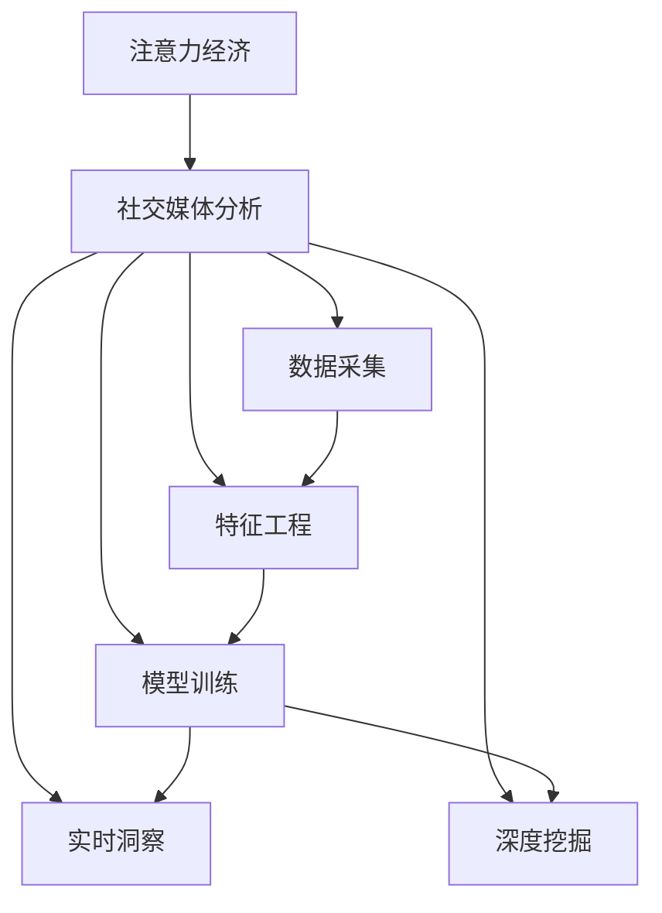
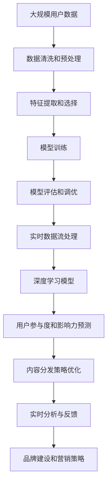

                 

# 注意力经济与社交媒体分析洞察力：了解受众参与度和影响力的秘诀

> 关键词：注意力经济,社交媒体,受众参与度,影响力,数据分析,机器学习,预测模型,实时洞察,深度挖掘

## 1. 背景介绍

### 1.1 问题由来

随着互联网的迅速发展和数字化的普及，注意力经济成为当今社会的一大焦点。尤其是在社交媒体平台上，如何在海量内容中吸引并保持用户的注意力，成为企业和品牌关注的重点。社交媒体平台通过数据和算法，分析用户的参与度和影响力，优化内容分发策略，提升用户体验和品牌影响力。本文将从注意力经济和社交媒体分析的角度出发，探讨如何通过数据和算法洞察受众参与度和影响力，进而实现精准的营销和品牌建设。

### 1.2 问题核心关键点

社交媒体分析的核心在于理解用户的行为模式和互动特征，进而预测其参与度和影响力。具体而言，包括以下几个关键点：

- **数据采集**：收集社交媒体上的用户行为数据，包括点赞、评论、转发、关注等。
- **特征工程**：将原始数据转化为可用于模型的特征，如用户活跃度、内容质量、互动频率等。
- **模型训练**：构建预测模型，通过历史数据训练模型，预测用户未来的参与度和影响力。
- **实时洞察**：基于实时数据，动态调整内容分发策略，提升用户体验和品牌影响力。
- **深度挖掘**：通过深度学习和聚类算法，发现用户群体的潜在需求和行为特征。

本文将详细介绍注意力经济和社交媒体分析的核心概念和算法原理，并给出实际的应用案例和代码实现。

## 2. 核心概念与联系

### 2.1 核心概念概述

为更好地理解注意力经济和社交媒体分析，本节将介绍几个关键概念：

- **注意力经济**：在信息爆炸的时代，注意力成为稀缺资源。通过数据分析和算法优化，精准触达用户，提升品牌影响力，实现经济价值。
- **社交媒体分析**：利用数据挖掘和机器学习技术，分析社交媒体上的用户行为和互动特征，预测用户参与度和影响力，优化内容分发策略。
- **用户参与度**：指用户与内容互动的频率和深度，如点赞、评论、分享等。
- **用户影响力**：指用户在社交网络上的传播能力和影响力，如转发数、关注者数量等。
- **内容分发策略**：根据用户行为和数据分析结果，调整内容推荐算法和策略，提升用户参与度和满意度。

### 2.2 概念间的关系

这些概念之间的联系可以通过以下Mermaid流程图来展示：



这个流程图展示了从注意力经济到社交媒体分析，再到数据采集、特征工程、模型训练、实时洞察和深度挖掘的完整过程。通过这些步骤，社交媒体平台可以精准地了解用户参与度和影响力，实现高效的营销和品牌建设。

### 2.3 核心概念的整体架构

最后，我们用一个综合的流程图来展示这些核心概念在大规模社交媒体分析中的整体架构：



这个综合流程图展示了从大规模数据收集到用户参与度和影响力预测，再到内容分发策略优化和品牌建设的完整流程。通过这些步骤，社交媒体平台可以有效地提升用户参与度和品牌影响力。

## 3. 核心算法原理 & 具体操作步骤
### 3.1 算法原理概述

社交媒体分析的核心算法基于数据挖掘和机器学习，通过预测模型和大数据技术，分析用户行为，预测用户参与度和影响力。具体而言，包括以下几个关键算法：

- **回归分析**：通过历史数据训练回归模型，预测用户未来的参与度和影响力。
- **分类算法**：构建分类模型，预测用户是否会参与或转发特定内容。
- **聚类算法**：通过聚类分析，发现用户群体的潜在需求和行为特征，实现更精准的内容推荐。
- **时间序列分析**：通过时间序列预测，动态调整内容分发策略，提升用户参与度和满意度。
- **图神经网络**：通过图神经网络模型，分析用户之间的互动关系，预测用户影响力。

### 3.2 算法步骤详解

以下详细讲解每个关键算法的具体步骤：

#### 3.2.1 回归分析

**步骤1: 数据预处理**
- 收集社交媒体上的用户行为数据，包括点赞、评论、分享等。
- 清洗和预处理数据，去除噪声和异常值，生成干净的特征集。

**步骤2: 特征工程**
- 将原始数据转化为可用于模型的特征，如用户活跃度、内容质量、互动频率等。
- 进行特征选择和降维，去除冗余特征，提升模型性能。

**步骤3: 模型训练**
- 选择适合的回归模型，如线性回归、岭回归、决策树回归等。
- 使用历史数据训练模型，优化模型参数，最小化预测误差。
- 进行交叉验证，评估模型泛化性能。

**步骤4: 模型应用**
- 使用训练好的模型，对新数据进行预测，评估用户参与度和影响力。
- 根据预测结果，调整内容分发策略，提升用户参与度。

#### 3.2.2 分类算法

**步骤1: 数据预处理**
- 收集社交媒体上的用户行为数据，包括点赞、评论、分享等。
- 清洗和预处理数据，去除噪声和异常值，生成干净的特征集。

**步骤2: 特征工程**
- 将原始数据转化为可用于模型的特征，如用户活跃度、内容质量、互动频率等。
- 进行特征选择和降维，去除冗余特征，提升模型性能。

**步骤3: 模型训练**
- 选择适合的分类模型，如逻辑回归、支持向量机、随机森林等。
- 使用历史数据训练模型，优化模型参数，最小化分类误差。
- 进行交叉验证，评估模型泛化性能。

**步骤4: 模型应用**
- 使用训练好的模型，对新数据进行分类预测，判断用户是否会参与或转发特定内容。
- 根据预测结果，调整内容分发策略，提升用户参与度。

#### 3.2.3 聚类算法

**步骤1: 数据预处理**
- 收集社交媒体上的用户行为数据，包括点赞、评论、分享等。
- 清洗和预处理数据，去除噪声和异常值，生成干净的特征集。

**步骤2: 特征工程**
- 将原始数据转化为可用于模型的特征，如用户活跃度、内容质量、互动频率等。
- 进行特征选择和降维，去除冗余特征，提升模型性能。

**步骤3: 模型训练**
- 选择适合的聚类算法，如K-means、层次聚类等。
- 使用历史数据训练模型，优化聚类中心，最小化聚类误差。
- 进行交叉验证，评估模型泛化性能。

**步骤4: 模型应用**
- 使用训练好的模型，对新数据进行聚类分析，发现用户群体的潜在需求和行为特征。
- 根据聚类结果，实现更精准的内容推荐，提升用户参与度。

#### 3.2.4 时间序列分析

**步骤1: 数据预处理**
- 收集社交媒体上的用户行为数据，包括点赞、评论、分享等。
- 清洗和预处理数据，生成时间序列数据。

**步骤2: 模型训练**
- 选择适合的时间序列模型，如ARIMA、LSTM等。
- 使用历史数据训练模型，优化模型参数，最小化预测误差。
- 进行交叉验证，评估模型泛化性能。

**步骤3: 模型应用**
- 使用训练好的模型，对新数据进行时间序列预测，动态调整内容分发策略。
- 根据预测结果，提升用户参与度和满意度。

#### 3.2.5 图神经网络

**步骤1: 数据预处理**
- 收集社交媒体上的用户行为数据，包括点赞、评论、分享等。
- 将用户和内容转化为图结构，构建社交网络图。

**步骤2: 图特征提取**
- 使用图神经网络，提取用户和内容的特征表示。
- 进行图卷积操作，生成全局图表示。

**步骤3: 模型训练**
- 选择适合的图神经网络模型，如GCN、GAT等。
- 使用历史数据训练模型，优化模型参数，最小化预测误差。
- 进行交叉验证，评估模型泛化性能。

**步骤4: 模型应用**
- 使用训练好的模型，对新数据进行图神经网络预测，分析用户之间的互动关系。
- 根据预测结果，预测用户影响力，调整内容分发策略。

### 3.3 算法优缺点

#### 3.3.1 回归分析

**优点**：
- 数据易于采集和处理，适合处理大规模数据集。
- 模型简单，易于实现和解释。
- 能够直接预测用户参与度和影响力，效果显著。

**缺点**：
- 假设数据符合线性关系，无法处理非线性关系。
- 对异常值和噪声敏感，需要预处理。
- 模型预测结果可能存在误差，需要多次迭代优化。

#### 3.3.2 分类算法

**优点**：
- 能够对用户行为进行分类，预测用户是否会参与或转发特定内容。
- 模型准确率较高，适合处理二分类问题。
- 能够直接预测用户行为，调整内容分发策略。

**缺点**：
- 对数据分布和特征选择敏感，需要精心设计特征。
- 模型复杂度较高，计算成本较大。
- 模型预测结果可能存在误差，需要多次迭代优化。

#### 3.3.3 聚类算法

**优点**：
- 能够发现用户群体的潜在需求和行为特征，实现更精准的内容推荐。
- 模型灵活性高，适用于多种数据类型。
- 能够发现用户行为中的隐含模式，提升用户参与度。

**缺点**：
- 聚类结果受初始参数影响较大，需要多次迭代优化。
- 对噪声和异常值敏感，需要预处理。
- 模型复杂度较高，计算成本较大。

#### 3.3.4 时间序列分析

**优点**：
- 能够动态调整内容分发策略，提升用户参与度和满意度。
- 模型适合处理时间序列数据，能够捕捉时间变化趋势。
- 模型预测结果较准确，能够实时调整策略。

**缺点**：
- 对数据缺失和季节性变化敏感，需要预处理。
- 模型复杂度较高，计算成本较大。
- 模型预测结果可能存在误差，需要多次迭代优化。

#### 3.3.5 图神经网络

**优点**：
- 能够分析用户之间的互动关系，预测用户影响力。
- 模型能够捕捉全局图表示，发现用户行为中的隐含模式。
- 模型灵活性高，适用于多种数据类型。

**缺点**：
- 模型复杂度较高，计算成本较大。
- 对图结构设计敏感，需要精心设计图结构。
- 模型预测结果可能存在误差，需要多次迭代优化。

### 3.4 算法应用领域

基于社交媒体分析的注意力经济方法，已经在以下几个领域得到了广泛应用：

1. **广告投放**：通过分析用户参与度和影响力，优化广告投放策略，提升广告效果和ROI。
2. **内容推荐**：根据用户行为和分析结果，实现更精准的内容推荐，提升用户参与度和满意度。
3. **品牌建设**：通过分析用户互动数据，发现品牌热点和用户需求，调整品牌策略，提升品牌影响力。
4. **用户分析**：通过用户行为分析，发现潜在用户群体和行为特征，实现更精准的市场定位。
5. **舆情监测**：通过分析用户评论和互动数据，预测舆情趋势，及时应对负面舆情。

## 4. 数学模型和公式 & 详细讲解  
### 4.1 数学模型构建

社交媒体分析的数学模型主要基于统计学、机器学习和深度学习技术，通过预测模型和大数据技术，分析用户行为，预测用户参与度和影响力。以下将详细介绍几个关键数学模型的构建。

#### 4.1.1 线性回归模型

线性回归模型表示为：

$$
y = \beta_0 + \beta_1 x_1 + \beta_2 x_2 + ... + \beta_n x_n + \epsilon
$$

其中，$y$ 为因变量，$x_1, x_2, ..., x_n$ 为自变量，$\beta_0, \beta_1, ..., \beta_n$ 为模型参数，$\epsilon$ 为随机误差项。

线性回归模型的目标是最小化预测误差：

$$
\min_{\beta_0, \beta_1, ..., \beta_n} \sum_{i=1}^N (y_i - \hat{y}_i)^2
$$

其中，$y_i$ 为实际观测值，$\hat{y}_i = \beta_0 + \beta_1 x_{1,i} + \beta_2 x_{2,i} + ... + \beta_n x_{n,i}$ 为预测值。

#### 4.1.2 逻辑回归模型

逻辑回归模型表示为：

$$
P(y=1|x) = \frac{1}{1 + e^{-z}} \quad \text{and} \quad P(y=0|x) = \frac{e^{-z}}{1 + e^{-z}}
$$

其中，$y$ 为二分类结果，$x$ 为输入特征，$z = \beta_0 + \beta_1 x_1 + \beta_2 x_2 + ... + \beta_n x_n$ 为线性判别函数，$\beta_0, \beta_1, ..., \beta_n$ 为模型参数。

逻辑回归模型的目标是最小化交叉熵损失：

$$
\min_{\beta_0, \beta_1, ..., \beta_n} -\frac{1}{N} \sum_{i=1}^N [y_i \log(P(y=1|x_i)) + (1-y_i) \log(P(y=0|x_i))]
$$

其中，$y_i$ 为实际观测值，$P(y=1|x_i)$ 和 $P(y=0|x_i)$ 分别为输入特征为 $x_i$ 时的二分类概率。

#### 4.1.3 时间序列模型

时间序列模型通常采用ARIMA模型，表示为：

$$
Y_t = \phi_0 + \phi_1 Y_{t-1} + \phi_2 Y_{t-2} + ... + \phi_p Y_{t-p} + \theta_1 \epsilon_t + \theta_2 \epsilon_{t-1} + ... + \theta_q \epsilon_{t-q} + \epsilon_t
$$

其中，$Y_t$ 为时间序列数据，$\epsilon_t$ 为随机误差项，$\phi_0, \phi_1, ..., \phi_p$ 为AR参数，$\theta_1, ..., \theta_q$ 为MA参数，$Y_{t-k}$ 为滞后项，$k=1,...,p$。

ARIMA模型的目标是最小化均方误差：

$$
\min_{\phi_0, \phi_1, ..., \phi_p, \theta_1, ..., \theta_q} \sum_{t=1}^N (Y_t - \hat{Y}_t)^2
$$

其中，$\hat{Y}_t$ 为模型预测值。

#### 4.1.4 图神经网络模型

图神经网络模型通常采用GCN模型，表示为：

$$
H^{(l+1)} = \sigma(\tilde{D}^{-1/2} \tilde{A} \tilde{D}^{-1/2} H^{(l)} W^{(l)})
$$

其中，$H^{(l+1)}$ 为第 $(l+1)$ 层的节点表示，$H^{(l)}$ 为第 $l$ 层的节点表示，$\tilde{A}$ 为归一化的邻接矩阵，$\tilde{D}$ 为邻接矩阵的度数矩阵，$\sigma$ 为激活函数，$W^{(l)}$ 为第 $l$ 层的权重矩阵。

GCN模型的目标是最小化预测误差：

$$
\min_{\sigma, W} \sum_{i=1}^N \sum_{j=1}^N (y_i - \hat{y}_i)^2
$$

其中，$y_i$ 为实际观测值，$\hat{y}_i$ 为模型预测值。

### 4.2 公式推导过程

#### 4.2.1 线性回归模型

线性回归模型的推导过程如下：

1. 假设因变量 $y$ 与自变量 $x_i$ 之间存在线性关系。
2. 根据最小二乘法，求解线性回归方程 $\hat{y} = \beta_0 + \beta_1 x_1 + \beta_2 x_2 + ... + \beta_n x_n$。
3. 最小化预测误差 $\sum_{i=1}^N (y_i - \hat{y}_i)^2$，求解模型参数 $\beta_0, \beta_1, ..., \beta_n$。

#### 4.2.2 逻辑回归模型

逻辑回归模型的推导过程如下：

1. 假设因变量 $y$ 与自变量 $x_i$ 之间存在逻辑关系。
2. 根据最大似然估计法，求解逻辑回归方程 $P(y=1|x) = \frac{1}{1 + e^{-z}}$ 和 $P(y=0|x) = \frac{e^{-z}}{1 + e^{-z}}$。
3. 最小化交叉熵损失 $-\frac{1}{N} \sum_{i=1}^N [y_i \log(P(y=1|x_i)) + (1-y_i) \log(P(y=0|x_i))]$，求解模型参数 $\beta_0, \beta_1, ..., \beta_n$。

#### 4.2.3 时间序列模型

时间序列模型的推导过程如下：

1. 假设时间序列 $Y_t$ 与滞后项 $Y_{t-k}$ 之间存在ARIMA关系。
2. 根据ARIMA模型，求解时间序列方程 $Y_t = \phi_0 + \phi_1 Y_{t-1} + \phi_2 Y_{t-2} + ... + \phi_p Y_{t-p} + \theta_1 \epsilon_t + \theta_2 \epsilon_{t-1} + ... + \theta_q \epsilon_{t-q} + \epsilon_t$。
3. 最小化均方误差 $\sum_{t=1}^N (Y_t - \hat{Y}_t)^2$，求解模型参数 $\phi_0, \phi_1, ..., \phi_p, \theta_1, ..., \theta_q$。

#### 4.2.4 图神经网络模型

图神经网络模型的推导过程如下：

1. 假设图神经网络模型能够捕捉全局图表示。
2. 根据GCN模型，求解节点表示 $H^{(l+1)} = \sigma(\tilde{D}^{-1/2} \tilde{A} \tilde{D}^{-1/2} H^{(l)} W^{(l)})$。
3. 最小化预测误差 $\sum_{i=1}^N (y_i - \hat{y}_i)^2$，求解模型参数 $\sigma$ 和 $W^{(l)}$。

### 4.3 案例分析与讲解

#### 4.3.1 线性回归模型应用

假设某电商平台收集了用户对商品的评价和评分数据，希望预测用户未来的购买行为。

**数据预处理**：
- 收集用户评价和评分数据，去除噪声和异常值。
- 将用户评分转化为二分类数据，1表示购买，0表示未购买。

**特征工程**：
- 将用户评分转化为特征，如用户评分、用户活跃度、商品质量等。
- 进行特征选择和降维，去除冗余特征。

**模型训练**：
- 使用历史数据训练线性回归模型，优化模型参数。
- 进行交叉验证，评估模型泛化性能。

**模型应用**：
- 使用训练好的模型，对新用户评分进行预测，判断其是否会购买。
- 根据预测结果，调整商品推荐策略，提升用户购买率。

#### 4.3.2 逻辑回归模型应用

假设某社交媒体平台收集了用户对文章的评论数据，希望预测用户是否会分享文章。

**数据预处理**：
- 收集用户评论数据，去除噪声和异常值。
- 将用户评论转化为二分类数据，1表示会分享，0表示不会分享。

**特征工程**：
- 将用户评论转化为特征，如评论情感、用户活跃度、文章质量等。
- 进行特征选择和降维，去除冗余特征。

**模型训练**：
- 使用历史数据训练逻辑回归模型，优化模型参数。
- 进行交叉验证，评估模型泛化性能。

**模型应用**：
- 使用训练好的模型，对新用户评论进行预测，判断其是否会分享。
- 根据预测结果，调整内容分发策略，提升文章分享率。

#### 4.3.3 时间序列模型应用

假设某电商平台收集了用户对商品的时间序列数据，希望预测用户未来的购买行为。

**数据预处理**：
- 收集用户购买数据，生成时间序列数据。
- 去除缺失数据和异常值。

**模型训练**：
- 使用历史数据训练ARIMA模型，优化模型参数。
- 进行交叉验证，评估模型泛化性能。

**模型应用**：
- 使用训练好的模型，对新用户购买数据进行时间序列预测，调整商品推荐策略。
- 根据预测结果，提升用户购买率和满意度。

#### 4.3.4 图神经网络模型应用

假设某社交媒体平台收集了用户之间的互动数据，希望预测用户之间的影响力关系。

**数据预处理**：
- 收集用户互动数据，构建社交网络图。
- 将用户和内容转化为图结构，构建社交网络图。

**模型训练**：
- 使用历史数据训练GCN模型，优化模型参数。
- 进行交叉验证，评估模型泛化性能。

**模型应用**：
- 使用训练好的模型，对新用户互动数据进行图神经网络预测，分析用户之间的影响力关系。
- 根据预测结果，调整内容分发策略，提升用户参与度。

## 5. 项目实践：代码实例和详细解释说明
### 5.1 开发环境搭建

在进行社交媒体分析的项目实践前，我们需要准备好开发环境。以下是使用Python进行PyTorch开发的环境配置流程：

1. 安装Anaconda：从官网下载并安装Anaconda，用于创建独立的Python环境。

2. 创建并激活虚拟环境：
```bash
conda create -n pytorch-env python=3.8 
conda activate pytorch-env
```

3. 安装PyTorch：根据CUDA版本，从官网获取对应的安装命令。例如：
```bash
conda install pytorch torchvision torchaudio cudatoolkit=11.1 -c pytorch -c conda-forge
```

4. 安装各类工具包：
```bash
pip install numpy pandas scikit-learn matplotlib tqdm jupyter notebook ipython
```

完成上述步骤后，即可在`pytorch-env`环境中开始社交媒体分析实践。

### 5.2 源代码详细实现

下面我们以社交媒体分析中的时间序列模型应用为例，给出使用PyTorch进行时间序列模型训练的PyTorch代码实现。

首先，定义时间序列数据处理函数：

```python
import pandas as pd
from sklearn.metrics import mean_squared_error
from statsmodels.tsa.arima_model import ARIMA

def prepare_data(data, lookback=30):
    dataset = pd.DataFrame(data, columns=['value'])
    dataset['value_lag'] = dataset.groupby('date')['value'].shift(lookback)
    return dataset

def train_test_split(dataset, train_size=0.7):
    train = dataset[:int(len(dataset) * train_size)]
    test = dataset[int(len(dataset) * train_size):]
    return train, test

def evaluate_model(model, train, test):
    train = prepare_data(train['value'])
    test = prepare_data(test['value'])
    X_train, y_train = train.iloc[:, :-1], train.iloc[:, -1]
    X_test, y_test = test.iloc[:, :-1], test.iloc[:, -1]
    train_model = model.fit(X_train.values, y_train.values)
    train_predictions = train_model.predict(X_train.values)
    test_predictions = train_model.predict(X_test.values)
    train_mse = mean_squared_error(y_train, train_predictions)
    test_m

