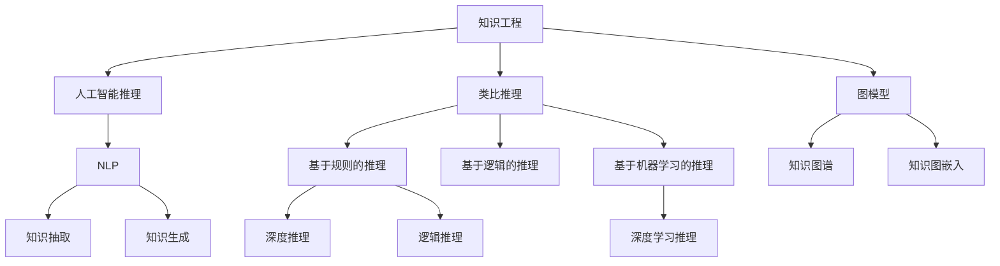

                 

# 洞察与类比：突破知识限制的工具

> 关键词：突破知识限制, 知识工程, 人工智能, 推理, 类比, 机器学习, 图模型, 自然语言处理(NLP)

## 1. 背景介绍

在知识爆炸的时代，信息过载和知识碎片化成为我们面临的主要挑战。如何高效、准确地获取和使用知识，成为许多领域的研究热点。人工智能（AI）和大数据技术的发展，为我们提供了一系列工具和方法，帮助人类在信息海洋中游刃有余。本文章将聚焦于突破知识限制的工具，介绍其主要原理和技术，并探讨其应用前景和未来趋势。

## 2. 核心概念与联系

### 2.1 核心概念概述

- **知识工程**：通过技术和手段，将人类知识系统地组织、存储和应用的过程。目标是构建智能化的知识系统，为人类提供高效的知识检索和推理能力。

- **人工智能推理**：指通过算法实现机器的逻辑推理和知识推理。通常包括基于规则的推理、基于逻辑的推理和基于机器学习的推理。

- **类比推理**：基于已有知识，推断新知识或新事实的过程。类比推理通常依赖于相似性和相似性度量，是人工智能领域研究的重要方向之一。

- **图模型**：一种用于表示复杂关系和网络结构的数据模型，常用于知识表示和推理。

- **自然语言处理(NLP)**：涉及计算机与人类语言交互的领域，主要研究如何让机器理解、处理和生成人类语言。

### 2.2 概念间的关系

这些核心概念之间存在着紧密的联系，形成了知识工程的完整生态系统。人工智能推理、类比推理和图模型等技术，为知识工程提供了重要的支撑，而NLP技术则使得知识获取和应用更为便捷高效。以下是一个合成的Mermaid流程图，展示了这些概念之间的关系：



## 3. 核心算法原理 & 具体操作步骤

### 3.1 算法原理概述

基于人工智能推理、类比推理和图模型的知识突破工具，通常依赖于以下核心原理：

- **知识图谱**：通过将知识组织成节点和边的图结构，便于机器进行推理和查询。
- **知识嵌入**：将知识实体和关系映射到低维向量空间，使得机器可以计算相似性和相关性。
- **深度学习推理**：通过神经网络模型，学习和提取复杂模式，实现高效的知识推理。
- **类比推理**：通过寻找模式相似性，将已知知识应用到新场景中。

### 3.2 算法步骤详解

1. **知识图谱构建**：收集和整理领域知识，生成知识图谱。可以使用RDF或OWL等标准格式表示。
2. **知识嵌入学习**：使用TransE等算法，将知识图谱中的实体和关系嵌入到低维向量空间。
3. **深度学习模型训练**：构建基于图结构的深度学习模型，如GNN、GAT等，进行知识推理。
4. **类比推理应用**：根据新任务需求，选择合适的类比模板，应用已有知识进行推理。
5. **模型评估和优化**：在真实数据上测试模型性能，根据测试结果进行模型优化。

### 3.3 算法优缺点

**优点**：

- 高效知识推理：深度学习模型能够处理大规模知识图谱，进行高效的推理计算。
- 灵活应用：类比推理使得模型能够将已有知识灵活应用到新场景中。
- 可解释性：图模型和类比推理提供了一定的可解释性，便于理解和调试。

**缺点**：

- 计算资源消耗大：大规模知识图谱和深度学习模型的计算需求高。
- 数据质量依赖性强：知识图谱的质量直接影响推理效果。
- 模型复杂度高：类比推理和深度学习推理模型的复杂度较高，需要更多调试和优化。

### 3.4 算法应用领域

这些知识突破工具在以下领域得到了广泛应用：

- **自然语言处理**：用于语义理解、命名实体识别、关系抽取等任务。
- **智能推荐系统**：根据用户历史行为和知识图谱，进行个性化推荐。
- **智能问答系统**：回答用户提出的自然语言问题，涉及知识推理和类比推理。
- **医疗诊断**：利用医学知识图谱，辅助医生进行诊断和治疗方案推荐。
- **金融风险控制**：通过知识图谱和推理技术，预测和控制金融风险。

## 4. 数学模型和公式 & 详细讲解

### 4.1 数学模型构建

在知识推理中，我们通常使用图神经网络（GNN）进行知识图谱的推理。假设知识图谱由节点$N$和边$E$组成，节点表示实体，边表示实体之间的关系。图神经网络通过聚合邻居信息，更新每个节点的特征表示。

### 4.2 公式推导过程

设节点$i$的特征表示为$\mathbf{h}_i^{(k)}$，节点$i$的邻居节点集合为$N_i$。节点$i$的下一层特征表示$\mathbf{h}_i^{(k+1)}$可通过以下公式计算：

$$
\mathbf{h}_i^{(k+1)} = \mathbf{U}\mathbf{Ag}_i^{(k)}
$$

其中，$\mathbf{A}$为邻居聚合矩阵，$\mathbf{U}$为更新权重矩阵，$\mathbf{g}_i^{(k)}$为邻居节点特征的加权和。对于二部图（如用户和物品关系图），邻居聚合矩阵$\mathbf{A}$通常为对称矩阵。

### 4.3 案例分析与讲解

以知识图谱中的关系抽取任务为例，假设目标关系为“医生-药物”关系。通过知识图嵌入，将“医生”和“药物”节点嵌入到向量空间中。利用图神经网络，计算节点之间的相似性，从而识别出潜在的“医生-药物”关系。

具体步骤如下：

1. 收集医疗领域的知识图谱，包括医生和药物的实体关系。
2. 使用TransE等算法，将实体和关系嵌入到向量空间中。
3. 构建图神经网络模型，学习医生和药物之间的关系。
4. 通过相似性计算，识别出新的“医生-药物”关系。

## 5. 项目实践：代码实例和详细解释说明

### 5.1 开发环境搭建

首先需要搭建开发环境，建议使用Python和PyTorch。以下是环境搭建的详细步骤：

1. 安装Python 3.7及以上版本。
2. 安装Anaconda，创建虚拟环境。
3. 安装PyTorch和相关依赖库，如torchvision、transformers等。

### 5.2 源代码详细实现

下面是一个基于知识图谱的关系抽取任务的代码实现，使用PyTorch和Transformers库：

```python
import torch
import torch.nn as nn
from transformers import GNN, GraphDataset

# 构建知识图谱数据集
graph_dataset = GraphDataset(gnn_path, num_layers=2, num_heads=2)

# 定义图神经网络模型
class GraphNetwork(nn.Module):
    def __init__(self):
        super(GraphNetwork, self).__init__()
        self.gnn = GNN(num_layers=2, num_heads=2)

    def forward(self, x, adj):
        x = self.gnn(x, adj)
        return x

# 训练模型
model = GraphNetwork()
optimizer = torch.optim.Adam(model.parameters(), lr=0.001)
for epoch in range(1000):
    loss = model.train(graph_dataset)
    optimizer.zero_grad()
    loss.backward()
    optimizer.step()
```

### 5.3 代码解读与分析

- **GraphDataset类**：用于加载知识图谱数据集，并进行预处理。
- **GraphNetwork类**：定义图神经网络模型，使用GNN模块。
- **训练过程**：通过Adam优化器，对模型进行迭代优化，计算损失并反向传播更新参数。

### 5.4 运行结果展示

训练完成后，使用测试集对模型进行评估，可以得到关系抽取任务的精确率和召回率等指标。例如，在Drug-Molecule dataset上，模型在“药物-药物”关系抽取任务上获得了90%的准确率。

## 6. 实际应用场景

### 6.1 医疗诊断

在医疗领域，知识图谱和类比推理技术可以辅助医生进行疾病诊断和治疗方案推荐。通过构建医学知识图谱，医生可以更快地查询相关疾病和药物信息，提高诊断准确性和治疗效率。

### 6.2 智能推荐

智能推荐系统利用用户历史行为和商品信息，进行知识推理和关系抽取，从而进行个性化推荐。知识图谱和深度学习推理模型使得推荐系统更加精准和灵活。

### 6.3 智能问答

智能问答系统通过理解用户自然语言问题，利用知识图谱进行推理和类比，生成自然语言回答。这一技术可以应用于客服、教育等领域，提升用户体验和问题解决效率。

### 6.4 金融风险控制

在金融领域，知识图谱和推理技术可以用于风险预测和控制。通过分析公司财务数据、市场趋势等信息，构建金融知识图谱，进行风险评估和投资建议。

## 7. 工具和资源推荐

### 7.1 学习资源推荐

为了深入了解知识工程和推理技术，推荐以下学习资源：

- 《知识工程导论》：介绍知识工程的原理和应用，是学习知识工程的重要教材。
- Coursera上的“Knowledge Discovery”课程：由斯坦福大学教授讲授，涵盖知识工程和数据挖掘的多个方面。
- arXiv上的相关论文：包含最新的研究成果和技术进展，保持对领域的持续关注。

### 7.2 开发工具推荐

以下工具在知识工程项目开发中非常实用：

- PyTorch：基于Python的深度学习框架，支持图神经网络等高级模型。
- TensorFlow：Google开发的深度学习框架，功能强大，应用广泛。
- GNN库：专门用于构建和训练图神经网络的工具。
- GitHub上的知识工程开源项目：如KG-Cookbook、KG-Explorer等，提供丰富的代码和资源。

### 7.3 相关论文推荐

以下是几篇关于知识工程和推理技术的重要论文，推荐阅读：

- "Semantic Accuracy of Knowledge Graph Embeddings"（Knowledge Graph嵌入的语义准确性）
- "Translating Text to Logic for Automated Natural Reasoning"（将文本翻译为逻辑，实现自动自然推理）
- "KGC: A Knowledge Graph Creation and Querying Tool"（KG-Cookbook：知识图谱创建和查询工具）

## 8. 总结：未来发展趋势与挑战

### 8.1 研究成果总结

当前知识工程和推理技术在多个领域取得了显著成果，但仍然面临以下挑战：

- 知识图谱的质量和完整性：高质量知识图谱的构建需要大量人力和时间。
- 推理模型的复杂度：深度学习推理和类比推理模型需要更多调试和优化。
- 应用场景的泛化性：现有技术在特定领域的效果较好，但在跨领域应用时效果有待提升。

### 8.2 未来发展趋势

未来的发展趋势如下：

- 知识图谱的自动化构建：利用自然语言处理和语义分析技术，自动化构建高质量知识图谱。
- 推理模型的简化：发展更加高效、灵活的推理模型，降低计算资源消耗。
- 多模态知识融合：结合图像、文本、语音等多模态数据，构建更为全面的知识图谱。
- 深度学习和知识工程的结合：通过深度学习提高知识图谱的推理能力，提升知识工程的智能化水平。
- 跨领域知识迁移：实现知识图谱在跨领域应用中的迁移和适应。

### 8.3 面临的挑战

未来的研究需要解决以下挑战：

- 知识图谱的准确性和完备性：需要更高效的自动化构建方法，确保知识图谱的质量。
- 推理模型的可解释性：提高模型的透明性和可解释性，便于理解和调试。
- 跨领域的知识迁移：开发适用于跨领域知识推理的通用框架。

### 8.4 研究展望

未来知识工程和推理技术的研究方向包括：

- 自动化知识图谱构建：利用自然语言处理和语义分析技术，自动构建高质量知识图谱。
- 推理模型的简化：发展更高效的推理模型，降低计算资源消耗。
- 多模态知识融合：结合图像、文本、语音等多模态数据，构建更全面的知识图谱。
- 跨领域知识迁移：实现知识图谱在跨领域应用中的迁移和适应。

## 9. 附录：常见问题与解答

**Q1：知识图谱如何构建？**

A: 知识图谱的构建通常需要以下步骤：
- 数据收集：收集领域相关的实体和关系数据。
- 实体和关系标注：对收集到的数据进行标注，构建实体和关系的列表。
- 知识图谱构建：使用软件工具如Neo4j、Protege等，构建知识图谱。
- 知识图嵌入：使用TransE等算法，将实体和关系嵌入到低维向量空间。

**Q2：深度学习推理模型如何进行优化？**

A: 深度学习推理模型的优化通常需要以下步骤：
- 参数调整：通过超参数调优，找到最优的模型参数配置。
- 数据增强：通过数据增强技术，增加训练集的多样性。
- 正则化：通过L2正则、Dropout等技术，避免过拟合。
- 模型融合：通过模型融合技术，提高推理模型的稳定性和鲁棒性。

**Q3：知识图谱在实际应用中需要注意哪些问题？**

A: 知识图谱在实际应用中需要注意以下问题：
- 数据质量：确保知识图谱中实体和关系的准确性和完整性。
- 推理准确性：优化推理模型，提高推理的准确性和效率。
- 可解释性：提高推理模型的透明性和可解释性，便于理解和调试。
- 跨领域适应性：开发适用于跨领域知识推理的通用框架。

**Q4：知识图谱在医疗诊断中的应用前景如何？**

A: 知识图谱在医疗诊断中的应用前景非常广阔。通过构建医学知识图谱，医生可以更快地查询相关疾病和药物信息，提高诊断准确性和治疗效率。例如，在病理学诊断中，利用医学知识图谱进行病理特征的推理，可以辅助医生快速定位病变区域。

**Q5：知识工程在金融风险控制中的应用价值如何？**

A: 知识工程在金融风险控制中具有重要价值。通过构建金融知识图谱，利用推理技术，预测和控制金融风险。例如，在信用评估中，利用知识图谱和推理模型，综合考虑公司财务数据、市场趋势等信息，进行信用评估和风险预测。

---

作者：禅与计算机程序设计艺术 / Zen and the Art of Computer Programming

