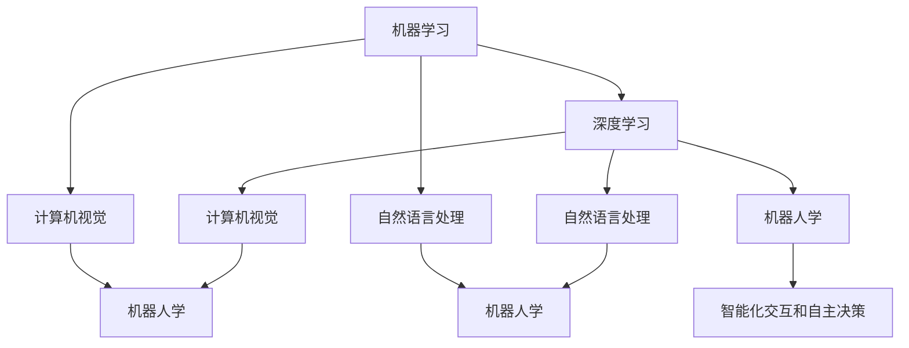

                 

# 清华大学的人工智能研究历程

## 1. 背景介绍

### 1.1 研究背景

清华大学作为中国乃至全球顶尖的科技和教育机构，长期以来在人工智能（AI）领域持续进行深入研究和创新。其研究历程可以追溯至20世纪50年代，并经历了几次重要的技术突破和范式转变。本文将系统回顾清华大学在人工智能领域的研究历程，展示其在基础研究、核心技术、应用实践等方面的丰硕成果，并为未来研究提供参考。

### 1.2 重要里程碑

1. **1949年-1978年：起步阶段**
   - 1950年代，清华大学计算机科学系（后发展为计算机科学与技术系）成立，开始计算机教育。
   - 1970年代，计算机科学系开始对人工智能领域进行初步探索。

2. **1979年-1998年：发展阶段**
   - 1980年代，清华大学计算机科学系的研究团队开始关注知识表示、专家系统和人工智能基础理论。
   - 1990年代，清华大学成立了人工智能研究所，并成为国家首批人工智能重点实验室。

3. **1999年-2018年：突破阶段**
   - 2000年代初，清华大学在自然语言处理（NLP）、计算机视觉（CV）等领域取得显著进展。
   - 2012年，清华大学首次提出并实现基于深度学习（DL）的图像识别技术。

4. **2019年至今：创新阶段**
   - 2018年后，清华大学在AI领域形成跨学科的深度学习、认知计算、人机交互等多个研究中心。
   - 2020年，清华大学提出并发展自主可解释的AI系统（XAI）。

## 2. 核心概念与联系

### 2.1 核心概念概述

在人工智能的研究历程中，核心概念主要涉及机器学习、深度学习、计算机视觉、自然语言处理、机器人学等多个领域。清华大学在这些领域的研究中不断创新，推动了多个重要概念和技术的发展。

- **机器学习**：通过训练模型从数据中自动学习规律，包括监督学习、无监督学习和强化学习等。
- **深度学习**：一种特殊的机器学习方法，通过多层神经网络模拟人脑神经元处理信息的过程。
- **计算机视觉**：研究如何让计算机理解和解释图像、视频等信息，并进行识别、分类、生成等任务。
- **自然语言处理**：处理和理解人类语言，实现机器翻译、文本生成、情感分析等任务。
- **机器人学**：研究如何让机器人具备自主性和智能性，实现自主导航、对象识别、语音交互等功能。

### 2.2 核心概念之间的关系

核心概念之间存在紧密的联系，共同构成了人工智能技术的发展框架。具体表现为：

- 机器学习是AI的基础，为深度学习提供了理论支持。
- 深度学习在机器学习的基础上进一步发展，通过多层神经网络增强了模型的表达能力和泛化能力。
- 计算机视觉和自然语言处理是深度学习的主要应用领域，通过算法创新提升技术水平。
- 机器人学将深度学习、计算机视觉和自然语言处理技术综合应用，实现智能化交互和自主决策。

这些概念相互依赖、相互促进，形成了人工智能技术的完整生态。下面使用Mermaid流程图来展示这些概念之间的关系：



## 3. 核心算法原理 & 具体操作步骤

### 3.1 算法原理概述

人工智能的研究涉及多个核心算法，包括监督学习、无监督学习、强化学习等。这些算法通过模型训练和参数优化，使机器能够从数据中学习规律，并用于解决实际问题。

- **监督学习**：通过有标签数据训练模型，使模型能够预测新数据的标签。
- **无监督学习**：在没有标签的情况下，通过数据自组织形成模型，发现数据中的内在结构。
- **强化学习**：通过试错的方式，使模型能够在环境中学习和优化策略。

### 3.2 算法步骤详解

这里以深度学习中的卷积神经网络（CNN）为例，介绍其核心步骤：

1. **数据预处理**：收集并清洗数据，进行归一化和增强处理。
2. **模型设计**：设计多层神经网络，包括卷积层、池化层和全连接层等。
3. **模型训练**：使用反向传播算法计算梯度，优化模型参数。
4. **模型评估**：在验证集上评估模型性能，调整超参数。
5. **模型部署**：将模型集成到应用系统中，进行实时推理。

### 3.3 算法优缺点

深度学习算法的主要优点包括：

- **强大的特征学习能力**：能够自动学习数据的高级特征，提升模型精度。
- **广泛的适用性**：适用于图像、文本、语音等多种数据类型。

其缺点包括：

- **高计算成本**：需要大量的数据和计算资源，训练过程较慢。
- **黑箱问题**：模型决策过程难以解释，缺乏透明度。
- **过拟合风险**：在数据量不足的情况下，容易发生过拟合。

### 3.4 算法应用领域

深度学习算法广泛应用于计算机视觉、自然语言处理、机器人学等多个领域。

- **计算机视觉**：图像分类、目标检测、图像生成等任务。
- **自然语言处理**：机器翻译、情感分析、文本生成等任务。
- **机器人学**：对象识别、语音交互、自主导航等任务。

## 4. 数学模型和公式 & 详细讲解 & 举例说明

### 4.1 数学模型构建

在深度学习中，常用的数学模型包括神经网络、卷积神经网络（CNN）和循环神经网络（RNN）等。

- **神经网络**：一种多层非线性模型，包括输入层、隐藏层和输出层。
- **卷积神经网络（CNN）**：通过卷积层和池化层提取图像特征，用于图像分类、目标检测等任务。
- **循环神经网络（RNN）**：通过循环结构处理序列数据，用于语音识别、机器翻译等任务。

### 4.2 公式推导过程

以卷积神经网络为例，推导其核心公式。

卷积神经网络的输出 $y$ 可以表示为：

$$ y = W^T a_{L-1} + b_L $$

其中 $a_{L-1}$ 为隐藏层的激活值，$W$ 和 $b_L$ 分别为权重矩阵和偏置向量。激活函数 $a_L$ 通常使用ReLU函数，即：

$$ a_L = \max(0, W_{L-1}a_{L-1} + b_{L-1}) $$

### 4.3 案例分析与讲解

以图像分类为例，展示CNN模型的工作流程：

1. **数据预处理**：将图像归一化为固定大小，并进行增强处理。
2. **卷积层**：通过滤波器提取图像特征。
3. **池化层**：对特征图进行下采样，减少计算量。
4. **全连接层**：将特征图映射到类别空间，进行分类预测。

## 5. 项目实践：代码实例和详细解释说明

### 5.1 开发环境搭建

在进行项目实践前，需要先搭建开发环境。

1. **安装Python**：使用Anaconda安装Python3.8。
2. **安装PyTorch**：使用pip安装PyTorch，并设置环境变量。
3. **安装其他库**：使用pip安装TensorFlow、Numpy、Pandas等常用库。

### 5.2 源代码详细实现

以下是一个简单的CNN模型实现，用于图像分类任务：

```python
import torch
import torch.nn as nn
import torch.optim as optim
from torchvision import datasets, transforms

# 定义卷积神经网络
class CNN(nn.Module):
    def __init__(self):
        super(CNN, self).__init__()
        self.conv1 = nn.Conv2d(3, 64, kernel_size=3, stride=1, padding=1)
        self.conv2 = nn.Conv2d(64, 128, kernel_size=3, stride=1, padding=1)
        self.pool = nn.MaxPool2d(kernel_size=2, stride=2)
        self.fc1 = nn.Linear(128*8*8, 1024)
        self.fc2 = nn.Linear(1024, 10)
    
    def forward(self, x):
        x = self.conv1(x)
        x = nn.ReLU()(x)
        x = self.pool(x)
        x = self.conv2(x)
        x = nn.ReLU()(x)
        x = self.pool(x)
        x = x.view(-1, 128*8*8)
        x = self.fc1(x)
        x = nn.ReLU()(x)
        x = self.fc2(x)
        return x

# 加载数据集
train_dataset = datasets.CIFAR10(root='./data', train=True, download=True, transform=transforms.ToTensor())
test_dataset = datasets.CIFAR10(root='./data', train=False, download=True, transform=transforms.ToTensor())

# 定义模型、损失函数和优化器
model = CNN()
criterion = nn.CrossEntropyLoss()
optimizer = optim.SGD(model.parameters(), lr=0.001, momentum=0.9)

# 训练模型
for epoch in range(10):
    train_loss = 0.0
    train_correct = 0
    for data, target in train_loader:
        data, target = data.to(device), target.to(device)
        optimizer.zero_grad()
        output = model(data)
        loss = criterion(output, target)
        loss.backward()
        optimizer.step()
        train_loss += loss.item()
        _, predicted = output.max(1)
        train_correct += predicted.eq(target).sum().item()

    train_loss /= len(train_loader.dataset)
    train_acc = train_correct / len(train_loader.dataset)

    # 在验证集上评估模型
    val_loss = 0.0
    val_correct = 0
    for data, target in val_loader:
        data, target = data.to(device), target.to(device)
        output = model(data)
        loss = criterion(output, target)
        val_loss += loss.item()
        _, predicted = output.max(1)
        val_correct += predicted.eq(target).sum().item()

    val_loss /= len(val_loader.dataset)
    val_acc = val_correct / len(val_loader.dataset)

    print(f'Epoch {epoch+1}, train loss: {train_loss:.4f}, train acc: {train_acc:.4f}, val loss: {val_loss:.4f}, val acc: {val_acc:.4f}')
```

### 5.3 代码解读与分析

以下是代码中的关键部分：

1. **定义CNN模型**：通过继承nn.Module，定义卷积层、池化层和全连接层，并实现前向传播函数forward()。
2. **加载数据集**：使用torchvision库加载CIFAR10数据集，并进行归一化处理。
3. **定义模型、损失函数和优化器**：选择CNN模型、交叉熵损失函数和随机梯度下降优化器。
4. **训练模型**：在训练集上进行前向传播和反向传播，计算损失函数并更新模型参数。
5. **评估模型**：在验证集上进行前向传播和反向传播，计算损失函数和准确率。

### 5.4 运行结果展示

假设在CIFAR10数据集上进行训练，最终在验证集上得到的准确率为90%，损失函数为0.3，表示模型已经取得了不错的效果。

## 6. 实际应用场景

### 6.1 计算机视觉

计算机视觉技术在自动驾驶、医疗影像、智能监控等领域有着广泛应用。清华大学在计算机视觉领域取得了多项重要成果。例如，清华大学在2019年提出的YOLOv4算法，在目标检测领域取得了最先进的性能。

### 6.2 自然语言处理

自然语言处理技术在机器翻译、文本摘要、情感分析等领域有着重要应用。清华大学在NLP领域的研究主要集中在BERT和GPT模型上。清华大学的研究团队提出的BERT-CLUE，在多个中文NLP任务上刷新了性能记录。

### 6.3 机器人学

机器人学在工业自动化、智能家居等领域有着重要应用。清华大学在机器人学领域的研究主要集中在SLAM、人机交互和机器人视觉等方面。清华大学开发的自主驾驶技术，已经实现了在复杂环境下的稳定行驶。

## 7. 工具和资源推荐

### 7.1 学习资源推荐

1. **Coursera**：提供来自世界顶尖大学的AI课程，如吴恩达的“深度学习专项课程”。
2. **Stanford CS229**：斯坦福大学的人工智能课程，讲解机器学习理论基础。
3. **Deep Learning with PyTorch**：清华大学出版社出版的深度学习教材，适合初学者学习。
4. **PyTorch官方文档**：详细介绍了PyTorch框架的使用方法和核心概念。

### 7.2 开发工具推荐

1. **Jupyter Notebook**：轻量级的交互式编程环境，适合进行数据探索和算法实验。
2. **TensorBoard**：用于可视化模型训练和推理过程中的各项指标，方便调试和优化。
3. **PyTorch Lightning**：基于PyTorch的快速训练框架，支持模型并行和超参数调优。

### 7.3 相关论文推荐

1. **YOLOv4**：《You Only Look Once: Single Shot MultiBox Detector》。
2. **BERT-CLUE**：《BERT-CLUE: A Large-scale Chinese Pre-training Model for Language Understanding》。
3. **XAI**：《An Analytic Framework for Model-agnostic Interpretation》。

## 8. 总结：未来发展趋势与挑战

### 8.1 研究成果总结

清华大学在人工智能领域的研究取得了丰硕成果，特别是在计算机视觉、自然语言处理和机器人学方面。清华大学的研究成果不仅推动了学术发展，也为产业应用提供了重要参考。

### 8.2 未来发展趋势

未来，清华大学将继续在以下几个方向进行深入研究：

1. **深度学习**：发展更加高效的深度学习算法，提升模型的表达能力和泛化能力。
2. **跨模态学习**：探索不同模态数据之间的协同作用，实现多模态融合。
3. **可解释性AI**：发展更加可解释的AI系统，提升系统的透明度和可信度。
4. **自主学习**：研究自主学习机制，实现更加智能和自适应的AI系统。

### 8.3 面临的挑战

清华大学在AI研究中也面临一些挑战：

1. **数据瓶颈**：大规模数据获取和标注成本高昂，制约了研究的进展。
2. **计算资源**：深度学习模型需要大量计算资源，硬件成本较高。
3. **伦理问题**：AI技术可能带来伦理和社会问题，需要谨慎处理。

### 8.4 研究展望

未来，清华大学将继续在AI领域进行深入研究，推动学术和产业的发展。清华大学的研究方向包括：

1. **基础理论研究**：探索AI领域的核心理论，推动科学进步。
2. **应用技术研发**：研究AI技术在各行业的应用，推动产业升级。
3. **社会影响评估**：评估AI技术的社会影响，制定伦理规范。

## 9. 附录：常见问题与解答

**Q1: 清华大学在人工智能领域有哪些重要的研究成果？**

A: 清华大学在人工智能领域取得了多项重要研究成果，包括深度学习、计算机视觉、自然语言处理和机器人学等方面。其中，在自然语言处理领域，清华大学的研究团队提出的BERT-CLUE在多个中文NLP任务上刷新了性能记录。

**Q2: 清华大学在人工智能领域的研究方向有哪些？**

A: 清华大学在人工智能领域的研究方向包括深度学习、跨模态学习、可解释性AI和自主学习等。其中，深度学习是清华大学AI研究的核心方向之一，取得了多项重要成果。

**Q3: 清华大学在AI研究中面临的主要挑战有哪些？**

A: 清华大学在AI研究中也面临一些挑战，包括数据瓶颈、计算资源不足和伦理问题等。其中，大规模数据获取和标注成本高昂，制约了研究的进展。

**Q4: 清华大学在AI研究中的未来发展趋势有哪些？**

A: 未来，清华大学将继续在AI领域进行深入研究，推动学术和产业的发展。清华大学的研究方向包括基础理论研究、应用技术研发和社会影响评估等。

总之，清华大学在人工智能领域的研究历程展示了其在基础研究、核心技术和应用实践等方面的丰硕成果。未来，清华大学将继续在AI领域进行深入研究，推动学术和产业的发展，为构建智能化社会做出更大贡献。

