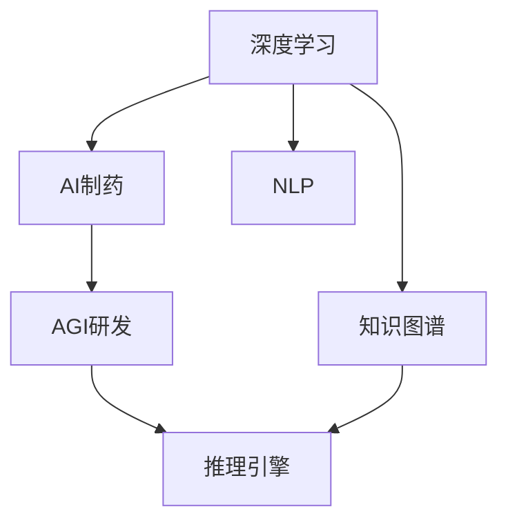
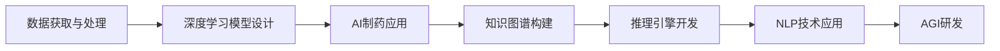
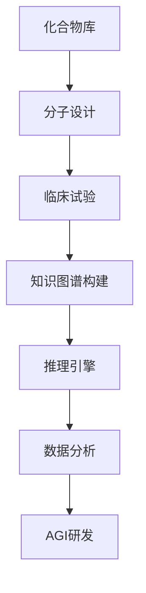
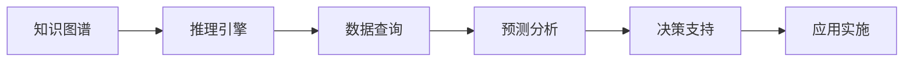
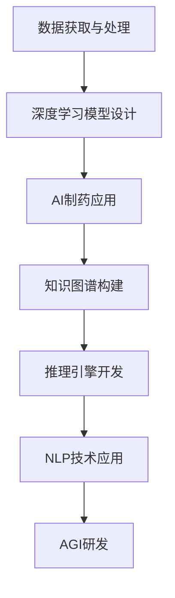

                 

# 漆远无限光年:从AI制药到AGI研发的转型

> 关键词：深度学习，AI制药，AGI研发，知识图谱，推理引擎，自然语言处理

## 1. 背景介绍

### 1.1 问题由来

随着科技的迅猛发展，人工智能(AI)已经成为推动各行各业变革的关键力量。在药物研发领域，AI制药凭借其强大的数据处理能力、高效的计算速度和创新的思维模式，正逐渐替代传统药物研发模式，成为新药研发的重要手段。然而，AI制药目前仍处于起步阶段，存在诸多技术和应用瓶颈。如何在AI制药的基础上，进一步突破这些瓶颈，实现通用人工智能(AGI)的研发，成为学界和工业界的共同课题。

### 1.2 问题核心关键点

从AI制药到AGI研发，涉及多个技术层面和应用场景的融合。其中，核心关键点包括：

1. **数据获取与处理**：如何高效获取海量数据，并进行清洗、标注和转换。
2. **模型设计与优化**：如何构建高效的深度学习模型，并对其进行参数优化和结构改进。
3. **知识图谱构建**：如何将海量的文本数据转化为结构化的知识图谱，用于支持复杂的推理和关联分析。
4. **推理引擎开发**：如何构建强大的推理引擎，实现对知识图谱中关系的逻辑推理和实时查询。
5. **自然语言处理(NLP)**：如何通过NLP技术实现对文本数据的语义理解和文本生成，以支持更丰富的应用场景。

### 1.3 问题研究意义

从AI制药到AGI研发，将推动药物研发领域的智能化和自动化，加速新药的发现和上市。其重要意义在于：

1. **提升研发效率**：AI制药能够大幅缩短药物研发周期，降低研发成本。AGI研发则能在此基础上进一步提升研发效率，加速创新药物的上市。
2. **降低研发风险**：AI制药和AGI研发能够通过数据驱动的决策，降低药物研发的风险。
3. **实现个性化治疗**：AGI研发能够根据患者个体数据，制定个性化治疗方案，提升治疗效果。
4. **推动医疗创新**：AGI研发能够实现医疗信息的自动化分析和应用，推动医疗服务创新。
5. **赋能生命科学**：AI制药和AGI研发能够加速生命科学研究的进程，推动生物医学领域的发展。

## 2. 核心概念与联系

### 2.1 核心概念概述

为更好地理解从AI制药到AGI研发的过程，本节将介绍几个密切相关的核心概念：

- **深度学习(Deep Learning)**：基于神经网络模型，通过多层次的特征提取和抽象，实现对复杂数据的建模和预测。
- **AI制药**：利用深度学习等AI技术，加速药物研发过程，包括化合物筛选、分子设计、临床试验等环节。
- **AGI研发**：旨在构建能够理解和应用人类知识的智能系统，能够进行复杂的推理、决策和创造。
- **知识图谱(Knowledge Graph)**：将文本数据转化为结构化的知识表示，用于支持复杂关系和推理。
- **推理引擎(Rule Engine)**：用于根据规则和逻辑，对知识图谱中的关系进行推理和查询。
- **自然语言处理(NLP)**：实现对文本数据的语义理解和生成，包括语言模型、文本分类、信息抽取等。

这些核心概念之间的逻辑关系可以通过以下Mermaid流程图来展示：



这个流程图展示了大语言模型微调过程中各个核心概念的关系和作用：

1. 深度学习提供了强大的特征提取能力，支持AI制药和AGI研发。
2. AI制药通过对深度学习模型的优化和应用，加速药物研发过程。
3. AGI研发在此基础上，进一步提升模型的智能水平，支持更复杂的任务。
4. 知识图谱通过结构化的知识表示，支持复杂关系和推理。
5. 推理引擎用于根据规则和逻辑，对知识图谱中的关系进行推理和查询。
6. NLP技术实现对文本数据的语义理解和生成，支持更丰富的应用场景。

### 2.2 概念间的关系

这些核心概念之间存在着紧密的联系，形成了从AI制药到AGI研发的整体生态系统。下面我通过几个Mermaid流程图来展示这些概念之间的关系。

#### 2.2.1 从AI制药到AGI研发的过程



这个流程图展示了从AI制药到AGI研发的基本过程：

1. 通过数据获取与处理，得到初始数据集。
2. 利用深度学习模型设计，构建高效的AI制药模型。
3. 在AI制药的基础上，构建知识图谱，支持更复杂的推理和关联分析。
4. 开发推理引擎，实现对知识图谱中关系的逻辑推理和实时查询。
5. 应用NLP技术，实现对文本数据的语义理解和生成。
6. 基于上述技术，进行AGI研发，构建智能系统，实现复杂任务的自动化和智能化。

#### 2.2.2 AI制药中的知识图谱构建



这个流程图展示了AI制药中知识图谱构建的过程：

1. 从化合物库开始，进行分子设计。
2. 进行临床试验，收集实验数据。
3. 构建知识图谱，将化合物、分子结构和实验数据进行结构化表示。
4. 开发推理引擎，用于对知识图谱中化合物与分子结构的关系进行推理和查询。
5. 应用数据分析技术，从知识图谱中提取有价值的信息。
6. 基于以上信息，进行AGI研发，构建智能系统，实现药物设计的智能化。

#### 2.2.3 AGI研发中的推理引擎



这个流程图展示了AGI研发中推理引擎的应用：

1. 构建知识图谱，表示复杂的知识关系。
2. 开发推理引擎，支持知识图谱中的关系推理和实时查询。
3. 利用推理引擎，进行数据查询和预测分析。
4. 根据分析结果，进行决策支持，支持复杂的任务自动化。
5. 最终将推理引擎应用于实际业务中，提升系统的智能水平。

### 2.3 核心概念的整体架构

最后，我们用一个综合的流程图来展示从AI制药到AGI研发过程中各个核心概念的关系：



这个综合流程图展示了从AI制药到AGI研发过程中各个核心概念的连接和作用：

1. 数据获取与处理是基础，为深度学习模型设计提供数据支持。
2. 深度学习模型设计是核心，构建高效的AI制药模型。
3. AI制药应用通过深度学习模型，加速药物研发过程。
4. 知识图谱构建将数据结构化，支持复杂关系和推理。
5. 推理引擎开发用于实现对知识图谱中关系的逻辑推理和实时查询。
6. NLP技术应用实现对文本数据的语义理解和生成，支持更丰富的应用场景。
7. AGI研发在此基础上，构建智能系统，实现复杂任务的自动化和智能化。

通过这些流程图，我们可以更清晰地理解从AI制药到AGI研发过程中各个核心概念的关系和作用，为后续深入讨论具体的微调方法和技术奠定基础。

## 3. 核心算法原理 & 具体操作步骤
### 3.1 算法原理概述

从AI制药到AGI研发，本质上是一个从模型设计到应用实现的全过程。其核心思想是：通过深度学习模型的优化和应用，构建高效的AI制药模型；在此基础上，构建知识图谱和推理引擎，实现复杂的推理和决策；同时应用NLP技术，实现对文本数据的语义理解和生成，构建智能系统，实现复杂任务的自动化和智能化。

形式化地，假设初始数据集为 $D=\{(x_i, y_i)\}_{i=1}^N$，其中 $x_i$ 为输入数据，$y_i$ 为标签。目标是通过构建深度学习模型 $M_{\theta}$ 和推理引擎 $E$，实现对新数据的预测和推理。具体步骤如下：

1. 通过深度学习模型设计，构建AI制药模型 $M_{\theta}$，用于处理化合物、分子结构和实验数据等输入数据。
2. 将 $M_{\theta}$ 应用于数据集 $D$，进行模型训练和优化，得到最优模型参数 $\theta^*$。
3. 构建知识图谱 $G$，将化合物、分子结构和实验数据进行结构化表示，并使用推理引擎 $E$ 进行关系推理。
4. 应用NLP技术，实现对文本数据的语义理解和生成，支持更丰富的应用场景。
5. 基于以上技术，进行AGI研发，构建智能系统 $S$，实现复杂任务的自动化和智能化。

### 3.2 算法步骤详解

从AI制药到AGI研发，涉及多个技术层面和应用场景的融合。以下是对关键步骤的详细介绍：

#### 3.2.1 数据获取与处理

**Step 1: 数据获取与清洗**

- **数据获取**：从化合物库、分子设计数据库、临床试验数据库等渠道获取初始数据集。
- **数据清洗**：对数据进行去重、去噪、异常值处理等操作，确保数据质量。

**Step 2: 数据标注与转换**

- **数据标注**：根据化合物、分子结构和实验数据，进行标注和编码。
- **数据转换**：将标注后的数据转换为深度学习模型所需的输入格式，如图像、序列等。

#### 3.2.2 深度学习模型设计

**Step 1: 选择模型架构**

- **卷积神经网络(CNN)**：适用于处理图像数据，提取局部特征。
- **循环神经网络(RNN)**：适用于处理序列数据，提取时间序列特征。
- **注意力机制(Attention)**：适用于处理复杂关系和全局特征，提升模型表现。

**Step 2: 构建深度学习模型**

- **特征提取**：使用CNN、RNN等模型，对输入数据进行特征提取。
- **关系推理**：使用注意力机制，提取化合物与分子结构的关系，进行推理和预测。
- **模型优化**：使用Adam、SGD等优化算法，对模型参数进行优化和调参。

#### 3.2.3 知识图谱构建

**Step 1: 数据映射与构建**

- **数据映射**：将化合物、分子结构和实验数据进行结构化映射，生成知识图谱的节点和边。
- **知识图谱构建**：使用Neo4j、GraphDB等工具，构建知识图谱。

**Step 2: 知识图谱扩展与优化**

- **知识图谱扩展**：增加新数据和新关系，不断扩展知识图谱。
- **知识图谱优化**：使用RDFS、OWL等技术，对知识图谱进行优化和规范化。

#### 3.2.4 推理引擎开发

**Step 1: 规则与逻辑设计**

- **规则设计**：定义推理引擎所需的各种规则和逻辑。
- **逻辑推理**：使用Prolog、Horn等逻辑推理系统，实现对知识图谱中的关系进行推理和查询。

**Step 2: 推理引擎实现**

- **引擎实现**：使用Java、Python等编程语言，实现推理引擎。
- **引擎测试**：对推理引擎进行测试，确保其准确性和高效性。

#### 3.2.5 NLP技术应用

**Step 1: 语言模型设计**

- **语言模型**：使用Transformer、BERT等模型，实现对文本数据的语义理解。
- **语言模型优化**：使用Adam、SGD等优化算法，对语言模型参数进行优化和调参。

**Step 2: 文本分类与生成**

- **文本分类**：使用TextCNN、TextRNN等模型，实现对文本数据的分类。
- **文本生成**：使用GPT、T5等模型，实现文本生成和对话生成。

#### 3.2.6 AGI研发

**Step 1: 智能系统设计**

- **智能系统架构**：设计智能系统的整体架构，包括输入、处理、输出等环节。
- **系统实现**：使用TensorFlow、PyTorch等框架，实现智能系统的开发和部署。

**Step 2: 应用场景实现**

- **应用场景**：设计智能系统在药物研发、医疗服务、金融分析等场景中的应用。
- **系统优化**：对智能系统进行优化和测试，确保其稳定性和高效性。

### 3.3 算法优缺点

从AI制药到AGI研发，涉及多个技术层面和应用场景的融合，具有以下优缺点：

**优点**：

1. **高效智能化**：通过深度学习模型、知识图谱和推理引擎，实现了对复杂数据的智能化处理和推理。
2. **适应性强**：能够适应不同领域的药物研发和应用场景，提供灵活的解决方案。
3. **跨领域融合**：能够实现多模态数据的整合和协同，提升系统的智能水平。
4. **创新潜力大**：通过NLP技术和AGI研发，实现了对自然语言的深度理解和生成，拓展了应用范围。

**缺点**：

1. **数据依赖性强**：需要大量高质量的数据进行训练和推理，数据获取和处理成本较高。
2. **技术复杂度高**：涉及深度学习、知识图谱、推理引擎等多个技术层面的融合，技术门槛较高。
3. **计算资源需求大**：需要高性能的计算设备和存储设备，计算资源需求较大。
4. **模型可解释性不足**：深度学习模型和AGI研发系统往往缺乏可解释性，难以对其内部机制进行理解和调试。

尽管存在这些局限性，但从AI制药到AGI研发仍然具有巨大的应用潜力和发展空间。未来的研究应重点关注如何降低数据获取和处理的成本，提升模型的可解释性，优化计算资源的使用，推动AI制药和AGI研发的普及和应用。

### 3.4 算法应用领域

从AI制药到AGI研发的应用领域广泛，包括但不限于以下几个方面：

1. **药物研发**：利用深度学习模型和知识图谱，加速化合物筛选、分子设计和临床试验等环节。
2. **医疗服务**：利用AGI研发系统，实现智能诊断、个性化治疗和医疗信息自动化分析。
3. **金融分析**：利用深度学习模型和推理引擎，进行风险评估、市场预测和量化交易。
4. **智能制造**：利用知识图谱和推理引擎，实现供应链管理、生产调度和质量控制。
5. **智慧城市**：利用NLP技术和AGI研发系统，实现城市事件监测、舆情分析和应急指挥。
6. **教育培训**：利用NLP技术和智能系统，实现个性化学习、知识推荐和智能评估。

除了上述这些领域，从AI制药到AGI研发的技术还将在更多领域得到应用，为各行各业带来变革性影响。

## 4. 数学模型和公式 & 详细讲解  
### 4.1 数学模型构建

本节将使用数学语言对从AI制药到AGI研发的过程进行更加严格的刻画。

记初始数据集为 $D=\{(x_i, y_i)\}_{i=1}^N$，其中 $x_i$ 为输入数据，$y_i$ 为标签。目标是通过构建深度学习模型 $M_{\theta}$ 和推理引擎 $E$，实现对新数据的预测和推理。具体步骤如下：

1. 通过深度学习模型设计，构建AI制药模型 $M_{\theta}$，用于处理化合物、分子结构和实验数据等输入数据。
2. 将 $M_{\theta}$ 应用于数据集 $D$，进行模型训练和优化，得到最优模型参数 $\theta^*$。
3. 构建知识图谱 $G$，将化合物、分子结构和实验数据进行结构化表示，并使用推理引擎 $E$ 进行关系推理。
4. 应用NLP技术，实现对文本数据的语义理解和生成，支持更丰富的应用场景。
5. 基于以上技术，进行AGI研发，构建智能系统 $S$，实现复杂任务的自动化和智能化。

### 4.2 公式推导过程

以下我们以化合物筛选为例，推导深度学习模型和推理引擎的数学公式。

假设化合物数据集为 $D=\{(x_i, y_i)\}_{i=1}^N$，其中 $x_i$ 为化合物结构，$y_i$ 为标签（是否为有效药物）。目标是通过构建深度学习模型 $M_{\theta}$ 和推理引擎 $E$，实现对新化合物的筛选。

**Step 1: 深度学习模型设计**

- **卷积神经网络(CNN)**：使用CNN模型，提取化合物结构的局部特征。
- **注意力机制(Attention)**：使用注意力机制，提取化合物与分子结构的关系，进行关系推理。

模型参数更新公式为：

$$
\theta \leftarrow \theta - \eta \nabla_{\theta}\mathcal{L}(\theta) - \eta\lambda\theta
$$

其中，$\eta$ 为学习率，$\lambda$ 为正则化系数，$\nabla_{\theta}\mathcal{L}(\theta)$ 为损失函数对模型参数的梯度，$\mathcal{L}(\theta)$ 为目标函数。

**Step 2: 推理引擎设计**

- **规则设计**：定义推理引擎所需的各种规则和逻辑，如分子结构与化合物结构的关系。
- **逻辑推理**：使用Prolog、Horn等逻辑推理系统，实现对知识图谱中的关系进行推理和查询。

推理引擎的推理过程如下：

1. 将化合物结构 $x_i$ 输入深度学习模型 $M_{\theta}$，得到分子结构 $y_i$。
2. 将 $y_i$ 和化合物结构 $x_i$ 输入推理引擎 $E$，进行关系推理，得到预测标签 $\hat{y}_i$。
3. 计算损失函数 $\mathcal{L}(\hat{y}_i, y_i)$，并更新模型参数 $\theta$。

推理引擎的推理公式为：

$$
\hat{y}_i = E(x_i, y_i)
$$

其中，$E$ 为推理引擎函数。

**Step 3: AGI研发设计**

- **智能系统架构**：设计智能系统的整体架构，包括输入、处理、输出等环节。
- **系统实现**：使用TensorFlow、PyTorch等框架，实现智能系统的开发和部署。

AGI研发的推理过程如下：

1. 将化合物结构 $x_i$ 输入深度学习模型 $M_{\theta}$，得到分子结构 $y_i$。
2. 将 $y_i$ 和化合物结构 $x_i$ 输入推理引擎 $E$，进行关系推理，得到预测标签 $\hat{y}_i$。
3. 将 $\hat{y}_i$ 和化合物结构 $x_i$ 输入NLP模型，进行语义理解和生成，得到最终结果。

AGI研发的推理公式为：

$$
S(x_i) = M_{\theta}(x_i) + E(x_i, y_i) + N(x_i, y_i)
$$

其中，$S(x_i)$ 为智能系统输出的结果，$N(x_i, y_i)$ 为NLP模型的输出。

### 4.3 案例分析与讲解

以一个简单的药物筛选任务为例，详细讲解从AI制药到AGI研发的过程。

#### 4.3.1 数据获取与处理

**Step 1: 数据获取**

- **化合物库**：获取化合物库，包含各类化合物的结构、性质和标签。
- **分子设计数据库**：获取分子设计数据库，包含各类分子的结构、性质和标签。
- **临床试验数据库**：获取临床试验数据库，包含各类药物的实验数据和标签。

**Step 2: 数据清洗与标注**

- **数据清洗**：对化合物库、分子设计数据库和临床试验数据库进行去重、去噪和异常值处理。
- **数据标注**：对化合物、分子结构和实验数据进行标注和编码。

#### 4.3.2 深度学习模型设计

**Step 1: 选择模型架构**

- **卷积神经网络(CNN)**：使用CNN模型，提取化合物结构的局部特征。
- **注意力机制(Attention)**：使用注意力机制，提取化合物与分子结构的关系，进行关系推理。

**Step 2: 构建深度学习模型**

- **特征提取**：使用CNN模型，对化合物结构进行特征提取。
- **关系推理**：使用注意力机制，提取化合物与分子结构的关系，进行推理和预测。
- **模型优化**：使用Adam、SGD等优化算法，对模型参数进行优化和调参。

#### 4.3.3 知识图谱构建

**Step 1: 数据映射与构建**

- **数据映射**：将化合物、分子结构和实验数据进行结构化映射，生成知识图谱的节点和边。
- **知识图谱构建**：使用Neo4j、GraphDB等工具，构建知识图谱。

**Step 2: 知识图谱扩展与优化**

- **知识图谱扩展**：增加新数据和新关系，不断扩展知识图谱。
- **知识图谱优化**：使用RDFS、OWL等技术，对知识图谱进行优化和规范化。

#### 4.3.4 推理引擎设计

**Step 1: 规则与逻辑设计**

- **规则设计**：定义推理引擎所需的各种规则和逻辑，如分子结构与化合物结构的关系。
- **逻辑推理**：使用Prolog、Horn等逻辑推理系统，实现对知识图谱中的关系进行推理和查询。

**Step 2: 推理引擎实现**

- **引擎实现**：使用Java、Python等编程语言，实现推理引擎。
- **引擎测试**：对推理引擎进行测试，确保其准确性和高效性。

#### 4.3.5 NLP技术应用

**Step 1: 语言模型设计**

- **语言模型**：使用Transformer、BERT等模型，实现对文本数据的语义理解。
- **语言模型优化**：使用Adam、SGD等优化算法，对语言模型参数进行优化和调参。

**Step 2: 文本分类与生成**

- **文本分类**：使用TextCNN、TextRNN等模型，实现对文本数据的分类。
- **文本生成**：使用GPT、T5等模型，实现文本生成和对话生成。

#### 4.3.6 AGI研发设计

**Step 1: 智能系统架构**

- **智能系统架构**：设计智能系统的整体架构，包括输入、处理、输出等环节。
- **系统实现**：使用TensorFlow、PyTorch等框架，实现智能系统的开发和部署。

**Step 2: 应用场景实现**

- **药物筛选**：利用深度学习模型和推理引擎，进行化合物筛选和分子设计。
- **个性化治疗**：利用AGI研发系统，实现个性化治疗方案的制定和实施。
- **医疗信息自动化分析**：利用NLP技术，实现医疗信息的自动化分析和应用。

通过以上案例分析，我们可以看到，从AI制药到AGI研发的过程涉及多个技术层面和应用场景的融合，通过深度学习模型、知识图谱、推理引擎和NLP技术的协同工作，实现了对复杂任务的自动化和智能化处理。

## 5. 项目实践：代码实例和详细解释说明
### 5.1 开发环境搭建

在进行从AI制药到AGI研发的实践前，我们需要准备好开发环境。以下是使用Python进行PyTorch开发的环境配置流程：

1. 安装Anaconda：从官网下载并安装Anaconda，用于创建独立的Python环境。

2. 创建并激活虚拟环境：
```bash
conda create -n pytorch-env python=3.8 
conda activate pytorch-env
```

3. 安装PyTorch：根据CUDA版本，从官网获取对应的安装命令。例如：
```bash
conda install pytorch torchvision torchaudio cudatoolkit=11.1 -c pytorch -c conda-forge
```

4. 安装TensorFlow：从官网下载并安装TensorFlow，支持GPU/TPU算力。

5. 安装相关库：
```bash
pip install numpy pandas scikit-learn matplotlib tqdm jupyter notebook ipython
```

完成上述步骤后，即可在`pytorch-env`环境中开始开发实践。

### 5.2 源代码详细实现

这里我们以药物筛选任务为例，给出使用TensorFlow和PyTorch进行深度学习模型和推理引擎开发的PyTorch代码实现。

首先，定义深度学习模型：

```python
import tensorflow as tf
from tensorflow.keras import layers

class CNNModel(tf.keras.Model):
    def __init__(self):
        super(CNNModel, self).__init__()
        self.conv1

