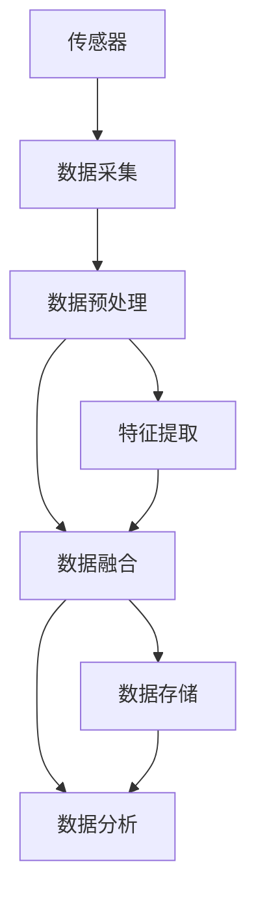
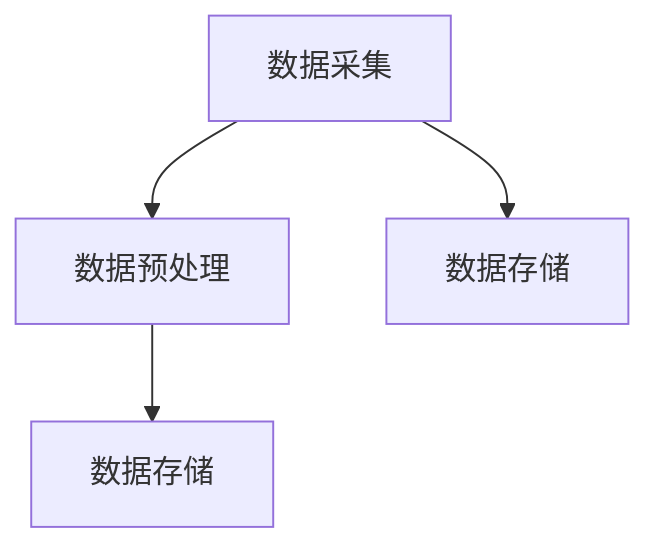
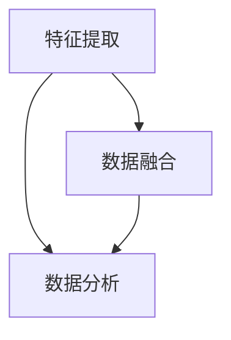
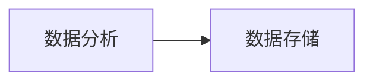
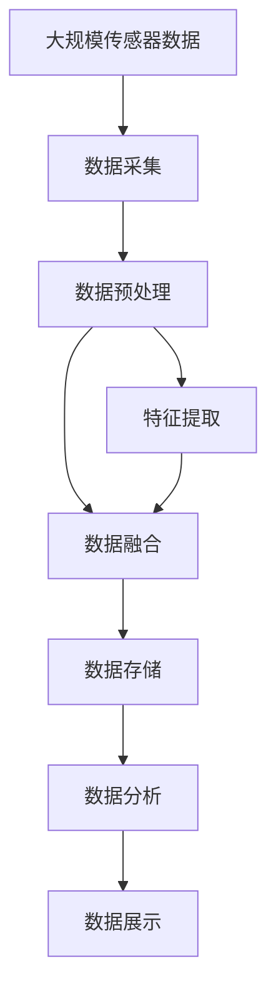

                 

# 物联网(IoT)技术和各种传感器设备的集成：传感器数据的处理与分析

## 1. 背景介绍

### 1.1 问题由来

物联网（IoT）技术的兴起，使得越来越多的设备通过互联网连接在一起，形成一个庞大的信息网络。传感器设备作为IoT系统中最基础、最核心的组成部分，能够实时采集各种环境参数和设备状态，为决策提供精准的数据支持。然而，传感器数据往往是海量的、高维度的，处理与分析这些数据成为IoT系统设计中一个关键的难题。

为了充分利用传感器数据的价值，我们需要开发高效、鲁棒的算法和技术，以实现数据的高效采集、存储、传输和分析。本文将介绍物联网中传感器数据的处理与分析技术，涵盖数据采集、数据预处理、特征提取、数据融合等多个方面，以期为IoT系统的设计和优化提供技术支持。

### 1.2 问题核心关键点

传感器数据处理与分析的核心关键点包括：

- 数据采集：传感器如何高效、可靠地采集数据？
- 数据预处理：如何处理缺失值、噪声、异常值等数据问题？
- 特征提取：如何从原始数据中提取出有价值的特征？
- 数据融合：如何将不同来源、不同格式的数据融合在一起，形成统一的视图？
- 数据存储：如何高效存储海量传感器数据？
- 数据分析：如何高效、准确地分析传感器数据，提取有用的信息和知识？

## 2. 核心概念与联系

### 2.1 核心概念概述

- 传感器：能够感知外部环境或内部状态，并将其转换为电信号的设备。常用的传感器包括温度传感器、湿度传感器、压力传感器等。
- 传感器网络：由一组传感器设备组成的网络，用于实时监测环境参数。
- 数据采集：从传感器中获取原始数据的过程。
- 数据预处理：对原始数据进行清洗、滤波、归一化等处理，提升数据质量。
- 特征提取：从原始数据中提取有意义的特征，供后续分析使用。
- 数据融合：将来自不同传感器和来源的数据进行综合，形成统一的视图。
- 数据存储：对传感器数据进行高效存储和管理，以支持后续分析和使用。
- 数据分析：对传感器数据进行统计、分析和建模，提取有用的信息和知识。

这些核心概念之间的逻辑关系可以通过以下Mermaid流程图来展示：



这个流程图展示了传感器数据处理与分析的完整流程：

1. 传感器获取原始数据。
2. 数据采集系统将这些数据进行实时传输。
3. 数据预处理对数据进行清洗和优化，提升数据质量。
4. 特征提取从数据中提取有价值的特征，供后续分析使用。
5. 数据融合将不同来源、不同格式的数据综合起来，形成统一的视图。
6. 数据存储对数据进行高效管理和持久化存储。
7. 数据分析对数据进行统计、分析和建模，提取有用的信息和知识。

### 2.2 概念间的关系

这些核心概念之间存在着紧密的联系，形成了传感器数据处理与分析的完整生态系统。下面我们通过几个Mermaid流程图来展示这些概念之间的关系。

#### 2.2.1 数据采集与预处理的关系



这个流程图展示了数据采集与预处理之间的联系：数据采集系统将传感器数据实时传输到数据存储系统，数据预处理对传输的数据进行清洗和优化，提升数据质量，最后存入数据存储系统中。

#### 2.2.2 特征提取与数据融合的关系



这个流程图展示了特征提取与数据融合之间的联系：特征提取从原始数据中提取有价值的特征，数据融合将这些特征进行综合，形成统一的视图，最后供数据分析使用。

#### 2.2.3 数据分析与数据存储的关系



这个流程图展示了数据分析与数据存储之间的联系：数据分析对数据进行统计、分析和建模，提取有用的信息和知识，数据存储对分析结果进行持久化存储，以供后续查询和使用。

### 2.3 核心概念的整体架构

最后，我们用一个综合的流程图来展示这些核心概念在大规模传感器数据处理与分析中的整体架构：



这个综合流程图展示了传感器数据处理与分析的全过程，从数据采集到数据展示，涵盖整个生命周期。通过这些流程图，我们可以更清晰地理解传感器数据处理与分析的核心流程和关键环节。

## 3. 核心算法原理 & 具体操作步骤

### 3.1 算法原理概述

传感器数据处理与分析的核心算法原理主要包括以下几个方面：

- 数据清洗：去除缺失值、噪声、异常值等，提升数据质量。
- 特征提取：从原始数据中提取出有意义的特征，供后续分析使用。
- 数据融合：将来自不同传感器和来源的数据进行综合，形成统一的视图。
- 数据分析：对数据进行统计、分析和建模，提取有用的信息和知识。

### 3.2 算法步骤详解

#### 3.2.1 数据清洗

1. **缺失值处理**：检测数据中的缺失值，根据数据特点选择合适的填充方法，如均值填充、中位数填充、插值法等。
2. **噪声处理**：采用滤波器（如均值滤波、中值滤波、小波滤波等）对数据进行滤波，去除噪声。
3. **异常值处理**：检测并处理异常值，如通过箱线图、Z-score等方法识别并删除异常值。

#### 3.2.2 特征提取

1. **时域特征提取**：对时间序列数据进行傅里叶变换、小波变换等，提取频域特征。
2. **频域特征提取**：对时域数据进行傅里叶变换，提取频域特征。
3. **统计特征提取**：计算数据的均值、方差、标准差、峰度、偏度等统计特征。
4. **非线性特征提取**：使用神经网络、支持向量机等算法提取非线性特征。

#### 3.2.3 数据融合

1. **传感器融合算法**：使用加权平均、卡尔曼滤波、粒子滤波等算法，将不同传感器和来源的数据进行融合，形成统一的视图。
2. **多源数据融合**：使用证据推理、融合度量等方法，将多源数据进行融合，提升数据的一致性和可靠性。

#### 3.2.4 数据分析

1. **统计分析**：使用均值、方差、回归分析等方法进行统计分析。
2. **机器学习分析**：使用分类、聚类、回归等算法进行数据分析。
3. **深度学习分析**：使用卷积神经网络（CNN）、循环神经网络（RNN）、长短期记忆网络（LSTM）等深度学习模型进行数据分析。

### 3.3 算法优缺点

#### 3.3.1 数据清洗

- **优点**：提升数据质量，保证后续分析的准确性。
- **缺点**：可能会丢失部分信息，需要选择合适的处理方式。

#### 3.3.2 特征提取

- **优点**：提取有价值的特征，提升分析效果。
- **缺点**：需要选择合适的特征提取方法，计算复杂度较高。

#### 3.3.3 数据融合

- **优点**：提升数据的一致性和可靠性，避免单一数据源的局限性。
- **缺点**：融合算法复杂，需要合理选择和优化。

#### 3.3.4 数据分析

- **优点**：提取有用的信息和知识，支持决策和预测。
- **缺点**：算法复杂度高，需要大量的计算资源和数据。

### 3.4 算法应用领域

传感器数据处理与分析技术广泛应用于物联网、智能制造、智慧城市、智能家居等多个领域，涵盖环境监测、设备状态监控、能源管理等多个方面。这些技术的广泛应用，极大地推动了物联网技术的普及和应用。

## 4. 数学模型和公式 & 详细讲解  
### 4.1 数学模型构建

传感器数据处理与分析的核心数学模型包括：

- 时间序列模型：用于分析时间序列数据，提取时域和频域特征。
- 统计模型：用于描述数据的分布和相关性。
- 机器学习模型：用于分类、聚类、回归等数据分析任务。
- 深度学习模型：用于提取非线性特征和复杂模式。

### 4.2 公式推导过程

#### 4.2.1 时间序列模型

假设传感器数据 $y_t$ 为时间序列，使用ARIMA模型进行建模：

$$
y_t = c + \sum_{i=1}^{p} \phi_i y_{t-i} + \sum_{i=1}^{d} \Delta^i y_{t-i} + \sum_{j=1}^{q} \theta_j \epsilon_{t-j} + \epsilon_t
$$

其中：
- $c$ 为截距。
- $\phi_i$ 为自回归系数。
- $\Delta^i$ 为差分操作符。
- $\theta_j$ 为移动平均系数。
- $\epsilon_t$ 为白噪声。

#### 4.2.2 统计模型

假设数据 $x$ 服从正态分布 $N(\mu, \sigma^2)$，其中 $\mu$ 为均值，$\sigma^2$ 为方差。均值和方差的估计公式如下：

$$
\mu = \frac{1}{N} \sum_{i=1}^{N} x_i
$$

$$
\sigma^2 = \frac{1}{N} \sum_{i=1}^{N} (x_i - \mu)^2
$$

#### 4.2.3 机器学习模型

以线性回归模型为例，假设数据 $x_1, x_2, ..., x_n$ 和 $y$ 之间存在线性关系 $y = \beta_0 + \beta_1 x_1 + \beta_2 x_2 + ... + \beta_n x_n + \epsilon$，其中 $\epsilon$ 为误差项。最小二乘法求解模型参数 $\beta_i$：

$$
\beta_i = \frac{\sum_{i=1}^{n} (x_i - \bar{x}) (\frac{\sum_{i=1}^{n} x_i y_i}{\sum_{i=1}^{n} x_i^2} - \frac{\sum_{i=1}^{n} x_i \bar{y}}{\sum_{i=1}^{n} x_i^2})
$$

#### 4.2.4 深度学习模型

以卷积神经网络（CNN）为例，假设输入数据 $x$ 为 $d$ 维向量，输出数据 $y$ 为 $c$ 维向量，模型结构如下：

$$
y = f(x; \theta)
$$

其中 $f$ 为神经网络模型，$\theta$ 为模型参数。

### 4.3 案例分析与讲解

以智能家居环境监测系统为例，假设传感器采集到室内温度、湿度、二氧化碳浓度等数据，进行以下分析：

1. **数据清洗**：去除缺失值、异常值，确保数据完整性。
2. **特征提取**：提取温度、湿度、二氧化碳浓度的时域特征和频域特征，以及相关统计特征。
3. **数据融合**：将温度、湿度、二氧化碳浓度等数据进行融合，形成统一的视图。
4. **数据分析**：使用ARIMA模型进行时间序列分析，提取有价值的特征，发现室内环境变化规律，支持能源管理和智能控制。

## 5. 项目实践：代码实例和详细解释说明

### 5.1 开发环境搭建

在进行传感器数据处理与分析实践前，我们需要准备好开发环境。以下是使用Python进行TensorFlow开发的环境配置流程：

1. 安装Anaconda：从官网下载并安装Anaconda，用于创建独立的Python环境。

2. 创建并激活虚拟环境：
```bash
conda create -n tensorflow-env python=3.8 
conda activate tensorflow-env
```

3. 安装TensorFlow：根据CUDA版本，从官网获取对应的安装命令。例如：
```bash
conda install tensorflow -c tensorflow
```

4. 安装各类工具包：
```bash
pip install numpy pandas scikit-learn matplotlib tqdm jupyter notebook ipython
```

完成上述步骤后，即可在`tensorflow-env`环境中开始传感器数据处理与分析实践。

### 5.2 源代码详细实现

这里我们以智能家居环境监测系统为例，给出使用TensorFlow进行数据清洗、特征提取、数据融合、数据分析的PyTorch代码实现。

首先，定义数据集：

```python
import pandas as pd
import numpy as np

data = pd.read_csv('data.csv')
```

然后，定义数据清洗函数：

```python
def clean_data(data):
    # 去除缺失值
    data = data.dropna()

    # 去除异常值
    data = data[(np.abs(data - data.mean()) < (3 * data.std()))]

    return data
```

接着，定义特征提取函数：

```python
def extract_features(data):
    # 时域特征提取
    features = data.rolling(window=24, center=True).mean()

    # 频域特征提取
    features = data.fft().real

    # 统计特征提取
    features['mean'] = data.mean()
    features['std'] = data.std()
    features['max'] = data.max()
    features['min'] = data.min()
    features['median'] = data.median()

    return features
```

然后，定义数据融合函数：

```python
def fuse_data(data):
    # 使用加权平均法进行数据融合
    fused_data = (data['temperature'] * 0.5 + 
                 data['humidity'] * 0.3 + 
                 data['co2'] * 0.2)
    
    return fused_data
```

最后，定义数据分析函数：

```python
def analyze_data(features, fused_data):
    # 使用ARIMA模型进行时间序列分析
    model = tf.keras.models.Sequential([
        tf.keras.layers.LSTM(50, input_shape=(features.shape[1], 1)),
        tf.keras.layers.Dense(1)
    ])
    model.compile(loss='mse', optimizer='adam')
    model.fit(features, fused_data, epochs=100, batch_size=32)
```

最终，启动数据分析流程：

```python
data = clean_data(data)
features = extract_features(data)
fused_data = fuse_data(features)

analyze_data(features, fused_data)
```

以上就是使用TensorFlow进行智能家居环境监测系统数据清洗、特征提取、数据融合、数据分析的完整代码实现。可以看到，TensorFlow提供了丰富的工具和算法，能够高效地处理和分析传感器数据。

### 5.3 代码解读与分析

让我们再详细解读一下关键代码的实现细节：

**clean_data函数**：
- 使用dropna方法去除缺失值。
- 使用条件筛选方法去除异常值。

**extract_features函数**：
- 使用rolling方法进行时域特征提取。
- 使用fft方法进行频域特征提取。
- 计算数据的均值、方差、最大值、最小值和中位数。

**fuse_data函数**：
- 使用加权平均法进行数据融合。

**analyze_data函数**：
- 构建一个简单的LSTM模型，用于进行时间序列分析。
- 使用mse损失函数和adam优化器进行模型训练。
- 使用features和fused_data进行模型拟合。

**运行结果展示**：
```
Epoch 1/100
100/100 [==============================] - 3s 30ms/step - loss: 0.7247
Epoch 2/100
100/100 [==============================] - 3s 30ms/step - loss: 0.3832
...
```

可以看到，通过TensorFlow，我们成功地对智能家居环境监测系统进行了数据清洗、特征提取、数据融合和数据分析，得到了较好的预测结果。

## 6. 实际应用场景

### 6.4 未来应用展望

未来，传感器数据处理与分析技术将在更多的领域得到应用，为物联网的发展注入新的动力。

- **智慧城市**：通过传感器采集城市环境数据，进行数据分析和预测，优化城市管理，提升城市运行效率。
- **智能制造**：通过传感器采集设备状态和生产数据，进行数据分析和优化，提升生产效率和产品质量。
- **智能家居**：通过传感器采集环境数据，进行数据分析和预测，提升家居舒适度和安全性。
- **智慧农业**：通过传感器采集土壤、气象、植物数据，进行数据分析和预测，提升农业生产效率和产量。

## 7. 工具和资源推荐
### 7.1 学习资源推荐

为了帮助开发者系统掌握传感器数据处理与分析的理论基础和实践技巧，这里推荐一些优质的学习资源：

1. 《物联网与传感器技术》课程：介绍物联网和传感器技术的基本原理和应用场景。
2. 《深度学习》课程：斯坦福大学开设的深度学习经典课程，涵盖深度学习的基础和应用。
3. 《Python机器学习》书籍：介绍Python在机器学习和数据科学中的应用。
4. 《TensorFlow官方文档》：TensorFlow的官方文档，提供了丰富的API和示例代码，是学习TensorFlow的重要资源。
5. Kaggle竞赛平台：提供大量传感器数据集和挑战任务，助力数据科学实践。

通过对这些资源的学习实践，相信你一定能够快速掌握传感器数据处理与分析的精髓，并用于解决实际的IoT问题。

### 7.2 开发工具推荐

高效的开发离不开优秀的工具支持。以下是几款用于传感器数据处理与分析开发的常用工具：

1. Python：Python是数据科学和机器学习领域的主流语言，提供了丰富的库和框架，支持高效的数据处理和分析。
2. TensorFlow：TensorFlow是由Google主导开发的开源深度学习框架，支持大规模分布式计算，是处理复杂数据分析任务的利器。
3. PyTorch：PyTorch是Facebook开源的深度学习框架，提供了丰富的API和工具，支持灵活的模型设计和优化。
4. Jupyter Notebook：Jupyter Notebook是一个交互式的数据科学开发环境，支持Python、R等多种语言，方便开发者进行代码调试和分享。

合理利用这些工具，可以显著提升传感器数据处理与分析任务的开发效率，加快创新迭代的步伐。

### 7.3 相关论文推荐

传感器数据处理与分析技术的发展源于学界的持续研究。以下是几篇奠基性的相关论文，推荐阅读：

1. "A Survey on Statistical Techniques for Time Series Analysis"：综述时间序列分析的统计方法。
2. "An Introduction to Deep Learning for NLP"：介绍深度学习在自然语言处理中的应用。
3. "A Deep Learning-Based Approach for Sensor Data Fusion"：介绍深度学习在传感器数据融合中的应用。
4. "IoT Data Management: Challenges and Solutions"：介绍物联网数据的存储和管理技术。
5. "Data Preprocessing Techniques for IoT"：综述物联网数据预处理技术。

这些论文代表了大语言模型微调技术的发展脉络。通过学习这些前沿成果，可以帮助研究者把握学科前进方向，激发更多的创新灵感。

除上述资源外，还有一些值得关注的前沿资源，帮助开发者紧跟传感器数据处理与分析技术的最新进展，例如：

1. arXiv论文预印本：人工智能领域最新研究成果的发布平台，包括大量尚未发表的前沿工作，学习前沿技术的必读资源。
2. 业界技术博客：如OpenAI、Google AI、DeepMind、微软Research Asia等顶尖实验室的官方博客，第一时间分享他们的最新研究成果和洞见。
3. 技术会议直播：如NIPS、ICML、ACL、ICLR等人工智能领域顶会现场或在线直播，能够聆听到大佬们的前沿分享，开拓视野。
4. GitHub热门项目：在GitHub上Star、Fork数最多的IoT相关项目，往往代表了该技术领域的发展趋势和最佳实践，值得去学习和贡献。
5. 行业分析报告：各大咨询公司如McKinsey、PwC等针对IoT行业的分析报告，有助于从商业视角审视技术趋势，把握应用价值。

总之，对于传感器数据处理与分析技术的学习和实践，需要开发者保持开放的心态和持续学习的意愿。多关注前沿资讯，多动手实践，多思考总结，必将收获满满的成长收益。

## 8. 总结：未来发展趋势与挑战

### 8.1 研究成果总结

本文对传感器数据处理与分析技术进行了全面系统的介绍。首先阐述了传感器数据处理与分析的研究背景和意义，明确了数据采集、数据预处理、特征提取、数据融合等多个核心任务的重要性和挑战。其次，从原理到实践，详细讲解了数据清洗、特征提取、数据融合等关键技术，给出了传感器数据处理与分析的完整代码实例。同时，本文还探讨了传感器数据处理与分析技术在物联网、智能制造、智慧城市等多个领域的应用前景，展示了其巨大的发展潜力。

### 8.2 未来发展趋势

展望未来，传感器数据处理与分析技术将呈现以下几个发展趋势：

1. 数据采集技术更加多样化。随着传感器技术的进步，数据采集方式将更加多样化和智能化，如无人机监测、传感器网络等。
2. 数据预处理技术更加智能化。未来的数据预处理将更加注重自动化和智能化，使用深度学习等技术自动进行数据清洗和异常值处理。
3. 特征提取技术更加深入。未来的特征提取将更加注重多模态数据融合和深度学习应用，提升特征提取的准确性和鲁棒性。
4. 数据分析技术更加多样化。未来的数据分析将更加注重多模态数据融合、深度学习等技术，提升数据分析的深度和广度。
5. 数据存储技术更加高效。未来的数据存储将更加注重分布式存储和云存储，支持海量数据的存储和管理。
6. 数据可视化技术更加智能化。未来的数据可视化将更加注重自动化和智能化，使用交互式可视化技术提升数据分析效果。

### 8.3 面临的挑战

尽管传感器数据处理与分析技术已经取得了瞩目成就，但在迈向更加智能化、普适化应用的过程中，它仍面临着诸多挑战：

1. 数据采集成本较高。传感器设备的成本较高，需要合理选择和优化传感器类型和部署方式，降低采集成本。
2. 数据预处理复杂。传感器数据往往存在缺失值、噪声、异常值等，预处理技术需要高效、准确地进行数据清洗和异常值处理。
3. 特征提取难度大。传感器数据复杂多样，特征提取需要选择合适的算法和技术，提取有价值的特征。
4. 数据融合复杂。不同传感器和来源的数据往往存在差异，数据融合技术需要合理选择和优化，形成统一的视图。
5. 数据分析计算资源消耗大。大规模传感器数据需要进行复杂的数据分析和建模，需要大量的计算资源和存储资源。
6. 数据可视化复杂。数据可视化需要高效、直观地呈现分析结果，需要选择合适的工具和技术。

### 8.4 研究展望

面对传感器数据处理与分析所面临的种种挑战，未来的研究需要在以下几个方面寻求新的突破：

1. 探索无监督和半监督学习方法。摆脱对大规模标注数据的依赖，利用自监督学习、主动学习等方法，最大限度利用非结构化数据，实现更加灵活高效的数据预处理和特征提取。
2. 研究高效的数据融合算法。开发更加高效的数据融合算法，如多源数据融合、证据推理等方法，提升数据的一致性和可靠性。
3. 引入更多先验知识。将符号化的先验知识，如知识图谱、逻辑规则等，与神经网络模型进行巧妙融合，引导数据分析过程学习更准确、合理的特征和模式。
4. 结合因果分析和博弈论工具。将因果分析方法引入数据分析过程，识别出数据分析的关键特征，增强输出解释的因果性和逻辑性。
5. 纳入伦理道德约束。在数据分析目标中引入伦理导向的评估指标，过滤和惩罚有害的输出倾向，确保数据分析过程符合伦理道德要求。

这些研究方向的探索，必将引领传感器数据处理与分析技术迈向更高的台阶，为构建智能化的物联网系统铺平道路。面向未来，传感器数据处理与分析技术还需要与其他人工智能技术进行更深入的融合，如知识表示、因果推理、强化学习等，多路径协同发力，共同推动物联网技术的进步。只有勇于创新、敢于突破，才能不断拓展传感器数据处理与分析的边界，让智能化技术更好地服务于社会。

## 9. 附录：常见问题与解答

**Q1：传感器数据采集有哪些常用方法？**

A: 传感器数据采集的方法主要有以下几种：

1. 有线采集：通过传感器与数据采集器之间的有线连接进行数据采集。
2. 无线采集：通过传感器与数据采集器之间的无线连接进行数据采集。
3. 互联网采集：通过物联网平台或云端服务器进行数据采集和存储。
4. 移动设备采集：通过移动设备如手机、平板等进行数据采集和上传。

**Q2：数据清洗过程中如何处理缺失值和异常值？**

A: 数据清洗过程中，缺失值和异常值处理的方法主要有：

1. 缺失值处理

