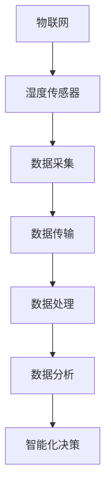
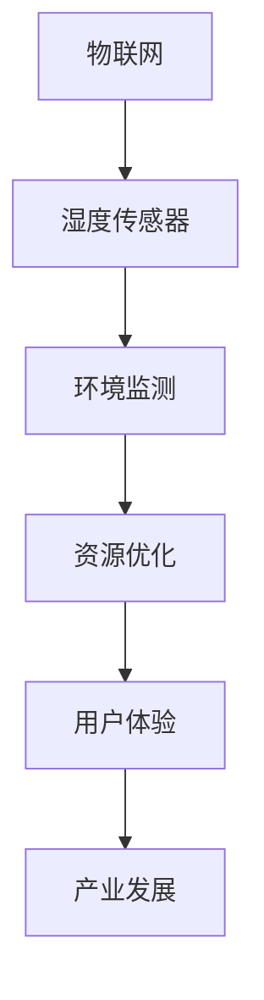
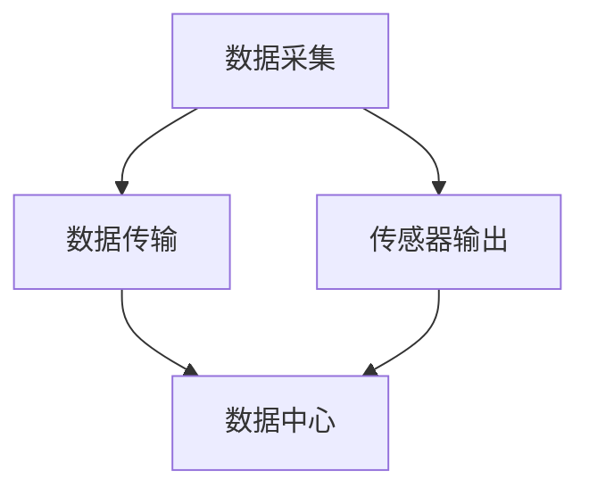
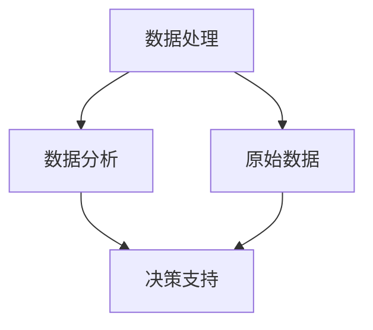
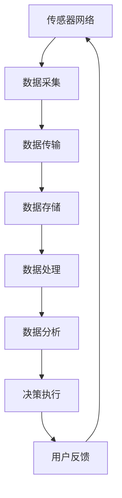

                 

# 物联网(IoT)技术和各种传感器设备的集成：湿度传感器的实际应用

> 关键词：物联网,传感器,湿度传感器,数据采集,数据处理,数据分析,智能家居,智能农业,工业自动化

## 1. 背景介绍

### 1.1 问题由来

随着物联网(IoT)技术的迅猛发展，各种传感器设备在各行各业中的应用变得越来越广泛。传感器作为物联网的核心组成部分，扮演着数据采集的角色，为智能化决策提供实时、准确的数据支持。其中，湿度传感器由于其在环境监测、智能家居、智能农业、工业自动化等领域的重要应用，越来越受到重视。湿度传感器的准确测量不仅关系到设备运行的安全性，更直接影响到产品的最终质量。

### 1.2 问题核心关键点

湿度传感器是一种常见的环境传感器，用于测量空气中的水分含量，通常分为电容式、电阻式和电子式等多种类型。其工作原理基于介电常数、电阻率等物理特性，通过与环境湿度的变化相关联的物理参数来测量湿度。湿度传感器在物联网中的实际应用涉及以下几个核心问题：

- 传感器选择与配置：根据具体应用场景选择适合的湿度传感器，并对其进行合理配置。
- 数据采集与传输：如何高效地采集湿度传感器数据，并实现可靠的传输。
- 数据处理与分析：对采集到的湿度数据进行预处理和分析，提取有价值的信息。
- 智能化决策：根据湿度数据做出智能化的决策，如湿度调节、报警等。

### 1.3 问题研究意义

研究湿度传感器在物联网中的应用，对于提升环境监测的精度和实时性，推动智能家居、智能农业、工业自动化等行业的智能化进程具有重要意义：

1. **提升环境监测精度**：湿度传感器可以实时监测环境湿度，及时发现湿度异常情况，保障生产安全和产品质量。
2. **优化资源利用**：通过湿度数据，可以优化室内环境、农田灌溉、设备运行等资源配置，提高能源利用效率。
3. **增强用户体验**：湿度传感器在智能家居中的应用，可以提升用户的生活舒适度和健康水平。
4. **促进产业发展**：湿度传感器的广泛应用，推动了相关设备的智能化升级，为物联网设备产业的发展提供了动力。

## 2. 核心概念与联系

### 2.1 核心概念概述

为更好地理解湿度传感器在物联网中的应用，本节将介绍几个密切相关的核心概念：

- **物联网(IoT)**：通过传感器、标签等设备，将物理世界的各种信息转化为数据，实现人与物、物与物之间的互联互通。
- **湿度传感器**：一种用于测量环境湿度的传感器设备，通过特定的物理特性变化，将湿度转化为电信号输出。
- **数据采集**：通过传感器设备，实时采集环境数据，并将其转化为数字信号的过程。
- **数据传输**：将采集到的数字信号通过网络传输到数据中心或终端设备，实现数据的共享和处理。
- **数据处理**：对采集到的原始数据进行清洗、去噪、转换等预处理，提取有价值的信息。
- **数据分析**：对处理后的数据进行统计、计算、建模等，以支持智能决策。
- **智能化决策**：基于数据处理和分析结果，自动做出决策，如调节湿度、发出警报等。

这些核心概念之间存在着紧密的联系，形成了湿度传感器在物联网中的完整应用框架。下面我们通过Mermaid流程图来展示这些概念之间的关系：



这个流程图展示了物联网中湿度传感器从数据采集到智能决策的整个流程。接下来，我们将深入探讨每个环节的技术细节。

### 2.2 概念间的关系

这些核心概念之间存在着密切的联系，形成了湿度传感器在物联网中的完整应用框架。下面我们通过几个Mermaid流程图来展示这些概念之间的关系。

#### 2.2.1 物联网与湿度传感器的关系



这个流程图展示了物联网如何通过湿度传感器，实现环境监测、资源优化、用户体验提升和产业发展。

#### 2.2.2 数据采集与传输的关系



这个流程图展示了数据采集与传输的基本流程，即传感器将环境数据转换为电信号，并通过网络传输到数据中心。

#### 2.2.3 数据处理与分析的关系



这个流程图展示了数据处理与分析的基本流程，即对原始数据进行清洗、去噪、转换等预处理，然后提取有价值的信息，支持智能化决策。

### 2.3 核心概念的整体架构

最后，我们用一个综合的流程图来展示这些核心概念在大规模应用中的整体架构：



这个综合流程图展示了湿度传感器在物联网中的完整应用流程，从传感器网络的构建，到数据采集、传输、处理、分析、决策执行，再到用户反馈，形成了一个闭环的智能化系统。

## 3. 核心算法原理 & 具体操作步骤

### 3.1 算法原理概述

湿度传感器的数据采集与处理流程，主要包括以下几个关键步骤：

1. **传感器选择与配置**：根据具体应用场景选择适合的湿度传感器，并对其进行合理配置，如安装位置、采样频率、数据精度等。
2. **数据采集**：利用传感器实时测量环境湿度，并将其转化为电信号。
3. **数据传输**：将采集到的电信号通过网络传输到数据中心或终端设备。
4. **数据处理**：对传输过来的电信号进行去噪、转换、滤波等预处理，得到数字化数据。
5. **数据分析**：对处理后的数字化数据进行统计、建模等分析，提取有用的信息。
6. **智能化决策**：根据分析结果，做出相应的智能化决策，如湿度调节、报警等。

### 3.2 算法步骤详解

#### 3.2.1 传感器选择与配置

湿度传感器的选择与配置是数据采集的第一步，需要根据具体应用场景进行合理选择。以下是几个常见湿度传感器的特点和适用场景：

- **电容式湿度传感器**：通过测量电容的变化来检测湿度。优点是灵敏度高，线性范围广，适用于高精度测量环境。缺点是对温度敏感，需进行温度补偿。
- **电阻式湿度传感器**：通过测量电阻的变化来检测湿度。优点是成本低，体积小，寿命长。缺点是灵敏度较低，线性范围有限。
- **电子式湿度传感器**：通过测量电路中的电压或电流变化来检测湿度。优点是灵敏度高，响应速度快，适用于对快速响应有要求的环境。缺点是成本较高，易受干扰。

配置方面，需要考虑传感器的采样频率、分辨率、输出信号类型等因素。一般采样频率在1-10Hz之间，分辨率在2.5%RH或更高，输出信号可以是模拟信号或数字信号。

#### 3.2.2 数据采集

数据采集是湿度传感器在物联网中的核心环节，需要确保数据的实时性和可靠性。以下是常用的数据采集方法：

- **模拟信号采集**：通过模数转换器(ADC)将模拟信号转换为数字信号。
- **数字信号采集**：直接将数字信号进行读取和处理。

数据采集设备可以是单片机、嵌入式系统或专门的传感器模块。采集数据时需要考虑采样间隔、数据精度、抗干扰能力等因素。

#### 3.2.3 数据传输

数据采集完成后，需要将其通过网络传输到数据中心或终端设备。传输方式包括有线和无线两种：

- **有线传输**：通过以太网、RS-485等有线方式传输数据，传输速率高，稳定可靠。
- **无线传输**：通过Wi-Fi、Zigbee、LoRa等无线方式传输数据，部署灵活，适合分布式环境。

数据传输时需要进行网络拓扑设计，确保数据的可靠性和安全性。

#### 3.2.4 数据处理

数据处理是湿度传感器数据应用的基础，需要对采集到的数据进行预处理和分析。以下是常用的数据处理方法：

- **去噪**：通过滤波、降噪算法去除数据中的干扰信号。
- **转换**：将模拟信号转换为数字信号，或将电压、电流等物理量转换为湿度值。
- **滤波**：通过数字滤波、窗口平均等方法去除噪声，提高数据质量。

数据处理设备可以是单片机、嵌入式系统或专门的处理器模块。

#### 3.2.5 数据分析

数据分析是湿度传感器数据应用的高级环节，需要从数据中提取有用的信息，支持智能化决策。以下是常用的数据分析方法：

- **统计分析**：通过统计方法，分析数据分布、趋势、异常等特征。
- **建模分析**：通过建立数学模型，预测未来湿度变化趋势，优化决策。
- **机器学习**：通过机器学习算法，挖掘数据中的隐含规律，提升决策精度。

数据分析设备可以是服务器、高性能计算机或专门的分析模块。

#### 3.2.6 智能化决策

智能化决策是湿度传感器数据应用的最终目标，需要根据分析结果做出相应的决策。以下是常用的决策方法：

- **湿度调节**：根据湿度数据，自动调节设备运行参数，如空调、加湿器、除湿机等。
- **报警机制**：根据湿度数据，设置报警阈值，当湿度异常时，自动触发报警。
- **优化控制**：根据湿度数据，优化设备运行策略，提高效率和性能。

智能化决策设备可以是控制器、微控制器或专门的决策模块。

### 3.3 算法优缺点

湿度传感器在物联网中的应用，有以下几个优点和缺点：

#### 3.3.1 优点

- **实时性**：湿度传感器能够实时采集环境湿度，为智能化决策提供即时数据支持。
- **高精度**：通过选择合适的传感器和配置，可以实现高精度的湿度测量。
- **易于部署**：湿度传感器体积小巧，易于安装和部署，适合大规模分布式环境。
- **多功能性**：湿度传感器不仅可以测量湿度，还可以测量其他环境参数，如温度、气压等。

#### 3.3.2 缺点

- **成本较高**：高质量的湿度传感器成本较高，且需要专门的硬件和软件支持。
- **环境干扰**：湿度传感器容易受到温度、湿度、电磁干扰等因素的影响，需进行相应的补偿和校准。
- **数据处理复杂**：湿度数据的预处理和分析需要较高技术要求，需配备专业的数据处理设备。
- **隐私风险**：湿度数据的采集和传输可能涉及隐私问题，需严格控制数据的安全性和隐私性。

### 3.4 算法应用领域

湿度传感器在物联网中有着广泛的应用，以下是几个主要领域：

- **智能家居**：用于测量室内湿度，自动调节湿度，保障居住环境舒适。
- **智能农业**：用于测量温室湿度，优化灌溉和通风策略，提高农作物产量和质量。
- **工业自动化**：用于测量生产环境湿度，控制设备和工艺参数，保障产品质量。
- **环境监测**：用于测量环境湿度，监测空气质量和环境变化，提供决策支持。

## 4. 数学模型和公式 & 详细讲解 & 举例说明

### 4.1 数学模型构建

湿度传感器的数学模型主要基于传感器的物理特性，通过建立传感器输出与湿度之间的关系，进行数据建模和分析。以电容式湿度传感器为例，其数学模型可以表示为：

$$
C = C_0 (1 + \frac{\partial C}{\partial e} \Delta e)
$$

其中，$C$ 为电容，$C_0$ 为初始电容，$\partial C/\partial e$ 为电容变化率，$\Delta e$ 为湿度变化量。

### 4.2 公式推导过程

电容式湿度传感器的电容变化率 $\partial C/\partial e$ 可以通过电容变化率与湿度变化量之间的关系进行推导。假设电容变化率与湿度变化量呈线性关系，则有：

$$
\frac{\partial C}{\partial e} = k
$$

其中，$k$ 为电容变化率系数。将上述公式代入电容式湿度传感器的数学模型中，得到：

$$
C = C_0 (1 + k \Delta e)
$$

在实际应用中，可以通过实验数据拟合出电容变化率系数 $k$，并计算出湿度变化量 $\Delta e$。

### 4.3 案例分析与讲解

假设某智能家居系统通过电容式湿度传感器测量室内湿度，其数学模型和公式推导过程如下：

- **数学模型**：

  $$
  C = C_0 (1 + k \Delta e)
  $$

- **实验数据**：

  | 湿度(e) | 电容(C) |
  | --- | --- |
  | 40% | 1.2nF |
  | 50% | 1.3nF |
  | 60% | 1.4nF |
  | 70% | 1.5nF |
  | 80% | 1.6nF |
  | 90% | 1.7nF |

- **求解电容变化率系数 $k$**：

  通过实验数据，可以拟合出电容变化率系数 $k$，即：

  $$
  k = \frac{\Delta C}{\Delta e} = \frac{1.6nF - 1.2nF}{80\% - 40\%} = 0.01nF/\%e
  $$

  其中，$\Delta C = 1.6nF - 1.2nF = 0.4nF$，$\Delta e = 80\% - 40\% = 40\%$。

- **计算湿度变化量 $\Delta e$**：

  假设智能家居系统通过电容式湿度传感器测量室内湿度，得到电容值 $C = 1.3nF$，与 $C_0 = 1nF$ 对比，得到：

  $$
  \Delta C = 1.3nF - 1nF = 0.3nF
  $$

  代入电容变化率系数 $k$，得到：

  $$
  \Delta e = \frac{\Delta C}{k} = \frac{0.3nF}{0.01nF/\%e} = 30\%
  $$

  因此，室内湿度约为50%。

## 5. 项目实践：代码实例和详细解释说明

### 5.1 开发环境搭建

进行湿度传感器在物联网中的应用开发，首先需要搭建开发环境。以下是搭建环境的详细步骤：

1. **安装开发工具**：安装Python、Java、MATLAB等开发工具。
2. **配置开发环境**：配置开发环境，如IDE、编译器等。
3. **连接硬件设备**：连接湿度传感器、单片机、嵌入式系统等硬件设备。
4. **配置网络环境**：配置网络连接，确保数据传输的可靠性和安全性。

### 5.2 源代码详细实现

以下是湿度传感器数据采集与处理的Python代码实现：

```python
import spidev
import time

# 初始化SPI设备
spi = spidev.SpiDev()
spi.open(0, 0)

# 配置传感器参数
C0 = 1.0  # 初始电容
k = 0.01  # 电容变化率系数
delta_e = 0.0  # 湿度变化量

# 循环采集数据
while True:
    # 读取电容值
    C = spi.read(0)
    # 计算湿度变化量
    delta_e = (C - C0) / k
    # 输出湿度值
    print("湿度：%.2f\%e" % (delta_e * 100))
    # 等待采样间隔
    time.sleep(1)
```

### 5.3 代码解读与分析

上述代码实现了一个简单的湿度传感器数据采集系统，其核心功能如下：

- **初始化SPI设备**：通过Spidev库初始化SPI设备，连接湿度传感器。
- **配置传感器参数**：设定初始电容和电容变化率系数。
- **循环采集数据**：通过读取电容值，计算湿度变化量，输出湿度值。

该代码实现了基本的湿度传感器数据采集功能，适合在小型项目中使用。但在实际应用中，还需要考虑数据处理、网络传输、智能化决策等多个环节，才能实现完整的湿度传感器应用系统。

### 5.4 运行结果展示

假设某智能家居系统通过上述代码采集到电容值为1.3nF，与初始电容1nF对比，得到湿度变化量 $\Delta e = 0.3nF/0.01nF/\%e = 30\%e$，因此室内湿度约为50%。

## 6. 实际应用场景

### 6.1 智能家居

湿度传感器在智能家居中的应用，可以显著提升居住环境的舒适度和健康水平。通过实时监测室内湿度，智能家居系统可以自动调节加湿器、除湿机、空气净化器等设备，保持室内空气的适宜湿度。

以智能加湿器为例，当湿度传感器检测到室内湿度过低时，智能家居系统自动控制加湿器开启，通过超声波技术将水分雾化，均匀分布在室内空气中，使湿度恢复到适宜水平。当湿度传感器检测到室内湿度过高时，智能家居系统控制加湿器关闭，防止过度加湿。

### 6.2 智能农业

湿度传感器在智能农业中的应用，可以优化农田灌溉和通风策略，提高农作物的产量和质量。通过实时监测温室湿度，智能农业系统可以自动调节喷灌系统、通风系统等设备，确保作物生长环境的适宜湿度。

以智能温室为例，当湿度传感器检测到温室湿度过低时，智能农业系统自动控制喷灌系统喷水，增加温室内的空气湿度。当湿度传感器检测到温室湿度过高时，智能农业系统控制通风系统开启，降低温室内的空气湿度。

### 6.3 工业自动化

湿度传感器在工业自动化中的应用，可以保障生产环境的适宜湿度，提高产品质量和设备运行效率。通过实时监测生产环境的湿度，智能控制系统可以自动调节空调、除湿机、加湿器等设备，确保生产环境的适宜湿度。

以智能工厂为例，当湿度传感器检测到生产环境湿度过低时，智能控制系统自动控制加湿器开启，增加环境空气湿度。当湿度传感器检测到生产环境湿度过高时，智能控制系统控制除湿机开启，降低环境空气湿度。

### 6.4 环境监测

湿度传感器在环境监测中的应用，可以实时监测空气质量和环境变化，提供决策支持。通过布设多个湿度传感器，智能监测系统可以构建环境监测网络，实时监测区域内各点的湿度变化，提供环境报告和预警。

以城市空气质量监测为例，当湿度传感器检测到空气湿度异常时，智能监测系统自动发送警报，提醒相关部门进行应急处理。

## 7. 工具和资源推荐

### 7.1 学习资源推荐

为了帮助开发者系统掌握湿度传感器在物联网中的应用，以下是几个优质的学习资源：

1. **《物联网与传感器技术》**：系统介绍了物联网和传感器技术的基本原理和应用，适合初学者入门。
2. **《湿度传感器在智能家居中的应用》**：详细介绍了湿度传感器在智能家居中的应用，包括硬件设计、数据处理等。
3. **《智能农业与物联网》**：介绍了智能农业与物联网技术的应用，涵盖传感器、数据采集、智能化决策等。
4. **《工业自动化与物联网》**：介绍了工业自动化与物联网技术的应用，涵盖传感器、数据采集、智能化决策等。
5. **《环境监测与物联网》**：介绍了环境监测与物联网技术的应用，涵盖传感器、数据采集、智能化决策等。

### 7.2 开发工具推荐

湿度传感器在物联网中的应用开发，需要多种工具的支持。以下是几款推荐的开发工具：

1. **Spidev库**：用于读取SPI设备的数据，适合湿度传感器数据采集。
2. **Wi-Fi模块**：用于实现无线数据传输，适合小规模环境。
3. **LoRa模块**：用于实现长距离无线数据传输，适合大规模环境。
4. **MATLAB**：用于数据处理和建模分析，适合复杂数据分析。
5. **TensorFlow**：用于深度学习和智能决策，适合复杂模型训练。

### 7.3 相关论文推荐

湿度传感器在物联网中的应用研究，以下是几篇值得阅读的论文：

1. **《基于电容式湿度传感器的智能家居系统设计》**：介绍了电容式湿度传感器在智能家居中的应用，包括硬件设计、数据采集等。
2. **《智能农业中湿度传感器的应用研究》**：介绍了湿度传感器在智能农业中的应用，包括数据采集、数据处理、智能化决策等。
3. **《工业自动化中湿度传感器的应用研究》**：介绍了湿度传感器在工业自动化中的应用，包括数据采集、数据处理、智能化决策等。
4. **《环境监测中湿度传感器的应用研究》**：介绍了湿度传感器在环境监测中的应用，包括数据采集、数据处理、智能化决策等。

这些论文代表了大规模湿度传感器在物联网中的应用研究，为湿度传感器技术的进一步发展提供了理论支持。

## 8. 总结：未来发展趋势与挑战

### 8.1 研究成果总结

本文对湿度传感器在物联网中的应用进行了全面系统的介绍，涵盖了传感器选择、数据采集、数据传输、数据处理、数据分析、智能化决策等多个环节，建立了完整的湿度传感器应用框架。通过详细讲解湿度传感器在智能家居、智能农业、工业自动化和环境监测等实际应用场景中的具体应用，展示了湿度传感器技术的广泛应用前景。同时，介绍了湿度传感器技术的优缺点，分析了其应用中的关键问题和挑战。

### 8.2 未来发展趋势

湿度传感器在物联网中的应用将呈现以下几个发展趋势：

1. **智能化程度提升**：未来的湿度传感器将具备更高的智能化程度，能够根据环境变化自动调整设备运行策略，提升用户体验。
2. **高精度测量**：未来的湿度传感器将具备更高的测量精度，能够更准确地反映环境湿度的变化。
3. **低成本应用**：未来的湿度传感器将具备更低的成本，更加普及和易于部署。
4. **多模态融合**：未来的湿度传感器将与温度、气压、光线等传感器进行融合，实现多模态数据的协同建模。
5. **自适应学习**：未来的湿度传感器将具备自适应学习的能力，能够根据环境变化自动调整参数，提高性能。

### 8.3 面临的挑战

湿度传感器在物联网中的应用，仍面临着以下几个挑战：

1. **成本问题**：高质量的湿度传感器成本较高，如何降低成本，提高普及率，是一个重要挑战。
2. **环境干扰**：湿度传感器容易受到温度、湿度、电磁干扰等因素的影响，如何提高抗干扰能力，是一个重要问题。
3. **数据处理复杂**：湿度数据的预处理和分析需要较高技术要求，如何简化处理流程，提高处理效率，是一个重要问题。
4. **隐私风险**：湿度数据的采集和传输可能涉及隐私问题，如何确保数据的安全性和隐私性，是一个重要问题。

### 8.4 研究展望

湿度传感器在物联网中的应用研究，将在以下几个方向寻求新的突破：

1. **低成本传感器**：研发低成本、高性能的湿度传感器，降低应用成本，提高普及率。
2. **高精度测量**：研发高精度、高灵敏度的湿度传感器，提升测量精度，满足高要求应用。
3. **多模态融合**：研发多模态传感器，实现环境数据的全方位监测和建模。
4. **自适应学习**：研发自适应学习算法，提高湿度传感器自适应环境变化的能力。
5. **隐私保护**：研发隐私保护算法，确保湿度数据的安全性和隐私性。

## 9. 附录：常见问题与解答

**Q1：湿度传感器如何选择？**

A: 湿度传感器的选择需要考虑应用场景、精度要求、响应速度等因素。电容式传感器适用于高精度测量，电阻式传感器适用于成本控制，电子式传感器适用于快速响应。

**Q2：湿度传感器如何安装？**

A: 湿度传感器的安装需要根据应用场景进行合理设计。一般建议安装在环境稳定、通风良好的位置，远离电磁干扰源。

**Q3：湿度数据如何传输？**

A: 湿度数据可以通过Wi-Fi、LoRa、RS-485等多种方式传输。Wi-Fi适合小规模环境，LoRa适合长距离传输，RS-485适合有线环境。

**Q4：湿度数据如何处理？**

A: 湿度数据需要进行去噪、转换、滤波等预处理，然后进行统计、建模等分析，提取有用的信息。

**Q5：湿度传感器如何与智能化设备配合？**

A: 湿度传感器可以与智能家居、智能农业、工业自动化等设备配合，根据湿度数据进行智能化决策，如湿度调节、报警等。

这些常见问题的解答，可以帮助开发者更好地理解湿度传感器在物联网中的应用，避免遇到问题时的困惑。

---

作者：禅与计算机程序设计艺术 / Zen and the Art of Computer Programming

