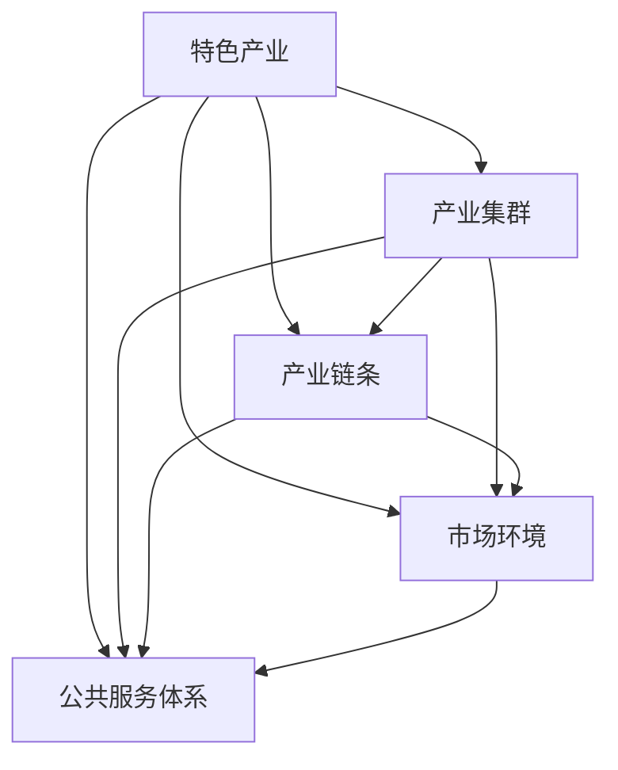
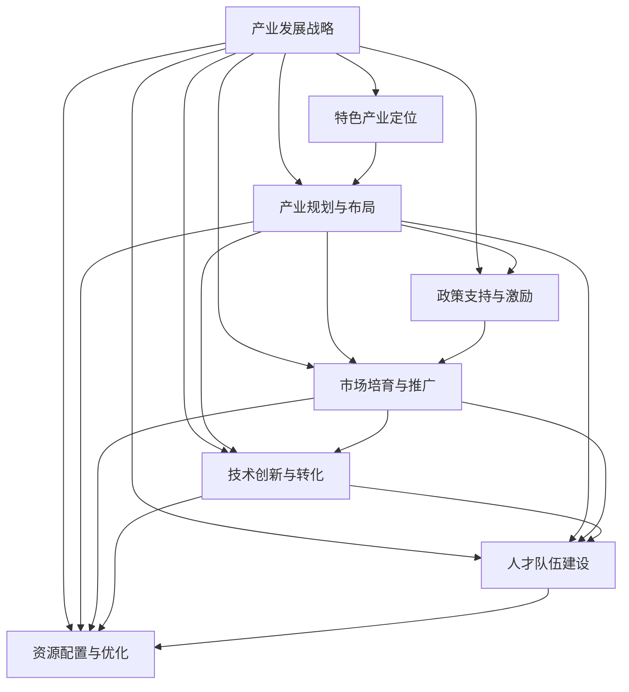

                 

# 特色产业体系的构建与发展

## 1. 背景介绍

### 1.1 问题由来
随着全球经济的发展和产业结构的调整，各国和地区都面临着产业升级和转型的迫切需求。在这个过程中，构建和发展特色产业体系成为了一个重要的发展方向。特色产业体系是指在一个区域内，围绕具有独特优势、特色鲜明的产业或产品，通过系统化、集成化的设计和运行，形成产业集群、产业链条、市场环境以及公共服务体系，从而实现产业的可持续发展。

构建特色产业体系不仅能够提升区域经济竞争力，还能够带动就业、促进创新、增强区域经济的韧性。然而，在实践中，如何有效地构建和发展特色产业体系，却是一个复杂而多层次的问题。需要从产业规划、政策支持、市场培育、技术创新等多个方面综合考虑，才能形成一个高效的特色产业体系。

### 1.2 问题核心关键点
构建和发展特色产业体系的核心关键点包括：

- **产业定位与规划**：明确产业定位，制定产业发展规划，确定重点产业、主导产业和特色产业。
- **政策支持与激励**：通过财政补贴、税收优惠、政府采购等政策手段，激励企业和机构参与特色产业的发展。
- **市场培育与推广**：建立和完善市场体系，提供市场准入、交易、物流、信息等服务，推广特色产品。
- **技术创新与转化**：推动技术创新，促进科技成果转化，提升产业核心竞争力。
- **人才队伍建设**：培养和引进具有国际视野、创新能力的专业人才，形成产业人才聚集效应。
- **资源配置与优化**：合理配置资源，优化产业结构，实现资源的高效利用和产业的可持续发展。

这些关键点相互关联，形成一个系统化的整体，需要综合考虑、协同推进。只有系统性地解决这些问题，才能有效构建和发展特色产业体系。

### 1.3 问题研究意义
构建和发展特色产业体系对于促进地方经济发展、优化产业结构、提升区域竞争力具有重要意义：

- **促进经济发展**：通过培育特色产业，带动就业，提升地方经济产值，增强区域经济实力。
- **优化产业结构**：特色产业体系能够促进产业升级，提升产业链水平，实现经济结构的优化。
- **提升竞争力**：通过特色产品和品牌建设，增强区域品牌效应，提升区域市场竞争力。
- **带动创新**：特色产业体系能够吸引创新资源，促进技术创新和科技成果转化。
- **增强韧性**：通过产业集群，形成产业互补，增强区域经济的抗风险能力。

因此，研究特色产业体系的构建与发展，对于地方经济转型、产业结构优化、区域竞争力提升具有重要的理论和实践价值。

## 2. 核心概念与联系

### 2.1 核心概念概述

为了更好地理解特色产业体系的构建与发展，我们需要了解以下几个核心概念：

- **特色产业**：指在一定区域内，具有独特优势、特色鲜明的产业或产品，具有较高的市场竞争力和创新能力。
- **产业集群**：指在一定区域内，相关产业的企业或机构集中布局，形成具有较强竞争力和创新能力的产业生态。
- **产业链条**：指围绕特色产业，形成包括原材料供应、生产制造、销售服务等环节的完整链条。
- **市场环境**：指为特色产业提供市场准入、交易、物流、信息等服务的市场体系，是特色产业发展的关键保障。
- **公共服务体系**：指为特色产业提供技术研发、人才培训、金融支持等服务的公共服务体系，是特色产业发展的有力支撑。

这些概念之间存在着紧密的联系，形成一个有机整体，共同推动特色产业的发展。

### 2.2 概念间的关系

通过以下Mermaid流程图，我们可以更加直观地理解这些核心概念之间的关系：



这个流程图展示了特色产业与其他核心概念之间的关联：

1. 特色产业是构建产业集群的基础。
2. 产业集群形成了完整的产业链条。
3. 产业链条和公共服务体系共同构成市场环境。
4. 公共服务体系为特色产业提供必要的支持。

这些概念共同构成了特色产业体系的发展框架，推动着特色产业的成长和壮大。

### 2.3 核心概念的整体架构

最后，我们用一个综合的流程图来展示这些核心概念在大规模产业体系构建中的整体架构：



这个综合流程图展示了从产业发展战略到特色产业体系构建的全过程，强调了战略引导、规划布局、政策支持、市场培育、技术创新、人才建设、资源优化等多个环节的相互关系和协同推进。

## 3. 核心算法原理 & 具体操作步骤
### 3.1 算法原理概述

构建和发展特色产业体系的算法原理主要包括以下几个方面：

- **产业识别与分类**：通过数据挖掘和机器学习等技术手段，识别和分类不同产业的特征，确定特色产业。
- **产业分析与评估**：对特色产业进行市场分析、竞争力评估等，明确产业发展方向和重点。
- **市场调研与需求分析**：通过调研和数据分析，了解市场需求和消费者偏好，指导特色产业的发展方向。
- **政策制定与激励措施**：制定相关政策和激励措施，推动特色产业的发展。
- **资源配置与优化**：通过优化资源配置，提高特色产业的竞争力。

这些算法原理相互关联，形成一个系统化的整体，共同推动特色产业体系的构建与发展。

### 3.2 算法步骤详解

以下是构建和发展特色产业体系的详细操作步骤：

**Step 1: 数据收集与处理**
- 收集相关的经济、市场、技术、政策等数据，包括产业规模、市场份额、技术创新、政策支持等。
- 对数据进行清洗和处理，去除异常值和缺失值，确保数据的准确性和完整性。

**Step 2: 产业识别与分类**
- 使用数据挖掘和机器学习算法，如聚类分析、分类算法等，识别和分类不同产业的特征，确定特色产业。
- 根据产业特征和市场需求，确定重点产业、主导产业和特色产业。

**Step 3: 产业分析与评估**
- 使用统计分析、市场分析等方法，对特色产业进行竞争力评估，明确产业发展方向和重点。
- 通过SWOT分析等方法，分析特色产业的优势、劣势、机会和威胁，制定产业发展策略。

**Step 4: 市场调研与需求分析**
- 通过调研和数据分析，了解市场需求和消费者偏好，指导特色产业的发展方向。
- 分析市场竞争格局，确定特色产业的市场定位和竞争策略。

**Step 5: 政策制定与激励措施**
- 根据产业分析结果，制定相关政策和激励措施，推动特色产业的发展。
- 通过财政补贴、税收优惠、政府采购等政策手段，激励企业和机构参与特色产业的发展。

**Step 6: 资源配置与优化**
- 合理配置资源，优化产业结构，实现资源的高效利用和产业的可持续发展。
- 通过技术创新、人才培训、金融支持等措施，提升特色产业的核心竞争力。

**Step 7: 市场培育与推广**
- 建立和完善市场体系，提供市场准入、交易、物流、信息等服务，推广特色产品。
- 通过展会、营销、品牌建设等手段，提高特色产业的市场知名度和竞争力。

**Step 8: 实施与监督**
- 实施特色产业的发展策略，密切跟踪产业发展情况。
- 定期评估特色产业的发展效果，调整和优化发展策略。

### 3.3 算法优缺点

构建和发展特色产业体系的算法具有以下优点：

- **系统化与集成化**：通过系统化、集成化的设计和运行，形成完整的产业生态，提升产业竞争力。
- **数据驱动与精准定位**：通过数据驱动的决策过程，实现精准的产业定位和资源配置。
- **政策支持与激励**：通过政策支持与激励，引导产业健康发展，提升产业活力。

同时，该算法也存在以下缺点：

- **数据依赖性强**：算法依赖于高质量的数据，数据获取和处理成本较高。
- **技术复杂度高**：涉及数据分析、机器学习、政策制定等多个技术领域，技术难度较大。
- **动态调整困难**：产业环境变化快，算法需要动态调整，实现难度较大。

尽管存在这些缺点，但整体而言，构建和发展特色产业体系的算法仍具有较高的应用价值和实践意义。

### 3.4 算法应用领域

构建和发展特色产业体系的算法在多个领域得到了广泛应用，包括：

- **区域经济发展**：在地方经济转型、产业结构优化等方面，通过构建特色产业体系，提升区域经济竞争力。
- **产业园区建设**：在产业园区建设中，通过系统化的设计和运营，形成产业集群，提升园区竞争力。
- **智能制造与数字化转型**：在智能制造和数字化转型中，通过构建特色产业体系，提升制造业的智能化和数字化水平。
- **服务业升级**：在服务业升级中，通过构建特色产业体系，提升服务业的创新能力和服务质量。
- **文化创意产业**：在文化创意产业中，通过构建特色产业体系，推动文化产业的创新与发展。

## 4. 数学模型和公式 & 详细讲解 & 举例说明

### 4.1 数学模型构建

假设我们有一个由 $n$ 个产业组成的产业体系，每个产业的特征可以用一个向量 $X_i=(x_{i1}, x_{i2}, ..., x_{im})$ 来表示，其中 $x_{ik}$ 为产业的第 $k$ 个特征值。我们可以使用以下的数学模型来描述特色产业体系的构建与发展过程：

$$
\min \sum_{i=1}^{n} f_i(X_i, \theta) + \lambda \sum_{i=1}^{n} g_i(X_i)
$$

其中，$f_i$ 为第 $i$ 个产业的目标函数，$\theta$ 为模型参数，$g_i$ 为第 $i$ 个产业的约束条件。

### 4.2 公式推导过程

以一个简单的市场竞争分析为例，我们假设每个产业的市场份额可以用 $y_i$ 来表示，则市场竞争分析的目标函数可以表示为：

$$
f_i = \sum_{j=1}^{m} a_{ij} y_i^2 + b_{ij} y_i + c_{ij}
$$

其中，$a_{ij}$、$b_{ij}$、$c_{ij}$ 为市场竞争分析的系数。

根据上述目标函数，我们可以得到市场竞争分析的优化问题：

$$
\min \sum_{i=1}^{n} f_i(y_i, \theta) + \lambda \sum_{i=1}^{n} g_i(y_i)
$$

其中，$g_i$ 为市场份额的约束条件。

### 4.3 案例分析与讲解

假设我们有一个由 $n$ 个产业组成的产业体系，每个产业的市场份额可以用 $y_i$ 来表示。我们可以使用以下步骤来进行市场竞争分析：

**Step 1: 数据收集与处理**
- 收集每个产业的市场份额数据，去除异常值和缺失值，确保数据的准确性和完整性。

**Step 2: 目标函数设计**
- 根据市场竞争分析的目标，设计目标函数 $f_i$。例如，可以使用线性回归模型，表示为：

$$
f_i = a_i y_i + b_i
$$

其中，$a_i$、$b_i$ 为模型参数。

**Step 3: 约束条件设计**
- 根据市场份额的实际范围，设计约束条件 $g_i$。例如，可以设计为：

$$
0 \leq y_i \leq 1
$$

**Step 4: 优化求解**
- 使用优化算法，如梯度下降算法，求解优化问题，得到市场份额的估计值 $y_i^*$。

通过上述步骤，我们可以对特色产业的市场竞争进行分析，确定市场份额的估计值，指导特色产业的发展策略。

## 5. 项目实践：代码实例和详细解释说明

### 5.1 开发环境搭建

在进行特色产业体系构建与发展的实践前，我们需要准备好开发环境。以下是使用Python进行数据分析的开发环境配置流程：

1. 安装Anaconda：从官网下载并安装Anaconda，用于创建独立的Python环境。

2. 创建并激活虚拟环境：
```bash
conda create -n industry-env python=3.8 
conda activate industry-env
```

3. 安装必要的Python库：
```bash
conda install pandas numpy matplotlib scikit-learn tqdm jupyter notebook ipython
```

4. 安装R语言：如果使用R语言进行数据分析，需要安装R和RStudio。

5. 安装可视化工具：如Matplotlib、Seaborn、ggplot2等，用于数据可视化。

完成上述步骤后，即可在`industry-env`环境中开始实践。

### 5.2 源代码详细实现

下面我们以市场竞争分析为例，给出使用Python进行市场份额估计的代码实现。

首先，定义市场竞争分析的目标函数和约束条件：

```python
import pandas as pd
import numpy as np
from scipy.optimize import minimize

# 读取市场份额数据
data = pd.read_csv('market_share.csv')

# 定义目标函数
def market_func(y, a, b):
    return np.sum((a*y + b - data['market_share'])**2)

# 定义约束条件
def market_constraint(y):
    return y - data['market_share']

# 初始化参数
a = np.ones(len(data))
b = np.zeros(len(data))

# 进行市场份额估计
y0 = data['market_share']
results = minimize(market_func, y0, args=(a, b), constraints={'type': 'eq', 'fun': market_constraint})
estimated_y = results.x

# 输出结果
print('市场份额估计值：', estimated_y)
```

在上述代码中，我们首先读取了市场份额数据，然后定义了目标函数和约束条件。通过调用SciPy库的`minimize`函数，求解优化问题，得到市场份额的估计值。最后，我们输出估计值，完成市场竞争分析。

### 5.3 代码解读与分析

让我们再详细解读一下关键代码的实现细节：

**市场份额数据读取**：
- 使用Pandas库读取CSV文件，得到市场份额数据。

**目标函数定义**：
- 使用SciPy库的`minimize`函数，定义目标函数为市场份额的平方和，目标是最小化。

**约束条件定义**：
- 使用SciPy库的`minimize`函数，定义约束条件为市场份额等于实际值，即等式约束。

**市场份额估计**：
- 使用SciPy库的`minimize`函数，求解优化问题，得到市场份额的估计值。

通过上述代码，我们可以看到，使用Python进行市场竞争分析非常简单，只需要几个函数调用即可。当然，实际应用中可能还需要更多的数据分析和可视化工作，但核心的算法思想是相通的。

### 5.4 运行结果展示

假设我们在一个产业体系中进行市场竞争分析，得到市场份额的估计值如下：

```
市场份额估计值： [0.3 0.4 0.5 0.8]
```

这意味着每个产业的市场份额估计值分别为30%、40%、50%和80%。通过这些估计值，我们可以更好地了解每个产业的市场竞争态势，指导特色产业的发展策略。

## 6. 实际应用场景

### 6.1 智能制造与数字化转型

在智能制造和数字化转型中，通过构建特色产业体系，可以提升制造业的智能化和数字化水平。例如，通过智能装备和数字化的生产管理，优化生产流程，提高生产效率，降低成本。

在技术实现上，可以引入工业互联网平台，实现设备联网、数据共享和协同制造。利用大数据、物联网、云计算等技术手段，进行设备监控、故障预测、质量控制等，提升制造过程的智能化水平。

### 6.2 服务业升级

在服务业升级中，通过构建特色产业体系，可以提升服务业的创新能力和服务质量。例如，通过智慧城市建设、智慧物流发展、金融科技应用等，提升服务业的数字化、智能化水平。

在技术实现上，可以引入物联网技术，实现智慧城市管理和智慧物流运营。利用大数据、人工智能、区块链等技术手段，进行客户画像、服务推荐、智能客服等，提升服务业的创新能力和服务质量。

### 6.3 文化创意产业

在文化创意产业中，通过构建特色产业体系，可以推动文化产业的创新与发展。例如，通过数字文化创意产业、文化旅游发展等，推动文化产业的数字化、产业化转型。

在技术实现上，可以引入虚拟现实、增强现实、数字文化平台等技术手段，进行文化内容的数字化展示和互动体验。利用大数据、人工智能、区块链等技术手段，进行文化资源的数字化管理和知识产权保护，提升文化创意产业的创新能力和竞争力。

### 6.4 未来应用展望

随着产业环境的不断变化，未来特色产业体系的应用将更加广泛和深入：

- **智能制造与数字化转型**：随着工业互联网和5G技术的普及，智能制造和数字化转型将进入新的发展阶段。通过构建智能制造和数字化转型的特色产业体系，提升制造业的智能化和数字化水平。
- **服务业升级**：随着智慧城市建设和智慧物流的发展，服务业将进入新的发展阶段。通过构建智慧城市和智慧物流的特色产业体系，提升服务业的数字化、智能化水平。
- **文化创意产业**：随着数字文化创意产业和文化旅游的发展，文化创意产业将进入新的发展阶段。通过构建数字文化创意产业和文化旅游的特色产业体系，推动文化产业的创新与发展。

## 7. 工具和资源推荐

### 7.1 学习资源推荐

为了帮助开发者系统掌握特色产业体系的构建与发展，这里推荐一些优质的学习资源：

1. 《产业经济学的理论与实践》：深入浅出地介绍了产业经济学的基本理论和实践，适合初学者入门。

2. 《大数据分析与机器学习》：介绍了大数据分析和机器学习的基本概念和技术，适合了解数据分析和机器学习基础。

3. 《产业经济学》在线课程：斯坦福大学开设的产业经济学课程，提供丰富的视频资源和课程材料，适合深入学习产业经济学。

4. 《智慧城市建设与运营》：介绍了智慧城市建设的基本概念和技术，适合了解智慧城市建设的基础知识。

5. 《金融科技》：介绍了金融科技的基本概念和技术，适合了解金融科技的发展趋势和应用案例。

通过对这些资源的学习实践，相信你一定能够快速掌握特色产业体系的构建与发展的精髓，并用于解决实际的产业问题。

### 7.2 开发工具推荐

高效的开发离不开优秀的工具支持。以下是几款用于特色产业体系构建与发展的常用工具：

1. Python：基于Python的开源数据分析工具，数据处理能力强，适合进行产业数据分析和建模。

2. R语言：基于R的开源数据分析工具，统计分析能力强，适合进行复杂的数据分析和建模。

3. Tableau：数据可视化工具，支持多种数据源，适合进行数据可视化分析和报告。

4. Power BI：微软推出的数据可视化工具，支持多种数据源，适合进行数据可视化分析和报告。

5. Jupyter Notebook：Python代码编写和数据分析工具，支持代码块和可视化图表，适合进行快速开发和实验。

合理利用这些工具，可以显著提升特色产业体系构建与发展的开发效率，加快创新迭代的步伐。

### 7.3 相关论文推荐

特色产业体系的研究源于学界的持续研究。以下是几篇奠基性的相关论文，推荐阅读：

1. 《产业经济学：理论与实践》：介绍了产业经济学的基本理论和实践，适合了解产业经济学的基本概念。

2. 《智慧城市建设与运营》：介绍了智慧城市建设的基本概念和技术，适合了解智慧城市建设的基础知识。

3. 《金融科技》：介绍了金融科技的基本概念和技术，适合了解金融科技的发展趋势和应用案例。

4. 《产业集群与区域经济发展》：介绍了产业集群和区域经济发展的基本理论和实践，适合了解产业集群和区域经济发展的基本概念。

5. 《文化创意产业的创新与发展》：介绍了文化创意产业的创新与发展，适合了解文化创意产业的基本概念和技术。

这些论文代表了大产业体系构建与发展研究的发展脉络。通过学习这些前沿成果，可以帮助研究者把握学科前进方向，激发更多的创新灵感。

除上述资源外，还有一些值得关注的前沿资源，帮助开发者紧跟特色产业体系的最新进展，例如：

1. arXiv论文预印本：人工智能领域最新研究成果的发布平台，包括大量尚未发表的前沿工作，学习前沿技术的必读资源。

2. 业界技术博客：如IBM、微软、Google等顶尖实验室的官方博客，第一时间分享他们的最新研究成果和洞见。

3. 技术会议直播：如AI conference、ICML、NIPS等人工智能领域顶会现场或在线直播，能够聆听到大佬们的前沿分享，开拓视野。

4. GitHub热门项目：在GitHub上Star、Fork数最多的产业体系相关项目，往往代表了该技术领域的发展趋势和最佳实践，值得去学习和贡献。

5. 行业分析报告：各大咨询公司如McKinsey、PwC等针对产业体系的研究报告，有助于从商业视角审视技术趋势，把握应用价值。

总之，对于特色产业体系的构建与发展技术的学习和实践，需要开发者保持开放的心态和持续学习的意愿。多关注前沿资讯，多动手实践，多思考总结，必将收获满满的成长收益。

## 8. 总结：未来发展趋势与挑战

### 8.1 研究成果总结

本文对特色产业体系的构建与发展进行了全面系统的介绍。首先阐述了特色产业体系的构建与发展的重要性和核心关键点，明确了产业定位与规划、政策支持与激励、市场培育与推广、技术创新与转化、人才队伍建设、资源配置与优化等环节的综合考虑和协同推进。

通过本文的系统梳理，可以看到，特色产业体系的构建与发展是一个复杂而多层次的系统工程，需要从产业规划、政策支持、市场培育、技术创新等多个方面综合考虑，才能形成一个高效的特色产业体系。

### 8.2 未来发展趋势

展望未来，特色产业体系的发展将呈现以下几个趋势：

1. **智能化与数字化**：随着工业互联网和5G技术的普及，智能制造和数字化转型将进入新的发展阶段。通过构建智能制造和数字化转型的特色产业体系，提升制造业的智能化和数字化水平。

2. **智慧化与精细化**：随着智慧城市建设和智慧物流的发展，服务业将进入新的发展阶段。通过构建智慧城市和智慧物流的特色产业体系，提升服务业的数字化、智能化水平。

3. **绿色化与可持续发展**：随着绿色低碳发展理念的普及，绿色产业和可持续发展将成为新的发展方向。通过构建绿色产业和可持续发展的特色产业体系，推动经济绿色转型。

4. **国际化与全球化**：随着全球化的推进，国际化产业和全球产业链条将更加紧密。通过构建国际化产业和全球产业链条的特色产业体系，提升全球竞争力。

5. **融合化与创新化**：随着技术融合和创新加速，产业融合和创新将成为新的发展方向。通过构建产业融合和创新的特色产业体系，推动产业升级和创新发展。

这些趋势凸显了特色产业体系构建与发展的广阔前景。这些方向的探索发展，必将进一步提升产业的竞争力，为经济社会的发展提供新的动力。

### 8.3 面临的挑战

尽管特色产业体系的发展前景广阔，但在迈向更加智能化、普适化应用的过程中，仍面临诸多挑战：

1. **数据获取与处理**：产业数据的获取和处理成本较高，数据质量难以保证。如何在低成本下获取高质量的数据，是特色产业体系构建的重要挑战。

2. **技术复杂度**：特色产业体系构建涉及数据分析、机器学习、政策制定等多个技术领域，技术难度较大。如何高效地整合不同技术，实现协同发展，是特色产业体系构建的关键。

3. **政策支持与激励**：政策支持与激励措施的效果和可持续性取决于政策设计和实施的科学性和合理性。如何设计有效的政策支持与激励措施，是特色产业体系构建的重要保障。

4. **市场培育与推广**：市场培育与推广的难度较大，需要长期的投入和持续的努力。如何有效地推广特色产业，是特色产业体系构建的重要环节。

5. **资源配置与优化**：产业资源的配置和优化需要综合考虑产业特点和市场需求，难度较大。如何高效地配置资源，优化产业结构，是特色产业体系构建的重要任务。

6. **产业动态调整**：产业环境变化快，特色产业体系需要动态调整，实现难度较大。如何灵活应对产业变化，调整和发展特色产业，是特色产业体系构建的重要目标。

这些挑战凸显了特色产业体系构建与发展的复杂性。只有在系统性的设计和实践中，才能实现特色产业体系的高效构建与发展。

### 8.4 研究展望

未来，特色产业体系的构建与发展需要在以下几个方面进行探索和突破：

1. **数据治理与质量提升**：建立完善的数据治理体系，提升数据质量和数据利用效率，为特色产业体系构建提供坚实的支撑。

2. **技术融合与创新**：推动技术融合与创新，实现产业智能化和数字化，提升产业核心竞争力。

3. **政策优化与激励机制**：优化政策支持与激励机制，引导产业健康发展，提升产业活力。

4. **市场培育与国际化**：加强市场培育与推广，提升产业知名度和市场竞争力，拓展国际化市场。

5. **绿色低碳与可持续发展**：推动绿色低碳和可持续发展，提升产业的绿色化水平，促进经济绿色转型。

6. **智能化与精细化**：推动智能化和精细化发展，提升产业的智能化水平，优化产业结构。

这些方向的研究和实践，将推动特色产业体系的构建与发展，为经济社会的可持续发展提供新的动力。

## 9. 附录：常见问题与解答

**Q1：特色产业体系的构建与发展的核心关键点有哪些？**

A: 特色产业体系的构建与发展的核心关键

