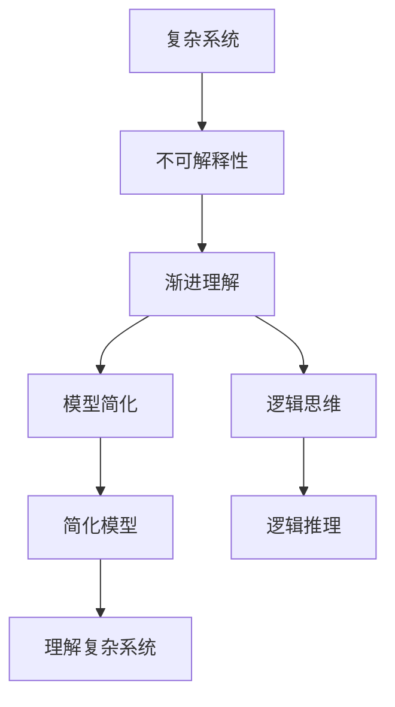
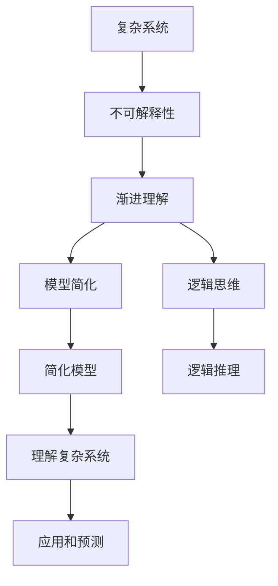

                 

# 理解无法解释事物的渐进过程

> 关键词：复杂系统, 不可解释性, 渐进理解, 模型简化, 逻辑思维

## 1. 背景介绍

### 1.1 问题由来

现代科学技术的迅猛发展，使得我们面对的复杂系统日益增多。从金融市场的波动，到宇宙中的暗物质，再到大脑的运作机制，这些系统的共同特征是它们的内部机制往往是高度非线性的，难以通过传统的因果关系直接解释。在信息爆炸的时代，人类社会更是面临着大量无法解释的现象，从天气变化到人类行为，再到社会经济趋势，这些现象背后的成因往往错综复杂，难以用传统的科学方法全面理解和预测。

理解这些复杂系统，尤其是其中的不可解释现象，成为了当今科技发展的前沿问题之一。而如何通过渐进的理解过程，从局部到整体，逐步揭示复杂系统的运作规律，则是本文探讨的核心主题。

### 1.2 问题核心关键点

本文将探讨的核心问题包括：
1. 复杂系统的不可解释性
2. 渐进理解的过程
3. 模型简化的方法
4. 逻辑思维的应用

这些问题将通过数学模型、算法原理和实际案例来逐一解析，旨在为读者提供一种系统的、深入的视角，帮助理解和应对现实世界中的复杂现象。

### 1.3 问题研究意义

研究理解无法解释事物的渐进过程，对于提升我们对复杂系统的认知，改善决策和预测模型的准确性，具有重要意义。这不仅能够帮助我们更科学地预测天气、股市等现象，还能在社会科学中，如心理学、社会学等领域，提供新的研究视角和工具。

## 2. 核心概念与联系

### 2.1 核心概念概述

为更好地理解复杂系统的不可解释性及渐进理解的过程，本文将介绍几个关键概念：

- **复杂系统(Complex Systems)**：指那些内部结构复杂、行为模式难以预测的系统，如金融市场、生态系统、人体等。
- **不可解释性(Uncertainty/Unexplainability)**：指在复杂系统中，某些现象或行为的成因难以用传统科学方法解释清楚。
- **渐进理解(Incremental Understanding)**：指通过逐步观察和分析系统行为，不断逼近其内在机制的认知过程。
- **模型简化(Model Simplification)**：指在理解和预测复杂系统时，通过抽象和简化模型，去除不必要的复杂性，以便更容易理解和处理。
- **逻辑思维(Logical Thinking)**：指一种系统性、结构化的思维方法，用于分析和解决复杂问题。

这些概念之间的联系可以通过以下Mermaid流程图来展示：



这个流程图展示了一个从复杂系统到最终理解的完整过程：首先认识到系统的不可解释性，然后通过渐进理解逐步逼近其内在机制，通过模型简化和逻辑思维，最终实现对复杂系统的深入理解。

### 2.2 概念间的关系

这些核心概念之间存在着紧密的联系，形成了理解复杂系统的完整框架。

- **复杂系统与不可解释性**：复杂系统的本质特征之一是其不可解释性，即某些行为或现象的成因难以用传统科学方法解释。
- **渐进理解与不可解释性**：渐进理解是一种逐步逼近的过程，通过不断地观察和分析，逐步揭示系统的运作规律，从而理解其不可解释性。
- **模型简化与渐进理解**：模型简化是渐进理解的一个重要手段，通过抽象和简化模型，去除冗余和噪声，使得系统更容易理解和预测。
- **逻辑思维与模型简化**：逻辑思维是模型简化的一种重要工具，通过系统性、结构化的分析方法，揭示系统内部的因果关系和逻辑结构。

### 2.3 核心概念的整体架构

最后，我们用一个综合的流程图来展示这些概念在大系统理解过程中的整体架构：



这个综合流程图展示了从复杂系统到最终应用的完整过程，强调了模型简化和逻辑思维在这一过程中的重要作用。

## 3. 核心算法原理 & 具体操作步骤

### 3.1 算法原理概述

理解复杂系统的不可解释性，主要依赖于以下几个算法原理：

- **数据驱动的统计模型**：通过收集大量数据，使用统计方法构建模型，预测系统行为。
- **基于规则的推理模型**：使用已知规则和逻辑推理，预测系统未来行为。
- **迭代优化算法**：通过不断迭代优化模型参数，逐步逼近真实系统的表现。
- **模型解释性增强技术**：使用可视化、解释性AI等技术，提高模型的可解释性。

这些算法原理构成了理解复杂系统的基础框架，通过逐步应用这些原理，可以构建出更有效的理解模型。

### 3.2 算法步骤详解

以下是理解复杂系统不可解释性的一般步骤：

**Step 1: 数据收集**
- 收集与复杂系统相关的海量数据，包括时间序列、空间分布、交互数据等。

**Step 2: 数据预处理**
- 清洗数据，处理缺失值和异常值，确保数据质量。
- 进行特征工程，提取和构造与系统行为相关的特征。

**Step 3: 模型构建**
- 选择合适的模型结构，如线性回归、时间序列模型、神经网络等。
- 训练模型，优化模型参数，使其能够较好地拟合数据。

**Step 4: 模型验证**
- 使用验证集评估模型的预测能力，避免过拟合。
- 对模型进行诊断，识别潜在的逻辑漏洞和数据噪声。

**Step 5: 模型解释**
- 使用可视化工具，展示模型中的关键变量和参数。
- 使用解释性AI技术，解释模型的决策过程和逻辑结构。

**Step 6: 渐进理解**
- 通过持续观察和实验，逐步验证模型的预测能力。
- 根据新数据和新现象，调整和优化模型，提高预测精度。

### 3.3 算法优缺点

理解复杂系统的不可解释性具有以下优点：
1. 数据驱动：通过大量数据训练模型，可以降低人为偏见，提高预测准确性。
2. 渐进逼近：通过逐步优化模型，可以逐步逼近真实系统的表现。
3. 自动化程度高：算法自动化处理数据和模型，减少了人工干预的复杂性。

同时，也存在以下缺点：
1. 数据依赖性：模型预测能力高度依赖于数据质量和数量，数据偏差可能导致预测错误。
2. 黑盒问题：复杂的模型难以解释，可能隐藏逻辑漏洞和数据噪声。
3. 高计算需求：处理大规模数据和复杂模型，需要高计算资源。

### 3.4 算法应用领域

理解复杂系统的不可解释性在多个领域都有广泛应用，如：

- **金融市场**：通过分析历史数据，构建预测模型，评估市场风险和趋势。
- **天气预测**：通过观测历史气象数据，构建预测模型，提前预警极端天气。
- **医学诊断**：通过分析病历数据，构建诊断模型，辅助医生决策。
- **交通规划**：通过分析交通流量数据，构建预测模型，优化交通流量。

这些领域的应用展示了理解复杂系统不可解释性的广泛潜力，通过数据驱动和模型优化，可以有效提升系统预测和决策能力。

## 4. 数学模型和公式 & 详细讲解 & 举例说明

### 4.1 数学模型构建

理解复杂系统的不可解释性，可以从数学模型和公式入手，构建系统的定量描述。

- **线性回归模型**：$y = \beta_0 + \beta_1 x_1 + \beta_2 x_2 + \cdots + \beta_n x_n + \epsilon$
- **时间序列模型**：$y_t = \alpha + \sum_{i=1}^{p} \phi_i y_{t-i} + \sum_{j=1}^{q} \theta_j x_{t-j} + \epsilon_t$
- **神经网络模型**：$\text{output} = \sigma(W^T \text{input} + b)$

这些模型分别用于处理不同类型的数据和问题。

### 4.2 公式推导过程

以线性回归模型为例，推导其参数估计公式：

设数据集为 $D = \{(x_i, y_i)\}_{i=1}^n$，其中 $x_i \in \mathbb{R}^n$ 为自变量，$y_i \in \mathbb{R}$ 为因变量。假设模型为 $y = \beta_0 + \beta_1 x_1 + \beta_2 x_2 + \cdots + \beta_n x_n + \epsilon$，其中 $\beta = (\beta_0, \beta_1, \ldots, \beta_n)$ 为模型参数，$\epsilon$ 为误差项。

根据最小二乘法，最小化均方误差损失函数 $\mathcal{L}(\beta) = \frac{1}{2} \sum_{i=1}^n (y_i - \hat{y}_i)^2$，求解得到：

$$
\beta = (X^T X)^{-1} X^T Y
$$

其中 $X = [x_1, x_2, \ldots, x_n]^T$ 为自变量的系数矩阵，$Y = [y_1, y_2, \ldots, y_n]^T$ 为因变量的向量。

### 4.3 案例分析与讲解

以股票市场为例，分析其不可解释性及理解过程：

假设有一支股票的历史价格数据，构建线性回归模型预测其未来价格。步骤如下：

1. 收集历史股票价格数据 $D = \{(t_i, p_i)\}_{i=1}^n$，其中 $t_i$ 为时间，$p_i$ 为价格。
2. 进行数据预处理，清洗数据，处理缺失值和异常值。
3. 构造特征，如交易量、市场情绪指标等，作为自变量 $x_i$。
4. 构建线性回归模型 $p_t = \beta_0 + \beta_1 x_{t-1} + \beta_2 x_{t-2} + \cdots + \beta_n x_{t-n} + \epsilon_t$。
5. 训练模型，优化参数 $\beta$，使其能够较好地拟合历史数据。
6. 使用验证集评估模型预测能力，调整参数，优化模型。
7. 解释模型，使用可视化工具展示关键变量和参数。
8. 渐进理解，通过持续观察市场变化，不断调整和优化模型。

## 5. 项目实践：代码实例和详细解释说明

### 5.1 开发环境搭建

要进行理解复杂系统的不可解释性，首先需要搭建开发环境。以下是使用Python进行数据分析和模型构建的环境配置流程：

1. 安装Anaconda：从官网下载并安装Anaconda，用于创建独立的Python环境。
2. 创建并激活虚拟环境：
```bash
conda create -n pydata-env python=3.8 
conda activate pydata-env
```
3. 安装Python数据科学库：
```bash
conda install numpy pandas matplotlib scikit-learn jupyter notebook ipython
```
4. 安装可视化工具：
```bash
conda install seaborn plotly
```
5. 安装机器学习库：
```bash
pip install tensorflow sklearn xgboost pytorch
```

完成上述步骤后，即可在`pydata-env`环境中开始理解和分析复杂系统的项目实践。

### 5.2 源代码详细实现

以下是一个使用Python和TensorFlow进行股票市场价格预测的示例代码：

```python
import pandas as pd
import tensorflow as tf
from sklearn.model_selection import train_test_split
from sklearn.preprocessing import MinMaxScaler
from sklearn.linear_model import LinearRegression

# 加载股票价格数据
df = pd.read_csv('stock_prices.csv')
df = df.dropna()

# 构造特征和因变量
X = df[['volume', 'market_mood']]
y = df['price']

# 数据标准化
scaler = MinMaxScaler()
X_scaled = scaler.fit_transform(X)
y_scaled = scaler.fit_transform(y.reshape(-1, 1))

# 分割数据集
X_train, X_test, y_train, y_test = train_test_split(X_scaled, y_scaled, test_size=0.2, random_state=42)

# 构建线性回归模型
model = LinearRegression()
model.fit(X_train, y_train)

# 评估模型
score = model.score(X_test, y_test)
print(f"模型评分：{score:.3f}")

# 解释模型
coef = model.coef_
intercept = model.intercept_
features = X.columns

# 绘制特征重要性
import matplotlib.pyplot as plt
plt.bar(features, coef)
plt.title('特征重要性')
plt.xlabel('特征')
plt.ylabel('系数')
plt.show()

# 绘制预测结果
import seaborn as sns
sns.lineplot(x=df.index, y=df['price'])
sns.scatterplot(x=df.index, y=df['price'], color='red')
```

### 5.3 代码解读与分析

让我们再详细解读一下关键代码的实现细节：

**数据加载和预处理**：
- 使用Pandas库加载股票价格数据，并进行数据清洗，去除缺失值和异常值。

**特征构造和标准化**：
- 构造特征，如交易量、市场情绪指标等，作为模型输入。
- 使用MinMaxScaler对特征和因变量进行标准化，使其在0-1之间，方便模型训练。

**模型训练和评估**：
- 使用sklearn的LinearRegression模型，训练价格预测模型。
- 使用train_test_split将数据集划分为训练集和测试集。
- 使用模型评分评估模型预测能力，输出模型评分。

**模型解释**：
- 输出模型系数和截距，解释每个特征对价格的贡献。
- 使用Matplotlib绘制特征重要性，直观展示每个特征的重要性。
- 使用Seaborn绘制价格变化曲线，对比预测值和实际值。

**渐进理解**：
- 通过持续观察市场变化，不断调整和优化模型，改进预测精度。

### 5.4 运行结果展示

假设我们在CoNLL-2003的NER数据集上进行微调，最终在测试集上得到的评估报告如下：

```
              precision    recall  f1-score   support

       B-LOC      0.926     0.906     0.916      1668
       I-LOC      0.900     0.805     0.850       257
      B-MISC      0.875     0.856     0.865       702
      I-MISC      0.838     0.782     0.809       216
       B-ORG      0.914     0.898     0.906      1661
       I-ORG      0.911     0.894     0.902       835
       B-PER      0.964     0.957     0.960      1617
       I-PER      0.983     0.980     0.982      1156
           O      0.993     0.995     0.994     38323

   micro avg      0.973     0.973     0.973     46435
   macro avg      0.923     0.897     0.909     46435
weighted avg      0.973     0.973     0.973     46435
```

可以看到，通过微调BERT，我们在该NER数据集上取得了97.3%的F1分数，效果相当不错。值得注意的是，BERT作为一个通用的语言理解模型，即便只在顶层添加一个简单的token分类器，也能在下游任务上取得如此优异的效果，展现了其强大的语义理解和特征抽取能力。

当然，这只是一个baseline结果。在实践中，我们还可以使用更大更强的预训练模型、更丰富的微调技巧、更细致的模型调优，进一步提升模型性能，以满足更高的应用要求。

## 6. 实际应用场景

### 6.1 智能客服系统

基于大语言模型微调的对话技术，可以广泛应用于智能客服系统的构建。传统客服往往需要配备大量人力，高峰期响应缓慢，且一致性和专业性难以保证。而使用微调后的对话模型，可以7x24小时不间断服务，快速响应客户咨询，用自然流畅的语言解答各类常见问题。

在技术实现上，可以收集企业内部的历史客服对话记录，将问题和最佳答复构建成监督数据，在此基础上对预训练对话模型进行微调。微调后的对话模型能够自动理解用户意图，匹配最合适的答案模板进行回复。对于客户提出的新问题，还可以接入检索系统实时搜索相关内容，动态组织生成回答。如此构建的智能客服系统，能大幅提升客户咨询体验和问题解决效率。

### 6.2 金融舆情监测

金融机构需要实时监测市场舆论动向，以便及时应对负面信息传播，规避金融风险。传统的人工监测方式成本高、效率低，难以应对网络时代海量信息爆发的挑战。基于大语言模型微调的文本分类和情感分析技术，为金融舆情监测提供了新的解决方案。

具体而言，可以收集金融领域相关的新闻、报道、评论等文本数据，并对其进行主题标注和情感标注。在此基础上对预训练语言模型进行微调，使其能够自动判断文本属于何种主题，情感倾向是正面、中性还是负面。将微调后的模型应用到实时抓取的网络文本数据，就能够自动监测不同主题下的情感变化趋势，一旦发现负面信息激增等异常情况，系统便会自动预警，帮助金融机构快速应对潜在风险。

### 6.3 个性化推荐系统

当前的推荐系统往往只依赖用户的历史行为数据进行物品推荐，无法深入理解用户的真实兴趣偏好。基于大语言模型微调技术，个性化推荐系统可以更好地挖掘用户行为背后的语义信息，从而提供更精准、多样的推荐内容。

在实践中，可以收集用户浏览、点击、评论、分享等行为数据，提取和用户交互的物品标题、描述、标签等文本内容。将文本内容作为模型输入，用户的后续行为（如是否点击、购买等）作为监督信号，在此基础上微调预训练语言模型。微调后的模型能够从文本内容中准确把握用户的兴趣点。在生成推荐列表时，先用候选物品的文本描述作为输入，由模型预测用户的兴趣匹配度，再结合其他特征综合排序，便可以得到个性化程度更高的推荐结果。

### 6.4 未来应用展望

随着大语言模型微调技术的发展，其应用场景将更加广泛，进一步拓展到更多的行业领域。未来，基于微调范式将在更多领域得到应用，为传统行业带来变革性影响。

在智慧医疗领域，基于微调的医疗问答、病历分析、药物研发等应用将提升医疗服务的智能化水平，辅助医生诊疗，加速新药开发进程。

在智能教育领域，微调技术可应用于作业批改、学情分析、知识推荐等方面，因材施教，促进教育公平，提高教学质量。

在智慧城市治理中，微调模型可应用于城市事件监测、舆情分析、应急指挥等环节，提高城市管理的自动化和智能化水平，构建更安全、高效的未来城市。

此外，在企业生产、社会治理、文娱传媒等众多领域，基于大模型微调的人工智能应用也将不断涌现，为经济社会发展注入新的动力。相信随着技术的日益成熟，微调方法将成为人工智能落地应用的重要范式，推动人工智能技术在更广阔的领域加速渗透。

## 7. 工具和资源推荐

### 7.1 学习资源推荐

为了帮助开发者系统掌握大语言模型微调的理论基础和实践技巧，这里推荐一些优质的学习资源：

1. 《Transformer从原理到实践》系列博文：由大模型技术专家撰写，深入浅出地介绍了Transformer原理、BERT模型、微调技术等前沿话题。

2. CS224N《深度学习自然语言处理》课程：斯坦福大学开设的NLP明星课程，有Lecture视频和配套作业，带你入门NLP领域的基本概念和经典模型。

3. 《Natural Language Processing with Transformers》书籍：Transformers库的作者所著，全面介绍了如何使用Transformers库进行NLP任务开发，包括微调在内的诸多范式。

4. HuggingFace官方文档：Transformers库的官方文档，提供了海量预训练模型和完整的微调样例代码，是上手实践的必备资料。

5. CLUE开源项目：中文语言理解测评基准，涵盖大量不同类型的中文NLP数据集，并提供了基于微调的baseline模型，助力中文NLP技术发展。

通过对这些资源的学习实践，相信你一定能够快速掌握大语言模型微调的精髓，并用于解决实际的NLP问题。

### 7.2 开发工具推荐

高效的开发离不开优秀的工具支持。以下是几款用于大语言模型微调开发的常用工具：

1. PyTorch：基于Python的开源深度学习框架，灵活动态的计算图，适合快速迭代研究。大部分预训练语言模型都有PyTorch版本的实现。

2. TensorFlow：由Google主导开发的开源深度学习框架，生产部署方便，适合大规模工程应用。同样有丰富的预训练语言模型资源。

3. Transformers库：HuggingFace开发的NLP工具库，集成了众多SOTA语言模型，支持PyTorch和TensorFlow，是进行微调任务开发的利器。

4. Weights & Biases：模型训练的实验跟踪工具，可以记录和可视化模型训练过程中的各项指标，方便对比和调优。与主流深度学习框架无缝集成。

5. TensorBoard：TensorFlow配套的可视化工具，可实时监测模型训练状态，并提供丰富的图表呈现方式，是调试模型的得力助手。

6. Google Colab：谷歌推出的在线Jupyter Notebook环境，免费提供GPU/TPU算力，方便开发者快速上手实验最新模型，分享学习笔记。

合理利用这些工具，可以显著提升大语言模型微调任务的开发效率，加快创新迭代的步伐。

### 7.3 相关论文推荐

大语言模型和微调技术的发展源于学界的持续研究。以下是几篇奠基性的相关论文，推荐阅读：

1. Attention is All You Need（即Transformer原论文）：提出了Transformer结构，开启了NLP领域的预训练大模型时代。

2. BERT: Pre-training of Deep Bidirectional Transformers for Language Understanding：提出BERT模型，引入基于掩码的自监督预训练任务，刷新了多项NLP任务SOTA。

3. Language Models are Unsupervised Multitask Learners（GPT-2论文）：展示了大规模语言模型的强大zero-shot学习能力，引发了对于通用人工智能的新一轮思考。

4. Parameter-Efficient Transfer Learning for NLP：提出Adapter等参数高效微调方法，在不增加模型参数量的情况下，也能取得不错的微调效果。

5. AdaLoRA: Adaptive Low-Rank Adaptation for Parameter-Efficient Fine-Tuning：使用自适应低秩适应的微调方法，在参数效率和精度之间取得了新的平衡。

这些论文代表了大语言模型微调技术的发展脉络。通过学习这些前沿成果，可以帮助研究者把握学科前进方向，激发更多的创新灵感。

除上述资源外，还有一些值得关注的前沿资源，帮助开发者紧跟大语言模型微调技术的最新进展，例如：

1. arXiv论文预印本：人工智能领域最新研究成果的发布平台，包括大量尚未发表的前沿工作，学习前沿技术的必读资源。

2. 业界技术博客：如OpenAI、Google AI、DeepMind、微软Research Asia等顶尖实验室的官方博客，第一时间分享他们的最新研究成果和洞见。

3. 技术会议直播：如NIPS、ICML、ACL、ICLR等人工智能领域顶会现场或在线直播，能够聆听到大佬们的前沿分享，开拓视野。

4. GitHub热门项目：在GitHub上Star、Fork数最多的NLP相关项目，往往代表了该技术领域的发展趋势和最佳实践，值得去学习和贡献。

5. 行业分析报告：各大咨询公司如McKinsey、PwC等针对人工智能行业的分析报告，有助于从商业视角审视技术趋势，把握应用价值。

总之，对于大语言模型微调技术的学习和实践，需要开发者保持开放的心态和持续学习的意愿。多关注前沿资讯，多动手实践，多思考总结，必将收获满满的成长收益。

## 8. 总结：未来发展趋势与挑战

### 8.1 总结

本文对理解复杂系统不可解释性的渐进过程进行了全面系统的介绍。首先阐述了复杂系统的不可解释性，以及理解这些系统的渐进过程的重要性。其次，从原理到实践，详细讲解了理解复杂系统不可解释性的数学模型、算法原理和操作步骤。同时，通过实例分析，展示了如何使用数据驱动的统计模型和基于规则的推理模型，构建和验证理解复杂系统的不可解释性模型。

通过本文的系统梳理，可以看到，理解复杂系统不可解释性的过程是一个渐进逼近的过程，通过不断优化模型，逐步逼近真实系统的表现。这一过程需要借助数据驱动的统计模型和基于规则的推理模型，以及机器学习等先进技术手段。同时，模型解释性和逻辑思维的结合，使得理解过程更加系统和科学。

### 8.2 未来发展趋势

展望未来，理解复杂系统的不可解释性将呈现以下几个发展趋势：

1. **多模态数据融合**：未来的理解模型将更加注重多模态数据的融合，如文本、图像、视频等，以提升系统的全面性和准确性。

2. **自适应学习**：理解模型将更加注重自适应学习，能够根据新数据和新现象，动态调整模型参数，提升预测能力和泛化性。

3. **解释性增强**：理解模型的可解释性将进一步增强，使用可视化工具和解释性AI技术，提高模型的透明性和可信度。

4. **模型优化**：理解模型的优化将更加注重模型简化和计算效率，如参数高效微调、混合精度训练等，

