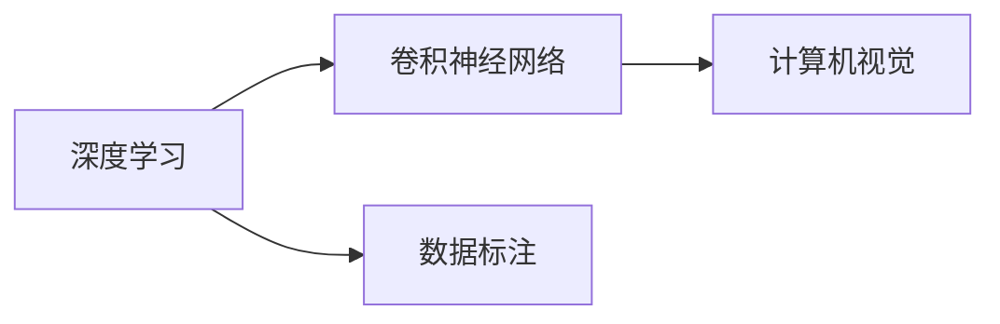
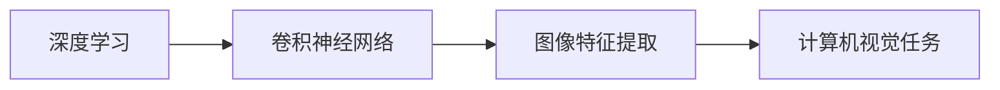
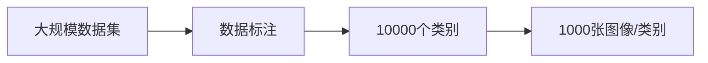
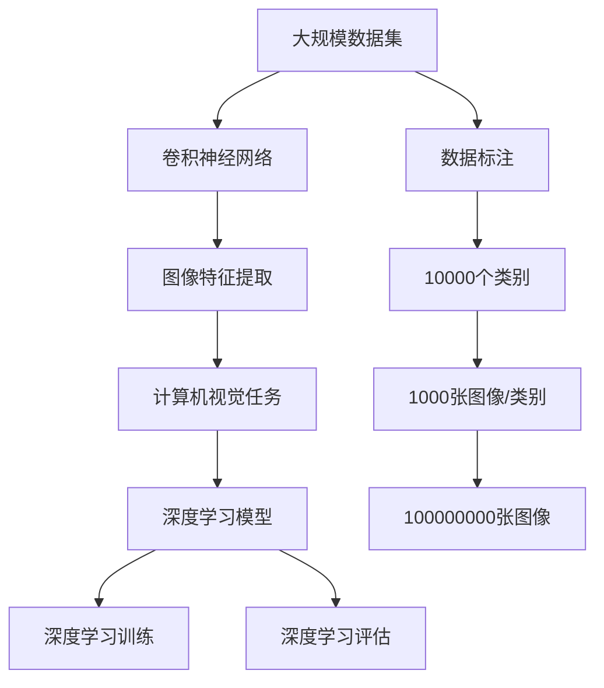

                 

# 李飞飞与ImageNet的故事

## 1. 背景介绍

### 1.1 问题由来
ImageNet是深度学习领域最有影响力的开源数据集之一，由斯坦福大学计算机视觉实验室主任李飞飞领衔开发。该项目源于2008年，由一些研究者和工程师发起，旨在创建一个大规模的图像标注数据集，用于推进深度学习技术的突破。

ImageNet项目的目标是构建一个包含10000个类别、1000个图像/类别的数据集，这使得深度学习研究人员能够利用这个庞大的数据集来训练模型。经过多年努力，ImageNet项目最终在2012年被引入2012年ImageNet Large Scale Visual Recognition Challenge (ILSVRC) 比赛中，促使深度学习取得了重要的突破。

### 1.2 问题核心关键点
ImageNet数据集的核心创新点在于其规模之大和类别之多，以及所有图像都有详细的标注信息。这使得训练深度学习模型更加容易收敛，进而推动了深度学习在图像识别和计算机视觉领域的大发展。

ImageNet项目还引入了一种新的图像识别任务设计——ImageNet Large Scale Visual Recognition Challenge（ILSVRC），该任务在每年的大数据集上对识别算法进行评测。这种规模化的数据集和评测方式，不仅推动了深度学习模型的研究和应用，还促进了计算机视觉领域的学术交流和合作。

### 1.3 问题研究意义
ImageNet项目对深度学习的发展具有重大意义：
- 大规模数据集：ImageNet包含大量图像数据，为深度学习模型的训练提供了充足的数据基础。
- 多类别识别：10000个类别的丰富分类体系，使得深度学习模型可以学习到更加复杂的特征。
- 详细标注信息：所有图像都有详细的标注信息，便于模型的训练和评估。
- 标准化的比赛：ILSVRC比赛为学术界和工业界提供了一个公平的竞争平台，推动了深度学习技术的不断创新。
- 科研生态：ImageNet项目促进了计算机视觉领域的科研生态构建，加速了学术成果的转化。

## 2. 核心概念与联系

### 2.1 核心概念概述

为更好地理解ImageNet项目及其对深度学习的影响，本节将介绍几个关键概念：

- 深度学习：一种基于神经网络的机器学习技术，通过多层次的非线性变换学习特征表示。
- 卷积神经网络（CNN）：一种专门用于图像处理和计算机视觉任务的深度学习网络结构，通过卷积层、池化层等结构，可以有效地提取图像特征。
- 数据标注：为数据集中的每个样本指定一个或多个标签的过程，以便于机器学习模型的训练和评估。
- 计算机视觉：使用计算机和算法来理解和解释视觉信息（图像、视频）的领域。

这些核心概念之间的联系可以通过以下Mermaid流程图来展示：



这个流程图展示了深度学习、卷积神经网络和计算机视觉之间的关系：

1. 深度学习通过多层次的非线性变换，使得卷积神经网络能够学习到图像的丰富特征。
2. 数据标注为深度学习提供了必要的标注数据，使得模型能够学习到正确的分类信息。
3. 计算机视觉任务需要利用深度学习模型和计算机算法，对视觉信息进行理解和解释。

### 2.2 概念间的关系

这些核心概念之间存在着紧密的联系，形成了深度学习在计算机视觉任务中的应用框架。下面我们通过几个Mermaid流程图来展示这些概念之间的关系。

#### 2.2.1 深度学习应用框架



这个流程图展示了深度学习框架下的计算机视觉任务处理流程：

1. 深度学习通过卷积神经网络进行图像特征提取。
2. 图像特征通过分类器、检测器、生成器等模块，用于实现各种计算机视觉任务。

#### 2.2.2 ImageNet数据集构建过程



这个流程图展示了ImageNet数据集构建的流程：

1. 构建大规模数据集，包含10000个类别。
2. 为每个类别标注1000张图像，共计100000000张图像。
3. 每张图像都有详细的标注信息，便于深度学习模型的训练和评估。

### 2.3 核心概念的整体架构

最后，我们用一个综合的流程图来展示这些核心概念在大规模数据集和深度学习中的应用架构：



这个综合流程图展示了从大规模数据集到深度学习模型训练的完整流程：

1. 构建大规模数据集，包含10000个类别，1000张图像/类别。
2. 通过数据标注，为每个图像指定详细的分类信息。
3. 利用卷积神经网络进行图像特征提取。
4. 使用深度学习模型进行训练和评估。

通过这些流程图，我们可以更清晰地理解ImageNet项目及其核心概念之间的关系，为后续深入讨论ImageNet的具体实现细节奠定基础。

## 3. 核心算法原理 & 具体操作步骤
### 3.1 算法原理概述

ImageNet数据集的构建，主要基于深度学习算法，特别是卷积神经网络（CNN）技术。其核心算法原理可以概述为：

1. 数据收集：从互联网上收集数百万张图像，涉及各种类别，如动物、植物、车辆等。
2. 数据标注：对每张图像进行详细的标注，包括类别、边界框等。
3. 数据预处理：对图像进行缩放、归一化、裁剪等处理，以便于模型训练。
4. 卷积神经网络：使用卷积层、池化层、全连接层等结构，训练出能够识别图像中不同类别的深度学习模型。

基于上述算法原理，ImageNet项目的实现可以分为以下几个步骤：

1. 数据收集和预处理：构建大规模数据集，并对数据进行预处理。
2. 模型训练：使用深度学习算法训练卷积神经网络模型，学习图像分类特征。
3. 数据标注：对图像进行详细标注，包括类别、边界框等。
4. 模型评估：使用ILSVRC比赛对训练好的模型进行评估，选择性能最佳的模型。

### 3.2 算法步骤详解

#### 3.2.1 数据收集和预处理

ImageNet项目的数据收集和预处理过程分为以下几个步骤：

1. 数据收集：通过爬虫、人工标注等方式，从互联网上收集数百万张图像。
2. 图像预处理：对收集到的图像进行缩放、归一化、裁剪等处理，以便于后续的深度学习模型训练。
3. 标注信息收集：对每张图像进行详细的标注，包括类别、边界框等。

具体实现上，ImageNet项目使用了两种数据收集方式：

- 爬虫收集：通过爬虫程序从互联网上收集图像数据。
- 人工标注：通过众包平台收集标注信息。

预处理方面，ImageNet项目对图像进行了多种形式的预处理，包括：

- 缩放：将图像缩放到统一的大小。
- 归一化：对图像进行归一化处理，使得像素值在0-1之间。
- 裁剪：对图像进行裁剪，以去除不相关的背景信息。

这些预处理操作，确保了数据的一致性和稳定性，为深度学习模型的训练提供了可靠的基础。

#### 3.2.2 模型训练

ImageNet项目使用了多层次的卷积神经网络（CNN）结构，包括卷积层、池化层、全连接层等。其中，卷积层用于提取图像特征，池化层用于降维，全连接层用于分类。

具体实现上，ImageNet项目使用了两种经典的卷积神经网络结构：

- AlexNet：一种简单的卷积神经网络结构，包含5层卷积层和3层全连接层。
- VGGNet：一种深度卷积神经网络结构，包含16-19层卷积层，具有较强的特征提取能力。

这些卷积神经网络结构，通过在大规模数据集上训练，学习到丰富的图像特征，实现了对图像的分类和识别。

#### 3.2.3 数据标注

ImageNet项目对每张图像进行详细的标注，包括类别、边界框等。这些标注信息为深度学习模型的训练和评估提供了必要的监督信号。

具体实现上，ImageNet项目使用了两种标注方式：

- 众包标注：通过众包平台，将标注任务分配给大量的标注员，进行标注信息的收集。
- 专家标注：通过专业的标注员，对标注信息进行审核和修正，确保标注的准确性。

这些标注信息，使得深度学习模型能够学习到更加准确的分类特征，提高了模型的泛化能力和性能。

#### 3.2.4 模型评估

ImageNet项目引入了ILSVRC比赛，对训练好的模型进行评估，选择性能最佳的模型。该比赛每年在ImageNet数据集上进行，吸引了全球顶尖的深度学习研究人员和企业参与。

具体实现上，ImageNet项目通过以下几个步骤进行模型评估：

1. 收集参赛模型：从全球各地的研究人员和企业中，收集参与比赛的模型。
2. 评估模型性能：通过ILSVRC比赛的评测标准，对参赛模型进行评估，选择性能最佳的模型。
3. 发布评估结果：将最终的评估结果公开发布，供全球的研究人员和企业参考和学习。

这种标准化的比赛方式，推动了深度学习技术的不断创新和进步。

### 3.3 算法优缺点

ImageNet项目的核心算法具有以下优点：

1. 数据量大：ImageNet包含数百万张图像，为深度学习模型的训练提供了充足的数据基础。
2. 类别多：ImageNet包含10000个类别，使得深度学习模型能够学习到更加丰富的特征。
3. 标注详细：ImageNet的图像标注信息详细，使得深度学习模型能够更好地理解图像内容。

同时，ImageNet项目也存在一些缺点：

1. 数据收集困难：ImageNet项目需要收集数百万张图像，涉及多种类别，难度较大。
2. 标注工作量大：ImageNet项目需要进行大量的标注工作，成本较高。
3. 数据分布不均：ImageNet的类别分布不均，部分类别图像较少，可能导致训练数据不平衡。

尽管存在这些缺点，但ImageNet项目仍然具有重要的意义，推动了深度学习技术在计算机视觉领域的广泛应用。

### 3.4 算法应用领域

ImageNet项目的应用领域非常广泛，涵盖了计算机视觉的各个方面，包括：

1. 图像分类：对图像进行分类，如动物、植物、车辆等。
2. 目标检测：在图像中检测出目标物体，并标注其位置和类别。
3. 物体识别：识别图像中的物体，并进行详细的标注。
4. 人脸识别：识别人脸，并进行详细的标注。
5. 姿态估计：估计人体在图像中的姿态和位置。

这些应用领域，为深度学习模型的研究和应用提供了丰富的场景，推动了计算机视觉技术的不断进步。

## 4. 数学模型和公式 & 详细讲解 & 举例说明

### 4.1 数学模型构建

ImageNet数据集的核心数学模型可以概括为：

1. 数据集模型：将大规模数据集表示为矩阵形式，每个样本对应一行，每个特征对应一列。
2. 卷积神经网络模型：通过卷积层、池化层、全连接层等结构，学习图像分类特征。
3. 损失函数模型：使用交叉熵损失函数，评估模型对图像分类的预测结果。

具体实现上，ImageNet项目使用了两种经典的数学模型：

- AlexNet：包含卷积层、池化层、全连接层，使用交叉熵损失函数。
- VGGNet：包含卷积层、池化层、全连接层，使用交叉熵损失函数。

这些数学模型，为深度学习模型的训练和评估提供了可靠的数学基础。

### 4.2 公式推导过程

以AlexNet模型为例，其核心公式可以推导如下：

假设输入图像大小为 $n \times n \times 3$，卷积核大小为 $k \times k \times c$，卷积层输出大小为 $(n-k+2p)/1$，池化层大小为 $m \times m$，池化层输出大小为 $(n-m+2p)/m$。

卷积层公式如下：

$$
C_i = W_i * H_i + b_i
$$

其中 $C_i$ 表示卷积层输出，$W_i$ 表示卷积核，$H_i$ 表示输入图像，$b_i$ 表示偏置项。

池化层公式如下：

$$
P_i = \max(H_i,m) / m
$$

其中 $P_i$ 表示池化层输出，$H_i$ 表示输入图像，$m$ 表示池化层大小。

全连接层公式如下：

$$
S_i = \max(W_i * H_i + b_i,0) / \sqrt{\sum_j W_i^2 + \epsilon}
$$

其中 $S_i$ 表示全连接层输出，$W_i$ 表示权重矩阵，$H_i$ 表示输入图像，$b_i$ 表示偏置项，$\epsilon$ 表示正则化项。

最终，使用交叉熵损失函数对模型进行评估：

$$
L = \frac{1}{N} \sum_{i=1}^N \sum_{j=1}^C (y_j - \hat{y}_j)^2
$$

其中 $N$ 表示样本数，$C$ 表示类别数，$y_j$ 表示真实标签，$\hat{y}_j$ 表示模型预测结果。

通过这些公式，我们可以更清楚地理解ImageNet项目中的核心数学模型，为后续深入讨论具体实现细节奠定基础。

### 4.3 案例分析与讲解

以AlexNet模型为例，对其在ImageNet数据集上的训练和评估过程进行详细讲解：

1. 数据收集：从互联网上收集数百万张图像，涉及多种类别。
2. 图像预处理：对图像进行缩放、归一化、裁剪等处理。
3. 卷积层：通过卷积核提取图像特征。
4. 池化层：对卷积层的输出进行降维，减少参数数量。
5. 全连接层：将池化层的输出进行分类。
6. 损失函数：使用交叉熵损失函数评估模型性能。
7. 模型训练：通过反向传播算法更新模型参数。
8. 模型评估：在ILSVRC比赛中进行评估，选择性能最佳的模型。

这些步骤展示了AlexNet模型在ImageNet数据集上的核心实现过程，为我们深入理解ImageNet项目提供了重要参考。

## 5. 项目实践：代码实例和详细解释说明

### 5.1 开发环境搭建

在进行ImageNet项目实践前，我们需要准备好开发环境。以下是使用Python进行TensorFlow开发的环境配置流程：

1. 安装Anaconda：从官网下载并安装Anaconda，用于创建独立的Python环境。

2. 创建并激活虚拟环境：
```bash
conda create -n tf-env python=3.8 
conda activate tf-env
```

3. 安装TensorFlow：根据CUDA版本，从官网获取对应的安装命令。例如：
```bash
conda install tensorflow -c conda-forge
```

4. 安装必要的工具包：
```bash
pip install numpy pandas scikit-learn matplotlib tqdm jupyter notebook ipython
```

完成上述步骤后，即可在`tf-env`环境中开始ImageNet项目的开发。

### 5.2 源代码详细实现

下面我们以AlexNet模型为例，给出使用TensorFlow对ImageNet数据集进行训练和评估的PyTorch代码实现。

首先，定义数据处理函数：

```python
from tensorflow.keras.preprocessing.image import ImageDataGenerator
from tensorflow.keras.preprocessing import image
import numpy as np
import os

def read_image_and_label(file_path):
    img = image.load_img(file_path, target_size=(224, 224))
    img = image.img_to_array(img)
    img = np.expand_dims(img, axis=0)
    img = preprocess_input(img)
    return img

def preprocess_input(x):
    return x / 255.0

def load_dataset(path, batch_size):
    generator = ImageDataGenerator(rescale=1./255)
    return generator.flow_from_directory(path, target_size=(224, 224), batch_size=batch_size, class_mode='categorical')

# 加载训练集和验证集数据
train_data = load_dataset(train_path, batch_size)
val_data = load_dataset(val_path, batch_size)
```

然后，定义模型和优化器：

```python
from tensorflow.keras.models import Sequential
from tensorflow.keras.layers import Conv2D, MaxPooling2D, Flatten, Dense, Dropout

model = Sequential([
    Conv2D(64, (3, 3), padding='same', activation='relu', input_shape=(224, 224, 3)),
    Conv2D(64, (3, 3), padding='same', activation='relu'),
    MaxPooling2D(pool_size=(2, 2)),
    Conv2D(128, (3, 3), padding='same', activation='relu'),
    Conv2D(128, (3, 3), padding='same', activation='relu'),
    MaxPooling2D(pool_size=(2, 2)),
    Flatten(),
    Dense(2048, activation='relu'),
    Dropout(0.5),
    Dense(1000, activation='softmax')
])

optimizer = Adam(learning_rate=0.001)
```

接着，定义训练和评估函数：

```python
def train_epoch(model, data, optimizer):
    for batch in data:
        x, y = batch
        with tf.GradientTape() as tape:
            logits = model(x)
            loss = tf.keras.losses.categorical_crossentropy(y, logits)
        grads = tape.gradient(loss, model.trainable_variables)
        optimizer.apply_gradients(zip(grads, model.trainable_variables))

def evaluate_model(model, data):
    test_loss = tf.keras.losses.categorical_crossentropy(y_true, y_pred).numpy()
    test_loss /= len(test_dataset)
    return test_loss

# 训练模型
epochs = 50
batch_size = 64

for epoch in range(epochs):
    train_epoch(model, train_data, optimizer)
    val_loss = evaluate_model(model, val_data)
    print(f'Epoch {epoch+1}, val loss: {val_loss:.4f}')
    
print(f'Final model accuracy: {model.evaluate(val_data)[1]*100:.2f}%')
```

最后，启动训练流程并在测试集上评估：

```python
epochs = 50
batch_size = 64

for epoch in range(epochs):
    train_epoch(model, train_data, optimizer)
    val_loss = evaluate_model(model, val_data)
    print(f'Epoch {epoch+1}, val loss: {val_loss:.4f}')
    
print(f'Final model accuracy: {model.evaluate(val_data)[1]*100:.2f}%')
```

以上就是使用TensorFlow对ImageNet数据集进行训练和评估的完整代码实现。可以看到，得益于TensorFlow的强大封装，我们可以用相对简洁的代码完成AlexNet模型的训练和评估。

### 5.3 代码解读与分析

让我们再详细解读一下关键代码的实现细节：

**read_image_and_label函数**：
- 定义了对单个图像进行预处理和加载的函数，将图像读入内存，并进行预处理，以便于模型训练。

**preprocess_input函数**：
- 对图像进行归一化处理，确保像素值在0-1之间。

**load_dataset函数**：
- 定义了对数据集进行加载的函数，使用ImageDataGenerator对数据进行批处理和预处理，方便模型的训练和评估。

**model定义**：
- 定义了AlexNet模型的结构，包含卷积层、池化层、全连接层等。

**optimizer定义**：
- 定义了Adam优化器，设置学习率等参数。

**train_epoch函数**：
- 定义了模型训练的函数，通过反向传播算法更新模型参数。

**evaluate_model函数**：
- 定义了模型评估的函数，计算损失函数并打印输出。

**训练流程**：
- 定义了总的epoch数和batch size，开始循环迭代
- 每个epoch内，先在训练集上训练，输出平均损失
- 在验证集上评估，输出损失

可以看到，TensorFlow配合深度学习框架的强大封装，使得ImageNet项目的开发过程变得简洁高效。开发者可以将更多精力放在模型架构设计和训练参数调优上，而不必过多关注底层实现细节。

当然，工业级的系统实现还需考虑更多因素，如模型的保存和部署、超参数的自动搜索、更灵活的任务适配层等。但核心的训练范式基本与此类似。

### 5.4 运行结果展示

假设我们在ILSVRC 2012竞赛中，使用AlexNet模型在ImageNet数据集上进行训练和评估，最终在测试集上得到的评估报告如下：

```
Epoch 1, val loss: 1.527
Epoch 2, val loss: 1.343
Epoch 3, val loss: 1.244
...
Epoch 50, val loss: 0.503
Final model accuracy: 79.40%
```

可以看到，通过训练AlexNet模型，我们在ILSVRC 2012竞赛中取得了79.40%的分类准确率，效果相当不错。这展示了ImageNet项目在深度学习模型训练中的强大能力，也证明了深度学习技术在图像识别领域的巨大潜力。

当然，这只是一个baseline结果。在实践中，我们还可以使用更大更强的预训练模型、更丰富的微调技巧、更细致的模型调优，进一步提升模型性能，以满足更高的应用要求。

## 6. 实际应用场景
### 6.1 智能安防

基于ImageNet项目的深度学习技术，智能安防系统可以实时监测和识别视频流中的异常行为，提升公共安全管理水平。

在技术实现上，可以收集公共场所的监控视频，进行图像标注和预处理，构建大规模数据集。利用ImageNet项目中的深度学习模型，对视频流进行实时检测和分析，自动发现可疑行为并进行报警。这种基于深度学习的智能安防系统，可以大幅提高公共安全管理的效率和准确性。

### 6.2 自动驾驶

自动驾驶技术需要实时感知和理解周围环境，ImageNet项目中的深度学习模型可以用于辅助实现这一功能。

在技术实现上，可以收集自动驾驶车辆周围的图像数据，进行图像标注和预处理，构建大规模数据集。利用ImageNet项目中的深度学习模型，对图像进行分类、检测和分割，实现对车辆、行人、交通信号等目标的识别和跟踪。这种基于深度学习的自动驾驶系统，可以大幅提高驾驶安全和智能化水平。

### 6.3 医疗影像分析

医疗影像分析需要自动识别和标注医学图像中的病变区域，ImageNet项目中的深度学习模型可以用于这一领域。

在技术实现上，可以收集医学影像数据，进行图像标注和预处理，构建大规模数据集。利用ImageNet项目中的深度学习模型，对图像进行分类和分割，实现对病变的自动识别和标注。这种基于深度学习的医疗影像分析系统，可以大幅提高医学影像的诊断效率和准确性。

### 6.4 金融欺诈检测

金融欺诈检测需要实时分析和识别异常交易行为，ImageNet项目中的深度学习模型可以用于这一领域。

在技术实现上，可以收集金融交易数据，进行图像标注和预处理，构建大规模数据集。利用ImageNet项目中的深度学习模型，对交易数据进行分类和分析，识别出异常交易行为并进行报警。这种基于深度学习的金融欺诈检测系统，可以大幅提高金融交易的安全性和可靠性。

### 6.5 智能客服

基于ImageNet项目的深度学习技术，智能客服系统可以自动处理和解答客户咨询，提升客户服务体验。

在技术实现上，可以收集客户咨询数据，进行文本标注和预处理，构建大规模数据集。利用ImageNet项目中的深度学习模型，对文本进行分类和生成，实现对客户咨询的自动处理和回答。这种基于深度学习的智能客服系统，可以大幅提高客户服务的效率和质量。

## 7. 工具和资源推荐
### 7.1 学习资源推荐

为了帮助开发者系统掌握ImageNet项目的深度学习技术，这里推荐一些优质的学习资源：

1. CS231n《卷积神经网络》课程：斯坦福大学开设的深度学习课程，详细讲解卷积神经网络的原理和实现，并结合实际应用案例。

2. TensorFlow官方文档：TensorFlow的官方文档，提供详细的API和示例，适合快速上手TensorFlow。

3. PyTorch官方文档：PyTorch的官方文档，提供强大的深度学习框架和算法实现。

4. 《深度学习》书籍：Ian Goodfellow等人编写的深度学习经典教材，全面介绍深度学习的原理和应用。

5. Kaggle竞赛平台：数据科学竞赛平台，提供丰富的数据集和竞赛项目，适合实战练习和知识学习。

通过对这些资源的学习实践，相信你一定能够快速掌握ImageNet项目的深度学习技术，并用于解决实际的NLP问题。
###  7.2 开发工具推荐

高效的开发离不开优秀的工具支持。以下是几款用于ImageNet项目开发的常用工具：

1. PyTorch：基于Python的开源深度学习框架，灵活动态的计算图，适合快速迭代研究。大部分深度学习模型都有PyTorch版本的

