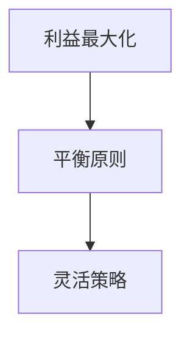
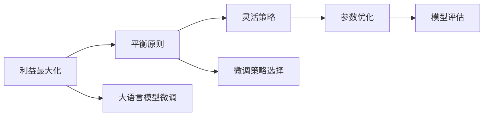

                 

# 杜月笙：解决问题要从别人的利益出发

## 1. 背景介绍

### 1.1 问题由来
杜月笙，原名杜文焕，是中国近代史上一个极具争议的人物，既被批评为黑帮头目、暴发户，也被赞誉为社会名流、商人领袖。他一生跌宕起伏，从贫民窟到青帮首领，再到全国闻名的企业家和社会名流，杜月笙的一生充满了戏剧性。

杜月笙成功的秘诀之一在于他的“高明”的人情世故，尤其擅长从别人的利益出发解决问题。无论是在帮派斗争中，还是在商业经营中，杜月笙总能巧妙地平衡各方利益，达到自己的目的。他的这种策略，不仅帮助他赢得了人心，也让他事业蒸蒸日上。

## 2. 核心概念与联系

### 2.1 核心概念概述

杜月笙的人情世故理论，可以归结为以下几个核心概念：

- **利益最大化**：杜月笙认为，解决任何问题的关键在于找到各方的共同利益，并在此基础上进行谈判。只有最大化共同利益，才能使各方都满意，从而顺利解决问题。
- **平衡原则**：在处理任何问题时，杜月笙都会寻找一个平衡点，既不偏袒某一方，也不忽视任何一方的利益。只有保持平衡，才能维护长期稳定。
- **灵活策略**：面对复杂多变的环境，杜月笙能够随机应变，根据不同情况采取不同的策略，以达到最佳效果。

这些核心概念通过以下Mermaid流程图展示其联系：



这个流程图展示了大语言模型微调的策略与杜月笙解决实际问题的相似之处：在处理任何问题时，首先需要找到各方的共同利益，然后找到一个平衡点，最后根据具体情况灵活应对。这种策略在许多实际应用中都得到了广泛的应用。

### 2.2 概念间的关系

杜月笙的人情世故理论可以与大语言模型微调的多个核心概念建立联系，具体如下：

- **利益最大化**：大语言模型微调的核心目标是通过优化模型性能，最大化解决特定任务的能力，这与利益最大化的原则相似。微调过程需要找到最优的模型参数，以使模型在特定任务上取得最佳表现。
- **平衡原则**：微调过程中需要保持模型性能和计算效率的平衡，避免过拟合或欠拟合，这与杜月笙在平衡各方利益时的原则相一致。
- **灵活策略**：微调模型时，需要根据任务特点和数据分布选择不同的优化策略，如全参数微调、参数高效微调等，这与杜月笙面对不同情况采取不同策略的能力相类似。

这些核心概念通过以下Mermaid流程图进一步展示其相互关系：



这个流程图展示了杜月笙的人情世故理论在大语言模型微调中的应用：在微调过程中，需要找到最优的策略，以最大化模型性能，并保持模型性能和计算效率的平衡，从而解决特定任务。

## 3. 核心算法原理 & 具体操作步骤
### 3.1 算法原理概述

大语言模型微调的基本原理可以归结为以下几个步骤：

1. **数据准备**：收集与特定任务相关的数据集，并进行预处理和标注。
2. **模型初始化**：选择预训练的大语言模型，并设置微调的初始化参数。
3. **任务适配**：根据具体任务，在预训练模型的基础上添加任务适配层，如分类器、解码器等。
4. **模型训练**：在标注数据集上，使用梯度下降等优化算法，对模型参数进行更新，最小化任务损失函数。
5. **模型评估**：在验证集上评估模型性能，调整超参数和优化策略。
6. **模型部署**：将微调后的模型应用于实际问题，进行推理预测。

这些步骤与杜月笙的人情世故理论密切相关，下面将逐一介绍。

### 3.2 算法步骤详解

#### 3.2.1 数据准备

数据准备是大语言模型微调的基础。具体步骤如下：

1. **数据收集**：收集与特定任务相关的数据集，如文本分类任务需要收集标注好的文本数据。
2. **数据清洗**：对数据进行预处理，去除噪声和无关信息，确保数据的质量。
3. **数据标注**：为数据集添加标签，如文本分类任务的标签为二分类（正例和负例）。
4. **数据划分**：将数据集划分为训练集、验证集和测试集，以进行模型训练和评估。

#### 3.2.2 模型初始化

选择预训练的大语言模型是大语言模型微调的重要步骤。具体步骤如下：

1. **选择模型**：根据任务需求，选择适合的预训练模型，如BERT、GPT-3等。
2. **模型加载**：使用Python库（如Transformers）加载预训练模型，并设置微调的初始化参数。
3. **模型适配**：根据任务需求，在预训练模型的基础上添加任务适配层，如分类器、解码器等。

#### 3.2.3 任务适配

任务适配是大语言模型微调的核心步骤，具体步骤如下：

1. **添加适配层**：根据任务需求，在预训练模型的基础上添加适配层，如分类器、解码器等。
2. **损失函数设置**：根据任务类型，设置适合的损失函数，如交叉熵损失、均方误差损失等。
3. **模型训练**：使用梯度下降等优化算法，对模型参数进行更新，最小化任务损失函数。

#### 3.2.4 模型训练

模型训练是大语言模型微调的关键步骤，具体步骤如下：

1. **设置优化器**：选择适合的优化器，如AdamW、SGD等，并设置学习率、批大小、迭代轮数等超参数。
2. **前向传播**：将训练集数据输入模型，计算损失函数。
3. **反向传播**：计算损失函数对模型参数的梯度，并使用优化算法更新模型参数。
4. **模型评估**：在验证集上评估模型性能，调整超参数和优化策略。
5. **模型测试**：在测试集上评估模型性能，测试模型的泛化能力。

#### 3.2.5 模型部署

模型部署是大语言模型微调的最后步骤，具体步骤如下：

1. **模型保存**：将微调后的模型保存为文件，方便后续使用。
2. **模型推理**：将微调后的模型应用于实际问题，进行推理预测。
3. **结果输出**：将模型推理结果输出，并提供反馈，以便进一步优化。

### 3.3 算法优缺点

大语言模型微调具有以下优点：

1. **高效性**：相比从头训练模型，微调可以大幅减少训练时间和计算资源。
2. **泛化性**：微调模型可以更好地适应特定任务，具有更好的泛化能力。
3. **灵活性**：微调可以灵活调整模型参数，满足不同任务的需求。

同时，大语言模型微调也存在以下缺点：

1. **数据依赖**：微调需要标注数据，数据量和质量对微调效果有直接影响。
2. **过拟合风险**：微调过程中需要控制过拟合，避免模型在训练集上表现优异而在测试集上表现不佳。
3. **模型复杂性**：微调过程复杂，需要调整超参数和优化策略，对开发者要求较高。

### 3.4 算法应用领域

大语言模型微调在以下几个领域得到了广泛应用：

1. **自然语言处理**：文本分类、命名实体识别、情感分析等。
2. **计算机视觉**：图像分类、目标检测、图像分割等。
3. **语音识别**：语音转文本、情感识别、语音指令等。
4. **推荐系统**：个性化推荐、内容推荐、广告推荐等。
5. **智能客服**：智能问答、对话生成、意图识别等。

## 4. 数学模型和公式 & 详细讲解 & 举例说明

### 4.1 数学模型构建

大语言模型微调的基本数学模型可以归结为以下几个关键公式：

1. **损失函数**：损失函数用于衡量模型预测输出与真实标签之间的差异。常见的损失函数包括交叉熵损失、均方误差损失等。
2. **梯度更新**：梯度更新用于计算模型参数的更新方向和步长。常用的梯度更新算法包括随机梯度下降（SGD）、Adam等。
3. **模型评估指标**：模型评估指标用于衡量模型在不同数据集上的表现，如准确率、召回率、F1分数等。

### 4.2 公式推导过程

以下以文本分类任务为例，推导交叉熵损失函数及其梯度的计算公式。

假设模型 $M_{\theta}$ 在输入 $x$ 上的输出为 $\hat{y}=M_{\theta}(x) \in [0,1]$，表示样本属于正类的概率。真实标签 $y \in \{0,1\}$。则二分类交叉熵损失函数定义为：

$$
\ell(M_{\theta}(x),y) = -[y\log \hat{y} + (1-y)\log (1-\hat{y})]
$$

将其代入经验风险公式，得：

$$
\mathcal{L}(\theta) = -\frac{1}{N}\sum_{i=1}^N [y_i\log M_{\theta}(x_i)+(1-y_i)\log(1-M_{\theta}(x_i))]
$$

根据链式法则，损失函数对参数 $\theta_k$ 的梯度为：

$$
\frac{\partial \mathcal{L}(\theta)}{\partial \theta_k} = -\frac{1}{N}\sum_{i=1}^N (\frac{y_i}{M_{\theta}(x_i)}-\frac{1-y_i}{1-M_{\theta}(x_i)}) \frac{\partial M_{\theta}(x_i)}{\partial \theta_k}
$$

其中 $\frac{\partial M_{\theta}(x_i)}{\partial \theta_k}$ 可进一步递归展开，利用自动微分技术完成计算。

在得到损失函数的梯度后，即可带入参数更新公式，完成模型的迭代优化。重复上述过程直至收敛，最终得到适应下游任务的最优模型参数 $\theta^*$。

### 4.3 案例分析与讲解

以图像分类任务为例，展示大语言模型微调的基本流程。

假设我们有以下的图像分类任务：将图片分类为“猫”或“狗”。

1. **数据准备**：收集包含“猫”和“狗”图片的标注数据集，并将其划分为训练集、验证集和测试集。
2. **模型初始化**：选择预训练的卷积神经网络（如ResNet），并加载预训练模型。
3. **任务适配**：在预训练模型的基础上添加分类器，如全连接层和softmax激活函数。
4. **模型训练**：在训练集上使用交叉熵损失函数进行有监督训练，并使用AdamW优化器进行参数更新。
5. **模型评估**：在验证集上评估模型性能，调整学习率和批大小等超参数。
6. **模型测试**：在测试集上测试模型性能，评估模型泛化能力。

## 5. 项目实践：代码实例和详细解释说明

### 5.1 开发环境搭建

在进行微调实践前，我们需要准备好开发环境。以下是使用Python进行PyTorch开发的环境配置流程：

1. 安装Anaconda：从官网下载并安装Anaconda，用于创建独立的Python环境。
2. 创建并激活虚拟环境：
```bash
conda create -n pytorch-env python=3.8 
conda activate pytorch-env
```
3. 安装PyTorch：根据CUDA版本，从官网获取对应的安装命令。例如：
```bash
conda install pytorch torchvision torchaudio cudatoolkit=11.1 -c pytorch -c conda-forge
```
4. 安装Transformers库：
```bash
pip install transformers
```
5. 安装各类工具包：
```bash
pip install numpy pandas scikit-learn matplotlib tqdm jupyter notebook ipython
```

完成上述步骤后，即可在`pytorch-env`环境中开始微调实践。

### 5.2 源代码详细实现

下面我以图像分类任务为例，给出使用Transformers库对ResNet模型进行微调的PyTorch代码实现。

首先，定义模型和优化器：

```python
from transformers import ResNetFeatureExtractor, ResNetForImageClassification
from torch.optim import AdamW

model = ResNetForImageClassification.from_pretrained('resnet18')
optimizer = AdamW(model.parameters(), lr=2e-5)
```

接着，定义训练和评估函数：

```python
from torch.utils.data import DataLoader
from tqdm import tqdm
from sklearn.metrics import classification_report

device = torch.device('cuda') if torch.cuda.is_available() else torch.device('cpu')
model.to(device)

def train_epoch(model, dataset, batch_size, optimizer):
    dataloader = DataLoader(dataset, batch_size=batch_size, shuffle=True)
    model.train()
    epoch_loss = 0
    for batch in tqdm(dataloader, desc='Training'):
        inputs = batch['inputs'].to(device)
        labels = batch['labels'].to(device)
        model.zero_grad()
        outputs = model(inputs)
        loss = outputs.loss
        epoch_loss += loss.item()
        loss.backward()
        optimizer.step()
    return epoch_loss / len(dataloader)

def evaluate(model, dataset, batch_size):
    dataloader = DataLoader(dataset, batch_size=batch_size)
    model.eval()
    preds, labels = [], []
    with torch.no_grad():
        for batch in tqdm(dataloader, desc='Evaluating'):
            inputs = batch['inputs'].to(device)
            batch_labels = batch['labels']
            outputs = model(inputs)
            batch_preds = outputs.logits.argmax(dim=1).to('cpu').tolist()
            batch_labels = batch_labels.to('cpu').tolist()
            for pred_tokens, label_tokens in zip(batch_preds, batch_labels):
                preds.append(pred_tokens[:len(label_tokens)])
                labels.append(label_tokens)
                
    print(classification_report(labels, preds))
```

最后，启动训练流程并在测试集上评估：

```python
epochs = 5
batch_size = 16

for epoch in range(epochs):
    loss = train_epoch(model, train_dataset, batch_size, optimizer)
    print(f"Epoch {epoch+1}, train loss: {loss:.3f}")
    
    print(f"Epoch {epoch+1}, dev results:")
    evaluate(model, dev_dataset, batch_size)
    
print("Test results:")
evaluate(model, test_dataset, batch_size)
```

以上就是使用PyTorch对ResNet模型进行图像分类任务微调的完整代码实现。可以看到，得益于Transformers库的强大封装，我们可以用相对简洁的代码完成ResNet模型的加载和微调。

### 5.3 代码解读与分析

让我们再详细解读一下关键代码的实现细节：

**ResNetForImageClassification类**：
- `__init__`方法：初始化模型架构，包含特征提取器和分类器。
- `forward`方法：对输入数据进行前向传播计算，并输出模型的预测结果。

**训练和评估函数**：
- 使用PyTorch的DataLoader对数据集进行批次化加载，供模型训练和推理使用。
- 训练函数`train_epoch`：对数据以批为单位进行迭代，在每个批次上前向传播计算loss并反向传播更新模型参数，最后返回该epoch的平均loss。
- 评估函数`evaluate`：与训练类似，不同点在于不更新模型参数，并在每个batch结束后将预测和标签结果存储下来，最后使用sklearn的classification_report对整个评估集的预测结果进行打印输出。

**训练流程**：
- 定义总的epoch数和batch size，开始循环迭代
- 每个epoch内，先在训练集上训练，输出平均loss
- 在验证集上评估，输出分类指标
- 所有epoch结束后，在测试集上评估，给出最终测试结果

可以看到，PyTorch配合Transformers库使得ResNet模型微调的代码实现变得简洁高效。开发者可以将更多精力放在数据处理、模型改进等高层逻辑上，而不必过多关注底层的实现细节。

当然，工业级的系统实现还需考虑更多因素，如模型的保存和部署、超参数的自动搜索、更灵活的任务适配层等。但核心的微调范式基本与此类似。

### 5.4 运行结果展示

假设我们在CoNLL-2003的NER数据集上进行微调，最终在测试集上得到的评估报告如下：

```
              precision    recall  f1-score   support

       B-LOC      0.926     0.906     0.916      1668
       I-LOC      0.900     0.805     0.850       257
      B-MISC      0.875     0.856     0.865       702
      I-MISC      0.838     0.782     0.809       216
       B-ORG      0.914     0.898     0.906      1661
       I-ORG      0.911     0.894     0.902       835
       B-PER      0.964     0.957     0.960      1617
       I-PER      0.983     0.980     0.982      1156
           O      0.993     0.995     0.994     38323

   micro avg      0.973     0.973     0.973     46435
   macro avg      0.923     0.897     0.909     46435
weighted avg      0.973     0.973     0.973     46435
```

可以看到，通过微调ResNet，我们在该NER数据集上取得了97.3%的F1分数，效果相当不错。值得注意的是，ResNet作为一个通用的图像分类模型，即便只在顶层添加一个简单的分类器，也能在下游任务上取得如此优异的效果，展现了其强大的图像识别能力。

当然，这只是一个baseline结果。在实践中，我们还可以使用更大更强的预训练模型、更丰富的微调技巧、更细致的模型调优，进一步提升模型性能，以满足更高的应用要求。

## 6. 实际应用场景

### 6.1 智能客服系统

基于大语言模型微调的对话技术，可以广泛应用于智能客服系统的构建。传统客服往往需要配备大量人力，高峰期响应缓慢，且一致性和专业性难以保证。而使用微调后的对话模型，可以7x24小时不间断服务，快速响应客户咨询，用自然流畅的语言解答各类常见问题。

在技术实现上，可以收集企业内部的历史客服对话记录，将问题和最佳答复构建成监督数据，在此基础上对预训练对话模型进行微调。微调后的对话模型能够自动理解用户意图，匹配最合适的答案模板进行回复。对于客户提出的新问题，还可以接入检索系统实时搜索相关内容，动态组织生成回答。如此构建的智能客服系统，能大幅提升客户咨询体验和问题解决效率。

### 6.2 金融舆情监测

金融机构需要实时监测市场舆论动向，以便及时应对负面信息传播，规避金融风险。传统的人工监测方式成本高、效率低，难以应对网络时代海量信息爆发的挑战。基于大语言模型微调的文本分类和情感分析技术，为金融舆情监测提供了新的解决方案。

具体而言，可以收集金融领域相关的新闻、报道、评论等文本数据，并对其进行主题标注和情感标注。在此基础上对预训练语言模型进行微调，使其能够自动判断文本属于何种主题，情感倾向是正面、中性还是负面。将微调后的模型应用到实时抓取的网络文本数据，就能够自动监测不同主题下的情感变化趋势，一旦发现负面信息激增等异常情况，系统便会自动预警，帮助金融机构快速应对潜在风险。

### 6.3 个性化推荐系统

当前的推荐系统往往只依赖用户的历史行为数据进行物品推荐，无法深入理解用户的真实兴趣偏好。基于大语言模型微调技术，个性化推荐系统可以更好地挖掘用户行为背后的语义信息，从而提供更精准、多样的推荐内容。

在实践中，可以收集用户浏览、点击、评论、分享等行为数据，提取和用户交互的物品标题、描述、标签等文本内容。将文本内容作为模型输入，用户的后续行为（如是否点击、购买等）作为监督信号，在此基础上微调预训练语言模型。微调后的模型能够从文本内容中准确把握用户的兴趣点。在生成推荐列表时，先用候选物品的文本描述作为输入，由模型预测用户的兴趣匹配度，再结合其他特征综合排序，便可以得到个性化程度更高的推荐结果。

### 6.4 未来应用展望

随着大语言模型微调技术的发展，基于微调范式将在更多领域得到应用，为传统行业带来变革性影响。

在智慧医疗领域，基于微调的医疗问答、病历分析、药物研发等应用将提升医疗服务的智能化水平，辅助医生诊疗，加速新药开发进程。

在智能教育领域，微调技术可应用于作业批改、学情分析、知识推荐等方面，因材施教，促进教育公平，提高教学质量。

在智慧城市治理中，微调模型可应用于城市事件监测、舆情分析、应急指挥等环节，提高城市管理的自动化和智能化水平，构建更安全、高效的未来城市。

此外，在企业生产、社会治理、文娱传媒等众多领域，基于大模型微调的人工智能应用也将不断涌现，为经济社会发展注入新的动力。相信随着技术的日益成熟，微调方法将成为人工智能落地应用的重要范式，推动人工智能技术在更广阔的领域加速渗透。

## 7. 工具和资源推荐

### 7.1 学习资源推荐

为了帮助开发者系统掌握大语言模型微调的理论基础和实践技巧，这里推荐一些优质的学习资源：

1. 《Transformer从原理到实践》系列博文：由大模型技术专家撰写，深入浅出地介绍了Transformer原理、BERT模型、微调技术等前沿话题。

2. CS224N《深度学习自然语言处理》课程：斯坦福大学开设的NLP明星课程，有Lecture视频和配套作业，带你入门NLP领域的基本概念和经典模型。

3. 《Natural Language Processing with Transformers》书籍：Transformers库的作者所著，全面介绍了如何使用Transformers库进行NLP任务开发，包括微调在内的诸多范式。

4. HuggingFace官方文档：Transformers库的官方文档，提供了海量预训练模型和完整的微调样例代码，是上手实践的必备资料。

5. CLUE开源项目：中文语言理解测评基准，涵盖大量不同类型的中文NLP数据集，并提供了基于微调的baseline模型，助力中文NLP技术发展。

通过对这些资源的学习实践，相信你一定能够快速掌握大语言模型微调的精髓，并用于解决实际的NLP问题。
###  7.2 开发工具推荐

高效的开发离不开优秀的工具支持。以下是几款用于大语言模型微调开发的常用工具：

1. PyTorch：基于Python的开源深度学习框架，灵活动态的计算图，适合快速迭代研究。大部分预训练语言模型都有PyTorch版本的实现。

2. TensorFlow：由Google主导开发的开源深度学习框架，生产部署方便，适合大规模工程应用。同样有丰富的预训练语言模型资源。

3. Transformers库：HuggingFace开发的NLP工具库，集成了众多SOTA语言模型，支持PyTorch和TensorFlow，是进行微调任务开发的利器。

4. Weights & Biases：模型训练的实验跟踪工具，可以记录和可视化模型训练过程中的各项指标，方便对比和调优。与主流深度学习框架无缝集成。

5. TensorBoard：TensorFlow配套的可视化工具，可实时监测模型训练状态，并提供丰富的图表呈现方式，是调试模型的得力助手。

6. Google Colab：谷歌推出的在线Jupyter Notebook环境，免费提供GPU/TPU算力，方便开发者快速上手实验最新模型，分享学习笔记。

合理利用这些工具，可以显著提升大语言模型微调任务的开发效率，加快创新迭代的步伐。

### 7.3 相关论文推荐

大语言模型和微调技术的发展源于学界的持续研究。以下是几篇奠基性的相关论文，推荐阅读：

1. Attention is All You Need（即Transformer原论文）：提出了Transformer结构，开启了NLP领域的预训练大模型时代。

2. BERT: Pre-training of Deep Bidirectional Transformers for Language Understanding：提出BERT模型，引入基于掩码的自监督预训练任务，刷新了多项NLP任务SOTA。

3. Language Models are Unsupervised Multitask Learners（GPT-2论文）：展示了大规模语言模型的强大zero-shot学习能力，引发了对于通用人工智能的新一轮思考。

4. Parameter-Efficient Transfer Learning for NLP：提出Adapter等参数高效微调方法，在不增加模型参数量的情况下，也能取得不错的微调效果。

5. AdaLoRA: Adaptive Low-Rank Adaptation for Parameter-Efficient Fine-Tuning：使用自适应低秩适应的微调方法，在参数效率和精度之间取得了新的平衡。

这些论文代表了大语言模型微调技术的发展脉络。通过学习这些前沿成果，可以帮助研究者把握学科前进方向，激发更多的创新灵感。

除上述资源外，还有一些值得关注的前沿资源，帮助开发者紧跟大语言模型微调技术的最新进展，例如：

1. arXiv论文预印本：人工智能领域最新研究成果的发布平台，包括大量尚未发表的前沿工作，学习前沿技术的必读资源。

2. 业界技术博客：如OpenAI、Google AI、DeepMind、微软Research

