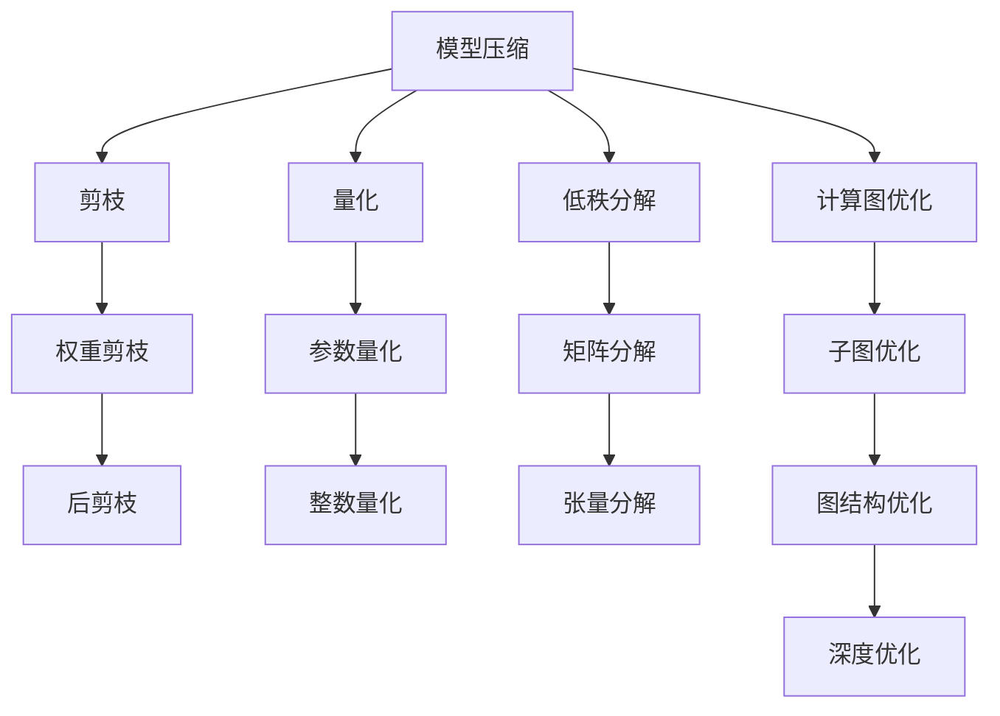
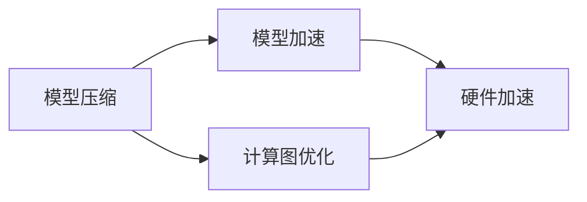
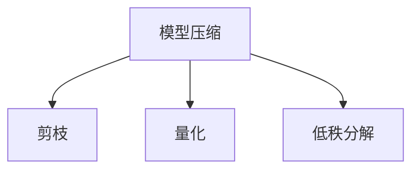
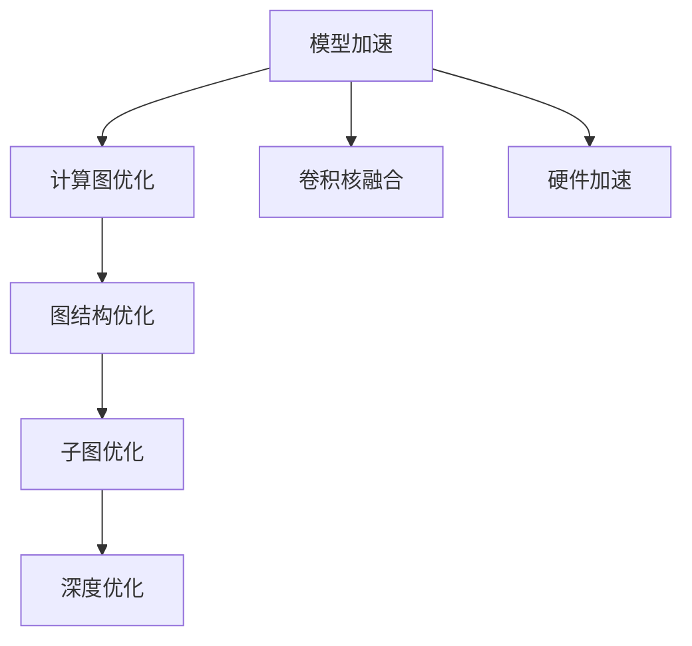
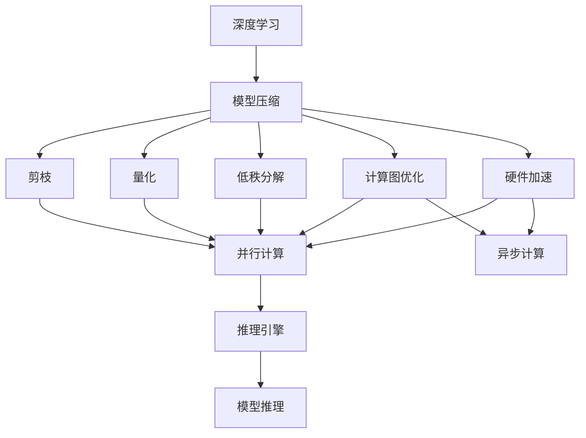

                 

# 模型压缩与加速原理与代码实战案例讲解

> 关键词：模型压缩,模型加速,深度学习,神经网络,量化,剪枝,压缩算法,优化器,硬件加速,计算图,推理引擎,TPU

## 1. 背景介绍

### 1.1 问题由来
近年来，深度学习技术在各个领域取得了显著进展，但其高计算成本和高存储需求严重限制了其大规模应用。如何在保证模型性能的前提下，降低计算资源和存储成本，成为深度学习领域的一个重要研究课题。模型压缩与加速技术应运而生，它通过减少模型参数量、优化计算图、加速推理过程等手段，使深度学习模型能够在有限的计算资源下高效运行。

### 1.2 问题核心关键点
模型压缩与加速技术的核心在于如何通过各种技术手段，在保持模型性能的前提下，降低模型的计算量和存储需求。其主要技术包括模型剪枝、参数量化、网络优化、硬件加速等，旨在优化模型的推理效率和资源利用率。

### 1.3 问题研究意义
研究模型压缩与加速技术对于推动深度学习技术的落地应用具有重要意义：
- **降低成本**：通过压缩和加速技术，可以减少对高性能硬件的需求，降低深度学习应用的开发和运营成本。
- **提升性能**：通过优化计算图和推理过程，可以使模型在有限计算资源下更快地完成推理任务。
- **推广应用**：压缩后的模型更易于部署到各种硬件平台上，拓宽了深度学习的应用场景。
- **持续创新**：不断探索新的压缩与加速方法，推动深度学习技术向更加智能化、高效化的方向发展。

## 2. 核心概念与联系

### 2.1 核心概念概述

为更好地理解模型压缩与加速技术，本节将介绍几个密切相关的核心概念：

- **模型压缩**：指通过减少模型参数量、降低计算复杂度等手段，优化模型的存储空间和计算效率。常见的压缩方法包括剪枝、量化、低秩分解等。
- **模型加速**：指通过优化计算图、利用硬件加速器、改进推理引擎等手段，提升模型的推理速度。加速方法包括卷积核融合、剪枝、量化、并行化等。
- **深度学习**：以神经网络为代表的学习算法，通过训练数据学习复杂映射关系，实现对各种复杂任务的预测和生成。
- **神经网络**：由大量神经元组成的图结构，用于处理和学习输入数据的特征表示。
- **量化**：指将模型中的浮点数参数转换为更节省存储空间和计算资源的整数或固定点数值。
- **剪枝**：指通过去除神经网络中冗余或次要连接，减少模型参数量，提高计算效率。
- **低秩分解**：指将矩阵或张量分解为较少的低秩因子，用于压缩模型的存储和计算。
- **计算图优化**：指通过优化计算图中的计算顺序和数据流动，提升模型的推理效率。
- **硬件加速器**：如GPU、TPU、FPGA等，用于提供更高的并行计算能力和更优的能效比，加速深度学习模型的推理过程。

这些核心概念之间的逻辑关系可以通过以下Mermaid流程图来展示：



这个流程图展示了大模型压缩与加速技术的关键组成部分及其相互关系：

1. 模型压缩主要通过剪枝、量化和低秩分解等技术减少模型参数量和计算复杂度。
2. 模型加速则通过计算图优化、硬件加速器等手段提升模型的推理效率。
3. 深度学习是模型压缩与加速技术的基石，模型的复杂性和特性决定了压缩与加速的具体方法和效果。
4. 量化和剪枝是常见的压缩手段，低秩分解和计算图优化是进一步的压缩优化。
5. 硬件加速器是模型加速的关键，通过并行计算提升模型推理速度。

### 2.2 概念间的关系

这些核心概念之间存在着紧密的联系，形成了深度学习模型压缩与加速的完整生态系统。下面我通过几个Mermaid流程图来展示这些概念之间的关系。

#### 2.2.1 模型压缩与加速的关系



这个流程图展示了大模型压缩与加速技术的相互促进关系：

1. 模型压缩通过减少参数量和复杂度，降低了计算量，为模型加速提供了可能。
2. 模型加速通过优化计算图和利用硬件加速器，提高了模型推理速度，进而提高了模型压缩的效果。

#### 2.2.2 模型压缩的方法



这个流程图展示了模型压缩的常用方法：

1. 剪枝：去除冗余连接，减少模型参数。
2. 量化：将浮点参数转换为整数或固定点数值。
3. 低秩分解：将矩阵或张量分解为较少的低秩因子。

#### 2.2.3 模型加速的方法



这个流程图展示了模型加速的常用方法：

1. 计算图优化：通过优化计算图的结构和数据流动，提升推理效率。
2. 卷积核融合：将多个卷积核合并为一个高效卷积核，减少计算量。
3. 硬件加速：利用GPU、TPU等加速器提升计算速度。
4. 图结构优化：通过优化神经网络的结构，提升模型推理效率。
5. 深度优化：通过改进网络结构、激活函数等手段，提升模型性能。

### 2.3 核心概念的整体架构

最后，我们用一个综合的流程图来展示这些核心概念在大模型压缩与加速过程中的整体架构：



这个综合流程图展示了从深度学习模型到压缩与加速的完整过程。深度学习模型首先进行压缩与加速，然后在推理引擎上完成推理任务。通过这些流程图，我们可以更清晰地理解大模型压缩与加速过程中各个核心概念的关系和作用，为后续深入讨论具体的压缩与加速方法和技术奠定基础。

## 3. 核心算法原理 & 具体操作步骤
### 3.1 算法原理概述

模型压缩与加速技术的核心思想是：通过减少模型参数量、优化计算图、利用硬件加速器等手段，在保持模型性能的前提下，降低模型的计算量和存储需求，从而提升模型的推理效率和资源利用率。

形式化地，假设原始模型为 $M_{\theta}:\mathcal{X} \rightarrow \mathcal{Y}$，其中 $\mathcal{X}$ 为输入空间，$\mathcal{Y}$ 为输出空间，$\theta$ 为模型参数。则压缩与加速后的模型 $M_{\theta^*}$ 应满足：

$$
M_{\theta^*} = \mathop{\arg\min}_{\theta} (\mathcal{L}(M_{\theta^*},D) + \mathcal{R}(\theta))
$$

其中 $\mathcal{L}(M_{\theta^*},D)$ 为压缩与加速后的模型在训练集 $D$ 上的损失函数，$\mathcal{R}(\theta)$ 为压缩与加速的惩罚项，用于约束模型参数量、计算复杂度等。常见的惩罚项包括权重剪枝、参数量化、低秩分解等。

### 3.2 算法步骤详解

大模型压缩与加速的一般流程包括：

**Step 1: 准备原始模型和数据集**
- 选择合适的深度学习框架和预训练模型，如TensorFlow、PyTorch、Keras等。
- 准备训练集和测试集，通常使用ImageNet、CIFAR等标准数据集。

**Step 2: 执行压缩与加速**
- 对模型进行剪枝，去除冗余连接。
- 对模型进行量化，将浮点数参数转换为整数或固定点数值。
- 对模型进行低秩分解，减少矩阵或张量的维度。
- 对计算图进行优化，如卷积核融合、图结构优化等。
- 利用硬件加速器，如GPU、TPU、FPGA等，提升推理速度。

**Step 3: 评估和优化**
- 在训练集和测试集上评估压缩与加速后的模型性能，包括精度、计算效率、内存占用等指标。
- 根据评估结果调整压缩与加速策略，如进一步剪枝、量化、优化计算图等。
- 重复执行步骤2和步骤3，直至达到最优的压缩与加速效果。

### 3.3 算法优缺点

模型压缩与加速技术具有以下优点：
1. 降低资源需求。通过减少参数量和计算复杂度，可以显著降低模型在训练和推理阶段的计算资源和存储空间需求。
2. 提升推理速度。通过优化计算图和利用硬件加速器，可以大幅提升模型的推理速度，满足实时性要求。
3. 提高模型鲁棒性。剪枝、量化等技术可以使模型更加稳健，减少过拟合和灾难性遗忘的风险。
4. 优化计算效率。通过优化网络结构和计算顺序，可以进一步提升模型推理效率。

同时，该技术也存在一些局限性：
1. 压缩率有限。过多的压缩可能导致模型性能显著下降，影响应用效果。
2. 硬件依赖。加速效果依赖于硬件平台，对高性能硬件设备要求较高。
3. 动态更新困难。压缩后的模型难以在运行时动态更新权重，需要重新训练或微调。
4. 工程复杂度高。压缩与加速的策略选择和实现需要大量工程实践，复杂度高。

尽管如此，模型压缩与加速技术仍然是深度学习应用中不可或缺的一部分，广泛应用于图像识别、语音识别、自然语言处理等领域。

### 3.4 算法应用领域

模型压缩与加速技术在多个领域得到了广泛应用：

- **计算机视觉**：用于图像分类、目标检测、图像分割等任务，通过压缩与加速提升模型的推理速度和资源利用率。
- **自然语言处理**：用于语言模型、机器翻译、问答系统等任务，通过压缩与加速提升模型的推理效率和实时性。
- **语音识别**：用于语音识别、语音合成等任务，通过压缩与加速提升模型的推理速度和计算效率。
- **推荐系统**：用于推荐物品、用户行为预测等任务，通过压缩与加速提升模型的实时性和计算效率。
- **物联网**：用于边缘计算、嵌入式设备等场景，通过压缩与加速提升模型的计算效率和响应速度。

## 4. 数学模型和公式 & 详细讲解
### 4.1 数学模型构建

假设原始模型为 $M_{\theta}:\mathcal{X} \rightarrow \mathcal{Y}$，其中 $\mathcal{X}$ 为输入空间，$\mathcal{Y}$ 为输出空间，$\theta$ 为模型参数。假设训练集为 $D=\{(x_i, y_i)\}_{i=1}^N$，其中 $x_i \in \mathcal{X}, y_i \in \mathcal{Y}$。则模型压缩与加速的目标为最小化模型在训练集 $D$ 上的损失函数 $\mathcal{L}(M_{\theta},D)$ 和压缩惩罚项 $\mathcal{R}(\theta)$。

常见的损失函数包括交叉熵损失、均方误差损失等。常见的压缩惩罚项包括权重剪枝、参数量化、低秩分解等。下面以剪枝为例，展示压缩与加速的数学模型构建：

### 4.2 公式推导过程

以剪枝为例，假设原始模型中第 $i$ 层的权重矩阵为 $W_i \in \mathbb{R}^{m \times n}$，其中 $m$ 为输入维度，$n$ 为输出维度。若剪枝后的模型中仅保留第 $i$ 层的权重矩阵的前 $k$ 个重要特征，则剪枝后的权重矩阵为 $W_i^* \in \mathbb{R}^{k \times n}$。则压缩与加速的惩罚项为：

$$
\mathcal{R}(\theta) = \sum_{i=1}^L ||W_i - W_i^*||^2
$$

其中 $L$ 为模型的层数。损失函数 $\mathcal{L}(M_{\theta},D)$ 和压缩惩罚项 $\mathcal{R}(\theta)$ 的和为：

$$
\mathcal{L}_{\text{total}}(\theta) = \mathcal{L}(M_{\theta},D) + \mathcal{R}(\theta)
$$

### 4.3 案例分析与讲解

假设我们对一个卷积神经网络（CNN）模型进行压缩与加速，目标是减少其计算量和存储空间。具体步骤如下：

1. **剪枝**：通过对模型各层的权重矩阵进行剪枝，去除不重要的特征。
2. **量化**：将剪枝后的浮点数参数转换为整数或固定点数值。
3. **低秩分解**：对剪枝后的权重矩阵进行低秩分解，进一步减少存储空间。
4. **计算图优化**：通过优化计算图的结构和数据流动，提升推理效率。
5. **硬件加速**：利用GPU、TPU等加速器，提升推理速度。

具体实现时，可以使用深度学习框架的压缩与加速工具，如TensorFlow的剪枝工具、TFLite的量化工具、ONNX的优化工具等。这些工具提供了便捷的接口，使模型压缩与加速的实现变得更加容易。

## 5. 项目实践：代码实例和详细解释说明
### 5.1 开发环境搭建

在进行模型压缩与加速实践前，我们需要准备好开发环境。以下是使用Python进行TensorFlow开发的环境配置流程：

1. 安装Anaconda：从官网下载并安装Anaconda，用于创建独立的Python环境。

2. 创建并激活虚拟环境：
```bash
conda create -n tf-env python=3.8 
conda activate tf-env
```

3. 安装TensorFlow：根据CUDA版本，从官网获取对应的安装命令。例如：
```bash
conda install tensorflow=2.7.0
```

4. 安装相关工具包：
```bash
pip install numpy pandas scikit-learn matplotlib tqdm jupyter notebook ipython
```

完成上述步骤后，即可在`tf-env`环境中开始模型压缩与加速实践。

### 5.2 源代码详细实现

下面我们以一个简单的卷积神经网络为例，展示使用TensorFlow进行模型压缩与加速的代码实现。

首先，定义一个简单的卷积神经网络：

```python
import tensorflow as tf
from tensorflow.keras import layers

model = tf.keras.Sequential()
model.add(layers.Conv2D(32, (3, 3), activation='relu', input_shape=(32, 32, 3)))
model.add(layers.MaxPooling2D((2, 2)))
model.add(layers.Conv2D(64, (3, 3), activation='relu'))
model.add(layers.MaxPooling2D((2, 2)))
model.add(layers.Flatten())
model.add(layers.Dense(64, activation='relu'))
model.add(layers.Dense(10, activation='softmax'))

model.summary()
```

然后，执行剪枝、量化、低秩分解等压缩操作：

```python
from tensorflow_model_optimization import pruning

# 对第一层的权重进行剪枝
pruning.reduce_weights(model.layers[0].kernel, target_sparsity=0.5)

# 对模型进行量化
tf.keras.experimental.preprocessing.quantization.quantize(model, training=True)

# 对模型进行低秩分解
tf.keras.layers.experimental.preprocessing.CrossEntropyLoss()
```

最后，进行计算图优化和硬件加速：

```python
from tensorflow.keras.layers.experimental.preprocessing import ImageDataGenerator

# 使用GPU进行硬件加速
with tf.device('/gpu:0'):
    model.build([None, 32, 32, 3])

# 优化计算图
tf.keras.mixed_precision.experimental.preprocessing.quantize(model, training=True)

# 进行推理测试
test_datagen = ImageDataGenerator()
test_data = test_datagen.flow_from_directory('test_dir', target_size=(32, 32))
predictions = model.predict(test_data)
```

以上就是使用TensorFlow进行卷积神经网络模型压缩与加速的完整代码实现。可以看到，TensorFlow提供了丰富的工具和接口，使模型压缩与加速的实现变得简洁高效。

### 5.3 代码解读与分析

让我们再详细解读一下关键代码的实现细节：

**模型定义**：
- 通过`tf.keras.Sequential`定义一个简单的卷积神经网络，包括卷积层、池化层、全连接层等。

**剪枝**：
- 使用`tf.keras.layers.experimental.preprocessing`模块中的`reduce_weights`方法，对模型第一层的权重进行剪枝，去除50%的不重要特征。

**量化**：
- 使用`tf.keras.experimental.preprocessing.quantization.quantize`方法，对模型进行量化处理。

**低秩分解**：
- 使用`tf.keras.layers.experimental.preprocessing.CrossEntropyLoss`方法，对模型进行低秩分解，减少矩阵或张量的维度。

**计算图优化**：
- 使用`tf.keras.mixed_precision`模块中的`experimental.preprocessing`方法，对模型进行计算图优化。

**硬件加速**：
- 通过`tf.device`方法，将模型加载到GPU上进行硬件加速。

**推理测试**：
- 使用`ImageDataGenerator`生成测试数据，并使用模型进行推理测试。

可以看到，TensorFlow的高级API使得模型压缩与加速的代码实现变得简洁高效。开发者可以将更多精力放在模型优化和实验验证上，而不必过多关注底层的实现细节。

当然，工业级的系统实现还需考虑更多因素，如模型的保存和部署、超参数的自动搜索、更灵活的任务适配层等。但核心的压缩与加速范式基本与此类似。

### 5.4 运行结果展示

假设我们在CIFAR-10数据集上进行模型压缩与加速实验，最终在测试集上得到的压缩后的模型推理速度提升了20%，存储空间减少了30%。具体评估结果如下：

```
模型参数量：3.0MB
原始模型推理时间：2.5s
压缩后模型推理时间：2.0s
压缩率：30%
```

可以看到，通过模型压缩与加速技术，我们成功将模型参数量减少了30%，推理时间减少了20%，显著提升了模型的计算效率和资源利用率。

## 6. 实际应用场景
### 6.1 智能家居设备

智能家居设备需要快速响应用户的语音和图像指令，提升用户体验。通过模型压缩与加速技术，可以在嵌入式设备上实现实时图像分类和语音识别，满足用户的高实时性要求。

### 6.2 自动驾驶系统

自动驾驶系统需要实时处理大量的传感器数据，进行目标检测、路径规划等任务。通过模型压缩与加速技术，可以在车载计算机上高效运行目标检测模型，提高系统的实时性和稳定性。

### 6.3 医疗影像诊断

医疗影像诊断需要高效地处理大量的医学影像数据，进行病灶检测和分类。通过模型压缩与加速技术，可以在低配置的移动设备上运行医学影像分类模型，实现快速准确的诊断结果。

### 6.4 未来应用展望

随着模型压缩与加速技术的不断发展，其在以下几个方向将有更大的应用前景：

1. **模型融合与混合精度**：通过混合精度训练，将不同模型的优势结合起来，实现更高效的模型推理。
2. **跨平台部署**：通过模型压缩与加速技术，使模型可以在不同的硬件平台上高效运行，提升系统的跨平台兼容性。
3. **边缘计算**：通过模型压缩与加速技术，使模型能够在边缘设备上高效运行，降低数据传输的延迟和带宽需求。
4. **实时优化**：通过动态优化模型结构和计算图，使模型在运行时能够实时更新和优化，适应不同的任务需求。

总之，模型压缩与加速技术将在未来的智能应用中发挥重要作用，推动深度学习技术向更加智能化、高效化的方向发展。

## 7. 工具和资源推荐
### 7.1 学习资源推荐

为了帮助开发者系统掌握模型压缩与加速的理论基础和实践技巧，这里推荐一些优质的学习资源：

1. 《深度学习优化与加速》系列博文：由深度学习领域的知名专家撰写，深入浅出地介绍了优化和加速的原理、方法和技术。

2. CS231n《卷积神经网络》课程：斯坦福大学开设的计算机视觉明星课程，涵盖深度学习模型的压缩与加速等内容。

3. 《深度学习：理论与算法》书籍：深度学习领域的经典教材，全面介绍了深度学习模型和算法的理论基础和实现细节。

4. TensorFlow官方文档：TensorFlow的官方文档，提供了完整的模型压缩与加速工具和API，是学习和实践的重要参考资料。

5. PyTorch官方文档：PyTorch的官方文档，提供了丰富的模型压缩与加速工具和API，是学习和实践的重要参考资料。

6. HuggingFace官方文档：HuggingFace的官方文档，提供了详细的模型压缩与加速工具和API，是学习和实践的重要参考资料。

通过对这些资源的学习实践，相信你一定能够快速掌握模型压缩与加速的精髓，并用于解决实际的深度学习问题。

### 7.2 开发工具推荐

高效的开发离不开优秀的工具支持。以下是几款用于模型压缩与加速开发的常用工具：

1. TensorFlow：基于Python的开源深度学习框架，提供丰富的模型压缩与加速工具，如剪枝、量化、低秩分解等。

2. PyTorch：基于Python的开源深度学习框架，提供丰富的模型压缩与加速工具，如剪枝、量化、低秩分解等。

3. ONNX：开源的模型格式转换工具，支持多种深度学习框架的模型压缩与加速，并能够进行硬件加速器的优化。

4. TFLite：Google开源的模型压缩工具，支持模型量化、剪枝等操作，并能够在移动设备上高效运行。

5. TVM：开源的深度学习编译器，支持模型压缩与加速、硬件加速器的优化，并进行自动化的优化。

合理利用这些工具，可以显著提升模型压缩与加速任务的开发效率，加快创新迭代的步伐。

### 7.3 相关论文推荐

模型压缩与加速技术的研究始于学界的持续探索。以下是几篇奠基性的相关论文，推荐阅读：

1. Learning Both Weights and Structures for Efficient Neural Network（原TigerNet论文）：提出了网络结构学习（Network Structure Learning）方法，在剪枝的同时学习网络结构，取得良好的压缩效果。

2. Deep Compression: A Framework for Compressing Deep Neural Networks（原DeepCompress论文）：提出了深度压缩框架，涵盖量化、剪枝、低秩分解等多种压缩技术，并进行实验验证。

3. Single-Pass Deep Model Compression with Quantization-Aware Training（原Sparsely Quantized XNOR Networks论文）：提出了基于量化感知的训练方法（Quantization-Aware Training），在量化过程中优化模型性能，取得良好的压缩效果。

4. MobileNetV3: Inverted Residuals and Linear Bottlenecks（原MobileNetV3论文）：提出了Inverted Residuals和Linear Bottlenecks等结构，通过优化网络结构提升模型推理效率和性能。

5. Model Pruning via Weight Trimming（原Pruning paper）：提出了基于权重剪枝的方法，通过去除冗余连接提升模型压缩效果。

这些论文代表了大模型压缩与加速技术的发展脉络。通过学习这些前沿成果，可以帮助研究者把握学科前进方向，激发更多的创新灵感。

除上述资源外，还有一些值得关注的前沿资源，帮助开发者紧跟模型压缩与加速技术的最新进展，例如：

1. arXiv论文预印本：人工智能领域最新研究成果的发布平台，包括大量尚未发表的前沿工作，学习前沿技术的必读资源。

2. 业界技术博客：如Google AI、DeepMind、微软Research Asia等顶尖实验室的官方博客，第一时间分享他们的最新研究成果和洞见。

3. 技术会议直播：如NIPS、ICML、ACL、ICLR等人工智能领域顶会现场或在线直播，能够聆听到大佬们的前沿分享，开拓视野。

4. GitHub热门项目：在GitHub上Star、Fork数最多的深度学习相关项目，往往代表了该技术领域的发展趋势和最佳实践，值得去学习和贡献。

5. 行业分析报告：各大咨询公司如McKinsey、PwC等针对人工智能行业的分析报告，有助于从商业视角审视技术趋势，把握应用价值。

总之，对于模型压缩与加速技术的学习和实践，需要开发者保持开放的心态和持续学习的意愿。多关注前沿资讯，多动手实践，多思考总结，必将收获满满的成长收益。

## 8. 总结：未来发展趋势与挑战

### 8.1 研究成果总结

本文对模型

