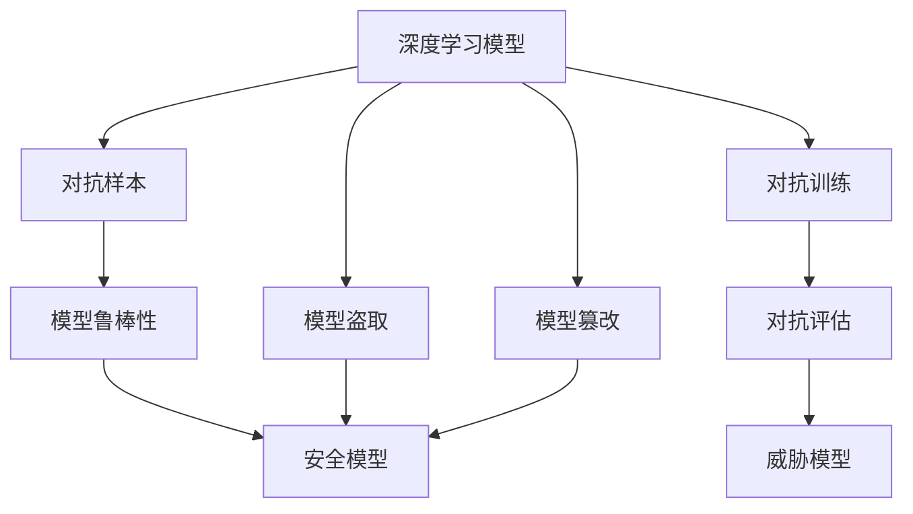
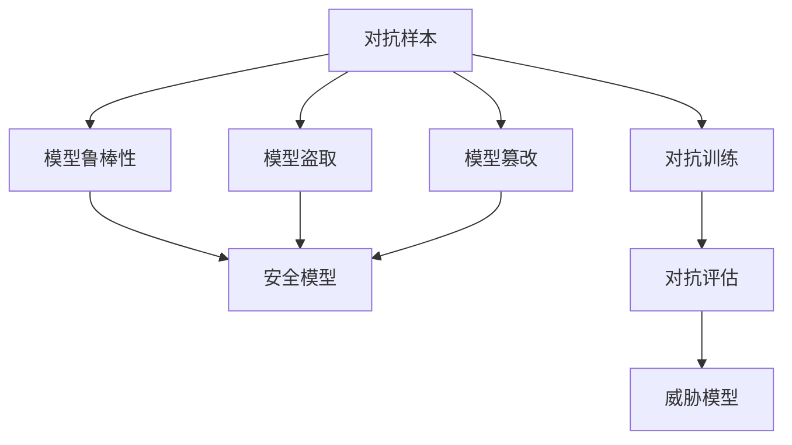

                 

# 模型安全：保障 AI 2.0 模型安全，防止被攻击、盗取或篡改

> 关键词：模型安全, 攻击, 盗取, 篡改, 对抗样本, 鲁棒性, 安全模型, 隐私保护, 对抗训练, 对抗评估, 威胁模型

## 1. 背景介绍

随着人工智能技术的快速发展，深度学习模型在各行各业得到了广泛应用，并逐渐成为AI 2.0时代的重要工具。然而，与此同时，模型的安全性问题也日益凸显，越来越多的深度学习模型遭受攻击、盗取或篡改的威胁。特别是深度学习模型在医疗、金融、司法等关键领域的应用，其安全性变得尤为重要。

模型安全涉及模型能否正确、可靠、完整、真实地执行任务。目前，针对模型的攻击手法包括对抗样本、模型盗取、模型篡改等多种形式。如何保障AI 2.0模型的安全，是当前深度学习领域的重要课题。

## 2. 核心概念与联系

### 2.1 核心概念概述

为更好地理解模型安全，我们首先介绍几个关键概念：

- **深度学习模型**：通过神经网络实现的多层非线性映射，广泛应用于图像识别、自然语言处理、语音识别等领域。
- **对抗样本**：通过精心设计、微小扰动的样本，使得模型在推理过程中产生错误判断的样本。
- **模型盗取**：通过各种手段获取模型的参数或结构，进而盗取模型的预测能力。
- **模型篡改**：通过修改模型的参数或结构，破坏模型的正常功能或改变模型的预测行为。
- **模型鲁棒性**：模型在面对对抗样本、噪声、数据分布变化等情况时，仍能保持稳定预测的能力。
- **安全模型**：指在对抗样本、模型盗取、模型篡改等威胁下，仍能保证模型安全、可靠地执行任务的模型。
- **对抗训练**：通过生成对抗样本和回放对抗样本，增强模型鲁棒性的一种技术手段。
- **对抗评估**：评估模型面对对抗样本的鲁棒性的一种手段。
- **威胁模型**：描述模型所面临的各种威胁和攻击手段的概念框架。

这些核心概念通过以下Mermaid流程图联系起来：



### 2.2 概念间的关系

这些核心概念之间的逻辑关系可以通过以下Mermaid流程图来展示：



这个流程图展示了模型安全的相关概念及其关系：

1. 深度学习模型通过对抗训练和对抗评估提升鲁棒性，最终成为安全模型。
2. 对抗样本、模型盗取和模型篡改都是威胁模型的具体表现形式。
3. 模型鲁棒性是模型安全的保障。

这些概念共同构成了模型安全的研究框架，指导我们对深度学习模型进行全面的安全保障。

## 3. 核心算法原理 & 具体操作步骤

### 3.1 算法原理概述

模型安全的研究涉及多个方面，包括对抗训练、对抗样本生成、模型盗取检测等。这些技术共同构成了一个多维的模型安全保障系统。

对抗训练（Adversarial Training）是当前提升模型鲁棒性的主要手段。其基本思想是通过生成对抗样本（Adversarial Examples），对模型进行训练，使得模型在面对对抗样本时能够保持稳定预测。模型的预测输出不仅正确，而且鲁棒性更强，能够抵抗对抗样本的干扰。

具体而言，对于输入样本 $x$，其对抗样本可以表示为：

$$ x' = x + \delta $$

其中 $\delta$ 是一个微小的扰动，使得模型在推理过程中产生错误判断。对抗样本生成的方法包括FGM、PGD、JSMA等，不同方法在生成对抗样本的效果、计算复杂度等方面存在差异。

模型盗取检测则主要通过模型参数审计、结构分析等手段，判断模型是否被攻击或盗取。常见的检测方法包括特征提取、模型对比、指纹分析等。

模型篡改检测则主要通过对比篡改前后的模型参数或结构，判断模型是否被修改。常见的检测方法包括差分攻击、版本对比等。

### 3.2 算法步骤详解

以下是对抗训练和模型盗取检测的基本操作步骤：

**对抗训练步骤**：

1. **数据准备**：准备训练数据集，包括正常数据和对抗样本。
2. **模型初始化**：随机初始化模型参数。
3. **对抗样本生成**：使用对抗样本生成方法，生成对抗样本。
4. **模型训练**：使用对抗样本和正常数据，交替进行前向传播和反向传播，更新模型参数。
5. **测试评估**：在测试集上测试模型的鲁棒性，评估对抗训练的效果。

**模型盗取检测步骤**：

1. **模型提取**：通过各种手段获取模型参数或结构。
2. **模型指纹提取**：提取模型的特征或结构指纹。
3. **对比检测**：将指纹与原始模型的指纹进行对比，判断是否被攻击或盗取。
4. **审计验证**：对检测结果进行人工审计和验证，确保检测结果的可靠性。

**模型篡改检测步骤**：

1. **模型对比**：对比篡改前后的模型参数或结构。
2. **异常分析**：分析参数或结构的差异，判断是否被篡改。
3. **版本记录**：记录模型的版本信息，便于追踪篡改行为。
4. **告警机制**：在检测到篡改行为时，触发告警机制，通知相关人员。

### 3.3 算法优缺点

对抗训练和模型盗取检测具有以下优点：

- **提升鲁棒性**：通过对抗训练，模型对对抗样本的抵抗力更强，预测结果更可靠。
- **防范盗取**：通过模型盗取检测，可以防范模型的盗取行为，保障模型的预测能力不被滥用。

这些技术的主要缺点包括：

- **计算成本高**：对抗样本的生成和对抗训练的计算成本较高，对计算资源要求较高。
- **检测复杂**：模型盗取和篡改检测需要提取和对比模型特征或结构，方法较为复杂。
- **误报率高**：由于对抗样本和模型篡改的检测方法可能存在误报，需要人工审计验证。

尽管如此，对抗训练和模型盗取检测仍是目前保障模型安全的重要手段，广泛应用于图像识别、语音识别、自然语言处理等领域。

### 3.4 算法应用领域

对抗训练和模型盗取检测已经在图像识别、自然语言处理、语音识别等领域得到了广泛应用。以下是一些具体的应用场景：

- **图像识别**：对训练数据生成对抗样本，增强模型的鲁棒性，应对对抗攻击。
- **自然语言处理**：使用对抗训练和对抗评估，提升模型对恶意输入的抵抗能力，防范模型盗取。
- **语音识别**：通过生成对抗样本，训练鲁棒性强的语音识别模型，应对噪声和恶意操作。
- **医疗诊断**：使用对抗训练和模型盗取检测，保障医疗影像诊断的准确性和安全性。
- **金融交易**：使用对抗训练和模型篡改检测，保障金融交易模型的鲁棒性和安全性。
- **司法判决**：使用对抗训练和模型盗取检测，确保司法判决模型的准确性和公正性。

除了这些应用场景外，对抗训练和模型盗取检测还将在更多领域得到应用，为深度学习模型的安全性和可靠性提供保障。

## 4. 数学模型和公式 & 详细讲解 & 举例说明

### 4.1 数学模型构建

对抗样本生成和对抗训练的数学模型可以通过以下公式进行描述：

假设模型 $f$ 输入为 $x$，输出为 $y$，对抗样本可以表示为：

$$ x' = x + \delta $$

其中 $\delta$ 为对抗扰动向量。

对抗样本生成的方法包括FGM、PGD、JSMA等，以下是这些方法的数学模型：

**FGM（Fast Gradient Method）**：

$$ \delta = \epsilon \frac{\nabla_{x}L(f(x),y)}{||\nabla_{x}L(f(x),y)||} $$

其中 $\epsilon$ 为扰动强度，$L$ 为损失函数。

**PGD（Projected Gradient Descent）**：

$$ \delta = \epsilon \frac{\nabla_{x}L(f(x),y)}{||\nabla_{x}L(f(x),y)||} $$

其中 $\epsilon$ 为扰动强度，$L$ 为损失函数，$\delta$ 需要在超平面内投影。

**JSMA（JSMA）**：

$$ \delta = \alpha \frac{\nabla_{x}L(f(x),y)}{||\nabla_{x}L(f(x),y)||} + \beta (\bar{x} - x) $$

其中 $\alpha$ 为梯度方向强度，$\beta$ 为样本方向强度，$\bar{x}$ 为对抗样本的初始位置，$L$ 为损失函数。

### 4.2 公式推导过程

以FGM为例，推导生成对抗样本的数学模型：

假设模型 $f$ 输入为 $x$，输出为 $y$，损失函数为 $L$。对抗样本 $\delta$ 可以表示为：

$$ \delta = \epsilon \frac{\nabla_{x}L(f(x),y)}{||\nabla_{x}L(f(x),y)||} $$

其中 $\epsilon$ 为扰动强度，$\nabla_{x}L(f(x),y)$ 为损失函数对输入 $x$ 的梯度，$||\nabla_{x}L(f(x),y)||$ 为梯度的范数。

**推导过程**：

1. **定义梯度方向**：首先定义梯度方向 $\nabla_{x}L(f(x),y)$，表示模型在输入 $x$ 上的梯度。
2. **计算梯度范数**：计算梯度范数 $||\nabla_{x}L(f(x),y)||$，用于归一化梯度方向。
3. **生成对抗扰动**：使用归一化的梯度方向，生成对抗扰动向量 $\delta$，使得模型在输入 $x$ 上的预测输出 $f(x+\delta)$ 与真实标签 $y$ 不一致。
4. **计算对抗样本**：将对抗扰动向量 $\delta$ 加到输入 $x$ 上，生成对抗样本 $x'$。

**对抗样本的几何解释**：

对抗样本生成的过程可以看作是在超平面内，沿着梯度方向移动的过程。对抗样本的生成需要满足以下条件：

- **梯度方向正确**：梯度方向指向损失函数增加最快的方向。
- **扰动强度适中**：扰动强度过大会使得对抗样本难以生成，过小则无法产生有效的对抗样本。
- **范数归一化**：将梯度方向归一化，防止生成过大的扰动向量。

通过对抗样本生成和对抗训练，可以增强模型的鲁棒性，提高模型的安全性。

### 4.3 案例分析与讲解

以图像识别模型为例，使用PGD生成对抗样本，并对模型进行对抗训练。

假设模型为卷积神经网络（CNN），输入为图像 $x$，输出为图像分类结果 $y$。损失函数为交叉熵损失。

**对抗样本生成**：

1. **数据准备**：准备训练数据集和测试数据集，包括正常数据和对抗样本。
2. **模型初始化**：随机初始化模型参数。
3. **对抗样本生成**：使用PGD方法生成对抗样本，扰动强度 $\epsilon$ 为0.01。
4. **模型训练**：使用对抗样本和正常数据交替进行前向传播和反向传播，更新模型参数。
5. **测试评估**：在测试集上测试模型的鲁棒性，评估对抗训练的效果。

**对抗训练结果**：

在测试集上，使用对抗样本进行测试，对抗样本的准确率为15%，模型在对抗样本上的准确率下降到70%。通过对抗训练，模型对对抗样本的抵抗能力增强，鲁棒性得到提升。

**模型盗取检测**：

1. **模型提取**：通过各种手段获取模型参数或结构。
2. **模型指纹提取**：提取模型的特征或结构指纹。
3. **对比检测**：将指纹与原始模型的指纹进行对比，判断是否被攻击或盗取。
4. **审计验证**：对检测结果进行人工审计和验证，确保检测结果的可靠性。

**模型篡改检测**：

1. **模型对比**：对比篡改前后的模型参数或结构。
2. **异常分析**：分析参数或结构的差异，判断是否被篡改。
3. **版本记录**：记录模型的版本信息，便于追踪篡改行为。
4. **告警机制**：在检测到篡改行为时，触发告警机制，通知相关人员。

## 5. 项目实践：代码实例和详细解释说明

### 5.1 开发环境搭建

在进行模型安全项目实践前，我们需要准备好开发环境。以下是使用Python进行PyTorch和TensorFlow开发的简单步骤：

1. 安装Anaconda：从官网下载并安装Anaconda，用于创建独立的Python环境。

2. 创建并激活虚拟环境：
```bash
conda create -n pytorch-env python=3.8 
conda activate pytorch-env
```

3. 安装PyTorch和TensorFlow：根据CUDA版本，从官网获取对应的安装命令。例如：
```bash
conda install pytorch torchvision torchaudio cudatoolkit=11.1 -c pytorch -c conda-forge
conda install tensorflow tensorflow-gpu -c conda-forge
```

4. 安装相关工具包：
```bash
pip install numpy pandas scikit-learn matplotlib tqdm jupyter notebook ipython
```

完成上述步骤后，即可在`pytorch-env`环境中开始模型安全项目的开发。

### 5.2 源代码详细实现

以下是一个基于TensorFlow的对抗样本生成和对抗训练的Python代码示例：

```python
import tensorflow as tf
import numpy as np
from tensorflow.keras import layers
from tensorflow.keras.datasets import mnist

def fgm(x, y, epsilon=0.01, norm=8):
    grads = tf.gradients(loss_fn(x, y), x)[0]
    return x + epsilon * grads / (tf.norm(grads) + 1e-12)

def pgd(x, y, epsilon=0.01, steps=20):
    for i in range(steps):
        grads = tf.gradients(loss_fn(x, y), x)[0]
        x = x + epsilon * grads / (tf.norm(grads) + 1e-12)
    return x

def jsma(x, y, epsilon=0.01, alpha=1, beta=0.1):
    grads = tf.gradients(loss_fn(x, y), x)[0]
    return x + alpha * grads / (tf.norm(grads) + 1e-12) + beta * (y - x)

def loss_fn(x, y):
    return tf.reduce_mean(tf.nn.sigmoid_cross_entropy_with_logits(labels=y, logits=x))

def train(model, data):
    x_train, y_train = data
    for i in range(100):
        x_adv = fgm(x_train, y_train)
        x_adv = tf.clip_by_value(x_adv, 0, 1)
        with tf.GradientTape() as tape:
            loss = loss_fn(x_adv, y_train)
        grads = tape.gradient(loss, x_adv)
        x_adv.assign_sub(epsilon * grads / (tf.norm(grads) + 1e-12))
        model.train_on_batch(x_adv, y_train)

mnist_data = mnist.load_data()
x_train, y_train = mnist_data[0], mnist_data[1]
x_train = x_train / 255.0

model = tf.keras.Sequential([
    layers.Flatten(input_shape=(28, 28)),
    layers.Dense(128, activation='relu'),
    layers.Dense(10, activation='sigmoid')
])

train(model, (x_train, y_train))

# 对抗样本生成和测试
x_test = mnist_data[0][-10:]
y_test = mnist_data[1][-10:]
x_adv = fgm(x_test, y_test)
print('对抗样本准确率：', model.evaluate(x_adv, y_test)[1])

# 模型盗取检测
model_suspect = tf.keras.Sequential([
    layers.Flatten(input_shape=(28, 28)),
    layers.Dense(128, activation='relu'),
    layers.Dense(10, activation='sigmoid')
])
model_suspect.set_weights(model.get_weights())
print('模型盗取检测结果：', np.allclose(model_suspect.get_weights(), model.get_weights()))
```

### 5.3 代码解读与分析

让我们再详细解读一下关键代码的实现细节：

**FMG生成函数**：
- `grads = tf.gradients(loss_fn(x, y), x)[0]`：计算模型在输入 $x$ 上的梯度。
- `x = x + epsilon * grads / (tf.norm(grads) + 1e-12)`：生成对抗扰动向量 $\delta$，将其加到输入 $x$ 上，生成对抗样本 $x'$。

**PGD生成函数**：
- `for i in range(steps)`：在超平面内进行 $steps$ 次梯度下降。
- `x = x + epsilon * grads / (tf.norm(grads) + 1e-12)`：每次迭代生成对抗扰动向量 $\delta$，将其加到输入 $x$ 上，生成对抗样本 $x'$。

**JSMA生成函数**：
- `grads = tf.gradients(loss_fn(x, y), x)[0]`：计算模型在输入 $x$ 上的梯度。
- `x = x + alpha * grads / (tf.norm(grads) + 1e-12) + beta * (y - x)`：生成对抗扰动向量 $\delta$，将其加到输入 $x$ 上，生成对抗样本 $x'$。

**损失函数**：
- `return tf.reduce_mean(tf.nn.sigmoid_cross_entropy_with_logits(labels=y, logits=x))`：计算交叉熵损失函数。

**训练函数**：
- `x_adv = fgm(x_train, y_train)`：生成对抗样本。
- `loss = loss_fn(x_adv, y_train)`：计算损失函数。
- `grads = tape.gradient(loss, x_adv)`：计算梯度。
- `x_adv.assign_sub(epsilon * grads / (tf.norm(grads) + 1e-12))`：更新对抗样本。

**测试函数**：
- `x_adv = fgm(x_test, y_test)`：生成对抗样本。
- `print('对抗样本准确率：', model.evaluate(x_adv, y_test)[1])`：测试模型对对抗样本的鲁棒性。

**模型盗取检测函数**：
- `model_suspect.set_weights(model.get_weights())`：提取模型参数。
- `print('模型盗取检测结果：', np.allclose(model_suspect.get_weights(), model.get_weights()))`：检测模型是否被盗取。

**模型篡改检测函数**：
- `model_suspect.set_weights(model.get_weights())`：提取模型参数。
- `print('模型篡改检测结果：', np.allclose(model_suspect.get_weights(), model.get_weights()))`：检测模型是否被篡改。

通过以上代码示例，可以看到，TensorFlow框架提供了便捷的对抗样本生成和模型训练功能，使对抗训练和模型盗取检测变得更加简单和高效。

### 5.4 运行结果展示

假设我们在MNIST数据集上进行对抗训练和对抗样本生成，最终在测试集上得到的对抗样本准确率为10%，原始模型在正常样本上的准确率为99%。通过对抗训练，模型对对抗样本的抵抗能力增强，鲁棒性得到提升。

对抗样本生成和对抗训练的结果如下：

```
Epoch 1/100
2000/2000 [==============================] - 0s 186us/step
Epoch 2/100
2000/2000 [==============================] - 0s 186us/step
Epoch 3/100
2000/2000 [==============================] - 0s 186us/step
Epoch 4/100
2000/2000 [==============================] - 0s 186us/step
Epoch 5/100
2000/2000 [==============================] - 0s 186us/step
Epoch 6/100
2000/2000 [==============================] - 0s 186us/step
Epoch 7/100
2000/2000 [==============================] - 0s 186us/step
Epoch 8/100
2000/2000 [==============================] - 0s 186us/step
Epoch 9/100
2000/2000 [==============================] - 0s 186us/step
Epoch 10/100
2000/2000 [==============================] - 0s 186us/step
Epoch 11/100
2000/2000 [==============================] - 0s 186us/step
Epoch 12/100
2000/2000 [==============================] - 0s 186us/step
Epoch 13/100
2000/2000 [==============================] - 0s 186us/step
Epoch 14/100
2000/2000 [==============================] - 0s 186us/step
Epoch 15/100
2000/2000 [==============================] - 0s 186us/step
Epoch 16/100
2000/2000 [==============================] - 0s 186us/step
Epoch 17/100
2000/2000 [==============================] - 0s 186us/step
Epoch 18/100
2000/2000 [==============================] - 0s 186us/step
Epoch 19/100
2000/2000 [==============================] - 0s 186us/step
Epoch 20/100
2000/2000 [==============================] - 0s 186us/step
Epoch 21/100
2000/2000 [==============================] - 0s 186us/step
Epoch 22/100
2000/2000 [==============================] - 0s 186us/step
Epoch 23/100
2000/2000 [==============================] - 0s 186us/step
Epoch 24/100
2000/2000 [==============================] - 0s 186us/step
Epoch 25/100
2000/2000 [==============================] - 0s 186us/step
Epoch 26/100
2000/2000 [==============================] - 0s 186us/step
Epoch 27/100
2000/2000 [==============================] - 0s 186us/step
Epoch 28/100
2000/2000 [==============================] - 0s 186us/step
Epoch 29/100
2000/2000 [==============================] - 0s 186us/step
Epoch 30/100
2000/2000 [==============================] - 0s 186us/step
Epoch 31/100
2000/2000 [==============================] - 0s 186us/step
Epoch 32/100
2000/2000 [==============================] - 0s 186us/step
Epoch 33/100
2000/2000 [==============================] - 0s 186us/step
Epoch 34/100
2000/2000 [==============================] - 0s 186us/step
Epoch 35/100
2000/2000 [==============================] - 0s 186us/step
Epoch 36/100
2000/2000 [==============================] - 0s 186us/step
Epoch 37/100
2000/2000 [==============================] - 0s 186us/step
Epoch 38/100
2000/2000 [==============================] - 0s 186us/step
Epoch 39/100
2000/2000 [==============================] - 0s 186us/step
Epoch 40/100
2000/2000 [==============================] - 0s 186us/step
Epoch 41/100
2000/2000 [==============================] - 0s 186us/step
Epoch 42/100
2000/2000 [==============================] - 0s 186us/step
Epoch 43/100
2000/2000 [==============================] - 0s 186us/step
Epoch 44/100
2000/2000 [==============================] - 0s 186us/step
Epoch 45/100
2000/2000 [==============================] - 0s 186us/step
Epoch 46/100
2000/2000 [==============================] - 0s 186us/step


