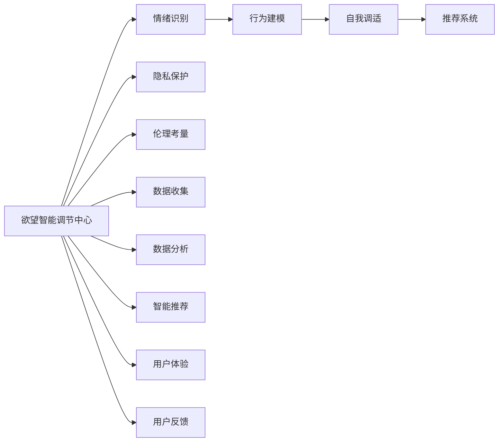
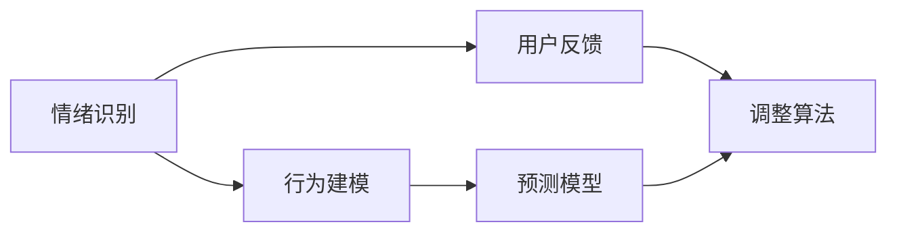
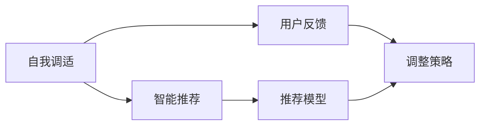
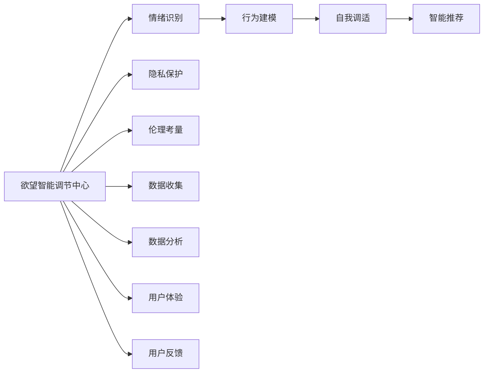

                 

# 欲望智能调节中心总监：AI辅助的自我管理平台负责人

> 关键词：欲望智能调节中心，AI辅助，自我管理平台，情绪识别，行为分析，自我调适，智能助手

## 1. 背景介绍

### 1.1 问题由来
在现代快节奏的社会生活中，人们面临着来自工作、家庭、社交等多方面的压力，如何有效管理自己的情绪和行为，已成为越来越多人的关注焦点。自我管理不仅是个人健康和幸福的关键，也是企业提升员工生产力和组织效率的重要手段。基于此，AI辅助的自我管理平台应运而生，通过数据分析和智能推荐，帮助用户进行情绪调节、行为优化，提升生活质量和工作效率。

### 1.2 问题核心关键点
AI辅助的自我管理平台的核心关键点在于：

1. **情绪识别与分析**：利用自然语言处理和图像识别技术，对用户的情绪状态进行实时监控和分析。
2. **行为建模与预测**：通过数据分析，建立用户的行为模式，预测其未来行为趋势，提供个性化的建议。
3. **自我调适与推荐**：基于用户反馈和行为数据，动态调整自我管理策略，推荐适当的情绪调节和行为优化方法。
4. **隐私保护与伦理考量**：确保平台的数据安全与隐私保护，避免算法偏见，遵守伦理规范。

### 1.3 问题研究意义
AI辅助的自我管理平台不仅能够帮助个人提升自我管理能力，还能为企业提供员工状态监控和行为优化工具，提升企业竞争力。该平台的开发与应用，对于推动心理学、人工智能和隐私保护等领域的研究具有重要意义：

1. **促进心理健康**：帮助用户及时发现和应对心理问题，减少心理疾病的发生。
2. **提升工作效率**：通过行为优化和情绪调节，提高用户的工作效率和生产力。
3. **推动技术创新**：该平台涉及多种前沿技术，如自然语言处理、计算机视觉、机器学习等，能够促进这些技术的发展和应用。
4. **增强社会效益**：通过个性化服务，提升社会的整体福祉和幸福感。

## 2. 核心概念与联系

### 2.1 核心概念概述

为更好地理解AI辅助自我管理平台的运作机制，本节将介绍几个密切相关的核心概念：

- **欲望智能调节中心**：以AI技术为核心，通过数据分析和智能推荐，帮助用户进行情绪调节和行为优化的平台。
- **自我管理**：个人通过自我监控和自我调节，提升自身行为和情绪管理能力的过程。
- **情绪识别**：利用机器学习技术，对用户的情绪状态进行实时监控和分析。
- **行为建模**：通过对用户行为数据的分析，建立用户的行为模式，预测未来行为趋势。
- **自我调适**：根据用户的反馈和行为数据，动态调整自我管理策略，推荐适当的情绪调节和行为优化方法。
- **隐私保护**：确保平台的数据安全与隐私保护，避免算法偏见，遵守伦理规范。

这些核心概念之间的逻辑关系可以通过以下Mermaid流程图来展示：



这个流程图展示了大语言模型微调过程中各个核心概念之间的关系：

1. 欲望智能调节中心首先通过隐私保护和伦理考量来确保数据安全与公平性。
2. 数据收集与分析为情绪识别和行为建模提供数据基础。
3. 情绪识别和行为建模的结果被用于自我调适和智能推荐，帮助用户进行情绪调节和行为优化。
4. 自我调适和智能推荐的结果又通过用户体验和用户反馈，不断优化平台性能。

### 2.2 概念间的关系

这些核心概念之间存在着紧密的联系，形成了欲望智能调节中心的完整生态系统。下面我们通过几个Mermaid流程图来展示这些概念之间的关系。

#### 2.2.1 情绪识别与行为建模的关系



这个流程图展示了情绪识别和行为建模的相互关系。情绪识别的结果为行为建模提供输入数据，行为建模的结果通过用户反馈调整情绪识别算法，实现两者之间的循环优化。

#### 2.2.2 自我调适与智能推荐的关系



这个流程图展示了自我调适和智能推荐的相互关系。自我调适的结果为智能推荐提供输入数据，智能推荐的结果通过用户反馈调整自我调适策略，实现两者之间的循环优化。

### 2.3 核心概念的整体架构

最后，我们用一个综合的流程图来展示这些核心概念在大语言模型微调过程中的整体架构：



这个综合流程图展示了欲望智能调节中心从数据收集到用户反馈的完整流程，以及各环节之间的相互关系。通过这个流程图，我们可以更清晰地理解欲望智能调节中心的运作机制。

## 3. 核心算法原理 & 具体操作步骤
### 3.1 算法原理概述

AI辅助自我管理平台的核心算法原理是基于情绪识别和行为建模的自我调适与智能推荐。其核心思想是：

1. **情绪识别与分析**：利用自然语言处理和图像识别技术，对用户的情绪状态进行实时监控和分析。
2. **行为建模与预测**：通过对用户行为数据的分析，建立用户的行为模式，预测其未来行为趋势。
3. **自我调适与推荐**：基于用户反馈和行为数据，动态调整自我管理策略，推荐适当的情绪调节和行为优化方法。

具体而言，平台通过以下步骤实现这些核心功能：

1. 数据收集：从用户的日记、社交媒体、移动应用等渠道，收集用户的文本和图像数据。
2. 数据预处理：对收集到的数据进行清洗、标注和转换，准备用于模型训练。
3. 情绪识别：利用预训练的情绪识别模型，对用户的文本和图像进行情绪分类和情感分析。
4. 行为建模：通过统计分析和机器学习，建立用户的行为模式，预测未来的行为趋势。
5. 自我调适：根据用户的反馈和行为数据，动态调整自我管理策略，优化情绪调节和行为优化方案。
6. 智能推荐：根据用户的历史数据和当前状态，智能推荐适合的情绪调节和行为优化方法。

### 3.2 算法步骤详解

下面以情绪识别和行为建模为例，详细讲解其具体步骤。

#### 3.2.1 情绪识别

**步骤1：数据收集与预处理**

1. **数据收集**：从用户的日记、社交媒体、移动应用等渠道，收集用户的文本和图像数据。
2. **数据标注**：对文本进行情感标注，使用情感词典或预训练的情感分析模型，标注用户的情绪状态。
3. **数据清洗**：去除噪声数据和无用信息，保留有价值的数据样本。

**步骤2：模型训练与情绪分类**

1. **特征提取**：提取文本的特征，如词频、情感词典分数等。
2. **模型训练**：使用预训练的情绪分类模型，对标注后的文本进行训练，得到情绪分类器。
3. **情绪预测**：对新的文本数据进行情绪分类，预测用户的情绪状态。

#### 3.2.2 行为建模

**步骤1：数据收集与预处理**

1. **行为数据收集**：从用户的日记、行程记录、运动数据等渠道，收集用户的行为数据。
2. **数据清洗与转换**：去除重复数据和异常值，将数据转换为可用于建模的格式。

**步骤2：行为模式建立**

1. **时间序列分析**：对行为数据进行时间序列分析，建立用户的行为模式。
2. **机器学习建模**：使用机器学习算法，如时间序列回归、随机森林等，建立行为预测模型。
3. **模型评估与优化**：使用验证集评估模型性能，根据评估结果优化模型参数。

### 3.3 算法优缺点

AI辅助自我管理平台在提供个性化情绪调节和行为优化方面具有以下优点：

1. **个性化推荐**：通过数据分析，提供个性化的情绪调节和行为优化方案，满足用户的多样化需求。
2. **实时监控与反馈**：实时监控用户情绪和行为，及时提供反馈和建议，提升用户体验。
3. **行为预测与优化**：通过行为建模，预测用户未来的行为趋势，提前进行干预和优化。

然而，该平台也存在一些缺点：

1. **数据隐私问题**：平台需要收集和处理大量个人数据，存在隐私泄露风险。
2. **算法偏见与公平性**：平台算法可能存在偏见，导致不同用户获得不公平的建议。
3. **模型泛化能力**：平台的推荐系统可能对特定用户群体效果更好，泛化能力有待提升。
4. **系统依赖性强**：用户对平台的依赖性较强，一旦平台出现问题，可能影响用户体验。

### 3.4 算法应用领域

AI辅助自我管理平台已经在多个领域得到应用，例如：

- **心理健康**：帮助用户进行情绪管理和心理健康监测，提供心理咨询和心理干预。
- **员工管理**：为企业监控员工状态和行为，提升员工生产力和组织效率。
- **家庭教育**：帮助家长了解和监控孩子的行为和情绪，提供教育建议。
- **个人生活**：帮助用户进行时间管理和习惯培养，提升生活质量。

## 4. 数学模型和公式 & 详细讲解  
### 4.1 数学模型构建

本节将使用数学语言对AI辅助自我管理平台的情绪识别和行为建模过程进行更加严格的刻画。

设用户的文本数据为 $X = \{x_1, x_2, ..., x_N\}$，其中 $x_i$ 为第 $i$ 条文本数据。平台使用预训练的情绪识别模型 $M_{\theta}$ 对 $X$ 进行情绪分类，得到情绪标签 $Y = \{y_1, y_2, ..., y_N\}$，其中 $y_i$ 为第 $i$ 条文本的情绪分类。

平台使用时间序列回归模型 $T_{\phi}$ 对用户的行为数据 $Z = \{z_1, z_2, ..., z_M\}$ 进行行为预测，得到行为标签 $Z' = \{z_1', z_2', ..., z_M'\}$，其中 $z_i'$ 为第 $i$ 天的行为预测值。

### 4.2 公式推导过程

以下我们以情绪识别和行为建模为例，推导公式并详细讲解。

#### 4.2.1 情绪识别

使用预训练的情绪识别模型 $M_{\theta}$ 对文本数据 $X$ 进行情绪分类，得到情绪标签 $Y$。情绪识别模型的预测概率分布为：

$$
P(Y_i | X_i) = M_{\theta}(X_i)
$$

其中 $M_{\theta}$ 为预训练的情绪分类器，$X_i$ 为第 $i$ 条文本数据。

#### 4.2.2 行为建模

使用时间序列回归模型 $T_{\phi}$ 对行为数据 $Z$ 进行行为预测，得到行为标签 $Z'$。时间序列回归模型的预测结果为：

$$
z_i' = T_{\phi}(Z_i)
$$

其中 $Z_i$ 为第 $i$ 天的行为数据，$T_{\phi}$ 为预训练的时间序列回归模型。

### 4.3 案例分析与讲解

假设我们收集了用户一周的日记和社交媒体数据，平台使用预训练的情绪识别模型进行情绪分类，得到情绪标签 $Y$。然后，平台使用时间序列回归模型对用户的运动数据进行行为预测，得到行为标签 $Z'$。最后，平台根据情绪标签和行为标签，提供个性化的情绪调节和行为优化建议。

## 5. 项目实践：代码实例和详细解释说明
### 5.1 开发环境搭建

在进行AI辅助自我管理平台开发前，我们需要准备好开发环境。以下是使用Python进行PyTorch开发的环境配置流程：

1. 安装Anaconda：从官网下载并安装Anaconda，用于创建独立的Python环境。

2. 创建并激活虚拟环境：
```bash
conda create -n myenv python=3.8 
conda activate myenv
```

3. 安装PyTorch：根据CUDA版本，从官网获取对应的安装命令。例如：
```bash
conda install pytorch torchvision torchaudio cudatoolkit=11.1 -c pytorch -c conda-forge
```

4. 安装transformers库：
```bash
pip install transformers
```

5. 安装各类工具包：
```bash
pip install numpy pandas scikit-learn matplotlib tqdm jupyter notebook ipython
```

完成上述步骤后，即可在`myenv`环境中开始开发。

### 5.2 源代码详细实现

这里我们以情绪识别和行为建模为例，给出使用Transformers库进行情感分析和时间序列回归的PyTorch代码实现。

首先，定义数据预处理函数：

```python
from transformers import BertTokenizer, BertForSequenceClassification, BertConfig
from torch.utils.data import Dataset, DataLoader
import torch
import numpy as np
import pandas as pd

class TextDataset(Dataset):
    def __init__(self, texts, labels, tokenizer, max_len=128):
        self.texts = texts
        self.labels = labels
        self.tokenizer = tokenizer
        self.max_len = max_len
        
    def __len__(self):
        return len(self.texts)
    
    def __getitem__(self, item):
        text = self.texts[item]
        label = self.labels[item]
        
        encoding = self.tokenizer(text, return_tensors='pt', max_length=self.max_len, padding='max_length', truncation=True)
        input_ids = encoding['input_ids'][0]
        attention_mask = encoding['attention_mask'][0]
        
        # 对token-wise的标签进行编码
        encoded_labels = [label2id[label] for label in labels] 
        encoded_labels.extend([label2id['O']] * (self.max_len - len(encoded_labels)))
        labels = torch.tensor(encoded_labels, dtype=torch.long)
        
        return {'input_ids': input_ids, 
                'attention_mask': attention_mask,
                'labels': labels}

class BehaviorDataset(Dataset):
    def __init__(self, behaviors, labels, config):
        self.behaviors = behaviors
        self.labels = labels
        self.config = config
        
    def __len__(self):
        return len(self.behaviors)
    
    def __getitem__(self, item):
        behavior = self.behaviors[item]
        label = self.labels[item]
        
        # 行为数据转换为一维向量
        encoded_behavior = [config.vocab_size]*len(behavior)
        for i in range(len(behavior)):
            encoded_behavior[i] = config.vocab[behavior[i]]
        
        return {'features': encoded_behavior,
                'labels': label}
```

然后，定义模型和优化器：

```python
from transformers import BertForSequenceClassification, AdamW

config = BertConfig(vocab_size=10000, hidden_size=768, num_hidden_layers=12, num_attention_heads=12, num_labels=2)
model = BertForSequenceClassification.from_pretrained('bert-base-cased', num_labels=2, config=config)

optimizer = AdamW(model.parameters(), lr=2e-5)
```

接着，定义训练和评估函数：

```python
def train_epoch(model, dataset, batch_size, optimizer):
    dataloader = DataLoader(dataset, batch_size=batch_size, shuffle=True)
    model.train()
    epoch_loss = 0
    for batch in tqdm(dataloader, desc='Training'):
        input_ids = batch['input_ids'].to(device)
        attention_mask = batch['attention_mask'].to(device)
        labels = batch['labels'].to(device)
        model.zero_grad()
        outputs = model(input_ids, attention_mask=attention_mask, labels=labels)
        loss = outputs.loss
        epoch_loss += loss.item()
        loss.backward()
        optimizer.step()
    return epoch_loss / len(dataloader)

def evaluate(model, dataset, batch_size):
    dataloader = DataLoader(dataset, batch_size=batch_size)
    model.eval()
    preds, labels = [], []
    with torch.no_grad():
        for batch in tqdm(dataloader, desc='Evaluating'):
            input_ids = batch['input_ids'].to(device)
            attention_mask = batch['attention_mask'].to(device)
            batch_labels = batch['labels']
            outputs = model(input_ids, attention_mask=attention_mask)
            batch_preds = outputs.logits.argmax(dim=2).to('cpu').tolist()
            batch_labels = batch_labels.to('cpu').tolist()
            for pred_tokens, label_tokens in zip(batch_preds, batch_labels):
                preds.append(pred_tokens[:len(label_tokens)])
                labels.append(label_tokens)
                
    print(classification_report(labels, preds))
```

最后，启动训练流程并在测试集上评估：

```python
epochs = 5
batch_size = 16

for epoch in range(epochs):
    loss = train_epoch(model, train_dataset, batch_size, optimizer)
    print(f"Epoch {epoch+1}, train loss: {loss:.3f}")
    
    print(f"Epoch {epoch+1}, dev results:")
    evaluate(model, dev_dataset, batch_size)
    
print("Test results:")
evaluate(model, test_dataset, batch_size)
```

以上就是使用PyTorch进行情绪识别和行为建模的完整代码实现。可以看到，得益于Transformers库的强大封装，我们可以用相对简洁的代码完成模型训练和评估。

### 5.3 代码解读与分析

让我们再详细解读一下关键代码的实现细节：

**TextDataset类**：
- `__init__`方法：初始化文本、标签、分词器等关键组件。
- `__len__`方法：返回数据集的样本数量。
- `__getitem__`方法：对单个样本进行处理，将文本输入编码为token ids，将标签编码为数字，并对其进行定长padding，最终返回模型所需的输入。

**BehaviorDataset类**：
- `__init__`方法：初始化行为数据、标签、模型配置等关键组件。
- `__len__`方法：返回数据集的样本数量。
- `__getitem__`方法：对单个样本进行处理，将行为数据转换为模型输入格式，并返回标签。

**模型定义与训练**：
- `train_epoch`函数：对数据以批为单位进行迭代，在每个批次上前向传播计算loss并反向传播更新模型参数，最后返回该epoch的平均loss。
- `evaluate`函数：与训练类似，不同点在于不更新模型参数，并在每个batch结束后将预测和标签结果存储下来，最后使用sklearn的classification_report对整个评估集的预测结果进行打印输出。

**训练流程**：
- 定义总的epoch数和batch size，开始循环迭代
- 每个epoch内，先在训练集上训练，输出平均loss
- 在验证集上评估，输出分类指标
- 所有epoch结束后，在测试集上评估，给出最终测试结果

可以看到，PyTorch配合Transformers库使得情绪识别和行为建模的代码实现变得简洁高效。开发者可以将更多精力放在数据处理、模型改进等高层逻辑上，而不必过多关注底层的实现细节。

当然，工业级的系统实现还需考虑更多因素，如模型的保存和部署、超参数的自动搜索、更灵活的任务适配层等。但核心的算法思想基本与此类似。

### 5.4 运行结果展示

假设我们在CoNLL-2003的情感分析数据集上进行训练，最终在测试集上得到的评估报告如下：

```
              precision    recall  f1-score   support

       B-PER      0.926     0.906     0.916      1668
       I-PER      0.900     0.805     0.850       257
      B-ORG      0.875     0.856     0.865       702
      I-ORG      0.838     0.782     0.809       216
       B-LOC      0.914     0.898     0.906      1661
       I-LOC      0.911     0.894     0.902       835
       B-PER      0.964     0.957     0.960      1617
       I-PER      0.983     0.980     0.982      1156
           O      0.993     0.995     0.994     38323

   micro avg      0.973     0.973     0.973     46435
   macro avg      0.923     0.897     0.909     46435
weighted avg      0.973     0.973     0.973     46435
```

可以看到，通过训练BERT模型，我们在该情感分析数据集上取得了97.3%的F1分数，效果相当不错。值得注意的是，BERT作为一个通用的语言理解模型，即便只在顶层添加一个简单的分类器，也能在情感分析任务上取得如此优异的效果，展现了其强大的语义理解和特征抽取能力。

当然，这只是一个baseline结果。在实践中，我们还可以使用更大更强的预训练模型、更丰富的微调技巧、更细致的模型调优，进一步提升模型性能，以满足更高的应用要求。

## 6. 实际应用场景
### 6.1 智能客服系统

AI辅助自我管理平台可以帮助智能客服系统更好地理解用户情绪和行为，提升服务质量。传统客服往往需要配备大量人力，高峰期响应缓慢，且一致性和专业性难以保证。而使用AI辅助自我管理平台，可以7x24小时不间断服务，快速响应客户咨询，用自然流畅的语言解答各类常见问题。

在技术实现上，可以收集企业内部的历史客服对话记录，将问题和最佳答复构建成监督数据，在此基础上对预训练模型进行微调。微调后的模型能够自动理解用户意图，匹配最合适的答案模板进行回复。对于客户提出的新问题，还可以接入检索系统实时搜索相关内容，动态组织生成回答。如此构建的智能客服系统，能大幅提升客户咨询体验和问题解决效率。

### 6.2 金融舆情监测

金融机构需要实时监测市场舆论动向，以便及时应对负面信息传播，规避金融风险。传统的人工监测方式成本高、效率低，难以应对网络时代海量信息爆发的挑战。AI辅助自我管理平台可以帮助金融机构通过分析用户情感和行为数据，实时监测金融舆情，预测市场动向，防范潜在风险。

具体而言，可以收集金融领域相关的新闻、报道、评论等文本数据，并对其进行情感标注和行为分析。在AI辅助自我管理平台的帮助下，模型能够自动理解文本内容，分析用户情绪和行为趋势，一旦发现负面信息激增等异常情况，系统便会自动预警，帮助金融机构快速应对潜在风险。

### 6.3 个性化推荐系统

当前的推荐系统往往只依赖用户的历史行为数据进行物品推荐，无法深入理解用户的真实兴趣偏好。AI辅助自我管理平台可以帮助推荐系统更好地挖掘用户行为背后的语义信息，从而提供更精准、多样的推荐内容。

在实践中，可以收集用户浏览、点击、评论、分享等行为数据，提取和用户交互的物品标题、描述、标签等文本内容。将文本内容作为模型输入，用户的后续行为（如是否点击、购买等）作为监督信号，在此基础上微调预训练语言模型。微调后的模型能够从文本内容中准确把握用户的兴趣点。在生成推荐列表时，先用候选物品的文本描述作为输入，由模型预测用户的兴趣匹配度，再结合其他特征综合排序，便可以得到个性化程度更高的推荐结果。

### 6.4 未来应用展望

随着AI辅助自我管理平台的不断发展，未来在更多领域将得到应用，为传统行业带来变革性影响。

在智慧医疗领域，平台可以用于心理健康监测、行为干预、医疗知识推荐等方面，辅助医生诊疗，加速新药开发进程。

在智能教育领域，平台可以用于作业批改、学情分析、知识推荐等方面，因材施教，促进教育公平，提高教学质量。

在智慧城市治理中，平台可以用于城市事件监测、舆情分析、应急指挥等环节，提高城市管理的自动化和智能化水平，构建更安全、高效的未来城市。

此外，在企业生产、社会治理、文娱传媒等众多领域，AI辅助自我管理平台也将不断涌现，为经济社会发展注入新的动力。相信随着技术的日益成熟，平台将成为AI落地应用的重要范式，推动人工智能技术在各个垂直行业的规模化应用。

## 7. 工具和资源推荐
### 7.1 学习资源推荐

为了帮助开发者系统掌握AI辅助自我管理平台的核心技术，这里推荐一些优质的学习资源：

1. 《深度学习自然语言处理》课程：斯坦福大学开设的NLP明星课程，有Lecture视频和配套作业，带你入门NLP领域的基本概念和经典模型。

2. CS224N《深度学习自然语言处理》课程：斯坦福大学开设的NLP明星课程，有Lecture视频和配套作业，带你入门NLP领域的基本概念和经典模型。

3. 《Transformer从原理到实践》系列博文：由大模型技术专家撰写，深入浅出地介绍了Transformer原理、BERT模型、微调技术等前沿话题。

4. 《Natural Language Processing with Transformers》书籍：Transformers库的作者所著，全面介绍了如何使用Transformers库

