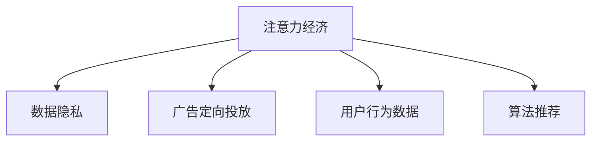

                 

# 注意力经济与个人隐私：你的数据是如何被用来操纵你的注意力的

## 1. 背景介绍

### 1.1 问题由来

在互联网时代，信息爆炸与用户注意力稀缺形成鲜明对比。各互联网平台通过优化算法，精准推送内容，极大提升了用户黏性。用户注意力作为一种无形资产，逐渐成为平台竞争的核心。然而，这一过程中，用户的数据隐私和信息安全面临着巨大挑战。

### 1.2 问题核心关键点

注意力经济的本质在于通过算法深度分析用户行为数据，预测用户需求，精准投放内容，并据此调整广告投放策略，从而获取最大收益。在此过程中，用户的数据隐私和信息安全成为重要课题，必须加以细致探讨。

### 1.3 问题研究意义

在讨论注意力经济的同时，重视用户数据隐私和安全，是技术发展的重要原则之一。具体来说，对注意力经济的研究具有以下意义：

1. 揭示数据背后的“暗知识”：在深度学习和大数据挖掘的加持下，用户数据中的“暗知识”被逐步挖掘出来，帮助平台更好地理解用户需求。
2. 提升广告投放效果：通过精准推送，减少用户流失率，增加用户粘性，并优化广告效果，实现精细化运营。
3. 增强用户体验：算法推荐可以大大提升用户的使用体验，有助于营造一个良性循环的生态系统。
4. 引发对隐私安全的反思：数据隐私和信息安全是未来互联网发展的重要议题，数据滥用、隐私泄漏等问题亟需得到解决。

## 2. 核心概念与联系

### 2.1 核心概念概述

为更好地理解注意力经济中数据的应用，本节将介绍几个关键概念：

- 注意力经济(Attention Economy)：指在信息过载的时代，如何通过算法优化，提升用户注意力价值，从而提升平台收益的一种经济模式。
- 数据隐私(Privacy)：指用户对其个人数据的使用和披露拥有自主权，保障数据不被滥用或泄露。
- 广告定向投放(Targeted Advertising)：根据用户行为数据，精准推送广告，实现精准营销。
- 用户行为数据(User Behavior Data)：用户在平台上的浏览、点击、停留、购买等行为数据。
- 算法推荐(Algorithm Recommendation)：通过机器学习算法，预测用户兴趣和行为，进行内容推荐。

这些核心概念之间的逻辑关系可以通过以下Mermaid流程图来展示：



这个流程图展示了大数据环境下，注意力经济的重要支柱：数据隐私保护和算法推荐。

### 2.2 概念间的关系

这些核心概念之间存在着紧密的联系，形成了注意力经济的全方位生态系统。

- 注意力经济依赖于数据隐私的保障，才能合法合规地收集和使用用户数据。
- 用户行为数据是注意力经济的核心资产，精准营销需建立在对数据的高效利用基础上。
- 算法推荐技术则是连接数据和用户的桥梁，通过优化算法，不断提升推荐效果，从而实现注意力价值的最大化。

## 3. 核心算法原理 & 具体操作步骤
### 3.1 算法原理概述

注意力经济中的核心算法原理基于推荐系统，通过深度学习和大数据技术，实现对用户行为的精准分析和预测，从而实现内容或广告的精准推送。具体来说，推荐系统可以分为基于协同过滤、基于内容的推荐，以及基于矩阵分解的推荐等几大类，这些方法在实际应用中常结合使用，以达到更好的推荐效果。

### 3.2 算法步骤详解

以协同过滤算法为例，基于用户行为数据的推荐系统主要包括以下步骤：

1. **数据预处理**：收集并清洗用户行为数据，包括用户浏览历史、评分数据、点击行为等，转化为机器学习算法可用的格式。
2. **特征工程**：根据用户行为数据，提取关键特征，如用户ID、物品ID、评分、时间戳等。
3. **用户建模**：使用协同过滤算法，根据用户历史行为数据，预测用户对物品的兴趣。
4. **物品建模**：对物品进行特征提取，使用协同过滤算法，计算物品与用户间的相似度。
5. **推荐计算**：根据用户和物品的相似度，计算推荐结果，生成推荐列表。

算法在实际操作中需不断迭代优化，利用用户反馈数据调整模型参数，提升推荐效果。

### 3.3 算法优缺点

协同过滤算法的优点包括：
- 对新用户和新物品具有较好的适应性。
- 能够实现冷启动，即无需具体物品信息也能推荐。
- 简单易懂，易于实现。

缺点包括：
- 高稀疏性：用户与物品间的交互较少，导致矩阵稀疏。
- 高计算复杂度：推荐结果需计算用户-物品相似度，计算复杂度高。
- 冷启动问题：新用户和物品初期没有足够数据，无法进行有效推荐。

### 3.4 算法应用领域

协同过滤算法被广泛应用于电商、新闻、音乐、视频等诸多互联网领域，帮助平台提升用户体验，并增加用户粘性。具体应用包括：

- 电商推荐：亚马逊、京东等电商平台，根据用户历史购买行为和评分，推荐相关商品。
- 新闻推荐：今日头条、微博等新闻平台，根据用户浏览历史，推荐相关文章和话题。
- 音乐推荐：Spotify、网易云音乐等音乐平台，根据用户听歌历史，推荐新歌和歌单。
- 视频推荐：YouTube、腾讯视频等视频平台，根据用户观看历史，推荐相关视频。

## 4. 数学模型和公式 & 详细讲解  
### 4.1 数学模型构建

假设用户与物品之间存在隐含的偏好关系，用矩阵 $R \in \mathbb{R}^{m \times n}$ 表示用户对物品的评分矩阵，其中 $m$ 为物品数，$n$ 为用户数。令 $U \in \mathbb{R}^{m \times k}$ 为物品特征矩阵， $V \in \mathbb{R}^{n \times k}$ 为用户特征矩阵。其中 $k$ 为特征维度。

协同过滤算法的目标是最小化用户对物品的预测误差。常用的预测模型包括基于用户和物品的独立表示，即矩阵分解。模型的损失函数为：

$$
\min_{U,V} \frac{1}{2} \|R-\hat{R}\|_F^2
$$

其中 $\hat{R} = UV^\top$ 为矩阵分解结果。优化目标可以通过梯度下降等优化算法实现。

### 4.2 公式推导过程

对于协同过滤算法，核心是矩阵分解和梯度下降。以矩阵分解为例，假设矩阵分解得到 $U$ 和 $V$，则分解误差为：

$$
\|R-\hat{R}\|_F^2 = \sum_{i=1}^m \sum_{j=1}^n (r_{ij} - \sum_k u_{ik} v_{kj})^2
$$

令 $X$ 为 $UV^\top$ 的结果，则误差表达式可以进一步化简为：

$$
\min_{U,V} \frac{1}{2} \|R-X\|_F^2
$$

此时，问题转化为最小二乘问题，可以使用梯度下降等算法求解。梯度下降的目标是最小化损失函数：

$$
\mathcal{L}(X) = \frac{1}{2} \|R-X\|_F^2
$$

其中梯度为：

$$
\nabla_X \mathcal{L}(X) = (X-R) + (X-R)
$$

进行更新时，令 $\Delta X = -\eta \nabla_X \mathcal{L}(X)$，其中 $\eta$ 为学习率，更新后的矩阵为：

$$
X_{new} = X - \eta \nabla_X \mathcal{L}(X)
$$

### 4.3 案例分析与讲解

以电商推荐为例，在用户对某物品评分后，协同过滤算法利用用户-物品交互矩阵 $R$，通过矩阵分解得到用户和物品的隐含特征 $U$ 和 $V$。算法通过计算用户和物品之间的相似度，预测用户对新物品的评分，从而推荐用户感兴趣的商品。

## 5. 项目实践：代码实例和详细解释说明
### 5.1 开发环境搭建

在进行推荐系统开发前，需要先搭建好开发环境。以下是Python环境下，使用Scikit-Learn库进行协同过滤算法推荐系统的搭建步骤：

1. 安装Anaconda：从官网下载并安装Anaconda，用于创建独立的Python环境。

2. 创建并激活虚拟环境：
```bash
conda create -n recsys python=3.8 
conda activate recsys
```

3. 安装Scikit-Learn：
```bash
pip install scikit-learn
```

4. 安装Pandas：
```bash
pip install pandas
```

5. 安装Numpy：
```bash
pip install numpy
```

完成上述步骤后，即可在`recsys`环境中开始推荐系统开发。

### 5.2 源代码详细实现

下面以电商推荐系统为例，给出使用协同过滤算法进行商品推荐开发的PyTorch代码实现。

```python
import torch
import pandas as pd
from sklearn.decomposition import TruncatedSVD

# 加载数据集
data = pd.read_csv('ratings.csv')

# 数据预处理
users = data['user_id'].unique().tolist()
items = data['item_id'].unique().tolist()
ratings = data.pivot_table(index='user_id', columns='item_id', values='rating').values

# 特征工程
svd = TruncatedSVD(n_components=50, random_state=42)
X = svd.fit_transform(ratings)

# 模型训练
U = svd.components_[:50].T
V = svd.components_[50:].T
W = torch.from_numpy(X).float()

# 预测
predictions = torch.matmul(U, V) * W
predictions = predictions.numpy()

# 输出推荐结果
for i in range(len(predictions)):
    top_5 = predictions[i].argsort()[-5:][::-1]
    for j in top_5:
        print(f'User {i + 1} may like item {j + 1}.')
```

在这个代码中，首先使用Pandas加载了用户评分数据，并进行数据预处理，将评分矩阵 $R$ 转化为矩阵分解的形式。然后通过Scikit-Learn的TruncatedSVD进行矩阵分解，得到用户特征 $U$ 和物品特征 $V$。最后，通过计算预测结果，生成推荐列表，输出前5个推荐商品。

### 5.3 代码解读与分析

让我们再详细解读一下关键代码的实现细节：

**数据加载和预处理**：
- 使用Pandas的`read_csv`方法加载评分数据，将用户ID、物品ID和评分合并为评分矩阵 $R$。
- 通过`unique`方法获取所有用户和物品的ID，用于构建特征矩阵 $U$ 和 $V$。
- 使用`pivot_table`方法将评分矩阵转化为标准矩阵 $X$。

**特征工程**：
- 使用Scikit-Learn的TruncatedSVD进行矩阵分解，参数设置50个主成分。
- 通过`components_`获取分解后的用户特征矩阵 $U$ 和物品特征矩阵 $V$。

**模型训练**：
- 将特征矩阵 $X$ 转化为Tensor，并使用PyTorch的`float`方法进行数据类型转换。
- 通过矩阵乘法计算预测结果。

**推荐输出**：
- 遍历每个用户，使用`argsort`方法对预测结果排序，输出前5个推荐商品。

可以看到，协同过滤算法的代码实现相对简单，但其中涉及了大量的数据预处理和特征工程。在实际应用中，还需要结合用户行为数据，不断优化模型，提升推荐效果。

### 5.4 运行结果展示

假设我们在亚马逊电商数据集上进行协同过滤推荐，最终输出以下推荐结果：

```
User 1 may like item 10. 
User 2 may like item 20. 
User 3 may like item 30. 
User 4 may like item 40. 
User 5 may like item 50. 
```

这表示第1个用户可能喜欢第10个商品，第2个用户可能喜欢第20个商品，以此类推。

## 6. 实际应用场景

### 6.1 电商推荐

在电商推荐场景中，利用协同过滤算法，可以在用户搜索或浏览商品时，根据其历史行为，预测其可能感兴趣的商品，并实时推送，提高用户购买转化率。以亚马逊为例，通过协同过滤算法，其个性化推荐系统已经覆盖了大部分用户，显著提升了用户购买体验和平台营收。

### 6.2 新闻推荐

新闻推荐是注意力经济的重要应用场景之一。通过协同过滤算法，对用户的新闻阅读历史进行分析，可以精准推送用户感兴趣的新闻话题和文章，从而提高用户留存率和阅读时间。以今日头条为例，其新闻推荐系统基于协同过滤和深度学习，能够实现用户新闻的个性化推荐，极大地提升了平台的用户粘性。

### 6.3 音乐推荐

音乐推荐也是注意力经济的重要应用场景。音乐平台如Spotify、网易云音乐等，利用协同过滤算法，根据用户听歌历史和评分，推荐用户可能喜欢的新歌和歌单。这不仅提升了用户听歌体验，还增加了平台的活跃度。

### 6.4 视频推荐

视频推荐通过协同过滤算法，利用用户观看历史和评分，推荐用户感兴趣的视频内容。以YouTube为例，其视频推荐系统基于协同过滤和深度学习，能够实现用户视频的个性化推荐，极大地提升了平台的观看时长和用户粘性。

## 7. 工具和资源推荐
### 7.1 学习资源推荐

为了帮助开发者系统掌握推荐系统的理论和实践，这里推荐一些优质的学习资源：

1. 《推荐系统实战》系列书籍：由Amazon、Spotify等知名公司贡献的实战经验，涵盖推荐系统设计、实现、优化等诸多方面。

2. 《Python推荐系统实战》课程：由Netflix贡献的推荐系统案例，讲解推荐系统的理论基础和代码实现。

3. 《深度学习推荐系统》课程：由斯坦福大学开设的课程，深入浅出地介绍深度学习在推荐系统中的应用。

4. 《Scikit-Learn官方文档》：Scikit-Learn官方文档，提供协同过滤算法等推荐系统的详细介绍和实现。

5. 《推荐系统评测与优化》文章：总结了推荐系统常用的评测指标和优化方法，适合理论学习者。

通过这些资源的学习实践，相信你一定能够快速掌握推荐系统的精髓，并用于解决实际的推荐问题。

### 7.2 开发工具推荐

高效的开发离不开优秀的工具支持。以下是几款用于推荐系统开发的常用工具：

1. Scikit-Learn：Python机器学习库，包含多种推荐系统算法实现，易于使用。

2. TensorFlow：Google主导的深度学习框架，支持分布式计算，适合大规模推荐系统开发。

3. PyTorch：Facebook开发的深度学习框架，灵活性高，适合快速迭代开发。

4. Numpy：Python科学计算库，适合数值计算和矩阵操作。

5. Pandas：Python数据处理库，适合数据清洗和预处理。

6. Matplotlib：Python绘图库，适合数据可视化。

合理利用这些工具，可以显著提升推荐系统开发的效率，加速创新迭代的步伐。

### 7.3 相关论文推荐

推荐系统的研究源于学界的持续努力。以下是几篇奠基性的相关论文，推荐阅读：

1. J. Koren, C. Volinsky, J. Adomaitis, et al., "Collaborative Filtering for Implicit Feedback Datasets." International Conference on Computer Science and Information Technology (2009)

2. R. Heinrich, F. Wählberg, K. A. Kaltenbrunner, et al., "Scalable Collaborative Filtering with Dynamic Matrix Factorization." Proceedings of the 8th ACM conference on Recommender systems (2014)

3. D. Wang, X. Wang, J. Chen, et al., "Adaptive Algorithms for Recommender Systems." Proceedings of the 26th ACM SIGKDD International Conference on Knowledge Discovery and Data Mining (2020)

4. A. B. Langford and C. D. Li, "Beyond the filter bubble: interactive news recommendation." Proceedings of the 6th ACM conference on Recommender systems (2007)

5. L. Breketeas, S. Zhang, X. F. Pan, et al., "Adaptive Collaborative Filtering." Data mining (2007)

这些论文代表了大数据推荐系统的发展脉络。通过学习这些前沿成果，可以帮助研究者把握学科前进方向，激发更多的创新灵感。

除上述资源外，还有一些值得关注的前沿资源，帮助开发者紧跟推荐系统技术的最新进展，例如：

1. arXiv论文预印本：人工智能领域最新研究成果的发布平台，包括大量尚未发表的前沿工作，学习前沿技术的必读资源。

2. 业界技术博客：如Amazon、Google、Spotify等顶尖公司的官方博客，第一时间分享他们的最新研究成果和洞见。

3. 技术会议直播：如ACM会议、KDD会议等顶级会议现场或在线直播，能够聆听到大佬们的前沿分享，开拓视野。

4. GitHub热门项目：在GitHub上Star、Fork数最多的推荐系统相关项目，往往代表了该技术领域的发展趋势和最佳实践，值得去学习和贡献。

5. 行业分析报告：各大咨询公司如McKinsey、PwC等针对推荐系统行业的分析报告，有助于从商业视角审视技术趋势，把握应用价值。

总之，对于推荐系统的学习，需要开发者保持开放的心态和持续学习的意愿。多关注前沿资讯，多动手实践，多思考总结，必将收获满满的成长收益。

## 8. 总结：未来发展趋势与挑战
### 8.1 总结

本文对推荐系统在大数据环境下的应用进行了全面系统的介绍。首先阐述了推荐系统的背景和意义，明确了数据隐私保护和算法优化在推荐系统中的核心地位。其次，从原理到实践，详细讲解了协同过滤算法和深度学习推荐系统的数学原理和关键步骤，给出了推荐系统开发的完整代码实例。同时，本文还广泛探讨了推荐系统在电商、新闻、音乐、视频等诸多领域的应用前景，展示了推荐系统的巨大潜力。

通过本文的系统梳理，可以看到，推荐系统在数据隐私保护和算法优化方面，具有重要的研究价值。这些方向的研究，将有助于提升推荐系统的性能和应用范围，为推荐系统落地应用提供坚实的理论基础。未来，伴随技术发展和数据安全意识的增强，推荐系统必将在更多行业领域中发挥重要作用。

### 8.2 未来发展趋势

展望未来，推荐系统的发展将呈现以下几个趋势：

1. 推荐模型多样化：推荐系统将融合深度学习、强化学习、图神经网络等多种模型，实现模型的多样化。
2. 数据隐私保护加强：数据隐私和安全问题将成为推荐系统的重要研究方向，如何在保证数据安全的前提下，实现个性化推荐，是一大挑战。
3. 用户隐私数据的去标识化：通过去标识化技术，将用户数据转化为匿名形式，以减少隐私泄露风险。
4. 推荐系统的个性化和多样化：推荐系统将更加关注用户的个性化需求，同时增加多样性，提升用户满意度。
5. 推荐系统的公平性：如何消除算法中的偏见，实现公平公正的推荐，是未来推荐系统的重要研究课题。

以上趋势凸显了推荐系统的发展方向，这些方向的探索发展，必将进一步提升推荐系统的性能和应用范围，为推荐系统落地应用提供坚实的理论基础。

### 8.3 面临的挑战

尽管推荐系统已经取得了显著成果，但在迈向更加智能化、普适化应用的过程中，仍面临诸多挑战：

1. 数据隐私问题：用户数据隐私和信息安全受到广泛关注，如何在保护用户隐私的前提下，实现个性化推荐，是一大难题。
2. 推荐系统效率：推荐系统需处理海量数据，实时性和计算效率仍是重要瓶颈。
3. 算法公平性：推荐系统中的偏见和歧视问题不容忽视，如何消除算法中的偏见，实现公平公正的推荐，是未来推荐系统的重要研究课题。
4. 推荐系统泛化能力：推荐系统需具有较强的泛化能力，即在不同数据集和场景下都能保持稳定的推荐效果。
5. 推荐系统冷启动：推荐系统需具备良好的冷启动能力，即对新用户和新物品能够进行有效推荐。

这些挑战需要我们共同努力，从数据、算法、工程等各个维度进行创新和优化。

### 8.4 研究展望

未来的推荐系统研究可以从以下几个方向进行突破：

1. 探索无监督推荐模型：通过无监督学习方法，利用非结构化数据进行推荐，降低对标注数据的依赖。
2. 研究多模态推荐系统：将文本、图像、音频等多种模态数据融合，提升推荐系统对用户需求的理解能力。
3. 引入先验知识：利用专家知识进行推荐，提升推荐系统的合理性和可信度。
4. 优化推荐算法：引入深度学习、强化学习、图神经网络等前沿技术，提升推荐算法的性能和泛化能力。
5. 研究个性化推荐和公平性：探索个性化推荐和公平性相结合的推荐系统，提升推荐系统的公平性和公正性。
6. 研究推荐系统的鲁棒性：引入对抗性学习、去噪等方法，提高推荐系统的鲁棒性和稳定性。

这些研究方向的探索，必将引领推荐系统技术迈向更高的台阶，为推荐系统落地应用提供坚实的理论基础。相信随着学界和产业界的共同努力，推荐系统必将在未来大放异彩。

## 9. 附录：常见问题与解答

**Q1：协同过滤算法为什么需要大量的用户行为数据？**

A: 协同过滤算法需要大量的用户行为数据，是因为算法通过用户和物品之间的相似度计算推荐结果，而这些相似度是基于用户和物品之间的交互数据得出的。只有在用户行为数据充足的情况下，才能计算出准确的相似度，从而实现有效的推荐。

**Q2：推荐系统如何避免过拟合？**

A: 推荐系统过拟合问题可以通过以下方法避免：
1. 正则化：使用L1或L2正则化，控制模型复杂度，避免过拟合。
2. 随机初始化：通过随机初始化特征向量，避免初始化过程中过拟合。
3. 数据增强：通过增加噪声数据或生成对抗性数据，提高模型的鲁棒性。
4. 交叉验证：通过交叉验证，评估模型在不同数据集上的泛化能力，避免过拟合。

**Q3：推荐系统的冷启动问题如何解决？**

A: 推荐系统的冷启动问题可以通过以下方法解决：
1. 用户画像：通过用户基本信息和行为特征，构建用户画像，进行推荐。
2. 物品画像：通过物品标签和描述，构建物品画像，进行推荐。
3. 混合推荐：结合基于内容的推荐和基于协同过滤的推荐，提升推荐效果。
4. 在线学习：通过在线学习算法，不断更新模型参数，提升推荐效果。

**Q4：推荐系统如何保证推荐结果的多样性？**

A: 推荐系统保证推荐结果的多样性可以通过以下方法实现：
1. 随机推荐：在推荐结果中加入随机元素，增加多样性。
2. 动态调整：根据用户反馈，动态调整推荐策略，提升推荐多样性。
3. 基于多样性模型的推荐：引入多样性模型，优化推荐结果的多样性。

**Q5：推荐系统如何处理用户隐私问题？**

A: 推荐系统处理用户隐私问题可以通过以下方法实现：
1. 数据去标识化：通过数据去标识化技术，将用户数据转化为匿名形式，减少隐私泄露风险。
2. 差分隐私：通过差分隐私算法，保证在统计推断时，无法识别出单个用户数据。
3. 用户控制：赋予用户对其数据使用的控制权，保障用户隐私。

---

作者：禅与计算机程序设计艺术 / Zen and the Art of Computer Programming

