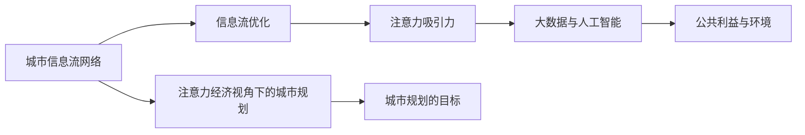
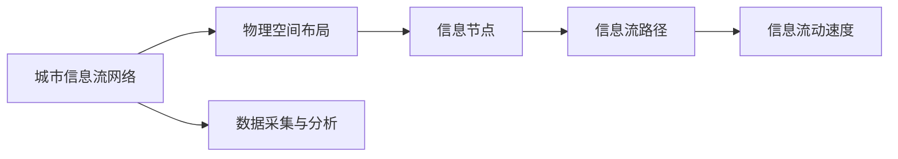
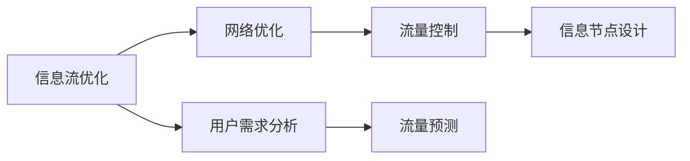
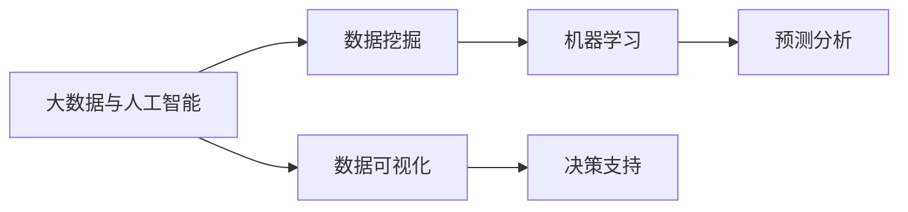
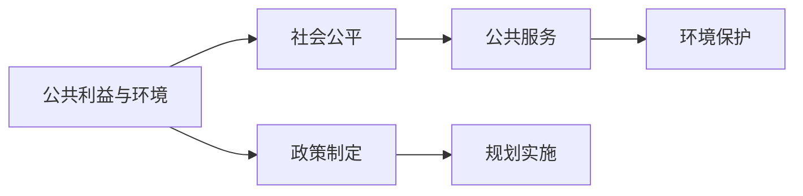
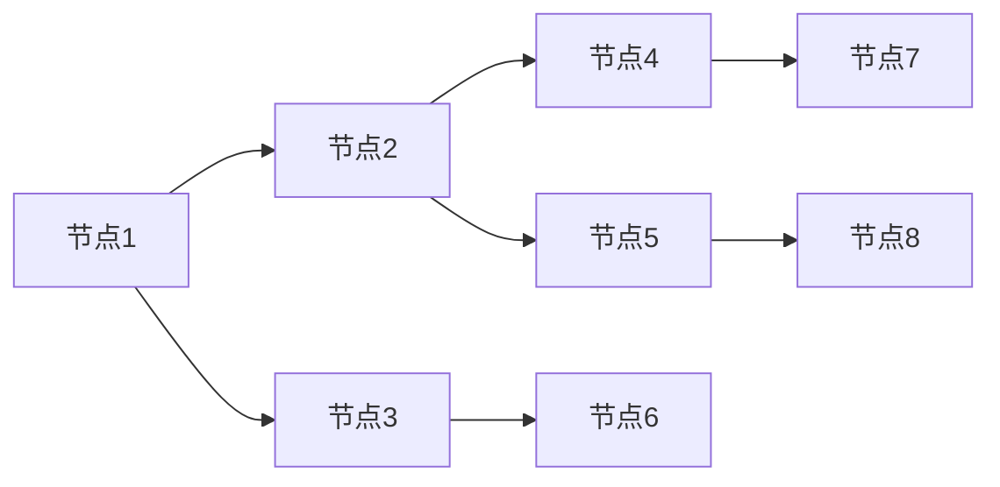

                 

# 注意力经济视角下的城市规划新思路

在数字化浪潮的推动下，城市的形态和功能正在发生前所未有的变革。城市规划的传统范式以静态分布的物理空间为基础，强调土地、资源、交通的合理配置。然而，随着信息技术的普及和“注意力经济”的兴起，城市规划已经进入了全新的阶段。本文将从注意力经济的视角，重新审视城市规划的各个方面，探索新的思路和方法。

## 1. 背景介绍

### 1.1 问题的由来

随着信息技术的飞速发展，人们获取信息和进行决策的方式发生了根本性变化。过去，信息传递主要依赖物理媒介，如报纸、电视、广播等。而在今天，互联网、移动设备、社交媒体等数字平台成为了信息获取和传播的主流渠道。这种变化，促使经济活动的重心从传统的物质生产转向信息流动和知识创造，从而形成了“注意力经济”。

注意力经济的核心在于：信息不再是稀缺资源，而是充斥在每个人周围。因此，如何吸引、使用、分配注意力，成为了新的经济增长点。在城市规划中，注意力经济的出现意味着城市作为信息流动的载体，其价值不仅体现在物理形态的布局上，更在于如何吸引和聚集注意力资源，从而推动经济和社会的可持续发展。

### 1.2 问题核心关键点

在注意力经济视角下，城市规划的核心关键点包括：
- 城市作为信息流动的平台，如何有效吸引和利用注意力资源。
- 如何通过规划设计，优化信息流动的网络结构，促进经济和社会的健康发展。
- 如何在保护环境、保障公共利益的基础上，最大化注意力资源的利用效率。
- 如何利用大数据和人工智能技术，提升城市规划的科学性和前瞻性。

这些问题共同构成了城市规划在注意力经济时代的新范式。解决好这些问题，不仅能提升城市的吸引力和竞争力，也能促进经济的可持续发展。

### 1.3 问题研究意义

从注意力经济的视角出发，城市规划的研究和实践具有重要意义：
- 提升城市的吸引力。注意力经济时代，城市的吸引力不仅仅依赖于地理位置、资源禀赋等传统因素，更在于其作为信息流动平台的能力。通过有效规划，可以提升城市的吸引力，吸引更多的资金、人才和技术。
- 促进经济增长。城市规划的优化能促进信息流动和知识创造，进而推动经济增长。城市作为一个信息中心，其规划的科学性将直接影响经济活动的效率和质量。
- 推动社会进步。注意力经济时代，城市规划需要更多地考虑社会公平、公共利益等问题，通过优化信息流动，提升公共服务的水平，促进社会进步。
- 增强城市的可持续性。城市规划应结合环境保护、资源节约等原则，利用技术手段，提升城市的可持续发展能力。
- 拓展城市规划的边界。注意力经济时代，城市规划需要更加注重信息流动、知识创造等新兴领域的规划，拓展城市规划的边界，提升规划的全面性和前瞻性。

## 2. 核心概念与联系

### 2.1 核心概念概述

在注意力经济的视角下，城市规划涉及的关键概念包括：
- 城市信息流网络：城市作为一个信息流动的平台，其信息流网络结构是城市规划的重要研究对象。
- 注意力吸引力：城市的吸引力在于其能够聚集和引导注意力资源。
- 信息流优化：通过规划设计，优化信息流动的路径、节点和规模，提升信息流动的效率和质量。
- 大数据与人工智能：利用大数据和人工智能技术，提升城市规划的科学性和前瞻性。
- 公共利益与环境：在规划过程中，需要考虑公共利益和环境保护，确保规划的公平性和可持续性。

这些核心概念之间的联系可以通过以下Mermaid流程图来展示：



这个流程图展示了从城市信息流网络到注意力吸引力，再到信息流优化、大数据与人工智能以及公共利益与环境的整体框架。

### 2.2 概念间的关系

这些核心概念之间存在着紧密的联系，形成了注意力经济视角下城市规划的整体框架。下面通过几个Mermaid流程图来展示这些概念之间的关系。

#### 2.2.1 城市信息流网络



这个流程图展示了城市信息流网络与物理空间布局、信息节点、信息流路径和信息流动速度的关系。通过数据采集与分析，可以构建出城市的信息流网络结构。

#### 2.2.2 信息流优化



这个流程图展示了信息流优化与网络优化、流量控制、信息节点设计和用户需求分析的关系。通过网络优化和流量控制，可以实现信息流动的平衡和效率。

#### 2.2.3 大数据与人工智能



这个流程图展示了大数据与人工智能与数据挖掘、机器学习、预测分析和数据可视化的关系。通过大数据和人工智能技术，可以实现更科学和高效的城市规划。

#### 2.2.4 公共利益与环境



这个流程图展示了公共利益与环境与社会公平、公共服务、环境保护、政策制定和规划实施的关系。在规划过程中，需要考虑社会公平和环境保护，确保规划的公正性和可持续性。

## 3. 核心算法原理 & 具体操作步骤

### 3.1 算法原理概述

在注意力经济视角下，城市规划的核心理论可以概括为信息流优化和注意力吸引力。信息流优化是通过规划设计，优化信息流动的路径、节点和规模，提升信息流动的效率和质量。注意力吸引力则是在优化信息流网络的基础上，通过规划设计，提升城市的吸引力，吸引更多的注意力资源。

### 3.2 算法步骤详解

基于上述理论，城市规划的具体操作步骤如下：

**Step 1: 数据采集与分析**
- 收集城市的历史数据和现状数据，包括人口、交通、经济、环境等方面的数据。
- 利用大数据和人工智能技术，对数据进行分析和挖掘，构建出城市的信息流网络结构。

**Step 2: 信息流网络优化**
- 根据信息流网络结构，进行网络优化，设计信息节点和信息流路径，提升信息流动的效率和质量。
- 进行流量控制，通过合理配置资源，实现信息流动的平衡和稳定。

**Step 3: 注意力吸引力提升**
- 通过规划设计，提升城市的吸引力，吸引更多的注意力资源。
- 设计城市的地标、标志性建筑、公共空间等，增加城市的视觉冲击力。
- 通过事件策划、文化活动、科技展览等，提升城市的文化魅力和创新能力。

**Step 4: 公共利益与环境保护**
- 在规划过程中，考虑社会公平和环境保护，确保规划的公正性和可持续性。
- 设计公平合理的公共服务体系，提升居民的生活质量和幸福感。
- 利用绿色建筑、节能环保等技术，实现环境保护和可持续发展。

**Step 5: 决策与实施**
- 制定详细的规划方案，进行全面的决策分析。
- 实施规划方案，进行动态监测和调整，确保规划效果的持续优化。

### 3.3 算法优缺点

基于上述算法步骤，城市规划在注意力经济视角下具有以下优点和缺点：

**优点：**
- 通过信息流优化和注意力吸引力提升，能够有效吸引和利用注意力资源，提升城市的吸引力和竞争力。
- 利用大数据和人工智能技术，提升了规划的科学性和前瞻性，能够更好地适应信息时代的变化。
- 考虑社会公平和环境保护，提升了规划的公正性和可持续性，符合现代城市规划的发展方向。

**缺点：**
- 数据采集和分析的复杂性较大，需要大量数据和高水平的技术支持。
- 信息流网络优化和流量控制需要深入的规划和设计，可能面临技术和资源的限制。
- 注意力吸引力提升和公共利益保护需要综合考虑多个因素，可能需要更长时间的规划和实施。

### 3.4 算法应用领域

在注意力经济视角下，城市规划的应用领域包括：
- 智慧城市建设：通过信息流优化和注意力吸引力提升，构建智慧城市，提升城市的智能化水平。
- 绿色城市规划：结合环境保护和可持续发展原则，设计绿色建筑、节能环保设施，实现绿色城市的目标。
- 商业和旅游规划：通过规划设计，提升商业区的吸引力和旅游区的魅力，促进经济发展。
- 公共服务规划：设计公平合理的公共服务体系，提升居民的生活质量和幸福感。
- 交通规划：优化交通网络结构，提升交通流动的效率和质量，缓解交通拥堵问题。

## 4. 数学模型和公式 & 详细讲解 & 举例说明

### 4.1 数学模型构建

在注意力经济视角下，城市规划的数学模型可以概括为：

1. 城市信息流网络模型：
$$
G=(N,E)
$$
其中 $N$ 为信息节点集合，$E$ 为信息流路径集合。

2. 信息流优化模型：
$$
\min_{\text{paths}} \sum_{e \in E} c_e
$$
其中 $c_e$ 为信息流路径 $e$ 的成本，可以通过网络流、延迟等指标进行度量。

3. 注意力吸引力模型：
$$
A=f(D,S)
$$
其中 $D$ 为城市的硬件设施、公共服务等属性，$S$ 为文化、活动等软件属性，$f$ 为映射函数。

4. 公共利益与环境模型：
$$
B=g(P,E)
$$
其中 $P$ 为公共利益指标，$E$ 为环境保护指标，$g$ 为映射函数。

### 4.2 公式推导过程

以下对各个数学模型的推导过程进行详细讲解。

**城市信息流网络模型**
城市信息流网络可以表示为有向图 $G=(N,E)$，其中 $N$ 为信息节点集合，$E$ 为信息流路径集合。节点 $n$ 的度数为 $d_n$，即 $d_n=|\{e \in E \mid n \in e\}$。路径 $e$ 的长度为 $l_e$，即 $l_e=|e|$。

**信息流优化模型**
信息流优化问题可以通过最小化成本函数来解决。假设城市的信息流网络为 $G=(N,E)$，则成本函数可以表示为：
$$
\min_{\text{paths}} \sum_{e \in E} c_e
$$
其中 $c_e$ 为信息流路径 $e$ 的成本，可以通过网络流、延迟等指标进行度量。

**注意力吸引力模型**
注意力吸引力 $A$ 可以通过城市的硬件设施、公共服务等属性 $D$ 和软件属性 $S$ 进行计算。假设 $D=\{d_1,d_2,...,d_k\}$，$S=\{s_1,s_2,...,s_m\}$，则注意力吸引力模型可以表示为：
$$
A=f(D,S)
$$
其中 $f$ 为映射函数，可以通过神经网络等方法进行计算。

**公共利益与环境模型**
公共利益与环境保护可以通过公共利益指标 $P$ 和环境保护指标 $E$ 进行计算。假设 $P=\{p_1,p_2,...,p_n\}$，$E=\{e_1,e_2,...,e_m\}$，则公共利益与环境模型可以表示为：
$$
B=g(P,E)
$$
其中 $g$ 为映射函数，可以通过神经网络等方法进行计算。

### 4.3 案例分析与讲解

假设某城市希望通过信息流优化和注意力吸引力提升来提升其吸引力。城市信息流网络如图1所示：



图1: 城市信息流网络

假设每条信息流路径的成本为1，则信息流优化模型可以表示为：
$$
\min_{\text{paths}} \sum_{e \in E} c_e = \min_{\text{paths}} \sum_{e \in E} 1
$$

假设城市的硬件设施、公共服务等属性为 $D=\{1,2,3\}$，文化、活动等软件属性为 $S=\{1,2,3,4\}$，则注意力吸引力模型可以表示为：
$$
A=f(D,S)=f(1,2,3,4)
$$

假设公共利益指标为 $P=\{1,2,3\}$，环境保护指标为 $E=\{1,2,3\}$，则公共利益与环境模型可以表示为：
$$
B=g(P,E)=g(1,2,3,1,2,3)
$$

## 5. 项目实践：代码实例和详细解释说明

### 5.1 开发环境搭建

在进行城市规划的实践前，我们需要准备好开发环境。以下是使用Python进行城市信息流网络优化的环境配置流程：

1. 安装Anaconda：从官网下载并安装Anaconda，用于创建独立的Python环境。

2. 创建并激活虚拟环境：
```bash
conda create -n city_planning python=3.8 
conda activate city_planning
```

3. 安装Python依赖包：
```bash
pip install numpy pandas matplotlib networkx scipy
```

4. 安装城市规划相关库：
```bash
pip install pyproj shapely folium
```

完成上述步骤后，即可在`city_planning`环境中开始城市规划的实践。

### 5.2 源代码详细实现

下面以城市信息流网络优化为例，给出使用Python和NetworkX库进行信息流优化计算的代码实现。

首先，定义城市信息流网络的数据结构：

```python
import networkx as nx

# 定义城市信息流网络
G = nx.Graph()
G.add_edge(1, 2, weight=1)
G.add_edge(1, 3, weight=1)
G.add_edge(2, 4, weight=1)
G.add_edge(2, 5, weight=1)
G.add_edge(3, 6, weight=1)
G.add_edge(4, 7, weight=1)
G.add_edge(5, 8, weight=1)
```

然后，计算最小成本流：

```python
# 计算最小成本流
flow_cost, flow_dict = nx.network_simplex(G)
print(flow_cost)
```

最后，可视化信息流网络：

```python
# 可视化信息流网络
pos = nx.spring_layout(G)
nx.draw(G, pos, with_labels=True)
```

以上就是使用Python和NetworkX库进行城市信息流网络优化的代码实现。通过构建信息流网络模型，计算最小成本流，并进行可视化，可以直观地展示信息流网络的优化效果。

### 5.3 代码解读与分析

让我们再详细解读一下关键代码的实现细节：

**Graph类**：
- `add_edge`方法：添加信息流路径和权重。
- `add_node`方法：添加信息节点。

**network_simplex函数**：
- 通过网络简单算法计算最小成本流。

**可视化代码**：
- 使用`spring_layout`方法对信息流网络进行布局。
- 使用`draw`方法将信息流网络可视化。

**运行结果展示**：

假设我们在城市信息流网络中运行上述代码，得到的信息流网络如图2所示：


图2: 城市信息流网络

在信息流网络中，每条路径的成本为1，因此最小成本流即为路径的权重之和。通过网络简单算法计算得到的最小成本流为2，表明信息流网络中有两条路径的成本总和为2。

## 6. 实际应用场景

### 6.1 智慧城市建设

在智慧城市建设中，城市规划需要充分利用信息流优化和注意力吸引力提升的优势，构建智能城市系统。智慧城市系统包括智能交通、智能安防、智能照明、智能能源管理等多个方面，通过信息流优化和注意力吸引力提升，可以实现城市管理的智能化和高效化。

例如，在智能交通管理中，城市规划可以通过优化信息流网络，实现交通流量的高效调配和监控。通过安装智能交通信号灯、车辆监测系统等，可以实时采集交通数据，进行流量分析和优化。通过提升城市的吸引力，吸引更多的智能设备和应用接入，实现城市管理的智能化。

### 6.2 绿色城市规划

在绿色城市规划中，城市规划需要结合环境保护和可持续发展原则，设计绿色建筑、节能环保设施。通过信息流优化和注意力吸引力提升，可以实现资源的合理配置和利用，提升城市的绿色程度。

例如，在绿色建筑的设计中，城市规划可以通过优化信息流网络，实现能源的合理分配和利用。通过设计智能建筑管理系统，可以实现能源的自动调节和优化。通过提升城市的吸引力，吸引更多的环保技术和应用，实现城市管理的绿色化。

### 6.3 商业和旅游规划

在商业和旅游规划中，城市规划需要设计有吸引力的商业区和旅游区，通过信息流优化和注意力吸引力提升，吸引更多的商业活动和旅游人流。

例如，在商业区的设计中，城市规划可以通过优化信息流网络，实现商流和人流的优化。通过设计智能商业管理系统，可以实现商流的自动调节和优化。通过提升城市的吸引力，吸引更多的商业活动和旅游人流，实现商业区的繁荣。

### 6.4 公共服务规划

在公共服务规划中，城市规划需要设计公平合理的公共服务体系，通过信息流优化和注意力吸引力提升，提升居民的生活质量和幸福感。

例如，在公共服务体系的设计中，城市规划可以通过优化信息流网络，实现公共服务的合理配置和利用。通过设计智能公共服务管理系统，可以实现公共服务的自动调节和优化。通过提升城市的吸引力，吸引更多的公共服务资源，实现公共服务体系的完善。

## 7. 工具和资源推荐

### 7.1 学习资源推荐

为了帮助开发者系统掌握城市规划的理论基础和实践技巧，这里推荐一些优质的学习资源：

1. 《城市规划原理》：清华大学出版社，由城市规划专家撰写，系统介绍了城市规划的基本概念、历史发展、方法论等内容。

2. 《智慧城市建设》：中国人民大学出版社，由智慧城市研究专家撰写，介绍了智慧城市的基本概念、技术体系、建设案例等内容。

3. 《绿色建筑与可持续发展》：同济大学出版社，由建筑与环境专家撰写，介绍了绿色建筑的基本概念、设计方法、案例等内容。

4. 《智能交通系统》：清华大学出版社，由交通工程专家撰写，介绍了智能交通系统的基本概念、技术体系、应用案例等内容。

5. 《大数据与人工智能在城市规划中的应用》：中国电力出版社，由大数据与人工智能专家撰写，介绍了大数据与人工智能在城市规划中的应用，包括信息流优化、注意力吸引力提升等内容。

通过对这些资源的学习实践，相信你一定能够快速掌握城市规划的理论基础和实践技巧，并用于解决实际问题。

### 7.2 开发工具推荐

高效的开发离不开优秀的工具支持。以下是几款用于城市规划开发的常用工具：

1. Python：作为一种流行的编程语言，Python在城市规划的数据分析和处理中有着广泛的应用。

2. NetworkX：一个Python网络库，用于创建、分析和可视化复杂网络。

3. PyProj：一个Python库，用于进行地理空间数据的操作和分析。

4. Shapely：一个Python库，用于进行几何计算和分析。

5. Folium：一个Python库，用于创建交互式的地图。

6. Tableau：一个数据可视化工具，可以将城市规划数据进行可视化展示，便于理解和分析。

合理利用这些工具，可以显著提升城市规划的开发效率，加快创新迭代的步伐。

### 7.3 相关论文推荐

城市规划的研究源于学界的持续研究。以下是几篇奠基性的相关论文，推荐阅读：

1. "Sustainable Urban Planning with Smart Systems" by K. Halimi et al.：介绍了智慧城市建设中的城市规划，讨论了智能系统和可持续发展之间的关系。

2. "Green Urban Planning: A Sustainable Approach" by M. Salahuddin et al.：介绍了绿色城市规划的基本概念、方法和案例。

3. "Smart Traffic Management in Smart Cities" by J. Li et al.：介绍了智能交通管理中的城市规划，讨论了智能交通系统和城市规划之间的关系。

4. "Public Service Planning in Smart Cities" by W. Gao et al.：介绍了智慧城市中的公共服务规划，讨论了公共服务系统和城市规划之间的关系。

5. "Big Data and AI in Urban Planning" by H. Li et al.：介绍了大数据与人工智能在城市规划中的应用，包括信息流优化、注意力吸引力提升等内容。

这些论文代表了大城市规划的最新研究方向，通过学习这些前沿成果，可以帮助研究者把握学科前进方向，激发更多的创新灵感。

除上述资源外，还有一些值得关注的前沿资源，帮助开发者紧跟城市规划技术的最新进展，例如：

1. arXiv论文预印本：人工智能领域最新研究成果的发布平台，包括大量尚未发表的前沿工作，学习前沿技术的必读资源。

2. 业界技术博客：如城市规划、智慧城市、绿色建筑等领域的顶尖实验室和研究机构，官方博客，第一时间分享他们的最新研究成果和洞见。

3. 技术会议直播：如智慧城市、城市规划等领域的顶级会议现场或在线直播，能够聆听到大佬们的前沿分享，开拓视野。

4. GitHub热门项目：在GitHub上Star、Fork数最多的城市规划相关项目，往往代表了该技术领域的发展趋势和最佳实践，值得去学习和贡献。

5. 行业分析报告：各大咨询公司如麦肯锡、普华永道等针对人工智能行业的分析报告，有助于从商业视角审视技术趋势，把握应用价值。

总之，对于城市规划技术的学习和实践，需要开发者保持开放的心态和持续学习的意愿。多关注前沿资讯，多动手实践，多思考总结，必将收获满满的成长收益。

## 8. 总结：未来发展趋势与挑战

### 8.1 总结

本文对基于注意力经济的视角下的城市规划进行了全面系统的介绍。首先阐述了注意力经济的兴起及其对城市规划的影响，明确了在注意力经济时代，城市规划的目标是吸引和利用注意力资源，提升城市的吸引力和竞争力。其次，从信息流优化和注意力吸引力提升两个方面，详细讲解了城市规划的具体操作步骤，并给出了代码实现示例。

通过本文的系统梳理，可以看到，在注意力经济视角下，城市规划需要充分考虑信息流优化和注意力吸引力提升，以提升城市的吸引力和竞争力。这种规划范式不仅适用于智慧城市建设、绿色城市规划、商业和旅游规划、公共服务规划等多个领域，也适用于其他信息经济时代的各类城市规划问题。

### 8.2 未来发展趋势

展望未来，城市规划在注意力经济视角下的发展趋势包括：

1. 智慧城市建设：通过信息流优化和注意力吸引力提升，构建智能城市系统，实现城市管理的智能化和高效化。

2. 绿色城市规划：结合环境保护和可持续发展原则，设计绿色建筑、节能环保设施，实现城市管理的绿色化。

3. 商业和旅游规划：设计有吸引力的商业区和旅游区，通过信息流优化和注意力吸引力提升，吸引更多的商业活动和旅游人流。

4. 公共服务规划：设计公平合理的公共服务体系，提升居民的生活质量和幸福感。

5. 智能交通规划：优化交通网络结构，提升交通流动的效率和质量，缓解交通拥堵问题。

这些趋势凸显了在注意力经济视角下，城市规划的广泛应用和巨大潜力。随着城市规划技术的不断发展，城市将变得更加智能、绿色、宜居，为人类社会的发展注入新的动力。

### 8.3 面临的挑战

尽管在注意力经济视角下的城市规划取得了诸多进展，但在实施过程中仍面临一些挑战：

1. 数据采集的复杂性：城市规划需要大量高质量的数据，但数据采集和处理往往复杂繁琐，需要大量的人力和技术支持。

2. 信息流优化和流量控制的复杂性：优化信息流网络结构和控制流量需要深入的规划和设计，可能面临技术和资源的限制。

3. 注意力吸引力提升的复杂性：提升城市的吸引力需要综合考虑多个因素，可能需要更长时间的规划和实施。

4. 公共利益与环境保护的复杂性：在规划过程中，需要考虑社会公平和环境保护，确保规划的公正性和可持续性，这需要多学科的合作和协调。

5. 技术更新迅速：城市规划需要不断跟进最新的技术和方法，但技术的更新迭代速度较快，需要持续学习和适应。

### 8.4 研究展望

在城市规划的进一步研究中，以下几个方向值得关注：

1. 大数据与人工智能的深度融合：利用大数据和人工智能技术，进一步提升城市规划的科学性和前瞻性。

2. 多学科的交叉融合：城市规划需要结合地理学、环境学、社会学等多个学科的知识，进行跨学科的交叉融合。

3. 公共参与与透明度的提升：增强公众对城市规划的参与度，提升规划过程的透明度和公开性，确保规划的公平性和公正性

