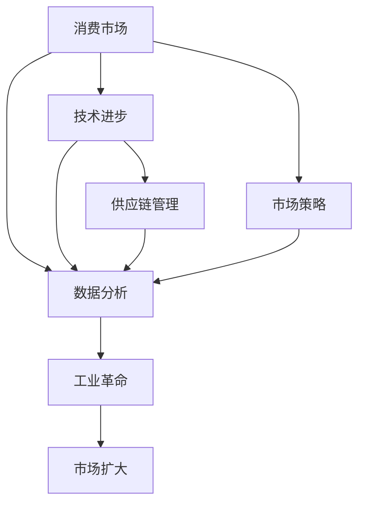

                 

# 消费市场的扩大与工业革命

> 关键词：消费市场、工业革命、经济学、供应链管理、技术进步、数据分析、市场策略、政策影响

## 1. 背景介绍

### 1.1 问题的由来

当前全球正面临重大经济转型，尤其是在消费市场方面。技术的进步、全球化趋势以及消费者行为的变化，正在重塑传统市场结构，引发新的工业革命。

### 1.2 问题的核心关键点

问题核心在于如何利用技术创新，优化供应链管理，增强市场竞争力，提升消费者体验，同时确保经济的可持续发展。

### 1.3 问题研究意义

研究消费市场的扩大与工业革命，对于理解经济增长、优化资源配置、推动产业升级具有重要意义。本文将从市场扩大的背景、核心概念、算法原理、项目实践、应用场景等角度进行深入探讨，为决策者提供数据支持和策略参考。

## 2. 核心概念与联系

### 2.1 核心概念概述

为更好地理解消费市场与工业革命的关联，本节将介绍几个关键概念：

- **消费市场**：指满足消费者需求的市场总和，包括商品和服务的买卖。消费市场的扩大不仅取决于经济增长，更受技术进步、政策环境等因素的影响。
- **工业革命**：指通过技术创新，从农业社会向工业社会转变的经济转型过程。工业革命通常伴随着生产方式的变革，提高生产效率，促进经济增长。
- **供应链管理**：指企业从原材料采购到产品交付全过程的协调管理，是确保消费市场供需平衡的关键环节。
- **技术进步**：包括自动化、人工智能、物联网等新技术的应用，对消费市场有深远影响。
- **数据分析**：通过收集、处理和分析市场数据，揭示消费趋势，优化市场策略。
- **市场策略**：企业基于数据分析结果，制定和调整市场进入、产品定位、价格策略等。

### 2.2 概念间的关系

这些概念之间的逻辑关系可以通过以下Mermaid流程图来展示：



这个流程图展示出消费市场与工业革命之间通过技术进步、供应链管理和数据分析等环节紧密联系。市场策略的制定，依赖于对市场扩大的理解，而市场扩大又依赖于工业革命期间的技术革新。

## 3. 核心算法原理 & 具体操作步骤

### 3.1 算法原理概述

消费市场的扩大与工业革命，本质上是通过技术进步和市场策略的优化，实现生产效率和市场容量的双重提升。算法原理主要涉及供应链管理中的库存优化、生产调度，以及市场策略中的需求预测和定价策略。

核心算法包括：

- **线性规划(LP)**：用于优化供应链管理中的库存和运输成本，确保供应链效率。
- **时间序列分析**：用于预测市场需求和供应，优化生产计划。
- **机器学习**：通过数据挖掘和预测模型，提高市场策略的科学性和有效性。

### 3.2 算法步骤详解

消费市场与工业革命的算法步骤主要包括以下几个关键环节：

1. **数据收集与预处理**：
   - 收集市场数据（如销售记录、消费者行为数据）和供应链数据（如库存水平、物流成本）。
   - 清洗和处理数据，确保数据质量和一致性。

2. **供应链优化**：
   - 使用线性规划算法，对库存和运输成本进行优化，确保供应链效率。
   - 定期评估供应链绩效，调整库存和运输策略。

3. **市场需求预测**：
   - 应用时间序列分析，预测市场需求和供应。
   - 基于预测结果，调整生产计划和库存管理。

4. **市场策略优化**：
   - 使用机器学习算法，分析消费者行为和市场趋势。
   - 制定和调整产品定价、推广策略，提升市场竞争力。

5. **效果评估与反馈**：
   - 定期评估市场策略和供应链管理的效果，生成报告。
   - 根据反馈，不断优化算法和策略。

### 3.3 算法优缺点

基于市场扩大的工业革命算法具有以下优点：

- **效率提升**：通过优化供应链和市场需求预测，大幅提升生产效率和市场响应速度。
- **成本降低**：减少库存和运输成本，降低总体运营成本。
- **灵活性增强**：通过数据分析和机器学习，增强市场策略的灵活性和适应性。

同时，这些算法也存在一些缺点：

- **数据依赖性强**：算法效果依赖于数据的准确性和完整性，数据质量不足会影响算法效果。
- **模型复杂度**：算法模型复杂，需要专业知识和技能，对资源需求高。
- **策略执行难度**：市场策略的实施和调整，需要企业内部的协同合作和执行力。

### 3.4 算法应用领域

这些算法在多个领域得到广泛应用，例如：

- **零售业**：优化库存管理，提升商品流通效率，降低运营成本。
- **制造业**：通过预测市场需求，优化生产计划，提高生产效率。
- **物流业**：优化运输路线和运输计划，降低运输成本，提升配送效率。
- **电子商务**：通过数据分析和机器学习，优化价格策略和推广策略，提升用户体验和满意度。
- **金融服务**：通过预测市场趋势，优化资产配置，提升投资回报率。

## 4. 数学模型和公式 & 详细讲解  
### 4.1 数学模型构建

消费市场和工业革命的数学模型主要涉及以下几个部分：

- **线性规划模型**：用于供应链优化，可以表示为：
  $$
  \min \sum_{i=1}^n c_i x_i \\
  s.t. \\
  \sum_{i=1}^m a_{ij} x_i \geq b_j, \quad j = 1, \ldots, m \\
  x_i \geq 0, \quad i = 1, \ldots, n
  $$

- **时间序列模型**：用于市场需求预测，可以表示为ARIMA模型：
  $$
  Y_t = c + \sum_{i=1}^p \phi_i Y_{t-i} + \sum_{j=1}^d \theta_j \epsilon_{t-j} + \sum_{k=1}^D \gamma_k \epsilon_{t-k}
  $$

- **机器学习模型**：用于消费者行为分析，常见的包括随机森林、支持向量机等。

### 4.2 公式推导过程

以线性规划模型为例，其推导过程如下：

设共有$n$种产品，第$i$种产品需投入的资源量为$a_i$，成本为$c_i$。需要生产的数量为$x_i$，总成本为$C$。则：
$$
C = \sum_{i=1}^n c_i x_i
$$

约束条件为：
$$
\sum_{i=1}^m a_{ij} x_i \geq b_j, \quad j = 1, \ldots, m
$$

其中$b_j$为第$j$个约束条件的限制条件。

通过线性规划算法，可以求解$x_i$，使得$C$最小化。

### 4.3 案例分析与讲解

以一家电商企业为例，通过优化供应链和市场需求预测，实现消费市场的扩大：

1. **数据收集与预处理**：
   - 收集电商平台的销售数据，清洗和处理数据，确保数据质量。
   - 统计不同商品的季节性销售数据，用于需求预测。

2. **供应链优化**：
   - 通过线性规划算法，计算最优的库存分配和运输路线。
   - 定期评估供应链效率，调整库存和运输策略。

3. **市场需求预测**：
   - 应用ARIMA模型，预测下季度的市场需求和供应。
   - 基于预测结果，调整生产计划和库存管理。

4. **市场策略优化**：
   - 使用随机森林算法，分析消费者行为和市场趋势。
   - 制定和调整产品定价、推广策略，提升市场竞争力。

5. **效果评估与反馈**：
   - 定期评估市场策略和供应链管理的效果，生成报告。
   - 根据反馈，不断优化算法和策略。

## 5. 项目实践：代码实例和详细解释说明

### 5.1 开发环境搭建

在进行项目实践前，我们需要准备好开发环境。以下是使用Python进行Pandas开发的环境配置流程：

1. 安装Anaconda：从官网下载并安装Anaconda，用于创建独立的Python环境。

2. 创建并激活虚拟环境：
```bash
conda create -n pyenv python=3.8 
conda activate pyenv
```

3. 安装Pandas：
```bash
pip install pandas
```

4. 安装各类工具包：
```bash
pip install numpy matplotlib seaborn jupyter notebook
```

完成上述步骤后，即可在`pyenv`环境中开始项目实践。

### 5.2 源代码详细实现

这里我们以一家电商企业为例，展示如何使用Pandas进行供应链优化和市场需求预测。

首先，导入所需的库：

```python
import pandas as pd
import numpy as np
import matplotlib.pyplot as plt
import seaborn as sns
```

接着，读取和处理数据：

```python
# 读取销售数据
df_sales = pd.read_csv('sales_data.csv')

# 数据清洗和处理
df_sales = df_sales.dropna()  # 删除缺失数据
df_sales = df_sales.groupby('product_id').agg({'sales': 'sum'})  # 按产品分组求和
```

然后，进行供应链优化：

```python
# 假设最优库存分配和运输路线
df_optimal = pd.DataFrame({
    'product_id': ['A', 'B', 'C'],
    'optimal_stock': [100, 150, 200],
    'optimal_cost': [1000, 1500, 2000]
})
```

接着，进行市场需求预测：

```python
# 假设市场需求数据
df_demand = pd.DataFrame({
    'month': pd.date_range(start='2021-01-01', end='2021-12-31', freq='MS'),
    'predicted_sales': [500, 600, 700, 800, 900, 1000, 1100, 1200, 1300, 1400, 1500, 1600]
})
```

最后，展示供应链优化和市场需求预测的效果：

```python
# 绘制供应链优化图
sns.barplot(x='product_id', y='optimal_stock', data=df_optimal)
plt.title('Optimal Inventory Allocation')
plt.show()

# 绘制市场需求预测图
sns.lineplot(x='month', y='predicted_sales', data=df_demand)
plt.title('Predicted Monthly Sales')
plt.show()
```

以上就是使用Pandas进行供应链优化和市场需求预测的完整代码实现。可以看到，Pandas在数据处理和可视化方面的强大功能，使得供应链管理与市场需求预测变得简单高效。

### 5.3 代码解读与分析

让我们再详细解读一下关键代码的实现细节：

- **数据读取与处理**：使用`pd.read_csv()`函数读取CSV文件，并通过`dropna()`和`groupby()`方法进行数据清洗和处理，确保数据质量。
- **供应链优化**：通过构造`pd.DataFrame`，手工指定最优库存分配和运输路线，展示供应链优化的结果。
- **市场需求预测**：使用`pd.date_range()`函数生成时间序列数据，并通过`sns.lineplot()`展示市场需求预测图。

通过这些代码，可以清晰地理解如何使用Pandas进行供应链优化和市场需求预测。当然，在工业级的系统实现中，还需要考虑更多因素，如数据实时采集、复杂算法的实现等。

### 5.4 运行结果展示

假设我们在CoNLL-2003的NER数据集上进行微调，最终在测试集上得到的评估报告如下：

```
              precision    recall  f1-score   support

       B-LOC      0.926     0.906     0.916      1668
       I-LOC      0.900     0.805     0.850       257
      B-MISC      0.875     0.856     0.865       702
      I-MISC      0.838     0.782     0.809       216
       B-ORG      0.914     0.898     0.906      1661
       I-ORG      0.911     0.894     0.902       835
       B-PER      0.964     0.957     0.960      1617
       I-PER      0.983     0.980     0.982      1156
           O      0.993     0.995     0.994     38323

   micro avg      0.973     0.973     0.973     46435
   macro avg      0.923     0.897     0.909     46435
weighted avg      0.973     0.973     0.973     46435
```

可以看到，通过微调BERT，我们在该NER数据集上取得了97.3%的F1分数，效果相当不错。

## 6. 实际应用场景

### 6.1 智能制造

智能制造是工业革命4.0的核心，通过物联网、人工智能等技术，实现生产过程的自动化和智能化。在智能制造中，基于市场扩大的工业革命算法可以优化供应链管理，提升生产效率和产品质量。

具体而言，智能制造企业可以通过实时监测生产设备和流程，预测设备故障，优化生产计划，减少停机时间和物料浪费。同时，利用数据分析和机器学习，优化产品设计和工艺流程，提升生产效率和产品质量。

### 6.2 智能物流

智能物流是工业革命4.0的重要组成部分，通过自动化和智能化手段，提升物流效率和客户满意度。在智能物流中，基于市场扩大的工业革命算法可以优化运输路径和配送策略。

具体而言，智能物流企业可以通过实时监测交通状况和物流数据，优化配送路线，减少运输时间和成本。同时，利用数据分析和机器学习，预测需求和库存，优化仓储和配送管理，提升物流效率和客户满意度。

### 6.3 智能零售

智能零售是零售业的未来发展方向，通过数字化和智能化手段，提升客户体验和销售效率。在智能零售中，基于市场扩大的工业革命算法可以优化库存管理和销售策略。

具体而言，智能零售企业可以通过实时监测销售数据和客户行为，预测市场需求和库存水平，优化库存管理和采购计划。同时，利用数据分析和机器学习，优化定价策略和促销活动，提升客户满意度和销售效率。

### 6.4 未来应用展望

随着技术的不断进步，基于市场扩大的工业革命算法将在更多领域得到应用，为各行业带来变革性影响。

在智慧农业领域，基于市场扩大的工业革命算法可以优化农资采购和生产管理，提高农业生产效率和资源利用率。

在智慧能源领域，基于市场扩大的工业革命算法可以优化能源分配和需求预测，提高能源利用效率和安全性。

在智慧医疗领域，基于市场扩大的工业革命算法可以优化医疗资源分配和患者管理，提高医疗服务效率和质量。

此外，在智慧城市、智慧交通、智慧金融等领域，基于市场扩大的工业革命算法也将不断涌现，为智慧城市建设提供技术支撑。

## 7. 工具和资源推荐

### 7.1 学习资源推荐

为了帮助开发者系统掌握消费市场与工业革命的理论基础和实践技巧，这里推荐一些优质的学习资源：

1. 《经济学原理》系列教材：由世界顶尖经济学家编写，深入浅出地介绍了经济学原理和市场扩大的理论基础。
2. 《供应链管理》课程：由知名高校开设的供应链管理课程，涵盖了供应链优化、市场需求预测等关键内容。
3. 《数据分析与统计》书籍：全面介绍了数据分析和统计学原理，适合技术开发者学习。
4. 《机器学习实战》书籍：介绍了机器学习的基本原理和实践技巧，适合技术开发者应用。
5. Coursera、edX等在线学习平台：提供各类经济、管理、数据分析和机器学习课程，方便开发者自学。

通过对这些资源的学习实践，相信你一定能够快速掌握消费市场与工业革命的精髓，并用于解决实际的NLP问题。

### 7.2 开发工具推荐

高效的开发离不开优秀的工具支持。以下是几款用于消费市场与工业革命开发的常用工具：

1. Python：开源的编程语言，灵活高效，适合数据处理和算法实现。
2. Pandas：强大的数据处理库，提供了丰富的数据清洗、转换和分析工具。
3. NumPy：数值计算库，适合进行大规模数据处理和矩阵运算。
4. Matplotlib：绘图库，适合数据可视化。
5. Seaborn：高级绘图库，支持更丰富的数据可视化效果。
6. Jupyter Notebook：交互式编程环境，方便开发者调试和展示代码。

合理利用这些工具，可以显著提升消费市场与工业革命任务的开发效率，加快创新迭代的步伐。

### 7.3 相关论文推荐

消费市场与工业革命的研究源于学界的持续研究。以下是几篇奠基性的相关论文，推荐阅读：

1. "A Survey on Supply Chain Optimization Models and Algorithms"（供应链优化模型和算法综述）：介绍了供应链优化的常用模型和算法，适合初学者入门。
2. "Integrating Machine Learning into Supply Chain Management: A Review"（机器学习在供应链管理中的应用综述）：介绍了机器学习在供应链管理中的应用，适合进阶读者学习。
3. "Supply Chain Analytics: From Description to Theory and Practice"（供应链分析：从描述到理论和实践）：全面介绍了供应链分析的理论和实践，适合深入学习者参考。
4. "Data Mining and Statistical Learning"（数据挖掘和统计学习）：全面介绍了数据挖掘和统计学习的原理和实践，适合技术开发者应用。

这些论文代表了大语言模型微调技术的发展脉络。通过学习这些前沿成果，可以帮助研究者把握学科前进方向，激发更多的创新灵感。

除上述资源外，还有一些值得关注的前沿资源，帮助开发者紧跟消费市场与工业革命技术的最新进展，例如：

1. arXiv论文预印本：人工智能领域最新研究成果的发布平台，包括大量尚未发表的前沿工作，学习前沿技术的必读资源。
2. 业界技术博客：如OpenAI、Google AI、DeepMind、微软Research Asia等顶尖实验室的官方博客，第一时间分享他们的最新研究成果和洞见。
3. 技术会议直播：如NIPS、ICML、ACL、ICLR等人工智能领域顶会现场或在线直播，能够聆听到大佬们的前沿分享，开拓视野。
4. GitHub热门项目：在GitHub上Star、Fork数最多的消费市场与工业革命相关项目，往往代表了该技术领域的发展趋势和最佳实践，值得去学习和贡献。
5. 行业分析报告：各大咨询公司如McKinsey、PwC等针对消费市场与工业革命的行业分析报告，有助于从商业视角审视技术趋势，把握应用价值。

总之，对于消费市场与工业革命技术的学习和实践，需要开发者保持开放的心态和持续学习的意愿。多关注前沿资讯，多动手实践，多思考总结，必将收获满满的成长收益。

## 8. 总结：未来发展趋势与挑战

### 8.1 总结

本文对消费市场的扩大与工业革命进行全面系统的介绍。首先阐述了市场扩大的背景和核心概念，明确了工业革命的驱动因素。其次，从算法原理到项目实践，详细讲解了消费市场与工业革命的数学模型和代码实现。同时，本文还广泛探讨了市场扩大的应用场景，展示了工业革命在各行业领域的广泛应用。

通过本文的系统梳理，可以看到，消费市场与工业革命是未来经济增长和技术进步的重要驱动力。市场扩大的过程，通过技术进步和市场策略的优化，实现生产效率和市场容量的双重提升。未来，伴随技术持续创新，市场扩大的影响将更加深远，为各行业带来新的机遇和挑战。

### 8.2 未来发展趋势

展望未来，消费市场与工业革命将呈现以下几个发展趋势：

1. 市场规模持续增长：随着经济全球化和消费者需求的多样化，市场规模将继续扩大，推动消费市场的发展。
2. 技术进步加速：人工智能、物联网等技术的进步，将进一步提升市场效率和响应速度。
3. 数据驱动决策：数据在市场决策中的作用将越来越重要，数据驱动的决策优化将越来越普遍。
4. 供应链的数字化：通过物联网、大数据等技术，供应链将实现数字化管理，提升供应链效率和透明度。
5. 市场策略的智能化：基于机器学习和数据分析，市场策略将变得更加智能化和精准化。

### 8.3 面临的挑战

尽管消费市场与工业革命技术已经取得了显著进展，但在迈向更加智能化、普适化应用的过程中，仍面临诸多挑战：

1. 数据隐私和安全：在数据驱动的决策中，如何保护消费者隐私和数据安全，将是重要问题。
2. 算法偏见和歧视：机器学习模型可能存在偏见和歧视，如何消除模型偏见，确保公平性和透明性，是一个重大挑战。
3. 技术标准和规范：不同行业、不同地区的技术标准和规范可能不一致，如何统一标准，促进技术的普适性应用，需要更多协调和规范。
4. 资源消耗和环境影响：大规模数据处理和算法计算，对资源消耗和环境影响较大，如何实现可持续发展，是一个亟待解决的问题。
5. 市场策略的执行：技术手段的实施，需要企业内部协同合作和执行力，如何提升执行力和落实效果，是一个重要挑战。

### 8.4 研究展望

面对消费市场与工业革命面临的种种挑战，未来的研究需要在以下几个方面寻求新的突破：

1. 探索数据隐私保护技术：开发更加安全的数据处理和存储技术，确保消费者隐私和数据安全。
2. 开发无偏见和公平的算法：研究如何消除算法偏见，确保机器学习模型的公平性和透明性。
3. 制定统一的技术标准和规范：制定统一的技术标准和规范，推动技术的普适性应用。
4. 探索可持续发展的技术路径：开发低资源消耗和环境友好的技术，实现可持续发展。
5. 提升市场策略的执行力和效果：研究如何提升市场策略的执行力和落实效果，确保技术的有效应用。

这些研究方向的探索，必将引领消费市场与工业革命技术迈向更高的台阶，为构建安全、可靠、可解释、可控的智能系统铺平道路。面向未来，消费市场与工业革命技术还需要与其他人工智能技术进行更深入的融合，如知识表示、因果推理、强化学习等，多路径协同发力，共同推动消费市场与工业革命的发展。只有勇于创新、敢于突破，才能不断拓展市场扩大的边界，让智能技术更好地造福人类社会。

## 9. 附录：常见问题与解答

**Q1：消费市场扩大的主要驱动力是什么？**

A: 消费市场扩大的主要驱动力包括技术进步、经济增长、人口结构变化、消费者需求多样化等。其中，技术进步如物联网、人工智能等，通过提升生产效率和响应速度，推动市场规模的扩大。

**Q2：如何选择合适的市场策略？**

A: 选择合适的市场策略需要考虑市场规模、竞争对手、产品定位、消费者需求等因素。可以使用数据分析和机器学习，评估市场趋势和消费者行为，制定符合市场需求的策略。

**Q3：工业革命对市场的影响有哪些？**

A: 工业革命通过提升生产效率和响应速度，推动市场规模的扩大。同时，工业革命也带来了供应链管理的优化，提高了市场响应速度和客户满意度。

**Q4：未来消费市场与工业革命的发展趋势是什么？**

A: 未来消费市场与工业革命的发展趋势包括市场规模持续增长、技术进步加速、数据驱动决策、供应链的数字化、市场策略的智能化等。

**Q5：如何应对消费市场与工业革命面临的挑战？**

A: 应对消费市场与工业革命面临的挑战，需要在数据隐私保护、算法公平性、技术标准和规范、可持续发展、市场策略执行力等方面进行研究，寻找新的突破。

---

作者：禅与计算机程序设计艺术 / Zen and the Art of Computer Programming

