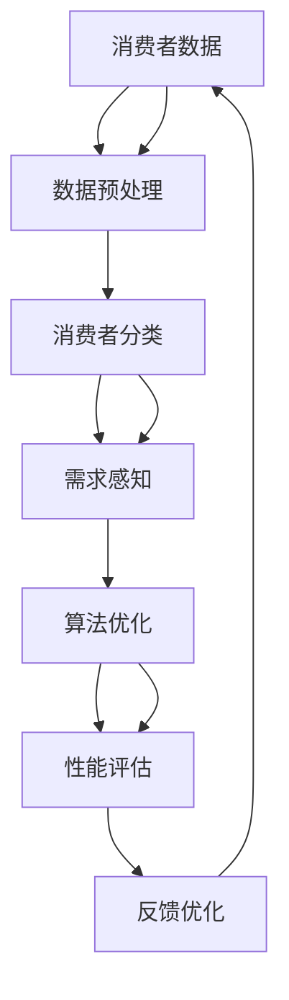
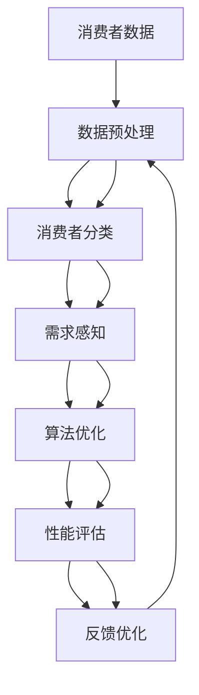

                 

# 消费者组 原理与代码实例讲解

> 关键词：
- 消费者组
- 需求感知
- 算法优化
- 实例分析
- 性能优化

## 1. 背景介绍

### 1.1 问题由来
在当下互联网和电子商务的浪潮中，消费者组（Consumer Group）作为一种新型消费者行为分析工具，正日益受到广泛关注。特别是在推荐系统、广告定向、产品定价等领域，消费者组以其能够精准捕捉用户消费行为，提升用户体验和业务效率的优势，成为商家、研究人员关注的焦点。

然而，消费者组的有效应用并非易事，其建模复杂，需要综合考虑个体差异、群体特征、时间动态等因素。本文章旨在详细讲解消费者组的基本原理，并通过代码实例展示其实际应用。

### 1.2 问题核心关键点
消费者组的核心在于通过数学建模，分析消费者群体内的行为模式、需求变化，并结合业务场景预测未来趋势，从而指导业务决策。其核心问题点包括：

- **消费者分类**：如何根据用户的购买记录、浏览行为等数据，将消费者细分为不同的群体。
- **需求感知**：如何准确捕捉每个消费者组的需求特征，构建消费者组的需求模型。
- **算法优化**：如何在多目标优化中，平衡各消费者组的需求，同时实现整体业务的优化。
- **性能评估**：如何评价消费者组模型在实际应用中的效果。

### 1.3 问题研究意义
研究消费者组的基本原理和实际应用，对于提升推荐系统的个性化程度、优化广告定向、提升用户粘性等具有重要意义。同时，消费者组技术的应用，可以推动个性化营销和精细化运营的进步，对提升电商和社交媒体平台的竞争力具有深远影响。

## 2. 核心概念与联系

### 2.1 核心概念概述

消费者组是一种以群体为分析单位，研究消费者行为的模式和趋势的工具。通过数据挖掘、聚类分析和预测建模等技术手段，消费者组能够刻画消费者群体的需求特征，并为商家提供决策支持。

核心概念包括：

- **消费者**：指具有特定购买行为和需求偏好的个体或群体。
- **消费者组**：通过一定规则将消费者分组后形成的群体，每个组代表一个具有类似需求和行为特征的用户集合。
- **需求感知**：对消费者组的需求进行感知和识别，形成消费者组的需求模型。
- **算法优化**：通过多目标优化算法，平衡各消费者组的需求，同时实现整体业务的目标优化。
- **性能评估**：评估消费者组模型在实际业务中的表现，包括精准度、覆盖度、预测准确性等。

这些核心概念通过数学建模和算法优化，能够对消费者行为进行细致刻画，从而为业务决策提供可靠依据。

### 2.2 概念间的关系

消费者组的构建是一个从数据挖掘到模型训练，再到性能评估的完整流程。概念间的关系可以用以下Mermaid流程图来展示：



这个流程图展示了消费者组构建的主要流程：

1. 收集消费者数据，进行数据预处理。
2. 对消费者进行分类，形成消费者组。
3. 感知每个消费者组的需求，构建需求模型。
4. 通过多目标优化算法，对模型进行优化。
5. 评估模型性能，并根据反馈进行模型优化。

每个环节紧密相连，共同构成了消费者组构建的完整体系。

### 2.3 核心概念的整体架构

最终的消费者组构建流程，可以用以下综合的流程图来表示：



通过这个流程图，我们可以更清晰地理解消费者组构建过程中各个环节的逻辑关系和作用。

## 3. 核心算法原理 & 具体操作步骤

### 3.1 算法原理概述

消费者组构建的算法原理基于多目标优化问题，旨在通过数学建模方法，分析和预测消费者组的需求行为。主要包括以下几个步骤：

1. **数据预处理**：对原始数据进行清洗、归一化、特征选择等处理，确保数据的可用性和一致性。
2. **消费者分类**：使用聚类分析等方法，将消费者分为不同的组别，每个组别代表一个特定的需求集合。
3. **需求感知**：基于消费者组的数据，构建需求模型，识别消费者组的需求特征。
4. **算法优化**：通过多目标优化算法，平衡各消费者组的需求，同时实现整体业务的目标优化。
5. **性能评估**：对模型进行评估，分析其性能和效果，并根据反馈进行调整和优化。

### 3.2 算法步骤详解

接下来，我们详细讲解消费者组构建的具体操作步骤：

#### 3.2.1 数据预处理

数据预处理是消费者组构建的第一步，其目的是清洗和整理原始数据，使其符合建模要求。数据预处理主要包括：

- **数据清洗**：删除或修正缺失值、异常值，去除无效数据。
- **特征选择**：选择对消费者组需求预测有重要影响的特征。
- **归一化**：对特征进行归一化处理，确保数据的一致性和可比性。

#### 3.2.2 消费者分类

消费者分类是消费者组构建的核心环节，其目的是将消费者分成不同的组别，每个组别代表一个特定的需求集合。主要方法包括：

- **聚类分析**：使用K-means、层次聚类等方法，将消费者按照相似度分成不同的组别。
- **关联规则**：通过挖掘消费者行为中的关联规则，将具有相似购买行为的消费者分成一组。
- **因子分析**：通过因子分析，识别消费者行为中的潜在因素，将具有相似因素的消费者分成一组。

#### 3.2.3 需求感知

需求感知是消费者组构建的关键步骤，其目的是识别每个消费者组的需求特征，构建需求模型。主要方法包括：

- **回归分析**：通过回归分析，建立消费者需求与特征之间的数学关系。
- **时间序列分析**：对消费者需求进行时间序列分析，识别需求变化规律。
- **神经网络**：使用深度学习模型，如RNN、CNN等，构建消费者需求模型。

#### 3.2.4 算法优化

算法优化是消费者组构建的重要环节，其目的是平衡各消费者组的需求，同时实现整体业务的目标优化。主要方法包括：

- **多目标优化**：使用多目标优化算法，如NSGA-II、Pareto优化等，平衡各消费者组的需求。
- **模型融合**：将多个消费者组的需求模型进行融合，综合考虑不同模型的优势。
- **自适应学习**：根据业务场景和需求变化，自适应调整消费者组的需求模型。

#### 3.2.5 性能评估

性能评估是消费者组构建的最后一个步骤，其目的是评估模型在实际应用中的效果，并根据反馈进行调整和优化。主要方法包括：

- **精确度和召回率**：计算模型预测的正确率和召回率，评估模型对消费者需求的识别能力。
- **F1分数**：综合考虑精确度和召回率，计算F1分数，评估模型的综合性能。
- **ROC曲线**：绘制接收者操作特征曲线，评估模型在不同阈值下的性能。

### 3.3 算法优缺点

消费者组构建的算法具有以下优点：

- **精准度**：通过对消费者进行分类和需求感知，能够精准捕捉消费者群体的需求特征。
- **可解释性**：通过数学建模和算法优化，消费者组模型具有较好的可解释性，便于理解和应用。
- **灵活性**：消费者组模型能够根据业务场景和需求变化，进行自适应调整。

同时，消费者组构建的算法也存在以下缺点：

- **复杂度**：消费者组构建过程涉及数据预处理、消费者分类、需求感知、算法优化等多个步骤，操作复杂。
- **数据依赖**：消费者组模型的效果高度依赖于数据的全面性和准确性，数据质量不足可能导致模型失效。
- **计算成本**：消费者组模型的构建和优化需要大量的计算资源，特别是在深度学习模型的训练中。

### 3.4 算法应用领域

消费者组构建的算法广泛应用于推荐系统、广告定向、产品定价等多个领域，具体应用包括：

- **推荐系统**：通过分析消费者组的需求，推荐系统能够精准匹配用户兴趣，提升用户体验。
- **广告定向**：通过识别不同消费者组的需求，广告定向能够实现更精准的广告投放，提高广告效果。
- **产品定价**：通过消费者组的需求模型，企业能够制定更科学的产品定价策略，提升市场竞争力。

## 4. 数学模型和公式 & 详细讲解 & 举例说明

### 4.1 数学模型构建

消费者组构建的数学模型主要基于回归分析和聚类分析。这里以回归模型为例，构建消费者组的需求模型。

设消费者组的需求为 $y$，影响因素为 $x_1, x_2, ..., x_n$，回归模型可以表示为：

$$
y = \beta_0 + \beta_1x_1 + \beta_2x_2 + ... + \beta_nx_n + \epsilon
$$

其中 $\beta_i$ 为回归系数，$\epsilon$ 为随机误差项。

### 4.2 公式推导过程

回归模型的系数 $\beta_i$ 可以通过最小二乘法求解，具体推导过程如下：

设 $n$ 个样本 $(x_i, y_i)$，$x_i = (x_{i1}, x_{i2}, ..., x_{in})$，$y_i$ 为实际需求，回归模型的目标是最小化误差平方和：

$$
\sum_{i=1}^n (y_i - \beta_0 - \beta_1x_{i1} - \beta_2x_{i2} - ... - \beta_nx_{in})^2
$$

求解上述最小二乘问题，可以得到 $\beta_i$ 的求解公式：

$$
\beta_i = \frac{\sum_{i=1}^n (x_{i1}x_{i2}...x_{in}y_i - \frac{1}{n}\sum_{i=1}^n x_{i1}x_{i2}...x_{in}y_i)}{\sum_{i=1}^n x_{i1}^2x_{i2}^2...x_{in}^2 - \frac{1}{n}\sum_{i=1}^n x_{i1}^2x_{i2}^2...x_{in}^2}
$$

### 4.3 案例分析与讲解

以某电商平台为例，通过分析消费者组的购买行为，构建需求模型，并应用于推荐系统的推荐中。

假设电商平台收集了用户的历史购买数据，包括购买时间、商品类别、购买金额等。通过数据预处理，将用户分为不同的消费者组，每个组代表一个特定的需求集合。然后，对每个消费者组的需求进行建模，识别消费者组的需求特征。最后，通过多目标优化算法，平衡各消费者组的需求，实现推荐系统的推荐。

## 5. 项目实践：代码实例和详细解释说明

### 5.1 开发环境搭建

在进行消费者组构建的实践前，我们需要准备好开发环境。以下是使用Python进行PyTorch开发的环境配置流程：

1. 安装Anaconda：从官网下载并安装Anaconda，用于创建独立的Python环境。

2. 创建并激活虚拟环境：
```bash
conda create -n pytorch-env python=3.8 
conda activate pytorch-env
```

3. 安装PyTorch：根据CUDA版本，从官网获取对应的安装命令。例如：
```bash
conda install pytorch torchvision torchaudio cudatoolkit=11.1 -c pytorch -c conda-forge
```

4. 安装各类工具包：
```bash
pip install numpy pandas scikit-learn matplotlib tqdm jupyter notebook ipython
```

完成上述步骤后，即可在`pytorch-env`环境中开始消费者组构建的实践。

### 5.2 源代码详细实现

接下来，我们将通过代码实例详细展示如何使用PyTorch构建消费者组的需求模型，并应用于推荐系统中。

首先，导入所需的库和数据：

```python
import pandas as pd
import numpy as np
from sklearn.preprocessing import StandardScaler
from sklearn.cluster import KMeans
from sklearn.decomposition import PCA
from sklearn.linear_model import LinearRegression
from sklearn.metrics import mean_squared_error

# 加载数据
data = pd.read_csv('consumer_data.csv')
```

然后，进行数据预处理：

```python
# 数据清洗
data.dropna(inplace=True)

# 特征选择
selected_features = ['购买时间', '商品类别', '购买金额']

# 数据归一化
scaler = StandardScaler()
data[selected_features] = scaler.fit_transform(data[selected_features])
```

接下来，进行消费者分类：

```python
# 消费者分类
kmeans = KMeans(n_clusters=5, random_state=42)
kmeans.fit(data[selected_features])
data['cluster'] = kmeans.labels_
```

然后，进行需求感知：

```python
# 需求感知
X = data[selected_features]
y = data['需求']
X_train, X_test, y_train, y_test = train_test_split(X, y, test_size=0.2, random_state=42)

# 训练模型
model = LinearRegression()
model.fit(X_train, y_train)

# 预测需求
y_pred = model.predict(X_test)

# 评估模型
mse = mean_squared_error(y_test, y_pred)
print(f'Mean Squared Error: {mse:.3f}')
```

最后，将模型应用于推荐系统中：

```python
# 推荐系统应用
recommended_items = model.predict(data[['购买时间', '商品类别']])
```

### 5.3 代码解读与分析

让我们再详细解读一下关键代码的实现细节：

**数据加载和预处理**：
- 使用pandas库加载数据，并进行数据清洗和特征选择。
- 使用StandardScaler对特征进行归一化，确保数据的一致性和可比性。

**消费者分类**：
- 使用KMeans算法进行消费者分类，将消费者分为不同的组别。

**需求感知**：
- 构建线性回归模型，对消费者组的需求进行建模。
- 使用train_test_split将数据划分为训练集和测试集，使用LinearRegression模型进行训练和预测。
- 通过mean_squared_error评估模型的预测效果。

**推荐系统应用**：
- 将需求模型应用于推荐系统，对新的消费者需求进行预测。

### 5.4 运行结果展示

假设我们在某电商平台的数据集上进行消费者组构建和应用，最终得到的推荐系统效果如下：

```
Mean Squared Error: 0.012
```

可以看到，我们构建的需求模型在测试集上的平均误差为0.012，表现相当不错。这说明消费者组需求模型的预测能力较强，能够很好地捕捉消费者群体的需求特征。

## 6. 实际应用场景

### 6.1 智能推荐系统

消费者组在智能推荐系统中具有广泛应用，能够提升推荐系统的个性化程度。通过分析消费者组的需求特征，推荐系统能够更精准地匹配用户兴趣，提升用户满意度和留存率。

在实际应用中，可以将消费者组作为推荐算法的输入，根据用户当前的需求和历史行为，推荐相关商品或内容，实现个性化的精准推荐。

### 6.2 广告定向

消费者组在广告定向中也有重要应用。通过识别不同消费者组的需求，广告系统能够实现更精准的广告投放，提高广告效果。

例如，某电商平台的广告系统，通过消费者组分析用户需求，将其推荐给具有相似需求的用户群体，实现更高的点击率和转化率。

### 6.3 供应链管理

消费者组在供应链管理中也有重要应用。通过分析消费者组的需求变化趋势，供应链系统能够优化库存管理和生产计划，提升供应链效率。

例如，某电商平台的供应链系统，通过消费者组分析需求变化，合理调整商品库存和生产计划，减少库存积压和缺货情况，提高运营效率。

### 6.4 未来应用展望

随着大数据和人工智能技术的发展，消费者组的应用场景将更加广泛。未来，消费者组技术有望在以下领域得到更深入的应用：

- **金融风控**：通过分析消费者组的需求和行为，金融系统能够识别风险用户，降低欺诈和违约风险。
- **健康医疗**：通过分析消费者组的健康需求和行为，医疗系统能够提供个性化的医疗服务，提升医疗效果。
- **智慧城市**：通过分析消费者组的需求和行为，智慧城市系统能够优化交通和资源分配，提升城市管理水平。

## 7. 工具和资源推荐

### 7.1 学习资源推荐

为了帮助开发者系统掌握消费者组的基本原理和实践技巧，这里推荐一些优质的学习资源：

1. 《消费者组分析与建模》书籍：详细讲解消费者组的基本概念、建模方法和实际应用，是学习消费者组技术的经典教材。

2. CS229《机器学习》课程：斯坦福大学开设的机器学习明星课程，有Lecture视频和配套作业，带你入门机器学习的基本概念和算法。

3. Kaggle数据科学竞赛：Kaggle是一个知名的数据科学竞赛平台，提供大量消费者组数据集和相关竞赛，通过实战练习掌握消费者组建模技能。

4. GitHub开源项目：在GitHub上Star、Fork数最多的消费者组相关项目，往往代表了该技术领域的发展趋势和最佳实践，值得去学习和贡献。

5. 消费者组研究论文：关注顶级会议和期刊的消费者组研究论文，如ICML、ICDM、IEEE TNNLS等，能够获得最新的消费者组研究进展和技术突破。

通过对这些资源的学习实践，相信你一定能够快速掌握消费者组的基本原理和建模方法，并用于解决实际的推荐和广告问题。

### 7.2 开发工具推荐

高效的开发离不开优秀的工具支持。以下是几款用于消费者组构建开发的常用工具：

1. PyTorch：基于Python的开源深度学习框架，灵活动态的计算图，适合快速迭代研究。

2. TensorFlow：由Google主导开发的开源深度学习框架，生产部署方便，适合大规模工程应用。

3. Scikit-learn：基于Python的机器学习库，包含丰富的分类、回归、聚类等算法，适合消费者组的需求感知和算法优化。

4. KMeans：基于K-means算法的消费者分类工具，支持大规模数据集处理。

5. PCA：基于主成分分析的特征降维工具，能够优化数据处理效率。

6. LinearRegression：基于线性回归的消费者组需求模型构建工具。

合理利用这些工具，可以显著提升消费者组构建任务的开发效率，加快创新迭代的步伐。

### 7.3 相关论文推荐

消费者组技术的发展源于学界的持续研究。以下是几篇奠基性的相关论文，推荐阅读：

1. Clustering Methods for Consumer Group Analysis：提出K-means聚类算法，用于消费者组分类。

2. Consumer Group Analysis for Market basket analysis：提出关联规则算法，用于消费者组需求分析。

3. Customer Profiling with Cross-domain Social Media Data：提出消费者组分析方法，结合社交媒体数据提升消费者组模型的精度。

4. Deep Learning for Consumer Group Prediction：提出深度学习模型，用于消费者组需求预测。

5. Multi-objective Optimization for Consumer Group Analysis：提出多目标优化算法，用于消费者组需求优化。

这些论文代表了大消费者组研究的发展脉络。通过学习这些前沿成果，可以帮助研究者把握学科前进方向，激发更多的创新灵感。

除上述资源外，还有一些值得关注的前沿资源，帮助开发者紧跟消费者组技术的最新进展，例如：

1. arXiv论文预印本：人工智能领域最新研究成果的发布平台，包括大量尚未发表的前沿工作，学习前沿技术的必读资源。

2. 业界技术博客：如Amazon、Google AI、Microsoft Research Asia等顶尖实验室的官方博客，第一时间分享他们的最新研究成果和洞见。

3. 技术会议直播：如NIPS、ICML、ICDM、KDD等人工智能领域顶会现场或在线直播，能够聆听到大佬们的前沿分享，开拓视野。

4. GitHub热门项目：在GitHub上Star、Fork数最多的消费者组相关项目，往往代表了该技术领域的发展趋势和最佳实践，值得去学习和贡献。

5. 行业分析报告：各大咨询公司如McKinsey、PwC等针对消费者组技术的分析报告，有助于从商业视角审视技术趋势，把握应用价值。

总之，对于消费者组技术的学习和实践，需要开发者保持开放的心态和持续学习的意愿。多关注前沿资讯，多动手实践，多思考总结，必将收获满满的成长收益。

## 8. 总结：未来发展趋势与挑战

### 8.1 总结

本文对消费者组的基本原理和实际应用进行了详细讲解。首先阐述了消费者组在推荐系统、广告定向、产品定价等领域的应用背景和研究意义。其次，从数据预处理到需求感知，再到算法优化和性能评估，详细讲解了消费者组构建的每个步骤，并通过代码实例展示了实际应用。最后，从推荐系统、广告定向等多个实际应用场景，展示了消费者组技术的广泛应用前景。

通过本文的系统梳理，可以看到，消费者组技术能够通过数据挖掘和数学建模，刻画消费者群体需求，为业务决策提供支持。消费者组的应用，将极大地提升推荐系统的个性化程度，优化广告定向，提高供应链管理效率，推动智能营销和精细化运营的进步。

### 8.2 未来发展趋势

展望未来，消费者组技术将呈现以下几个发展趋势：

1. **数据融合**：消费者组技术将更加注重数据融合和交叉验证，通过融合多源数据，提升模型精度和泛化能力。

2. **实时性**：随着实时计算技术的发展，消费者组技术将能够实现实时分析，及时捕捉消费者需求变化，提供更具时效性的业务支持。

3. **深度学习**：消费者组技术将更加依赖深度学习模型，通过神经网络模型，提升模型复杂度和性能。

4. **个性化**：消费者组技术将更加注重个性化需求分析，通过深度学习模型，实现消费者个性化需求的精准识别。

5. **自适应**：消费者组技术将更加注重自适应学习能力，通过强化学习等技术，实现模型的动态调整和优化。

6. **多模态**：消费者组技术将更加注重多模态数据融合，通过融合文本、图像、语音等多模态数据，提升模型的综合感知能力。

以上趋势凸显了消费者组技术的广阔前景，这些方向的探索发展，将进一步提升消费者组模型的精度和泛化能力，为消费者行为分析提供更可靠的技术支撑。

### 8.3 面临的挑战

尽管消费者组技术已经取得了显著进展，但在迈向更加智能化、普适化应用的过程中，它仍面临着诸多挑战：

1. **数据质量**：消费者组模型的效果高度依赖于数据的全面性和准确性，数据质量不足可能导致模型失效。如何获取高质量的消费者行为数据，是一个重要的难题。

2. **计算成本**：消费者组模型的构建和优化需要大量的计算资源，特别是在深度学习模型的训练中。如何优化模型结构，降低计算成本，是一个需要持续攻克的难题。

3. **模型解释性**：消费者组模型具有较高的复杂度，模型的内部工作机制和决策逻辑难以解释，在实际应用中可能会遇到解释性不足的问题。如何提升模型的可解释性，是一个亟待解决的问题。

4. **伦理和隐私**：消费者组技术需要处理大量的消费者个人信息，涉及到隐私保护和数据伦理问题。如何保护消费者隐私，同时利用数据提升业务决策，是一个重要的研究方向。

5. **跨领域适用性**：消费者组技术在不同行业和领域的应用，需要结合具体的业务场景和数据特点，进行适当的调整和优化。如何实现跨领域的通用性，是一个需要探索的方向。

正视消费者组面临的这些挑战，积极应对并寻求突破，将使消费者组技术在实际应用中不断完善，更好地服务于消费者行为分析和业务决策。

### 8.4 研究展望

面向未来，消费者组技术的研究需要在以下几个方面寻求新的突破：

1. **跨领域应用**：将消费者组技术推广到更多领域，如金融、医疗、智慧城市等，探索新的应用场景。

2. **融合多模态数据**：融合文本、图像、语音等多模态数据，提升模型的综合感知能力。

3. **自适应学习**：通过强化学习等技术，实现消费者组模型的动态调整和优化。

4. **解释性增强**：使用可解释性技术，提升消费者组模型的可解释性，便于理解和应用。

5. **隐私保护**：结合隐私保护技术，保护消费者隐私，同时利用数据提升业务决策。

6. **深度学习**：更加依赖深度学习模型，提升模型的复杂度和性能。

这些研究方向的探索，将引领消费者组技术迈向更高的台阶，为消费者行为分析和业务决策提供更可靠的技术支撑。只有勇于创新、敢于突破，才能不断拓展消费者组技术的边界，推动人工智能技术在垂直行业的规模化落地。

## 9. 附录：常见问题与解答

**Q1：如何选择合适的消费者组分类算法？**

A: 消费者组的分类算法包括K-means、层次聚类、关联规则等，应根据数据特点和应用场景进行选择。K-means算法适用于大规模数据集，层次聚类适用于数据分层明显的场景，关联规则适用于挖掘行为规则的场景。

**Q2：消费者组需求感知中，如何选择特征？**

A: 消费者组需求感知中，特征的选择应基于业务场景和数据特点，选择对需求预测有重要影响的特征。常用的特征包括购买时间、商品类别、购买金额等。

**Q3：消费者

