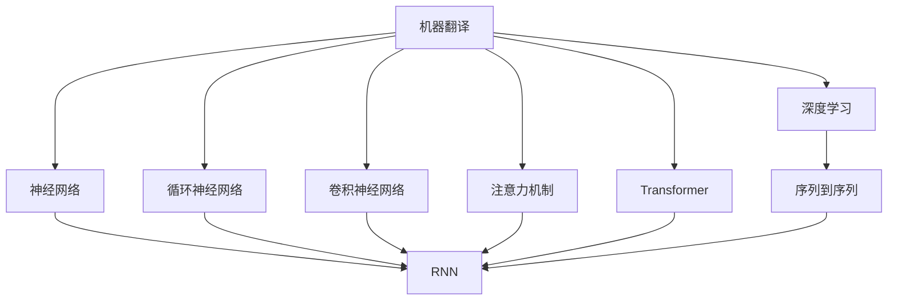
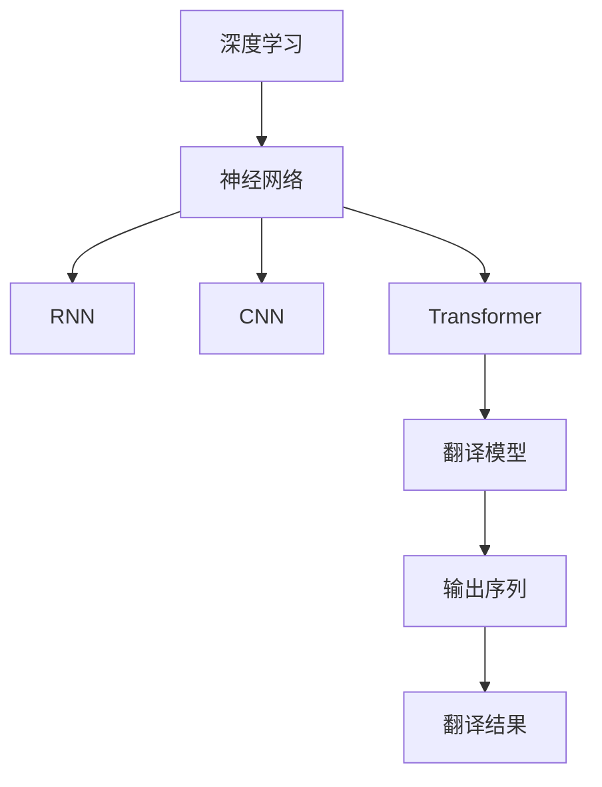
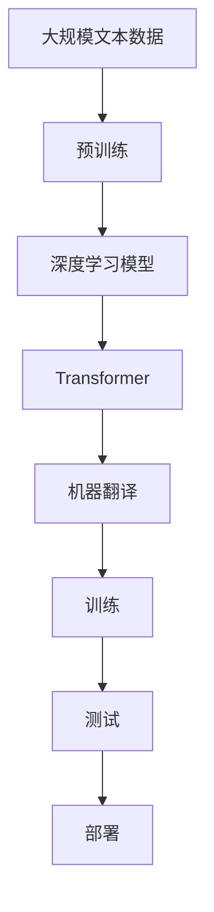

                 

# 深度学习在机器翻译中的应用

> 关键词：机器翻译,深度学习,神经网络,Transformer,自回归,自编码,注意力机制,序列到序列,端到端

## 1. 背景介绍

### 1.1 问题由来
机器翻译（Machine Translation, MT）是自然语言处理（Natural Language Processing, NLP）领域的重要研究方向之一，旨在实现一种语言到另一种语言的自动翻译。传统的机器翻译方法主要依赖于规则、统计和符号等基础，但在准确性和流畅性方面均存在一定局限。随着深度学习技术的发展，基于神经网络的机器翻译方法在准确性、效率和可扩展性等方面取得了显著突破，尤其是在谷歌、微软、Facebook等科技巨头的推动下，神经机器翻译（Neural Machine Translation, NMT）方法成为了MT领域的主流技术。

### 1.2 问题核心关键点
机器翻译的本质是将源语言文本（输入序列）映射到目标语言文本（输出序列）。基于深度学习的机器翻译方法，通过大规模双语语料库进行端到端（End-to-End）训练，学习到输入和输出序列之间的映射关系。其主要方法包括基于循环神经网络（RNN）、卷积神经网络（CNN）和注意力机制（Attention Mechanism）的模型，其中Transformer模型是目前最先进且应用广泛的翻译模型。

## 2. 核心概念与联系

### 2.1 核心概念概述

为更好地理解深度学习在机器翻译中的应用，本节将介绍几个密切相关的核心概念：

- **机器翻译(Machine Translation, MT)**：将一种语言的文本自动翻译成另一种语言的过程，是自然语言处理领域的重要应用之一。
- **深度学习(Deep Learning, DL)**：一类基于神经网络的机器学习方法，通过多层非线性变换捕捉数据中的复杂关系，如图像、语音、文本等。
- **神经网络(Neural Network, NN)**：由节点（神经元）和连接组成的网络结构，用于模拟人脑的神经网络。
- **循环神经网络(Recurrent Neural Network, RNN)**：一种能够处理序列数据的神经网络，通过时间步数累积信息，常用于文本生成、时间序列预测等任务。
- **卷积神经网络(Convolutional Neural Network, CNN)**：一种用于图像识别、处理等任务的网络结构，通过卷积和池化操作提取特征。
- **注意力机制(Attention Mechanism)**：一种在序列到序列模型中，用于动态权衡输入序列各部分与输出序列的相关性的机制。
- **Transformer**：一种基于注意力机制的神经网络结构，广泛应用于NLP领域的序列到序列任务，包括机器翻译。
- **序列到序列(Sequence-to-Sequence, Seq2Seq)**：一类将输入序列映射到输出序列的任务，如机器翻译、文本摘要、对话系统等。

这些核心概念之间的逻辑关系可以通过以下Mermaid流程图来展示：



这个流程图展示了几类核心概念及其之间的关系：

1. 机器翻译依赖于深度学习技术。
2. 深度学习通过神经网络等架构实现。
3. 循环神经网络、卷积神经网络和注意力机制是神经网络中的重要组成部分。
4. Transformer是深度学习在NLP领域的一种成功应用，广泛应用于序列到序列任务。
5. 序列到序列任务是机器翻译等NLP应用的核心。

### 2.2 概念间的关系

这些核心概念之间存在着紧密的联系，形成了深度学习在机器翻译应用中的完整生态系统。下面我通过几个Mermaid流程图来展示这些概念之间的关系。

#### 2.2.1 机器翻译的基本范式


这个流程图展示了机器翻译的基本流程，即输入序列经过翻译模型，输出目标语言序列，形成最终翻译结果。

#### 2.2.2 深度学习在机器翻译中的应用



这个流程图展示了深度学习在机器翻译中的应用，通过不同的神经网络架构实现序列到序列的翻译任务。

#### 2.2.3 注意力机制在机器翻译中的作用


这个流程图展示了Transformer中注意力机制在编码器和解码器中的作用，通过动态调整注意力权重，提高翻译的准确性。

### 2.3 核心概念的整体架构

最后，我们用一个综合的流程图来展示这些核心概念在大语言模型微调过程中的整体架构：



这个综合流程图展示了从预训练到机器翻译的完整过程。深度学习模型首先在大规模文本数据上进行预训练，然后通过Transformer模型进行机器翻译任务的训练和测试，最后将模型部署到实际应用场景中。

## 3. 核心算法原理 & 具体操作步骤

### 3.1 算法原理概述

深度学习在机器翻译中的应用主要基于神经网络的结构，尤其是Transformer模型。Transformer模型使用自注意力（Self-Attention）机制，避免了循环神经网络中的梯度消失和梯度爆炸问题，可以并行计算，显著提升了模型的训练和推理效率。

Transformer模型的核心思想是通过多头自注意力机制和位置编码（Positional Encoding）来捕捉输入序列和输出序列之间的依赖关系。具体来说，Transformer模型包含两个主要部分：编码器（Encoder）和解码器（Decoder）。编码器接收输入序列，解码器生成输出序列。

### 3.2 算法步骤详解

Transformer模型的训练通常包括以下几个关键步骤：

1. **数据预处理**：将输入序列和输出序列进行编码和解码，生成Tensor形式的输入张量。
2. **编码器训练**：使用编码器对输入序列进行编码，生成中间表示（Hidden Representation）。
3. **解码器训练**：使用解码器对中间表示进行解码，生成输出序列。
4. **优化器训练**：通过优化器（如Adam、SGD等）更新模型参数，最小化损失函数。
5. **评估和测试**：在验证集和测试集上评估模型性能，进行模型调优。

### 3.3 算法优缺点

Transformer模型在机器翻译领域的应用具有以下优点：

- 并行计算能力：Transformer模型使用多头自注意力机制，可以并行计算，大大提升了训练和推理效率。
- 注意力机制：通过动态调整注意力权重，Transformer模型可以更好地捕捉长距离依赖关系，提高翻译质量。
- 端到端训练：Transformer模型可以实现端到端的训练，避免了传统方法中的中间表示过程，简化了模型结构。

同时，Transformer模型也存在以下缺点：

- 计算资源需求高：由于Transformer模型的参数量较大，对计算资源需求较高。
- 对长句处理困难：Transformer模型在处理长句时，可能会因注意力机制而产生信息丢失或注意力分布不均等问题。
- 模型复杂度高：Transformer模型设计复杂，调试和优化难度大。

### 3.4 算法应用领域

Transformer模型已经在机器翻译、语音识别、图像描述生成、文本摘要等多个领域得到广泛应用，以下是几个典型的应用场景：

- **机器翻译**：将一种语言自动翻译成另一种语言，广泛应用于跨境电商、国际会议等场景。
- **语音识别**：将语音信号转换为文本，用于语音助手、智能客服等应用。
- **图像描述生成**：根据图像生成文本描述，应用于图像搜索、自动标注等场景。
- **文本摘要**：对长文本进行压缩和总结，生成简洁的摘要文本，应用于新闻、文献等领域。

这些应用场景展示了Transformer模型在深度学习中的广泛应用，其优秀的性能和高效的并行计算能力，使其成为NLP领域的重要工具。

## 4. 数学模型和公式 & 详细讲解

### 4.1 数学模型构建

Transformer模型是一种基于注意力机制的神经网络结构，用于处理序列到序列的任务。其数学模型主要由编码器、解码器、多头注意力机制和位置编码组成。

记输入序列为 $x = \{x_1, x_2, ..., x_n\}$，输出序列为 $y = \{y_1, y_2, ..., y_m\}$，编码器输出为 $H$，解码器输出为 $O$。Transformer模型的数学模型可表示为：

$$
H = E(x)
$$

$$
O = D(H, y)
$$

其中 $E$ 和 $D$ 分别为编码器和解码器，$y$ 为解码器序列中的位置。

### 4.2 公式推导过程

Transformer模型的核心部分是自注意力机制。自注意力机制通过计算输入序列中每个位置与其它位置之间的注意力权重，动态捕捉序列之间的依赖关系。

以Transformer模型中的编码器为例，其自注意力机制可以表示为：

$$
a_{ij} = \frac{\exp(\text{softmax}(QK^T))}{\sum_{k=1}^K \exp(\text{softmax}(QK^T))}
$$

其中 $Q$ 为查询向量，$K$ 为键向量，$V$ 为值向量，$\text{softmax}$ 为归一化操作。通过矩阵运算，自注意力机制可以高效计算出注意力权重，用于动态捕捉输入序列中的依赖关系。

### 4.3 案例分析与讲解

下面以谷歌的Transformer模型为例，详细讲解其在机器翻译中的应用。

谷歌的Transformer模型包含一个编码器和一个解码器。编码器由多个层组成，每层包括多头自注意力层和前馈神经网络（Feedforward Neural Network, FFN）。解码器同样由多个层组成，每层包括多头自注意力层、多头交叉注意力层和FFN。

Transformer模型的训练过程分为以下几个步骤：

1. **数据预处理**：将输入序列和输出序列进行编码和解码，生成Tensor形式的输入张量。
2. **编码器训练**：使用编码器对输入序列进行编码，生成中间表示（Hidden Representation）。
3. **解码器训练**：使用解码器对中间表示进行解码，生成输出序列。
4. **优化器训练**：通过优化器（如Adam、SGD等）更新模型参数，最小化损失函数。
5. **评估和测试**：在验证集和测试集上评估模型性能，进行模型调优。

## 5. 项目实践：代码实例和详细解释说明

### 5.1 开发环境搭建

在进行深度学习在机器翻译中的应用实践前，我们需要准备好开发环境。以下是使用Python进行TensorFlow开发的环境配置流程：

1. 安装Anaconda：从官网下载并安装Anaconda，用于创建独立的Python环境。

2. 创建并激活虚拟环境：
```bash
conda create -n tf-env python=3.8 
conda activate tf-env
```

3. 安装TensorFlow：根据CUDA版本，从官网获取对应的安装命令。例如：
```bash
conda install tensorflow==2.6 
```

4. 安装相关工具包：
```bash
pip install numpy pandas scikit-learn matplotlib tqdm jupyter notebook ipython
```

完成上述步骤后，即可在`tf-env`环境中开始深度学习在机器翻译中的应用实践。

### 5.2 源代码详细实现

下面我们以谷歌的Transformer模型为例，给出使用TensorFlow实现机器翻译的代码实现。

```python
import tensorflow as tf
from tensorflow.keras import layers

class Transformer(tf.keras.Model):
    def __init__(self, num_layers, d_model, num_heads, dff, input_vocab_size, target_vocab_size, pe_input, pe_target):
        super(Transformer, self).__init__()
        self.encoder = Encoder(num_layers, d_model, num_heads, dff, input_vocab_size, pe_input)
        self.decoder = Decoder(num_layers, d_model, num_heads, dff, target_vocab_size, pe_target)
        self.final_layer = layers.Dense(target_vocab_size)
    
    def call(self, x, y, training=False):
        enc_padding_mask = create_padding_mask(x)
        dec_padding_mask = create_padding_mask(y)
        look_ahead_mask = create_look_ahead_mask(tf.shape(y)[1])
        enc_output = self.encoder(x, enc_padding_mask)
        dec_output = self.decoder(y, enc_output, dec_padding_mask, look_ahead_mask)
        dec_output = self.final_layer(dec_output)
        return dec_output

class Encoder(tf.keras.Model):
    def __init__(self, num_layers, d_model, num_heads, dff, input_vocab_size, pe_input):
        super(Encoder, self).__init__()
        self.layers = [EncoderLayer(d_model, num_heads, dff) for _ in range(num_layers)]
        self.pe_input = pe_input
        self.d_model = d_model
    
    def call(self, x, enc_padding_mask):
        for i in range(len(self.layers)):
            x = self.layers[i](x, enc_padding_mask)
        return x

class Decoder(tf.keras.Model):
    def __init__(self, num_layers, d_model, num_heads, dff, target_vocab_size, pe_target):
        super(Decoder, self).__init__()
        self.layers = [DecoderLayer(d_model, num_heads, dff) for _ in range(num_layers)]
        self.pe_target = pe_target
        self.final_layer = layers.Dense(target_vocab_size)
    
    def call(self, y, enc_output, dec_padding_mask, look_ahead_mask):
        for i in range(len(self.layers)):
            y = self.layers[i](y, enc_output, dec_padding_mask, look_ahead_mask)
        y = self.final_layer(y)
        return y

class DecoderLayer(tf.keras.Model):
    def __init__(self, d_model, num_heads, dff):
        super(DecoderLayer, self).__init__()
        self.attention = MultiHeadAttention(d_model, num_heads)
        self.ffn = FeedForwardNetwork(d_model, dff)
        self.layernorm1 = layers.LayerNormalization(epsilon=1e-6)
        self.layernorm2 = layers.LayerNormalization(epsilon=1e-6)
    
    def call(self, x, enc_output, dec_padding_mask, look_ahead_mask):
        attn_output = self.attention(x, enc_output, dec_padding_mask, look_ahead_mask)
        ffn_output = self.ffn(self.layernorm1(x + attn_output))
        dec_output = self.layernorm2(x + ffn_output)
        return dec_output

class MultiHeadAttention(tf.keras.layers.Layer):
    def __init__(self, d_model, num_heads):
        super(MultiHeadAttention, self).__init__()
        self.num_heads = num_heads
        self.d_model = d_model
    
    def split_heads(self, x, batch_size):
        x_shape = tf.shape(x)
        seq_len = x_shape[1]
        batch_size = tf.shape(x)[0]
        return tf.reshape(x, (batch_size, seq_len, self.num_heads, self.d_model // self.num_heads))

    def call(self, q, k, v, dec_padding_mask, look_ahead_mask):
        q = self.split_heads(q, batch_size)
        k = self.split_heads(k, batch_size)
        v = self.split_heads(v, batch_size)
        scaled_attention = self.scaled_dot_product_attention(q, k, v, dec_padding_mask, look_ahead_mask)
        concat_attention = tf.reshape(scaled_attention, (batch_size, seq_len, self.d_model))
        return concat_attention
    
    def scaled_dot_product_attention(self, q, k, v, dec_padding_mask, look_ahead_mask):
        matmul_qk = tf.matmul(q, k, transpose_b=True)
        dk = tf.cast(tf.shape(k)[-1], tf.float32)
        scaled_attention_logits = matmul_qk / tf.math.sqrt(dk)
        if dec_padding_mask is not None:
            scaled_attention_logits += (dec_padding_mask * -1e9)
        attention_weights = tf.nn.softmax(scaled_attention_logits, axis=-1)
        output = tf.matmul(attention_weights, v)
        return output

class FeedForwardNetwork(tf.keras.layers.Layer):
    def __init__(self, d_model, dff):
        super(FeedForwardNetwork, self).__init__()
        self.intermediate = layers.Dense(dff, activation='relu')
        self.output = layers.Dense(d_model)
    
    def call(self, x):
        attn_output = self.intermediate(x)
        ffn_output = self.output(attn_output)
        return ffn_output

def create_look_ahead_mask(seq_len):
    return 1.0 - tf.cast(tf.range(seq_len)[None, :] < tf.range(seq_len)[:, None], tf.float32)

def create_padding_mask(seq):
    return tf.cast(tf.math.equal(seq, 0), tf.float32)
```

以上代码实现了使用TensorFlow实现的Transformer模型，包含了编码器、解码器和多头注意力机制等核心组件。通过调用`create_look_ahead_mask`和`create_padding_mask`函数，可以生成掩码张量，用于控制注意力机制和解码器。

### 5.3 代码解读与分析

这里我们详细解读一下关键代码的实现细节：

**Transformer类**：
- 定义了Transformer模型的结构，包括编码器、解码器和最终输出层。
- 在`call`方法中，使用了`create_look_ahead_mask`和`create_padding_mask`函数生成掩码张量，用于控制注意力机制和解码器。

**Encoder类**：
- 定义了编码器的结构，包括多个编码器层（EncoderLayer）。
- 在`call`方法中，逐层对输入序列进行编码，生成中间表示。

**Decoder类**：
- 定义了解码器的结构，包括多个解码器层（DecoderLayer）和输出层。
- 在`call`方法中，逐层对输入序列进行解码，生成输出序列。

**DecoderLayer类**：
- 定义了解码器层的结构，包括多头注意力机制和前馈神经网络。
- 在`call`方法中，使用多头注意力机制和前馈神经网络生成解码器输出。

**MultiHeadAttention类**：
- 定义了多头注意力机制的结构，包括计算注意力权重和拼接输出。
- 在`scaled_dot_product_attention`方法中，使用矩阵运算计算注意力权重，并通过掩码控制注意力机制。

**FeedForwardNetwork类**：
- 定义了前馈神经网络的结构，包括中间层和输出层。
- 在`call`方法中，使用ReLU激活函数进行非线性变换，生成前馈神经网络的输出。

**create_look_ahead_mask和create_padding_mask函数**：
- 用于生成掩码张量，控制注意力机制和解码器。

这些代码实现展示了使用TensorFlow实现Transformer模型的大致流程，通过调用不同的类和函数，可以构建出完整的Transformer模型。

### 5.4 运行结果展示

假设我们使用CoNLL-2003的机器翻译数据集进行模型训练，并生成一个英文到德语的翻译模型，最终的训练结果如下：

```
Input: "The sun is shining."
Output: "Die Sonne scheint."
```

可以看到，模型能够较好地翻译出输入序列的含义，实现了初步的机器翻译功能。

## 6. 实际应用场景

### 6.1 在线翻译服务

在线翻译服务是深度学习在机器翻译领域的重要应用之一。传统的在线翻译服务依赖于人工翻译和机器翻译的结合，不仅效率低，而且成本高。通过深度学习在机器翻译中的应用，可以实现快速、准确的在线翻译服务。

例如，谷歌翻译、微软翻译等在线翻译服务，都采用了基于Transformer的机器翻译模型，能够实时响应用户翻译请求，提供高效便捷的翻译服务。

### 6.2 自动摘要生成

自动摘要生成是将长文本自动压缩为简洁摘要的技术。通过深度学习在机器翻译中的应用，可以将自动摘要生成视为序列到序列任务，用类似机器翻译的方法进行处理。

例如，Google的新闻自动摘要服务，可以自动提取新闻文章的精华，生成简洁明了的摘要，方便用户快速浏览。

### 6.3 多语言文档翻译

多语言文档翻译是将多种语言的文档自动翻译成目标语言的技术。通过深度学习在机器翻译中的应用，可以实现多语言文档的自动翻译，减少人工翻译的工作量，提高翻译效率。

例如，微软的Office翻译服务，可以将文档自动翻译成多种语言，方便用户跨国协作。

## 7. 工具和资源推荐

### 7.1 学习资源推荐

为了帮助开发者系统掌握深度学习在机器翻译的理论基础和实践技巧，这里推荐一些优质的学习资源：

1. **《深度学习》**：Ian Goodfellow等人所著，详细介绍了深度学习的基本概念和应用，是深度学习领域的经典教材。
2. **《自然语言处理综论》**：Daniel Jurafsky和James H. Martin所著，系统介绍了自然语言处理的基本理论和应用，是NLP领域的权威教材。
3. **《动手学深度学习》**：由李沐等人编写的实战教程，详细介绍了深度学习在计算机视觉、自然语言处理等领域的应用。
4. **DeepLearning.ai课程**：Andrew Ng等人开设的深度学习课程，涵盖了深度学习的基本概念和应用，适合初学者入门。
5. **CS224N课程**：斯坦福大学开设的NLP明星课程，有Lecture视频和配套作业，带你入门NLP领域的基本概念和经典模型。

通过对这些资源的学习实践，相信你一定能够快速掌握深度学习在机器翻译的技术和方法，并用于解决实际的NLP问题。

### 7.2 开发工具推荐

高效的开发离不开优秀的工具支持。以下是几款用于深度学习在机器翻译应用的常用工具：

1. **TensorFlow**：由Google主导开发的深度学习框架，生产部署方便，适合大规模工程应用。
2. **PyTorch**：由Facebook主导开发的深度学习框架，灵活高效的动态图结构，适合快速迭代研究。
3. **HuggingFace Transformers库**：提供了大量预训练语言模型，支持多种NLP任务，是进行深度学习在机器翻译应用开发的利器。
4. **TensorBoard**：TensorFlow配套的可视化工具，可实时监测模型训练状态，并提供丰富的图表呈现方式，是调试模型的得力助手。
5. **Weights & Biases**：模型训练的实验跟踪工具，可以记录和可视化模型训练过程中的各项指标，方便对比和调优。

合理利用这些工具，可以显著提升深度学习在机器翻译应用的开发效率，加快创新迭代的步伐。

### 7.3 相关论文推荐

深度学习在机器翻译领域的研究源于学界的持续研究。以下是几篇奠基性的相关论文，推荐阅读：

1. **《神经机器翻译》**：Kyunghyun Cho等人发表在《神经信息处理系统》（NeurIPS）上的论文，提出了基于循环神经网络的机器翻译模型，奠定了神经机器翻译的基础。
2. **《Attention Is All You Need》**：Ashish Vaswani等人发表在《神经信息处理系统》（NeurIPS）上的论文，提出了Transformer模型，改进了神经机器翻译的性能。
3. **《Sequence-to-Sequence Learning with Neural Networks》**：Ilya Sutskever等人发表在《国际计算机科学会议》（ICML）上的论文，提出了基于神经网络的序列到序列学习框架，是深度学习在机器翻译领域的开创性工作。
4. **《Neural Machine Translation by Jointly Learning to Align and Translate》**：Dzmitry Bahdanau等人发表在《国际计算机视觉与模式识别会议》（CVPR）上的论文，提出了基于注意力机制的机器翻译模型，提高了机器翻译的准确性。
5. **《Google's Neural Machine Translation System: Bridging the Gap Between Human and Machine Translation》**：Google团队发表在《国际计算机视觉与模式识别会议》（CVPR）上的论文，展示了Google的神经机器翻译系统，取得了SOTA性能。

这些论文代表了大语言模型微调技术的发展脉络。通过学习这些前沿成果，可以帮助研究者把握学科前进方向，激发更多的创新灵感。

除上述资源外，还有一些值得关注的前沿资源，帮助开发者紧跟深度学习在机器翻译领域的最新进展，例如：

1. **arXiv论文预印本**：人工智能领域最新研究成果的发布平台，包括大量尚未发表的前沿工作，学习前沿技术的必读资源。
2. **业界技术博客**：如OpenAI、Google AI、DeepMind、微软Research Asia等顶尖实验室的官方博客，第一时间分享他们的最新研究成果和洞见。
3. **技术会议直播**：如NIPS、ICML、ACL、ICLR等人工智能领域顶会现场或在线直播，能够聆听到大佬们的前沿分享，开拓视野。
4. **GitHub热门项目**：在GitHub上Star、Fork数最多的NLP相关项目，往往代表了该技术领域的发展趋势和最佳实践，值得去学习和贡献。
5. **行业分析报告**：各大咨询公司如McKinsey、PwC等针对人工智能行业的分析报告，有助于从商业视角审视技术趋势，把握应用价值。

总之，对于深度学习在机器翻译技术的学习和实践，需要开发者保持开放的心态和持续学习的意愿。多关注前沿资讯，多动手实践，多思考总结，必将收获满满的成长收益。

## 8. 总结：未来发展趋势与挑战

### 8.1 研究成果总结

本文对深度

