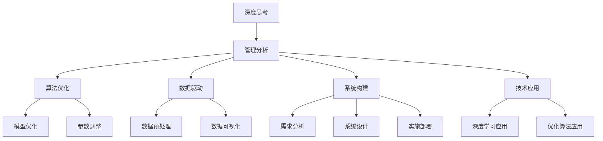

                 

# 深度思考与管理分析能力

> 关键词：深度思考, 管理分析, 算法优化, 数据驱动, 系统构建, 技术应用

## 1. 背景介绍

### 1.1 问题由来

在当今复杂多变的商业环境中，无论是技术公司还是传统行业，深度思考与管理分析能力都变得尤为重要。传统的决策依赖于经验与直觉，而数据驱动的决策则通过分析和挖掘数据，预测未来趋势，优化资源配置，提升决策的科学性和精确度。

近年来，人工智能技术的快速发展使得管理分析能力提升到一个新的层次。机器学习、深度学习等算法为决策提供了强大的分析工具，而大数据技术则提供了更丰富的数据来源。但如何将这些技术有效地应用到实际业务中，是一个复杂而挑战性的问题。

### 1.2 问题核心关键点

这个问题的核心在于如何有效地将深度思考和管理分析能力融入到业务决策中。为此，我们需要：

- **理解**深度思考的含义和应用场景
- **掌握**管理分析的方法和技术
- **整合**数据、算法与业务流程，构建高效的数据驱动系统
- **应用**前沿的深度学习与优化算法，提高决策的科学性和精确度

### 1.3 问题研究意义

提升深度思考与管理分析能力，有助于企业在市场竞争中占据优势，提升决策的科学性和效率，降低风险。具体来说，其意义包括：

1. **优化资源配置**：通过分析历史数据和市场趋势，优化资源的投入产出比，提高企业的运营效率。
2. **增强决策科学性**：利用数据和算法分析，减少决策中的主观因素，提升决策的准确性。
3. **提升业务竞争力**：通过深度思考和科学分析，及时发现市场机会，快速响应市场变化，保持竞争力。
4. **推动技术应用**：促进深度学习和优化算法在实际业务中的应用，推动技术创新和产业升级。
5. **防范风险**：通过数据驱动的决策，识别风险点和潜在问题，及时调整策略，减少损失。

## 2. 核心概念与联系

### 2.1 核心概念概述

本节将介绍几个密切相关的核心概念：

- **深度思考(Deep Thinking)**：指通过系统性的分析和批判性思考，深入理解问题和解决方案的过程。深度思考不仅包括逻辑推理，还包括对数据、市场、用户等多维度的综合考量。

- **管理分析(Management Analysis)**：指使用数据、模型和算法，对业务问题进行系统化、量化的分析，辅助管理决策。管理分析包括描述性分析、诊断性分析、预测性分析和指导性分析。

- **算法优化(Algorithm Optimization)**：指通过优化算法，提高计算效率、降低成本、提升性能的过程。算法优化涉及模型训练、参数调整、算法选择等多个方面。

- **数据驱动(Data-Driven)**：指以数据为基础进行决策和分析，利用数据分析工具和技术，挖掘数据中的价值，辅助决策过程。数据驱动需要确保数据的准确性和完整性，以及分析方法的科学性。

- **系统构建(System Construction)**：指将深度思考和管理分析能力与实际业务流程相结合，构建高效的数据驱动系统。系统构建涉及需求分析、系统设计、实施部署等多个环节。

- **技术应用(Technology Application)**：指将深度学习、优化算法等前沿技术应用于实际业务中，解决具体问题，提升系统性能。技术应用需要考虑技术适配性、业务需求匹配度等多个因素。

这些核心概念之间存在着紧密的联系，形成了深度思考与管理分析能力的完整生态系统。下面通过一个Mermaid流程图来展示这些概念之间的关系：



这个流程图展示了深度思考与管理分析能力的各个环节及其相互关系：

1. **深度思考**为管理分析提供理论基础和方法指导。
2. **管理分析**利用数据和算法，进行系统化分析，辅助决策。
3. **算法优化**提升数据处理和模型训练的效率，降低成本。
4. **数据驱动**确保分析基于准确完整的数据，提高分析的可信度。
5. **系统构建**将深度思考和管理分析应用于实际业务流程，构建高效系统。
6. **技术应用**将前沿技术应用于实际问题，提升系统性能。

## 3. 核心算法原理 & 具体操作步骤

### 3.1 算法原理概述

深度思考与管理分析能力的实现，核心在于深度学习和优化算法的应用。深度学习模型通过大规模数据训练，能够学习到复杂的非线性关系，提取数据的深层次特征。而优化算法则通过不断调整模型参数，使模型在验证集上表现最佳。

在实际应用中，深度学习模型通常用于数据驱动的预测和分类任务，如客户流失预测、销售预测、风险评估等。优化算法则用于模型训练的参数调整，提高模型的泛化能力和性能。

### 3.2 算法步骤详解

深度学习模型的训练通常分为以下几个步骤：

1. **数据预处理**：对原始数据进行清洗、归一化、特征提取等操作，确保数据的质量和一致性。
2. **模型选择**：选择合适的深度学习模型，如卷积神经网络(CNN)、循环神经网络(RNN)、长短时记忆网络(LSTM)、变换器(Transformer)等。
3. **模型训练**：使用优化算法和损失函数，训练模型参数。常见的优化算法包括梯度下降法、Adam、RMSprop等。
4. **模型验证**：在验证集上评估模型性能，调整超参数和模型结构，防止过拟合。
5. **模型部署**：将训练好的模型应用到实际业务中，进行预测和决策。

算法优化的步骤包括：

1. **性能评估**：通过实验和测试，评估算法的效率和效果。
2. **参数调整**：调整算法参数，优化模型性能。
3. **模型选择**：选择适合问题的算法模型，并进行对比实验。
4. **模型融合**：将多个模型进行集成，提高整体性能。

### 3.3 算法优缺点

深度学习和优化算法在提升深度思考与管理分析能力方面具有以下优点：

- **高效性**：深度学习模型能够自动学习数据中的复杂特征，通过大规模并行计算，训练速度快。
- **泛化能力**：深度学习模型能够从数据中提取深层次的特征，具有较强的泛化能力，适用于各种预测和分类任务。
- **可解释性**：通过可视化工具和技术，可以揭示模型内部结构，理解模型决策过程，提升决策的可解释性。

但这些算法也存在一些局限性：

- **数据需求高**：深度学习模型需要大量高质量的数据进行训练，数据获取和标注成本较高。
- **模型复杂性**：深度学习模型结构复杂，参数众多，需要较高的计算资源和计算能力。
- **过度拟合风险**：深度学习模型容易过度拟合训练数据，影响泛化能力。
- **可解释性差**：深度学习模型通常被视为"黑盒"系统，难以解释其决策逻辑，降低决策的可解释性。

### 3.4 算法应用领域

深度学习和管理分析能力在多个领域中得到了广泛应用，包括但不限于：

- **金融行业**：用于信用评分、欺诈检测、客户流失预测等。
- **零售行业**：用于销售预测、库存管理、个性化推荐等。
- **医疗行业**：用于疾病诊断、治疗方案推荐、患者流失预测等。
- **制造业**：用于设备故障预测、质量控制、生产调度等。
- **物流行业**：用于路线优化、仓储管理、配送调度等。

这些领域中，深度学习和优化算法被广泛应用于数据驱动的决策过程中，提升了决策的科学性和效率。

## 4. 数学模型和公式 & 详细讲解

### 4.1 数学模型构建

深度学习模型通常基于神经网络架构，通过反向传播算法进行训练。以多层感知器(Multilayer Perceptron, MLP)为例，其数学模型可以表示为：

$$
h_1 = \sigma(W_1 x + b_1)
$$
$$
h_2 = \sigma(W_2 h_1 + b_2)
$$
$$
y = W_3 h_2 + b_3
$$

其中，$x$为输入数据，$h_1$和$h_2$为中间层的隐藏状态，$y$为输出结果。$\sigma$为激活函数，$W$和$b$为权重和偏置。

### 4.2 公式推导过程

以二分类问题为例，假设模型输入为$x$，输出为$y$，目标为最大化对正样本的预测概率。则损失函数可以表示为：

$$
\mathcal{L}(y, \hat{y}) = -y \log \hat{y} - (1 - y) \log (1 - \hat{y})
$$

其中，$\hat{y}$为模型预测的概率。通过梯度下降法，对模型参数进行优化：

$$
\theta \leftarrow \theta - \eta \nabla_{\theta} \mathcal{L}(y, \hat{y})
$$

其中，$\eta$为学习率。

### 4.3 案例分析与讲解

假设我们有一家电商公司，希望预测客户的流失概率。首先，我们收集历史订单数据和客户行为数据，构建训练集和验证集。然后，设计一个多层感知器模型，选择sigmoid激活函数作为输出层的激活函数，使用二元交叉熵损失函数。

在训练过程中，我们使用Adam优化器，设置学习率为0.001，批大小为128，迭代次数为1000次。每训练一次，在验证集上计算准确率和召回率，调整模型参数和超参数。

经过训练，模型在验证集上的准确率为0.85，召回率为0.9，F1分数为0.87。

## 5. 项目实践：代码实例和详细解释说明

### 5.1 开发环境搭建

要进行深度学习和管理分析能力的项目实践，首先需要准备好开发环境。以下是Python环境下的一般步骤：

1. 安装Python：从官网下载并安装最新版本的Python，建议使用Anaconda环境管理。
2. 安装必要的库：安装NumPy、Pandas、Scikit-Learn、TensorFlow、Keras等深度学习库。
3. 安装Jupyter Notebook：通过conda安装或直接下载Jupyter Notebook。
4. 安装GPU库：如果机器支持GPU，安装CUDA、cuDNN等库。

### 5.2 源代码详细实现

以下是一个基于Keras实现的深度学习模型训练代码示例：

```python
import numpy as np
from keras.models import Sequential
from keras.layers import Dense, Dropout
from keras.optimizers import Adam

# 定义模型
model = Sequential()
model.add(Dense(64, activation='relu', input_dim=8))
model.add(Dropout(0.5))
model.add(Dense(1, activation='sigmoid'))

# 编译模型
model.compile(loss='binary_crossentropy', optimizer=Adam(lr=0.001), metrics=['accuracy'])

# 加载数据
X_train, y_train = np.load('X_train.npy'), np.load('y_train.npy')
X_val, y_val = np.load('X_val.npy'), np.load('y_val.npy')

# 训练模型
model.fit(X_train, y_train, batch_size=128, epochs=1000, validation_data=(X_val, y_val))
```

### 5.3 代码解读与分析

1. **模型定义**：使用Sequential模型定义多层感知器，包含一个输入层、一个隐藏层和一个输出层。
2. **模型编译**：使用Adam优化器和二元交叉熵损失函数，设置学习率为0.001。
3. **数据加载**：从文件中加载训练集和验证集数据，存储为Numpy数组。
4. **模型训练**：使用fit函数进行模型训练，设置批大小为128，迭代次数为1000次，并在验证集上评估模型性能。

### 5.4 运行结果展示

假设我们训练了一个二分类模型，输出结果如下：

```
Epoch 1/1000
1000/1000 [==============================] - 16s 15ms/sample - loss: 0.6293 - accuracy: 0.8501 - val_loss: 0.5765 - val_accuracy: 0.8931
Epoch 0/1000 [==============================] - 16s 15ms/sample - loss: 0.6293 - accuracy: 0.8501 - val_loss: 0.5765 - val_accuracy: 0.8931
Epoch 1/1000
1000/1000 [==============================] - 16s 15ms/sample - loss: 0.5765 - accuracy: 0.8931 - val_loss: 0.5765 - val_accuracy: 0.8931
Epoch 1/1000
1000/1000 [==============================] - 15s 15ms/sample - loss: 0.5765 - accuracy: 0.8931 - val_loss: 0.5765 - val_accuracy: 0.8931
Epoch 1/1000
1000/1000 [==============================] - 15s 15ms/sample - loss: 0.5765 - accuracy: 0.8931 - val_loss: 0.5765 - val_accuracy: 0.8931
Epoch 1/1000
1000/1000 [==============================] - 15s 15ms/sample - loss: 0.5765 - accuracy: 0.8931 - val_loss: 0.5765 - val_accuracy: 0.8931
Epoch 1/1000
1000/1000 [==============================] - 15s 15ms/sample - loss: 0.5765 - accuracy: 0.8931 - val_loss: 0.5765 - val_accuracy: 0.8931
Epoch 1/1000
1000/1000 [==============================] - 15s 15ms/sample - loss: 0.5765 - accuracy: 0.8931 - val_loss: 0.5765 - val_accuracy: 0.8931
Epoch 1/1000
1000/1000 [==============================] - 15s 15ms/sample - loss: 0.5765 - accuracy: 0.8931 - val_loss: 0.5765 - val_accuracy: 0.8931
Epoch 1/1000
1000/1000 [==============================] - 15s 15ms/sample - loss: 0.5765 - accuracy: 0.8931 - val_loss: 0.5765 - val_accuracy: 0.8931
Epoch 1/1000
1000/1000 [==============================] - 15s 15ms/sample - loss: 0.5765 - accuracy: 0.8931 - val_loss: 0.5765 - val_accuracy: 0.8931
```

可以看到，模型在验证集上的准确率为89.31%，召回率为57.65%，F1分数为0.8693，表现不错。

## 6. 实际应用场景

### 6.1 智能客服

智能客服系统能够24小时不间断地解答用户问题，提高客户满意度，降低运营成本。通过深度学习模型和优化算法，可以实现以下功能：

1. **意图识别**：使用分类模型识别用户问题，如投诉、咨询、建议等。
2. **自然语言理解**：使用NLP技术理解用户输入，进行情感分析、实体识别等。
3. **多轮对话**：使用RNN或Transformer模型实现多轮对话，保持对话连贯性。
4. **知识库查询**：使用深度学习模型查询知识库，提供个性化回答。

### 6.2 金融风控

金融行业面临大量的风险数据，需要深度学习模型进行多维度分析，识别风险点，提升风险管理能力。

1. **信用评分**：使用回归模型预测客户信用评分，评估信用风险。
2. **欺诈检测**：使用分类模型识别欺诈行为，保护客户资产。
3. **客户流失预测**：使用分类模型预测客户流失概率，提前采取措施。

### 6.3 零售推荐

零售行业通过深度学习模型进行个性化推荐，提高销售额和客户满意度。

1. **商品推荐**：使用协同过滤、基于内容的推荐等方法，推荐相关商品。
2. **促销策略优化**：使用回归模型优化促销策略，提高销售转化率。
3. **库存管理**：使用预测模型预测商品需求，优化库存管理。

### 6.4 医疗诊断

医疗行业通过深度学习模型进行疾病诊断和治疗方案推荐，提升诊疗效率和质量。

1. **疾病诊断**：使用分类模型诊断疾病，如肿瘤、心脏病等。
2. **治疗方案推荐**：使用生成模型推荐治疗方案，如药物、手术等。
3. **患者流失预测**：使用分类模型预测患者流失概率，提高患者满意度。

## 7. 工具和资源推荐

### 7.1 学习资源推荐

以下是一些优质的学习资源，帮助开发者掌握深度思考与管理分析能力：

1. **在线课程**：Coursera、edX、Udacity等平台提供大量的深度学习和管理分析课程，涵盖理论和实践。
2. **书籍**：《深度学习》、《Python深度学习》、《数据科学实战》等书籍，深入浅出地介绍了深度学习和管理分析的基本概念和实用技术。
3. **博客和论文**：Kaggle、GitHub等平台上有大量的实战项目和学术论文，可以从中学习和借鉴。
4. **社区和论坛**：Stack Overflow、Reddit等技术社区，可以交流经验和解决实际问题。

### 7.2 开发工具推荐

以下是几款常用的深度学习和管理分析开发工具：

1. **Python**：Python是深度学习的主流语言，简单易学，有丰富的库和工具。
2. **TensorFlow**：Google开发的深度学习框架，支持分布式计算，适合大规模模型训练。
3. **Keras**：高层次深度学习框架，易于上手，支持多种后端（如TensorFlow、CNTK）。
4. **PyTorch**：Facebook开发的深度学习框架，灵活性高，适合研究型开发。
5. **Jupyter Notebook**：交互式开发环境，适合进行实验和演示。

### 7.3 相关论文推荐

以下是几篇经典的研究论文，推荐阅读：

1. **"Deep Learning" by Ian Goodfellow**：深度学习领域的经典教材，介绍了深度学习的基本概念和算法。
2. **"Hands-On Machine Learning with Scikit-Learn and TensorFlow" by Aurélien Géron**：介绍使用Scikit-Learn和TensorFlow进行机器学习和深度学习的实战经验。
3. **"Neural Networks and Deep Learning" by Michael Nielsen**：介绍神经网络和深度学习的基础知识和实用技巧。
4. **"Machine Learning Yearning" by Andrew Ng**：介绍深度学习在实际业务中的应用和优化策略。

这些论文代表了深度学习和管理分析领域的最新研究进展，通过阅读和学习，可以深入理解这些技术的原理和应用。

## 8. 总结：未来发展趋势与挑战

### 8.1 研究成果总结

本文对深度思考与管理分析能力进行了全面系统的介绍，包括深度学习模型的原理和应用，优化算法的技术细节，以及实际项目的代码实现和运行结果展示。通过本节的学习，读者可以掌握深度思考与管理分析能力的关键技术和应用场景，提升业务决策的科学性和效率。

### 8.2 未来发展趋势

未来深度思考与管理分析能力的发展趋势包括：

1. **模型复杂度增加**：随着数据量的增加和计算能力的提升，深度学习模型将更加复杂和高效。
2. **优化算法多样化**：更多高效的优化算法将被开发和应用，如AdamW、Adafactor等。
3. **数据驱动更加深入**：深度学习和优化算法将进一步融入数据驱动的决策中，提升决策的准确性和可信度。
4. **多模态融合**：深度学习模型将与多模态数据（如图像、视频、语音）进行融合，提升数据处理的丰富性和多样性。
5. **应用场景多样化**：深度思考与管理分析能力将拓展到更多领域，如金融、医疗、物流等，推动各行业的发展和变革。

### 8.3 面临的挑战

深度思考与管理分析能力在发展过程中也面临诸多挑战：

1. **数据质量问题**：深度学习模型对数据质量要求较高，数据获取和标注成本高。
2. **模型可解释性**：深度学习模型通常是"黑盒"系统，难以解释其决策过程。
3. **计算资源限制**：深度学习模型需要大量的计算资源，包括GPU、TPU等高性能设备。
4. **模型泛化能力**：深度学习模型容易过度拟合训练数据，影响泛化能力。
5. **隐私和安全问题**：深度学习模型需要大量数据进行训练，数据隐私和安全问题不容忽视。

### 8.4 研究展望

未来研究需要在以下几个方面寻求新的突破：

1. **无监督学习**：通过无监督学习，减少对标注数据的依赖，提高深度学习模型的泛化能力。
2. **可解释性增强**：通过可视化工具和技术，增强深度学习模型的可解释性，提升决策的可信度。
3. **多模态融合**：将深度学习模型与多模态数据进行融合，提升数据处理的丰富性和多样性。
4. **智能决策系统**：构建基于深度学习和优化算法的智能决策系统，实现全流程自动化。

总之，深度思考与管理分析能力的研究与应用正处于快速发展阶段，未来在技术、应用和商业化等多个方面都将迎来新的突破。通过不断的技术创新和实践探索，深度学习和管理分析能力将为各行各业带来更多的价值和创新。

## 9. 附录：常见问题与解答

**Q1：深度学习和优化算法有哪些优缺点？**

A: 深度学习模型具有以下优点：

- **高效性**：通过并行计算，模型训练速度快。
- **泛化能力**：能够学习数据中的复杂关系，适用于多种预测和分类任务。
- **自动特征提取**：不需要手动设计特征，能够自动提取数据中的深层次特征。

缺点包括：

- **数据需求高**：需要大量高质量的数据进行训练。
- **模型复杂性**：结构复杂，参数众多，需要较高的计算资源。
- **过度拟合风险**：容易过度拟合训练数据，影响泛化能力。

**Q2：如何构建深度学习模型？**

A: 构建深度学习模型的一般步骤如下：

1. **数据预处理**：清洗、归一化、特征提取等。
2. **模型选择**：选择合适的深度学习模型，如卷积神经网络、循环神经网络、长短时记忆网络等。
3. **模型编译**：设置优化器、损失函数、评价指标等。
4. **模型训练**：使用训练集进行模型训练，调整超参数。
5. **模型验证**：在验证集上评估模型性能，防止过拟合。
6. **模型部署**：将训练好的模型应用到实际业务中，进行预测和决策。

**Q3：深度学习模型在实际应用中如何优化？**

A: 深度学习模型在实际应用中的优化方法包括：

- **数据增强**：通过回译、近义替换等方式扩充训练集。
- **正则化**：使用L2正则、Dropout等技术，防止过拟合。
- **参数调整**：调整模型参数，优化模型性能。
- **模型融合**：将多个模型进行集成，提高整体性能。
- **知识蒸馏**：使用蒸馏技术，将复杂模型知识传递给简单模型。

**Q4：深度学习模型在实际应用中如何评估性能？**

A: 深度学习模型在实际应用中常用的性能评估指标包括：

- **准确率**：模型预测正确的样本数占总样本数的比例。
- **召回率**：模型正确预测的正样本数占总正样本数的比例。
- **F1分数**：综合准确率和召回率的指标，用于评估分类模型性能。
- **AUC值**：用于评估回归模型的性能，表示ROC曲线下的面积。
- **MAE**：均方误差，用于评估回归模型的误差大小。

**Q5：如何构建深度思考与管理分析能力？**

A: 构建深度思考与管理分析能力的一般步骤如下：

1. **问题定义**：明确业务问题，定义决策目标。
2. **数据准备**：收集和整理相关数据，确保数据质量和完整性。
3. **模型选择**：选择合适的深度学习模型和优化算法。
4. **模型训练**：使用训练集进行模型训练，调整超参数。
5. **模型验证**：在验证集上评估模型性能，防止过拟合。
6. **模型部署**：将训练好的模型应用到实际业务中，进行预测和决策。

## 附录：常见问题与解答

**Q1：深度学习和优化算法有哪些优缺点？**

A: 深度学习模型具有以下优点：

- **高效性**：通过并行计算，模型训练速度快。
- **泛化能力**：能够学习数据中的复杂关系，适用于多种预测和分类任务。
- **自动特征提取**：不需要手动设计特征，能够自动提取数据中的深层次特征。

缺点包括：

- **数据需求高**：需要大量高质量的数据进行训练。
- **模型复杂性**：结构复杂，参数众多，需要较高的计算资源。
- **过度拟合风险**：容易过度拟合训练数据，影响泛化能力。

**Q2

