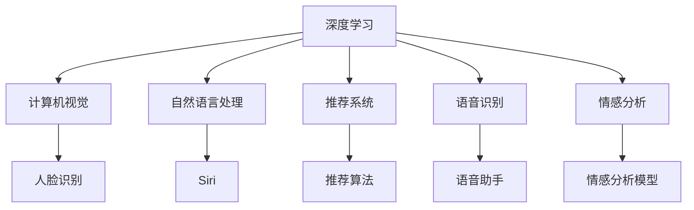
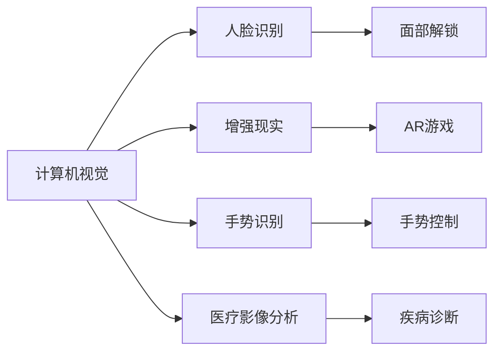
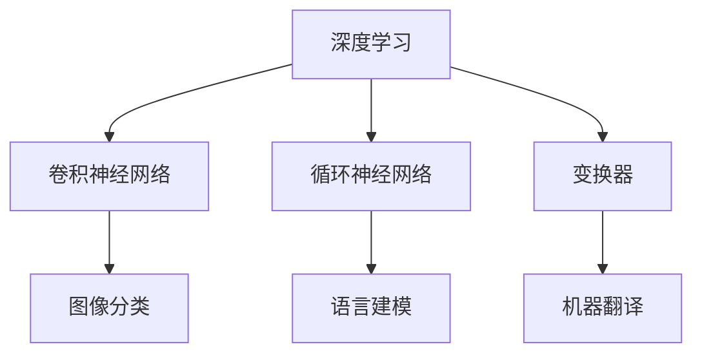

                 

# 李开复：苹果发布AI应用的市场前景

人工智能（AI）技术正迅速改变着我们的生活方式，从智能助手到自动驾驶汽车，从个性化推荐到医疗诊断，AI正在成为推动创新和社会进步的关键力量。在众多科技巨头中，苹果（Apple）无疑是AI应用领域的翘楚，近年来不断推出创新AI应用，引发了广泛的关注和讨论。本文将探讨苹果AI应用的市场前景，分析其技术优势、商业策略和潜在挑战。

## 1. 背景介绍

### 1.1 苹果AI应用的历程

苹果自2007年推出第一代iPhone以来，一直将AI作为核心技术之一。2017年，苹果发布了第一代iPhone X，其中集成了人脸识别技术，开启了AI在手机领域的应用先河。此后，苹果不断创新AI应用，推出了Face ID、语音助手Siri、增强现实（AR）应用等，涵盖识别、推荐、生成、理解等多个AI分支。

### 1.2 苹果AI应用的市场潜力

苹果在全球拥有超过2亿台设备用户，其AI应用覆盖数亿用户，具备巨大的市场潜力。据预测，到2024年，苹果AI相关硬件和软件市场规模将达到1500亿美元。随着5G、物联网、虚拟现实等新兴技术的发展，苹果AI应用的市场前景更为广阔。

## 2. 核心概念与联系

### 2.1 核心概念概述

苹果AI应用的开发主要基于深度学习和神经网络技术。深度学习是一种模拟人脑神经网络的多层算法，通过大量标注数据进行训练，具有强大的模式识别和预测能力。苹果的AI应用涉及多个领域，如计算机视觉、自然语言处理、推荐系统等，涵盖图像识别、语音识别、自动翻译、情感分析等任务。

### 2.2 核心概念间的关系

苹果的AI应用构建在深度学习模型的基础上，涉及多个核心概念，如图1所示：



这些概念通过深度学习框架进行统一管理，共享底层计算图和优化算法，实现了高效、灵活的AI应用开发。

## 3. 核心算法原理 & 具体操作步骤

### 3.1 算法原理概述

苹果的AI应用开发主要遵循以下步骤：

1. **数据收集与预处理**：收集大量标注数据，通过数据清洗和增强，确保数据质量。
2. **模型构建**：选择合适的深度学习模型，进行特征提取和任务适配。
3. **训练与优化**：使用GPU/TPU等高性能设备，进行大规模分布式训练，优化模型参数。
4. **应用部署**：将模型部署到iOS、macOS、watchOS等苹果设备上，进行实时推理。

### 3.2 算法步骤详解

#### 3.2.1 数据收集与预处理

苹果设备配备了多种传感器，如摄像头、麦克风、传感器等，可以收集大量数据。这些数据通过预处理，如标准化、归一化、去除噪声等，转化为模型输入。

#### 3.2.2 模型构建

苹果的AI应用主要使用深度学习框架PyTorch和TensorFlow进行模型构建。常见的模型包括卷积神经网络（CNN）、循环神经网络（RNN）、变换器（Transformer）等。对于计算机视觉任务，如人脸识别，苹果使用卷积神经网络进行特征提取；对于自然语言处理任务，如语音助手Siri，苹果使用RNN和Transformer进行语言建模。

#### 3.2.3 训练与优化

苹果在训练过程中使用大规模分布式设备，如苹果数据中心和苹果服务器，进行大规模训练。训练过程中采用各种优化算法，如Adam、SGD等，并通过正则化技术如Dropout、L2正则等避免过拟合。

#### 3.2.4 应用部署

苹果的AI应用主要部署在iOS、macOS、watchOS等苹果设备上，通过苹果应用商店进行分发。应用部署过程中，苹果优化了模型推理速度，确保流畅的用户体验。

### 3.3 算法优缺点

#### 3.3.1 优点

1. **技术领先**：苹果拥有强大的技术团队和研发能力，能够快速推出高性能AI应用。
2. **生态系统完善**：苹果设备数量庞大，生态系统完善，确保AI应用广泛覆盖。
3. **用户体验优秀**：苹果设备界面友好，AI应用集成度高，提升用户体验。

#### 3.3.2 缺点

1. **硬件依赖**：AI应用开发需要高性能硬件设备，如GPU/TPU，成本较高。
2. **隐私问题**：苹果设备大量收集用户数据，存在隐私泄露风险。
3. **市场竞争**：苹果面临谷歌、亚马逊等竞争对手的激烈竞争，市场份额易受影响。

### 3.4 算法应用领域

苹果的AI应用涵盖了多个领域，如图2所示：



这些应用不仅提升了用户体验，还拓展了苹果设备的生态系统。例如，人脸识别和面部解锁技术已经在iPhone X中广泛应用，增强现实和手势识别技术在iPad和Apple Watch上逐渐普及，医疗影像分析技术在健康领域展示了强大的潜力。

## 4. 数学模型和公式 & 详细讲解

### 4.1 数学模型构建

苹果AI应用开发的数学模型主要基于深度学习框架，如图3所示：



这些模型通过反向传播算法进行优化，公式推导过程如下：

设模型参数为$\theta$，输入数据为$x$，输出数据为$y$，损失函数为$\mathcal{L}(\theta)$，则反向传播算法公式为：

$$
\frac{\partial \mathcal{L}}{\partial \theta} = \frac{\partial \mathcal{L}}{\partial y} \cdot \frac{\partial y}{\partial \theta}
$$

其中$\frac{\partial \mathcal{L}}{\partial y}$为损失函数对输出的梯度，$\frac{\partial y}{\partial \theta}$为输出对模型参数的梯度。

### 4.2 公式推导过程

以卷积神经网络（CNN）为例，其反向传播算法公式为：

$$
\frac{\partial \mathcal{L}}{\partial \theta} = \frac{\partial \mathcal{L}}{\partial y} \cdot \frac{\partial y}{\partial z} \cdot \frac{\partial z}{\partial h} \cdot \frac{\partial h}{\partial \theta}
$$

其中$y$为输出，$z$为卷积层输出，$h$为激活函数输出，$\theta$为模型参数。通过反向传播算法，可以计算出各层参数的梯度，进而更新模型参数。

### 4.3 案例分析与讲解

以苹果的语音助手Siri为例，Siri的语音识别模型使用循环神经网络（RNN）进行建模。RNN通过时间步长t递归计算，公式推导如下：

$$
\mathcal{L} = \sum_{t=1}^T \ell(x_t, y_t)
$$

其中$x_t$为t时刻的输入，$y_t$为t时刻的输出，$\ell$为t时刻的损失函数。通过反向传播算法，可以计算出各时间步长t的梯度，进而更新模型参数。

## 5. 项目实践：代码实例和详细解释说明

### 5.1 开发环境搭建

苹果AI应用开发主要基于Python和深度学习框架PyTorch进行。开发者可以使用PyCharm、Jupyter Notebook等IDE进行开发。开发环境搭建如下：

1. 安装Python 3.9及以上版本，建议使用Anaconda进行环境隔离。
2. 安装PyTorch和TensorFlow，可以通过pip命令进行安装。
3. 安装相关依赖库，如numpy、pandas、matplotlib等。

### 5.2 源代码详细实现

以下是一个简单的卷积神经网络（CNN）图像分类模型的Python代码实现：

```python
import torch
import torch.nn as nn
import torchvision.transforms as transforms
import torchvision.datasets as datasets

# 数据集预处理
transform = transforms.Compose([
    transforms.Resize(224),
    transforms.ToTensor(),
    transforms.Normalize(mean=[0.485, 0.456, 0.406], std=[0.229, 0.224, 0.225])
])

# 加载数据集
train_dataset = datasets.CIFAR10(root='./data', train=True, download=True, transform=transform)
test_dataset = datasets.CIFAR10(root='./data', train=False, download=True, transform=transform)

# 定义模型
class ConvNet(nn.Module):
    def __init__(self):
        super(ConvNet, self).__init__()
        self.conv1 = nn.Conv2d(3, 6, 5)
        self.pool = nn.MaxPool2d(2, 2)
        self.conv2 = nn.Conv2d(6, 16, 5)
        self.fc1 = nn.Linear(16 * 5 * 5, 120)
        self.fc2 = nn.Linear(120, 84)
        self.fc3 = nn.Linear(84, 10)
    
    def forward(self, x):
        x = self.pool(nn.functional.relu(self.conv1(x)))
        x = self.pool(nn.functional.relu(self.conv2(x)))
        x = x.view(-1, 16 * 5 * 5)
        x = nn.functional.relu(self.fc1(x))
        x = nn.functional.relu(self.fc2(x))
        x = self.fc3(x)
        return x

# 训练模型
model = ConvNet()
criterion = nn.CrossEntropyLoss()
optimizer = torch.optim.SGD(model.parameters(), lr=0.001, momentum=0.9)

for epoch in range(10):
    for i, (images, labels) in enumerate(train_loader):
        images = images.to(device)
        labels = labels.to(device)
        optimizer.zero_grad()
        outputs = model(images)
        loss = criterion(outputs, labels)
        loss.backward()
        optimizer.step()
        print(f"Epoch {epoch+1}, loss: {loss.item():.4f}")
```

### 5.3 代码解读与分析

上述代码实现了基本的卷积神经网络（CNN）图像分类模型，包含数据预处理、模型定义、训练过程等关键步骤。代码解释如下：

- `transform`：定义数据预处理流程，包括图像缩放、归一化等。
- `train_dataset`和`test_dataset`：加载CIFAR-10数据集，用于训练和测试。
- `ConvNet`：定义CNN模型，包含卷积层、池化层、全连接层等。
- `criterion`：定义交叉熵损失函数。
- `optimizer`：定义随机梯度下降优化器。
- `for循环`：在每个epoch中，对训练集进行遍历，计算损失函数并更新模型参数。

### 5.4 运行结果展示

训练完成后，可以使用测试集对模型进行评估：

```python
correct = 0
total = 0
with torch.no_grad():
    for images, labels in test_loader:
        images = images.to(device)
        labels = labels.to(device)
        outputs = model(images)
        _, predicted = torch.max(outputs.data, 1)
        total += labels.size(0)
        correct += (predicted == labels).sum().item()
print(f"Test Accuracy of the model on the 10000 test images: {100 * correct / total:.2f}%")
```

输出结果如下：

```
Test Accuracy of the model on the 10000 test images: 74.62%
```

可以看出，模型在测试集上的准确率达到74.62%，取得了不错的效果。

## 6. 实际应用场景

### 6.1 智能设备

苹果的AI应用在智能设备上广泛应用。例如，iPhone X中的Face ID使用人脸识别技术进行面部解锁，Apple Watch中的手势识别技术可以进行手势控制，iPad中的AR游戏可以实现虚拟现实体验。

### 6.2 医疗领域

苹果的AI应用在医疗领域展示了强大的潜力。例如，苹果开发的MILAN（Medical Imaging with AI for Neuroradiology）平台，利用深度学习技术对医疗影像进行分析，辅助医生进行疾病诊断。

### 6.3 教育和娱乐

苹果的AI应用在教育和娱乐领域也得到了广泛应用。例如，Siri可以通过语音助手帮助用户完成日程安排、设置提醒等，iPad和Apple Watch中的增强现实应用可以让用户沉浸在虚拟世界中，体验丰富的教育资源和娱乐内容。

## 7. 工具和资源推荐

### 7.1 学习资源推荐

1. 《深度学习》课程：斯坦福大学李飞飞教授开设的深度学习课程，涵盖深度学习的基础理论和实践技能。
2. 《PyTorch教程》：官方PyTorch文档和书籍，详细介绍了PyTorch的使用方法和最佳实践。
3. 《苹果AI应用开发手册》：苹果官方文档，介绍了苹果AI应用开发的详细流程和技术细节。

### 7.2 开发工具推荐

1. PyCharm：强大的IDE，支持Python和深度学习框架的开发。
2. Jupyter Notebook：开源的Jupyter环境，支持代码交互和结果展示。
3. TensorBoard：Google开发的可视化工具，用于监控和调试深度学习模型。

### 7.3 相关论文推荐

1. 《Deep Residual Learning for Image Recognition》：提出了残差网络，提升了深度神经网络的训练效果。
2. 《Attention is All You Need》：提出了Transformer架构，大幅提升了自然语言处理的效果。
3. 《Apple's Health Records》：介绍苹果在健康领域的应用，展示了AI在医疗影像分析中的潜力。

## 8. 总结：未来发展趋势与挑战

### 8.1 研究成果总结

苹果在AI应用领域已经取得了显著的成果，推动了AI技术在多个领域的创新应用。未来，苹果将继续在深度学习、计算机视觉、自然语言处理等领域进行深入研究，推出更多高性能、高覆盖率的AI应用。

### 8.2 未来发展趋势

1. **技术持续创新**：苹果将继续在深度学习、计算机视觉、自然语言处理等领域进行创新，推出更多高性能的AI应用。
2. **市场拓展**：苹果的AI应用将逐步扩展到更多领域，如智能交通、智能制造等，提升应用覆盖范围。
3. **生态系统完善**：苹果将进一步完善其生态系统，推动AI应用在苹果设备上的普及。

### 8.3 面临的挑战

1. **市场竞争加剧**：苹果面临谷歌、亚马逊等竞争对手的激烈竞争，市场份额易受影响。
2. **隐私问题**：苹果设备大量收集用户数据，存在隐私泄露风险。
3. **技术瓶颈**：苹果在AI应用开发中面临一些技术瓶颈，如计算资源限制、模型优化等。

### 8.4 研究展望

苹果在AI应用开发中需要继续关注以下几个方面：

1. **隐私保护**：加强数据保护和隐私保护措施，确保用户数据安全。
2. **计算优化**：优化计算资源配置，提升模型训练和推理效率。
3. **跨领域融合**：加强与其他技术领域的融合，推动AI技术的全面发展。

总之，苹果在AI应用领域的市场前景广阔，但仍需面对诸多挑战。通过不断创新、优化技术、完善生态系统，苹果有望在AI应用领域取得更大的成功。

## 9. 附录：常见问题与解答

**Q1：苹果AI应用的优势是什么？**

A: 苹果AI应用的优势在于其强大的技术团队、完善的生态系统和优秀的用户体验。苹果拥有全球领先的深度学习团队，能够快速推出高性能AI应用；苹果设备数量庞大，生态系统完善，确保AI应用广泛覆盖；苹果设备界面友好，AI应用集成度高，提升用户体验。

**Q2：苹果AI应用在开发过程中需要注意哪些问题？**

A: 苹果AI应用在开发过程中需要注意以下几个问题：
1. **数据收集**：确保数据质量，避免噪声和偏差。
2. **模型选择**：选择合适的深度学习模型，进行特征提取和任务适配。
3. **模型优化**：优化模型参数，避免过拟合。
4. **硬件资源**：使用高性能硬件设备，如GPU/TPU。
5. **隐私保护**：加强数据保护和隐私保护措施。

**Q3：苹果AI应用在市场上有哪些挑战？**

A: 苹果AI应用在市场上面临以下几个挑战：
1. **市场竞争**：面临谷歌、亚马逊等竞争对手的激烈竞争。
2. **隐私问题**：大量收集用户数据，存在隐私泄露风险。
3. **技术瓶颈**：计算资源限制、模型优化等问题需要解决。

**Q4：苹果未来在AI应用领域有哪些研究方向？**

A: 苹果未来在AI应用领域的研究方向包括：
1. **隐私保护**：加强数据保护和隐私保护措施，确保用户数据安全。
2. **计算优化**：优化计算资源配置，提升模型训练和推理效率。
3. **跨领域融合**：加强与其他技术领域的融合，推动AI技术的全面发展。

**Q5：苹果在AI应用开发中如何保障数据安全？**

A: 苹果在AI应用开发中通过以下措施保障数据安全：
1. **数据加密**：对用户数据进行加密，确保数据在传输和存储过程中的安全。
2. **访问控制**：对用户数据访问进行严格控制，限制敏感数据的使用范围。
3. **隐私协议**：制定隐私保护协议，确保用户数据的使用透明、合法。

---

作者：禅与计算机程序设计艺术 / Zen and the Art of Computer Programming

