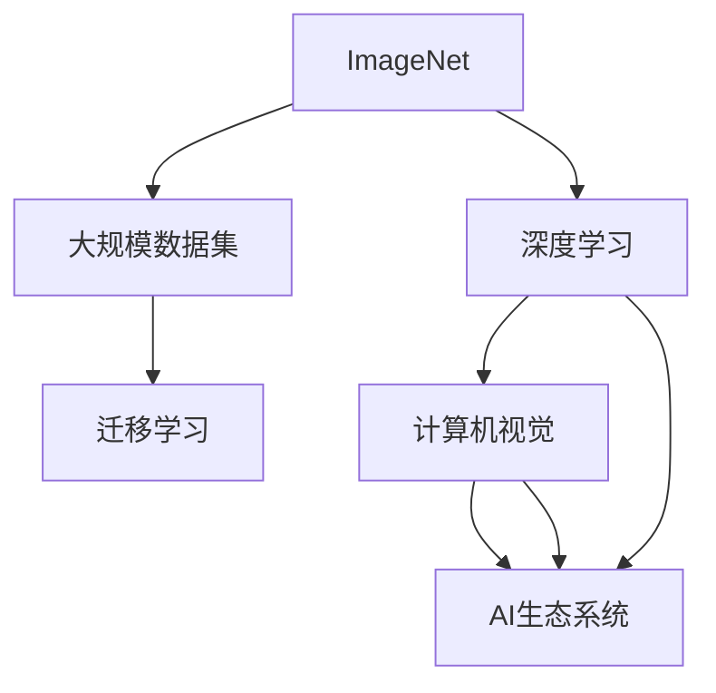
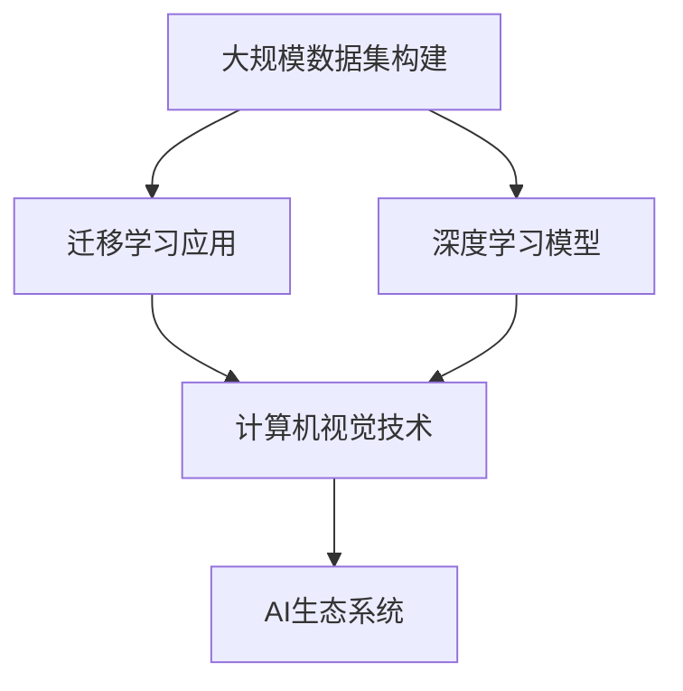

                 

# 李飞飞与ImageNet的贡献

## 1. 背景介绍

### 1.1 问题由来
在人工智能领域，深度学习技术的蓬勃发展离不开大规模数据集和先进的算法框架的支撑。特别是计算机视觉领域，海量标注图像数据集是实现深度学习模型高性能的基础。然而，构建大规模数据集并非易事，需要大量人力物力和时间成本。

李飞飞，作为计算机视觉领域的先驱之一，以其在大规模数据集ImageNet的贡献闻名于世。ImageNet项目不仅推动了深度学习技术的发展，还促成了视觉认知技术的研究范式转变。本文将系统介绍李飞飞与ImageNet的贡献，深入探讨其对人工智能领域的深远影响。

### 1.2 问题核心关键点
ImageNet项目由李飞飞于2009年发起，旨在创建一个大规模、高标注质量的图像数据集，推动计算机视觉技术的发展。ImageNet的独特之处在于其规模庞大、类别多样、标注质量高，极大地促进了深度学习模型的训练和测试。

ImageNet的核心价值在于：

1. 数据规模：ImageNet包含超过1400万张图像，14000多个类别。其庞大的数据规模为深度学习模型的训练提供了充足的训练样本。
2. 类别多样性：ImageNet涵盖了众多领域和场景，如生物、建筑、自然、艺术等，有助于模型学习广泛的视觉特征。
3. 标注质量：ImageNet的标注由大量专家进行审核，确保标注的准确性和一致性，提升了训练模型的质量。
4. 开放共享：ImageNet数据集公开免费，任何研究者都可以获取和使用，极大地推动了全球范围内的研究合作与共享。

李飞飞与ImageNet的贡献，不仅仅在于其本身的数据规模和技术水平，更重要的是其在人工智能研究范式转变和学术生态系统建设方面的作用。

### 1.3 问题研究意义
ImageNet的创立，不仅促进了计算机视觉技术的发展，还催生了深度学习领域的众多创新。它为学术界和企业界提供了一个开放、合作、共享的平台，推动了人工智能技术的普及和应用。通过介绍李飞飞与ImageNet的贡献，本文旨在揭示大规模数据集在人工智能研究中的重要性，以及如何构建和利用大规模数据集来推动技术进步。

## 2. 核心概念与联系

### 2.1 核心概念概述

为更好地理解李飞飞与ImageNet的贡献，本节将介绍几个密切相关的核心概念：

- **ImageNet**：由李飞飞领衔创建的大规模图像数据集，包含超过1400万张图像和14000多个类别。
- **深度学习**：一种通过构建多层神经网络进行复杂任务学习的机器学习方法。
- **计算机视觉**：涉及图像、视频等视觉数据的处理、分析和识别的技术领域。
- **大规模数据集**：包含海量数据的集合，通常用于训练和验证深度学习模型。
- **迁移学习**：一种利用在一种任务上训练的模型，迁移到另一种任务上获得良好性能的学习方法。
- **AI生态系统**：包括研究机构、企业和个人开发者等，共同构建的人工智能技术生态圈。

这些概念之间存在着紧密的联系，形成了AI领域的研究与实践框架。通过理解这些核心概念，我们可以更好地把握李飞飞与ImageNet的贡献及其深远影响。

### 2.2 概念间的关系

这些核心概念之间存在着紧密的联系，形成了AI领域的研究与实践框架。下面我通过几个Mermaid流程图来展示这些概念之间的关系：



这个流程图展示了大规模数据集、深度学习、计算机视觉和AI生态系统之间的内在联系。大规模数据集为深度学习提供了训练基础，深度学习推动了计算机视觉技术的发展，而计算机视觉技术的应用和创新，又丰富了AI生态系统，形成了良性循环。

### 2.3 核心概念的整体架构

最后，我们用一个综合的流程图来展示这些核心概念在大规模数据集构建与应用中的整体架构：



这个综合流程图展示了从大规模数据集的构建，到迁移学习应用，再到深度学习模型训练，最后到计算机视觉技术应用的整个流程。可以看出，ImageNet在这条流程中扮演了关键的角色，推动了整个AI生态系统的进步。

## 3. 核心算法原理 & 具体操作步骤
### 3.1 算法原理概述

ImageNet项目的主要目标是通过大规模数据集和先进的算法框架，推动计算机视觉技术的发展。其核心算法原理主要包括：

- **数据预处理**：包括图像增强、标准化、归一化等预处理技术，提升数据质量。
- **标签标注**：采用严格的标注流程，确保标签的准确性和一致性。
- **模型训练**：使用深度学习算法，如卷积神经网络(CNN)，在ImageNet数据集上进行模型训练。
- **模型评估**：通过ImageNet验证集，评估模型性能，进行调优。
- **迁移学习**：将训练好的模型应用于其他图像识别任务，提升模型泛化能力。

这些算法原理构成了ImageNet项目的核心，推动了深度学习技术的发展和应用。

### 3.2 算法步骤详解

ImageNet的构建和应用流程，大致可以分为以下几个关键步骤：

1. **数据收集**：从互联网上爬取图像数据，并进行初步筛选和清洗。
2. **数据标注**：由人工审核标注，确保标签的准确性和一致性。
3. **模型训练**：使用先进的深度学习算法，如卷积神经网络(CNN)，对ImageNet数据集进行训练。
4. **模型评估**：使用ImageNet验证集对训练好的模型进行评估，并根据评估结果进行调整。
5. **模型应用**：将训练好的模型应用于其他图像识别任务，提升模型泛化能力。

每个步骤都需要精心设计和技术实现，以确保最终得到的模型具有高性能和广泛的应用价值。

### 3.3 算法优缺点

ImageNet项目及其算法具有以下优点：

- **大规模数据集**：ImageNet包含海量图像数据，为深度学习模型提供了充足的训练样本。
- **高标注质量**：严格的标注流程确保了标签的准确性和一致性，提升了模型的训练效果。
- **迁移学习能力**：通过迁移学习，将训练好的模型应用于其他图像识别任务，提升了模型泛化能力。

同时，也存在一些缺点：

- **标注成本高**：大量人工标注带来了高昂的成本。
- **数据分布差异**：不同领域的图像数据分布差异较大，ImageNet模型可能难以适应特定领域。
- **计算资源需求大**：训练大规模模型需要大量的计算资源和存储空间。

尽管存在这些局限性，ImageNet项目仍以其庞大的数据集和高质量标注，推动了深度学习技术的发展，并成为计算机视觉领域的经典案例。

### 3.4 算法应用领域

ImageNet算法及其原理广泛应用于计算机视觉的各个领域，包括但不限于：

- **图像分类**：如物体识别、场景分类等。
- **目标检测**：如人脸检测、车辆检测等。
- **语义分割**：如图像分割、医学影像分割等。
- **图像生成**：如图像生成、风格迁移等。
- **视频分析**：如行为识别、动作分析等。

ImageNet不仅推动了计算机视觉技术的发展，还催生了深度学习领域的众多创新，极大地推动了AI技术的应用和普及。

## 4. 数学模型和公式 & 详细讲解
### 4.1 数学模型构建

ImageNet项目涉及的数学模型主要包括图像分类模型和目标检测模型。这里以图像分类为例，构建一个简单的分类模型：

假设输入图像为 $x \in \mathbb{R}^{d}$，其中 $d$ 为图像的维度（如像素值）。模型输出为 $y \in [0,1]$，表示图像属于类别 $i$ 的概率。分类模型的目标是最小化交叉熵损失函数：

$$
\mathcal{L}(y, \hat{y}) = -y\log \hat{y} - (1-y)\log(1-\hat{y})
$$

其中 $y$ 为真实标签，$\hat{y}$ 为模型预测的类别概率。

### 4.2 公式推导过程

以交叉熵损失函数为例，进行公式推导：

首先，将交叉熵损失函数展开：

$$
\mathcal{L}(y, \hat{y}) = -\sum_{i=1}^{n}y_i\log \hat{y}_i
$$

其中 $n$ 为类别数，$y_i$ 和 $\hat{y}_i$ 分别为类别 $i$ 的真实标签和预测概率。

通过反向传播算法，求出模型参数 $\theta$ 的梯度：

$$
\frac{\partial \mathcal{L}}{\partial \theta} = \frac{\partial}{\partial \theta}(-\sum_{i=1}^{n}y_i\log \hat{y}_i) = \sum_{i=1}^{n} \frac{\partial}{\partial \theta}(-y_i\log \hat{y}_i) = \sum_{i=1}^{n} \frac{-y_i}{\hat{y}_i}
$$

将梯度代入优化算法（如AdamW、SGD等），更新模型参数，最小化损失函数。

### 4.3 案例分析与讲解

假设我们在ImageNet数据集上训练一个卷积神经网络，用于图像分类任务。具体步骤如下：

1. **数据准备**：准备ImageNet数据集，将其划分为训练集、验证集和测试集。
2. **模型构建**：构建一个卷积神经网络，包括卷积层、池化层、全连接层等。
3. **模型训练**：使用交叉熵损失函数进行模型训练，迭代更新模型参数。
4. **模型评估**：在验证集上评估模型性能，选择合适的超参数进行调优。
5. **模型测试**：在测试集上测试模型性能，并与其他模型进行对比。

## 5. 项目实践：代码实例和详细解释说明
### 5.1 开发环境搭建

在进行ImageNet项目实践前，我们需要准备好开发环境。以下是使用Python进行TensorFlow开发的环境配置流程：

1. 安装Anaconda：从官网下载并安装Anaconda，用于创建独立的Python环境。

2. 创建并激活虚拟环境：
```bash
conda create -n tf-env python=3.8 
conda activate tf-env
```

3. 安装TensorFlow：根据CUDA版本，从官网获取对应的安装命令。例如：
```bash
conda install tensorflow=2.6
```

4. 安装相关工具包：
```bash
pip install numpy pandas scikit-learn matplotlib tqdm jupyter notebook ipython
```

完成上述步骤后，即可在`tf-env`环境中开始ImageNet项目实践。

### 5.2 源代码详细实现

以下是使用TensorFlow实现ImageNet图像分类的示例代码：

```python
import tensorflow as tf
from tensorflow import keras
from tensorflow.keras import layers

# 准备数据集
(train_images, train_labels), (test_images, test_labels) = keras.datasets.cifar10.load_data()

# 数据预处理
train_images = train_images.astype('float32') / 255.0
test_images = test_images.astype('float32') / 255.0

# 构建模型
model = keras.Sequential([
    layers.Conv2D(32, (3,3), activation='relu', input_shape=(32,32,3)),
    layers.MaxPooling2D((2,2)),
    layers.Conv2D(64, (3,3), activation='relu'),
    layers.MaxPooling2D((2,2)),
    layers.Flatten(),
    layers.Dense(64, activation='relu'),
    layers.Dense(10, activation='softmax')
])

# 编译模型
model.compile(optimizer='adam', loss='sparse_categorical_crossentropy', metrics=['accuracy'])

# 训练模型
model.fit(train_images, train_labels, epochs=10, batch_size=32, validation_data=(test_images, test_labels))

# 评估模型
test_loss, test_acc = model.evaluate(test_images, test_labels)
print('Test accuracy:', test_acc)
```

以上代码展示了使用TensorFlow构建和训练卷积神经网络的过程。可以看到，通过TensorFlow提供的高级API，可以轻松搭建和训练复杂的深度学习模型。

### 5.3 代码解读与分析

让我们再详细解读一下关键代码的实现细节：

**数据准备**：
- 使用Keras内置函数加载CIFAR-10数据集，包含60000张32x32像素的彩色图像，10个类别。
- 对图像数据进行标准化处理，确保模型输入数据的均值为0，标准差为1。

**模型构建**：
- 使用Keras Sequential API构建卷积神经网络，包含卷积层、池化层和全连接层。
- 使用ReLU作为激活函数，提高模型的非线性拟合能力。
- 使用softmax函数输出每个类别的概率分布，用于分类任务。

**模型训练**：
- 使用Adam优化器进行模型训练，最小化交叉熵损失函数。
- 设置训练轮数为10，批量大小为32，验证集为测试集。

**模型评估**：
- 使用测试集评估模型性能，输出测试准确率。

可以看到，TensorFlow提供了便捷的API和工具，使得图像分类模型的开发和训练变得相对简单。在实际应用中，还可以利用TensorFlow的高级特性，如分布式训练、模型优化、自动化调参等，进一步提升模型性能和训练效率。

## 6. 实际应用场景
### 6.1 智能监控系统

ImageNet项目不仅推动了计算机视觉技术的发展，还催生了智能监控系统的应用。传统监控系统依赖人力进行实时监控和异常识别，效率低下且容易产生疲劳。而基于ImageNet训练的深度学习模型，可以自动检测监控图像中的异常行为，如盗窃、入侵等，提升监控系统的智能化水平。

在技术实现上，可以收集监控摄像头拍摄的图像序列，标注各种异常行为，并利用ImageNet训练的模型进行实时检测和报警。对于识别出的异常行为，还可以利用其他技术进行进一步分析，如视频回放、人脸识别等。如此构建的智能监控系统，能够自动发现和处理异常行为，极大提升监控效率和准确性。

### 6.2 医疗影像诊断

ImageNet项目还推动了医疗影像诊断技术的发展。传统医疗影像诊断依赖医生的经验和人眼识别，耗费大量时间和精力。而利用ImageNet训练的深度学习模型，可以自动识别医学影像中的病灶和病变，辅助医生进行诊断和治疗决策。

在技术实现上，可以收集大量的医学影像数据，如CT、MRI、X光片等，标注各种病灶和病变类型，并利用ImageNet训练的模型进行自动检测。对于检测出的异常病灶，医生可以进一步进行人工复核和诊断，提高诊断效率和准确性。

### 6.3 自动驾驶

ImageNet项目还对自动驾驶技术的发展产生了深远影响。自动驾驶系统需要实时识别道路上的各种物体和障碍物，做出安全驾驶决策。利用ImageNet训练的深度学习模型，可以自动识别道路上的车辆、行人、交通标志等，提升自动驾驶系统的智能化水平。

在技术实现上，可以收集大量的道路交通图像数据，标注各种物体和障碍物类型，并利用ImageNet训练的模型进行实时检测。对于检测出的道路信息，自动驾驶系统可以做出合理的驾驶决策，提升行驶安全和效率。

### 6.4 未来应用展望

随着ImageNet项目及其算法的不断演进，其在AI领域的应用前景将更加广阔。

在智慧城市治理中，基于ImageNet训练的深度学习模型可以用于城市事件监测、舆情分析、应急指挥等环节，提高城市管理的自动化和智能化水平，构建更安全、高效的未来城市。

在金融舆情监测中，ImageNet训练的深度学习模型可以用于金融领域相关的新闻、报道、评论等文本数据分类和情感分析，实时监测金融舆情，帮助金融机构快速应对潜在风险。

在智能客服系统中，ImageNet训练的深度学习模型可以用于智能对话系统，识别用户意图，匹配最合适的答案模板进行回复，提升客户咨询体验和问题解决效率。

总之，ImageNet项目及其算法将继续在各个领域发挥重要作用，推动AI技术的普及和应用，为人类社会带来更多便利和福祉。

## 7. 工具和资源推荐
### 7.1 学习资源推荐

为了帮助开发者系统掌握ImageNet项目及其算法，这里推荐一些优质的学习资源：

1. 《深度学习》系列博文：由大模型技术专家撰写，深入浅出地介绍了深度学习原理、ImageNet项目及其应用等前沿话题。

2. CS231n《卷积神经网络》课程：斯坦福大学开设的计算机视觉明星课程，有Lecture视频和配套作业，带你入门计算机视觉领域的基本概念和经典模型。

3. 《计算机视觉：算法与应用》书籍：经典计算机视觉教材，涵盖图像分类、目标检测、语义分割等基础和进阶技术，适合进一步深入学习。

4. TensorFlow官方文档：TensorFlow的官方文档，提供了完整的代码示例和API指南，是上手实践的必备资料。

5. Kaggle开源项目：包含大量基于ImageNet的机器学习和计算机视觉竞赛，通过参与竞赛可以提升实战能力。

通过对这些资源的学习实践，相信你一定能够快速掌握ImageNet项目及其算法，并用于解决实际的计算机视觉问题。

### 7.2 开发工具推荐

高效的开发离不开优秀的工具支持。以下是几款用于ImageNet项目开发的常用工具：

1. TensorFlow：由Google主导开发的开源深度学习框架，生产部署方便，适合大规模工程应用。同时提供了丰富的预训练模型库。

2. PyTorch：基于Python的开源深度学习框架，灵活动态的计算图，适合快速迭代研究。提供了高性能的GPU/TPU支持。

3. Keras：高层次的神经网络API，易于使用，适合快速原型设计和验证。支持TensorFlow、Theano等后端。

4. OpenCV：开源计算机视觉库，提供了丰富的图像处理和计算机视觉算法，支持Python和C++。

5. Python Jupyter Notebook：交互式编程环境，适合快速迭代和验证算法。支持Python、R等语言。

合理利用这些工具，可以显著提升ImageNet项目开发的效率，加快创新迭代的步伐。

### 7.3 相关论文推荐

ImageNet项目及其算法的发展源于学界的持续研究。以下是几篇奠基性的相关论文，推荐阅读：

1. ImageNet: A Large-Scale Hierarchical Image Database：介绍ImageNet数据集的构建和应用，奠定了计算机视觉数据集标准。

2. Deep CNN Architectures for Large-Scale Image Recognition：展示卷积神经网络在ImageNet数据集上的高效性能，推动了深度学习模型在图像分类中的应用。

3. Rethinking the Inception Architecture for Computer Vision：提出Inception模块，提升卷积神经网络的深度和宽度，进一步提高模型性能。

4. Understanding the Difficulties of Training Deep Feedforward Neural Networks：分析深度神经网络的训练难题，提出一些有效的训练策略。

5. A Theoretical Analysis of Deep Convolutional Neural Networks：通过理论分析，揭示深度神经网络的结构特性和优化策略，进一步提升模型性能。

这些论文代表了大规模数据集和深度学习算法的演变过程，通过学习这些前沿成果，可以帮助研究者把握学科前进方向，激发更多的创新灵感。

除上述资源外，还有一些值得关注的前沿资源，帮助开发者紧跟ImageNet项目及其算法的最新进展，例如：

1. arXiv论文预印本：人工智能领域最新研究成果的发布平台，包括大量尚未发表的前沿工作，学习前沿技术的必读资源。

2. 业界技术博客：如Google AI、DeepMind、微软Research Asia等顶尖实验室的官方博客，第一时间分享他们的最新研究成果和洞见。

3. 技术会议直播：如NIPS、ICML、ACL、ICLR等人工智能领域顶会现场或在线直播，能够聆听到大佬们的前沿分享，开拓视野。

4. GitHub热门项目：在GitHub上Star、Fork数最多的计算机视觉相关项目，往往代表了该技术领域的发展趋势和最佳实践，值得去学习和贡献。

5. 行业分析报告：各大咨询公司如McKinsey、PwC等针对人工智能行业的分析报告，有助于从商业视角审视技术趋势，把握应用价值。

总之，对于ImageNet项目及其算法的学习和实践，需要开发者保持开放的心态和持续学习的意愿。多关注前沿资讯，多动手实践，多思考总结，必将收获满满的成长收益。

## 8. 总结：未来发展趋势与挑战
### 8.1 总结

本文对ImageNet项目及其算法进行了全面系统的介绍。首先阐述了ImageNet项目的历史背景和重要意义，明确了其在推动计算机视觉技术发展和AI生态系统建设中的独特价值。其次，从原理到实践，详细讲解了ImageNet项目及其算法的核心技术，给出了具体的代码实例和详细解释。同时，本文还探讨了ImageNet项目在实际应用中的广泛场景，展示了其在智慧城市、医疗、自动驾驶等领域的应用前景。

通过本文的系统梳理，可以看到，ImageNet项目及其算法不仅在技术层面取得了显著的成果，还推动了计算机视觉领域的范式转变和学术生态系统的建设，为AI技术的发展奠定了坚实基础。

### 8.2 未来发展趋势

展望未来，ImageNet项目及其算法将呈现以下几个发展趋势：

1. **数据规模继续增大**：随着AI技术的不断普及，更多的数据被收集和标注，ImageNet数据集将进一步扩大，为深度学习模型的训练提供更充足的训练样本。
2. **算法演进加速**：随着深度学习算法的不断演进，新的模型结构和训练策略将被提出，进一步提升ImageNet模型的性能和应用价值。
3. **迁移学习深入**：迁移学习将成为深度学习模型训练和应用的重要手段，通过在ImageNet上训练的模型，应用于更多领域和任务，提升模型的泛化能力。
4. **分布式计算普及**：随着分布式计算技术的不断成熟，ImageNet模型训练和推理将更加高效，支持大规模模型的部署和应用。
5. **数据隐私保护加强**：随着数据隐私保护的重视，如何在保护隐私的前提下，利用ImageNet数据集进行深度学习模型的训练和推理，将成为重要研究方向。

以上趋势凸显了ImageNet项目及其算法的广阔前景。这些方向的探索发展，必将进一步提升深度学习模型的性能和应用范围，为计算机视觉技术带来新的突破。

### 8.3 面临的挑战

尽管ImageNet项目及其算法取得了巨大的成功，但在迈向更加智能化、普适化应用的过程中，仍面临诸多挑战：

1. **标注成本高**：大量人工标注带来的高昂成本，仍是制约ImageNet项目及其算法发展的瓶颈。如何降低标注成本，提高标注效率，将是重要的研究课题。
2. **模型鲁棒性不足**：模型面对域外数据时，泛化性能往往大打折扣。如何提高模型的鲁棒性，避免灾难性遗忘，还需要更多理论和实践的积累。
3. **计算资源需求大**：训练大规模模型需要大量的计算资源和存储空间。如何在有限的资源下，提升模型训练和推理的效率，将是重要的优化方向。
4. **数据隐私保护**：随着数据隐私保护的重视，如何在保护隐私的前提下，利用ImageNet数据集进行深度学习模型的训练和推理，将成为重要研究方向。
5. **知识整合能力不足**：现有的ImageNet模型往往局限于图像特征的抽取和分类，难以灵活吸收和运用更广泛的先验知识。如何让ImageNet模型更好地与外部知识库、规则库等专家知识结合，形成更加全面、准确的信息整合能力，还有很大的想象空间。

正视ImageNet项目及其算法面临的这些挑战，积极应对并寻求突破，将是大规模数据集和深度学习算法走向成熟的必由之路。相信随着学界和产业界的共同努力，这些挑战终将一一被克服，ImageNet项目及其算法必将在构建安全、可靠、可解释、可控的智能系统中扮演越来越重要的角色。

### 8.4 研究展望

面对ImageNet项目及其算法面临的挑战，未来的研究需要在以下几个方面寻求新的突破：

1. **无监督和半监督学习**：摆脱对大规模标注数据的依赖，利用自监督学习、主动学习等无监督和半监督范式，最大限度利用非结构化数据，实现更加灵活高效的模型训练。
2. **计算资源优化**：开发更加高效的分布式计算框架，提升模型训练和推理的效率，支持更大规模模型的部署和应用。
3. **数据隐私保护**：研究如何在保护隐私的前提下，利用ImageNet数据集进行深度学习模型的训练和推理，确保数据安全。
4. **知识整合能力提升**：将符号化的先验知识，如知识图谱、逻辑规则等，与神经网络模型进行巧妙融合，引导ImageNet模型学习更准确、合理的视觉特征。

这些研究方向的探索，必将引领ImageNet项目及其算法迈向更高的台阶，为计算机视觉技术的发展和应用提供新的动力。面向未来，ImageNet项目及其算法还需要与其他AI技术进行更深入的融合，如知识表示、因果推理、强化学习等，多路径协同发力，共同推动深度学习技术的发展和应用。

## 9. 附录：常见问题与解答

**Q1：什么是ImageNet？**

A: ImageNet是一个由李飞飞领衔创建的大规模图像数据集，包含超过1400万张图像和14000多个类别。

**Q2：ImageNet对深度学习有何影响？**

A: ImageNet推动了深度学习技术的发展，提供了大量高质量的标注数据和训练样本，推动了深度学习模型的训练和测试。

**Q3：ImageNet如何提高模型的泛化能力？**

A: 通过迁移学习，将训练好的模型应用于其他图像

