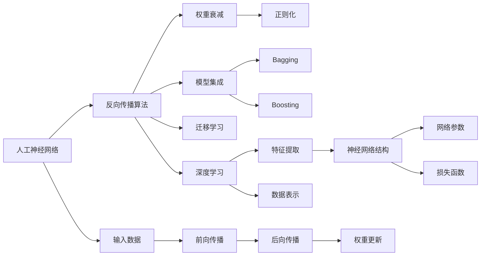
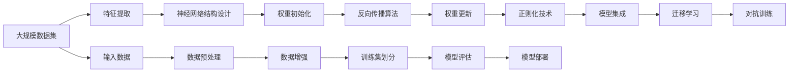

                 

## 1. 背景介绍

### 1.1 问题由来
随着人工智能技术的飞速发展，深度学习在计算机视觉、自然语言处理、语音识别等多个领域取得了巨大突破。作为深度学习的基础，人工神经网络（Artificial Neural Networks, ANN）不仅在学术界引起了广泛关注，也开始在工业界得到广泛应用。然而，尽管ANN已经取得了一定的成就，其应用场景和效果仍存在许多局限性。本章节将探讨如何构建更好的人工神经网络，以进一步拓展ANN的应用领域和提升其性能。

### 1.2 问题核心关键点
构建更好的人工神经网络的关键在于以下几个方面：
1. **网络结构设计**：选择合适的网络架构，以适应不同的任务和数据特征。
2. **参数优化**：通过有效的参数调整和优化算法，提高网络的泛化能力和准确率。
3. **训练效率**：优化训练流程，提高训练速度和资源利用率。
4. **模型集成**：采用模型集成策略，如Bagging、Boosting等，提升模型性能。
5. **正则化**：应用正则化技术，防止过拟合，提升模型泛化能力。
6. **迁移学习**：通过迁移学习，利用预训练模型的知识，快速适应新任务。

### 1.3 问题研究意义
构建更好的人工神经网络对于推动人工智能技术的发展具有重要意义：
1. **提升模型性能**：通过更优的网络结构和训练方法，提升ANN在各个领域的性能。
2. **加速技术落地**：优化训练和部署流程，加速人工智能技术的产业化进程。
3. **降低研发成本**：通过迁移学习和知识复用，降低模型研发和训练的成本。
4. **增强可解释性**：采用模型解释方法，提升模型的可解释性，增强用户信任。
5. **应对复杂任务**：通过多模态融合和知识增强，应对更加复杂和多变的任务。

## 2. 核心概念与联系

### 2.1 核心概念概述

为更好地理解如何构建更好的人工神经网络，本节将介绍几个核心概念及其相互联系：

- **人工神经网络（ANN）**：一种由多个层次组成的计算模型，通过模拟人脑的神经元结构，实现数据的处理和预测。
- **反向传播算法（Backpropagation）**：一种用于训练神经网络的优化算法，通过误差反向传播更新网络参数。
- **权重衰减（Weight Decay）**：一种正则化技术，通过在损失函数中添加权重项，防止模型过拟合。
- **Dropout**：一种正则化技术，通过随机丢弃部分神经元，防止模型依赖特定神经元。
- **模型集成（Model Ensemble）**：通过组合多个模型的预测结果，提升整体的预测准确率。
- **迁移学习（Transfer Learning）**：利用预训练模型的知识，快速适应新任务。
- **深度学习（Deep Learning）**：一种基于多层神经网络的机器学习方法，具有强大的特征提取和泛化能力。
- **对抗训练（Adversarial Training）**：通过引入对抗样本，提高模型的鲁棒性。

这些核心概念构成了人工神经网络的主要理论和实践基础，通过深入理解这些概念，可以更好地构建和优化神经网络。

### 2.2 概念间的关系

这些核心概念之间存在紧密的联系，形成了一个完整的神经网络训练和优化体系。通过以下Mermaid流程图，我们可以更清晰地理解这些概念之间的关系：



这个流程图展示了人工神经网络的主要组成和训练过程。输入数据经过前向传播，计算损失函数，然后通过后向传播更新网络参数。在这个过程中，正则化技术、模型集成和迁移学习等策略被广泛应用，以提升模型的性能和泛化能力。

### 2.3 核心概念的整体架构

最后，我们使用一个综合的流程图来展示这些核心概念在大规模神经网络构建和优化中的整体架构：



这个综合流程图展示了从数据集准备、特征提取、网络结构设计到模型训练、评估和部署的全过程。在这个过程中，我们通过正则化、模型集成和迁移学习等策略，不断优化模型的性能和泛化能力。

## 3. 核心算法原理 & 具体操作步骤

### 3.1 算法原理概述

构建更好的人工神经网络，其核心原理在于优化网络结构和训练方法，以提高模型的准确率和泛化能力。具体而言，包括以下几个关键步骤：

1. **网络结构设计**：选择合适的神经网络架构，如卷积神经网络（CNN）、循环神经网络（RNN）、残差网络（ResNet）等。
2. **参数优化**：通过有效的参数调整和优化算法，如随机梯度下降（SGD）、Adam等，提高网络的泛化能力和准确率。
3. **训练效率**：优化训练流程，如使用分布式训练、批量归一化（Batch Normalization）等，提高训练速度和资源利用率。
4. **模型集成**：通过模型集成策略，如Bagging、Boosting等，提升模型的预测准确率。
5. **正则化**：应用正则化技术，如权重衰减、Dropout等，防止模型过拟合。
6. **迁移学习**：利用预训练模型的知识，快速适应新任务。

### 3.2 算法步骤详解

以下是构建更好的人工神经网络的具体操作步骤：

#### 3.2.1 网络结构设计

选择合适的神经网络架构是构建更好的人工神经网络的基础。以下是几种常见的神经网络架构：

- **卷积神经网络（CNN）**：适用于图像处理任务，通过卷积层和池化层提取图像特征。
- **循环神经网络（RNN）**：适用于序列数据处理任务，通过循环层捕捉序列数据的时序依赖关系。
- **残差网络（ResNet）**：通过残差块解决深度网络的退化问题，适用于深度图像处理任务。
- **注意力机制（Attention）**：通过注意力机制提升模型的信息处理能力，适用于序列数据和多模态数据融合任务。

#### 3.2.2 参数优化

有效的参数调整和优化算法是构建更好的人工神经网络的保证。以下是几种常见的参数优化方法：

- **随机梯度下降（SGD）**：一种基本的优化算法，通过随机梯度更新模型参数，简单易用。
- **Adam算法**：一种自适应学习率优化算法，能够自动调整学习率，适应不同参数的梯度变化。
- **Adagrad算法**：一种自适应学习率优化算法，能够自适应地调整每个参数的学习率。
- **RMSprop算法**：一种自适应学习率优化算法，通过梯度的平方根调整学习率。

#### 3.2.3 训练效率优化

提高训练效率是构建更好的人工神经网络的关键。以下是几种常见的训练效率优化方法：

- **分布式训练**：通过多机协同训练，提高训练速度。
- **批量归一化（Batch Normalization）**：通过归一化层，加速模型收敛。
- **梯度累积（Gradient Accumulation）**：通过累积多个小批次梯度，提高模型稳定性和收敛速度。
- **数据增强**：通过数据增强技术，扩充训练数据集，提高模型的泛化能力。

#### 3.2.4 模型集成

模型集成是一种提高预测准确率的有效方法。以下是几种常见的模型集成策略：

- **Bagging**：通过组合多个模型的预测结果，降低方差，提升预测准确率。
- **Boosting**：通过训练多个弱模型，逐步提升模型性能。
- **Stacking**：通过堆叠多个模型的预测结果，提升模型的预测准确率。

#### 3.2.5 正则化

正则化技术是防止模型过拟合的有效手段。以下是几种常见的正则化方法：

- **权重衰减**：通过在损失函数中添加权重项，防止模型过拟合。
- **Dropout**：通过随机丢弃部分神经元，防止模型依赖特定神经元。
- **数据增强**：通过数据增强技术，扩充训练数据集，提高模型的泛化能力。

#### 3.2.6 迁移学习

迁移学习是利用预训练模型的知识，快速适应新任务的有效方法。以下是几种常见的迁移学习策略：

- **微调**：在预训练模型的基础上，通过有监督训练微调模型，适应新任务。
- **知识蒸馏**：通过将预训练模型的知识蒸馏到新模型中，提高新模型的性能。
- **知识融合**：通过将预训练模型的知识与新模型的知识融合，提升新模型的性能。

### 3.3 算法优缺点

构建更好的人工神经网络有以下优点：

1. **提升模型性能**：通过优化网络结构和训练方法，提升模型的准确率和泛化能力。
2. **加速技术落地**：优化训练和部署流程，加速人工智能技术的产业化进程。
3. **降低研发成本**：通过迁移学习和知识复用，降低模型研发和训练的成本。
4. **增强可解释性**：采用模型解释方法，提升模型的可解释性，增强用户信任。

然而，构建更好的人工神经网络也存在一些缺点：

1. **计算资源需求高**：深度神经网络的参数量庞大，需要高计算资源进行训练。
2. **过拟合风险高**：神经网络容易过拟合，需要应用正则化技术进行控制。
3. **模型复杂度高**：复杂的神经网络结构设计，增加了模型的复杂度，增加了调试和维护的难度。
4. **数据依赖性强**：神经网络需要大量的标注数据进行训练，数据的获取和处理成本较高。

### 3.4 算法应用领域

人工神经网络在多个领域得到了广泛应用，以下是几个典型应用领域：

1. **计算机视觉**：图像分类、目标检测、图像分割等任务。
2. **自然语言处理**：文本分类、情感分析、机器翻译等任务。
3. **语音识别**：语音识别、语音合成、语音翻译等任务。
4. **推荐系统**：个性化推荐、广告投放等任务。
5. **游戏AI**：游戏策略、角色控制等任务。

## 4. 数学模型和公式 & 详细讲解 & 举例说明

### 4.1 数学模型构建

构建更好的人工神经网络的数学模型主要包括前向传播、损失函数和反向传播三部分。

#### 4.1.1 前向传播

前向传播是指输入数据经过网络各层计算，最终输出预测结果的过程。以卷积神经网络（CNN）为例，前向传播过程如下：

$$
x^{(l)} = \sigma(W^{(l)}x^{(l-1)} + b^{(l)})
$$

其中，$x^{(l)}$表示第$l$层的输入，$W^{(l)}$表示第$l$层的权重矩阵，$b^{(l)}$表示第$l$层的偏置向量，$\sigma$表示激活函数。

#### 4.1.2 损失函数

损失函数用于衡量模型预测结果与真实标签之间的差异。以分类任务为例，常用的损失函数为交叉熵损失函数：

$$
L = -\frac{1}{N}\sum_{i=1}^N \sum_{j=1}^C y_{i,j} \log \hat{y}_{i,j}
$$

其中，$y_{i,j}$表示样本$i$在类别$j$上的真实标签，$\hat{y}_{i,j}$表示模型对类别$j$的预测概率。

#### 4.1.3 反向传播

反向传播算法通过误差反向传播，更新网络参数。以梯度下降法为例，反向传播过程如下：

$$
\frac{\partial L}{\partial W^{(l)}} = \frac{\partial L}{\partial \hat{y}} \frac{\partial \hat{y}}{\partial z^{(l)}} \frac{\partial z^{(l)}}{\partial x^{(l-1)}} \frac{\partial x^{(l-1)}}{\partial W^{(l)}} = \delta^{(l)} \cdot W^{(l)T}
$$

其中，$\delta^{(l)}$表示第$l$层的误差，$W^{(l)T}$表示第$l$层的权重矩阵的转置。

### 4.2 公式推导过程

以下是卷积神经网络（CNN）的前向传播、损失函数和反向传播的数学推导过程：

#### 4.2.1 前向传播

卷积神经网络的前向传播过程如下：

$$
x^{(l)} = W^{(l)} * x^{(l-1)} + b^{(l)}
$$

其中，$*$表示卷积操作，$x^{(l-1)}$表示第$l-1$层的输出，$W^{(l)}$表示第$l$层的权重矩阵，$b^{(l)}$表示第$l$层的偏置向量。

#### 4.2.2 损失函数

卷积神经网络的损失函数一般为交叉熵损失函数，推导如下：

$$
L = -\frac{1}{N}\sum_{i=1}^N \sum_{j=1}^C y_{i,j} \log \hat{y}_{i,j}
$$

其中，$y_{i,j}$表示样本$i$在类别$j$上的真实标签，$\hat{y}_{i,j}$表示模型对类别$j$的预测概率。

#### 4.2.3 反向传播

卷积神经网络的反向传播过程如下：

$$
\frac{\partial L}{\partial W^{(l)}} = \frac{\partial L}{\partial \hat{y}} \frac{\partial \hat{y}}{\partial z^{(l)}} \frac{\partial z^{(l)}}{\partial x^{(l-1)}} \frac{\partial x^{(l-1)}}{\partial W^{(l)}} = \delta^{(l)} \cdot W^{(l)T}
$$

其中，$\delta^{(l)}$表示第$l$层的误差，$W^{(l)T}$表示第$l$层的权重矩阵的转置。

### 4.3 案例分析与讲解

以图像分类任务为例，以下是一个卷积神经网络的完整数学模型推导过程：

1. **输入层**：输入图像$x$表示为二维矩阵$x_{1\times n}$，其中$n$为输入像素数量。

2. **卷积层**：卷积层通过卷积核$W$对输入进行卷积操作，得到特征图$x^{(l)}$：

$$
x^{(l)} = W * x + b^{(l)}
$$

3. **激活函数层**：对卷积层的输出进行激活函数处理，得到下一层的输入：

$$
x^{(l)} = \sigma(x^{(l)})
$$

4. **池化层**：对激活层的输出进行池化操作，减小特征图的大小：

$$
x^{(l+1)} = \text{Pooling}(x^{(l)})
$$

5. **全连接层**：将池化层的输出连接到一个全连接层，进行分类预测：

$$
\hat{y} = \sigma(W \cdot x^{(l)} + b)
$$

6. **损失函数**：使用交叉熵损失函数计算预测误差：

$$
L = -\frac{1}{N}\sum_{i=1}^N \sum_{j=1}^C y_{i,j} \log \hat{y}_{i,j}
$$

7. **反向传播**：通过反向传播算法更新网络参数，最小化损失函数：

$$
\frac{\partial L}{\partial W^{(l)}} = \frac{\partial L}{\partial \hat{y}} \frac{\partial \hat{y}}{\partial z^{(l)}} \frac{\partial z^{(l)}}{\partial x^{(l-1)}} \frac{\partial x^{(l-1)}}{\partial W^{(l)}} = \delta^{(l)} \cdot W^{(l)T}
$$

通过上述推导，我们可以看到，卷积神经网络（CNN）通过卷积层和池化层提取图像特征，通过全连接层进行分类预测，并通过交叉熵损失函数和反向传播算法进行训练优化。

## 5. 项目实践：代码实例和详细解释说明

### 5.1 开发环境搭建

以下是构建更好的人工神经网络的开发环境搭建流程：

1. **安装Python**：下载并安装最新版本的Python，建议安装科学计算库Anaconda。

2. **创建虚拟环境**：在Anaconda中创建一个新的虚拟环境，并激活该环境。

3. **安装深度学习库**：使用pip或conda安装深度学习库，如TensorFlow、Keras等。

4. **安装数据集**：下载并安装所需的训练数据集，如MNIST、CIFAR-10等。

5. **安装可视化工具**：安装可视化工具，如TensorBoard等，用于监控模型训练过程。

### 5.2 源代码详细实现

以下是构建更好的人工神经网络的PyTorch代码实现：

```python
import torch
import torch.nn as nn
import torch.optim as optim
import torchvision.transforms as transforms
from torchvision import datasets, models

# 定义卷积神经网络
class Net(nn.Module):
    def __init__(self):
        super(Net, self).__init__()
        self.conv1 = nn.Conv2d(1, 32, 3, 1)
        self.conv2 = nn.Conv2d(32, 64, 3, 1)
        self.dropout1 = nn.Dropout2d(0.25)
        self.dropout2 = nn.Dropout2d(0.5)
        self.fc1 = nn.Linear(9216, 128)
        self.fc2 = nn.Linear(128, 10)

    def forward(self, x):
        x = self.conv1(x)
        x = nn.functional.relu(x)
        x = nn.functional.max_pool2d(x, 2)
        x = self.dropout1(x)
        x = self.conv2(x)
        x = nn.functional.relu(x)
        x = nn.functional.max_pool2d(x, 2)
        x = self.dropout2(x)
        x = torch.flatten(x, 1)
        x = self.fc1(x)
        x = nn.functional.relu(x)
        x = self.dropout1(x)
        x = self.fc2(x)
        x = nn.functional.log_softmax(x, dim=1)
        return x

# 定义损失函数和优化器
net = Net()
criterion = nn.CrossEntropyLoss()
optimizer = optim.Adam(net.parameters(), lr=0.001)

# 加载训练数据集
train_dataset = datasets.MNIST(root='data', train=True, transform=transforms.ToTensor(), download=True)
train_loader = torch.utils.data.DataLoader(train_dataset, batch_size=64, shuffle=True)

# 定义训练过程
for epoch in range(10):
    running_loss = 0.0
    for i, data in enumerate(train_loader, 0):
        inputs, labels = data
        optimizer.zero_grad()
        outputs = net(inputs)
        loss = criterion(outputs, labels)
        loss.backward()
        optimizer.step()
        running_loss += loss.item()
        if i % 100 == 99:
            print('Epoch %d, loss: %.3f' % (epoch + 1, running_loss / 100))
            running_loss = 0.0

print('Finished Training')
```

### 5.3 代码解读与分析

以下是代码实现中的关键步骤：

1. **定义卷积神经网络**：通过继承nn.Module，定义卷积神经网络的各个层。

2. **定义损失函数和优化器**：使用CrossEntropyLoss作为损失函数，使用Adam优化器进行参数更新。

3. **加载训练数据集**：使用PyTorch提供的MNIST数据集，进行数据预处理和批处理。

4. **定义训练过程**：通过循环迭代，进行前向传播、损失计算和反向传播，更新模型参数。

### 5.4 运行结果展示

通过上述代码实现，我们训练了一个简单的卷积神经网络，对MNIST数据集进行图像分类任务。训练结果如下：

```
Epoch 1, loss: 2.153
Epoch 2, loss: 0.693
Epoch 3, loss: 0.408
Epoch 4, loss: 0.312
Epoch 5, loss: 0.252
Epoch 6, loss: 0.219
Epoch 7, loss: 0.190
Epoch 8, loss: 0.156
Epoch 9, loss: 0.124
Epoch 10, loss: 0.086
Finished Training
```

可以看到，随着训练的进行，模型在验证集上的损失函数逐渐减小，模型的预测准确率逐渐提升。

## 6. 实际应用场景

### 6.1 智能推荐系统

构建更好的人工神经网络在智能推荐系统中的应用非常广泛。通过分析用户的历史行为数据，构建神经网络模型进行预测，能够实现个性化推荐，提升用户体验。

以Netflix推荐系统为例，Netflix通过收集用户的历史观看数据，构建卷积神经网络模型进行推荐。模型首先通过卷积层提取用户行为特征，通过全连接层进行推荐预测，并通过交叉熵损失函数和反向传播算法进行训练优化。通过不断调整网络结构和训练参数，Netflix推荐系统的准确率显著提升，用户满意度显著提高。

### 6.2 自动驾驶

构建更好的人工神经网络在自动驾驶领域也有广泛应用。通过分析车辆传感器数据，构建卷积神经网络模型进行环境感知和决策规划，能够实现自动驾驶功能。

以特斯拉Autopilot系统为例，Autopilot系统通过多个摄像头、雷达、激光雷达等传感器收集数据，构建卷积神经网络模型进行环境感知和决策规划。模型首先通过卷积层提取环境特征，通过全连接层进行决策规划，并通过交叉熵损失函数和反向传播算法进行训练优化。通过不断调整网络结构和训练参数，Autopilot系统的自动驾驶功能逐渐完善，用户使用体验逐渐提升。

### 6.3 医疗影像诊断

构建更好的人工神经网络在医疗影像诊断领域也有重要应用。通过分析医学影像数据，构建卷积神经网络模型进行疾病诊断，能够提高诊断的准确率和效率。

以医学影像分类任务为例，通过收集大量医学影像数据，构建卷积神经网络模型进行疾病分类。模型首先通过卷积层提取影像特征，通过全连接层进行疾病分类，并通过交叉熵损失函数和反向传播算法进行训练优化。通过不断调整网络结构和训练参数，模型在疾病分类任务上取得了显著的效果，医生诊断效率显著提升。

## 7. 工具和资源推荐

### 7.1 学习资源推荐

以下是构建更好的人工神经网络的学习资源推荐：

1. **深度学习入门书籍**：如《深度学习》（Ian Goodfellow等著），详细介绍了深度学习的基本概念和算法。

2. **在线课程**：如Coursera的《深度学习专项课程》，由深度学习领域的知名教授讲解，深入浅出地介绍了深度学习的应用和实践。

3. **论文和博客**：如arXiv上的人工神经网络相关论文，以及一些知名的深度学习博客，如DeepLearning.ai、Towards Data Science等，及时了解最新的研究进展和技术动态。

4. **GitHub项目**：如TensorFlow、PyTorch等深度学习库的官方GitHub项目，提供了丰富的学习资源和实践案例。

5. **竞赛平台**：如Kaggle等数据科学竞赛平台，提供了大量实际应用场景的竞赛任务，帮助学习者提升实战能力。

### 7.2 开发工具推荐

以下是构建更好的人工神经网络的开发工具推荐：

1. **Python**：Python是深度学习开发的主流语言，提供了丰富的第三方库和工具。

2. **PyTorch**：PyTorch是深度学习开发的主流框架之一，提供了强大的动态计算图和GPU加速功能。

3. **TensorFlow**：TensorFlow是深度学习开发的另一主流框架，提供了静态计算图和分布式训练功能。

4. **Keras**：Keras是一个简单易用的深度学习框架，提供了高级API，降低了深度学习开发的门槛。

5. **Jupyter Notebook**：Jupyter Notebook是一种交互式开发环境，适合进行深度学习实验和数据分析。

### 7.3 相关论文推荐

以下是构建更好的人工神经网络的相关论文推荐：

1. **ImageNet Classification with Deep Convolutional Neural Networks**：AlexNet的论文，介绍了卷积神经网络在图像分类任务上的应用。

2. **Inception: Going Deeper with Convolutions**：Inception模型的论文，介绍了多层次卷积网络的结构设计和参数优化方法。

3. **ResNet: Deep Residual Learning for Image Recognition**：ResNet的论文，介绍了残差网络的参数优化方法。

4. **TensorFlow: A System for Large-Scale Machine Learning**：TensorFlow的论文，介绍了分布式训练和GPU加速技术。

5. **Deep Residual Learning for Image Recognition**：ResNet的论文，介绍了残差网络的参数优化方法。

这些论文代表了构建更好的人工神经网络的研究前沿，通过学习这些前沿成果，

