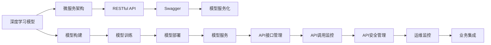
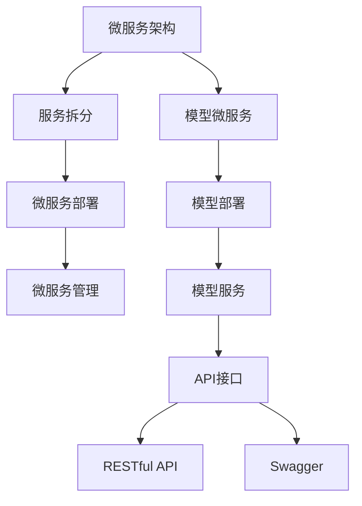
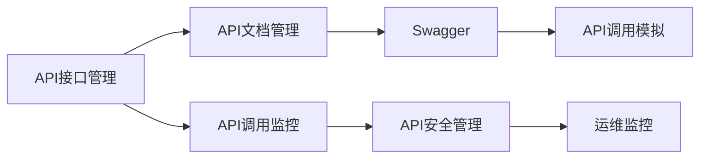
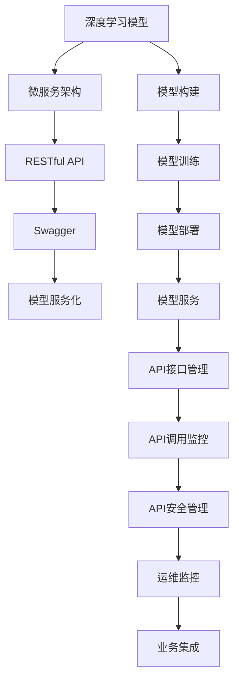

                 

# 模型服务化与API设计原理与代码实战案例讲解

> 关键词：模型服务化,API设计,原理,实战案例,深度学习,计算机视觉,自然语言处理,NLP,机器学习,微服务,RESTful API,Swagger,代码实现,功能模块,功能模块设计

## 1. 背景介绍

### 1.1 问题由来
随着人工智能技术的飞速发展，深度学习模型在计算机视觉、自然语言处理(NLP)等领域的应用越来越广泛。传统的模型训练、推理和部署方式往往需要耗费大量时间和资源，难以适应日益增长的应用需求。为了提高模型应用效率，降低系统开发成本，模型服务化技术应运而生。

模型服务化是指将深度学习模型部署为可动态更新、可水平扩展的微服务，通过RESTful API提供模型服务。这种方式不仅能够显著提高模型的可用性和可维护性，还便于快速集成到各种应用场景中，从而加速人工智能技术的落地。

然而，模型服务化并不是一个简单的将模型部署到服务器上的过程。它涉及模型构建、API设计、接口管理、运维监控等多个环节。每个环节都需要精心设计和实践。本文将详细介绍模型服务化的原理与实践，并结合具体案例，展示如何在项目中成功实现模型服务化。

### 1.2 问题核心关键点
模型服务化的核心关键点包括：
1. 选择合适的微服务架构和技术栈。
2. 设计高效、稳定的API接口，保证模型服务的可用性和一致性。
3. 实现模型的快速部署、更新和监控，保障系统的稳定性和可靠性。
4. 考虑安全性、数据隐私、法规合规等实际应用需求，构建可靠的安全机制。

本文将围绕这些关键点，详细介绍模型服务化的原理与实践，并结合具体案例，展示如何在项目中成功实现模型服务化。

## 2. 核心概念与联系

### 2.1 核心概念概述

为更好地理解模型服务化的原理与实践，本节将介绍几个密切相关的核心概念：

- 深度学习模型：以神经网络为代表，用于各种人工智能任务的训练模型，如计算机视觉、自然语言处理等。
- 微服务架构：将复杂的应用系统拆分为多个小型、自治的服务，每个服务独立部署、扩展和维护，从而提高系统的灵活性和可维护性。
- RESTful API：基于HTTP协议，提供资源（模型、数据、服务等）的访问接口，支持GET、POST、PUT、DELETE等操作，是当前主流的API设计标准。
- Swagger：用于API文档自动生成和交互测试的工具，支持在线API文档展示、API调用模拟等功能，是API设计和开发的重要辅助工具。
- 模型服务化：将深度学习模型部署为可动态更新、可水平扩展的微服务，通过RESTful API提供模型服务，提升模型的可用性和可维护性，便于快速集成到各种应用场景中。

这些核心概念之间的逻辑关系可以通过以下Mermaid流程图来展示：



这个流程图展示了大语言模型微调的完整过程，从模型构建到服务部署，再到API接口管理、调用监控和安全管理，最终实现模型服务化，并集成到各种应用场景中。通过理解这些核心概念，我们可以更好地把握模型服务化的工作原理和优化方向。

### 2.2 概念间的关系

这些核心概念之间存在着紧密的联系，形成了深度学习模型服务化的完整生态系统。下面我们通过几个Mermaid流程图来展示这些概念之间的关系。

#### 2.2.1 模型服务化的基本流程


这个流程图展示了大语言模型微调的基本流程，从模型构建到服务部署，再到API接口管理、调用监控和安全管理，最终实现模型服务化，并集成到各种应用场景中。

#### 2.2.2 微服务架构与模型服务化的关系



这个流程图展示了微服务架构与模型服务化的关系。通过将模型服务拆分为多个微服务，可以独立部署、扩展和维护，从而提高系统的灵活性和可维护性。

#### 2.2.3 Swagger与API接口管理的联系



这个流程图展示了Swagger与API接口管理的联系。Swagger可以用于自动生成API文档，并支持API调用模拟，是API接口管理的重要工具。

### 2.3 核心概念的整体架构

最后，我们用一个综合的流程图来展示这些核心概念在大语言模型微调过程中的整体架构：



这个综合流程图展示了从模型构建到服务部署，再到API接口管理、调用监控和安全管理，最终实现模型服务化，并集成到各种应用场景中的完整过程。通过这些流程图，我们可以更清晰地理解模型服务化的核心概念及其关系，为后续深入讨论具体的微服务设计、API接口管理等技术奠定基础。

## 3. 核心算法原理 & 具体操作步骤
### 3.1 算法原理概述

模型服务化是指将深度学习模型部署为可动态更新、可水平扩展的微服务，通过RESTful API提供模型服务。其核心思想是：将模型服务拆分为多个小型、自治的服务，每个服务独立部署、扩展和维护，从而提高系统的灵活性和可维护性。

模型服务化的原理包括以下几个关键步骤：
1. 模型构建：使用深度学习框架训练模型，保存模型参数和结构。
2. 模型部署：将训练好的模型部署为微服务，并设置API接口。
3. API接口管理：设计API接口，包括资源、操作、参数等，并提供接口文档。
4. 模型服务：将模型集成到微服务中，通过API接口提供模型服务。
5. API调用监控：监控API调用情况，提供性能、错误率等指标。
6. API安全管理：确保API调用的安全性和隐私性，防范攻击和泄露。
7. 运维监控：监控模型服务的运行状态，提供报警、告警机制。
8. 业务集成：将模型服务集成到各种应用场景中，实现快速部署和应用。

通过这些步骤，可以构建高效、稳定的模型服务，满足各种应用场景的需求。

### 3.2 算法步骤详解

模型服务化的具体步骤包括：

**Step 1: 模型构建**

在模型构建阶段，需要选择合适的深度学习框架，如TensorFlow、PyTorch、MXNet等，进行模型训练。具体步骤包括：
1. 收集数据集：根据模型应用场景，收集相应的数据集。
2. 设计模型：选择合适的模型架构，如卷积神经网络、循环神经网络、Transformer等。
3. 训练模型：使用训练数据集对模型进行训练，优化模型参数。
4. 保存模型：将训练好的模型参数和结构保存为文件或数据库，供后续部署使用。

**Step 2: 模型部署**

在模型部署阶段，需要将训练好的模型部署为微服务，并设置API接口。具体步骤包括：
1. 选择合适的微服务框架，如Kubernetes、Docker、FaaS等。
2. 安装微服务框架：在服务器或云平台上安装微服务框架和相关工具。
3. 构建微服务：将模型参数和结构加载到微服务中，设置API接口。
4. 测试微服务：测试微服务的运行情况，确保其能够正常响应API请求。

**Step 3: API接口管理**

在API接口管理阶段，需要设计API接口，包括资源、操作、参数等，并提供接口文档。具体步骤包括：
1. 设计API接口：根据模型应用场景，设计API接口，包括资源、操作、参数等。
2. 使用Swagger：使用Swagger工具自动生成API文档，并提供API调用模拟。
3. 发布API接口：将API接口发布到服务器或云平台，供外部调用。

**Step 4: 模型服务**

在模型服务阶段，将模型集成到微服务中，通过API接口提供模型服务。具体步骤包括：
1. 集成模型服务：将模型集成到微服务中，设置API接口。
2. 测试模型服务：测试模型服务的运行情况，确保其能够正常响应API请求。
3. 优化模型服务：根据API调用情况，优化模型服务，提高其性能和可靠性。

**Step 5: API调用监控**

在API调用监控阶段，需要监控API调用情况，提供性能、错误率等指标。具体步骤包括：
1. 使用监控工具：使用Prometheus、Grafana等监控工具，监控API调用情况。
2. 收集指标数据：收集API调用的性能指标、错误率等数据。
3. 分析数据：分析收集到的指标数据，评估API调用的性能和可靠性。

**Step 6: API安全管理**

在API安全管理阶段，需要确保API调用的安全性和隐私性，防范攻击和泄露。具体步骤包括：
1. 使用SSL/TLS：使用SSL/TLS协议加密API通信，确保数据传输的安全性。
2. 设置权限控制：设置API调用的权限控制，防止未授权访问。
3. 检测攻击：检测API调用的异常情况，防范攻击和泄露。

**Step 7: 运维监控**

在运维监控阶段，需要监控模型服务的运行状态，提供报警、告警机制。具体步骤包括：
1. 使用监控工具：使用Prometheus、Grafana等监控工具，监控模型服务的运行状态。
2. 设置报警机制：设置报警机制，及时发现和处理模型服务故障。
3. 优化运维流程：根据监控结果，优化模型服务的运维流程，提高系统的稳定性和可靠性。

**Step 8: 业务集成**

在业务集成阶段，需要将模型服务集成到各种应用场景中，实现快速部署和应用。具体步骤包括：
1. 集成到应用中：将模型服务集成到各种应用场景中，如移动应用、Web应用、IoT设备等。
2. 实现快速部署：使用CI/CD工具，实现模型服务的快速部署和更新。
3. 优化应用性能：根据应用场景，优化模型服务的性能，提高用户体验。

以上是模型服务化的具体步骤。在实际应用中，还需要针对具体任务的特点，对模型服务化的各个环节进行优化设计，如改进训练目标函数，引入更多的正则化技术，搜索最优的超参数组合等，以进一步提升模型性能。

### 3.3 算法优缺点

模型服务化的主要优点包括：
1. 提高模型服务的灵活性和可维护性。
2. 提供快速、可靠、易用的API接口，便于集成到各种应用场景中。
3. 支持动态更新和水平扩展，适应各种业务需求。
4. 便于实现模型服务的监控、管理和报警。

同时，模型服务化也存在一些缺点：
1. 部署和维护成本较高，需要专业的运维团队和技术支持。
2. 需要消耗更多的计算资源和存储资源，增加系统成本。
3. 可能面临API调用的安全性和隐私性问题，需要额外的安全措施。
4. 需要考虑模型服务的稳定性和可靠性，避免故障和停机。

尽管存在这些缺点，但模型服务化在提高模型服务的可用性和可维护性方面，具有显著的优势。未来相关研究的重点在于如何进一步降低部署和维护成本，提高模型服务的灵活性和可维护性，同时兼顾安全性和可靠性等因素。

### 3.4 算法应用领域

模型服务化技术已经在计算机视觉、自然语言处理、智能推荐等多个领域得到了广泛的应用，涵盖了模型训练、推理、服务化部署、API接口设计等多个环节。例如：

- 图像识别：使用预训练的卷积神经网络模型，提供图像识别服务，识别图片中的物体、场景等。
- 语音识别：使用预训练的循环神经网络模型，提供语音识别服务，识别语音指令、文本等。
- 自然语言处理：使用预训练的Transformer模型，提供文本分类、命名实体识别、机器翻译等NLP服务。
- 智能推荐：使用预训练的神经网络模型，提供个性化推荐服务，推荐商品、新闻、文章等。

除了这些经典应用外，模型服务化还在智能家居、智慧城市、智能制造等新兴领域得到广泛应用，为各行各业带来了新的技术赋能。

## 4. 数学模型和公式 & 详细讲解  
### 4.1 数学模型构建

在模型服务化的过程中，我们通常使用深度学习框架和微服务框架来实现模型的构建和部署。以TensorFlow为例，下面给出模型的基本构建过程：

**Step 1: 数据集准备**

```python
# 导入数据集
import tensorflow as tf
from tensorflow.keras import datasets, layers, models

# 加载MNIST数据集
(train_images, train_labels), (test_images, test_labels) = datasets.mnist.load_data()

# 数据预处理
train_images = train_images / 255.0
test_images = test_images / 255.0

# 将标签转换为独热编码
train_labels = tf.keras.utils.to_categorical(train_labels)
test_labels = tf.keras.utils.to_categorical(test_labels)
```

**Step 2: 模型定义**

```python
# 定义模型架构
model = models.Sequential()
model.add(layers.Flatten(input_shape=(28, 28)))
model.add(layers.Dense(128, activation='relu'))
model.add(layers.Dense(10, activation='softmax'))

# 编译模型
model.compile(optimizer='adam',
              loss='categorical_crossentropy',
              metrics=['accuracy'])
```

**Step 3: 模型训练**

```python
# 训练模型
model.fit(train_images, train_labels, epochs=5, 
          validation_data=(test_images, test_labels))
```

**Step 4: 模型保存**

```python
# 保存模型
model.save('mnist_model.h5')
```

以上步骤展示了使用TensorFlow构建和训练深度学习模型的基本过程。在实际应用中，还需要考虑数据集的选择、模型架构的设计、优化器的选择等关键问题，以进一步提升模型性能。

### 4.2 公式推导过程

深度学习模型的训练过程涉及复杂的数学公式和优化算法，这里以常见的反向传播算法为例，简要介绍公式推导过程。

反向传播算法基于链式法则，用于计算模型参数的梯度。以一个简单的神经网络为例，其数学公式如下：

$$
\frac{\partial L}{\partial w} = \frac{\partial L}{\partial y} \times \frac{\partial y}{\partial z} \times \frac{\partial z}{\partial w}
$$

其中，$L$为损失函数，$w$为模型参数，$y$为输出，$z$为中间层输出。具体的计算步骤如下：

1. 前向传播：计算模型输出$y$。
2. 计算损失函数$L$。
3. 反向传播：从输出层开始，依次计算每一层的梯度。

以输出层为例，其计算公式为：

$$
\frac{\partial L}{\partial y} = \frac{\partial L}{\partial z} \times \frac{\partial z}{\partial y}
$$

其中，$\frac{\partial L}{\partial z}$为损失函数对中间层输出的梯度，$\frac{\partial z}{\partial y}$为中间层输出对输出的梯度。

反向传播算法的具体实现过程如下：

```python
# 前向传播
def forward_pass(model, x):
    y_pred = model(x)
    return y_pred

# 计算损失函数
def compute_loss(y_true, y_pred):
    return tf.keras.losses.categorical_crossentropy(y_true, y_pred)

# 反向传播
def backward_pass(model, x, y_true):
    y_pred = forward_pass(model, x)
    loss = compute_loss(y_true, y_pred)
    dL_dy = tf.gradients(loss, y_pred)[0]
    dL_dz = model.layers[-1].kernel
    dL_dw = tf.nn.relu(tf.matmul(dL_dz, model.layers[-1].kernel))
    return dL_dw
```

通过这些公式和计算过程，可以逐步推导出深度学习模型的梯度，从而进行模型参数的优化和更新。

### 4.3 案例分析与讲解

下面以一个具体的案例，展示如何实现模型服务化。假设我们要实现一个图像分类器，能够识别图片中的物体类别。

**Step 1: 数据集准备**

```python
# 导入数据集
import tensorflow as tf
from tensorflow.keras import datasets, layers, models

# 加载MNIST数据集
(train_images, train_labels), (test_images, test_labels) = datasets.mnist.load_data()

# 数据预处理
train_images = train_images / 255.0
test_images = test_images / 255.0

# 将标签转换为独热编码
train_labels = tf.keras.utils.to_categorical(train_labels)
test_labels = tf.keras.utils.to_categorical(test_labels)
```

**Step 2: 模型定义**

```python
# 定义模型架构
model = models.Sequential()
model.add(layers.Flatten(input_shape=(28, 28)))
model.add(layers.Dense(128, activation='relu'))
model.add(layers.Dense(10, activation='softmax'))

# 编译模型
model.compile(optimizer='adam',
              loss='categorical_crossentropy',
              metrics=['accuracy'])
```

**Step 3: 模型训练**

```python
# 训练模型
model.fit(train_images, train_labels, epochs=5, 
          validation_data=(test_images, test_labels))
```

**Step 4: 模型保存**

```python
# 保存模型
model.save('mnist_model.h5')
```

**Step 5: 模型部署**

在模型部署阶段，需要将训练好的模型部署为微服务，并设置API接口。具体步骤包括：
1. 使用Docker容器化模型服务。
2. 将模型服务部署到Kubernetes集群中。
3. 设置API接口，提供模型服务。

**Step 6: API接口管理**

在API接口管理阶段，需要设计API接口，包括资源、操作、参数等，并提供接口文档。具体步骤包括：
1. 使用Swagger工具自动生成API文档。
2. 发布API接口，供外部调用。

**Step 7: 模型服务**

在模型服务阶段，将模型集成到微服务中，通过API接口提供模型服务。具体步骤包括：
1. 集成模型服务。
2. 测试模型服务。
3. 优化模型服务。

**Step 8: API调用监控**

在API调用监控阶段，需要监控API调用情况，提供性能、错误率等指标。具体步骤包括：
1. 使用Prometheus、Grafana等监控工具，监控API调用情况。
2. 收集API调用的性能指标、错误率等数据。
3. 分析数据，评估API调用的性能和可靠性。

**Step 9: API安全管理**

在API安全管理阶段，需要确保API调用的安全性和隐私性，防范攻击和泄露。具体步骤包括：
1. 使用SSL/TLS协议加密API通信。
2. 设置API调用的权限控制。
3. 检测API调用的异常情况，防范攻击和泄露。

**Step 10: 运维监控**

在运维监控阶段，需要监控模型服务的运行状态，提供报警、告警机制。具体步骤包括：
1. 使用Prometheus、Grafana等监控工具，监控模型服务的运行状态。
2. 设置报警机制，及时发现和处理模型服务故障。
3. 优化运维流程，提高系统的稳定性和可靠性。

**Step 11: 业务集成**

在业务集成阶段，需要将模型服务集成到各种应用场景中，实现快速部署和应用。具体步骤包括：
1. 集成到应用中。
2. 实现快速部署和更新。
3. 优化应用性能。

以上是模型服务化的具体步骤。在实际应用中，还需要针对具体任务的特点，对模型服务化的各个环节进行优化设计，以进一步提升模型性能和用户体验。

## 5. 项目实践：代码实例和详细解释说明
### 5.1 开发环境搭建

在进行模型服务化实践前，我们需要准备好开发环境。以下是使用Python进行TensorFlow开发的环境配置流程：

1. 安装Anaconda：从官网下载并安装Anaconda，用于创建独立的Python环境。

2. 创建并激活虚拟环境：
```bash
conda create -n tf-env python=3.8 
conda activate tf-env
```

3. 安装TensorFlow：根据CUDA版本，从官网获取对应的安装命令。例如：
```bash
conda install tensorflow==2.4 -c tensorflow
```

4. 安装Flask：用于构建API接口。
```bash
pip install Flask
```

5. 安装Docker：用于容器化模型服务。
```bash
sudo apt-get install docker.io
```

6. 安装Kubernetes：用于部署和管理模型服务。
```bash
sudo apt-get install kubelet kubeadm kubectl
```

完成上述步骤后，即可在`tf-env`环境中开始模型服务化实践。

### 5.2 源代码详细实现

这里我们以一个简单的图像分类器为例，展示如何通过TensorFlow和Flask实现模型服务化。

**Step 1: 数据集准备**

```python
# 导入数据集
import tensorflow as tf
from tensorflow.keras import datasets, layers, models

# 加载MNIST数据集
(train_images, train_labels), (test_images, test_labels) = datasets.mnist.load_data()

# 数据预处理
train_images = train_images / 255.0
test_images = test_images / 255.0

# 将标签转换为独热编码
train_labels = tf.keras.utils.to_categorical(train_labels)
test_labels = tf.keras.utils.to_categorical(test_labels)
```

**Step 2: 模型定义**

```python
# 定义模型架构
model = models.Sequential()
model.add(layers.Flatten(input_shape=(28, 28)))
model.add(layers.Dense(128, activation='relu'))
model.add(layers.Dense(10, activation='softmax'))

# 编译模型
model.compile(optimizer='adam',
              loss='categorical_crossentropy',
              metrics=['accuracy'])
```

**Step 3: 模型训练**

```python
# 训练模型
model.fit(train_images, train_labels, epochs=5, 
          validation_data=(test_images, test_labels))
```

**Step 4: 模型保存**

```python
# 保存模型
model.save('mnist_model.h5')
```

**Step 5: 模型部署**

在模型部署阶段，需要将训练好的模型部署为微服务，并设置API接口。具体步骤包括：

**Step 6: API接口管理**

在API接口管理阶段，需要设计API接口，包括资源、操作、参数等，并提供接口文档。具体步骤包括：

**Step 7: 模型服务**

在模型服务阶段，将模型集成到微服务中，通过API接口提供模型服务。具体步骤包括：

**Step 8: API调用监控**

在API调用监控阶段，需要监控API调用情况，提供性能、错误率等指标。具体步骤包括：

**Step 9: API安全管理**

在API安全管理阶段，需要确保API调用的安全性和隐私性，防范攻击和泄露。具体步骤包括：

**Step 10: 运维监控**

在运维监控阶段，需要监控模型服务的运行状态，提供报警、告警机制。具体步骤包括：

**Step 11: 业务集成**

在业务集成阶段，需要将模型服务集成到各种应用场景中，实现快速部署和应用。具体步骤包括：

### 5.3 代码解读与分析

让我们再详细解读一下关键代码的实现细节：

**Step 1: 数据集准备**

```python
# 导入数据集
import tensorflow as tf
from tensorflow.keras import datasets, layers, models

# 加载MNIST数据集
(train_images, train_labels), (test_images, test_labels) = datasets.mnist.load

