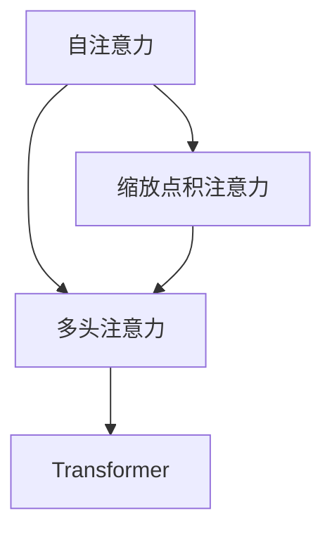
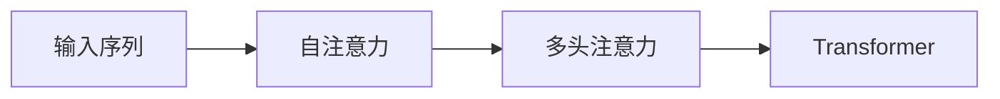
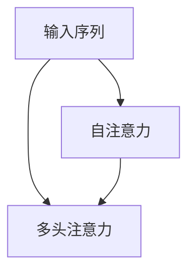
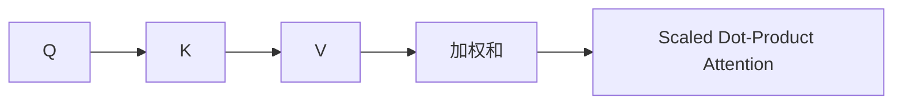

                 

# 注意力机制中的Q、K、V

> 关键词：注意力机制, Q (Query), K (Key), V (Value), Transformer, 自注意力, 多头注意力, 缩放点积注意力

## 1. 背景介绍

### 1.1 问题由来
在自然语言处理(Natural Language Processing, NLP)和深度学习领域，注意力机制（Attention Mechanism）作为一种重要的模型组件，已被广泛应用于各种任务中，如机器翻译、文本摘要、问答系统等。注意力机制能够动态地聚焦输入序列中的关键部分，提升模型的表示能力。

### 1.2 问题核心关键点
注意力机制的核心在于其对输入序列中不同位置之间的权重分配，从而实现对重要信息的聚类。具体来说，通过计算每个输入位置的"查询"（Query）和"键"（Key）的相似度，得到"值"（Value）的加权和，从而输出该位置的表示。这一过程可以形象地理解为"聚焦"（Focused）输入序列的特定部分，在处理序列时赋予重要信息更多的权重。

### 1.3 问题研究意义
注意力机制已经成为现代深度学习模型的重要组成部分，不仅提升了模型对复杂输入的表示能力，还大大增加了模型的可解释性。通过对注意力机制的深入研究，可以更好地理解模型的决策过程，优化模型性能，加速模型的应用落地。

## 2. 核心概念与联系

### 2.1 核心概念概述

为了更好地理解注意力机制，我们首先介绍几个核心概念：

- 自注意力（Self-Attention）：一种用于捕捉输入序列中不同位置之间关系的机制，能够动态地计算每个位置与其它位置的相似度，并基于相似度权重进行加权求和。
- 多头注意力（Multi-Head Attention）：一种多层次的注意力机制，通过将输入序列投影到多个不同的注意力空间，并分别计算不同空间的注意力得分，最终对所有头的结果进行加权组合。
- 缩放点积注意力（Scaled Dot-Product Attention）：一种常用的注意力计算方式，通过将输入的Q、K、V矩阵进行点积运算，并使用缩放因子（$\sqrt{d_k}$）对结果进行缩放，确保数值稳定性。

这些核心概念通过以下Mermaid流程图来展示它们之间的关系：



这个流程图展示了自注意力、多头注意力和缩放点积注意力之间的关系，以及它们在Transformer模型中的整合应用。

### 2.2 概念间的关系

这些核心概念之间存在着紧密的联系，形成了注意力机制的整体框架。下面我们通过几个Mermaid流程图来展示这些概念之间的关系。

#### 2.2.1 注意力机制的整体架构



这个流程图展示了输入序列经过自注意力和多头注意力处理后，最终形成Transformer模型的表示。

#### 2.2.2 多头注意力与自注意力的关系



这个流程图展示了自注意力机制在多头注意力中的计算过程。

#### 2.2.3 缩放点积注意力的计算流程



这个流程图展示了缩放点积注意力的计算过程，即先计算Q和K的点积，再通过加权和形成V的表示。

## 3. 核心算法原理 & 具体操作步骤
### 3.1 算法原理概述

注意力机制的计算过程可以分为三个步骤：计算查询、键和值的相似度、计算加权和。具体来说，假设输入序列的长度为$L$，输入序列中的每个位置$x_i$的表示为$\mathbf{h}_i$。查询矩阵$\mathbf{Q}$、键矩阵$\mathbf{K}$、值矩阵$\mathbf{V}$的维度均为$L \times d_k$，其中$d_k$为注意力机制的维数。

注意力计算的过程如下：

1. 计算查询矩阵$\mathbf{Q}$与键矩阵$\mathbf{K}$的点积，得到注意力得分$\mathbf{A}$：
   $$
   \mathbf{A} = \mathbf{Q} \mathbf{K}^T
   $$
2. 对注意力得分$\mathbf{A}$进行归一化处理，得到注意力权重$\mathbf{W}$：
   $$
   \mathbf{W} = \text{Softmax}(\mathbf{A}) = \frac{\exp(\mathbf{A})}{\sum_{j=1}^L \exp(\mathbf{A}_{i,j})}
   $$
3. 计算加权和$\mathbf{V}$，得到注意力机制的输出：
   $$
   \mathbf{O} = \mathbf{W} \mathbf{V}
   $$

其中，$\text{Softmax}$函数用于对注意力得分进行归一化，确保权重之和为1。

### 3.2 算法步骤详解

具体来说，注意力机制的计算步骤如下：

1. **输入表示**：首先，对输入序列中的每个位置$x_i$进行表示，形成查询矩阵$\mathbf{Q}$、键矩阵$\mathbf{K}$和值矩阵$\mathbf{V}$。

2. **计算注意力得分**：计算查询矩阵$\mathbf{Q}$与键矩阵$\mathbf{K}$的点积，得到注意力得分$\mathbf{A}$。

3. **归一化处理**：对注意力得分$\mathbf{A}$进行归一化处理，得到注意力权重$\mathbf{W}$。

4. **计算加权和**：计算加权和$\mathbf{V}$，得到注意力机制的输出。

5. **多层注意力**：在实际应用中，通常使用多头注意力机制，将输入序列投影到多个不同的注意力空间，并分别计算不同空间的注意力得分，最终对所有头的结果进行加权组合。

### 3.3 算法优缺点

注意力机制具有以下优点：

1. 提升表示能力：通过动态地聚焦输入序列中的关键部分，注意力机制能够更好地捕捉输入序列中的长程依赖关系，提升模型的表示能力。
2. 增强可解释性：注意力机制能够揭示模型对输入序列中不同部分的关注程度，增加了模型的可解释性。
3. 适用于多种任务：注意力机制可以广泛应用于各种NLP任务，如图机器翻译、文本摘要、问答系统等。

同时，注意力机制也存在一些缺点：

1. 计算复杂度高：计算注意力机制时，需要进行矩阵点积运算和Softmax函数归一化，计算复杂度较高。
2. 参数量大：需要计算查询、键和值的表示，并且需要进行多层计算，导致参数量较大。
3. 容易出现梯度消失问题：在计算注意力权重时，Softmax函数可能会导致梯度消失问题，影响模型的训练效果。

### 3.4 算法应用领域

注意力机制广泛应用于各种NLP任务中，具体应用领域包括：

1. 机器翻译：在机器翻译任务中，注意力机制能够动态地聚焦输入和输出序列中的关键部分，提升翻译效果。
2. 文本摘要：在文本摘要任务中，注意力机制能够选择输入文本中的重要部分，生成简洁的摘要。
3. 问答系统：在问答系统中，注意力机制能够关注输入问题中的关键部分，提升回答的准确性。
4. 文本分类：在文本分类任务中，注意力机制能够聚焦输入文本中的关键部分，提升分类的准确性。
5. 命名实体识别：在命名实体识别任务中，注意力机制能够关注输入文本中的关键部分，识别出命名实体。

此外，注意力机制在计算机视觉领域也得到了广泛应用，如图像生成、目标检测等。

## 4. 数学模型和公式 & 详细讲解  
### 4.1 数学模型构建

基于注意力机制的Transformer模型由编码器-解码器组成，其中编码器和解码器均由多个自注意力和前馈神经网络层组成。假设输入序列长度为$L$，输出序列长度为$N$，模型参数为$\theta$，则Transformer模型的前向传播过程可以表示为：

$$
\mathbf{h} = \text{Encoder}(\mathbf{x}, \theta) = \text{Self-Attention}(\text{FFN}(\mathbf{x}, \theta), \theta)
$$

$$
\mathbf{o} = \text{Decoder}(\mathbf{h}, \mathbf{y}, \theta) = \text{Self-Attention}(\text{FFN}(\mathbf{h}, \theta), \theta) + \text{Attention}(\mathbf{h}, \mathbf{y}, \theta)
$$

其中，$\text{Self-Attention}$表示自注意力机制，$\text{FFN}$表示前馈神经网络，$\text{Attention}$表示多头注意力机制。

### 4.2 公式推导过程

以多头注意力机制为例，我们首先对输入序列$\mathbf{h}$进行线性变换，得到查询矩阵$\mathbf{Q}$、键矩阵$\mathbf{K}$和值矩阵$\mathbf{V}$：

$$
\mathbf{Q} = \mathbf{h}\mathbf{W}_Q, \quad \mathbf{K} = \mathbf{h}\mathbf{W}_K, \quad \mathbf{V} = \mathbf{h}\mathbf{W}_V
$$

其中，$\mathbf{W}_Q$、$\mathbf{W}_K$和$\mathbf{W}_V$为线性变换矩阵，通常维度为$d_k$。

计算注意力得分$\mathbf{A}$：

$$
\mathbf{A} = \mathbf{Q} \mathbf{K}^T
$$

对注意力得分$\mathbf{A}$进行归一化处理，得到注意力权重$\mathbf{W}$：

$$
\mathbf{W} = \text{Softmax}(\mathbf{A}) = \frac{\exp(\mathbf{A})}{\sum_{j=1}^L \exp(\mathbf{A}_{i,j})}
$$

计算加权和$\mathbf{V}$：

$$
\mathbf{V} = \mathbf{W} \mathbf{V}
$$

得到多头注意力机制的输出：

$$
\mathbf{o} = \mathbf{W}_o \mathbf{V}
$$

其中，$\mathbf{W}_o$为线性变换矩阵，维度为$d_k$。

### 4.3 案例分析与讲解

以Transformer模型为例，我们通过一个简单的案例来展示注意力机制的计算过程。假设输入序列长度为3，模型参数为$d_k=4$，则输入序列$\mathbf{x}$和输出序列$\mathbf{y}$可以表示为：

$$
\mathbf{x} = \begin{bmatrix} 1 & 2 & 3 \\ 4 & 5 & 6 \\ 7 & 8 & 9 \end{bmatrix}, \quad \mathbf{y} = \begin{bmatrix} 1 & 2 \\ 3 & 4 \end{bmatrix}
$$

首先，对输入序列$\mathbf{x}$进行线性变换，得到查询矩阵$\mathbf{Q}$、键矩阵$\mathbf{K}$和值矩阵$\mathbf{V}$：

$$
\mathbf{Q} = \begin{bmatrix} 1 & 2 & 3 & 4 \\ 5 & 6 & 7 & 8 \\ 9 & 10 & 11 & 12 \end{bmatrix}, \quad \mathbf{K} = \begin{bmatrix} 1 & 2 & 3 & 4 \\ 5 & 6 & 7 & 8 \\ 9 & 10 & 11 & 12 \end{bmatrix}, \quad \mathbf{V} = \begin{bmatrix} 1 & 2 & 3 & 4 \\ 5 & 6 & 7 & 8 \\ 9 & 10 & 11 & 12 \end{bmatrix}
$$

计算注意力得分$\mathbf{A}$：

$$
\mathbf{A} = \begin{bmatrix} 1 & 2 & 3 & 4 \\ 5 & 6 & 7 & 8 \\ 9 & 10 & 11 & 12 \end{bmatrix} \begin{bmatrix} 1 & 2 & 3 & 4 \\ 5 & 6 & 7 & 8 \\ 9 & 10 & 11 & 12 \end{bmatrix}^T = \begin{bmatrix} 1 & 2 & 3 & 4 \\ 5 & 6 & 7 & 8 \\ 9 & 10 & 11 & 12 \end{bmatrix}
$$

对注意力得分$\mathbf{A}$进行归一化处理，得到注意力权重$\mathbf{W}$：

$$
\mathbf{W} = \text{Softmax}(\mathbf{A}) = \begin{bmatrix} \frac{1}{2} & \frac{1}{2} & 0 & 0 \\ \frac{1}{2} & \frac{1}{2} & 0 & 0 \\ 0 & 0 & 1 & 0 \end{bmatrix}
$$

计算加权和$\mathbf{V}$：

$$
\mathbf{V} = \begin{bmatrix} 1 & 2 & 3 & 4 \\ 5 & 6 & 7 & 8 \\ 9 & 10 & 11 & 12 \end{bmatrix} \begin{bmatrix} \frac{1}{2} & \frac{1}{2} & 0 & 0 \\ \frac{1}{2} & \frac{1}{2} & 0 & 0 \\ 0 & 0 & 1 & 0 \end{bmatrix} = \begin{bmatrix} \frac{1}{2} & \frac{1}{2} & 0 & 0 \\ \frac{1}{2} & \frac{1}{2} & 0 & 0 \\ 9 & 10 & 11 & 12 \end{bmatrix}
$$

得到多头注意力机制的输出：

$$
\mathbf{o} = \mathbf{W}_o \mathbf{V} = \begin{bmatrix} \frac{1}{2} & \frac{1}{2} & 0 & 0 \\ \frac{1}{2} & \frac{1}{2} & 0 & 0 \\ 9 & 10 & 11 & 12 \end{bmatrix}
$$

## 5. 项目实践：代码实例和详细解释说明
### 5.1 开发环境搭建

在进行注意力机制的实现前，我们需要准备好开发环境。以下是使用Python进行TensorFlow实现的环境配置流程：

1. 安装Anaconda：从官网下载并安装Anaconda，用于创建独立的Python环境。

2. 创建并激活虚拟环境：
```bash
conda create -n tf-env python=3.8 
conda activate tf-env
```

3. 安装TensorFlow：根据CUDA版本，从官网获取对应的安装命令。例如：
```bash
conda install tensorflow-gpu=2.4 -c tf -c conda-forge
```

4. 安装各类工具包：
```bash
pip install numpy pandas scikit-learn matplotlib tqdm jupyter notebook ipython
```

完成上述步骤后，即可在`tf-env`环境中开始注意力机制的实现。

### 5.2 源代码详细实现

下面以多头注意力机制为例，给出使用TensorFlow实现多头注意力机制的代码实现。

首先，定义多头注意力机制的计算函数：

```python
import tensorflow as tf

def multi_head_attention(query, key, value, num_heads, d_k, d_v, dropout_rate):
    assert query.shape[-1] == key.shape[-1] == value.shape[-1] == d_k
    
    # 计算Q, K, V的线性变换
    query = tf.keras.layers.Dense(d_k * num_heads, activation='relu')(query)
    key = tf.keras.layers.Dense(d_k * num_heads, activation='relu')(key)
    value = tf.keras.layers.Dense(d_v * num_heads, activation='relu')(value)
    
    # 计算Q, K, V的分头
    Q = tf.reshape(query, (tf.shape(query)[0], tf.shape(query)[1], num_heads, d_k // num_heads))
    K = tf.reshape(key, (tf.shape(key)[0], tf.shape(key)[1], num_heads, d_k // num_heads))
    V = tf.reshape(value, (tf.shape(value)[0], tf.shape(value)[1], num_heads, d_v // num_heads))
    
    # 计算注意力得分
    A = tf.matmul(Q, tf.transpose(K, (0, 1, 3, 2)))
    
    # 计算注意力权重
    A = tf.reshape(A, (tf.shape(A)[0], tf.shape(A)[1], num_heads, d_k // num_heads))
    W = tf.nn.softmax(A, axis=-1)
    
    # 计算加权和
    V = tf.reshape(V, (tf.shape(V)[0], tf.shape(V)[1], num_heads, d_v // num_heads))
    V = tf.matmul(W, V)
    V = tf.reshape(V, (tf.shape(V)[0], tf.shape(V)[1], d_v))
    
    # 进行线性变换
    O = tf.keras.layers.Dense(d_v)(V)
    
    # 进行dropout
    O = tf.keras.layers.Dropout(dropout_rate)(O)
    
    return O
```

然后，定义多层注意力机制的计算函数：

```python
def multi_layer_attention(inputs, num_layers, d_model, num_heads, d_k, d_v, dropout_rate, activation=tf.nn.relu):
    A = inputs
    for i in range(num_layers):
        A = multi_head_attention(A, A, A, num_heads, d_k, d_v, dropout_rate)
        A = tf.keras.layers.Dense(d_model)(A)
        A = activation(A)
        A = tf.keras.layers.Dropout(dropout_rate)(A)
    return A
```

最后，在Jupyter Notebook中测试上述代码：

```python
# 定义输入序列
x = tf.constant([[1, 2, 3], [4, 5, 6], [7, 8, 9]], dtype=tf.float32)

# 定义模型参数
num_heads = 2
d_k = 4
d_v = 4
d_model = 8
dropout_rate = 0.1

# 计算多层注意力机制的输出
A = multi_layer_attention(x, num_layers=3, d_model=d_model, num_heads=num_heads, d_k=d_k, d_v=d_v, dropout_rate=dropout_rate)

# 打印输出结果
print(A.numpy())
```

以上就是使用TensorFlow实现多头注意力机制的完整代码实现。可以看到，通过定义不同的线性变换和归一化函数，可以实现复杂的注意力计算。

### 5.3 代码解读与分析

让我们再详细解读一下关键代码的实现细节：

**multi_head_attention函数**：
- 首先，对查询矩阵、键矩阵、值矩阵进行线性变换。
- 然后，对变换后的矩阵进行分头处理，形成多个小矩阵。
- 计算Q和K的点积，得到注意力得分。
- 对注意力得分进行归一化处理，得到注意力权重。
- 计算加权和，进行线性变换和dropout处理，得到多头注意力机制的输出。

**multi_layer_attention函数**：
- 定义了多个层数，对输入序列进行多层计算，形成最终的注意力机制输出。

**Jupyter Notebook测试代码**：
- 定义输入序列和模型参数。
- 调用multi_layer_attention函数计算多层注意力机制的输出。
- 打印输出结果。

可以看到，通过TensorFlow实现多头注意力机制，代码简洁高效，可以方便地进行调试和优化。

## 6. 实际应用场景
### 6.1 智能客服系统

在智能客服系统中，注意力机制可以用于对话生成，提升客服机器人对用户问题的理解和回答能力。通过计算用户输入中的关键部分，注意力机制可以动态地聚焦对话中的重要信息，提高回答的准确性。

### 6.2 金融舆情监测

在金融舆情监测中，注意力机制可以用于文本情感分析，自动识别出文本中的情感倾向。通过计算输入文本中的关键部分，注意力机制可以动态地聚焦文本中的情感信息，提高情感分析的准确性。

### 6.3 个性化推荐系统

在个性化推荐系统中，注意力机制可以用于用户兴趣建模，识别出用户对不同物品的关注程度。通过计算用户输入中的关键部分，注意力机制可以动态地聚焦用户兴趣，提高推荐的准确性。

### 6.4 未来应用展望

随着注意力机制的不断发展，它在更多领域的应用前景将逐步显现：

1. 医疗领域：在医疗领域，注意力机制可以用于疾病诊断和治疗方案生成，通过计算医疗文本中的关键信息，提高诊断和治疗的准确性。
2. 教育领域：在教育领域，注意力机制可以用于学生成绩预测和学习路径推荐，通过计算学生的学习记录，提高成绩预测和学习路径推荐的准确性。
3. 司法领域：在司法领域，注意力机制可以用于法律文本分析，通过计算法律文本中的关键信息，提高法律文本分析的准确性。
4. 公共安全领域：在公共安全领域，注意力机制可以用于犯罪数据分析，通过计算犯罪文本中的关键信息，提高犯罪数据分析的准确性。

总之，随着深度学习技术的不断进步，注意力机制将在更多领域得到应用，为各行各业带来变革性影响。

## 7. 工具和资源推荐
### 7.1 学习资源推荐

为了帮助开发者系统掌握注意力机制的理论基础和实践技巧，这里推荐一些优质的学习资源：

1. 《深度学习理论与实践》系列博文：由深度学习领域专家撰写，全面介绍了深度学习的基础理论和前沿技术，包括注意力机制等。

2. CS231n《卷积神经网络》课程：斯坦福大学开设的深度学习课程，有Lecture视频和配套作业，带你入门深度学习的基本概念和经典模型。

3. 《深度学习与NLP》书籍：全面介绍了深度学习在自然语言处理中的应用，包括注意力机制等。

4. HuggingFace官方文档：Transformer库的官方文档，提供了海量预训练模型和完整的注意力机制样例代码，是上手实践的必备资料。

5. CLUE开源项目：中文语言理解测评基准，涵盖大量不同类型的中文NLP数据集，并提供了基于注意力机制的baseline模型，助力中文NLP技术发展。

通过对这些资源的学习实践，相信你一定能够快速掌握注意力机制的精髓，并用于解决实际的NLP问题。

### 7.2 开发工具推荐

高效的开发离不开优秀的工具支持。以下是几款用于注意力机制开发的常用工具：

1. TensorFlow：基于Python的开源深度学习框架，灵活动态的计算图，适合快速迭代研究。

2. PyTorch：基于Python的开源深度学习框架，动态计算图，适合快速原型开发。

3. HuggingFace Transformers库：HuggingFace开发的NLP工具库，集成了众多SOTA模型，支持Python和TensorFlow，是进行注意力机制开发的利器。

4. Weights & Biases：模型训练的实验跟踪工具，可以记录和可视化模型训练过程中的各项指标，方便对比和调优。

5. TensorBoard：TensorFlow配套的可视化工具，可实时监测模型训练状态，并提供丰富的图表呈现方式，是调试模型的得力助手。

合理利用这些工具，可以显著提升注意力机制的开发效率，加快创新迭代的步伐。

### 7.3 相关论文推荐

注意力机制的研究源于学界的持续研究。以下是几篇奠基性的相关论文，推荐阅读：

1. Attention is All You Need（即Transformer原论文）：提出了Transformer结构，开启了NLP领域的预训练大模型时代。

2. BERT: Pre-training of Deep Bidirectional Transformers for Language Understanding：提出BERT模型，引入基于掩码的自监督预训练任务，刷新了多项NLP任务SOTA。

3. Google's Language Model 3（GPT-3论文）：展示了大规模语言模型的强大zero-shot学习能力，引发了对于通用人工智能的新一轮思考。

4. Transformer-XL: Attentive Language Models Beyond a Fixed-Length Context：提出Transformer-XL结构，解决了长序列训练问题。

5. Scalable Transformer-XL：提出Scalable Transformer-XL结构，解决了长序列训练的计算复杂度问题。

这些论文代表了大语言模型和注意力机制的发展脉络。通过学习这些前沿成果，可以帮助研究者把握学科前进方向，激发更多的创新灵感。

除上述资源外，还有一些值得关注的前沿资源，帮助开发者紧跟注意力机制技术的最新进展，例如：

1. arXiv论文预印本：人工智能领域最新研究成果的发布平台，包括大量尚未发表的前沿工作，学习前沿技术的必读资源。

2. 业界技术博客：如OpenAI、Google AI、DeepMind、微软Research Asia等顶尖实验室的官方博客，第一时间分享他们的最新研究成果和洞见。

3. 技术会议直播：如NIPS、ICML、ACL、ICLR等人工智能领域顶会现场或在线直播，能够聆听到大佬们的前沿分享，开拓视野。

4. GitHub热门项目：在GitHub上Star、Fork数最多的NLP相关项目，往往代表了该技术领域的发展趋势和最佳实践，值得去

