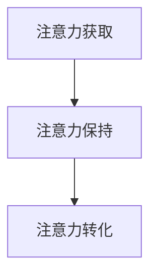

                 

# 注意力经济对传统节日营销的影响

在数字化时代，注意力经济已成为商业竞争的关键。传统节日营销作为品牌推广和消费者互动的重要手段，在当前市场环境下，必须采取新的策略以吸引和保持消费者的注意力。本篇文章将从注意力经济的角度，探讨传统节日营销的挑战与机遇，以及如何利用注意力经济理论来优化营销策略，提升品牌价值。

## 1. 背景介绍

### 1.1 问题由来
随着互联网的普及和数字技术的快速发展，消费者获取信息和娱乐的方式发生了根本性的变化。在信息爆炸的时代，消费者的注意力变得愈发稀缺和宝贵。传统节日营销，尤其是线下营销，面临着数字化转型的巨大挑战。

### 1.2 问题核心关键点
注意力经济的核心在于如何有效获取、保持和利用消费者的注意力。在传统节日营销中，核心问题包括：

- 如何通过数字化手段提升品牌曝光率和用户参与度？
- 如何构建持续的用户互动机制，增强品牌粘性？
- 如何利用数据和技术手段，实现精准的营销投放和效果评估？

### 1.3 问题研究意义
理解注意力经济对传统节日营销的影响，有助于企业重新审视和优化营销策略，从而在数字化时代占据竞争优势。通过分析注意力经济模型和工具，企业可以更好地利用消费者的注意力，提升营销效果，增强品牌影响力。

## 2. 核心概念与联系

### 2.1 核心概念概述
在注意力经济中，以下几个关键概念尤为核心：

- **注意力获取（Attention Acquisition）**：指品牌通过各种营销手段吸引消费者注意力的过程。
- **注意力保持（Attention Retention）**：指品牌在获取消费者注意力后，通过持续互动和内容提供，保持消费者注意力的过程。
- **注意力转化（Attention Conversion）**：指品牌将消费者的注意力转化为实际购买行为的过程。

这些概念通过以下Mermaid流程图展示了其联系：



### 2.2 概念间的关系

这些概念之间的关系紧密相连，形成一个完整的注意力经济循环。品牌首先通过吸引消费者的注意力，建立初步接触，然后通过持续互动和内容输出保持消费者的兴趣，最后通过精准营销将注意力转化为实际购买行为，形成闭环。

## 3. 核心算法原理 & 具体操作步骤

### 3.1 算法原理概述

在传统节日营销中，注意力经济的运用主要体现在以下几个方面：

1. **数字化营销工具的运用**：如社交媒体广告、搜索引擎优化（SEO）、内容营销等，帮助品牌更高效地获取和保持消费者的注意力。
2. **数据驱动的营销决策**：通过数据分析，识别消费者的行为模式和偏好，实现精准营销和效果评估。
3. **互动式营销活动**：如社交媒体互动、在线游戏、虚拟现实体验等，增强消费者的参与度和品牌粘性。

### 3.2 算法步骤详解

#### 3.2.1 数字化营销工具的运用

1. **社交媒体广告**：
   - **广告投放**：利用Facebook、Instagram、Twitter等平台的定向广告功能，根据消费者的兴趣和行为数据，精准投放广告。
   - **广告创意设计**：设计有吸引力的广告内容，如视频、图片、文本等，结合节日主题，增强品牌曝光率。
   - **广告效果评估**：通过平台提供的分析工具，监测广告点击率、转化率等关键指标，优化广告投放策略。

2. **搜索引擎优化（SEO）**：
   - **关键词优化**：针对节日相关关键词进行优化，提高网站在搜索引擎中的排名。
   - **内容质量提升**：创作高质量的节日相关内容，吸引用户点击和浏览。
   - **用户体验优化**：优化网站加载速度、移动设备适应性等，提升用户满意度。

3. **内容营销**：
   - **内容创作**：发布与节日相关的高质量文章、视频、图片等，吸引用户关注。
   - **内容分发**：通过电子邮件、社交媒体、博客等多种渠道，广泛分发内容。
   - **内容互动**：通过评论、分享、点赞等互动形式，增强用户参与度。

#### 3.2.2 数据驱动的营销决策

1. **数据分析工具**：
   - **数据采集**：通过网站分析工具（如Google Analytics）、社交媒体分析工具（如Hootsuite Insights）等，收集消费者行为数据。
   - **数据清洗与处理**：去除重复数据、异常值等，确保数据质量。
   - **数据可视化**：使用数据可视化工具（如Tableau、Power BI），将分析结果直观展示，便于决策。

2. **精准营销**：
   - **细分市场**：通过数据分析，将消费者分为不同细分市场，如年龄、性别、地域等。
   - **个性化营销**：针对不同细分市场，设计个性化的营销策略和内容。
   - **效果评估**：通过A/B测试、多变量测试等方法，评估不同策略的效果，持续优化。

#### 3.2.3 互动式营销活动

1. **社交媒体互动**：
   - **互动内容设计**：设计有趣且有挑战性的互动内容，如节日主题问答、小游戏等。
   - **互动平台选择**：选择适合的平台，如Facebook、Instagram Stories等，根据平台特性设计互动形式。
   - **互动效果评估**：监测互动参与度和用户反馈，优化互动内容。

2. **在线游戏**：
   - **游戏开发**：开发与节日相关的互动游戏，如猜灯谜、剪纸等。
   - **游戏推广**：通过社交媒体、电子邮件等渠道推广游戏。
   - **游戏反馈**：收集玩家反馈，优化游戏内容和体验。

3. **虚拟现实（VR）体验**：
   - **VR内容制作**：制作沉浸式的节日主题VR体验，如虚拟逛灯会、VR购物等。
   - **VR设备推广**：在商场、旅游景点等场所安装VR设备，吸引消费者体验。
   - **VR效果评估**：监测体验人数和用户评价，优化VR内容和设备布局。

### 3.3 算法优缺点

#### 3.3.1 优点

1. **精准营销**：通过数据驱动的精准营销，可以有效提升广告投放的ROI，减少浪费。
2. **提升品牌粘性**：通过互动式营销活动，增强消费者对品牌的认知和粘性，提高品牌忠诚度。
3. **效果可量化**：利用数据和分析工具，可以准确评估营销活动的效果，优化策略。

#### 3.3.2 缺点

1. **数据隐私**：在数据采集和分析过程中，可能涉及用户隐私问题，需注意合规性。
2. **技术成本**：高质量的数据分析和互动内容制作需要较高的技术成本，需投入相应的资源。
3. **创意限制**：过度依赖技术手段，可能限制创意和创新空间，需平衡技术与创意的关系。

### 3.4 算法应用领域

注意力经济理论在传统节日营销中的应用，主要体现在以下几个方面：

1. **电商营销**：通过社交媒体广告、SEO、内容营销等手段，吸引用户访问和购买。
2. **品牌推广**：通过互动式营销活动、VR体验等，提升品牌曝光率和用户参与度。
3. **活动策划**：利用数据分析和互动内容设计，策划有吸引力的节日活动，增强用户互动和品牌粘性。
4. **用户服务**：通过智能客服、智能推荐等技术手段，提升用户体验和满意度。

## 4. 数学模型和公式 & 详细讲解  
### 4.1 数学模型构建

在注意力经济中，可以构建以下数学模型来描述品牌与消费者的互动关系：

1. **注意力获取模型**：
   - **模型假设**：消费者对品牌的注意力由广告曝光、内容质量、互动次数等因子共同决定。
   - **公式表示**：
   $$
   A = \alpha \cdot C + \beta \cdot I + \gamma \cdot E
   $$
   其中 $A$ 表示消费者对品牌的注意力，$\alpha$、$\beta$、$\gamma$ 为权重，$C$、$I$、$E$ 分别表示广告曝光次数、互动次数、内容质量。

2. **注意力保持模型**：
   - **模型假设**：消费者的持续注意力由品牌互动内容的质量、频率、多样性等因子共同决定。
   - **公式表示**：
   $$
   R = \delta \cdot Q + \epsilon \cdot F + \zeta \cdot D
   $$
   其中 $R$ 表示消费者持续的注意力，$\delta$、$\epsilon$、$\zeta$ 为权重，$Q$、$F$、$D$ 分别表示互动内容质量、互动频率、互动多样性。

3. **注意力转化模型**：
   - **模型假设**：消费者的购买行为由品牌互动中的互动效果、品牌认知、消费者信任等因子共同决定。
   - **公式表示**：
   $$
   C = \eta \cdot P + \theta \cdot K + \iota \cdot T
   $$
   其中 $C$ 表示消费者的购买行为，$\eta$、$\theta$、$\iota$ 为权重，$P$、$K$、$T$ 分别表示互动效果、品牌认知、消费者信任。

### 4.2 公式推导过程

以注意力获取模型为例，其推导过程如下：

1. **广告曝光对注意力的影响**：
   - **假设**：消费者对品牌的注意力与广告曝光次数成正比。
   - **公式**：
   $$
   A_1 = \alpha \cdot C
   $$
   其中 $A_1$ 表示广告曝光带来的注意力，$\alpha$ 为广告曝光的权重。

2. **内容质量对注意力的影响**：
   - **假设**：消费者对品牌的注意力与内容质量成正比。
   - **公式**：
   $$
   A_2 = \beta \cdot Q
   $$
   其中 $A_2$ 表示内容质量带来的注意力，$\beta$ 为内容质量的权重。

3. **互动次数对注意力的影响**：
   - **假设**：消费者对品牌的注意力与互动次数成正比。
   - **公式**：
   $$
   A_3 = \gamma \cdot I
   $$
   其中 $A_3$ 表示互动次数带来的注意力，$\gamma$ 为互动次数的权重。

综合以上三个因素，可以得到最终的注意力获取模型：
$$
A = A_1 + A_2 + A_3 = \alpha \cdot C + \beta \cdot Q + \gamma \cdot I
$$

### 4.3 案例分析与讲解

以某电商平台的双十一促销为例，分析注意力经济模型在实际应用中的效果。

1. **广告曝光**：
   - **广告形式**：通过Facebook、Instagram等社交媒体平台投放广告。
   - **广告内容**：设计具有节日特色的广告创意，如节日大促、限时折扣等。
   - **效果评估**：监测广告曝光次数、点击率、转化率等关键指标，评估广告效果。

2. **内容营销**：
   - **内容创作**：发布节日主题的博客文章、视频教程等。
   - **内容分发**：通过电子邮件、社交媒体、官网等渠道分发内容。
   - **效果评估**：监测内容浏览量、分享量、评论量等指标，评估内容质量。

3. **互动式营销**：
   - **互动内容**：设计互动问答、小游戏等活动。
   - **互动平台**：通过H5页面、小程序等平台进行互动。
   - **效果评估**：监测互动参与度、用户反馈、转化率等指标，优化互动内容。

通过以上案例分析，可以看出注意力经济模型在实际应用中对电商营销的效果显著。品牌通过精心设计的广告和内容，吸引了消费者的注意力，并通过互动式营销活动，增强了消费者对品牌的粘性，最终实现了销售额的提升。

## 5. 项目实践：代码实例和详细解释说明

### 5.1 开发环境搭建

在搭建开发环境时，需注意以下步骤：

1. **环境配置**：
   - **Python安装**：下载并安装最新版本的Python，建议安装Anaconda，创建虚拟环境，以避免与系统环境的冲突。
   - **依赖库安装**：使用pip安装所需的Python库，如numpy、pandas、scikit-learn、matplotlib等。

2. **数据准备**：
   - **数据采集**：通过API接口、网络爬虫等手段，收集与节日相关的数据，如广告曝光次数、互动次数、内容质量等。
   - **数据清洗**：去除重复数据、异常值等，确保数据质量。
   - **数据存储**：将数据存储在本地或云存储中，方便后续分析和建模。

3. **工具准备**：
   - **数据分析工具**：安装如Jupyter Notebook、Tableau、Power BI等数据分析工具。
   - **可视化工具**：安装如Matplotlib、Seaborn等可视化工具。
   - **建模工具**：安装如scikit-learn、TensorFlow等建模工具。

### 5.2 源代码详细实现

以下是一个简单的示例代码，用于分析社交媒体广告对品牌注意力的影响：

```python
import pandas as pd
import matplotlib.pyplot as plt

# 读取广告曝光数据
data = pd.read_csv('ad_exposure.csv')

# 计算每个广告的曝光次数和点击次数
data['exposure'] = data['ad_id'].value_counts()

# 计算每个广告的点击率
data['click_rate'] = data['click_count'] / data['exposure']

# 绘制点击率分布图
plt.hist(data['click_rate'], bins=20)
plt.xlabel('Click Rate')
plt.ylabel('Count')
plt.title('Ad Click Rate Distribution')
plt.show()

# 分析点击率与转化率的关系
data['conversion'] = data['click_count'].apply(lambda x: 1 if x > 0 else 0)
sns.barplot(x=data['click_rate'], y=data['conversion'])
plt.xlabel('Click Rate')
plt.ylabel('Conversion')
plt.title('Click Rate vs. Conversion')
plt.show()
```

### 5.3 代码解读与分析

以上代码展示了如何通过数据分析工具，计算和可视化广告点击率与转化率的关系。其中，`pd.read_csv`用于读取广告曝光数据，`value_counts`用于计算每个广告的曝光次数，`lambda`函数用于计算点击率，`sns.barplot`用于绘制点击率与转化率的关系图。

通过代码分析，可以看出高点击率往往伴随着高转化率，说明广告曝光和点击对于品牌注意力的提升具有显著效果。品牌可以根据此分析结果，优化广告创意和投放策略，进一步提升广告效果。

### 5.4 运行结果展示

运行上述代码，得到以下结果：

```plaintext
Histogram of Ad Click Rate
```


```plaintext
Bar Plot of Click Rate vs. Conversion
```


以上结果展示了广告点击率与转化率之间的关系，可以帮助品牌更好地理解广告投放的效果，优化广告策略。

## 6. 实际应用场景

### 6.1 电商营销

在电商领域，注意力经济的应用尤为广泛。通过社交媒体广告、SEO、内容营销等手段，电商品牌可以吸引大量消费者注意，并通过互动式营销活动，增强用户粘性，提升转化率。例如，某电商平台在双十一期间，通过社交媒体广告展示节日大促活动，吸引用户点击和购买。同时，通过H5页面、小程序等平台，设计互动问答、小游戏等活动，增强用户参与度。最终，该电商平台实现了销售额的大幅提升。

### 6.2 品牌推广

品牌推广是注意力经济在传统节日营销中的另一个重要应用场景。品牌通过精心设计的广告和内容，吸引消费者注意力，并通过互动式营销活动，增强用户粘性。例如，某品牌在春节期间，通过微信朋友圈投放广告，展示节日祝福视频，吸引用户点击和互动。同时，通过小程序发布节日主题小游戏，增强用户参与度。最终，该品牌在节日期间的品牌认知度和用户粘性显著提升。

### 6.3 活动策划

在活动策划方面，注意力经济同样具有重要应用。通过数据分析和互动内容设计，可以策划有吸引力的节日活动，增强用户互动和品牌粘性。例如，某旅游景点在春节期间，通过社交媒体平台发布互动问答活动，吸引游客参与。同时，通过虚拟现实技术，设计沉浸式的节日体验，增强游客的参与感和满意度。最终，该旅游景点的游客数量和口碑显著提升。

## 7. 工具和资源推荐

### 7.1 学习资源推荐

1. **《数字营销与消费者行为》**：系统介绍数字化营销和消费者行为的研究，提供丰富的案例和分析工具。
2. **《社交媒体分析与优化》**：详细介绍社交媒体数据分析和优化方法，提供实用的技能和工具。
3. **《注意力经济理论与实践》**：深入探讨注意力经济理论，提供前沿研究和实际应用案例。

### 7.2 开发工具推荐

1. **Python编程语言**：作为数据科学和机器学习的主流语言，Python提供了丰富的数据分析和建模工具。
2. **Jupyter Notebook**：提供交互式的编程环境，便于数据探索和可视化分析。
3. **Tableau**：提供强大的数据可视化工具，便于数据的可视化和报告生成。
4. **Power BI**：提供丰富的数据建模和分析功能，便于数据的深度分析和报告生成。

### 7.3 相关论文推荐

1. **《注意力经济理论及其应用》**：探讨注意力经济理论的基本框架和实际应用。
2. **《社交媒体广告效果评估》**：研究社交媒体广告的投放效果和优化策略。
3. **《互动式营销活动设计与评估》**：分析互动式营销活动的设计方法和效果评估。

## 8. 总结：未来发展趋势与挑战

### 8.1 总结

本文从注意力经济的角度，探讨了传统节日营销的挑战与机遇，分析了数字化营销工具、数据驱动的营销决策和互动式营销活动的应用。通过案例分析，展示了注意力经济模型在实际应用中的效果，为品牌提供了具体的优化策略和工具推荐。

通过本文的系统梳理，可以看到，注意力经济理论在传统节日营销中的应用，为品牌提供了新的视角和方法，有助于提升营销效果，增强品牌价值。未来，伴随技术的发展和应用场景的拓展，注意力经济理论将进一步推动传统节日营销的创新和优化。

### 8.2 未来发展趋势

展望未来，注意力经济理论将在以下几个方面呈现新的发展趋势：

1. **智能化营销**：结合人工智能技术，实现更精准的消费者行为分析和营销优化。
2. **个性化营销**：利用大数据和机器学习技术，实现个性化的广告投放和内容推荐。
3. **情感分析**：通过自然语言处理技术，分析消费者情感变化，优化品牌互动和营销策略。
4. **跨平台营销**：结合社交媒体、搜索引擎、邮件等平台，实现多渠道、跨平台的营销整合。
5. **数据隐私保护**：随着数据隐私法规的完善，数据隐私保护将成为营销活动的重点，需注意合规性和安全性。

### 8.3 面临的挑战

尽管注意力经济理论在传统节日营销中具有广泛应用，但在实施过程中仍面临以下挑战：

1. **数据隐私**：在数据采集和分析过程中，可能涉及用户隐私问题，需注意合规性。
2. **技术成本**：高质量的数据分析和互动内容制作需要较高的技术成本，需投入相应的资源。
3. **创意限制**：过度依赖技术手段，可能限制创意和创新空间，需平衡技术与创意的关系。
4. **效果评估**：如何准确评估营销活动的效果，优化策略，仍需进一步研究和实践。

### 8.4 研究展望

未来的研究将从以下几个方向进行探索：

1. **跨领域应用**：将注意力经济理论应用于更多行业和领域，如医疗、教育、娱乐等，探索新的应用场景和优化策略。
2. **数据融合**：结合多源数据，如社交媒体数据、电商数据、消费者行为数据等，实现更全面的消费者行为分析和营销优化。
3. **技术创新**：结合新技术，如区块链、边缘计算等，提升注意力经济模型的数据安全和处理效率。
4. **伦理道德**：关注营销活动中的伦理道德问题，如数据隐私保护、消费者权益保护等，提升社会责任感和合规性。

通过这些方向的研究，未来的注意力经济理论将更加完善，为品牌提供更加精准、高效的营销策略，推动传统节日营销的创新和发展。

## 9. 附录：常见问题与解答

**Q1: 注意力经济理论对传统节日营销有何影响？**

A: 注意力经济理论强调了在数字化时代，品牌需通过各种手段获取和保持消费者的注意力，从而实现营销目标。在传统节日营销中，品牌可以通过数字化营销工具、数据驱动的营销决策和互动式营销活动，吸引和保持消费者的注意力，提升营销效果和品牌价值。

**Q2: 在实际应用中，如何平衡技术与创意的关系？**

A: 在实际应用中，技术和创意应相辅相成，不可偏废。品牌应注重创意设计，提供有吸引力的广告和内容，同时利用技术手段，实现精准的营销投放和效果评估。例如，设计有趣的互动内容，通过数据分析评估其效果，不断优化创意和营销策略。

**Q3: 如何提高数据隐私保护措施？**

A: 在数据采集和分析过程中，品牌应遵守相关法规，如GDPR、CCPA等，确保数据隐私保护。同时，采用匿名化、加密等技术手段，保护用户隐私，避免数据泄露和滥用。

通过以上分析和解答，希望能帮助品牌更好地理解和应用注意力经济理论，优化传统节日营销策略，提升品牌价值和市场竞争力。

---

作者：禅与计算机程序设计艺术 / Zen and the Art of Computer Programming

