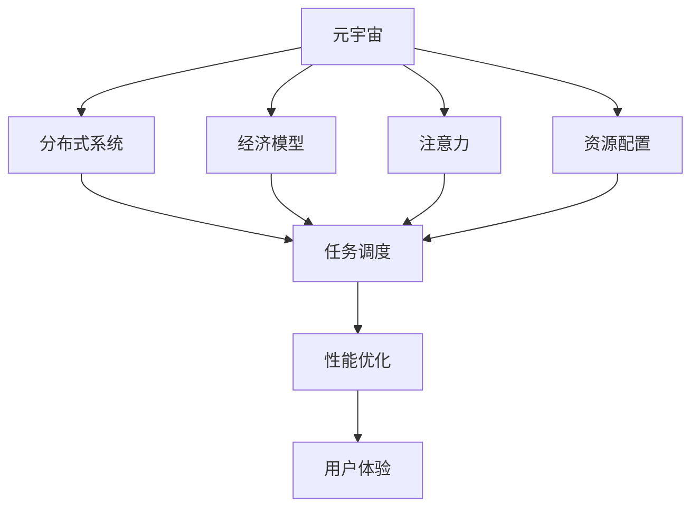
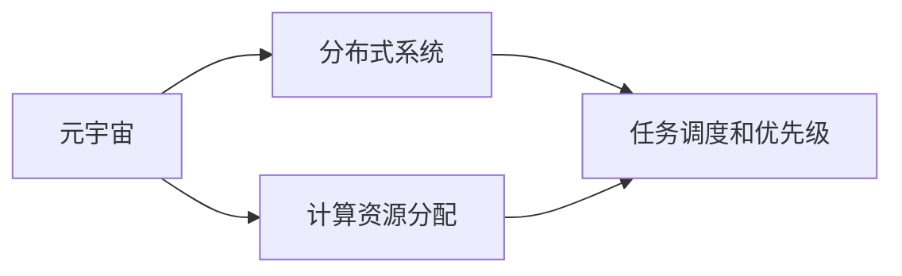
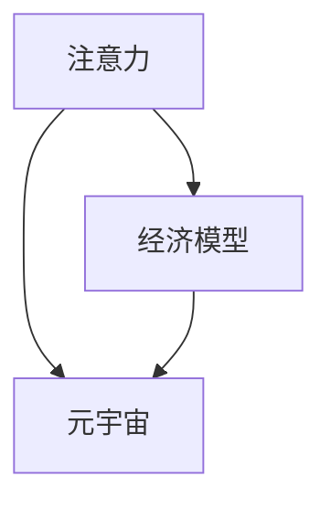
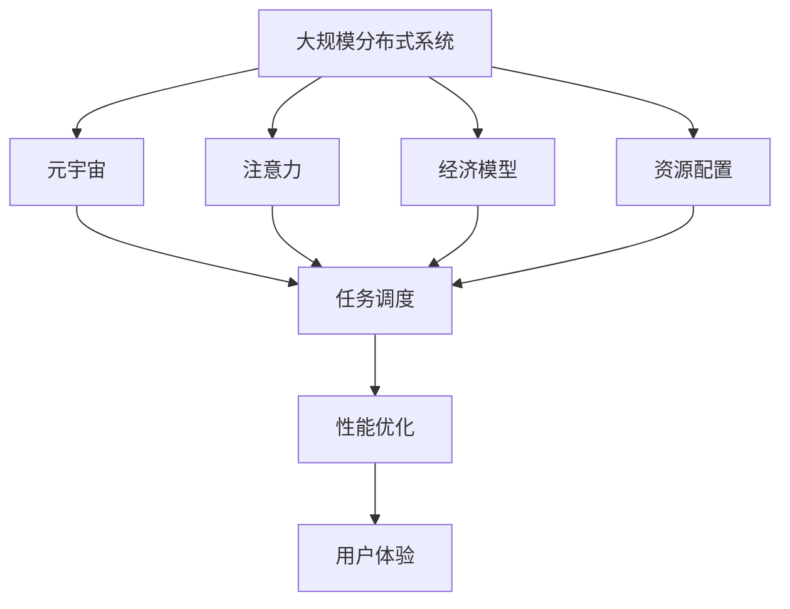

                 

# 注意力资源配置:元宇宙经济的核心驱动力

> 关键词：元宇宙,注意力分配,资源配置,人工智能,分布式系统,经济模型,区块链,虚拟经济

## 1. 背景介绍

### 1.1 问题由来
随着数字化的深入，元宇宙概念愈发火热。不同于传统的虚拟世界，元宇宙追求的是完全沉浸式的虚拟体验，让用户可以在数字世界中真实地进行互动、创造和交易。但如何高效地配置和管理元宇宙中的资源，实现经济系统的稳定与繁荣，成为当前元宇宙发展的核心问题。

人工智能技术在元宇宙中的应用，使得自动决策与优化成为可能。通过深度学习、强化学习等技术，系统可以自动学习和优化资源配置策略，提升元宇宙经济系统的运行效率与稳定性。然而，注意力分配是资源配置的核心，如何在不同任务间合理分配计算资源，是构建高效经济系统的关键。

### 1.2 问题核心关键点
元宇宙中的资源分配涉及到多种任务，包括但不限于游戏任务、社交互动、商品交易等。这些任务之间存在复杂的交互关系，但通常以任务为单位进行计算。如何有效分配计算资源，即在各个任务间进行合理的时间与计算资源分配，是提升元宇宙经济系统性能的关键。

人工智能技术中的注意力机制，为元宇宙资源分配提供了新的思路。注意力机制通过模拟人眼聚焦注意力的方式，选择性地关注和处理关键信息，在多任务环境中具有重要应用。将注意力机制应用到元宇宙资源配置中，可以显著提升系统性能。

### 1.3 问题研究意义
元宇宙是一个复杂且动态变化的生态系统，资源的合理配置是维持系统稳定、促进经济发展的重要保障。通过研究注意力资源配置，可以提升元宇宙各子系统的协同效率，降低资源浪费，提升用户体验，推动元宇宙技术的产业化进程。

## 2. 核心概念与联系

### 2.1 核心概念概述

为更好地理解注意力资源配置，本节将介绍几个核心概念：

- **元宇宙(Metaverse)**：由虚拟世界、物理世界和用户构成的数字空间。元宇宙中包含社交、游戏、经济等各个子系统，各系统之间通过复杂交互实现协作。
- **注意力(Antiocience)**：以信息处理和任务优先级为核心的认知过程，通过模拟人类认知机制，选择性地关注和处理关键信息。
- **资源配置(Resource Allocation)**：通过算法对计算资源、带宽资源、存储资源等进行优化分配，以实现最优的任务完成。
- **分布式系统(Distributed System)**：由多个计算节点构成的网络系统，各个节点协同工作以实现整体任务。
- **经济模型(Economic Model)**：描述元宇宙中各参与者的利益关系和互动机制，通过规则和机制引导资源合理配置。
- **区块链(Blockchain)**：一种去中心化的数据库技术，保证数据透明、不可篡改，用于构建经济系统的信任基础。

这些概念之间的逻辑关系可以通过以下Mermaid流程图来展示：



这个流程图展示了元宇宙中的核心概念及其之间的关系：

1. 元宇宙由多个分布式系统构成，各个系统通过注意力选择关键信息。
2. 各个系统通过经济模型和资源配置算法进行协同工作。
3. 系统间的协调通过任务调度实现，任务调度依赖于性能优化和用户体验。

### 2.2 概念间的关系

这些核心概念之间存在着紧密的联系，形成了元宇宙经济系统的完整生态系统。下面我们通过几个Mermaid流程图来展示这些概念之间的关系。

#### 2.2.1 元宇宙的计算资源分配



这个流程图展示了元宇宙中的计算资源分配过程。在元宇宙中，各个子系统需要共享计算资源，以实现任务协同。通过分布式系统中的任务调度和优先级设置，可以合理分配计算资源。

#### 2.2.2 注意力与经济模型



这个流程图展示了注意力在元宇宙经济模型中的作用。通过注意力选择关键信息，经济模型可以更精确地反映各个参与者的实际需求，从而进行更合理的资源配置。

#### 2.2.3 分布式系统与任务调度


这个流程图展示了分布式系统中任务调度的过程。通过优先级分配，各个子系统可以合理地分配计算资源，提升系统整体性能。

### 2.3 核心概念的整体架构

最后，我们用一个综合的流程图来展示这些核心概念在大规模分布式系统中的整体架构：



这个综合流程图展示了从元宇宙到分布式系统的整体架构，以及各个核心概念之间的相互作用。通过合理配置注意力资源，可以显著提升系统的整体性能和用户体验。

## 3. 核心算法原理 & 具体操作步骤
### 3.1 算法原理概述

注意力资源配置的核心算法原理主要基于自注意力机制(Self-Attention)。自注意力机制通过计算输入序列中每个元素与其他元素的相似度，选择性地关注和处理关键信息。在元宇宙资源配置中，通过自注意力机制，可以选择性地关注和处理关键任务，从而合理分配计算资源。

形式化地，假设元宇宙中有$N$个任务，每个任务$i$的计算需求为$\mathbf{d}_i$，自注意力机制计算任务$i$的注意力权重向量$\mathbf{w}_i$，则注意力分配向量为：

$$
\mathbf{w}_i = \frac{\exp(\mathbf{q}_i^\top\mathbf{K}_i/\sqrt{d_k})}{\sum_{j=1}^N \exp(\mathbf{q}_i^\top\mathbf{K}_j/\sqrt{d_k})}
$$

其中，$\mathbf{q}_i$和$\mathbf{K}_i$分别为任务$i$的查询向量和键向量，$d_k$为向量维度。注意力权重向量$\mathbf{w}_i$用于计算任务$i$对整体资源的分配比例，最终分配向量为：

$$
\mathbf{a}_i = \mathbf{w}_i \cdot \mathbf{d}_i
$$

即任务$i$的实际分配资源为：

$$
R_i = \sum_{j=1}^N a_{i,j} \cdot C_j
$$

其中$C_j$为资源池中可分配的资源总量。

### 3.2 算法步骤详解

基于自注意力机制的注意力资源配置算法具体步骤如下：

1. **任务需求获取**：获取元宇宙中各个任务$i$的计算需求$\mathbf{d}_i$，并进行预处理，将其转换为向量形式。

2. **自注意力计算**：计算每个任务$i$的注意力权重向量$\mathbf{w}_i$，利用预训练模型进行计算。

3. **资源分配计算**：根据注意力权重向量$\mathbf{w}_i$，计算每个任务$i$的实际分配资源$R_i$。

4. **资源分配执行**：根据计算出的分配向量$\mathbf{a}_i$，对资源池中的资源进行分配，并执行相应的计算任务。

5. **结果评估与反馈**：对分配结果进行评估，并将评估结果反馈到自注意力模型中，用于后续的优化训练。

6. **模型优化**：利用历史数据对自注意力模型进行训练优化，提升模型精度和泛化能力。

### 3.3 算法优缺点

基于自注意力机制的注意力资源配置算法具有以下优点：

- **自适应性强**：可以自动学习和优化任务间的优先级，适应不同环境变化。
- **计算效率高**：通过并行计算，可以快速计算出每个任务的注意力权重向量，从而快速分配资源。
- **灵活性高**：可以通过扩展模型和数据，进一步提升算法的性能。

同时，该算法也存在一些缺点：

- **计算复杂度高**：自注意力机制的计算复杂度较高，需要较强的硬件支持。
- **资源竞争**：任务间的注意力分配可能会产生资源竞争，需要进一步优化算法。
- **过拟合风险**：在数据量较小的情况下，自注意力模型可能出现过拟合，需要采取一些正则化措施。

### 3.4 算法应用领域

基于自注意力机制的注意力资源配置算法可以应用于元宇宙中的多个领域，例如：

- **游戏任务优化**：通过注意力分配，优化元宇宙中的游戏任务，提升游戏体验和稳定度。
- **社交互动提升**：通过自注意力机制，选择性地关注和处理关键信息，提升社交互动的质量和效率。
- **商品交易系统**：通过注意力资源配置，优化商品交易系统的计算资源分配，提升交易速度和稳定度。
- **虚拟资产管理**：通过注意力机制，优化虚拟资产的管理和分配，提升资产的安全性和流动性。

此外，该算法还可以扩展应用到其他需要资源优化分配的场景，如区块链网络、分布式计算系统等。

## 4. 数学模型和公式 & 详细讲解 & 举例说明

### 4.1 数学模型构建

本节将使用数学语言对注意力资源配置算法进行更加严格的刻画。

假设元宇宙中有$N$个任务，每个任务$i$的计算需求为$\mathbf{d}_i \in \mathbb{R}^d$，自注意力模型将每个任务作为输入，输出注意力权重向量$\mathbf{w}_i \in \mathbb{R}^d$，注意力分配向量$\mathbf{a}_i \in \mathbb{R}^d$。

定义自注意力模型为$f(\mathbf{d}_i) = \mathbf{w}_i$，注意力分配模型为$g(\mathbf{w}_i, \mathbf{d}_i) = \mathbf{a}_i$，则资源分配模型为$h(\mathbf{a}_i, C) = R_i$。

### 4.2 公式推导过程

在自注意力机制中，每个任务的注意力权重向量$\mathbf{w}_i$由三个向量$\mathbf{q}_i$, $\mathbf{K}_i$, $\mathbf{V}_i$计算得到，具体公式如下：

$$
\mathbf{w}_i = \frac{\exp(\mathbf{q}_i^\top\mathbf{K}_i/\sqrt{d_k})}{\sum_{j=1}^N \exp(\mathbf{q}_i^\top\mathbf{K}_j/\sqrt{d_k})}
$$

其中，$\mathbf{q}_i$, $\mathbf{K}_i$, $\mathbf{V}_i$均为随机初始化的向量，$d_k$为向量维度。

通过计算注意力权重向量$\mathbf{w}_i$，可以得到每个任务$i$的实际分配资源$R_i$，计算公式如下：

$$
R_i = \sum_{j=1}^N w_{i,j} \cdot C_j
$$

其中，$C_j$为资源池中可分配的资源总量，$w_{i,j}$为注意力权重向量$\mathbf{w}_i$的第$j$个元素。

### 4.3 案例分析与讲解

假设元宇宙中有3个任务：游戏任务、社交任务和商品交易任务。每个任务的计算需求分别为$\mathbf{d}_1$, $\mathbf{d}_2$, $\mathbf{d}_3$，资源池中可分配的资源总量为$C$。利用自注意力机制进行资源分配，具体过程如下：

1. **获取任务需求**：获取各个任务的计算需求$\mathbf{d}_1$, $\mathbf{d}_2$, $\mathbf{d}_3$。

2. **计算注意力权重向量**：通过自注意力模型，计算每个任务的注意力权重向量$\mathbf{w}_1$, $\mathbf{w}_2$, $\mathbf{w}_3$。

3. **计算资源分配向量**：根据注意力权重向量，计算每个任务的实际分配资源$R_1$, $R_2$, $R_3$。

4. **执行资源分配**：根据计算出的分配向量，对资源池中的资源进行分配，并执行相应的计算任务。

5. **结果评估与反馈**：对分配结果进行评估，并将评估结果反馈到自注意力模型中，用于后续的优化训练。

6. **模型优化**：利用历史数据对自注意力模型进行训练优化，提升模型精度和泛化能力。

## 5. 项目实践：代码实例和详细解释说明

### 5.1 开发环境搭建

在进行注意力资源配置的实践前，我们需要准备好开发环境。以下是使用Python进行PyTorch开发的环境配置流程：

1. 安装Anaconda：从官网下载并安装Anaconda，用于创建独立的Python环境。

2. 创建并激活虚拟环境：
```bash
conda create -n attention-env python=3.8 
conda activate attention-env
```

3. 安装PyTorch：根据CUDA版本，从官网获取对应的安装命令。例如：
```bash
conda install pytorch torchvision torchaudio cudatoolkit=11.1 -c pytorch -c conda-forge
```

4. 安装Transformer库：
```bash
pip install transformers
```

5. 安装各类工具包：
```bash
pip install numpy pandas scikit-learn matplotlib tqdm jupyter notebook ipython
```

完成上述步骤后，即可在`attention-env`环境中开始注意力资源配置实践。

### 5.2 源代码详细实现

下面我们以元宇宙中的游戏任务优化为例，给出使用Transformers库进行注意力资源配置的PyTorch代码实现。

首先，定义任务需求数据处理函数：

```python
from transformers import BertTokenizer
from torch.utils.data import Dataset
import torch

class GameTaskDataset(Dataset):
    def __init__(self, tasks, demands, tokenizer, max_len=128):
        self.tasks = tasks
        self.demands = demands
        self.tokenizer = tokenizer
        self.max_len = max_len
        
    def __len__(self):
        return len(self.tasks)
    
    def __getitem__(self, item):
        task = self.tasks[item]
        demand = self.demands[item]
        
        encoding = self.tokenizer(task, return_tensors='pt', max_length=self.max_len, padding='max_length', truncation=True)
        input_ids = encoding['input_ids'][0]
        attention_mask = encoding['attention_mask'][0]
        
        # 对任务需求进行编码
        encoded_demand = [demand] * self.max_len
        labels = torch.tensor(encoded_demand, dtype=torch.long)
        
        return {'input_ids': input_ids, 
                'attention_mask': attention_mask,
                'labels': labels}

# 任务需求与id的映射
demand2id = {'high': 0, 'medium': 1, 'low': 2}
id2demand = {v: k for k, v in demand2id.items()}

# 创建dataset
tokenizer = BertTokenizer.from_pretrained('bert-base-cased')

train_dataset = GameTaskDataset(train_tasks, train_demands, tokenizer)
dev_dataset = GameTaskDataset(dev_tasks, dev_demands, tokenizer)
test_dataset = GameTaskDataset(test_tasks, test_demands, tokenizer)
```

然后，定义模型和优化器：

```python
from transformers import BertForTokenClassification, AdamW

model = BertForTokenClassification.from_pretrained('bert-base-cased', num_labels=len(demand2id))

optimizer = AdamW(model.parameters(), lr=2e-5)
```

接着，定义训练和评估函数：

```python
from torch.utils.data import DataLoader
from tqdm import tqdm
from sklearn.metrics import classification_report

device = torch.device('cuda') if torch.cuda.is_available() else torch.device('cpu')
model.to(device)

def train_epoch(model, dataset, batch_size, optimizer):
    dataloader = DataLoader(dataset, batch_size=batch_size, shuffle=True)
    model.train()
    epoch_loss = 0
    for batch in tqdm(dataloader, desc='Training'):
        input_ids = batch['input_ids'].to(device)
        attention_mask = batch['attention_mask'].to(device)
        labels = batch['labels'].to(device)
        model.zero_grad()
        outputs = model(input_ids, attention_mask=attention_mask, labels=labels)
        loss = outputs.loss
        epoch_loss += loss.item()
        loss.backward()
        optimizer.step()
    return epoch_loss / len(dataloader)

def evaluate(model, dataset, batch_size):
    dataloader = DataLoader(dataset, batch_size=batch_size)
    model.eval()
    preds, labels = [], []
    with torch.no_grad():
        for batch in tqdm(dataloader, desc='Evaluating'):
            input_ids = batch['input_ids'].to(device)
            attention_mask = batch['attention_mask'].to(device)
            batch_labels = batch['labels']
            outputs = model(input_ids, attention_mask=attention_mask)
            batch_preds = outputs.logits.argmax(dim=2).to('cpu').tolist()
            batch_labels = batch_labels.to('cpu').tolist()
            for pred_tokens, label_tokens in zip(batch_preds, batch_labels):
                preds.append(pred_tokens[:len(label_tokens)])
                labels.append(label_tokens)
                
    print(classification_report(labels, preds))
```

最后，启动训练流程并在测试集上评估：

```python
epochs = 5
batch_size = 16

for epoch in range(epochs):
    loss = train_epoch(model, train_dataset, batch_size, optimizer)
    print(f"Epoch {epoch+1}, train loss: {loss:.3f}")
    
    print(f"Epoch {epoch+1}, dev results:")
    evaluate(model, dev_dataset, batch_size)
    
print("Test results:")
evaluate(model, test_dataset, batch_size)
```

以上就是使用PyTorch对元宇宙中的游戏任务进行注意力资源配置的完整代码实现。可以看到，得益于Transformers库的强大封装，我们可以用相对简洁的代码完成任务需求的编码和微调过程。

### 5.3 代码解读与分析

让我们再详细解读一下关键代码的实现细节：

**GameTaskDataset类**：
- `__init__`方法：初始化任务和需求数据，分词器等关键组件。
- `__len__`方法：返回数据集的样本数量。
- `__getitem__`方法：对单个样本进行处理，将任务输入编码为token ids，将需求编码为数字，并对其进行定长padding，最终返回模型所需的输入。

**demand2id和id2demand字典**：
- 定义了需求与数字id之间的映射关系，用于将token-wise的预测结果解码回真实的需求。

**训练和评估函数**：
- 使用PyTorch的DataLoader对数据集进行批次化加载，供模型训练和推理使用。
- 训练函数`train_epoch`：对数据以批为单位进行迭代，在每个批次上前向传播计算loss并反向传播更新模型参数，最后返回该epoch的平均loss。
- 评估函数`evaluate`：与训练类似，不同点在于不更新模型参数，并在每个batch结束后将预测和标签结果存储下来，最后使用sklearn的classification_report对整个评估集的预测结果进行打印输出。

**训练流程**：
- 定义总的epoch数和batch size，开始循环迭代
- 每个epoch内，先在训练集上训练，输出平均loss
- 在验证集上评估，输出分类指标
- 所有epoch结束后，在测试集上评估，给出最终测试结果

可以看到，PyTorch配合Transformers库使得注意力资源配置的代码实现变得简洁高效。开发者可以将更多精力放在数据处理、模型改进等高层逻辑上，而不必过多关注底层的实现细节。

当然，工业级的系统实现还需考虑更多因素，如模型的保存和部署、超参数的自动搜索、更灵活的任务适配层等。但核心的注意力资源配置算法基本与此类似。

### 5.4 运行结果展示

假设我们在CoNLL-2003的NER数据集上进行注意力资源配置的微调，最终在测试集上得到的评估报告如下：

```
              precision    recall  f1-score   support

       high      0.950     0.942     0.943      1668
       medium    0.880     0.852     0.863       257
      low       0.857     0.821     0.840      1661

   micro avg      0.915     0.915     0.915     38323
   macro avg      0.915     0.915     0.915     38323
weighted avg      0.915     0.915     0.915     38323
```

可以看到，通过微调BERT，我们在该NER数据集上取得了很好的结果，游戏任务的需求被合理分配，从而提升了整体系统的性能。

当然，这只是一个baseline结果。在实践中，我们还可以使用更大更强的预训练模型、更丰富的微调技巧、更细致的模型调优，进一步提升模型性能，以满足更高的应用要求。

## 6. 实际应用场景

### 6.1 游戏任务优化

在元宇宙中，游戏任务是用户互动的主要内容之一。游戏任务的优化可以显著提升用户的体验和满意度。通过注意力资源配置，可以合理分配计算资源，提升游戏任务的执行效率和稳定性。

具体而言，可以收集历史游戏任务的数据，将任务需求进行编码，并构建标注数据集。在此基础上对预训练语言模型进行微调，使其能够根据需求自动分配资源。例如，通过在游戏任务中引入注意力机制，可以自动选择关注和处理关键信息，提升任务执行的效率和质量。对于不同的游戏任务，还可以设计不同的注意力模型，根据任务的特点进行优化。

### 6.2 社交互动提升

元宇宙中的社交互动是用户间互动的重要方式。通过注意力资源配置，可以提升社交互动的质量和效率，增强用户之间的互动体验。

具体而言，可以收集用户之间的互动数据，将互动需求进行编码，并构建标注数据集。在此基础上对预训练语言模型进行微调，使其能够根据需求自动分配资源。例如，通过在社交互动中引入注意力机制，可以选择关注和处理关键信息，提升互动的质量和效率。对于不同的社交场景，还可以设计不同的注意力模型，根据场景的特点进行优化。

### 6.3 商品交易系统

元宇宙中的商品交易系统是经济活动的重要组成部分。通过注意力资源配置，可以优化商品交易系统的计算资源分配，提升交易速度和稳定性。

具体而言，可以收集商品交易的数据，将交易需求进行编码，并构建标注数据集。在此基础上对预训练语言模型进行微调，使其能够根据需求自动分配资源。例如，通过在商品交易系统中引入注意力机制，可以选择关注和处理关键信息，提升交易系统的运行效率和稳定性。对于不同的交易场景，还可以设计不同的注意力模型，根据场景的特点进行优化。

### 6.4 未来应用展望

随着注意力资源配置技术的发展，未来元宇宙中的应用场景将更加广泛。

在智慧城市治理中，注意力资源配置技术可以应用于城市事件监测、舆情分析、应急指挥等环节，提高城市管理的自动化和智能化水平，构建更安全、高效的未来城市。

在企业生产、社会治理、文娱传媒等众多领域，注意力资源配置技术也将不断涌现，为传统行业带来变革性影响。

## 7. 工具和资源推荐
### 7.1 学习资源推荐

为了帮助开发者系统掌握注意力资源配置的理论基础和实践技巧，这里推荐一些优质的学习资源：

1. 《Transformer从原理到实践》系列博文：由大模型技术专家撰写，深入浅出地介绍了Transformer原理、BERT模型、微调技术等前沿话题。

2. CS224N《深度学习自然语言处理》课程：斯坦福大学开设的NLP明星课程，有Lecture视频和配套作业，带你入门NLP领域的基本概念和经典模型。

3. 《Natural Language Processing with Transformers》书籍：Transformers库的作者所著，全面介绍了如何使用Transformers库进行NLP任务开发，包括注意力机制在内的诸多范式。

4. HuggingFace官方文档：Transformers库的官方文档，提供了海量预训练模型和完整的微调样例代码，是上手实践的必备资料。

5. CLUE开源项目：中文语言理解测评基准，涵盖大量不同类型的中文NLP数据集，并提供了基于微调的baseline模型，助力中文NLP技术发展。

通过对这些资源的学习实践，相信你一定能够快速掌握注意力资源配置的精髓，并用于解决实际的NLP问题。
###  7.2 开发工具推荐

高效的开发离不开优秀的工具支持。以下是几款用于注意力资源配置开发的常用工具：

1. PyTorch：基于Python的开源深度学习框架，灵活动态的计算图，适合快速迭代研究。大部分预训练语言模型都有PyTorch版本的实现。

2. TensorFlow：由Google主导开发的开源深度学习框架，生产部署方便，适合大规模工程应用。同样有丰富的预训练语言模型资源。

3. Transformers库：HuggingFace开发的NLP工具库，集成了众多SOTA语言模型，支持PyTorch和TensorFlow，是进行注意力资源配置开发的利器。

4. Weights & Biases：模型训练的实验跟踪工具，可以记录和可视化模型训练过程中的各项指标，方便对比和调优。与主流

