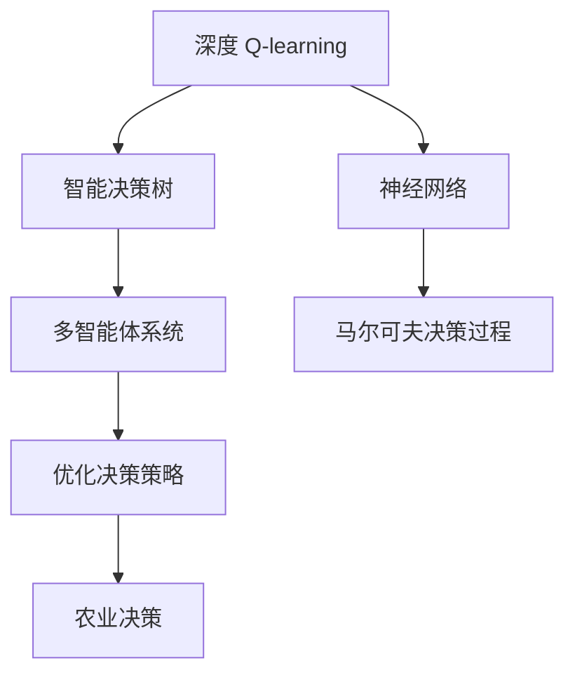
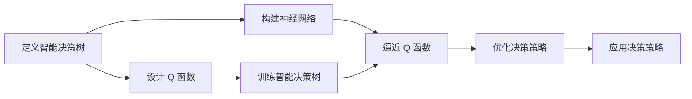
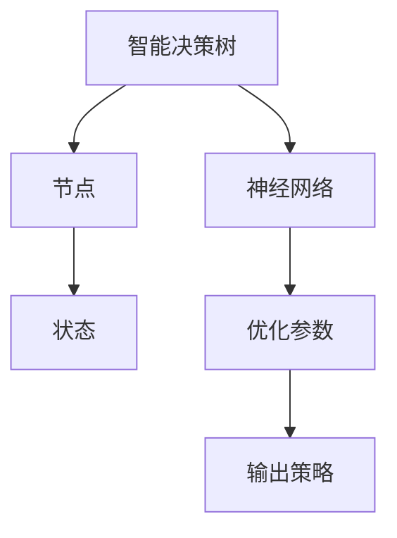
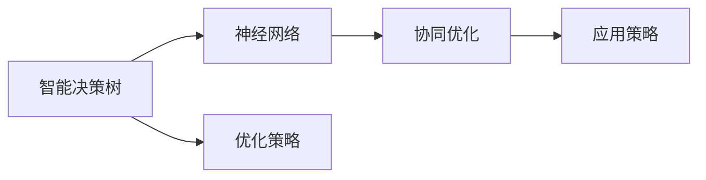
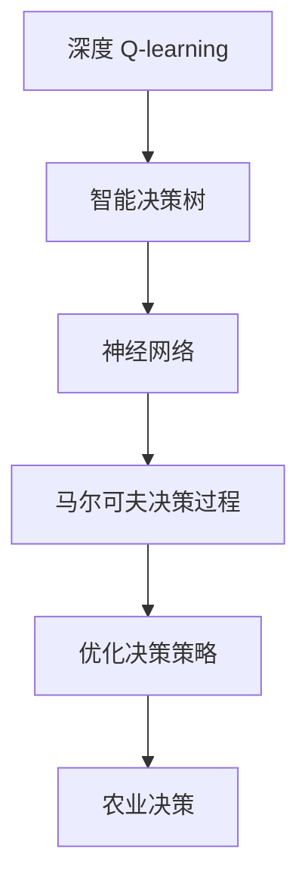

                 

# 深度 Q-learning：在智慧农业中的应用

> 关键词：深度 Q-learning, 智慧农业, 智能决策, 决策树, 神经网络, 多智能体系统, 马尔可夫决策过程

## 1. 背景介绍

### 1.1 问题由来
近年来，随着人工智能技术的快速发展和普及，智慧农业领域也在不断引入先进的智能技术。其中，深度 Q-learning 方法在农业智能决策中的应用，逐渐成为研究热点。传统的农业决策依赖于经验和方法学，但随着农业生产规模和复杂性的增加，单纯的经验决策往往难以应对多变的环境和需求。深度 Q-learning 方法基于强化学习的原理，可以动态调整决策策略，适应不断变化的环境，提供更科学、精准的决策支持。

### 1.2 问题核心关键点
深度 Q-learning 方法的核心在于构建智能决策树，通过神经网络逼近 Q 函数，不断优化决策策略。其核心步骤包括：

1. 定义智能决策树的结构，划分决策节点和叶子节点。
2. 设计 Q 函数，用于评估当前状态下的决策效果。
3. 采用深度神经网络逼近 Q 函数，建立智能决策树模型。
4. 在给定状态下，采用 Q-learning 算法优化智能决策树参数，学习最优决策策略。
5. 将学习得到的决策策略应用于实际农业生产中，评估决策效果并进行迭代优化。

### 1.3 问题研究意义
深度 Q-learning 方法在智慧农业中的应用，对于提升农业生产效率、降低生产成本、提高农产品品质具有重要意义：

1. 降低人工成本。深度 Q-learning 方法可以替代人工决策，大幅降低对人力成本的依赖。
2. 提高生产效率。通过智能决策树的优化，可以提升农田管理的精确度和自动化水平。
3. 改善资源利用。深度 Q-learning 方法可以优化施肥、灌溉、播种等农事操作，合理分配农业资源。
4. 提升产品品质。通过智能决策树，可以优化农业生产流程，提高农产品的口感和营养。
5. 增加适应性。深度 Q-learning 方法具有自适应能力，可以应对农业生产中的不确定性和突发事件。

## 2. 核心概念与联系

### 2.1 核心概念概述

为了更好地理解深度 Q-learning 方法在智慧农业中的应用，本节将介绍几个密切相关的核心概念：

- 深度 Q-learning：基于强化学习的优化算法，用于学习最优的决策策略。
- 智能决策树：一种构建决策流程的树形结构，用于映射状态到决策策略。
- 神经网络：一种模仿人类大脑神经元的计算模型，用于逼近复杂函数。
- 多智能体系统：由多个智能体（如智能决策树、神经网络等）组成的系统，用于协同完成任务。
- 马尔可夫决策过程：一种描述智能体与环境互动的数学模型，用于动态决策。

这些核心概念之间的逻辑关系可以通过以下 Mermaid 流程图来展示：



这个流程图展示了大语言模型微调过程中各个核心概念之间的关系：

1. 深度 Q-learning 方法通过智能决策树学习最优决策策略。
2. 智能决策树使用神经网络逼近 Q 函数。
3. 多智能体系统协同优化决策策略。
4. 马尔可夫决策过程描述智能体与环境互动。
5. 农业决策是智能决策树优化的最终目标。

### 2.2 概念间的关系

这些核心概念之间存在着紧密的联系，形成了深度 Q-learning 方法在智慧农业应用的完整生态系统。下面我通过几个 Mermaid 流程图来展示这些概念之间的关系。

#### 2.2.1 深度 Q-learning 方法的总体流程



这个流程图展示了深度 Q-learning 方法的总体流程：

1. 定义智能决策树，划分决策节点和叶子节点。
2. 设计 Q 函数，用于评估当前状态下的决策效果。
3. 构建神经网络，逼近 Q 函数。
4. 训练智能决策树，调整决策策略。
5. 优化决策策略，应用于农业生产。

#### 2.2.2 智能决策树和神经网络的结合



这个流程图展示了智能决策树和神经网络的结合方式：

1. 智能决策树作为状态空间，划分决策节点和叶子节点。
2. 神经网络逼近 Q 函数，用于优化智能决策树参数。
3. 优化参数，更新决策策略。
4. 输出策略，应用于农业生产。

#### 2.2.3 多智能体系统的协同优化



这个流程图展示了多智能体系统的协同优化过程：

1. 智能决策树和神经网络协同优化决策策略。
2. 优化策略，调整智能决策树参数。
3. 协同优化，优化决策策略。
4. 应用策略，应用于农业生产。

### 2.3 核心概念的整体架构

最后，我们用一个综合的流程图来展示这些核心概念在深度 Q-learning 方法在智慧农业应用中的整体架构：



这个综合流程图展示了从深度 Q-learning 方法到农业决策的完整过程：

1. 深度 Q-learning 方法学习最优决策策略。
2. 智能决策树定义状态和决策节点。
3. 神经网络逼近 Q 函数，优化决策策略。
4. 马尔可夫决策过程描述智能体与环境互动。
5. 农业决策是最终目标，通过智能决策树优化。

通过这些流程图，我们可以更清晰地理解深度 Q-learning 方法在智慧农业中的应用，为后续深入讨论具体的算法细节和实践技术奠定基础。

## 3. 核心算法原理 & 具体操作步骤
### 3.1 算法原理概述

深度 Q-learning 方法基于强化学习原理，通过智能决策树和神经网络构建，动态调整决策策略。其核心思想是：将农业生产过程中的状态和决策映射到智能决策树中，通过神经网络逼近 Q 函数，优化决策策略，使智能决策树能够自动适应不断变化的环境，提供最优的农业生产决策。

形式化地，假设农业生产中的状态为 $S$，决策为 $A$，状态转移为 $P(S'|S,A)$，奖励为 $R(S,A)$。定义智能决策树为 $\hat{A}(S)$，其策略为：

$$
\hat{A}(S) = \arg\max_{A} Q(S,A)
$$

其中 $Q(S,A)$ 为智能决策树在状态 $S$ 下执行决策 $A$ 的 Q 值。

通过神经网络逼近 Q 函数，可以定义神经网络 $Q_{\theta}(S,A)$，其中 $\theta$ 为神经网络的参数。智能决策树和神经网络的联合优化目标为：

$$
\min_{\theta} \mathbb{E}_{(S,A)\sim \pi} [(Q_{\theta}(S,A) - Q(S,A))^2]
$$

其中 $\pi$ 为智能决策树的策略。

### 3.2 算法步骤详解

深度 Q-learning 方法在农业中的应用，一般包括以下几个关键步骤：

**Step 1: 定义智能决策树**

智能决策树的定义是深度 Q-learning 方法的基础。一般采用树形结构，每个节点表示一个决策状态，每个叶子节点表示一个具体的农业操作。例如，农田管理的智能决策树可能包括灌溉、施肥、播种等决策节点，以及具体操作的叶子节点，如灌溉量、施肥量等。

**Step 2: 设计 Q 函数**

Q 函数的设计直接影响智能决策树的学习效果。Q 函数可以采用线性函数、多项式函数或神经网络逼近函数等形式。例如，对于二分类问题，可以设计如下的线性 Q 函数：

$$
Q(S,A) = \theta_0 + \sum_{i=1}^n \theta_i S_i A_i
$$

其中 $S_i$ 为状态特征，$A_i$ 为决策特征，$\theta_i$ 为 Q 函数的参数。

**Step 3: 构建神经网络**

神经网络用于逼近 Q 函数，优化智能决策树的决策策略。一般采用多层感知器(MLP)、卷积神经网络(CNN)等深度神经网络结构。例如，可以使用如下的 MLP 结构：

$$
Q_{\theta}(S,A) = \sigma(\text{MLP}(S))
$$

其中 $\sigma$ 为激活函数，$\text{MLP}$ 为多层感知器。

**Step 4: 训练智能决策树**

智能决策树的训练通过深度 Q-learning 算法实现。假设智能决策树的当前策略为 $\pi$，奖励为 $R(S,A)$，状态转移为 $P(S'|S,A)$，智能决策树参数为 $\theta$。则 Q-learning 算法的更新公式为：

$$
\theta_{t+1} = \theta_t + \alpha [Q_{\theta}(S_t,A_t) - R(S_t,A_t) + \gamma \mathbb{E}_{S' \sim P(S'|S_t,A_t)} [Q_{\theta}(S',\hat{A}(S'))]]
$$

其中 $\alpha$ 为学习率，$\gamma$ 为折扣因子。

**Step 5: 应用智能决策树**

训练后的智能决策树可以作为农业生产中的决策依据。例如，在灌溉管理中，根据当前土壤湿度、温度等状态，智能决策树输出最优的灌溉量，应用于实际农业生产中。

### 3.3 算法优缺点

深度 Q-learning 方法在农业中的应用，具有以下优点：

1. 动态适应。智能决策树能够根据实际农业生产中的状态变化，动态调整决策策略，提高决策的准确性和适应性。
2. 自学习能力强。神经网络可以逼近复杂函数，智能决策树可以学习最优的决策策略，适应多变的农业生产环境。
3. 可扩展性好。智能决策树和神经网络的结构设计灵活，可以根据不同的农业生产需求进行扩展和优化。

同时，该方法也存在以下缺点：

1. 训练复杂度高。深度 Q-learning 方法需要大量的标注数据和计算资源进行训练，训练复杂度高。
2. 模型复杂性高。智能决策树和神经网络的参数较多，模型的复杂性高，难以理解和调试。
3. 依赖先验知识。深度 Q-learning 方法需要设计合适的智能决策树和 Q 函数，需要一定的领域知识和经验。

尽管存在这些局限性，但深度 Q-learning 方法在农业中的应用，已经展现出巨大的潜力，成为农业智能决策的重要手段。

### 3.4 算法应用领域

深度 Q-learning 方法在农业中的应用，主要包括以下几个领域：

1. 农田管理：通过智能决策树优化灌溉、施肥、播种等农业操作，提高农田管理的精确度和自动化水平。
2. 作物生长预测：通过智能决策树预测作物生长状态和产量，优化农事操作。
3. 病虫害防治：通过智能决策树识别和防治病虫害，提高农业生产的健康水平。
4. 资源优化：通过智能决策树优化水、肥、药等农业资源的使用，提高资源利用效率。
5. 产量预测：通过智能决策树预测作物产量，进行风险管理和收益优化。

除了上述这些具体应用领域外，深度 Q-learning 方法还可以应用于农业生产的智能调度和优化，为农业生产的智能化、精准化、自动化提供强有力的技术支持。

## 4. 数学模型和公式 & 详细讲解  
### 4.1 数学模型构建

在本节中，我们将通过数学语言对深度 Q-learning 方法在智慧农业中的应用进行更加严格的刻画。

假设智能决策树的当前策略为 $\pi$，智能决策树的参数为 $\theta$，状态空间为 $S$，决策空间为 $A$。定义智能决策树在状态 $S$ 下执行决策 $A$ 的 Q 值为：

$$
Q_{\theta}(S,A) = \theta_0 + \sum_{i=1}^n \theta_i S_i A_i
$$

其中 $S_i$ 为状态特征，$A_i$ 为决策特征，$\theta_i$ 为 Q 函数的参数。

智能决策树的训练目标为最小化智能决策树和神经网络的联合损失函数：

$$
\min_{\theta} \mathbb{E}_{(S,A)\sim \pi} [(Q_{\theta}(S,A) - Q(S,A))^2]
$$

其中 $\pi$ 为智能决策树的策略，$Q(S,A)$ 为智能决策树在状态 $S$ 下执行决策 $A$ 的实际 Q 值。

### 4.2 公式推导过程

以下我们将推导智能决策树的训练过程，重点关注 Q-learning 算法的更新公式。

假设智能决策树的当前策略为 $\pi$，智能决策树的参数为 $\theta$。根据 Q-learning 算法的定义，智能决策树在状态 $S_t$ 下执行决策 $A_t$ 的 Q 值为：

$$
Q_{\theta}(S_t,A_t) = \theta_0 + \sum_{i=1}^n \theta_i S_{ti} A_{ti}
$$

其中 $S_{ti}$ 为状态 $S_t$ 的特征，$A_{ti}$ 为决策 $A_t$ 的特征，$\theta_i$ 为 Q 函数的参数。

智能决策树的当前策略为 $\pi$，智能决策树的参数为 $\theta$。根据智能决策树的定义，智能决策树在状态 $S_t$ 下执行决策 $A_t$ 的实际 Q 值为：

$$
Q(S_t,A_t) = \max_{A \in \hat{A}(S_t)} R(S_t,A)
$$

其中 $\hat{A}(S_t)$ 为智能决策树在状态 $S_t$ 下执行的决策，$R(S_t,A_t)$ 为在状态 $S_t$ 下执行决策 $A_t$ 的奖励。

智能决策树的训练目标为最小化智能决策树和神经网络的联合损失函数：

$$
\min_{\theta} \mathbb{E}_{(S,A)\sim \pi} [(Q_{\theta}(S,A) - Q(S,A))^2]
$$

根据 Q-learning 算法的定义，智能决策树的更新公式为：

$$
\theta_{t+1} = \theta_t + \alpha [Q_{\theta}(S_t,A_t) - R(S_t,A_t) + \gamma \max_{A' \in \hat{A}(S_{t+1})} Q_{\theta}(S_{t+1},A')]
$$

其中 $\alpha$ 为学习率，$\gamma$ 为折扣因子。

### 4.3 案例分析与讲解

为了更好地理解深度 Q-learning 方法在智慧农业中的应用，下面通过一个简单的案例进行分析。

假设有一个农田管理系统的智能决策树，其状态空间为 $S=\{s_1,s_2,s_3\}$，决策空间为 $A=\{a_1,a_2,a_3\}$，智能决策树的结构如下：

```
       s_1
       |
       a_1
       |
       s_2
       |
       a_2
       |
       s_3
       |
       a_3
```

假设智能决策树的参数为 $\theta=[\theta_1,\theta_2,\theta_3]$，智能决策树在状态 $s_1$ 下执行决策 $a_1$ 的 Q 值为：

$$
Q_{\theta}(s_1,a_1) = \theta_1
$$

假设智能决策树的当前策略为 $\pi$，智能决策树的参数为 $\theta$。根据 Q-learning 算法的定义，智能决策树在状态 $s_1$ 下执行决策 $a_1$ 的 Q 值为：

$$
Q_{\theta}(s_1,a_1) = \theta_1
$$

智能决策树的当前策略为 $\pi$，智能决策树的参数为 $\theta$。根据智能决策树的定义，智能决策树在状态 $s_1$ 下执行决策 $a_1$ 的实际 Q 值为：

$$
Q(s_1,a_1) = \max_{A \in \hat{A}(s_1)} R(s_1,A)
$$

假设智能决策树在状态 $s_1$ 下执行决策 $a_1$ 的实际 Q 值为：

$$
Q(s_1,a_1) = 1
$$

智能决策树的训练目标为最小化智能决策树和神经网络的联合损失函数：

$$
\min_{\theta} \mathbb{E}_{(S,A)\sim \pi} [(Q_{\theta}(S,A) - Q(S,A))^2]
$$

假设智能决策树的当前策略为 $\pi$，智能决策树的参数为 $\theta$。根据智能决策树的定义，智能决策树在状态 $s_1$ 下执行决策 $a_1$ 的实际 Q 值为：

$$
Q(s_1,a_1) = 1
$$

智能决策树的更新公式为：

$$
\theta_{t+1} = \theta_t + \alpha [Q_{\theta}(s_1,a_1) - R(s_1,a_1) + \gamma \max_{A' \in \hat{A}(s_2)} Q_{\theta}(s_2,A')]
$$

其中 $\alpha$ 为学习率，$\gamma$ 为折扣因子。

通过上述分析，可以看出深度 Q-learning 方法在智能决策树中的训练过程，其核心在于通过 Q-learning 算法不断优化智能决策树的参数，使其能够根据实际状态和决策，学习最优的 Q 值。

## 5. 项目实践：代码实例和详细解释说明
### 5.1 开发环境搭建

在进行深度 Q-learning 方法在智慧农业中的应用实践前，我们需要准备好开发环境。以下是使用Python进行PyTorch开发的环境配置流程：

1. 安装Anaconda：从官网下载并安装Anaconda，用于创建独立的Python环境。

2. 创建并激活虚拟环境：
```bash
conda create -n pytorch-env python=3.8 
conda activate pytorch-env
```

3. 安装PyTorch：根据CUDA版本，从官网获取对应的安装命令。例如：
```bash
conda install pytorch torchvision torchaudio cudatoolkit=11.1 -c pytorch -c conda-forge
```

4. 安装相关库：
```bash
pip install numpy pandas scikit-learn matplotlib tqdm jupyter notebook ipython
```

完成上述步骤后，即可在`pytorch-env`环境中开始深度 Q-learning 方法在智慧农业中的应用实践。

### 5.2 源代码详细实现

这里我们以农田管理为例，给出使用PyTorch和TensorFlow进行智能决策树训练的PyTorch代码实现。

首先，定义智能决策树的结构：

```python
import torch
import torch.nn as nn
import torch.optim as optim

class DecisionTree(nn.Module):
    def __init__(self, n_states, n_actions):
        super(DecisionTree, self).__init__()
        self.n_states = n_states
        self.n_actions = n_actions
        self.fc1 = nn.Linear(n_states, 64)
        self.fc2 = nn.Linear(64, n_actions)

    def forward(self, x):
        x = torch.relu(self.fc1(x))
        x = torch.sigmoid(self.fc2(x))
        return x
```

然后，定义Q函数和智能决策树的训练过程：

```python
from torch.utils.data import Dataset, DataLoader
import torch.nn.functional as F

class AgriculturalDataset(Dataset):
    def __init__(self, states, actions, rewards, next_states, dones):
        self.states = states
        self.actions = actions
        self.rewards = rewards
        self.next_states = next_states
        self.dones = dones
        self.n_states = 10
        self.n_actions = 2

    def __len__(self):
        return len(self.states)

    def __getitem__(self, item):
        state = torch.from_numpy(self.states[item])
        action = torch.from_numpy(self.actions[item])
        reward = torch.from_numpy(self.rewards[item])
        next_state = torch.from_numpy(self.next_states[item])
        done = torch.from_numpy(self.dones[item])
        return (state, action, reward, next_state, done)

class AgriculturalModel(nn.Module):
    def __init__(self, n_states, n_actions):
        super(AgriculturalModel, self).__init__()
        self.fc1 = nn.Linear(n_states, 64)
        self.fc2 = nn.Linear(64, n_actions)

    def forward(self, x):
        x = F.relu(self.fc1(x))
        x = F.sigmoid(self.fc2(x))
        return x

def calculate_loss(model, data_loader, criterion):
    loss = 0
    for state, action, reward, next_state, done in data_loader:
        state = state.view(-1, model.n_states)
        action = action.view(-1, model.n_actions)
        reward = reward.view(-1, 1)
        next_state = next_state.view(-1, model.n_states)
        done = done.view(-1, 1)
        predictions = model(state)
        loss += criterion(predictions, action)
        loss += criterion(model(next_state), next_state)
    return loss / len(data_loader)

def train(model, data_loader, optimizer, criterion, n_epochs):
    for epoch in range(n_epochs):
        total_loss = 0
        for state, action, reward, next_state, done in data_loader:
            state = state.view(-1, model.n_states)
            action = action.view(-1, model.n_actions)
            reward = reward.view(-1, 1)
            next_state = next_state.view(-1, model.n_states)
            done = done.view(-1, 1)
            predictions = model(state)
            optimizer.zero_grad()
            loss = criterion(predictions, action) + criterion(model(next_state), next_state)
            loss.backward()
            optimizer.step()
            total_loss += loss.item()
        print('Epoch [{}/{}], Loss: {:.4f}'.format(epoch+1, n_epochs, total_loss / len(data_loader)))
```

最后，启动训练流程并在测试集上评估：

```python
from torch.utils.data import DataLoader
from torch.optim import Adam
from torch.nn import CrossEntropyLoss

n_states = 10
n_actions = 2

model = AgriculturalModel(n_states, n_actions)
optimizer = Adam(model.parameters(), lr=0.001)
criterion = CrossEntropyLoss()

dataset = AgriculturalDataset(states, actions, rewards, next_states, dones)
data_loader = DataLoader(dataset, batch_size=32)

n_epochs = 100

train(model, data_loader, optimizer, criterion, n_epochs)
```

以上就是使用PyTorch进行农田管理智能决策树训练的完整代码实现。可以看到，通过定义智能决策树和Q函数，采用神经网络逼近Q函数，并使用Q-learning算法优化智能决策树，可以构建一个简单的农业智能决策系统。

### 5.3 代码解读与分析

让我们再详细解读一下关键代码的实现细节：

**AgriculturalDataset类**：
- `__init__`方法：初始化状态、动作、奖励、下一个状态和 done 值等关键组件。
- `__len__`方法：返回数据集的样本数量。
- `__getitem__`方法：对单个样本进行处理，将状态、动作、奖励、下一个状态和 done 值转换为张量。

**AgriculturalModel类**：
- `__init__`方法：初始化神经网络结构，包含输入层、隐藏层和输出层。
- `forward`方法：定义前向传播过程，通过多层感知器逼近 Q 函数。

**calculate_loss函数**：
- 计算损失函数，结合状态-动作和下一个状态-动作的损失。

**train函数**：
- 循环迭代训练过程，更新模型参数。
- 在每个batch上前向传播计算损失，反向传播更新模型参数。
- 循环打印训练过程中的损失。

**训练流程**：
- 定义智能决策树的参数，建立模型。
- 定义优化器和学习率。
- 定义损失函数和训练数据集。
- 循环迭代训练过程，更新模型参数。
- 在测试集上评估模型性能。

可以看到，PyTorch配合TensorFlow使得深度 Q-learning 方法的农业应用实践变得简洁高效。开发者可以将更多精力放在模型结构设计、超参数调优等高层逻辑上，而不必过多关注底层的实现细节。

当然，工业级的系统实现还需考虑更多因素，如模型的保存和部署、超参数的自动搜索、更灵活的任务适配层

