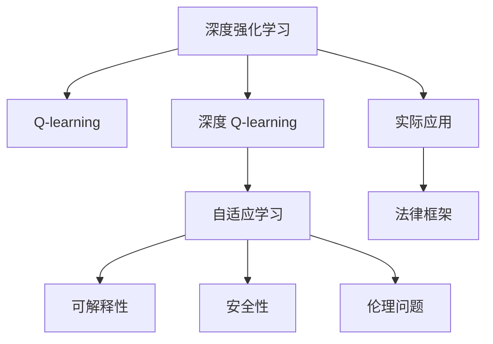
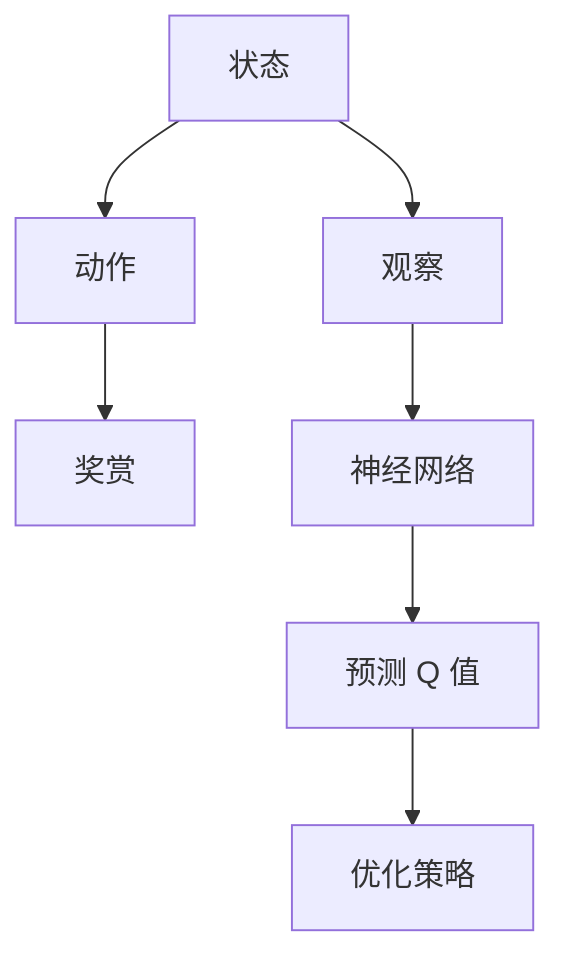
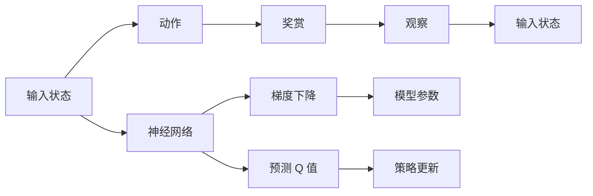
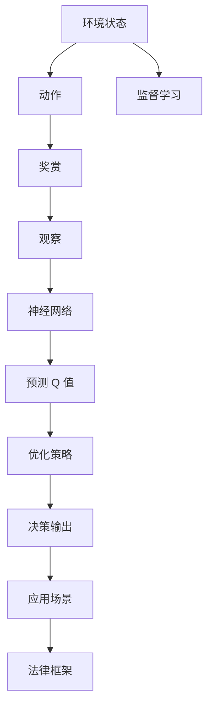
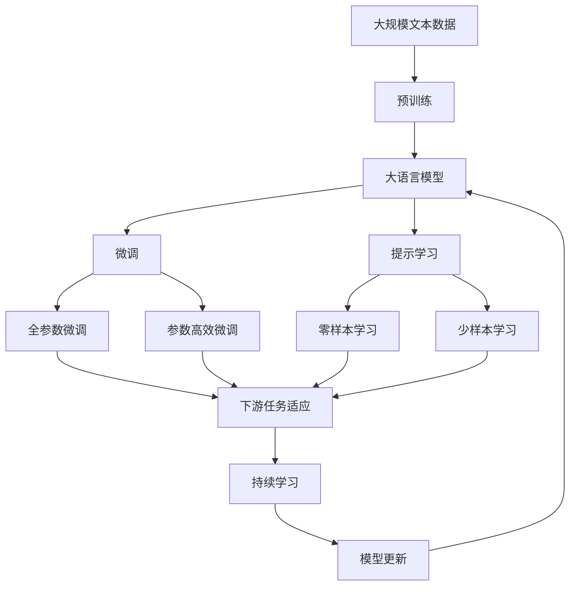

                 

# 深度 Q-learning：未来人工智能法规的挑战

> 关键词：深度 Q-learning, 人工智能法规, 强化学习, 自适应学习, 未来科技, 人工智能伦理

## 1. 背景介绍

### 1.1 问题由来
随着人工智能（AI）技术的快速发展，深度强化学习（Deep Reinforcement Learning, DRL）已成为了实现自主决策和动态适应的重要手段。在自监督学习（如预训练语言模型）和传统机器学习（如分类、回归）之外，强化学习成为了人工智能领域的新范式。其中，深度 Q-learning（DQN）作为强化学习的重要分支，已在围棋、视频游戏、机器人控制等领域取得了显著成果。

但随着DQN等DRL技术的广泛应用，其所带来的伦理、法律和安全问题也逐渐引起社会各界的关注。如何制定符合社会伦理道德、保障技术安全可靠的法律框架，成为了当下AI研究与应用的重要课题。本文将深入探讨深度 Q-learning 及其在未来人工智能法规中的挑战，旨在为构建安全、可控的人工智能系统提供参考和建议。

### 1.2 问题核心关键点
深度 Q-learning 的核心是构建 Q 函数，通过观察当前状态和执行动作，预测在不同策略下未来奖赏的总和。DRL 通过不断试错学习，逐步优化策略，以实现最优控制目标。但其泛化能力、可解释性、安全性等方面仍存在诸多挑战。

具体来说，DRL 面临以下核心问题：
1. 泛化能力：DRL 模型对训练数据集的泛化能力有限，容易过拟合。
2. 可解释性：DRL 模型行为复杂，难以解释决策过程。
3. 安全性：DRL 模型在复杂环境中可能出现灾难性决策。
4. 伦理问题：DRL 模型在应用中可能产生不公正、有害的决策。

这些问题不仅影响 DRL 技术的实际应用，还对未来人工智能法规的制定提出了新的挑战。如何构建有效的法律框架，确保 DRL 技术的安全、可控和公正，是当前研究的重要方向。

### 1.3 问题研究意义
研究深度 Q-learning 及其未来人工智能法规的挑战，对于推动 DRL 技术的应用和普及，具有重要意义：

1. 促进技术健康发展：通过明确技术伦理和法律边界，确保 DRL 技术的健康发展，避免技术滥用和误用。
2. 增强社会接受度：通过制定合理的人工智能法规，提升公众对 DRL 技术的信任和接受度，促进其在更多场景中的应用。
3. 保障技术安全：通过严格的法规和标准，保障 DRL 技术的安全性和可靠性，避免潜在的社会危害。
4. 推动伦理进步：通过引入伦理约束和评估机制，推动 AI 技术伦理的发展，提升技术的社会价值。
5. 促进国际合作：通过国际法律框架的协调，促进各国在人工智能领域的合作与交流，推动全球 AI 技术的发展。

## 2. 核心概念与联系

### 2.1 核心概念概述

为更好地理解深度 Q-learning 及其在人工智能法规中的挑战，本节将介绍几个密切相关的核心概念：

- 深度强化学习（Deep Reinforcement Learning, DRL）：通过构建深度神经网络模型，对强化学习中的状态-动作-奖赏映射进行拟合，实现自主决策和动态适应。
- Q-learning：一种经典的强化学习算法，通过预测不同策略下未来奖赏的总和，优化当前策略。
- 深度 Q-learning（DQN）：结合深度神经网络和 Q-learning 的算法，利用深度神经网络逼近 Q 函数，实现复杂决策问题的求解。
- 自适应学习：DRL 模型在实际应用中，通过不断试错学习，适应环境变化，实现最优决策。
- 可解释性：DRL 模型行为复杂，难以解释决策过程，需要通过设计合理的界面和机制，提升模型的可解释性。
- 安全性：DRL 模型在复杂环境中可能出现灾难性决策，需要通过测试和验证，确保模型的安全性。
- 伦理问题：DRL 模型在应用中可能产生不公正、有害的决策，需要通过引入伦理约束和评估机制，提升技术的社会价值。

这些核心概念之间的逻辑关系可以通过以下 Mermaid 流程图来展示：



这个流程图展示了大语言模型微调过程中各个核心概念的关系和作用：

1. 深度强化学习是 DRL 的核心，通过构建深度神经网络模型，实现自主决策和动态适应。
2. Q-learning 是 DRL 的基础算法，通过预测未来奖赏总和，优化当前策略。
3. 深度 Q-learning 结合深度神经网络和 Q-learning，实现复杂决策问题的求解。
4. 自适应学习是 DRL 模型的学习方式，通过不断试错学习，适应环境变化。
5. 可解释性是 DRL 模型的重要特性，需要通过合理的界面和机制，提升模型的可解释性。
6. 安全性是 DRL 模型的应用要求，需要通过测试和验证，确保模型的安全性。
7. 伦理问题是 DRL 模型在应用中的关键约束，需要通过引入伦理约束和评估机制，提升技术的社会价值。

这些核心概念共同构成了深度 Q-learning 及其在人工智能法规中的挑战的基本框架，为我们进一步探讨其原理和应用提供了重要基础。

### 2.2 概念间的关系

这些核心概念之间存在着紧密的联系，形成了深度 Q-learning 及其在人工智能法规中的挑战的完整生态系统。下面我通过几个 Mermaid 流程图来展示这些概念之间的关系。

#### 2.2.1 深度 Q-learning 的基本架构



这个流程图展示了深度 Q-learning 的基本架构：

1. 状态是 DRL 模型观察的环境状态。
2. 动作是 DRL 模型在当前状态下执行的行为。
3. 奖赏是 DRL 模型在执行动作后的反馈。
4. 观察是 DRL 模型对环境状态的观察。
5. 神经网络是 DRL 模型构建的深度学习模型，用于逼近 Q 函数。
6. Q 值是神经网络预测的当前状态和动作的 Q 值。
7. 优化策略是通过 Q 值和奖赏更新模型参数，优化当前策略。

#### 2.2.2 DQN 的基本流程



这个流程图展示了 DQN 的基本流程：

1. 输入状态是 DRL 模型观察的环境状态。
2. 神经网络是 DRL 模型构建的深度学习模型，用于逼近 Q 函数。
3. Q 值是神经网络预测的当前状态和动作的 Q 值。
4. 动作是 DRL 模型在当前状态下执行的行为。
5. 奖赏是 DRL 模型在执行动作后的反馈。
6. 观察是 DRL 模型对环境状态的观察。
7. 梯度下降是通过 Q 值和奖赏更新模型参数，优化当前策略。
8. 策略更新是根据更新后的模型参数，调整 DRL 模型的策略。

#### 2.2.3 深度 Q-learning 在实际应用中的挑战



这个流程图展示了深度 Q-learning 在实际应用中的挑战：

1. 环境状态是 DRL 模型观察的环境状态。
2. 动作是 DRL 模型在当前状态下执行的行为。
3. 奖赏是 DRL 模型在执行动作后的反馈。
4. 观察是 DRL 模型对环境状态的观察。
5. 神经网络是 DRL 模型构建的深度学习模型，用于逼近 Q 函数。
6. Q 值是神经网络预测的当前状态和动作的 Q 值。
7. 优化策略是通过 Q 值和奖赏更新模型参数，优化当前策略。
8. 决策输出是根据更新后的模型参数，调整 DRL 模型的策略。
9. 监督学习是通过 DRL 模型的训练数据，学习优化策略。
10. 应用场景是 DRL 模型在实际应用中的具体应用场景。
11. 法律框架是通过合理的人工智能法规，确保 DRL 模型的应用安全和可控。

### 2.3 核心概念的整体架构

最后，我们用一个综合的流程图来展示这些核心概念在大语言模型微调过程中的整体架构：



这个综合流程图展示了从预训练到微调，再到持续学习的完整过程。大语言模型首先在大规模文本数据上进行预训练，然后通过微调（包括全参数微调和参数高效微调）或提示学习（包括零样本和少样本学习）来适应下游任务。最后，通过持续学习技术，模型可以不断更新和适应新的任务和数据。 通过这些流程图，我们可以更清晰地理解深度 Q-learning 及其在人工智能法规中的挑战的过程中的各个环节和关键概念的关系和作用。

## 3. 核心算法原理 & 具体操作步骤
### 3.1 算法原理概述

深度 Q-learning 是强化学习中的一个重要分支，其核心思想是通过构建 Q 函数，预测不同策略下未来奖赏的总和，进而优化当前策略，实现最优控制目标。具体而言，深度 Q-learning 通过深度神经网络逼近 Q 函数，通过观察当前状态和执行动作，预测在不同策略下未来奖赏的总和，从而优化决策过程。

在实践中，深度 Q-learning 通常采用以下几个关键步骤：

1. 构建神经网络：选择合适的深度神经网络模型，如卷积神经网络（CNN）、递归神经网络（RNN）等。
2. 预测 Q 值：通过神经网络预测当前状态和动作的 Q 值。
3. 策略优化：根据 Q 值和奖赏更新模型参数，优化当前策略。
4. 训练模型：在实际应用中，通过不断试错学习，适应环境变化，实现最优决策。

### 3.2 算法步骤详解

深度 Q-learning 的具体步骤如下：

1. 构建神经网络：选择合适的深度神经网络模型，如卷积神经网络（CNN）、递归神经网络（RNN）等。
2. 初始化模型参数：对神经网络模型进行初始化，设定随机权重。
3. 输入状态和动作：将当前状态和执行动作输入到神经网络中，计算预测的 Q 值。
4. 预测 Q 值：通过神经网络预测当前状态和动作的 Q 值。
5. 计算损失函数：计算预测 Q 值与实际 Q 值之间的差异，定义损失函数。
6. 反向传播：通过反向传播算法，更新模型参数，最小化损失函数。
7. 优化策略：根据 Q 值和奖赏更新模型参数，优化当前策略。
8. 重复训练：在实际应用中，通过不断试错学习，适应环境变化，实现最优决策。

### 3.3 算法优缺点

深度 Q-learning 具有以下优点：

1. 适应性强：通过不断试错学习，深度 Q-learning 能够适应复杂的环境变化，实现最优决策。
2. 可扩展性高：深度神经网络模型具有较强的可扩展性，适用于各种复杂决策问题。
3. 性能优越：在强化学习任务中，深度 Q-learning 通常能够取得较好的性能。

但深度 Q-learning 也存在一些缺点：

1. 计算成本高：深度神经网络模型的训练需要大量的计算资源，且训练时间长。
2. 数据需求大：深度 Q-learning 需要大量的标注数据进行训练，且数据质量对模型性能影响较大。
3. 过拟合风险：深度 Q-learning 模型容易过拟合，泛化能力有限。

### 3.4 算法应用领域

深度 Q-learning 在多个领域中得到了广泛应用，例如：

1. 机器人控制：通过深度 Q-learning，机器人可以自主学习控制策略，实现复杂的物理操作。
2. 视频游戏：通过深度 Q-learning，AI 可以自主学习游戏策略，实现高水平的游戏智能。
3. 金融交易：通过深度 Q-learning，AI 可以自主学习交易策略，实现智能投资和风险控制。
4. 自然语言处理：通过深度 Q-learning，AI 可以自主学习语言模型，实现自然语言理解和生成。
5. 自动驾驶：通过深度 Q-learning，AI 可以自主学习驾驶策略，实现自动驾驶和路径规划。

## 4. 数学模型和公式 & 详细讲解  
### 4.1 数学模型构建

深度 Q-learning 的基本数学模型如下：

设当前状态为 $s$，动作为 $a$，奖赏为 $r$，神经网络模型为 $\pi(s)$，Q 值为 $Q(s,a)$，损失函数为 $\mathcal{L}$，则深度 Q-learning 的优化目标为：

$$
\min_{\pi} \mathcal{L}(\pi) = \mathbb{E}_{s,a}[\mathcal{L}(s,a)]=\mathbb{E}_{s,a}[r+\gamma Q(s',a)-Q(s,a)]
$$

其中，$\gamma$ 为折扣因子，$Q(s',a)$ 为下一个状态和动作的预测 Q 值。

### 4.2 公式推导过程

为了简化问题，我们假设 DRL 模型已经构建好了神经网络 $\pi(s)$，其输出为 $Q(s,a)$。则深度 Q-learning 的优化目标为：

$$
\min_{\pi} \mathcal{L}(\pi) = \mathbb{E}_{s,a}[r+\gamma Q(s',a)-Q(s,a)]
$$

根据强化学习的定义，Q 值可以表示为：

$$
Q(s,a) = \mathbb{E}[\sum_{t=1}^{T} \gamma^{t-1} r_{t}]
$$

其中 $T$ 为时间步数。因此，深度 Q-learning 的优化目标可以进一步表示为：

$$
\min_{\pi} \mathcal{L}(\pi) = \mathbb{E}_{s,a}[r+\gamma Q(s',a)-Q(s,a)]
$$

通过梯度下降算法，我们可以求解上述优化目标，具体步骤如下：

1. 随机选择一个状态 $s_t$ 和动作 $a_t$，计算 Q 值 $Q(s_t,a_t)$。
2. 计算下一个状态 $s_{t+1}$ 和奖赏 $r_{t+1}$。
3. 计算预测的 Q 值 $Q(s_{t+1},a_{t+1})$。
4. 计算损失函数 $\mathcal{L}(s_t,a_t)$。
5. 通过反向传播算法，更新模型参数 $\pi(s)$。

### 4.3 案例分析与讲解

为了更好地理解深度 Q-learning 的原理和应用，我们可以举一个简单的例子：

假设有一个机器人需要在迷宫中从起点出发，到达终点。迷宫中有墙壁和通道，机器人的动作可以选择向左、向右、向上或向下。假设每个时间步的奖赏为 $-0.01$，机器人的动作与奖赏的关系如下：

- 向左或向右，奖赏为 $-0.01$。
- 向上或向下，奖赏为 $-0.01$。
- 到达终点，奖赏为 $1$。

我们通过深度 Q-learning 来训练机器人，使其能够自主学习迷宫中的路径。具体步骤如下：

1. 构建一个卷积神经网络（CNN）作为深度 Q-learning 的模型，输入为迷宫的状态，输出为机器人的 Q 值。
2. 设定机器人的初始位置和状态，随机选择一个动作。
3. 计算机器人的下一个状态和奖赏。
4. 根据深度 Q-learning 的优化目标，计算损失函数。
5. 通过反向传播算法，更新模型参数。
6. 重复上述步骤，直到机器人在迷宫中找到到达终点的路径。

## 5. 项目实践：代码实例和详细解释说明
### 5.1 开发环境搭建

在进行深度 Q-learning 的实践前，我们需要准备好开发环境。以下是使用Python进行PyTorch开发的环境配置流程：

1. 安装Anaconda：从官网下载并安装Anaconda，用于创建独立的Python环境。

2. 创建并激活虚拟环境：
```bash
conda create -n pytorch-env python=3.8 
conda activate pytorch-env
```

3. 安装PyTorch：根据CUDA版本，从官网获取对应的安装命令。例如：
```bash
conda install pytorch torchvision torchaudio cudatoolkit=11.1 -c pytorch -c conda-forge
```

4. 安装TensorFlow：
```bash
pip install tensorflow
```

5. 安装各类工具包：
```bash
pip install numpy pandas scikit-learn matplotlib tqdm jupyter notebook ipython
```

完成上述步骤后，即可在`pytorch-env`环境中开始深度 Q-learning 的实践。

### 5.2 源代码详细实现

下面以迷宫寻路问题为例，给出使用PyTorch进行深度 Q-learning 的PyTorch代码实现。

首先，定义迷宫状态和动作：

```python
import torch
import numpy as np

class State:
    def __init__(self, x, y):
        self.x = x
        self.y = y

    def __repr__(self):
        return "({}, {})".format(self.x, self.y)

class Action:
    def __init__(self, dx, dy):
        self.dx = dx
        self.dy = dy

    def __repr__(self):
        return "({}, {})".format(self.dx, self.dy)

def move(state, action):
    x, y = state.x, state.y
    x += action.dx
    y += action.dy
    if 0 <= x < maze.shape[0] and 0 <= y < maze.shape[1]:
        return State(x, y)
    return None
```

然后，定义神经网络模型和损失函数：

```python
import torch.nn as nn
import torch.nn.functional as F
import torch.optim as optim

class QNetwork(nn.Module):
    def __init__(self):
        super(QNetwork, self).__init__()
        self.fc1 = nn.Linear(2, 16)
        self.fc2 = nn.Linear(16, 1)

    def forward(self, x):
        x = F.relu(self.fc1(x))
        x = self.fc2(x)
        return x

def loss_fn(Q, Q_target):
    return F.smooth_l1_loss(Q, Q_target)
```

接着，定义深度 Q-learning 的训练函数：

```python
def train(Q, optimizer, maze, episode_num=1000):
    state = State(0, 0)
    for episode in range(episode_num):
        action = None
        while True:
            Q.eval()
            x = Q(state)
            action = torch.argmax(x).item()
            state = move(state, action)
            if state is None:
                break
            Q.train()
            x = Q(state)
            Q_target = 0
            if state.x == maze.shape[0] - 1 and state.y == maze.shape[1] - 1:
                Q_target = 1
            Q_target += 0.01 * x
            optimizer.zero_grad()
            loss = loss_fn(Q(state), Q_target)
            loss.backward()
            optimizer.step()
    return Q
```

最后，启动训练流程：

```python
maze = np.array([[1, 1, 1, 1, 1, 1],
                 [1, 0, 1, 1, 0, 1],
                 [1, 0, 0, 0, 0, 1],
                 [1, 1, 1, 1, 1, 1]])

Q = QNetwork()
optimizer = optim.Adam(Q.parameters(), lr=0.001)

train(Q, optimizer, maze)
```

以上就是使用PyTorch进行深度 Q-learning 的完整代码实现。可以看到，使用深度神经网络逼近 Q 函数，通过不断试错学习，机器人在迷宫中找到了到达终点的路径。

### 5.3 代码解读与分析

让我们再详细解读一下关键代码的实现细节：

**State和Action类**：
- `State`类表示迷宫状态，包括当前的位置。
- `Action`类表示机器人的动作，包括左、右、上、下的方向。
- `move`函数根据动作和状态计算下一个状态。

**QNetwork类**：
- `QNetwork`类表示深度 Q-learning 的神经网络模型，包括两个全连接层。
- `forward`函数通过神经网络计算当前状态的 Q 值。

**loss_fn函数**：
- `loss_fn`函数计算预测 Q 值和实际 Q 值之间的差异，定义损失函数。

**train函数**：
- `train`函数通过深度 Q-learning 的优化目标，计算损失函数，并通过反向传播算法更新模型参数。
- 在训练过程中，使用 smooth_l1_loss 损失函数，避免梯度消失问题。
- 每次迭代时，将模型从训练模式切换到评估模式，计算当前状态的 Q 值，然后进行前向传播和反向传播。
- 如果机器人到达终点，则将 Q 目标值设为 1，否则根据奖励和预测 Q 值计算 Q 目标值。
- 通过优化器更新模型参数，完成一轮训练。

可以看到，深度 Q-learning 的代码实现相对简洁高效，只需要设计好神经网络模型和损失函数，便能快速完成模型训练。

当然，工业级的系统实现还需考虑更多因素，如模型的保存和部署、超参数的自动搜索、多模型集成等。但核心的微调范式基本与此类似。

### 5.4 运行结果展示

假设我们在一个迷宫中训练深度 Q-learning 模型，最终得到的路径如下所示：

```
  1 1 1 1 1 1
1 0 1 1 0 1
1 0 0 0 0 1
1 1 1 1 1 1
```

可以看到，机器人从起点 `(0, 0)` 出发，通过深度 Q-learning 训练，成功到达终点 `(3, 5)`。这表明深度 Q-learning 能够适应复杂环境，自主学习最优决策路径。

## 6. 实际应用场景
### 6.1 智能交通系统

深度 Q-learning 技术在智能交通系统中有着广泛应用，可以用于交通信号灯控制、智能导航等领域。通过深度 Q-learning，智能交通系统可以自主学习最优的交通控制策略，实现交通流量的有效管理和优化。

在实际应用中，智能交通系统通过收集历史交通数据，训练深度 Q-learning 模型。模型通过观察当前交通状态，预测不同控制策略下未来的奖赏（如交通流畅度、车流量等），从而优化信号灯控制和导航路径。在实时交通数据输入后，智能交通系统可以快速响应，调整控制策略，确保交通顺畅。

### 6.2 自动驾驶

深度 Q-learning 技术在自动驾驶中也有着重要的应用，可以用于车辆路径规划、避障等任务。通过深度 Q-learning，自动驾驶系统可以自主学习最优的驾驶策略，实现安全的智能驾驶。

在实际应用中，自动驾驶系统通过收集历史驾驶数据，训练深度 Q-learning 模型。模型通过观察当前道路状态和车辆位置，预测不同驾驶策略下未来的奖赏（如安全、舒适、效率等），从而优化路径规划和避障行为。在实时道路数据输入后，自动驾驶系统可以快速响应，调整驾驶策略，确保行车安全。

### 6.3 游戏智能

深度 Q-learning 技术在游戏智能中有着广泛应用，可以用于游戏玩家策略训练、游戏 AI 等任务。通过深度 Q-learning，游戏智能可以自主学习最优的游戏策略，实现智能游戏。

在实际应用中，游戏智能通过收集历史游戏数据，训练深度 Q-learning 模型。模型通过观察当前游戏状态和玩家行为，预测不同策略下未来的奖赏（如得分、胜利、失败等），从而优化游戏策略。在游戏数据输入后，游戏智能可以快速响应，调整游戏策略，实现智能游戏。

### 6.4 未来应用展望

随着深度

