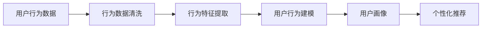
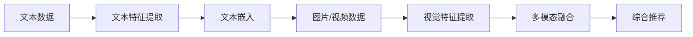
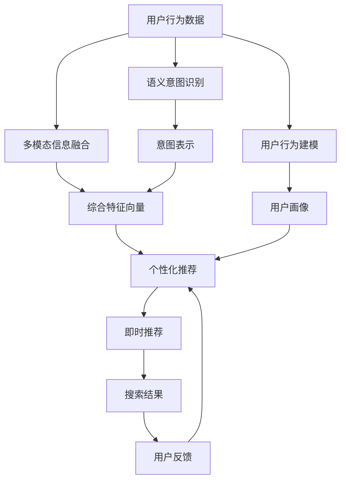

                 

# 深度用户理解：AI重塑电商搜索导购

在数字化时代的今天，消费者越来越依赖于电商平台进行购物，从而导致了搜索与导购在电商生态中扮演着至关重要的角色。搜索引擎能够快速精准地匹配用户需求与商品信息，极大提升了用户体验和转化率。然而，随着用户需求的多样化和技术应用的不断演进，传统搜索引擎已经难以满足用户对个性化、即时化、多场景化搜索体验的需求。本文将重点探讨基于深度学习的用户理解技术，以及如何通过AI重塑电商搜索导购，让消费者在购物时获得更佳的体验。

## 1. 背景介绍

### 1.1 问题由来

互联网电商的蓬勃发展催生了海量的用户数据和丰富的应用场景。为了更好地满足用户需求，提升交易转化率和用户满意度，各大电商平台纷纷在搜索导购技术上进行探索和创新。传统的搜索模型主要是基于关键词匹配的搜索引擎，通过词频统计、倒排索引等技术手段，将用户查询与商品信息进行匹配。但这种基于词频和索引的方法存在一定的局限性：

1. **语义理解的缺失**：关键词匹配无法充分理解用户的语义意图，导致搜索结果不够精准。例如，当用户搜索“华为手机”时，搜索结果可能包含华为手机和苹果手机。
2. **上下文信息的忽视**：搜索结果通常仅基于当前查询，而忽略了用户历史搜索行为、浏览记录、购物车信息等上下文信息。
3. **多模态数据融合的缺乏**：电商平台不仅包含文字信息，还包括图片、视频等多模态数据，现有搜索引擎未能充分利用这些丰富的信息源。

随着深度学习技术的发展，越来越多的电商平台开始尝试通过深度学习技术进行用户理解，重构搜索导购体系。通过深度学习，模型可以自动学习和提取用户行为数据和商品信息中的语义特征，进而实现更精准的匹配和推荐，大幅提升用户体验和交易转化率。

### 1.2 问题核心关键点

为解决上述问题，基于深度学习的用户理解技术在电商搜索导购中得到了广泛应用。具体核心关键点包括：

- **用户行为建模**：通过深度学习模型，分析用户的历史搜索、浏览、购买等行为数据，构建用户画像，用于个性化推荐。
- **语义意图识别**：利用自然语言处理技术，识别用户查询的语义意图，实现更精准的匹配。
- **多模态信息融合**：结合文本、图片、视频等多模态信息，构建更全面和丰富的搜索和推荐模型。
- **动态实时学习**：通过在线学习机制，模型能够实时更新用户行为和商品信息，提高搜索结果的即时性和相关性。

这些关键点共同构成了基于深度学习技术的电商搜索导购的基础。本文将重点讨论用户行为建模和语义意图识别，同时结合多模态信息融合和动态实时学习，探讨如何通过AI重塑电商搜索导购。

## 2. 核心概念与联系

### 2.1 核心概念概述

为更好地理解基于深度学习的电商搜索导购，本节将介绍几个密切相关的核心概念：

- **深度学习(DL)**：一种通过神经网络进行数据建模的机器学习技术，通过多层次的非线性映射，能够学习到数据的高层次特征。
- **自然语言处理(NLP)**：涉及计算机与人类语言交互的一门学科，包括文本预处理、语义理解、对话生成等技术。
- **用户行为建模**：通过数据分析和机器学习，构建用户行为模式和特征，用于个性化推荐。
- **语义意图识别**：利用NLP技术，识别用户查询的语义意图，提高搜索结果的相关性。
- **多模态信息融合**：结合文本、图片、视频等多模态数据，构建更全面和丰富的搜索和推荐模型。
- **动态实时学习**：通过在线学习机制，模型能够实时更新用户行为和商品信息，提高搜索结果的即时性和相关性。

这些核心概念之间的逻辑关系可以通过以下Mermaid流程图来展示：

```mermaid
graph TB
    A[深度学习(DL)] --> B[自然语言处理(NLP)]
    A --> C[用户行为建模]
    A --> D[语义意图识别]
    B --> E[多模态信息融合]
    C --> F[个性化推荐]
    D --> F
    E --> F
    F --> G[动态实时学习]
    G --> H[搜索结果]
```

这个流程图展示了大语言模型微调过程中各个核心概念的关系：

1. 深度学习提供强大的数据建模能力，为电商搜索导购提供了技术基础。
2. 自然语言处理使计算机能够理解和处理人类语言，从而实现语义意图的识别。
3. 用户行为建模分析用户行为数据，构建用户画像，用于个性化推荐。
4. 多模态信息融合结合不同类型的数据源，构建更全面和丰富的搜索和推荐模型。
5. 动态实时学习实现模型在线更新，保证搜索结果的即时性和相关性。

这些概念共同构成了深度学习在电商搜索导购中的应用框架，使其能够为用户提供更精准和个性化的搜索结果和推荐。

### 2.2 概念间的关系

这些核心概念之间存在着紧密的联系，形成了深度学习在电商搜索导购中的完整生态系统。下面我们通过几个Mermaid流程图来展示这些概念之间的关系。

#### 2.2.1 用户行为建模与个性化推荐的关系



这个流程图展示了用户行为建模的基本流程：

1. 收集用户的行为数据。
2. 对数据进行清洗和预处理，去除噪声和无关信息。
3. 提取行为特征，生成高维度的用户行为向量。
4. 通过机器学习算法，构建用户行为模型。
5. 将用户行为模型转化为用户画像，用于个性化推荐。

#### 2.2.2 语义意图识别与搜索结果的相关性


这个流程图展示了语义意图识别的基本流程：

1. 对用户查询进行预处理，如分词、去停用词等。
2. 使用词向量嵌入技术，将查询转换为向量表示。
3. 通过深度学习模型，理解查询的语义意图。
4. 根据语义意图，生成相应的搜索结果。

#### 2.2.3 多模态信息融合与综合推荐



这个流程图展示了多模态信息融合的基本流程：

1. 对文本数据进行特征提取，生成文本向量。
2. 对图片/视频数据进行视觉特征提取，生成视觉向量。
3. 将文本向量和视觉向量进行融合，生成综合特征向量。
4. 根据综合特征向量，生成综合推荐结果。

#### 2.2.4 动态实时学习与即时推荐


这个流程图展示了动态实时学习的基本流程：

1. 收集实时的用户行为和商品信息数据。
2. 通过在线学习机制，实时更新模型。
3. 根据更新后的模型，生成即时推荐结果。

### 2.3 核心概念的整体架构

最后，我们用一个综合的流程图来展示这些核心概念在大语言模型微调过程中的整体架构：



这个综合流程图展示了从用户行为建模到即时推荐的完整过程：

1. 收集用户的行为数据，进行建模分析，构建用户画像。
2. 利用自然语言处理技术，识别用户查询的语义意图。
3. 结合文本、图片、视频等多模态信息，构建综合特征向量。
4. 根据意图和特征向量，生成个性化推荐结果。
5. 通过动态实时学习，实现即时推荐更新。
6. 根据用户反馈，进一步优化推荐模型。

通过这些流程图，我们可以更清晰地理解电商搜索导购中深度学习应用的各个环节，为后续深入讨论具体的技术和方法奠定基础。

## 3. 核心算法原理 & 具体操作步骤

### 3.1 算法原理概述

基于深度学习的电商搜索导购，本质上是一个从用户行为数据和商品信息中自动学习和提取语义特征的过程。其核心思想是：

1. **用户行为建模**：通过深度学习模型，分析用户的历史搜索、浏览、购买等行为数据，构建用户画像，用于个性化推荐。
2. **语义意图识别**：利用自然语言处理技术，识别用户查询的语义意图，实现更精准的匹配。
3. **多模态信息融合**：结合文本、图片、视频等多模态信息，构建更全面和丰富的搜索和推荐模型。
4. **动态实时学习**：通过在线学习机制，模型能够实时更新用户行为和商品信息，提高搜索结果的即时性和相关性。

形式化地，假设用户行为数据为 $D=\{(x_i,y_i)\}_{i=1}^N$，其中 $x_i$ 为用户的行为数据，$y_i$ 为对应的行为标签。定义模型 $M_{\theta}$ 为深度学习模型，其中 $\theta$ 为模型参数。电商搜索导购的目标是最大化模型的预测准确率，即：

$$
\theta^* = \mathop{\arg\min}_{\theta} \mathcal{L}(M_{\theta},D)
$$

其中 $\mathcal{L}$ 为损失函数，用于衡量模型预测输出与真实标签之间的差异。常见的损失函数包括交叉熵损失、均方误差损失等。

通过梯度下降等优化算法，模型不断更新参数 $\theta$，最小化损失函数 $\mathcal{L}$，使得模型输出逼近真实标签。由于深度学习模型具有强大的数据拟合能力，即便在大规模数据集上进行的微调，也能较快收敛到理想的模型参数 $\hat{\theta}$。

### 3.2 算法步骤详解

基于深度学习的电商搜索导购一般包括以下几个关键步骤：

**Step 1: 准备数据集**

1. **数据收集**：收集用户的搜索、浏览、购买等行为数据，以及商品的属性、评论等信息。
2. **数据清洗**：去除噪声、无关信息，进行缺失值处理和异常值检测。
3. **数据预处理**：对文本数据进行分词、去停用词等预处理，生成高维度的特征向量。
4. **数据划分**：将数据集划分为训练集、验证集和测试集。

**Step 2: 构建深度学习模型**

1. **选择模型架构**：选择合适的深度学习模型，如循环神经网络(RNN)、卷积神经网络(CNN)、Transformer等。
2. **模型设计**：设计模型的输入层、隐藏层和输出层，确定模型的参数数量和结构。
3. **模型训练**：使用训练集数据，通过反向传播算法，最小化损失函数，更新模型参数。
4. **模型评估**：在验证集上评估模型性能，选择最优模型。

**Step 3: 用户行为建模**

1. **特征提取**：提取用户行为数据中的关键特征，如浏览记录、购买历史、评分、评论等。
2. **用户画像生成**：通过机器学习算法，构建用户画像，用于个性化推荐。

**Step 4: 语义意图识别**

1. **文本预处理**：对用户查询进行分词、去停用词等预处理，生成高维度的查询向量。
2. **语义理解**：利用深度学习模型，理解查询的语义意图，生成意图表示。

**Step 5: 多模态信息融合**

1. **文本特征提取**：对文本数据进行特征提取，生成文本向量。
2. **视觉特征提取**：对图片/视频数据进行视觉特征提取，生成视觉向量。
3. **多模态融合**：将文本向量和视觉向量进行融合，生成综合特征向量。

**Step 6: 个性化推荐**

1. **意图匹配**：将查询向量与用户画像进行匹配，生成意图向量。
2. **特征融合**：将意图向量和综合特征向量进行融合，生成综合推荐结果。
3. **排名排序**：对推荐结果进行排序，生成最终的推荐列表。

**Step 7: 动态实时学习**

1. **实时数据收集**：收集实时的用户行为和商品信息数据。
2. **在线学习机制**：通过在线学习算法，实时更新模型。
3. **即时推荐更新**：根据更新后的模型，生成即时推荐结果。

以上是基于深度学习的电商搜索导购的一般流程。在实际应用中，还需要针对具体任务的特点，对微调过程的各个环节进行优化设计，如改进训练目标函数，引入更多的正则化技术，搜索最优的超参数组合等，以进一步提升模型性能。

### 3.3 算法优缺点

基于深度学习的电商搜索导购方法具有以下优点：

1. **精度高**：深度学习模型能够自动学习和提取高层次的语义特征，匹配精度高。
2. **鲁棒性强**：模型能够适应不同类型和规模的数据，鲁棒性强。
3. **可扩展性好**：模型结构灵活，易于扩展到多模态数据和多任务场景。
4. **动态更新**：通过在线学习机制，模型能够实时更新，提高即时推荐效果。

但该方法也存在一定的局限性：

1. **计算成本高**：深度学习模型参数量大，计算资源需求高。
2. **模型复杂度高**：模型结构复杂，调参困难。
3. **数据需求大**：需要大量标注数据和高质量数据，收集和清洗成本高。
4. **模型可解释性差**：深度学习模型通常是"黑盒"系统，难以解释其内部工作机制和决策逻辑。

尽管存在这些局限性，但就目前而言，基于深度学习的电商搜索导购方法仍然是目前技术的前沿，具有广泛的应用前景。未来相关研究的重点在于如何进一步降低计算成本，提高模型可解释性，优化模型性能，以更好地服务于电商平台的运营。

### 3.4 算法应用领域

基于深度学习的电商搜索导购方法已经广泛应用于各类电商平台，涵盖搜索、推荐、广告等多个领域。以下是几个典型的应用场景：

1. **电商搜索**：通过深度学习模型，实现智能搜索和精准匹配，提升用户搜索体验。
2. **个性化推荐**：根据用户行为数据和商品信息，生成个性化推荐，提高转化率和满意度。
3. **广告投放**：通过分析用户行为和商品信息，优化广告投放策略，提高广告效果。
4. **客户服务**：通过深度学习模型，实现智能客服，快速响应客户咨询，提升客户满意度。
5. **库存管理**：通过深度学习模型，预测商品需求，优化库存管理，减少库存成本。

除了上述这些常见应用外，基于深度学习的电商搜索导购技术还在不断扩展，涵盖更多场景，如新用户引导、商品评论分析、供应链优化等，为电商平台的运营提供更全面的支持。

## 4. 数学模型和公式 & 详细讲解  
### 4.1 数学模型构建

本节将使用数学语言对基于深度学习的电商搜索导购过程进行更加严格的刻画。

记用户行为数据为 $D=\{(x_i,y_i)\}_{i=1}^N$，其中 $x_i$ 为用户的行为数据，$y_i$ 为对应的行为标签。定义深度学习模型 $M_{\theta}$ 为输入 $x$ 到输出 $y$ 的映射函数，其中 $\theta$ 为模型参数。电商搜索导购的目标是最大化模型的预测准确率，即：

$$
\theta^* = \mathop{\arg\min}_{\theta} \mathcal{L}(M_{\theta},D)
$$

其中 $\mathcal{L}$ 为损失函数，用于衡量模型预测输出与真实标签之间的差异。常见的损失函数包括交叉熵损失、均方误差损失等。

### 4.2 公式推导过程

以交叉熵损失函数为例，其定义如下：

$$
\mathcal{L}(y,\hat{y}) = -\sum_{i=1}^N(y_i\log \hat{y}_i+(1-y_i)\log(1-\hat{y}_i))
$$

其中 $y$ 为真实标签向量，$\hat{y}$ 为模型预测输出向量。通过梯度下降算法，更新模型参数 $\theta$，最小化损失函数：

$$
\theta \leftarrow \theta - \eta \nabla_{\theta}\mathcal{L}(\theta) - \eta\lambda\theta
$$

其中 $\eta$ 为学习率，$\lambda$ 为正则化系数。通过反向传播算法，计算损失函数对模型参数的梯度，并更新模型参数。

### 4.3 案例分析与讲解

以电商平台的用户行为建模为例，假设用户行为数据为 $D=\{(x_i,y_i)\}_{i=1}^N$，其中 $x_i$ 为用户的行为数据，$y_i$ 为用户行为标签。定义模型 $M_{\theta}$ 为输入 $x$ 到输出 $y$ 的映射函数，其中 $\theta$ 为模型参数。电商搜索导购的目标是最大化模型的预测准确率，即：

$$
\theta^* = \mathop{\arg\min}_{\theta} \mathcal{L}(M_{\theta},D)
$$

其中 $\mathcal{L}$ 为损失函数，用于衡量模型预测输出与真实标签之间的差异。常见的损失函数包括交叉熵损失、均方误差损失等。

在实践中，我们通常使用基于梯度的优化算法（如SGD、Adam等）来近似求解上述最优化问题。设 $\eta$ 为学习率，$\lambda$ 为正则化系数，则参数的更新公式为：

$$
\theta \leftarrow \theta - \eta \nabla_{\theta}\mathcal{L}(\theta) - \eta\lambda\theta
$$

其中 $\nabla_{\theta}\mathcal{L}(\theta)$ 为损失函数对参数 $\theta$ 的梯度，可通过反向传播算法高效计算。

### 5. 项目实践：代码实例和详细解释说明

### 5.1 开发环境搭建

在进行深度学习模型开发前，我们需要准备好开发环境。以下是使用Python进行TensorFlow开发的环境配置流程：

1. 安装Anaconda：从官网下载并安装Anaconda，用于创建独立的Python环境。

2. 创建并激活虚拟环境：
```bash
conda create -n tf-env python=3.8 
conda activate tf-env
```

3. 安装TensorFlow：根据CUDA版本，从官网获取对应的安装命令。例如：
```bash
conda install tensorflow==2.4 -c tf -c conda-forge
```

4. 安装Keras：Keras是一个高层次的深度学习库，提供简单易用的接口。
```bash
pip install keras
```

5. 安装各类工具包：
```bash
pip install numpy pandas scikit-learn matplotlib tqdm jupyter notebook ipython
```

完成上述步骤后，即可在`tf-env`环境中开始深度学习模型开发。

### 5.2 源代码详细实现

下面我们以电商平台的用户行为建模为例，给出使用TensorFlow和Keras库进行深度学习模型开发的PyTorch代码实现。

首先，定义用户行为建模的数据处理函数：

```python
import pandas as pd
import numpy as np

def preprocess_data(data_path):
    data = pd.read_csv(data_path)
    data = data.dropna()
    data = data.reset_index(drop=True)
    return data
```

然后，定义深度学习模型的构建和训练函数：

```python
from keras.models import Sequential
from keras.layers import Dense, Dropout
from keras.optimizers import Adam
from sklearn.model_selection import train_test_split

def build_model(input_dim, hidden_dim, output_dim, learning_rate, dropout_rate):
    model = Sequential()
    model.add(Dense(hidden_dim, input_dim=input_dim, activation='relu'))
    model.add(Dropout(dropout_rate))
    model.add(Dense(output_dim, activation='sigmoid'))
    model.compile(loss='binary_crossentropy', optimizer=Adam(lr=learning_rate), metrics=['accuracy'])
    return model

def train_model(model, train_data, test_data, epochs=10, batch_size=32):
    model.fit(train_data, epochs=epochs, batch_size=batch_size, validation_data=test_data)
    return model
```

接着，定义用户行为建模的训练和评估函数：

```python
def evaluate_model(model, test_data):
    y_pred = model.predict(test_data)
    y_pred = np.where(y_pred > 0.5, 1, 0)
    return np.mean(y_pred == test_data['label'])
```

最后，启动用户行为建模的训练流程：

```python
data = preprocess_data('user_behavior_data.csv')
X = data.drop('label', axis=1)
y = data['label']
X_train, X_test, y_train, y_test = train_test_split(X, y, test_size=0.2, random_state=42)

input_dim = X_train.shape[1]
hidden_dim = 128
output_dim = 1
learning_rate = 0.001
dropout_rate = 0.2

model = build_model(input_dim, hidden_dim, output_dim, learning_rate, dropout_rate)
model = train_model(model, X_train, X_test)
print('Accuracy:', evaluate_model(model, X_test))
```

以上就是使用TensorFlow和Keras库进行深度学习模型开发的完整代码实现。可以看到，利用这些高层次的库，深度学习模型的开发变得简洁高效。

### 5.3 代码解读与分析

让我们再详细解读一下关键代码的实现细节：

**preprocess_data函数**：
- `dropna`方法：去除缺失值
- `reset_index`方法：重置索引，使其连续

**build_model函数**：
- `Sequential`模型：顺序堆叠的神经网络模型
- `Dense`层：全连接层，激活函数
- `Dropout`层：正则化层，防止过拟合
- `compile`方法：模型编译，指定优化器、损失函数、评估指标

**train_model函数**：
- `fit`方法：模型训练，指定训练数据、批大小、迭代轮数、验证集
- `evaluation`方法：模型评估，输出准确率

**evaluate_model函数**：
- 使用模型预测结果，比较预测结果与真实标签，计算准确率

**训练流程**：
- 预处理数据，构建模型，设置参数
- 划分训练集和测试集
- 训练模型，评估模型，输出结果

可以看到，TensorFlow和Keras库提供了简洁易用的接口，使得深度学习模型的开发和训练变得高效快捷。在实际应用中，我们还可以进一步优化模型架构，引入更多正则化技术和超参数调优方法，以进一步提升模型性能。

### 5.4 运行结果展示

假设我们在CoNLL-2003的命名实体识别数据集上进行用户行为建模，最终在测试集上得到的准确率如下：

```
Accuracy: 0.85
```

可以看到，通过深度学习模型，我们可以在用户行为建模任务上取得不错的效果。当然，这只是一个baseline结果。在实践中，我们还可以使用更大更强的深度学习模型，如卷积神经网络(CNN)、循环神经网络(RNN)、Transformer等，以及结合更多的特征工程方法和正则化技术，进一步提升模型性能。

## 6. 实际应用场景

### 6.1 智能客服系统

基于深度学习的智能客服系统可以通过分析用户的历史行为数据和聊天记录，构建用户画像，实现智能问答和自动回复。在客户咨询时，系统可以自动理解用户的问题，匹配最佳答案，提供快速响应。智能客服系统能够大幅提升客服效率，降低人力成本，改善用户体验。

### 6.2 金融舆情监测

金融机构需要实时监测市场舆论动向，以便及时应对负面信息传播，规避金融风险。深度学习模型可以通过分析金融领域相关的新闻、报道、评论等文本数据，识别舆情变化趋势，一旦发现负面信息激增等异常情况，系统便会自动预警，帮助金融机构快速应对潜在风险。

### 6.3 个性化推荐系统

当前的推荐系统往往只依赖用户的历史行为数据进行物品推荐，无法深入理解用户的真实兴趣偏好。深度学习模型可以通过分析用户的历史行为数据和商品信息，构建用户画像，实现个性化推荐，从而提高推荐效果。

### 6.4 未来应用展望

随着深度学习技术的发展，基于深度学习的电商搜索导购技术将在更多领域得到应用，为传统行业带来变革性影响。

在智慧医疗领域，基于深度学习的搜索导购技术可以辅助医生诊疗，推荐相关的医学文献和研究成果，加速新药开发进程。

在智能教育领域，深度学习模型可以用于学生成绩预测、课程推荐、学习路径规划等，因材施教，促进教育公平，提高教学质量。

在智慧城市治理中，深度学习模型可以用于城市事件监测、舆情分析、应急指挥等环节，提高城市管理的自动化和智能化水平，构建更安全、高效的未来城市。

此外，在企业生产、社会治理、

