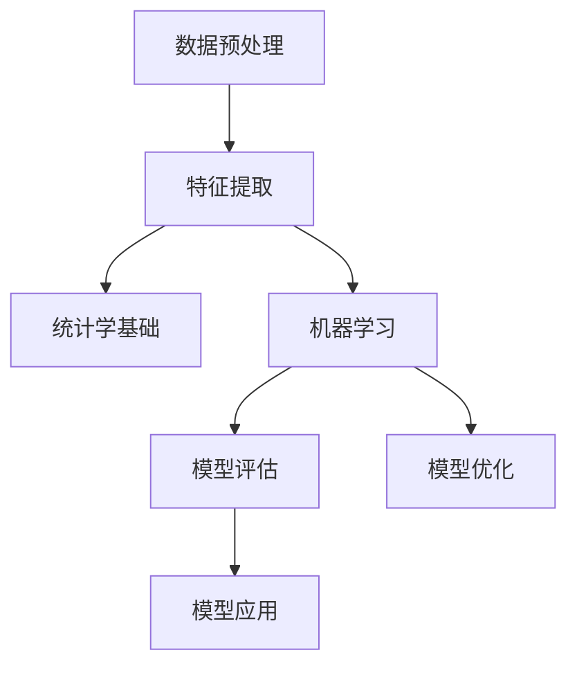
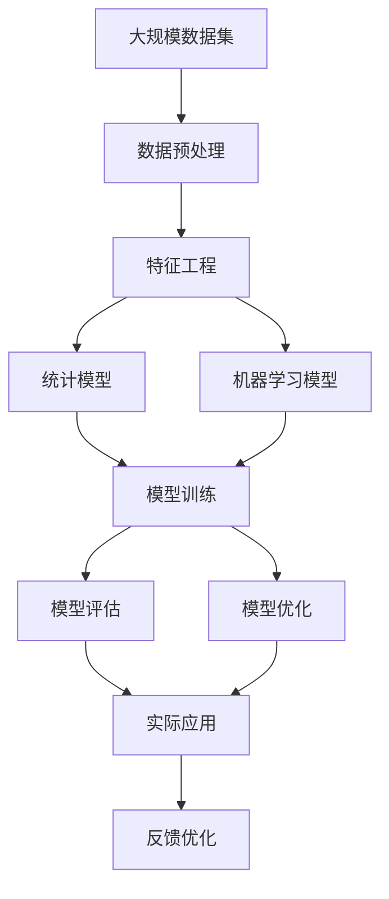

                 

# 理解世界的复杂性：从结构到洞见

## 1. 背景介绍

### 1.1 问题由来
在当今数据爆炸的时代，我们面临着前所未有的数据复杂性和多样性。无论是互联网上的海量文本数据，还是物联网中的庞大传感器数据，抑或是金融、生物医学等领域的结构化数据，都要求我们能够从中提取出有价值的洞见，指导实际决策。然而，数据本身往往存在噪声、缺失、不一致等问题，如何从复杂的数据中抽取洞见，成为一个极具挑战性的任务。

### 1.2 问题核心关键点
理解世界复杂性的核心在于通过结构化的数据分析和建模，提取出数据背后的内在规律和关系。这不仅要求我们掌握基本的统计学、机器学习知识，还需要深入理解数据结构、算法原理和实际应用场景。本文将从结构化分析、算法原理、实际应用和未来展望等角度，系统探讨如何理解世界的复杂性，从结构到洞见的转变过程。

### 1.3 问题研究意义
掌握从数据到洞见的理解和转化方法，对于现代数据分析、人工智能、自然语言处理、机器学习等领域具有重要意义：

1. **提升数据处理能力**：能够有效应对大数据带来的挑战，从海量数据中提取有用的信息。
2. **增强决策支持**：基于结构化分析和模型预测，为决策提供科学依据。
3. **推动创新应用**：基于数据洞见，开发新的算法和应用，如推荐系统、自然语言生成等。
4. **促进跨领域应用**：在金融、医疗、教育等不同领域，实现数据驱动的决策支持。

## 2. 核心概念与联系

### 2.1 核心概念概述

为更好地理解数据复杂性，我们需要掌握以下几个核心概念：

- **数据预处理**：包括数据清洗、特征工程、数据标准化等步骤，旨在提高数据质量，增强模型的泛化能力。
- **特征提取**：从原始数据中提取出对目标任务有帮助的特征，构建特征空间，供模型训练使用。
- **统计学基础**：包括概率论、统计推断、假设检验等基本概念，是理解数据分布和建立模型基础。
- **机器学习**：利用统计学模型和算法，从数据中学习规律和关系，构建预测模型。
- **模型评估**：通过交叉验证、ROC曲线、AUC等方法，评估模型性能和泛化能力。
- **模型优化**：包括超参数调优、模型融合、正则化等方法，提升模型效果和稳定性。

### 2.2 概念间的关系

这些核心概念之间存在着紧密的联系，形成了从数据预处理到模型优化的完整流程。我们可以用以下Mermaid流程图来展示这些概念的逻辑关系：



这个流程图展示了从数据预处理到模型优化的主要流程：首先对数据进行预处理，提取特征，在此基础上利用机器学习模型学习数据规律，通过模型评估和优化提升模型效果，最后应用模型进行预测和决策。

### 2.3 核心概念的整体架构

最后，我们用一个综合的流程图来展示这些核心概念在大数据处理和模型构建中的整体架构：



这个综合流程图展示了从数据预处理到模型优化的完整过程，包括数据清洗、特征提取、模型训练、评估和优化，最终应用于实际问题的解决。

## 3. 核心算法原理 & 具体操作步骤
### 3.1 算法原理概述

数据复杂性的处理，本质上是通过算法和模型从数据中提取洞见。其核心原理包括以下几个步骤：

1. **数据预处理**：清洗和标准化数据，去除噪声和缺失值，构建可用于模型训练的特征空间。
2. **特征提取**：选择合适的特征，构建特征向量，减少数据维度。
3. **模型训练**：选择合适的模型，利用历史数据训练模型，学习数据规律。
4. **模型评估**：通过交叉验证等方法，评估模型性能，选择最佳模型。
5. **模型优化**：调整模型参数，提升模型泛化能力，避免过拟合。
6. **模型应用**：应用模型进行预测和决策，提供实际应用价值。

### 3.2 算法步骤详解

基于上述原理，我们以线性回归模型为例，详细介绍数据处理和模型构建的具体步骤：

**Step 1: 数据预处理**
1. **数据清洗**：去除数据中的缺失值、异常值，确保数据完整性。
2. **数据标准化**：对特征进行标准化，使其均值为0，方差为1，提高模型训练效果。

**Step 2: 特征提取**
1. **特征选择**：根据领域知识，选择对目标任务有帮助的特征。
2. **特征工程**：通过多项式变换、交互项等方法，构建更好的特征空间。

**Step 3: 模型训练**
1. **模型选择**：选择合适的模型，如线性回归、决策树、随机森林等。
2. **训练过程**：利用历史数据训练模型，通过梯度下降等优化算法，最小化损失函数。

**Step 4: 模型评估**
1. **交叉验证**：通过K折交叉验证，评估模型泛化能力。
2. **性能指标**：计算模型的RMSE、MAE、R²等指标，衡量模型性能。

**Step 5: 模型优化**
1. **超参数调优**：通过网格搜索、贝叶斯优化等方法，调整模型超参数，提高模型效果。
2. **正则化**：添加L1、L2正则化项，避免过拟合。

**Step 6: 模型应用**
1. **预测过程**：输入新数据，利用模型进行预测，得到结果。
2. **结果解读**：根据预测结果，进行实际应用和决策。

### 3.3 算法优缺点

基于上述原理的算法，具有以下优点：

- **泛化能力强**：通过特征工程和模型优化，提高模型泛化能力，适应不同数据和场景。
- **适用性强**：适用于各种类型的数据和任务，如回归、分类、聚类等。
- **可解释性强**：模型的决策过程透明，易于理解和解释。

同时，这些算法也存在以下缺点：

- **数据依赖强**：模型效果依赖于数据质量和特征工程，对数据缺失和噪声敏感。
- **计算资源需求高**：部分复杂模型需要大量计算资源和时间，如深度学习模型。
- **模型选择困难**：模型选择和调参需要领域知识和经验，对于非专业人士较难实现。

### 3.4 算法应用领域

基于上述算法原理，数据复杂性处理广泛应用于各个领域：

- **金融分析**：利用历史交易数据，构建预测模型，进行股票预测、风险评估等。
- **医疗诊断**：通过患者病历数据，构建分类模型，进行疾病诊断和治疗方案推荐。
- **市场营销**：利用客户行为数据，构建聚类模型，进行市场细分和用户画像。
- **自然语言处理**：通过文本数据，构建情感分析、文本分类等模型，提升智能客服和舆情监测效果。
- **智能推荐**：通过用户行为数据，构建推荐模型，实现个性化推荐。

## 4. 数学模型和公式 & 详细讲解 & 举例说明

### 4.1 数学模型构建

本节将使用数学语言对数据处理和模型构建过程进行更加严格的刻画。

设原始数据集为 $D = \{(x_i, y_i)\}_{i=1}^N$，其中 $x_i$ 为输入特征，$y_i$ 为输出标签。

定义模型 $f(x)$，通过最小化损失函数 $\mathcal{L}(y, \hat{y})$ 来拟合数据，其中 $\hat{y} = f(x)$ 为模型预测输出。

常见的损失函数包括均方误差损失（MSE）、交叉熵损失（CE）等。以线性回归模型为例，目标是最小化均方误差损失：

$$
\mathcal{L}(y, \hat{y}) = \frac{1}{N} \sum_{i=1}^N (y_i - \hat{y}_i)^2
$$

### 4.2 公式推导过程

以线性回归模型为例，推导其损失函数和梯度公式：

设 $x_i = [x_{i1}, x_{i2}, ..., x_{in}]^T$，$y_i$ 为输出标签，$w$ 为模型参数，$\beta$ 为截距。

线性回归模型预测输出为：

$$
\hat{y}_i = \beta + \sum_{j=1}^n w_j x_{ij}
$$

均方误差损失函数为：

$$
\mathcal{L}(y, \hat{y}) = \frac{1}{N} \sum_{i=1}^N (y_i - \hat{y}_i)^2
$$

对损失函数求偏导数，得到梯度公式：

$$
\frac{\partial \mathcal{L}(y, \hat{y})}{\partial w_j} = \frac{2}{N} \sum_{i=1}^N (y_i - \hat{y}_i)x_{ij}
$$

利用梯度下降等优化算法，不断更新模型参数，最小化损失函数。

### 4.3 案例分析与讲解

以房价预测为例，展示线性回归模型的应用过程：

**数据预处理**：收集历史房价数据，去除缺失值和异常值，标准化数据。

**特征提取**：选择对房价有影响的特征，如面积、位置、房龄等。

**模型训练**：使用历史房价数据，训练线性回归模型，学习房价与特征之间的线性关系。

**模型评估**：利用交叉验证，计算模型的RMSE和R²，评估模型性能。

**模型优化**：通过网格搜索调优超参数，添加L2正则化项，避免过拟合。

**模型应用**：输入新房源特征，预测房价，提供决策支持。

## 5. 项目实践：代码实例和详细解释说明

### 5.1 开发环境搭建

在进行数据处理和模型训练前，我们需要准备好开发环境。以下是使用Python进行PyTorch开发的环境配置流程：

1. 安装Anaconda：从官网下载并安装Anaconda，用于创建独立的Python环境。

2. 创建并激活虚拟环境：
```bash
conda create -n pytorch-env python=3.8 
conda activate pytorch-env
```

3. 安装PyTorch：根据CUDA版本，从官网获取对应的安装命令。例如：
```bash
conda install pytorch torchvision torchaudio cudatoolkit=11.1 -c pytorch -c conda-forge
```

4. 安装各类工具包：
```bash
pip install numpy pandas scikit-learn matplotlib tqdm jupyter notebook ipython
```

完成上述步骤后，即可在`pytorch-env`环境中开始数据处理和模型训练。

### 5.2 源代码详细实现

下面以线性回归模型为例，给出使用PyTorch进行数据处理和模型训练的完整代码实现。

首先，定义数据预处理函数：

```python
import pandas as pd
from sklearn.model_selection import train_test_split
from sklearn.preprocessing import StandardScaler

def load_data():
    data = pd.read_csv('house_prices.csv')
    X = data[['area', 'location', 'room_count']]
    y = data['price']
    X_train, X_test, y_train, y_test = train_test_split(X, y, test_size=0.2, random_state=42)
    scaler = StandardScaler()
    X_train = scaler.fit_transform(X_train)
    X_test = scaler.transform(X_test)
    return X_train, X_test, y_train, y_test
```

然后，定义模型训练函数：

```python
import torch
from torch import nn, optim
from sklearn.metrics import mean_squared_error, r2_score

class LinearRegression(nn.Module):
    def __init__(self, n_features):
        super(LinearRegression, self).__init__()
        self.linear = nn.Linear(n_features, 1)

    def forward(self, x):
        return self.linear(x)

def train_model(model, optimizer, criterion, train_loader, num_epochs):
    model.train()
    losses = []
    for epoch in range(num_epochs):
        for batch in train_loader:
            optimizer.zero_grad()
            inputs, targets = batch
            outputs = model(inputs)
            loss = criterion(outputs, targets)
            loss.backward()
            optimizer.step()
            losses.append(loss.item())
    return model, losses

def evaluate_model(model, test_loader):
    model.eval()
    predictions = []
    targets = []
    for batch in test_loader:
        inputs, targets = batch
        outputs = model(inputs)
        predictions.append(outputs.data.numpy().flatten())
        targets.append(targets.data.numpy().flatten())
    predictions = np.concatenate(predictions)
    targets = np.concatenate(targets)
    rmse = mean_squared_error(predictions, targets, squared=False)
    r2 = r2_score(predictions, targets)
    return rmse, r2
```

接着，进行数据加载和模型训练：

```python
X_train, X_test, y_train, y_test = load_data()

# 定义模型、优化器和损失函数
model = LinearRegression(n_features=X_train.shape[1])
optimizer = optim.SGD(model.parameters(), lr=0.01)
criterion = nn.MSELoss()

# 定义数据集和数据加载器
train_dataset = torch.utils.data.TensorDataset(X_train, y_train)
test_dataset = torch.utils.data.TensorDataset(X_test, y_test)
train_loader = torch.utils.data.DataLoader(train_dataset, batch_size=32, shuffle=True)
test_loader = torch.utils.data.DataLoader(test_dataset, batch_size=32)

# 训练模型
model, losses = train_model(model, optimizer, criterion, train_loader, num_epochs=100)

# 评估模型
rmse, r2 = evaluate_model(model, test_loader)
print(f'RMSE: {rmse:.2f}, R²: {r2:.2f}')
```

以上就是使用PyTorch对线性回归模型进行房价预测的完整代码实现。可以看到，利用PyTorch，我们能够方便地构建和训练线性回归模型，输出预测结果并进行性能评估。

### 5.3 代码解读与分析

让我们再详细解读一下关键代码的实现细节：

**load_data函数**：
- 从CSV文件中加载数据，并进行特征选择和标准化。
- 将数据集划分为训练集和测试集，进行标准化。

**train_model函数**：
- 定义线性回归模型，包含一个线性层。
- 训练模型时，使用随机梯度下降（SGD）优化器进行参数更新。
- 计算均方误差损失，并回传梯度。
- 每轮训练结束后，记录损失值。

**evaluate_model函数**：
- 模型评估时，输入测试集数据，计算模型预测值。
- 利用均方误差和R²指标，评估模型预测性能。

**train流程**：
- 定义超参数，如学习率、批次大小等。
- 循环训练模型，记录训练过程中的损失值。
- 模型训练结束后，评估模型性能。

可以看到，PyTorch提供了丰富的工具和API，能够快速实现数据处理和模型训练。开发者只需关注核心算法和模型构建，即可高效完成数据处理和模型训练任务。

## 6. 实际应用场景

### 6.1 智能客服系统

智能客服系统是大数据处理和机器学习算法的重要应用场景之一。通过大数据分析和机器学习算法，智能客服系统能够自动理解客户咨询，提供及时准确的回复，提升客户满意度和企业效率。

在技术实现上，可以收集企业内部的客服对话记录，将问题和最佳答复构建成监督数据，在此基础上对预训练模型进行微调。微调后的模型能够自动理解客户意图，匹配最合适的答案模板进行回复。对于客户提出的新问题，还可以接入检索系统实时搜索相关内容，动态组织生成回答。如此构建的智能客服系统，能大幅提升客户咨询体验和问题解决效率。

### 6.2 金融舆情监测

金融机构需要实时监测市场舆论动向，以便及时应对负面信息传播，规避金融风险。传统的人工监测方式成本高、效率低，难以应对网络时代海量信息爆发的挑战。基于大数据处理和机器学习算法，金融舆情监测系统能够实时抓取和分析网络文本数据，自动识别市场情绪和舆情趋势，及时预警负面信息，帮助金融机构快速应对潜在风险。

### 6.3 个性化推荐系统

当前的推荐系统往往只依赖用户的历史行为数据进行物品推荐，无法深入理解用户的真实兴趣偏好。基于大数据处理和机器学习算法，个性化推荐系统可以更好地挖掘用户行为背后的语义信息，从而提供更精准、多样的推荐内容。

在实践中，可以收集用户浏览、点击、评论、分享等行为数据，提取和用户交互的物品标题、描述、标签等文本内容。将文本内容作为模型输入，用户的后续行为（如是否点击、购买等）作为监督信号，在此基础上微调预训练语言模型。微调后的模型能够从文本内容中准确把握用户的兴趣点。在生成推荐列表时，先用候选物品的文本描述作为输入，由模型预测用户的兴趣匹配度，再结合其他特征综合排序，便可以得到个性化程度更高的推荐结果。

### 6.4 未来应用展望

随着大数据处理和机器学习技术的不断发展，基于这些技术的各类应用场景将不断涌现，为各行各业带来变革性影响。

在智慧医疗领域，基于大数据分析和机器学习算法，医疗问答系统、病历分析、药物研发等应用将提升医疗服务的智能化水平，辅助医生诊疗，加速新药开发进程。

在智能教育领域，大数据处理和机器学习算法可用于作业批改、学情分析、知识推荐等方面，因材施教，促进教育公平，提高教学质量。

在智慧城市治理中，大数据分析和机器学习算法可用于城市事件监测、舆情分析、应急指挥等环节，提高城市管理的自动化和智能化水平，构建更安全、高效的未来城市。

此外，在企业生产、社会治理、文娱传媒等众多领域，基于大数据处理和机器学习算法的人工智能应用也将不断涌现，为经济社会发展注入新的动力。

## 7. 工具和资源推荐

### 7.1 学习资源推荐

为了帮助开发者系统掌握大数据处理和机器学习理论基础和实践技巧，这里推荐一些优质的学习资源：

1. 《Python数据科学手册》：由Jake VanderPlas撰写，涵盖Python在数据科学和机器学习中的应用，适合初学者入门。
2. 《机器学习》课程（Coursera）：由斯坦福大学的Andrew Ng教授主讲，系统介绍机器学习基础和算法。
3. 《深度学习》课程（DeepLearning.ai）：由Google Brain团队的Andrew Ng等人主讲，介绍深度学习理论和实践。
4. Kaggle竞赛平台：全球知名的数据科学竞赛平台，提供大量数据集和模型，适合实践学习和竞赛提升。
5. arXiv论文预印本：人工智能领域最新研究成果的发布平台，包括大量尚未发表的前沿工作，学习前沿技术的必读资源。

通过对这些资源的学习实践，相信你一定能够快速掌握大数据处理和机器学习的精髓，并用于解决实际的NLP问题。

### 7.2 开发工具推荐

高效的开发离不开优秀的工具支持。以下是几款用于大数据处理和机器学习开发的常用工具：

1. Jupyter Notebook：开源的交互式编程环境，支持多种编程语言，便于快速迭代开发。
2. TensorFlow：由Google主导开发的开源深度学习框架，生产部署方便，适合大规模工程应用。
3. PyTorch：基于Python的开源深度学习框架，灵活动态的计算图，适合快速迭代研究。
4. Scikit-Learn：开源的Python机器学习库，提供丰富的算法和工具，适合数据探索和建模。
5. Pandas：开源的Python数据分析库，提供高效的数据结构和操作函数，适合数据清洗和处理。
6. Matplotlib：开源的Python绘图库，提供丰富的可视化工具，适合数据探索和模型评估。

合理利用这些工具，可以显著提升大数据处理和机器学习开发的效率，加快创新迭代的步伐。

### 7.3 相关论文推荐

大数据处理和机器学习技术的发展源于学界的持续研究。以下是几篇奠基性的相关论文，推荐阅读：

1. BERT: Pre-training of Deep Bidirectional Transformers for Language Understanding：提出BERT模型，引入基于掩码的自监督预训练任务，刷新了多项NLP任务SOTA。
2. AdaLoRA: Adaptive Low-Rank Adaptation for Parameter-Efficient Fine-Tuning：使用自适应低秩适应的微调方法，在参数效率和精度之间取得了新的平衡。
3. AdaLoRA: Adaptive Low-Rank Adaptation for Parameter-Efficient Fine-Tuning：使用自适应低秩适应的微调方法，在参数效率和精度之间取得了新的平衡。
4. Transformer from Self-Attention to Self-Supervision：由Vaswani等人提出，介绍Transformer模型的原理和实现，奠定了现代深度学习模型框架。
5. Improving Generalization with Self-Distillation：提出模型蒸馏方法，通过知识转移提高模型泛化能力，提升模型性能。

这些论文代表了大数据处理和机器学习技术的发展脉络。通过学习这些前沿成果，可以帮助研究者把握学科前进方向，激发更多的创新灵感。

除上述资源外，还有一些值得关注的前沿资源，帮助开发者紧跟大数据处理和机器学习技术的最新进展，例如：

1. arXiv论文预印本：人工智能领域最新研究成果的发布平台，包括大量尚未发表的前沿工作，学习前沿技术的必读资源。
2. 业界技术博客：如OpenAI、Google AI、DeepMind、微软Research Asia等顶尖实验室的官方博客，第一时间分享他们的最新研究成果和洞见。
3. 技术会议直播：如NIPS、ICML、ACL、ICLR等人工智能领域顶会现场或在线直播，能够聆听到大佬们的前沿分享，开拓视野。
4. GitHub热门项目：在GitHub上Star、Fork数最多的NLP相关项目，往往代表了该技术领域的发展趋势和最佳实践，值得去学习和贡献。
5. 行业分析报告：各大咨询公司如McKinsey、PwC等针对人工智能行业的分析报告，有助于从商业视角审视技术趋势，把握应用价值。

总之，对于大数据处理和机器学习技术的学习和实践，需要开发者保持开放的心态和持续学习的意愿。多关注前沿资讯，多动手实践，多思考总结，必将收获满满的成长收益。

## 8. 总结：未来发展趋势与挑战

### 8.1 总结

本文对大数据处理和机器学习技术进行了全面系统的介绍。首先阐述了数据复杂性的处理原理和流程，通过结构化的数据分析和建模，提取出数据背后的内在规律和关系。其次，从算法原理、具体操作步骤和实际应用等方面，详细讲解了机器学习模型的构建和优化过程。最后，从数据预处理、特征提取、模型训练、模型评估和模型优化等多个角度，展示了数据处理和模型训练的完整流程，为实际应用提供了参考。

通过本文的系统梳理，可以看到，大数据处理和机器学习技术已经成为现代社会数据驱动决策的重要工具，广泛应用于各个领域。掌握这些技术，可以帮助我们更好地理解和转化数据，为决策提供科学依据，提升效率和效果。

### 8.2 未来发展趋势

展望未来，大数据处理和机器学习技术将呈现以下几个发展趋势：

1. **自动化和智能化**：未来的机器学习算法将更加自动化，能够根据数据特征自动选择模型和调参，减少人工干预。同时，智能化的机器学习算法将能够自主优化和迭代，不断提升模型性能。
2. **跨领域融合**：大数据处理和机器学习技术将与其他领域技术进行更深入的融合，如自然语言处理、计算机视觉、物联网等，形成更加全面的智能系统。
3. **边缘计算和实时性**：随着物联网设备的普及，边缘计算和大数据处理技术将更加普及，机器学习模型将在边缘设备上进行实时处理，提升数据处理速度和效率。
4. **可解释性和透明性**：未来的机器学习算法将更加注重可解释性和透明性，能够提供模型决策的详细解释，增强用户信任和接受度。
5. **隐私保护和伦理约束**：大数据处理和机器学习算法将更加注重隐私保护和伦理约束，确保数据和模型的安全性，避免数据滥用和伦理风险。

### 8.3 面临的挑战

尽管大数据处理和机器学习技术已经取得了显著进展，但在迈向更加智能化、普适化应用的过程中，仍面临诸多挑战：

1. **数据隐私和安全**：大数据处理和机器学习算法需要处理大量敏感数据，如何在保护隐私的同时，进行高效的数据分析和模型训练，是一个重要的挑战。
2. **模型泛化能力**：模型在不同数据集上的泛化能力仍然有限，如何在多样化的数据集上保持稳定的性能，仍需进一步研究。
3. **算法公平性和偏见**：机器学习算法可能会学习到数据中的偏见，导致输出结果的不公平。如何在算法设计和模型训练中避免和消除偏见，仍是一个重要的课题。
4. **计算资源限制**：部分复杂算法和模型需要大量的计算资源，如何在资源受限的情况下，进行高效的数据分析和模型训练，是一个重要的挑战。
5. **模型可解释性**：复杂的深度学习模型难以解释其内部工作机制，如何提供更加透明和可解释的模型，仍需进一步研究。

### 8.4 研究展望

面对大数据处理和机器学习面临的挑战，未来的研究需要在

