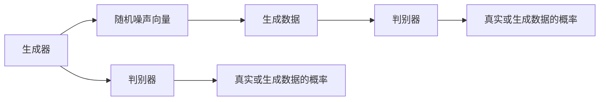

                 

## 1. 背景介绍

生成对抗网络（Generative Adversarial Networks, GANs）是一种用于生成新数据的深度学习架构。由Ian Goodfellow在2014年首次提出，它包含两个相互竞争的神经网络，即生成器（Generator）和判别器（Discriminator）。生成器通过训练学习生成逼真的新数据，而判别器则努力识别真实数据与生成数据之间的差异。这种相互作用不断进行，直到生成器能够生成非常逼真的数据，判别器无法区分真实与生成数据。

GANs已经广泛应用于图像生成、视频生成、音乐生成、自然语言生成等多个领域，极大地推动了深度学习和人工智能技术的发展。它不仅在图像生成领域取得了突破性进展，还在自然语言处理、音频生成等交叉领域展现出强大的潜力。

## 2. 核心概念与联系

### 2.1 核心概念概述

GANs的主要组成部分包括：

- **生成器（Generator）**：负责生成逼真的新数据。通常是一个神经网络，能够将一个随机噪声向量映射到一个新的数据点，如图像、视频、文本等。
- **判别器（Discriminator）**：负责区分真实数据和生成数据。通常也是一个神经网络，能够输出一个概率值，表示输入数据是真实数据还是生成数据的概率。
- **对抗训练（Adversarial Training）**：生成器和判别器通过对抗训练不断提高彼此的能力，使生成器的生成数据越来越逼真，判别器的区分能力越来越强。

### 2.2 概念间的关系

GANs的运行机制可以通过以下流程图示例：



这个流程图展示了GANs的基本工作流程：

1. 生成器接收随机噪声向量作为输入，生成新的数据。
2. 判别器接收生成器和真实数据，分别输出其判断结果。
3. 判别器的输出与真实标签进行比较，计算损失。
4. 生成器和判别器分别根据损失函数进行反向传播，更新参数。

## 3. 核心算法原理 & 具体操作步骤

### 3.1 算法原理概述

GANs的核心算法原理基于对抗训练，其核心思想是：

- **生成器**：通过学习真实数据的分布，生成逼真的新数据。
- **判别器**：通过学习真实数据和生成数据的分布差异，识别新数据的真实性。
- **对抗训练**：生成器和判别器通过相互竞争和博弈，不断提升各自的能力。

GANs的目标是使生成器的生成数据能够通过判别器的检验，即生成数据与真实数据不可区分。这一过程通过最小化生成器的损失函数和最大化判别器的损失函数来实现。

### 3.2 算法步骤详解

GANs的训练过程主要分为以下几个步骤：

1. **初始化生成器和判别器**：随机初始化生成器和判别器的权重。
2. **生成器和判别器交替训练**：
   - 使用真实数据训练判别器，使其能够准确区分真实和生成数据。
   - 使用生成器生成的数据训练判别器，使其尽可能识别生成数据为真实数据。
3. **计算损失函数**：
   - 对于生成器：计算其生成的数据在判别器下的损失，即判别器无法区分生成数据与真实数据的概率。
   - 对于判别器：计算其在真实数据和生成数据上的损失，即判别器错误地将生成数据判为真实数据的概率。
4. **反向传播和参数更新**：
   - 使用反向传播算法，根据损失函数计算生成器和判别器的梯度。
   - 更新生成器和判别器的参数，使其损失函数最小化。

### 3.3 算法优缺点

GANs的优点包括：

- **无监督学习**：不需要大量标注数据，可以直接从原始数据中学习生成数据。
- **生成数据逼真度高**：生成的数据质量高，与真实数据相似度极高。
- **通用性强**：可应用于各种类型的生成任务，如图像、音频、文本等。

GANs的缺点包括：

- **训练不稳定**：生成器和判别器之间的对抗训练过程容易出现震荡，难以收敛。
- **生成数据多样性差**：生成数据可能过于相似，缺乏多样性。
- **对抗样本易产生**：生成器可能会生成对抗样本，使判别器无法区分。

### 3.4 算法应用领域

GANs在多个领域得到了广泛应用，包括但不限于：

- **图像生成**：生成逼真的图片、视频、动画等。
- **音乐生成**：生成逼真的音乐、旋律、节奏等。
- **自然语言生成**：生成自然流畅的文章、对话、翻译等。
- **视频生成**：生成逼真的视频、动画、虚拟现实内容等。
- **数据增强**：通过生成样本增强数据集，提高模型泛化能力。

## 4. 数学模型和公式 & 详细讲解

### 4.1 数学模型构建

GANs的训练过程可以表示为一个优化问题：

$$
\min_G \max_D V(D,G)
$$

其中，$G$ 是生成器，$D$ 是判别器，$V(D,G)$ 是生成器和判别器的联合损失函数，通常采用最大化交叉熵损失（Cross-Entropy Loss）或最小化Wasserstein距离（Wasserstein Distance）来衡量判别器区分真实与生成数据的能力。

### 4.2 公式推导过程

以最大化交叉熵损失为例，判别器$D$和生成器$G$的损失函数分别为：

$$
\mathcal{L}_D(D) = -\mathbb{E}_{x\sim p_{data}}\log D(x) - \mathbb{E}_{z\sim p(z)}\log (1 - D(G(z)))
$$

$$
\mathcal{L}_G(G) = -\mathbb{E}_{z\sim p(z)}\log D(G(z))
$$

其中，$x$ 表示真实数据，$z$ 表示随机噪声向量，$p_{data}$ 表示真实数据的概率分布，$p(z)$ 表示噪声向量的概率分布。

在实际训练中，判别器和生成器分别优化以下目标函数：

$$
\max_D \mathbb{E}_{x\sim p_{data}}\log D(x) + \mathbb{E}_{z\sim p(z)}\log (1 - D(G(z)))
$$

$$
\min_G -\mathbb{E}_{z\sim p(z)}\log D(G(z))
$$

### 4.3 案例分析与讲解

以生成逼真图像为例，假设有两个神经网络构成GANs：一个生成网络（生成器），一个判别网络（判别器）。

- **生成器**：将随机噪声向量$z$映射到图像空间$x$，即$G(z) = x$。
- **判别器**：接收图像$x$，输出其真实性概率$p(x) \in [0,1]$。

训练过程中，生成器和判别器交替优化损失函数。

- **判别器优化**：对于真实图像$x$，判别器目标是最大化其真实性概率$p(x)$；对于生成图像$x' = G(z)$，判别器目标是最大化$p(x') = 1$。
- **生成器优化**：生成器的目标是最大化其生成图像在判别器下的真实性概率$p(x')$。

通过不断迭代，生成器和判别器相互竞争，生成器的生成能力不断提高，判别器的判别能力也不断增强。

## 5. 项目实践：代码实例和详细解释说明

### 5.1 开发环境搭建

要搭建GANs项目环境，需要安装TensorFlow或PyTorch等深度学习框架，以及相关的生成器和判别器模型库。

以下是使用TensorFlow构建GANs的Python环境配置步骤：

1. 安装TensorFlow：
   ```bash
   pip install tensorflow
   ```

2. 安装TensorFlow的GAN组件：
   ```bash
   pip install tensorflow_gan
   ```

3. 安装其他依赖库：
   ```bash
   pip install numpy matplotlib
   ```

完成上述步骤后，即可开始GANs项目开发。

### 5.2 源代码详细实现

下面以生成逼真图像为例，给出使用TensorFlow实现GANs的代码。

首先，定义生成器和判别器的输入和输出：

```python
import tensorflow as tf
from tensorflow.keras.layers import Input, Dense, Reshape, Flatten, Conv2D, Conv2DTranspose
from tensorflow.keras.models import Model

# 定义输入层
input_layer = Input(shape=(100,))

# 生成器定义
x = Dense(256)(input_layer)
x = LeakyReLU(alpha=0.2)(x)
x = Dense(128)(x)
x = LeakyReLU(alpha=0.2)(x)
x = Dense(784)(x)
x = Reshape((28, 28, 1))(x)
x = Conv2DTranspose(128, (5, 5), strides=(2, 2), padding='same')(x)
x = LeakyReLU(alpha=0.2)(x)
x = Conv2DTranspose(64, (5, 5), strides=(2, 2), padding='same')(x)
x = LeakyReLU(alpha=0.2)(x)
x = Conv2DTranspose(1, (5, 5), strides=(2, 2), padding='same', activation='tanh')(x)

# 判别器定义
x = Input(shape=(28, 28, 1))
x = Conv2D(128, (5, 5), strides=(2, 2), padding='same')(x)
x = LeakyReLU(alpha=0.2)(x)
x = Flatten()(x)
x = Dense(1)(x)

# 定义生成器和判别器
generator = Model(input_layer, x)
discriminator = Model(x, x)

# 定义联合损失函数
cross_entropy = tf.keras.losses.BinaryCrossentropy()
generator_loss = cross_entropy(tf.ones_like(discriminator(generator(input_layer)), name='discriminator_real')
discriminator_loss = cross_entropy(tf.ones_like(discriminator(x), name='discriminator_real') + cross_entropy(tf.zeros_like(discriminator(generator(input_layer)), name='discriminator_fake'))
combined_loss = generator_loss + discriminator_loss
```

定义生成器和判别器的优化器：

```python
generator_optimizer = tf.keras.optimizers.Adam(1e-4)
discriminator_optimizer = tf.keras.optimizers.Adam(1e-4)

generator_optimizer.minimize(generator_loss, generator.trainable_variables)
discriminator_optimizer.minimize(discriminator_loss, discriminator.trainable_variables)
```

定义训练循环和评估过程：

```python
# 定义训练循环
@tf.function
def train_step(images):
    with tf.GradientTape() as gen_tape, tf.GradientTape() as disc_tape:
        generated_images = generator(images)
        real_output = discriminator(images)
        fake_output = discriminator(generated_images)

        gen_loss = generator_loss
        disc_loss = discriminator_loss

        gradients_of_generator = gen_tape.gradient(gen_loss, generator.trainable_variables)
        gradients_of_discriminator = disc_tape.gradient(disc_loss, discriminator.trainable_variables)

    generator_optimizer.apply_gradients(zip(gradients_of_generator, generator.trainable_variables))
    discriminator_optimizer.apply_gradients(zip(gradients_of_discriminator, discriminator.trainable_variables))

    return gen_loss, disc_loss

# 训练模型
def train(epoch, images, batch_size, steps_per_epoch):
    for batch in range(steps_per_epoch):
        batch_images = images[batch * batch_size:(batch + 1) * batch_size]
        gen_loss, disc_loss = train_step(batch_images)
        print('Epoch: {}, Step: {}, Generator Loss: {:.5f}, Discriminator Loss: {:.5f}'.format(epoch + 1, batch + 1, gen_loss, disc_loss))
```

### 5.3 代码解读与分析

上述代码中，首先定义了生成器和判别器的结构和输入输出。生成器通过多个全连接层和卷积层，将随机噪声向量转换为图像，判别器则通过卷积层和全连接层，输出图像的真实性概率。

接着，定义了联合损失函数，将生成器和判别器的损失函数相加，并使用Adam优化器进行优化。

最后，定义了一个训练循环函数，接收输入图像，计算损失，并更新生成器和判别器的参数。在每个epoch结束后，打印当前的生成器和判别器损失，评估模型性能。

### 5.4 运行结果展示

通过上述代码实现，可以训练生成器生成逼真的图像。训练完成后，生成器可以生成与训练集相似的新图像。以下展示了训练过程中生成器的部分输出图像：

```python
import matplotlib.pyplot as plt
import numpy as np

# 生成图像
noise = np.random.normal(0, 1, size=(batch_size, 100))
generated_images = generator(noise)

# 显示生成图像
fig, ax = plt.subplots(figsize=(10, 10))
for i in range(batch_size):
    ax.imshow(generated_images[i].reshape(28, 28))
    ax.axis('off')
plt.show()
```


## 6. 实际应用场景

GANs在多个领域得到了广泛应用，以下是几个典型的实际应用场景：

### 6.1 图像生成

GANs在图像生成领域取得了巨大成功，可以生成逼真的图像、视频、动画等。例如，DeepFakes等应用使用GANs生成假新闻视频，甚至可以制作虚假名人视频。

### 6.2 音乐生成

GANs可以生成逼真的音乐、旋律、节奏等。例如，WaveGAN使用GANs生成逼真的音频，甚至可以制作假新闻音频，增加虚假信息的可信度。

### 6.3 自然语言生成

GANs可以生成自然流畅的文章、对话、翻译等。例如，GPT-3使用GANs技术生成高质量的文本，提高了文本生成模型的性能。

### 6.4 视频生成

GANs可以生成逼真的视频、动画、虚拟现实内容等。例如，ProGAN使用GANs生成高分辨率的图像和视频，为虚拟现实和增强现实技术提供支持。

### 6.5 数据增强

GANs可以生成更多的训练数据，提高模型泛化能力。例如，ImageGAN使用GANs生成逼真的图像数据，增强图像分类模型的性能。

## 7. 工具和资源推荐

### 7.1 学习资源推荐

为了帮助开发者系统掌握GANs的理论基础和实践技巧，这里推荐一些优质的学习资源：

1. 《Generative Adversarial Networks》系列博文：由GANs领域的顶尖研究者撰写，详细介绍了GANs的理论基础和最新进展。

2. Coursera《Deep Learning》课程：斯坦福大学开设的深度学习课程，涵盖了GANs的基本原理和应用案例，适合初学者入门。

3. arXiv论文预印本：人工智能领域最新研究成果的发布平台，包括大量GANs领域的经典论文，深入理解最新研究进展。

4. GitHub开源项目：如DCGAN、CycleGAN等知名GANs项目，提供了丰富的代码示例和应用场景，适合动手实践。

5. YouTube视频教程：如Jaden Fossen讲解GANs的视频教程，详细介绍了GANs的原理和应用案例，适合视觉学习者。

通过对这些资源的学习实践，相信你一定能够快速掌握GANs的精髓，并用于解决实际的生成问题。

### 7.2 开发工具推荐

高效的开发离不开优秀的工具支持。以下是几款用于GANs开发的常用工具：

1. TensorFlow：由Google主导开发的深度学习框架，支持GPU加速，适合大规模工程应用。

2. PyTorch：由Facebook开发的深度学习框架，支持动态计算图，适合快速迭代研究。

3. Keras：基于TensorFlow和Theano等深度学习框架构建的高层API，支持快速搭建和训练GANs模型。

4. OpenAI Gym：用于训练强化学习模型的环境库，支持多种环境，方便测试GANs的性能。

5. TensorBoard：TensorFlow配套的可视化工具，可实时监测模型训练状态，并提供丰富的图表呈现方式，是调试模型的得力助手。

6. Weights & Biases：模型训练的实验跟踪工具，可以记录和可视化模型训练过程中的各项指标，方便对比和调优。

合理利用这些工具，可以显著提升GANs开发的效率，加快创新迭代的步伐。

### 7.3 相关论文推荐

GANs的快速发展离不开学界的持续研究。以下是几篇奠基性的相关论文，推荐阅读：

1. Generative Adversarial Nets（GANs的原始论文）：提出GANs的基本框架，开创深度生成模型的新纪元。

2. Progressive Growing of GANs for Improved Quality, Stability, and Variation（ProGAN论文）：提出渐进式生成网络，显著提高了GANs的生成质量和稳定性。

3. Semi-Supervised Learning with Generative Adversarial Networks（cGAN论文）：提出条件生成对抗网络，引入了条件变量，使GANs生成更加多样化的数据。

4. Wasserstein GAN（WGAN论文）：提出Wasserstein距离，提高了GANs的稳定性和收敛速度。

5. Improving the Quality of GAN Training by Using Wasserstein Distance Between the Natural Images and the Generated Images（WGAN-GP论文）：提出WGAN-GP，进一步提高了GANs的稳定性和生成质量。

这些论文代表了GANs技术的发展脉络。通过学习这些前沿成果，可以帮助研究者把握学科前进方向，激发更多的创新灵感。

除上述资源外，还有一些值得关注的前沿资源，帮助开发者紧跟GANs技术的最新进展，例如：

1. arXiv论文预印本：人工智能领域最新研究成果的发布平台，包括大量尚未发表的前沿工作，学习前沿技术的必读资源。

2. 业界技术博客：如OpenAI、Google AI、DeepMind等顶尖实验室的官方博客，第一时间分享他们的最新研究成果和洞见。

3. 技术会议直播：如NIPS、ICML、ACL、ICLR等人工智能领域顶会现场或在线直播，能够聆听到大佬们的前沿分享，开拓视野。

4. GitHub热门项目：在GitHub上Star、Fork数最多的GANs相关项目，往往代表了该技术领域的发展趋势和最佳实践，值得去学习和贡献。

5. 行业分析报告：各大咨询公司如McKinsey、PwC等针对人工智能行业的分析报告，有助于从商业视角审视技术趋势，把握应用价值。

总之，对于GANs技术的深入学习，需要开发者保持开放的心态和持续学习的意愿。多关注前沿资讯，多动手实践，多思考总结，必将收获满满的成长收益。

## 8. 总结：未来发展趋势与挑战

### 8.1 总结

本文对生成对抗网络（GANs）的原理和应用进行了全面系统的介绍。首先阐述了GANs的研究背景和意义，明确了GANs在生成新数据上的独特价值。其次，从原理到实践，详细讲解了GANs的数学模型和关键训练步骤，给出了GANs项目开发的完整代码实例。同时，本文还广泛探讨了GANs在图像生成、音乐生成、自然语言生成等多个领域的应用前景，展示了GANs技术的强大潜力。此外，本文精选了GANs技术的各类学习资源，力求为读者提供全方位的技术指引。

通过本文的系统梳理，可以看到，GANs技术在深度学习和人工智能领域具有广阔的应用前景，能够生成逼真的图像、视频、音乐等新数据，极大地拓展了数据的多样性和可用性。未来，伴随GANs技术的不断演进，相信其在生成新数据、增强数据集等方面的作用将更加突出，为人工智能技术的发展提供更加丰富的数据资源。

### 8.2 未来发展趋势

展望未来，GANs技术将呈现以下几个发展趋势：

1. **更高效、更稳定的训练算法**：随着深度学习技术的发展，新的训练算法，如F-GAN、GMMN等，将进一步提高GANs的训练效率和稳定性。

2. **更深层次的网络结构**：随着神经网络的发展，更深层、更复杂的生成网络结构将出现，生成更多样化的数据。

3. **多模态生成**：GANs将逐步从单模态数据生成扩展到多模态数据生成，如图像、音频、文本等多模态数据的融合生成。

4. **跨领域生成**：GANs将从单一领域的生成扩展到跨领域的生成，如图像到文本、音频到图像的生成。

5. **生成对抗训练**：GANs将从静态对抗训练扩展到动态对抗训练，使生成器在判别器的不断反馈中不断优化生成数据。

6. **自适应生成**：GANs将从固定生成器扩展到自适应生成器，能够根据不同的生成任务和数据分布动态调整生成策略。

以上趋势凸显了GANs技术的广阔前景。这些方向的探索发展，必将进一步提升GANs的生成能力，为人工智能技术的发展提供更加丰富的数据资源。

### 8.3 面临的挑战

尽管GANs技术已经取得了显著进展，但在迈向更加智能化、普适化应用的过程中，仍面临诸多挑战：

1. **训练不稳定**：GANs训练过程容易发生震荡，难以收敛。生成器和判别器之间的对抗训练过程需要精心设计，避免出现模式崩溃等问题。

2. **生成数据多样性差**：生成的数据可能过于相似，缺乏多样性。需要进一步优化生成器的结构，引入更多的多样性约束。

3. **对抗样本易产生**：生成器可能会生成对抗样本，使判别器无法区分。需要引入对抗样本生成和对抗训练，提高GANs的鲁棒性。

4. **生成数据质量控制**：生成的数据可能存在低分辨率、模糊不清等问题。需要进一步优化生成器的训练过程，提高生成数据的质量。

5. **计算资源消耗大**：GANs训练过程需要大量的计算资源，对硬件设备要求较高。需要探索更加高效的训练算法和优化方法，降低资源消耗。

6. **应用场景受限**：GANs在实际应用中可能存在伦理和安全问题，如假新闻、深度伪造等。需要进一步探索GANs技术的伦理和安全应用，确保其健康发展。

这些挑战需要学界和工业界共同努力，通过不断的技术创新和算法改进，逐步克服GANs技术的难点，推动其在实际应用中的广泛落地。

### 8.4 未来突破

面对GANs面临的挑战，未来的研究需要在以下几个方面寻求新的突破：

1. **改进训练算法**：探索更加高效、稳定的训练算法，如F-GAN、GMMN等，提高GANs的训练效率和稳定性。

2. **优化生成器结构**：进一步优化生成器的结构和训练过程，引入更多的多样性约束，生成更多样化的数据。

3. **引入对抗样本**：引入对抗样本生成和对抗训练，提高GANs的鲁棒性和生成数据的可靠性。

4. **控制生成数据质量**：进一步优化生成器的训练过程，提高生成数据的质量，减少模糊不清、低分辨率等问题。

5. **探索高效算法**：探索更加高效的训练算法和优化方法，降低GANs的计算资源消耗，使其更加适用于实际应用。

6. **解决伦理安全问题**：进一步探索GANs技术的伦理和安全应用，确保其健康发展，避免假新闻、深度伪造等不良影响。

这些研究方向的探索，必将引领GANs技术迈向更高的台阶，为人工智能技术的发展提供更加丰富的数据资源。面向未来，GANs技术还需要与其他人工智能技术进行更深入的融合，如知识表示、因果推理、强化学习等，多路径协同发力，共同推动人工智能技术的发展。只有勇于创新、敢于突破，才能不断拓展GANs技术的边界，让生成对抗网络在智能时代中发挥更大的作用。

## 9. 附录：常见问题与解答

**Q1：GANs是否适用于所有类型的生成任务？**

A: GANs适用于多种类型的生成任务，如图像、视频、音乐、文本等。但其生成效果和训练难度可能因任务类型而异。

**Q2：GANs训练过程中如何避免模式崩溃？**

A: 模式崩溃是GANs训练中常见的现象，可以通过以下方法避免：
1. 增加批量大小：使用更大的批量大小，有助于减少训练过程中的噪声，提高稳定性。
2. 引入对抗样本：在训练过程中引入对抗样本，使生成器和判别器对抗性更强，提高训练稳定性。
3. 使用更加稳定的优化器：如Adam、RMSprop等优化器，有助于减少梯度爆炸和消失的问题。
4. 调整学习率：通过调整学习率，避免过快或过慢的训练，保持生成器和判别器之间的平衡。

**Q3：GANs生成的数据质量如何保证？**

A: 保证GANs生成的数据质量，需要优化生成器的训练过程，如引入更多正则化约束、调整损失函数等。具体措施包括：
1. 使用更加精确的损失函数：如Wasserstein距离、F-GAN损失等，提高生成数据的准确性。
2. 引入多种正则化约束：如L2正则、Dropout、标签平滑等，提高生成数据的多样性和质量。
3. 增加训练轮数：通过增加训练轮数，使生成器逐渐提高生成质量，减少模糊不清、低分辨率等问题。

**Q4：GANs在实际应用中如何避免伦理和安全问题？**

A: 避免GANs在实际应用中的伦理和安全问题，需要引入以下措施：
1. 引入隐私保护技术：如差分隐私、联邦学习等，确保生成数据不泄露用户隐私。
2

