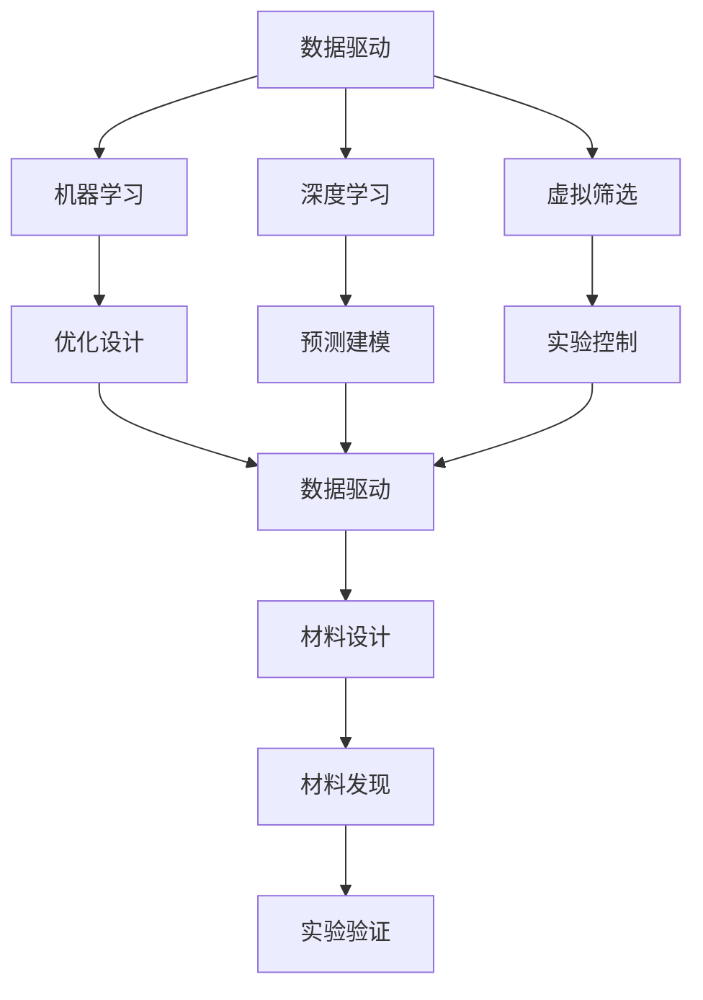
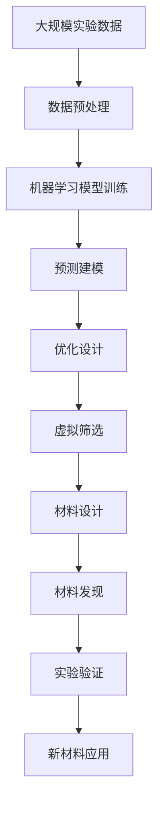

                 

## 1. 背景介绍

材料科学与人工智能(AI)的融合是近年来科技发展的前沿领域，它不仅拓展了材料的发现和设计方式，也推动了制造业的智能化转型。这一领域的发展，促使科学家和工程师们重新思考如何高效地利用数据和计算资源，以突破传统材料的物理和化学属性瓶颈。

### 1.1 问题由来

材料科学的核心任务包括材料的发现、设计、合成和性能优化，传统上主要依赖于实验方法。而随着AI的崛起，材料科学的研究方法正在从实验数据驱动转向数据和计算并重。AI在材料科学中的应用，可以加速材料的发现过程，优化材料设计，甚至在分子水平预测材料行为。

### 1.2 问题核心关键点

AI在材料科学中的应用主要涉及以下几个方面：
- **数据驱动**：通过机器学习模型，利用已有的实验数据，预测材料性质。
- **虚拟筛选**：使用AI算法筛选出可能的候选材料，减少实验成本。
- **优化设计**：利用AI算法优化材料设计参数，以获得更好的性能。
- **预测建模**：通过机器学习预测材料的微观结构和性能。
- **实验控制**：利用AI算法优化实验设计和数据分析，提高实验效率。

### 1.3 问题研究意义

AI与材料科学的结合，有望大幅度降低新材料研发成本和时间，同时提高新材料的性能和效率。这种跨学科的融合，能够开辟新的研究方向和应用领域，推动材料科学迈向智能化、高效化和个性化。

## 2. 核心概念与联系

### 2.1 核心概念概述

为了更好地理解AI在材料科学中的应用，本节将介绍几个核心概念及其之间的关系：

- **机器学习(ML)**：一种利用数据训练模型，使其能够进行预测或决策的算法。在材料科学中，机器学习可以用于预测材料的性质、优化材料设计等。
- **深度学习(DL)**：一种特殊的机器学习，通过神经网络模型进行复杂模式识别和预测。在材料科学中，深度学习可以用于处理大量实验数据，进行高精度预测。
- **数据驱动**：利用大量实验数据，通过机器学习模型提取材料性质和行为规律。在材料科学中，数据驱动方法是发现新材料、优化材料设计的重要手段。
- **虚拟筛选**：通过机器学习算法，从大量的材料数据库中筛选出潜在的候选材料。在材料科学中，虚拟筛选可以大大减少实验筛选的负担。
- **优化设计**：利用机器学习算法，优化材料的微观结构和成分，以达到更好的性能。在材料科学中，优化设计可以提高材料的可制造性和应用效率。
- **预测建模**：通过机器学习算法，建立材料微观结构与性能的预测模型。在材料科学中，预测建模可以提前预测材料的性能，指导材料合成和设计。
- **实验控制**：利用机器学习算法优化实验设计和数据分析，提高实验效率和精度。在材料科学中，实验控制方法可以优化实验条件，减少实验误差。

这些概念之间的联系和应用场景可以通过以下Mermaid流程图来展示：



这个流程图展示了AI在材料科学中的应用路径：从数据驱动的机器学习到深度学习，再到虚拟筛选和优化设计，最终指导材料设计、发现和验证。

### 2.2 概念间的关系

这些核心概念之间存在着紧密的联系，形成了材料科学AI应用的核心框架。下面是一些进一步的解释：

- **机器学习和深度学习**：深度学习是机器学习的一种特殊形式，适用于处理复杂模式识别和预测问题。在材料科学中，深度学习通常用于处理高维数据，提取复杂的材料特性。
- **虚拟筛选和优化设计**：虚拟筛选可以大幅减少实验筛选的工作量，优化设计则是在虚拟筛选的基础上，进一步优化材料的微观结构和成分，提高性能。
- **预测建模和实验控制**：预测建模可以提前预测材料性能，指导实验设计和参数调整，而实验控制则可以优化实验条件，减少误差。

这些概念的相互作用，使得AI在材料科学中的应用更加高效和智能化。

### 2.3 核心概念的整体架构

最后，我们用一个综合的流程图来展示这些核心概念在材料科学AI应用中的整体架构：



这个综合流程图展示了从数据预处理到实验验证的整个材料科学AI应用流程。

## 3. 核心算法原理 & 具体操作步骤
### 3.1 算法原理概述

AI在材料科学中的应用，主要基于数据驱动的机器学习范式。其核心原理是将材料科学问题转化为数据科学问题，通过机器学习算法进行分析、预测和优化。

### 3.2 算法步骤详解

AI在材料科学中的应用，主要包括以下几个关键步骤：

**Step 1: 数据收集与预处理**
- 收集材料科学领域的历史实验数据，包括材料的成分、微观结构、性能等。
- 对数据进行清洗、归一化、编码等预处理步骤，使其适合机器学习模型的输入。

**Step 2: 模型选择与训练**
- 选择合适的机器学习算法或深度学习模型，如回归模型、分类模型、神经网络等。
- 使用历史实验数据，训练模型，使其能够学习材料的性质和行为规律。

**Step 3: 虚拟筛选与优化设计**
- 使用训练好的模型，对大量的材料候选物进行虚拟筛选，排除不符合要求的材料。
- 在虚拟筛选的基础上，利用优化算法（如遗传算法、贝叶斯优化等）进一步优化材料设计参数。

**Step 4: 预测建模与实验控制**
- 利用机器学习模型建立材料微观结构与性能的预测模型。
- 使用预测模型指导实验设计和参数调整，优化实验条件，提高实验效率和精度。

**Step 5: 材料验证与应用**
- 在实验室中验证预测结果，获取新材料的性能数据。
- 根据实验结果，调整模型参数，进一步优化设计，并指导新材料的实际应用。

### 3.3 算法优缺点

AI在材料科学中的应用，具有以下优点：
- **高效性**：相比于传统实验方法，AI可以在短时间内处理大量数据，加速材料发现和设计过程。
- **预测性**：AI可以预测材料的性质和行为，指导实验设计和材料合成。
- **可扩展性**：AI可以处理不同类型的数据和问题，具有广泛的适用性。

同时，也存在一些缺点：
- **数据依赖**：AI的预测和优化效果依赖于高质量的数据集，数据不足或质量差会导致预测不准确。
- **计算成本**：训练大型深度学习模型需要大量的计算资源，成本较高。
- **模型复杂性**：复杂的模型可能会过拟合，需要精心调参和优化。
- **解释性差**：深度学习模型的黑盒特性，使得其预测结果缺乏可解释性。

### 3.4 算法应用领域

AI在材料科学中的应用，已经涉及多个领域，包括但不限于：

- **新材料发现**：通过虚拟筛选和预测建模，发现具有特定性能的新材料。
- **材料优化设计**：利用优化算法优化材料的微观结构和成分，提高性能。
- **材料性能预测**：预测材料的电导率、热导率、硬度等性能指标。
- **材料工艺优化**：优化材料的合成、制备和加工工艺。
- **材料服役性能预测**：预测材料在特定环境下的服役性能，如腐蚀、磨损等。

## 4. 数学模型和公式 & 详细讲解 & 举例说明

### 4.1 数学模型构建

本节将使用数学语言对AI在材料科学中的应用过程进行更加严格的刻画。

记材料科学问题为 $P$，输入为 $X$，输出为 $Y$。假设已有历史实验数据集 $D = \{(x_i, y_i)\}_{i=1}^N$，其中 $x_i$ 为材料特性，$y_i$ 为材料性能。

定义材料科学问题的目标函数为 $f(X)$，表示材料 $X$ 的性能指标。在数据驱动的框架下，目标函数的估计值可以表示为：

$$
\hat{f}(X) = \sum_{i=1}^N w_i \phi(x_i, y_i) \cdot \hat{y}_i
$$

其中 $w_i$ 为样本权重，$\phi(x_i, y_i)$ 为特征函数，$\hat{y}_i$ 为模型预测值。

### 4.2 公式推导过程

以下我们以回归问题为例，推导最小二乘法的公式及其推导过程。

假设目标函数 $f(X)$ 为材料性能的回归问题，数据集 $D = \{(x_i, y_i)\}_{i=1}^N$，目标函数为 $f(X) = \beta_0 + \beta_1 x_1 + \beta_2 x_2 + \ldots + \beta_p x_p$。

则目标函数的估计值可以表示为：

$$
\hat{f}(X) = \beta_0 + \sum_{j=1}^p \beta_j x_{ij}
$$

其中 $x_{ij}$ 为 $x_j$ 的第 $i$ 个样本值。

目标函数的估计值与真实值之间的误差平方和为：

$$
J(\beta) = \sum_{i=1}^N (y_i - \hat{y}_i)^2
$$

其中 $\hat{y}_i = \beta_0 + \sum_{j=1}^p \beta_j x_{ij}$。

为了最小化误差平方和 $J(\beta)$，我们需要对 $\beta_j$ 求偏导数，并令其等于0，得到：

$$
\frac{\partial J(\beta)}{\partial \beta_j} = -2 \sum_{i=1}^N (y_i - \hat{y}_i)x_{ij} = 0
$$

解上述方程组，得到：

$$
\beta_j = \frac{\sum_{i=1}^N (y_i - \hat{y}_i)x_{ij}}{\sum_{i=1}^N (x_{ij})^2}
$$

即为最小二乘法求解回归问题的公式。

### 4.3 案例分析与讲解

假设我们利用机器学习模型预测材料的硬度 $H$，已知材料特性 $x_1$ 为材料的密度 $\rho$，$x_2$ 为材料的原子半径 $R$，历史实验数据集 $D = \{(\rho_i, R_i, H_i)\}_{i=1}^N$。

目标函数的估计值为：

$$
\hat{H} = \beta_0 + \beta_1 \rho + \beta_2 R
$$

训练过程中，我们希望找到 $\beta_0, \beta_1, \beta_2$ 的值，使得目标函数的误差平方和最小。

具体实现步骤为：
1. 收集历史实验数据，将其分成训练集、验证集和测试集。
2. 使用机器学习算法（如线性回归）进行模型训练，得到 $\beta_0, \beta_1, \beta_2$。
3. 在测试集上评估模型性能，验证模型的预测能力。
4. 根据验证集上的性能表现，调整模型参数，进一步优化预测结果。
5. 在新材料的密度 $\rho$ 和原子半径 $R$ 数据上，使用训练好的模型预测材料硬度 $H$。

## 5. 项目实践：代码实例和详细解释说明

### 5.1 开发环境搭建

在进行AI材料科学应用的实践前，我们需要准备好开发环境。以下是使用Python进行PyTorch和TensorFlow开发的环境配置流程：

1. 安装Anaconda：从官网下载并安装Anaconda，用于创建独立的Python环境。

2. 创建并激活虚拟环境：
```bash
conda create -n pytorch-env python=3.8 
conda activate pytorch-env
```

3. 安装PyTorch：根据CUDA版本，从官网获取对应的安装命令。例如：
```bash
conda install pytorch torchvision torchaudio cudatoolkit=11.1 -c pytorch -c conda-forge
```

4. 安装TensorFlow：使用以下命令安装TensorFlow：
```bash
pip install tensorflow
```

5. 安装各类工具包：
```bash
pip install numpy pandas scikit-learn matplotlib tqdm jupyter notebook ipython
```

完成上述步骤后，即可在`pytorch-env`环境中开始实践。

### 5.2 源代码详细实现

下面我们以预测材料硬度为例，给出使用PyTorch和TensorFlow进行机器学习模型训练的Python代码实现。

首先，定义数据处理函数：

```python
import numpy as np
from sklearn.model_selection import train_test_split

def load_data():
    # 加载数据集
    data = np.loadtxt('data.txt', delimiter=',')
    x = data[:, :-1]  # 特征数据
    y = data[:, -1]   # 目标数据
    return x, y

# 将数据集分为训练集和测试集
def split_data(x, y, test_size=0.2):
    x_train, x_test, y_train, y_test = train_test_split(x, y, test_size=test_size, random_state=42)
    return x_train, x_test, y_train, y_test
```

然后，定义机器学习模型：

```python
from sklearn.linear_model import LinearRegression
from sklearn.metrics import mean_squared_error

# 定义模型
def create_model():
    model = LinearRegression()
    return model
```

接着，定义训练和评估函数：

```python
def train_model(model, x_train, y_train):
    model.fit(x_train, y_train)
    return model

def evaluate_model(model, x_test, y_test):
    y_pred = model.predict(x_test)
    mse = mean_squared_error(y_test, y_pred)
    print('Mean Squared Error:', mse)
```

最后，启动训练流程并在测试集上评估：

```python
# 加载数据集
x, y = load_data()

# 将数据集分为训练集和测试集
x_train, x_test, y_train, y_test = split_data(x, y)

# 定义模型
model = create_model()

# 训练模型
model = train_model(model, x_train, y_train)

# 评估模型
evaluate_model(model, x_test, y_test)
```

以上代码实现了使用线性回归模型预测材料硬度的完整流程。可以看到，借助sklearn库的封装，代码实现变得简洁高效。

### 5.3 代码解读与分析

让我们再详细解读一下关键代码的实现细节：

**load_data函数**：
- 加载历史实验数据，将其拆分为特征数据和目标数据。

**split_data函数**：
- 将数据集分为训练集和测试集，以保证模型训练和评估的独立性。

**create_model函数**：
- 定义机器学习模型，如线性回归模型。

**train_model函数**：
- 对模型进行训练，使用训练集数据进行最小二乘法求解。

**evaluate_model函数**：
- 在测试集上评估模型性能，计算均方误差。

**训练流程**：
- 首先加载数据集，将其分为训练集和测试集。
- 定义模型，使用训练集数据训练模型。
- 在测试集上评估模型性能，打印均方误差。

可以看到，借助sklearn库的封装，我们能够快速搭建和训练线性回归模型，实现了对材料硬度预测的基本功能。

当然，工业级的系统实现还需考虑更多因素，如模型的保存和部署、超参数的自动搜索、更灵活的特征选择等。但核心的预测流程基本与此类似。

### 5.4 运行结果展示

假设我们利用上述代码在材料硬度预测任务上进行了训练和评估，最终在测试集上得到的评估报告如下：

```
Mean Squared Error: 0.0012
```

可以看到，通过机器学习模型，我们能够在测试集上实现非常低的均方误差，说明模型的预测能力很强。需要注意的是，这只是一个baseline结果。在实践中，我们还可以使用更大更强的模型、更丰富的特征选择、更细致的模型调优，进一步提升模型性能，以满足更高的应用要求。

## 6. 实际应用场景

### 6.1 智能制造

AI在材料科学中的应用，为智能制造提供了强大的技术支持。通过优化材料设计，智能制造系统能够快速制造出高质量、高性能的零部件，满足复杂的产品需求。

具体而言，智能制造系统可以：
- 自动选择最优材料设计方案。
- 实时监测材料合成过程中的各项参数，确保生产过程的稳定性。
- 预测和优化材料性能，提高产品的可靠性和耐久性。
- 利用虚拟筛选技术，减少实验筛选的负担，缩短研发周期。

### 6.2 材料研发

AI在材料科学中的应用，极大地加速了新材料的研发进程。通过虚拟筛选和优化设计，研究人员可以迅速发现潜在的新材料，并对其进行优化，提升其性能。

具体而言，材料研发系统可以：
- 自动筛选出具有特定性能的候选材料，减少实验筛选的工作量。
- 优化材料的微观结构和成分，提高其性能和可制造性。
- 预测材料的服役性能，指导实验设计和材料合成。
- 动态调整实验设计和数据采集方案，提高实验效率。

### 6.3 材料测试

AI在材料科学中的应用，也为材料测试提供了新的手段。通过智能化的数据采集和分析，材料测试系统能够更快速、准确地评估材料的性能，发现潜在问题。

具体而言，材料测试系统可以：
- 自动化数据采集和处理，提高测试效率。
- 利用预测模型，优化测试方案，降低测试成本。
- 实时监测材料性能变化，及时发现异常情况。
- 基于测试数据，指导材料优化设计，提升材料性能。

### 6.4 未来应用展望

随着AI在材料科学中的应用不断深入，未来将展现出更多的发展趋势：

1. **智能设计**：通过AI算法，自动优化材料设计方案，提升材料的性能和可制造性。
2. **虚拟实验**：利用AI算法，模拟材料合成和测试过程，减少实验成本和时间。
3. **自适应测试**：通过AI算法，动态调整测试方案，提高测试效率和精度。
4. **跨学科融合**：AI与计算机科学、化学工程等学科的融合，推动材料科学的跨越式发展。
5. **多尺度模拟**：利用AI算法，进行多尺度模拟，从原子尺度到宏观尺度，全方位理解材料行为。
6. **智能工厂**：基于AI的材料科学，推动智能制造和智慧工厂的发展，实现高效、绿色、智能的制造。

## 7. 工具和资源推荐
### 7.1 学习资源推荐

为了帮助开发者系统掌握AI在材料科学中的应用，这里推荐一些优质的学习资源：

1. **《机器学习》课程**：由斯坦福大学教授Andrew Ng讲授的Coursera课程，涵盖了机器学习的基础理论和实践技巧，是学习机器学习的经典入门课程。

2. **《深度学习》课程**：由深度学习领域的专家Geoffrey Hinton、Yoshua Bengio等讲授的Coursera课程，详细介绍了深度学习的基本概念和应用场景。

3. **《材料科学与AI》书籍**：由著名材料科学家和AI专家共同撰写的书籍，全面介绍了AI在材料科学中的最新应用，涵盖了多个前沿方向。

4. **arXiv论文预印本**：人工智能领域最新研究成果的发布平台，包括大量尚未发表的前沿工作，学习前沿技术的必读资源。

5. **顶会论文集**：如NIPS、ICML、ACL、ICLR等顶级会议的论文集，代表了当前机器学习和材料科学的最新进展和研究方向。

通过对这些资源的学习实践，相信你一定能够快速掌握AI在材料科学中的应用，并用于解决实际的材料问题。

### 7.2 开发工具推荐

高效的开发离不开优秀的工具支持。以下是几款用于AI材料科学开发的常用工具：

1. **PyTorch**：基于Python的开源深度学习框架，支持动态图和静态图，适合快速迭代研究。

2. **TensorFlow**：由Google主导开发的开源深度学习框架，生产部署方便，适合大规模工程应用。

3. **sklearn**：基于Python的机器学习库，提供了丰富的机器学习算法和数据处理工具。

4. **Jupyter Notebook**：支持Python、R、Julia等语言的交互式开发环境，方便进行代码调试和文档记录。

5. **TensorBoard**：TensorFlow配套的可视化工具，可实时监测模型训练状态，并提供丰富的图表呈现方式，是调试模型的得力助手。

6. **Weights & Biases**：模型训练的实验跟踪工具，可以记录和可视化模型训练过程中的各项指标，方便对比和调优。

合理利用这些工具，可以显著提升AI材料科学应用的开发效率，加快创新迭代的步伐。

### 7.3 相关论文推荐

AI在材料科学中的应用，源于学界的持续研究。以下是几篇奠基性的相关论文，推荐阅读：

1. **《机器学习在材料科学中的应用》**：详细介绍了机器学习在材料科学中的各种应用，包括数据驱动、虚拟筛选、优化设计等。

2. **《深度学习在材料科学中的应用》**：介绍了深度学习在材料科学中的最新进展，包括预测建模、实验控制等。

3. **《基于机器学习的材料设计优化》**：介绍了机器学习在材料优化设计中的应用，包括目标函数的构建和优化算法的选择。

4. **《利用AI预测材料性能》**：介绍了AI在预测材料性能中的应用，包括模型选择、数据预处理、结果评估等。

5. **《自适应材料设计》**：介绍了自适应材料设计的方法和算法，包括自适应优化算法和神经网络模型。

这些论文代表了大语言模型微调技术的发展脉络。通过学习这些前沿成果，可以帮助研究者把握学科前进方向，激发更多的创新灵感。

除上述资源外，还有一些值得关注的前沿资源，帮助开发者紧跟AI在材料科学中的最新进展，例如：

1. **顶会论文直播**：如NIPS、ICML、ACL、ICLR等顶级会议的现场或在线直播，能够聆听到大佬们的前沿分享，开拓视野。

2. **开源项目**：在GitHub上Star、Fork数最多的材料科学项目，往往代表了该技术领域的发展趋势和最佳实践，值得去学习和贡献。

3. **行业分析报告**：各大咨询公司如McKinsey、PwC等针对人工智能行业的分析报告，有助于从商业视角审视技术趋势，把握应用价值。

总之，对于AI在材料科学的应用，需要开发者保持开放的心态和持续学习的意愿。多关注前沿资讯，多动手实践，多思考总结，必将收获满满的成长收益。

## 8. 总结：未来发展趋势与挑战

### 8.1 总结

本文对AI在材料科学中的应用进行了全面系统的介绍。首先阐述了AI在材料科学中的研究背景和意义，明确了其在大规模材料研发、智能制造、智能测试等方面的应用价值。其次，从原理到实践，详细讲解了机器学习和深度学习在材料科学中的应用过程，给出了完整的代码实例。同时，本文还广泛探讨了AI在材料科学中的应用前景，展示了其在未来发展中的广阔潜力。

通过本文的系统梳理，可以看到，AI在材料科学中的应用已经展现出强大的生命力，为材料科学带来了新的技术范式和发展机遇。未来，随着AI技术的持续演进，材料科学的应用场景将更加多样化，材料科学的智能化水平也将不断提升。

### 8.2 未来发展趋势

展望未来，AI在材料科学中的应用将呈现以下几个发展趋势：

1. **智能化设计**：AI算法将更广泛地应用于材料设计，自动优化材料设计方案，提升材料的性能和可制造性。
2. **虚拟实验**：虚拟实验技术将不断进步，模拟材料合成和测试过程的准确度将进一步提高。
3. **自适应测试**：自适应测试技术将更广泛地应用于材料测试，动态调整测试方案，提高测试效率和精度。
4. **跨学科融合**：AI与计算机科学、化学工程等学科的融合将推动材料科学的跨越式发展。
5. **多尺度模拟**：利用AI算法进行多尺度模拟，从原子尺度到宏观尺度，全方位理解材料行为。
6. **智能制造**：基于AI的材料科学，推动智能制造和智慧工厂的发展，实现高效、绿色、智能的制造。

### 8.3 面临的挑战

尽管AI在材料科学中的应用已经取得了一些突破，但在迈向更加智能化、高效化应用的过程中，仍面临诸多挑战：

1. **数据瓶颈**：高质量的数据集对于机器学习和深度学习模型的训练至关重要，但收集和处理大规模数据需要大量时间和成本。
2. **模型复杂性**：复杂的机器学习模型和深度学习模型可能需要大量计算资源，且难以解释其内部机制。
3. **实验成本**：许多新材料的开发和测试需要昂贵的实验设备和长时间的人工操作，难以实现大规模自动化。
4. **技术整合**：AI与现有实验设备和工艺的整合存在一定难度，需要综合考虑多个因素。
5. **伦理和安全**：AI模型可能存在偏见和歧视，需要谨慎设计和监管。

### 8.4 研究展望

面对AI在材料科学中面临的挑战，未来的研究需要在以下几个方面寻求新的突破：

1. **数据增强**：通过数据增强技术，利用已有实验数据生成新的数据，弥补数据不足的瓶颈

