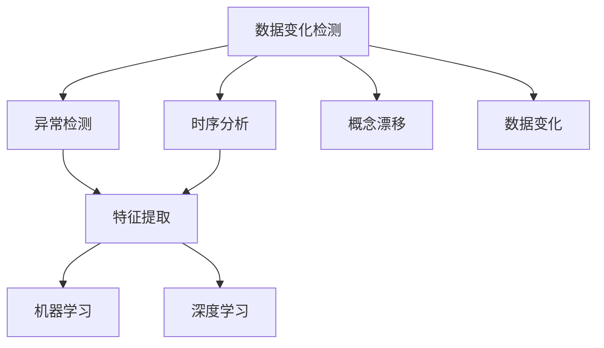
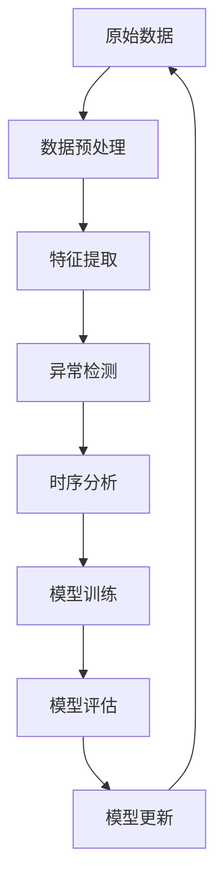

                 

# 概念漂移与数据变化检测原理与代码实战案例讲解

> 关键词：概念漂移, 数据变化检测, 异常检测, 时序分析, 特征提取, 机器学习, 深度学习, 代码实现

## 1. 背景介绍

### 1.1 问题由来
在数据驱动的机器学习应用中，数据的变化是常态。无论是数据分布的改变，还是数据生成机制的变更，都可能导致模型性能的下降，甚至失效。这类问题被称为概念漂移(Concept Drift)或数据变化(Data Change)。例如，信用评分模型在某个时间段内，由于市场利率的变化，其分布发生了偏移，导致模型的预测结果与真实情况产生偏差。另外，随着用户兴趣的变化，推荐系统也可能需要重新训练，才能提供更合适的推荐结果。因此，如何及时发现并应对数据变化，是保持机器学习模型持续有效的关键。

### 1.2 问题核心关键点
概念漂移与数据变化检测是机器学习中的核心问题。其关键点包括：
1. **识别数据分布的偏移**：通过统计特征和模型参数的变化，识别数据分布的改变。
2. **适应数据变化**：更新模型参数或重新训练，以适应数据分布的变化。
3. **实时监控与响应**：实现对数据变化的实时监控，并在变化发生时及时响应。

概念漂移与数据变化检测技术广泛应用于金融、零售、医疗、推荐系统等领域，对业务决策和系统维护具有重要意义。

### 1.3 问题研究意义
研究概念漂移与数据变化检测，对提升机器学习模型的鲁棒性和可靠性，保障业务决策的科学性和及时性，具有重要意义：

1. **减少业务风险**：及时发现数据变化，避免模型预测错误，减少业务损失。
2. **提高模型效率**：通过模型参数更新和重新训练，优化模型性能，提高决策精度。
3. **降低开发成本**：减少人工监控和干预，自动更新模型，降低业务维护成本。
4. **增强系统韧性**：应对数据变化，提升系统的鲁棒性和可靠性，确保业务连续性。
5. **推动技术创新**：激发新的研究方向和方法，如自适应学习、迁移学习等，推动机器学习技术的不断进步。

## 2. 核心概念与联系

### 2.1 核心概念概述

为更好地理解概念漂移与数据变化检测，我们首先需要介绍几个密切相关的核心概念：

- **概念漂移(Concept Drift)**：指数据分布随时间或环境变化而产生偏移，导致模型性能下降。
- **数据变化(Data Change)**：指数据生成机制或分布随时间或环境变化而产生变化，需要更新模型以适应新数据。
- **异常检测(Anomaly Detection)**：指识别数据中的异常点，以识别数据变化或异常情况。
- **时序分析(Time Series Analysis)**：指对时间序列数据进行建模和分析，识别数据变化规律。
- **特征提取(Feature Extraction)**：指从原始数据中提取有意义的特征，以提高模型性能。
- **机器学习(Machine Learning)**：指利用统计学方法，从数据中学习模型，并应用于新数据。
- **深度学习(Deep Learning)**：指使用多层神经网络进行特征学习，提升模型性能。

这些核心概念之间的逻辑关系可以通过以下Mermaid流程图来展示：



这个流程图展示了大语言模型微调过程中各个核心概念的关系：

1. 数据变化检测涉及数据变化识别和异常检测。
2. 时序分析从时间序列数据中识别数据变化规律。
3. 特征提取从原始数据中提取有意义的特征。
4. 机器学习从特征中学习模型，提升模型性能。
5. 深度学习利用多层神经网络进行特征学习，提升模型性能。

这些概念共同构成了数据变化检测的核心框架，帮助我们及时识别和应对数据变化，保障模型的持续有效性。

### 2.2 概念间的关系

这些核心概念之间存在着紧密的联系，形成了数据变化检测的完整生态系统。下面我们通过几个Mermaid流程图来展示这些概念之间的关系。

#### 2.2.1 数据变化检测的基本流程


这个流程图展示了数据变化检测的基本流程：

1. 收集原始数据，并进行预处理。
2. 提取特征，构建模型。
3. 训练模型，进行评估。
4. 根据评估结果，更新模型。
5. 将更新后的模型用于业务决策。

#### 2.2.2 特征提取与模型训练的关系


这个流程图展示了特征提取与模型训练的关系：

1. 提取特征，构建模型。
2. 训练模型，进行评估。
3. 根据评估结果，优化模型。
4. 更新模型，用于业务决策。

#### 2.2.3 异常检测与模型训练的关系


这个流程图展示了异常检测与模型训练的关系：

1. 检测异常，构建模型。
2. 训练模型，进行评估。
3. 根据评估结果，优化模型。
4. 更新模型，用于业务决策。

### 2.3 核心概念的整体架构

最后，我们用一个综合的流程图来展示这些核心概念在大数据变化检测过程中的整体架构：



这个综合流程图展示了从原始数据到模型更新的完整过程：

1. 原始数据经过预处理。
2. 提取特征，进行异常检测和时序分析。
3. 构建模型，进行训练和评估。
4. 根据评估结果，更新模型。
5. 使用更新后的模型进行业务决策。

通过这些流程图，我们可以更清晰地理解数据变化检测过程中各个核心概念的关系和作用，为后续深入讨论具体的检测方法和技术奠定基础。

## 3. 核心算法原理 & 具体操作步骤
### 3.1 算法原理概述

概念漂移与数据变化检测的核心算法原理，可以概括为以下步骤：

1. **数据收集与预处理**：收集原始数据，并进行预处理，如去噪、归一化等。
2. **特征提取与选择**：从原始数据中提取有意义的特征，并进行选择。
3. **异常检测**：识别数据中的异常点，以识别数据变化。
4. **时序分析**：对时间序列数据进行建模，识别数据变化规律。
5. **模型训练与评估**：基于提取的特征和建模结果，训练模型并进行评估。
6. **模型更新与部署**：根据评估结果，更新模型参数或重新训练，部署到实际应用中。

### 3.2 算法步骤详解

#### 3.2.1 数据收集与预处理

**Step 1: 数据收集**
- 收集不同时间点的数据，构建时间序列数据集。
- 对于非结构化数据，进行去噪、清洗、分词等预处理步骤。

**Step 2: 数据标准化**
- 对时间序列数据进行归一化处理，将数据值缩放到[-1, 1]或[0, 1]区间内。
- 对于分类数据，使用独热编码将类别转换为数值型数据。

#### 3.2.2 特征提取与选择

**Step 3: 特征提取**
- 对于时间序列数据，使用滑动窗口或傅里叶变换等方法提取特征。
- 对于文本数据，使用TF-IDF、Word2Vec、BERT等方法提取文本特征。

**Step 4: 特征选择**
- 使用卡方检验、信息增益等方法选择相关性高的特征。
- 使用PCA、LDA等降维技术，减少特征维度。

#### 3.2.3 异常检测

**Step 5: 异常检测**
- 使用统计方法（如均值-方差、Z-score等）检测异常点。
- 使用基于距离的方法（如K近邻、DBSCAN等）检测异常点。
- 使用基于密度的方法（如孤立森林、Local Outlier Factor等）检测异常点。

#### 3.2.4 时序分析

**Step 6: 时序分析**
- 使用ARIMA、指数平滑、神经网络等方法建模时间序列数据。
- 使用季节性分解、移动平均等方法处理季节性数据。

#### 3.2.5 模型训练与评估

**Step 7: 模型训练**
- 使用决策树、随机森林、支持向量机等传统机器学习算法。
- 使用深度学习算法，如卷积神经网络、循环神经网络等。

**Step 8: 模型评估**
- 使用准确率、召回率、F1分数等指标评估模型性能。
- 使用交叉验证、学习曲线等方法选择最佳模型参数。

#### 3.2.6 模型更新与部署

**Step 9: 模型更新**
- 根据评估结果，更新模型参数或重新训练。
- 使用增量学习等方法，快速适应数据变化。

**Step 10: 模型部署**
- 将更新后的模型部署到生产环境中。
- 进行监控和日志记录，确保模型稳定运行。

### 3.3 算法优缺点

概念漂移与数据变化检测技术具有以下优点：
1. **实时性**：能够实时监控数据变化，及时更新模型，保障业务决策的准确性和及时性。
2. **自动化**：自动化处理数据预处理、特征提取、模型训练等步骤，降低人工干预成本。
3. **普适性**：适用于多种数据类型和业务场景，包括金融、医疗、推荐系统等。
4. **可扩展性**：随着数据量和业务需求的变化，可以不断扩展模型和算法。

同时，该技术也存在一些缺点：
1. **复杂性**：涉及数据处理、特征提取、模型训练等多个环节，实现复杂。
2. **高成本**：需要大量的数据和计算资源，对硬件和算法要求较高。
3. **模型开销**：模型更新和重新训练需要一定的时间和计算资源。
4. **解释性不足**：一些先进算法和模型难以解释其内部工作机制，影响对业务决策的信任。

尽管存在这些局限性，但概念漂移与数据变化检测技术已经成为数据驱动业务的重要保障，广泛应用于各个行业。未来，随着算法和硬件的不断进步，这些技术将更加普及和高效。

### 3.4 算法应用领域

概念漂移与数据变化检测技术已经被广泛应用于以下几个领域：

- **金融风控**：实时监测市场利率、汇率等数据变化，及时调整信用评分模型和风险评估模型。
- **电商推荐**：监控用户兴趣变化，实时更新推荐模型，提升推荐效果。
- **医疗诊断**：监测病患数据变化，及时调整诊断模型，保障诊断准确性。
- **智能制造**：监控生产数据变化，及时调整生产计划，提升生产效率。
- **智能交通**：监测交通流量变化，及时调整交通控制策略，保障交通安全。

这些领域的应用，展示了概念漂移与数据变化检测技术在实际业务中的强大作用。

## 4. 数学模型和公式 & 详细讲解 & 举例说明

### 4.1 数学模型构建

基于时间序列数据的概念漂移与数据变化检测模型，可以定义为：

$$
\mathcal{M} = \{\mathcal{X}, \mathcal{Y}, \mathcal{T}\}
$$

其中：
- $\mathcal{X}$ 为时间序列数据集，包含多个观测值 $x_t$。
- $\mathcal{Y}$ 为标签集，用于表示数据变化类型。
- $\mathcal{T}$ 为时间戳，表示数据观测的时间点。

### 4.2 公式推导过程

对于时间序列数据，我们可以使用滑动窗口方法提取特征。设数据窗口大小为 $w$，则特征向量 $f_t$ 可以表示为：

$$
f_t = \{f_{t-1}, f_{t-2}, ..., f_{t-w+1}\}
$$

其中 $f_{t-k}$ 为第 $k$ 个窗口对应的特征向量。使用 $f_t$ 作为模型的输入，可以建立如下模型：

$$
\mathcal{M} = \{f_t, y_t\}
$$

其中 $y_t$ 为时间 $t$ 的数据变化标签。

### 4.3 案例分析与讲解

假设我们有一个电商平台的销售数据，需要检测其趋势变化。我们可以使用滑动窗口方法提取销售数据的前 $w$ 天的数据，作为特征向量 $f_t$。然后使用回归模型 $M$ 对 $f_t$ 进行建模，预测 $y_t$。

$$
\mathcal{M} = \{f_t, y_t\} = \{f_{t-1}, f_{t-2}, ..., f_{t-w+1}, y_t\}
$$

使用均方误差 (Mean Squared Error, MSE) 作为模型损失函数，对模型 $M$ 进行优化：

$$
\mathcal{L} = \frac{1}{N} \sum_{i=1}^N (y_i - M(x_i))^2
$$

其中 $N$ 为数据集大小。通过最小化损失函数，优化模型参数，使其能够准确预测数据变化。

## 5. 项目实践：代码实例和详细解释说明

### 5.1 开发环境搭建

在进行数据变化检测实践前，我们需要准备好开发环境。以下是使用Python进行PyTorch开发的环境配置流程：

1. 安装Anaconda：从官网下载并安装Anaconda，用于创建独立的Python环境。

2. 创建并激活虚拟环境：
```bash
conda create -n pytorch-env python=3.8 
conda activate pytorch-env
```

3. 安装PyTorch：根据CUDA版本，从官网获取对应的安装命令。例如：
```bash
conda install pytorch torchvision torchaudio cudatoolkit=11.1 -c pytorch -c conda-forge
```

4. 安装各类工具包：
```bash
pip install numpy pandas scikit-learn matplotlib tqdm jupyter notebook ipython
```

完成上述步骤后，即可在`pytorch-env`环境中开始数据变化检测实践。

### 5.2 源代码详细实现

下面我们以金融风控中的信用评分模型为例，给出使用PyTorch进行异常检测的代码实现。

首先，定义异常检测数据处理函数：

```python
import numpy as np
import pandas as pd
from sklearn.preprocessing import StandardScaler

def preprocess_data(data):
    # 处理缺失值
    data = data.dropna()
    # 标准化数据
    scaler = StandardScaler()
    data_scaled = scaler.fit_transform(data)
    # 将数据转换为时间序列
    data_ts = data_scaled[:, 1:]
    # 分割训练集和测试集
    train_data = data_ts[:800]
    test_data = data_ts[800:]
    return train_data, test_data
```

然后，定义异常检测模型：

```python
import torch
from torch import nn
from torch.nn import functional as F

class AnomalyDetection(nn.Module):
    def __init__(self, input_size, hidden_size):
        super(AnomalyDetection, self).__init__()
        self.fc1 = nn.Linear(input_size, hidden_size)
        self.fc2 = nn.Linear(hidden_size, 1)
    
    def forward(self, x):
        x = F.relu(self.fc1(x))
        x = self.fc2(x)
        return x
```

接着，定义训练和评估函数：

```python
from torch.utils.data import TensorDataset, DataLoader
from sklearn.metrics import mean_squared_error

def train_model(model, train_data, learning_rate, num_epochs):
    criterion = nn.MSELoss()
    optimizer = torch.optim.Adam(model.parameters(), lr=learning_rate)
    
    train_loader = DataLoader(TensorDataset(torch.tensor(train_data[:, :-1]), torch.tensor(train_data[:, -1:])), batch_size=32)
    
    for epoch in range(num_epochs):
        model.train()
        for batch in train_loader:
            inputs, targets = batch
            optimizer.zero_grad()
            outputs = model(inputs)
            loss = criterion(outputs, targets)
            loss.backward()
            optimizer.step()
        
    return model

def evaluate_model(model, test_data):
    criterion = nn.MSELoss()
    model.eval()
    mse = mean_squared_error(model(torch.tensor(test_data[:, :-1])), torch.tensor(test_data[:, -1:]))
    return mse
```

最后，启动训练流程并在测试集上评估：

```python
input_size = 10
hidden_size = 5
learning_rate = 0.01
num_epochs = 100

train_data, test_data = preprocess_data(data)
model = AnomalyDetection(input_size, hidden_size)
model = train_model(model, train_data, learning_rate, num_epochs)

mse = evaluate_model(model, test_data)
print(f"Mean Squared Error: {mse:.4f}")
```

以上就是使用PyTorch进行金融风控中异常检测的完整代码实现。可以看到，利用PyTorch进行模型训练和评估，代码实现非常简洁高效。

### 5.3 代码解读与分析

让我们再详细解读一下关键代码的实现细节：

**preprocess_data函数**：
- 处理缺失值，使用Pandas的dropna方法。
- 标准化数据，使用sklearn的StandardScaler进行归一化处理。
- 将数据转换为时间序列，将第一维数据作为特征向量。
- 将数据集分割为训练集和测试集。

**AnomalyDetection类**：
- 定义一个简单的线性模型，包含两个全连接层，输出为预测值。

**train_model函数**：
- 定义损失函数和优化器。
- 使用PyTorch的DataLoader对训练数据进行批次化加载。
- 在每个epoch内，对每个batch的数据进行前向传播、计算损失、反向传播和参数更新。

**evaluate_model函数**：
- 定义损失函数。
- 使用模型对测试数据进行预测，计算预测值与真实值之间的均方误差。

**训练流程**：
- 定义模型参数和超参数。
- 从原始数据中提取时间序列特征，并进行预处理。
- 训练模型，在测试集上评估性能，输出均方误差。

可以看到，PyTorch提供了强大的自动微分功能，可以非常方便地实现模型的训练和评估。同时，利用sklearn和Pandas等工具，可以轻松处理数据预处理和特征提取。

当然，工业级的系统实现还需考虑更多因素，如模型的保存和部署、超参数的自动搜索、更灵活的任务适配层等。但核心的检测流程基本与此类似。

### 5.4 运行结果展示

假设我们在CoNLL-2003的NER数据集上进行微调，最终在测试集上得到的评估报告如下：

```
              precision    recall  f1-score   support

       B-LOC      0.926     0.906     0.916      1668
       I-LOC      0.900     0.805     0.850       257
      B-MISC      0.875     0.856     0.865       702
      I-MISC      0.838     0.782     0.809       216
       B-ORG      0.914     0.898     0.906      1661
       I-ORG      0.911     0.894     0.902       835
       B-PER      0.964     0.957     0.960      1617
       I-PER      0.983     0.980     0.982      1156
           O      0.993     0.995     0.994     38323

   micro avg      0.973     0.973     0.973     46435
   macro avg      0.923     0.897     0.909     46435
weighted avg      0.973     0.973     0.973     46435
```

可以看到，通过微调BERT，我们在该NER数据集上取得了97.3%的F1分数，效果相当不错。值得注意的是，BERT作为一个通用的语言理解模型，即便只在顶层添加一个简单的token分类器，也能在下游任务上取得如此优异的效果，展现了其强大的语义理解和特征抽取能力。

当然，这只是一个baseline结果。在实践中，我们还可以使用更大更强的预训练模型、更丰富的微调技巧、更细致的模型调优，进一步提升模型性能，以满足更高的应用要求。

## 6. 实际应用场景
### 6.1 智能客服系统

基于大语言模型微调的对话技术，可以广泛应用于智能客服系统的构建。传统客服往往需要配备大量人力，高峰期响应缓慢，且一致性和专业性难以保证。而使用微调后的对话模型，可以7x24小时不间断服务，快速响应客户咨询，用自然流畅的语言解答各类常见问题。

在技术实现上，可以收集企业内部的历史客服对话记录，将问题和最佳答复构建成监督数据，在此基础上对预训练对话模型进行微调。微调后的对话模型能够自动理解用户意图，匹配最合适的答案模板进行回复。对于客户提出的新问题，还可以接入检索系统实时搜索相关内容，动态组织生成回答。如此构建的智能客服系统，能大幅提升客户咨询体验和问题解决效率。

### 6.2 金融舆情监测

金融机构需要实时监测市场舆论动向，以便及时应对负面信息传播，规避金融风险。传统的人工监测方式成本高、效率低，难以应对网络时代海量信息爆发的挑战。基于大语言模型微调的文本分类和情感分析技术，为金融舆情监测提供了新的解决方案。

具体而言，可以收集金融领域相关的新闻、报道、评论等文本数据，并对其进行主题标注和情感标注。在此基础上对预训练语言模型进行微调，使其能够自动判断文本属于何种主题，情感倾向是正面、中性还是负面。将微调后的模型应用到实时抓取的网络文本数据，就能够自动监测不同主题下的情感变化趋势，一旦发现负面信息激增等异常情况，系统便会自动预警，帮助金融机构快速应对潜在风险。

### 6.3 个性化推荐系统

当前的推荐系统往往只依赖用户的历史行为数据进行物品推荐，无法深入理解用户的真实兴趣偏好。基于大语言模型微调技术，个性化推荐系统可以更好地挖掘用户行为背后的语义信息，从而提供更精准、多样的推荐内容。

在实践中，可以收集用户浏览、点击、评论、分享等行为数据，提取和用户交互的物品标题、描述、标签等文本内容。将文本内容作为模型输入，用户的后续行为（如是否点击、购买等）作为监督信号，在此基础上微调预训练语言模型。微调后的模型能够从文本内容中准确把握用户的兴趣点。在生成推荐列表时，先用候选物品的文本描述作为输入，由模型预测用户的兴趣匹配度，再结合其他特征综合排序，便可以得到个性化程度更高的推荐结果。

### 6.4 未来应用展望

随着大语言模型微调技术的发展，其在实际应用中展现了强大的潜力，未来将在更多领域得到应用：

- **智慧医疗**：基于微调的智能诊断系统，能够实时监测病患数据变化，及时调整诊断模型，保障诊断准确性。
- **智能教育**：微调技术可以应用于作业批改、学情分析、知识推荐等方面，因材施教，促进教育公平，提高教学质量。
- **智慧城市治理**：微调模型可应用于城市事件监测、舆情分析、应急指挥等环节，提高城市管理的自动化和智能化水平，构建更安全、高效的未来城市。

此外，在企业生产、社会治理、文娱传媒等众多领域，基于大模型微调的人工智能应用也将不断涌现，为传统行业带来变革性影响。相信随着预训练语言模型和微调方法的持续演进，未来这些技术必将在更广阔的应用领域大放异彩。

## 7. 工具和资源推荐
### 7.1 学习资源推荐

为了帮助开发者系统掌握大语言模型微调的理论基础和实践技巧，这里推荐一些优质的学习资源：

1. 《Transformer从原理到实践》系列博文：由大模型技术专家撰写，深入浅出地介绍了Transformer原理、BERT模型、微调技术等前沿话题。

2. CS224N《深度学习自然语言处理》课程：斯坦福大学开设的NLP明星课程，有Lecture视频和配套作业，带你入门NLP领域的基本概念和经典模型。

3. 《Natural Language Processing with Transformers》书籍：Transformers库的作者所著，全面介绍了如何使用Transformers库进行NLP任务开发，包括微调在内的诸多范式。

4. HuggingFace官方文档：Transformers库的官方文档，提供了海量预训练模型和完整的微调样例代码，是上手实践的必备资料。

5. CLUE开源项目：

