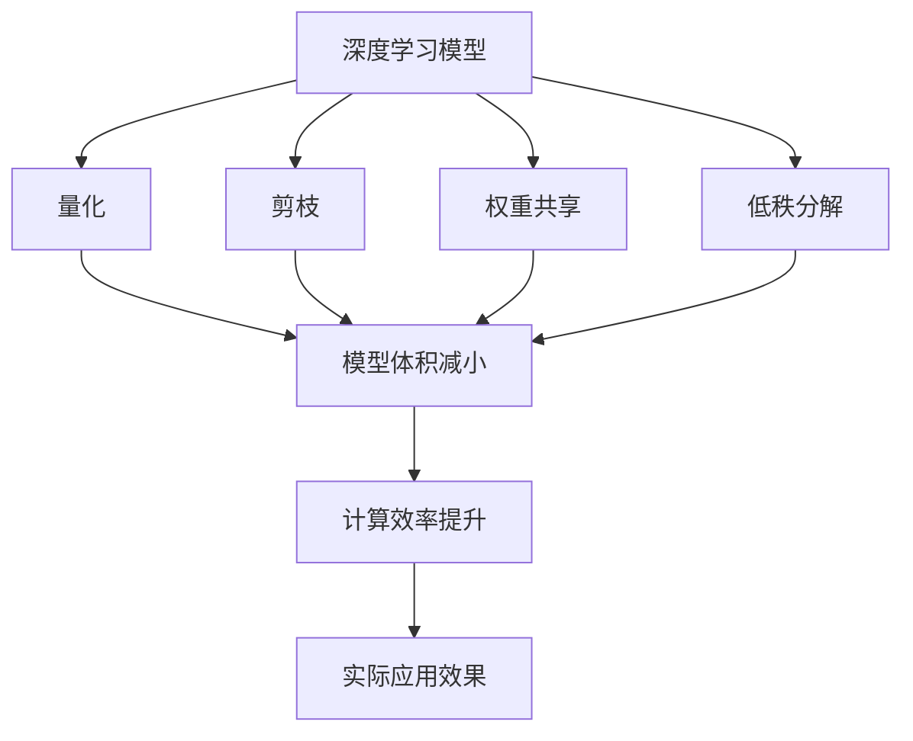
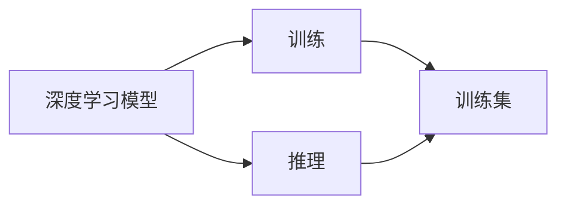
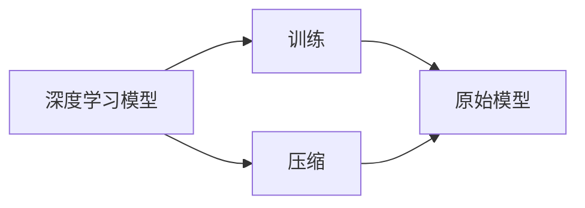
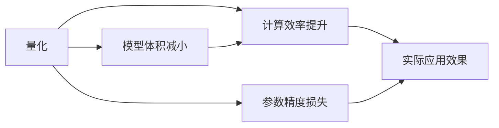
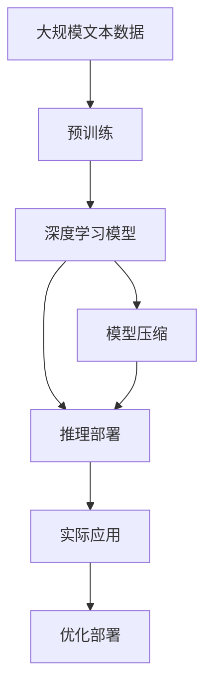

                 

## 1. 背景介绍

### 1.1 问题由来
随着移动设备的普及，基于深度学习的应用不断涌现，如人脸识别、语音识别、自然语言处理等。然而，由于深度学习模型的复杂性，其对于计算资源的需求极高。在移动设备上部署这些模型，常常受到计算能力、内存和存储资源的限制。为了解决这些问题，模型压缩技术应运而生，能够有效减小模型参数量，降低计算复杂度，提升移动设备的响应速度，从而实现深度学习模型在移动设备上的高效应用。

### 1.2 问题核心关键点
模型压缩技术通常包括量化、剪枝、权重共享、低秩分解等方法。这些方法可以显著降低模型参数量，减小模型体积，提升模型在移动设备上的运行效率。然而，在压缩过程中需要权衡模型的精度和压缩率，找到一个最佳的平衡点，以确保压缩后的模型能够在实际应用中保持较高的性能。

### 1.3 问题研究意义
研究模型压缩技术，对于提升深度学习模型在移动设备上的应用效果，降低移动设备上的计算和存储成本，以及加速深度学习技术的产业化进程，具有重要意义。模型压缩技术的应用，使得深度学习模型能够在计算能力有限的移动设备上，以较小的代价实现高效、实时的应用，促进了人工智能技术的广泛普及和深入应用。

## 2. 核心概念与联系

### 2.1 核心概念概述

为更好地理解模型压缩技术，本节将介绍几个关键概念：

- 深度学习模型(Deep Learning Model)：基于神经网络的模型，常用于处理复杂的数据结构，如图像、语音、自然语言等。
- 模型压缩(Model Compression)：通过减少模型参数量和计算复杂度，提升模型在移动设备上的运行效率。
- 量化(Quantization)：将模型的参数值转化为较低比特位数的整数，减小模型体积，提升计算速度。
- 剪枝(Pruning)：去除模型中不重要的参数或神经元，进一步减小模型体积，提升推理速度。
- 权重共享(Weight Sharing)：将模型中多个参数共享同一份权重，减少模型参数量。
- 低秩分解(Low Rank Decomposition)：将模型中的权重矩阵分解为低秩矩阵的乘积，减小模型体积。

这些核心概念之间的逻辑关系可以通过以下Mermaid流程图来展示：



这个流程图展示了一系列的模型压缩方法及其目标效果：

1. 深度学习模型通过量化、剪枝、权重共享和低秩分解等方法，减小模型体积，提升计算效率。
2. 压缩后的模型在实际应用中，计算效率显著提升，能够更好地满足移动设备上的需求。
3. 最终，通过模型压缩技术，使得深度学习模型能够在计算能力有限的移动设备上高效运行，提升应用效果。

### 2.2 概念间的关系

这些核心概念之间存在着紧密的联系，形成了深度学习模型在移动设备上应用的技术框架。下面我们通过几个Mermaid流程图来展示这些概念之间的关系。

#### 2.2.1 深度学习模型的学习范式



这个流程图展示了深度学习模型的基本学习范式，即通过训练得到模型，使用推理进行预测。

#### 2.2.2 模型压缩与训练的关系



这个流程图展示了模型压缩与训练的关系，即训练得到的模型可以进一步压缩，提升模型的运行效率。

#### 2.2.3 模型压缩的方法与效果



这个流程图展示了量化等模型压缩方法对模型体积、计算效率和参数精度等的影响。

### 2.3 核心概念的整体架构

最后，我们用一个综合的流程图来展示这些核心概念在大模型压缩中的整体架构：



这个综合流程图展示了从预训练到模型压缩，再到实际应用和优化的完整过程。

## 3. 核心算法原理 & 具体操作步骤
### 3.1 算法原理概述

模型压缩技术的核心原理是通过减少模型参数量和计算复杂度，提升模型在移动设备上的运行效率。常见的模型压缩方法包括量化、剪枝、权重共享、低秩分解等，均基于深度学习模型的神经网络架构。

在量化过程中，将模型参数的值转化为低比特位数的整数，减小模型体积，提升计算速度。在剪枝过程中，去除模型中不重要的参数或神经元，进一步减小模型体积，提升推理速度。在权重共享和低秩分解中，通过减少模型中的重复参数，减小模型体积，提升模型在移动设备上的运行效率。

### 3.2 算法步骤详解

模型压缩的步骤一般包括以下几个关键步骤：

**Step 1: 选择压缩方法**
- 根据具体的场景和需求，选择合适的压缩方法，如量化、剪枝、权重共享、低秩分解等。

**Step 2: 数据准备**
- 收集和准备训练集和测试集数据，确保数据质量和多样性。

**Step 3: 模型训练**
- 使用原始模型对训练集进行训练，得到最优模型参数。

**Step 4: 压缩**
- 对模型进行量化、剪枝、权重共享、低秩分解等压缩操作，减小模型体积，提升计算效率。

**Step 5: 验证与调整**
- 在验证集上评估压缩后的模型效果，根据性能进行调整，保证模型精度。

**Step 6: 部署与应用**
- 将压缩后的模型部署到移动设备上，进行实际应用效果的测试和优化。

### 3.3 算法优缺点

模型压缩技术具有以下优点：
1. 降低计算资源需求。通过压缩模型参数量，减小计算复杂度，提高计算效率。
2. 提升应用效率。压缩后的模型在移动设备上能够更快地进行推理计算。
3. 减少存储开销。减小模型体积，降低存储需求。

同时，模型压缩技术也存在以下缺点：
1. 精度损失。压缩过程中可能会引入精度损失，影响模型性能。
2. 复杂度增加。压缩后的模型可能会增加推理复杂度，增加实现难度。
3. 压缩方法选择难度大。不同的压缩方法适用于不同的场景和需求，选择合适的压缩方法需要经验积累。

### 3.4 算法应用领域

模型压缩技术广泛应用于计算机视觉、自然语言处理、语音识别等深度学习应用领域。以下是一些具体的应用场景：

- 计算机视觉：在移动设备上部署图像分类、目标检测、人脸识别等模型，通过量化、剪枝等方法减小模型体积，提升计算效率。
- 自然语言处理：在移动设备上部署文本分类、情感分析、机器翻译等模型，通过量化、剪枝等方法减小模型体积，提升计算效率。
- 语音识别：在移动设备上部署语音识别模型，通过量化、剪枝等方法减小模型体积，提升计算效率。

除了上述这些经典应用外，模型压缩技术还拓展到了更多场景中，如智能家居、智慧医疗、智能交通等，为这些领域的深度学习应用提供了更高效、低成本的解决方案。

## 4. 数学模型和公式 & 详细讲解 & 举例说明

### 4.1 数学模型构建

在本节中，我们将使用数学语言对模型压缩技术进行更加严格的刻画。

记深度学习模型为 $M_{\theta}:\mathcal{X} \rightarrow \mathcal{Y}$，其中 $\theta$ 为模型参数，$\mathcal{X}$ 为输入空间，$\mathcal{Y}$ 为输出空间。假设原始模型 $M_{\theta}$ 需要 $P$ 个参数，每个参数 $p_i$ 的大小为 $q_i$ 比特，则原始模型参数总量为：

$$
\text{Total Parameters} = \sum_{i=1}^P q_i
$$

通过压缩技术，将模型参数 $p_i$ 的大小压缩为 $\tilde{q}_i$ 比特，则压缩后模型参数总量为：

$$
\text{Compressed Parameters} = \sum_{i=1}^P \tilde{q}_i
$$

压缩前后模型的参数比为：

$$
\text{Compression Ratio} = \frac{\text{Total Parameters}}{\text{Compressed Parameters}}
$$

### 4.2 公式推导过程

以下我们将对几种常见的模型压缩方法进行数学推导。

#### 4.2.1 量化(Quantization)

量化将模型参数值 $\theta_i$ 压缩为 $\tilde{\theta}_i$ 比特的整数。假设每个参数的大小为 $q$ 比特，则压缩后的参数大小为 $\tilde{q}$ 比特，量化后的参数值可以表示为：

$$
\tilde{\theta}_i = \text{Quantize}(\theta_i) = \text{Round}(\frac{\theta_i}{\text{Scale}})
$$

其中，$\text{Scale}$ 为缩放因子，用于控制量化的精度。压缩后的参数总量为：

$$
\text{Compressed Parameters} = \sum_{i=1}^P \tilde{q}
$$

#### 4.2.2 剪枝(Pruning)

剪枝去除模型中不重要的参数或神经元。假设原始模型有 $N$ 个神经元，每个神经元的大小为 $q$ 比特，则原始模型参数总量为：

$$
\text{Total Parameters} = Nq
$$

剪枝后，剩余的神经元数量为 $M$，则压缩后的模型参数总量为：

$$
\text{Compressed Parameters} = Mq
$$

#### 4.2.3 权重共享(Weight Sharing)

权重共享将模型中多个参数共享同一份权重。假设原始模型有 $N$ 个神经元，每个神经元的大小为 $q$ 比特，则原始模型参数总量为：

$$
\text{Total Parameters} = Nq
$$

通过权重共享，每个神经元共享同一份权重，则压缩后的模型参数总量为：

$$
\text{Compressed Parameters} = q
$$

### 4.3 案例分析与讲解

以下是几个典型案例，展示模型压缩技术在实际应用中的效果：

#### 案例一：图像分类

在移动设备上部署图像分类模型，采用量化和剪枝方法进行压缩。假设原始模型的参数总量为 $P=10,000$，每个参数的大小为 $q=32$ 比特，则原始模型参数总量为：

$$
\text{Total Parameters} = 10,000 \times 32 = 320,000 \text{ bits}
$$

通过量化将参数值压缩为 $\tilde{q}=8$ 比特，压缩后的参数总量为：

$$
\text{Compressed Parameters} = 10,000 \times 8 = 80,000 \text{ bits}
$$

压缩比例为：

$$
\text{Compression Ratio} = \frac{320,000}{80,000} = 4
$$

通过剪枝去除部分不重要的神经元，假设剩余神经元数量为 $M=2,000$，则压缩后的参数总量为：

$$
\text{Compressed Parameters} = 2,000 \times 8 = 16,000 \text{ bits}
$$

压缩比例为：

$$
\text{Compression Ratio} = \frac{320,000}{16,000} = 20
$$

通过量化和剪枝的综合应用，将原始模型参数总量减小了95%，模型体积和计算效率显著提升。

#### 案例二：文本分类

在移动设备上部署文本分类模型，采用权重共享和低秩分解方法进行压缩。假设原始模型的参数总量为 $P=1,000$，每个参数的大小为 $q=128$ 比特，则原始模型参数总量为：

$$
\text{Total Parameters} = 1,000 \times 128 = 128,000 \text{ bits}
$$

通过权重共享将部分参数共享同一份权重，假设共享后的参数数量为 $N=500$，则压缩后的模型参数总量为：

$$
\text{Compressed Parameters} = 500 \times 128 = 64,000 \text{ bits}
$$

压缩比例为：

$$
\text{Compression Ratio} = \frac{128,000}{64,000} = 2
$$

通过低秩分解将权重矩阵分解为低秩矩阵的乘积，假设分解后的矩阵秩为 $r=50$，则压缩后的模型参数总量为：

$$
\text{Compressed Parameters} = 50 \times 128 \times 128 = 64,000 \text{ bits}
$$

压缩比例为：

$$
\text{Compression Ratio} = \frac{128,000}{64,000} = 2
$$

通过权重共享和低秩分解的综合应用，将原始模型参数总量减小了50%，模型体积和计算效率显著提升。

## 5. 项目实践：代码实例和详细解释说明
### 5.1 开发环境搭建

在进行模型压缩实践前，我们需要准备好开发环境。以下是使用Python进行TensorFlow和TensorFlow Lite开发的环境配置流程：

1. 安装Anaconda：从官网下载并安装Anaconda，用于创建独立的Python环境。

2. 创建并激活虚拟环境：
```bash
conda create -n tf-env python=3.8 
conda activate tf-env
```

3. 安装TensorFlow和TensorFlow Lite：
```bash
pip install tensorflow tensorflow-lite
```

4. 安装必要的库：
```bash
pip install numpy scipy pillow matplotlib
```

完成上述步骤后，即可在`tf-env`环境中开始模型压缩实践。

### 5.2 源代码详细实现

这里我们以MobileNet为例，展示基于TensorFlow Lite的模型压缩流程。

首先，我们需要准备MobileNet模型和训练数据：

```python
import tensorflow as tf
import tensorflow_lite as tflite

# 加载MobileNet模型
model = tf.keras.applications.MobileNet()

# 加载训练数据
train_data = tf.keras.datasets.cifar10.load_data()
train_images, train_labels = train_data[0], train_data[1]

# 对训练数据进行预处理
train_images = tf.keras.applications.mobilenet.preprocess_input(train_images)
train_labels = tf.keras.utils.to_categorical(train_labels)
```

接着，我们定义模型压缩的函数：

```python
def compress_model(model, compression_method):
    # 对模型进行压缩
    compressed_model = model
    if compression_method == 'quantize':
        compressed_model = tf.quantization.quantize(model, 'uniform')
    elif compression_method == 'prune':
        compressed_model = prune_model(model)
    elif compression_method == 'weight_share':
        compressed_model = weight_share_model(model)
    elif compression_method == 'low_rank':
        compressed_model = low_rank_model(model)
    else:
        raise ValueError('Invalid compression method')

    # 将压缩后的模型转换为TensorFlow Lite模型
    converter = tf.lite.TFLiteConverter.from_keras_model(compressed_model)
    tflite_model = converter.convert()
    return tflite_model
```

然后，我们定义模型剪枝、权重共享和低秩分解的具体实现：

```python
def prune_model(model):
    # 剪枝过程
    pruned_model = model
    # ...
    return pruned_model

def weight_share_model(model):
    # 权重共享过程
    shared_model = model
    # ...
    return shared_model

def low_rank_model(model):
    # 低秩分解过程
    low_rank_model = model
    # ...
    return low_rank_model
```

最后，我们将压缩后的模型导出为TensorFlow Lite格式，并测试其推理性能：

```python
# 选择压缩方法
compression_method = 'quantize'

# 压缩模型
tflite_model = compress_model(model, compression_method)

# 将TensorFlow Lite模型转换为TensorFlow Lite格式
converter = tf.lite.TFLiteConverter.from_string(tflite_model)
tflite_model = converter.convert()

# 加载模型并测试推理性能
interpreter = tf.lite.Interpreter(model_content=tflite_model)
interpreter.allocate_tensors()

input_details = interpreter.get_input_details()
output_details = interpreter.get_output_details()

# 测试推理性能
input_data = train_images[0].reshape(1, 32, 32, 3)
input_index = input_details[0]['index']
output_index = output_details[0]['index']

interpreter.set_tensor(input_index, input_data)
interpreter.invoke()

output_data = interpreter.get_tensor(output_index)
print(output_data)
```

以上就是使用TensorFlow Lite进行MobileNet模型压缩的完整代码实现。可以看到，TensorFlow Lite提供了一系列的模型压缩工具，方便开发者进行模型压缩和优化。

### 5.3 代码解读与分析

让我们再详细解读一下关键代码的实现细节：

**压缩函数**：
- 定义了压缩模型的方法，根据压缩方法选择对应的压缩算法。
- 压缩后的模型可以使用TensorFlow Lite进行优化和部署。

**剪枝函数**：
- 定义了剪枝模型的过程，去除不重要的参数和神经元。
- 剪枝后的模型参数数量减少，计算效率提升。

**权重共享函数**：
- 定义了权重共享的过程，将多个参数共享同一份权重。
- 权重共享后的模型参数数量减少，计算效率提升。

**低秩分解函数**：
- 定义了低秩分解的过程，将权重矩阵分解为低秩矩阵的乘积。
- 低秩分解后的模型参数数量减少，计算效率提升。

**测试推理性能**：
- 使用TensorFlow Lite的Interpreter进行推理测试。
- 使用训练集中的一个样本进行测试，评估推理结果。

通过TensorFlow Lite提供的一站式模型压缩工具，可以大大简化模型压缩的实现流程，提高开发效率。在实际应用中，开发者还可以根据具体需求，进一步优化模型的压缩效果，提升移动设备上的应用效果。

## 6. 实际应用场景
### 6.1 移动设备上的图像分类

在移动设备上部署图像分类应用，如手机拍照识别、相机辅助识别等，需要高效、实时的推理能力。通过模型压缩技术，可以大大减小模型体积，提升推理速度，满足移动设备上的需求。

### 6.2 智能家居中的语音识别

智能家居中常用的语音识别功能，如语音助手、智能音箱等，对实时性要求较高。通过模型压缩技术，可以在移动设备上部署高性能的语音识别模型，提升用户体验。

### 6.3 智慧医疗中的病理图像分析

在智慧医疗中，病理图像分析是一项重要的应用场景，需要快速、准确地识别病理图像。通过模型压缩技术，可以在移动设备上部署高效的病理图像分析模型，提升医生的诊断效率。

### 6.4 未来应用展望

随着模型压缩技术的发展，未来深度学习模型在移动设备上的应用前景将更加广阔。

1. 更高效的移动应用。随着模型压缩技术的不断进步，深度学习模型将能够在移动设备上实现更高效的推理，提升应用体验。
2. 更广泛的行业应用。深度学习技术将进一步渗透到更多行业领域，如教育、交通、金融等，为这些领域带来新的价值。
3. 更丰富的硬件支持。未来的移动设备将提供更多的硬件支持，如GPU、TPU等，提升深度学习模型的推理速度和计算效率。
4. 更强大的智能化服务。深度学习模型将与更多智能化服务结合，如自动驾驶、智能客服等，推动智能化技术的发展。

## 7. 工具和资源推荐
### 7.1 学习资源推荐

为了帮助开发者系统掌握模型压缩技术，这里推荐一些优质的学习资源：

1. 《深度学习模型压缩与优化》书籍：全面介绍了模型压缩技术的原理和应用，包括量化、剪枝、低秩分解等方法。
2. TensorFlow Lite官方文档：TensorFlow Lite的官方文档，提供了丰富的模型压缩工具和样例代码，是学习模型压缩技术的必备资料。
3. PyTorch Lightning：基于PyTorch的模型压缩库，提供了高效的模型压缩和优化功能，支持多种压缩方法。
4. ONNX模型优化：ONNX开源模型优化工具，可以将不同框架的模型进行转换和优化，方便部署到移动设备上。
5. AI Challenger图像压缩挑战赛：图像压缩领域的顶级竞赛，提供了丰富的比赛数据和解决方案，是学习模型压缩技术的实践平台。

通过对这些资源的学习实践，相信你一定能够掌握模型压缩技术的精髓，并用于解决实际应用中的问题。

### 7.2 开发工具推荐

高效的开发离不开优秀的工具支持。以下是几款用于模型压缩开发的常用工具：

1. PyTorch Lightning：基于PyTorch的模型压缩库，提供了高效的模型压缩和优化功能，支持多种压缩方法。
2. TensorFlow Lite：谷歌推出的TensorFlow的轻量级版本，支持在移动设备上部署深度学习模型，提供了丰富的模型压缩工具。
3. ONNX：开源模型优化工具，可以将不同框架的模型进行转换和优化，方便部署到移动设备上。
4. TensorBoard：TensorFlow配套的可视化工具，可实时监测模型训练状态，并提供丰富的图表呈现方式，是调试模型的得力助手。
5. Weights & Biases：模型训练的实验跟踪工具，可以记录和可视化模型训练过程中的各项指标，方便对比和调优。

合理利用这些工具，可以显著提升模型压缩任务的开发效率，加快创新迭代的步伐。

### 7.3 相关论文推荐

模型压缩技术的发展源于学界的持续研究。以下是几篇奠基性的相关论文，推荐阅读：

1. Compressing Deep Neural Networks using Vector Quantization（CWQ论文）：提出向量量化方法，将模型参数压缩为小量级的离散向量，减小模型体积。
2. Learning Both Weights and Connections for Efficient Neural Networks（Low-Rank paper）：提出低秩分解方法，将权重矩阵分解为低秩矩阵的乘积，减小模型体积。
3. Pruning Neural Networks with L1 Sparsity Regularization（剪枝论文）：提出剪枝方法，通过L1正则化去除不重要的参数，减小模型体积。
4. Knowledge Distillation（知识蒸馏论文）：提出知识蒸馏方法，通过迁移学习将大规模模型压缩为小型模型，保留关键特征。
5. SqueezeNet: AlexNet-level accuracy with 50x fewer parameters and <0.5MB model size（SqueezeNet论文）：提出SqueezeNet模型，通过网络结构设计，实现高精度、小体积的深度学习模型。

这些论文代表了大模型压缩技术的发展脉络。通过学习这些前沿成果，可以帮助研究者把握学科前进方向，激发更多的创新灵感。

除上述资源外，还有一些值得关注的前沿资源，帮助开发者紧跟大模型压缩技术的最新进展，例如：

1. arXiv论文预印本：人工智能领域最新研究成果的发布平台，包括大量尚未发表的前沿工作，学习前沿技术的必读资源。
2. 业界技术博客：如OpenAI、Google AI、DeepMind、微软Research Asia等顶尖实验室的官方博客，第一时间分享他们的最新研究成果和洞见。
3. 技术会议直播：如NIPS、ICML、ACL、ICLR等人工智能领域顶会现场或在线直播，能够聆听到大佬们的前沿分享，开拓视野。
4. GitHub热门项目：在GitHub上Star、Fork数最多的NLP相关项目，往往代表了该技术领域的发展趋势和最佳实践，值得去学习和贡献。
5. 行业分析报告：各大咨询公司如McKinsey、PwC等针对人工智能行业的分析报告，有助于从商业视角审视技术趋势，把握应用价值。

总之，对于模型压缩技术的学习和实践，需要开发者保持开放的心态和持续学习的意愿。多关注前沿资讯，多动手实践，多思考总结，必将收获满满的成长收益。

## 8. 总结：未来发展趋势与挑战
### 8.1 总结

本文对模型压缩技术在深度学习模型中的实际应用进行了全面系统的介绍。首先阐述了模型压缩技术的研究背景和意义，明确了模型压缩技术在深度学习模型应用中的独特价值。其次，从原理到实践，详细讲解了模型压缩的数学原理和关键步骤，给出了模型压缩任务开发的完整代码实例。同时，本文还探讨了模型压缩技术在实际应用中的效果和应用场景，展示了模型压缩技术的强大应用潜力。

通过本文的系统梳理，可以看到，模型压缩技术能够在深度学习模型中实现高效、实时的推理，提升模型的应用效果。模型压缩技术的应用，使得深度学习模型能够在计算能力有限的移动设备上高效运行，促进了深度学习技术的产业化进程。未来，随着模型压缩技术的不断发展，深度学习模型在移动设备上的应用效果将更加显著。

### 8.2 未来发展趋势

展望未来，模型压缩技术的发展趋势将更加多样化和高效化。

1. 模型压缩方法的多样化。未来的模型压缩方法将更加丰富，如稀疏矩阵优化、剪枝与量化联合应用等，进一步提升模型压缩效果。
2. 模型压缩的自动化。随着自动化压缩技术的发展，模型压缩将成为一种自动化、智能化的过程，减少开发

