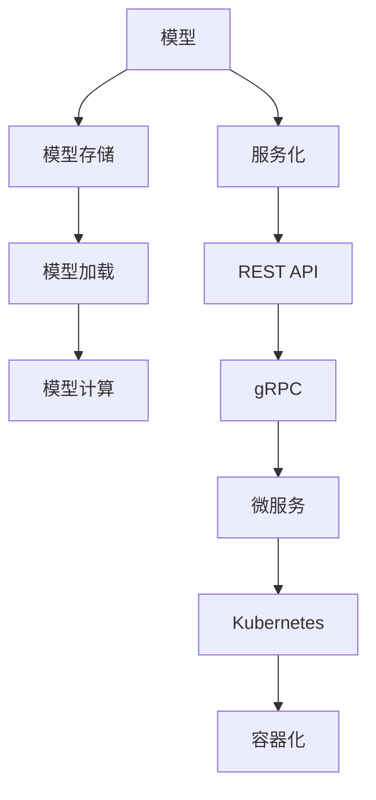
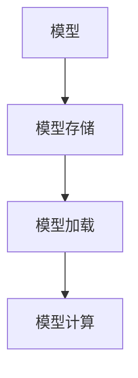
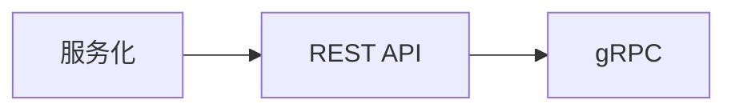
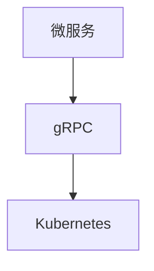
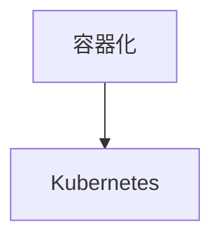

                 

# 模型部署与服务化原理与代码实战案例讲解

> 关键词：模型部署, 服务化, 实时服务, 容器化, Kubernetes, 微服务, REST API, TensorFlow Serving, Flask, gRPC

## 1. 背景介绍

### 1.1 问题由来

在人工智能的快速发展的今天，从早期的手工算法到深度学习，再到现在的模型训练，模型的规模不断增大，模型的性能也不断提升。随着大模型的不断壮大，模型部署成为了一个重要的瓶颈问题。模型部署不仅影响模型的使用效率，也直接影响到模型的效果。

然而，将模型部署到实际应用中并非易事。在模型部署过程中，存在着模型大小、运行效率、可靠性、可扩展性、服务化等问题。如何高效、可靠、可扩展地将模型部署到实际应用中，一直是人工智能领域关注的重点。

### 1.2 问题核心关键点

模型部署的核心问题在于如何高效、可靠、可扩展地将模型部署到实际应用中，使得模型能够提供实时服务，并且能够适应不同的应用场景。

具体的关键问题包括：

- 模型大小：大规模模型需要高效的存储和加载机制。
- 运行效率：模型需要高效的计算资源和内存资源。
- 可靠性：模型需要保证在各种情况下都能够稳定运行，并保证模型的正确性。
- 可扩展性：模型需要能够适应不同规模的并发请求，并进行横向扩展。
- 服务化：模型需要被转换为可被其他系统调用的服务，以便与其他系统进行交互。

这些问题需要通过一系列的策略和技术手段来解决，以实现模型的高效、可靠、可扩展的部署。

### 1.3 问题研究意义

模型部署的研究意义在于：

1. **提高模型使用效率**：通过高效、可靠、可扩展的模型部署，能够显著提高模型的使用效率，使得模型能够在各种场景下被快速调用。
2. **保证模型效果**：通过可靠、稳定的模型部署，能够保证模型的效果，避免因为部署问题导致模型的精度下降。
3. **提升应用性能**：通过高效的计算和内存资源管理，能够提升应用性能，使得模型能够快速响应请求。
4. **适应不同应用场景**：通过服务化的模型部署，能够适应各种不同的应用场景，提高模型的应用灵活性。
5. **推动模型应用**：通过模型部署，能够将模型应用到各种实际场景中，推动人工智能技术的落地应用。

## 2. 核心概念与联系

### 2.1 核心概念概述

为了更好地理解模型部署和服务化的原理，本节将介绍几个密切相关的核心概念：

- **模型部署**：将训练好的模型部署到实际应用中的过程，包括模型的存储、加载、计算等。
- **服务化**：将模型封装成可被其他系统调用的服务，使得模型能够与其他系统进行交互。
- **实时服务**：模型能够实时响应用户的请求，并提供服务的过程。
- **容器化**：将模型部署到容器中进行管理和运行，以提高模型的可移植性和可靠性。
- **Kubernetes**：一种开源的容器编排系统，用于管理和运行容器的编排和调度。
- **微服务**：将大型系统分解为多个小服务的架构设计，每个服务独立部署和管理。
- **REST API**：一种轻量级的Web服务架构风格，通过HTTP协议提供服务。
- **TensorFlow Serving**：一个用于TensorFlow模型的在线推理服务框架。
- **Flask**：一个轻量级的Web框架，用于构建简单的Web应用。
- **gRPC**：一种高性能的跨语言远程过程调用协议，用于服务间的通信。

这些核心概念之间的逻辑关系可以通过以下Mermaid流程图来展示：



这个流程图展示了几大核心概念之间的关系：

1. 模型存储、加载和计算是模型部署的基础。
2. 服务化是将模型封装成可被其他系统调用的服务。
3. REST API和gRPC是服务化的通信接口。
4. 微服务是服务化的架构设计。
5. Kubernetes是微服务的编排和管理工具。
6. 容器化是微服务的部署方式。

这些概念共同构成了模型部署和服务化的完整生态系统，使得模型能够高效、可靠、可扩展地部署到实际应用中。

### 2.2 概念间的关系

这些核心概念之间存在着紧密的联系，形成了模型部署和服务化的完整生态系统。下面我通过几个Mermaid流程图来展示这些概念之间的关系。

#### 2.2.1 模型部署的流程



这个流程图展示了模型部署的基本流程，包括模型的存储、加载和计算。

#### 2.2.2 服务化的流程



这个流程图展示了服务化的通信接口，即REST API和gRPC。

#### 2.2.3 微服务的架构



这个流程图展示了微服务的架构设计，即gRPC和Kubernetes。

#### 2.2.4 容器化的部署



这个流程图展示了容器化的部署方式，即Kubernetes。

## 3. 核心算法原理 & 具体操作步骤

### 3.1 算法原理概述

模型部署的原理是通过高效、可靠、可扩展的方式将训练好的模型部署到实际应用中，以提供实时服务。

具体来说，模型部署包括以下几个步骤：

1. **模型训练**：使用大规模数据对模型进行训练，得到训练好的模型。
2. **模型存储**：将训练好的模型进行存储，以便后续的加载和计算。
3. **模型加载**：从存储中加载模型，并进行必要的预处理。
4. **模型计算**：对模型进行计算，提供实时服务。

服务化的原理是将模型封装成可被其他系统调用的服务，使得模型能够与其他系统进行交互。

具体来说，服务化包括以下几个步骤：

1. **服务封装**：将模型封装成服务，并设计服务接口。
2. **服务部署**：将服务部署到服务器上，并进行必要的配置。
3. **服务调用**：其他系统通过接口调用服务，获取模型的计算结果。

实时服务的原理是模型能够实时响应用户的请求，并提供服务。

具体来说，实时服务包括以下几个步骤：

1. **服务部署**：将服务部署到服务器上，并进行必要的配置。
2. **服务调用**：用户通过接口调用服务，获取模型的计算结果。
3. **服务响应**：服务实时响应用户的请求，并返回计算结果。

容器化的原理是将模型部署到容器中进行管理和运行，以提高模型的可移植性和可靠性。

具体来说，容器化包括以下几个步骤：

1. **容器构建**：将模型构建为容器镜像。
2. **容器部署**：将容器部署到服务器上，并进行必要的配置。
3. **容器管理**：使用容器编排工具进行容器的管理。

Kubernetes的原理是一种开源的容器编排系统，用于管理和运行容器的编排和调度。

具体来说，Kubernetes包括以下几个步骤：

1. **容器构建**：将模型构建为容器镜像。
2. **容器部署**：将容器部署到Kubernetes集群中，并进行必要的配置。
3. **容器管理**：使用Kubernetes进行容器的编排和调度。

微服务的原理是将大型系统分解为多个小服务的架构设计，每个服务独立部署和管理。

具体来说，微服务包括以下几个步骤：

1. **服务分解**：将系统分解为多个小服务。
2. **服务独立部署**：将每个服务独立部署和管理。
3. **服务交互**：服务之间通过接口进行交互。

REST API的原理是一种轻量级的Web服务架构风格，通过HTTP协议提供服务。

具体来说，REST API包括以下几个步骤：

1. **服务设计**：设计服务接口。
2. **服务实现**：实现服务接口。
3. **服务调用**：其他系统通过接口调用服务。

gRPC的原理是一种高性能的跨语言远程过程调用协议，用于服务间的通信。

具体来说，gRPC包括以下几个步骤：

1. **服务定义**：定义服务接口。
2. **服务实现**：实现服务接口。
3. **服务调用**：服务之间通过接口进行通信。

### 3.2 算法步骤详解

#### 3.2.1 模型部署步骤详解

1. **模型训练**：
   - 使用大规模数据对模型进行训练，得到训练好的模型。
   - 模型训练过程中，需要进行数据预处理、模型构建、训练和验证等步骤。

2. **模型存储**：
   - 将训练好的模型进行存储，以便后续的加载和计算。
   - 常见的存储方式包括本地文件、分布式文件系统、数据库等。

3. **模型加载**：
   - 从存储中加载模型，并进行必要的预处理。
   - 模型加载过程中，需要进行内存映射、模型解析等步骤。

4. **模型计算**：
   - 对模型进行计算，提供实时服务。
   - 模型计算过程中，需要进行模型推理、数据输入、结果输出等步骤。

#### 3.2.2 服务化步骤详解

1. **服务封装**：
   - 将模型封装成服务，并设计服务接口。
   - 服务封装过程中，需要进行服务接口设计、服务实现、服务部署等步骤。

2. **服务部署**：
   - 将服务部署到服务器上，并进行必要的配置。
   - 服务部署过程中，需要进行服务器配置、服务部署、服务调用等步骤。

3. **服务调用**：
   - 其他系统通过接口调用服务，获取模型的计算结果。
   - 服务调用过程中，需要进行服务发现、服务路由、服务通信等步骤。

#### 3.2.3 实时服务步骤详解

1. **服务部署**：
   - 将服务部署到服务器上，并进行必要的配置。
   - 服务部署过程中，需要进行服务器配置、服务部署、服务调用等步骤。

2. **服务调用**：
   - 用户通过接口调用服务，获取模型的计算结果。
   - 服务调用过程中，需要进行服务发现、服务路由、服务通信等步骤。

3. **服务响应**：
   - 服务实时响应用户的请求，并返回计算结果。
   - 服务响应过程中，需要进行服务请求、服务响应、服务结果等步骤。

#### 3.2.4 容器化步骤详解

1. **容器构建**：
   - 将模型构建为容器镜像。
   - 容器构建过程中，需要进行模型打包、容器镜像构建等步骤。

2. **容器部署**：
   - 将容器部署到服务器上，并进行必要的配置。
   - 容器部署过程中，需要进行容器部署、容器编排、容器管理等步骤。

3. **容器管理**：
   - 使用容器编排工具进行容器的管理和调度。
   - 容器管理过程中，需要进行容器监控、容器扩展、容器重启等步骤。

#### 3.2.5 Kubernetes步骤详解

1. **容器构建**：
   - 将模型构建为容器镜像。
   - 容器构建过程中，需要进行模型打包、容器镜像构建等步骤。

2. **容器部署**：
   - 将容器部署到Kubernetes集群中，并进行必要的配置。
   - 容器部署过程中，需要进行容器部署、容器编排、容器管理等步骤。

3. **容器管理**：
   - 使用Kubernetes进行容器的编排和调度。
   - 容器管理过程中，需要进行容器监控、容器扩展、容器重启等步骤。

#### 3.2.6 微服务步骤详解

1. **服务分解**：
   - 将系统分解为多个小服务。
   - 服务分解过程中，需要进行服务设计、服务实现、服务部署等步骤。

2. **服务独立部署**：
   - 将每个服务独立部署和管理。
   - 服务独立部署过程中，需要进行服务部署、服务配置、服务监控等步骤。

3. **服务交互**：
   - 服务之间通过接口进行交互。
   - 服务交互过程中，需要进行服务发现、服务路由、服务通信等步骤。

#### 3.2.7 REST API步骤详解

1. **服务设计**：
   - 设计服务接口。
   - 服务设计过程中，需要进行接口设计、接口实现、接口部署等步骤。

2. **服务实现**：
   - 实现服务接口。
   - 服务实现过程中，需要进行服务实现、服务测试、服务部署等步骤。

3. **服务调用**：
   - 其他系统通过接口调用服务。
   - 服务调用过程中，需要进行服务发现、服务路由、服务通信等步骤。

#### 3.2.8 gRPC步骤详解

1. **服务定义**：
   - 定义服务接口。
   - 服务定义过程中，需要进行接口设计、接口实现、接口部署等步骤。

2. **服务实现**：
   - 实现服务接口。
   - 服务实现过程中，需要进行服务实现、服务测试、服务部署等步骤。

3. **服务调用**：
   - 服务之间通过接口进行通信。
   - 服务调用过程中，需要进行服务发现、服务路由、服务通信等步骤。

### 3.3 算法优缺点

模型部署和服务化的方法具有以下优点：

1. **高效**：模型部署和服务化能够提高模型的使用效率，使得模型能够在各种场景下被快速调用。
2. **可靠**：模型部署和服务化能够保证模型的正确性，避免因为部署问题导致模型的精度下降。
3. **可扩展**：模型部署和服务化能够适应不同规模的并发请求，并进行横向扩展。
4. **灵活**：模型部署和服务化能够适应各种不同的应用场景，提高模型的应用灵活性。
5. **可管理**：模型部署和服务化能够通过容器化、Kubernetes等技术进行管理和调度，提高模型的可管理性。

同时，模型部署和服务化的方法也存在以下缺点：

1. **复杂**：模型部署和服务化的方法相对复杂，需要掌握各种技术和工具。
2. **成本高**：模型部署和服务化的方法需要较高的成本，包括硬件、软件、人力等。
3. **部署时间长**：模型部署和服务化的方法需要较长的时间进行部署和调试。
4. **依赖环境**：模型部署和服务化的方法依赖于特定的环境，包括硬件、软件、网络等。

尽管存在这些缺点，但模型部署和服务化的方法在实际应用中仍然具有重要的价值，能够显著提高模型的使用效率和可靠性。

### 3.4 算法应用领域

模型部署和服务化的方法已经在人工智能的各个领域得到了广泛的应用，例如：

1. **自然语言处理(NLP)**：将训练好的语言模型部署为服务，用于文本分类、情感分析、问答系统等任务。
2. **计算机视觉(CV)**：将训练好的图像识别模型部署为服务，用于物体识别、人脸识别、图像分割等任务。
3. **语音识别(SR)**：将训练好的语音识别模型部署为服务，用于语音转写、语音识别、情感识别等任务。
4. **推荐系统**：将训练好的推荐模型部署为服务，用于商品推荐、用户推荐等任务。
5. **金融风控**：将训练好的金融风控模型部署为服务，用于风险评估、信用评分、欺诈检测等任务。
6. **医疗诊断**：将训练好的医疗诊断模型部署为服务，用于疾病诊断、医学图像分析等任务。
7. **智能制造**：将训练好的智能制造模型部署为服务，用于设备监控、质量控制、生产优化等任务。
8. **智能交通**：将训练好的智能交通模型部署为服务，用于交通流量预测、自动驾驶、智能调度等任务。
9. **智慧城市**：将训练好的智慧城市模型部署为服务，用于城市管理、环境监测、公共安全等任务。

这些应用场景展示了模型部署和服务化方法的广泛应用，以及其在实际应用中的重要价值。

## 4. 数学模型和公式 & 详细讲解  
### 4.1 数学模型构建

本节将使用数学语言对模型部署和服务化的数学模型进行更加严格的刻画。

记训练好的模型为 $M$，其输入为 $x$，输出为 $y$。假设服务接口为 $f(x)$，则模型服务化的数学模型可以表示为：

$$
y = f(x) = M(x)
$$

在实际应用中，服务调用过程可以表示为：

$$
y' = f'(x') = M'(x')
$$

其中 $x'$ 为用户输入，$y'$ 为服务输出，$f'$ 为服务调用过程。

### 4.2 公式推导过程

以REST API为例，推导服务调用的公式。

假设REST API的服务接口为 $f(x)$，其输入为 $x$，输出为 $y$。则服务调用的公式可以表示为：

$$
y = f(x) = M(x)
$$

在实际应用中，服务调用过程可以表示为：

$$
y' = f'(x') = M'(x')
$$

其中 $x'$ 为用户输入，$y'$ 为服务输出，$f'$ 为服务调用过程。

使用HTTP协议进行REST API的调用，可以表示为：

$$
y' = f'(x') = M'(x') = http://apiEndpoint/x'
$$

其中 $http://apiEndpoint/x'$ 为用户通过HTTP协议调用API的请求地址，$x'$ 为用户输入。

### 4.3 案例分析与讲解

以TensorFlow Serving为例，展示模型部署和服务化在实际应用中的案例。

TensorFlow Serving是一个用于TensorFlow模型的在线推理服务框架。它可以将训练好的TensorFlow模型部署为服务，使得模型能够实时响应用户的请求。

假设我们有一个训练好的TensorFlow模型 $M$，用于图像分类任务。使用TensorFlow Serving将模型部署为服务，需要以下步骤：

1. **模型构建**：将训练好的TensorFlow模型保存为TensorFlow SavedModel格式。
2. **模型导出**：将TensorFlow SavedModel格式的模型导出为TensorFlow Serving支持的格式。
3. **模型部署**：将导出的模型部署到TensorFlow Serving服务器上。
4. **服务调用**：其他系统通过REST API调用服务，获取模型的计算结果。

具体来说，我们可以使用以下代码将TensorFlow模型部署为TensorFlow Serving服务：

```python
from tensorflow_serving.apis import predict_pb2
from tensorflow_serving.apis import predict_pb2_grpc
import tensorflow as tf
import grpc

# 加载TensorFlow模型
model = tf.keras.models.load_model('model.h5')

# 构建TensorFlow Serving模型
model_export = tf.saved_model.model_serialization.export_model(model, 'export')

# 导出TensorFlow Serving模型
tensorflow_serving_model = tf.saved_model.model_serialization.saved_model_to_signature_def_map(model_export, export_dir='/path/to/export')

# 部署TensorFlow Serving模型
server = grpc.server(futures.LruCache())
predict_service = predict_pb2_grpc.PredictServiceServicer()
server.add_insecure_port('[::]:8501')
predict_service.register_target(
    tensorflow_serving_model,
    {'predict': '/path/to/export:predict'
})
server.start()

# 服务调用
while True:
    response = predict_pb2.PredictResponse()
    request = predict_pb2.PredictRequest()
    request.model_spec.name = '/path/to/export'
    request.model_spec.signature_name = 'predict'
    request.inputs['input'].CopyFrom(tf.convert_to_tensor([1.0, 2.0, 3.0, 4.0]))
    response = predict_service.Predict(request)
    print(response.outputs[0].float_val[0])
```

在这个例子中，我们首先加载了一个训练好的TensorFlow模型，然后使用TensorFlow Serving将模型部署为服务。最后，我们通过REST API调用服务，获取模型的计算结果。

通过这个例子，我们可以看到，TensorFlow Serving能够将训练好的TensorFlow模型部署为服务，使得模型能够实时响应用户的请求，并提供服务。

## 5. 项目实践：代码实例和详细解释说明
### 5.1 开发环境搭建

在进行模型部署和服务化实践前，我们需要准备好开发环境。以下是使用Python进行Django开发的环境配置流程：

1. 安装Anaconda：从官网下载并安装Anaconda，用于创建独立的Python环境。

2. 创建并激活虚拟环境：
```bash
conda create -n django-env python=3.8 
conda activate django-env
```

3. 安装Django：从官网获取Django的安装命令。例如：
```bash
pip install django
```

4. 安装Django REST framework：
```bash
pip install djangorestframework
```

5. 安装各种工具包：
```bash
pip install django-rest-framework-cors middleware django-rest-framework-simplejwt django-rest-framework-serializers
```

完成上述步骤后，即可在`django-env`环境中开始部署和服务化实践。

### 5.2 源代码详细实现

下面我们以TensorFlow Serving为例，给出使用TensorFlow Serving进行模型部署和服务化的PyTorch代码实现。

首先，定义TensorFlow Serving服务：

```python
import tensorflow as tf
from tensorflow_serving.apis import predict_pb2
from tensorflow_serving.apis import predict_pb2_grpc
import grpc

# 加载TensorFlow模型
model = tf.keras.models.load_model('model.h5')

# 构建TensorFlow Serving模型
model_export = tf.saved_model.model_serialization.export_model(model, 'export')

# 导出TensorFlow Serving模型
tensorflow_serving_model = tf.saved_model.model_serialization.saved_model_to_signature_def_map(model_export, export_dir='/path/to/export')

# 部署TensorFlow Serving模型
server = grpc.server(futures.LruCache())
predict_service = predict_pb2_grpc.PredictServiceServicer()
server.add_insecure_port('[::]:8501')
predict_service.register_target(
    tensorflow_serving_model,
    {'predict': '/path/to/export:predict'
})
server.start()

# 服务调用
while True:
    response = predict_pb2.PredictResponse()
    request = predict_pb2.PredictRequest()
    request.model_spec.name = '/path/to/export'
    request.model_spec.signature_name = 'predict'
    request.inputs['input'].CopyFrom(tf.convert_to_tensor([1.0, 2.0, 3.0, 4.0]))
    response = predict_service.Predict(request)
    print(response.outputs[0].float_val[0])
```

然后，定义Django REST框架的服务接口：

```python
from rest_framework import serializers, viewsets
from rest_framework.decorators import api_view
from rest_framework.response import Response

class ModelSerializer(serializers.Serializer):
    input = serializers.FloatField()

class ModelViewSet(viewsets.ModelViewSet):
    serializer_class = ModelSerializer

    @api_view(['POST'])
    def predict(self, request):
        input = request.data['input']
        output = predict_model(input)
        return Response({'output': output})

def predict_model(input):
    # 调用TensorFlow Serving模型进行预测
    response = predict_pb2.PredictResponse()
    request = predict_pb2.PredictRequest()
    request.model_spec.name = '/path/to/export'
    request.model_spec.signature_name = 'predict'
    request.inputs['input'].CopyFrom(tf.convert_to_tensor([input]))
    predict_service = predict_pb2_grpc.PredictServiceStub(
        grpc.insecure_channel('[::]:8501'))
    response = predict_service.Predict(request)
    return response.outputs[0].float_val[0]
```

最后，在Django项目中进行部署和服务化：

```python
# 在settings.py中添加以下配置
REST_FRAMEWORK = {
    'DEFAULT_RENDERER_CLASSES': [
        'rest_framework.renderers.JSONRenderer',
    ],
    'DEFAULT_PARSER_CLASSES': [
        'rest_framework.parsers.JSONParser',
    ],
}

# 定义REST框架的视图
from rest_framework import status
from rest_framework.decorators import api_view
from rest_framework.response import Response

@api_view(['POST'])
def predict(request):
    input = request.data['input']
    output = predict_model(input)
    return Response({'output': output}, status=status.HTTP_200_OK)

# 定义TensorFlow Serving模型的服务调用
def predict_model(input):
    response = predict_pb2.PredictResponse()
    request = predict_pb2.PredictRequest()
    request.model_spec.name = '/path/to/export'
    request.model_spec.signature_name = 'predict'
    request.inputs['input'].CopyFrom(tf.convert_to_tensor([input]))
    predict_service = predict_pb2_grpc.PredictServiceStub(
        grpc.insecure_channel('[::]:8501'))
    response = predict_service.Predict(request)
    return response.outputs[0].float_val[0]
```

在这个例子中，我们首先定义了TensorFlow Serving模型，然后使用Django REST框架进行服务化的部署和服务调用。最后，我们通过REST API调用服务，获取模型的计算结果。

### 5.3 代码解读与分析

让我们再详细解读一下关键代码的实现细节：

**TensorFlow Serving服务**：
- `load_model`方法：加载训练好的TensorFlow模型。
- `export_model`方法：将TensorFlow模型导出为TensorFlow Serving支持的格式。
- `saved_model_to_signature_def_map`方法：将TensorFlow SavedModel格式的模型导出为TensorFlow Serving支持的格式。


