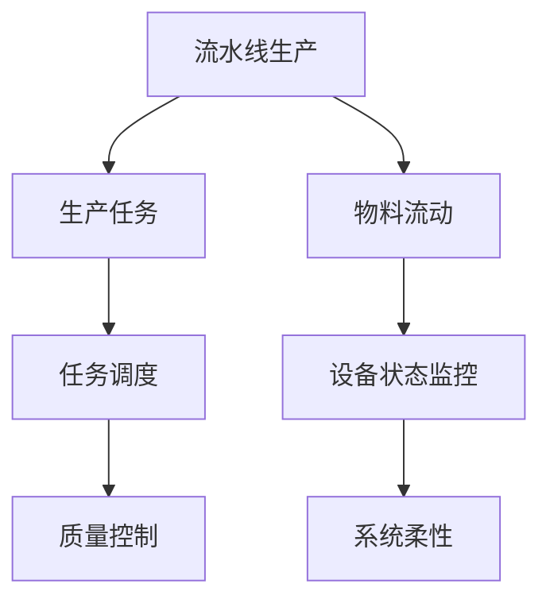
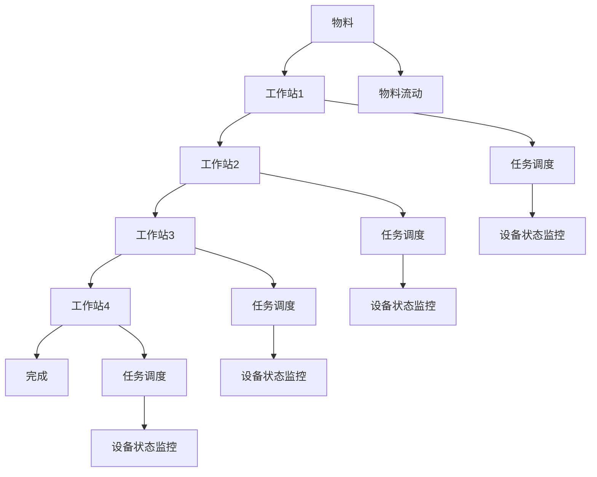
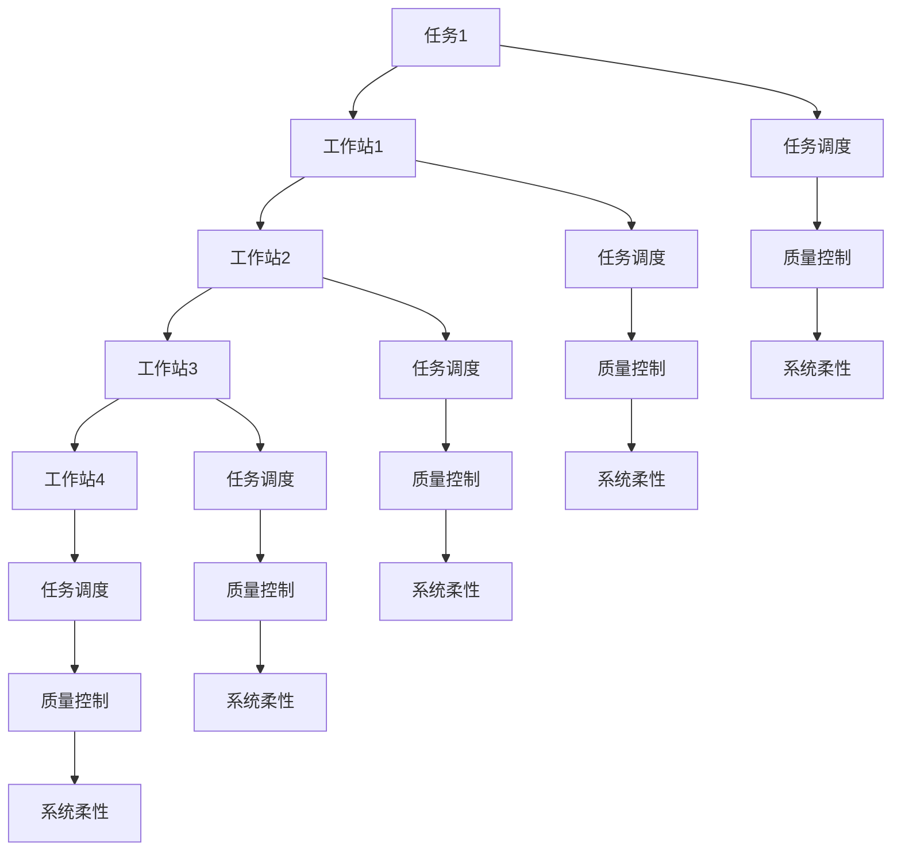
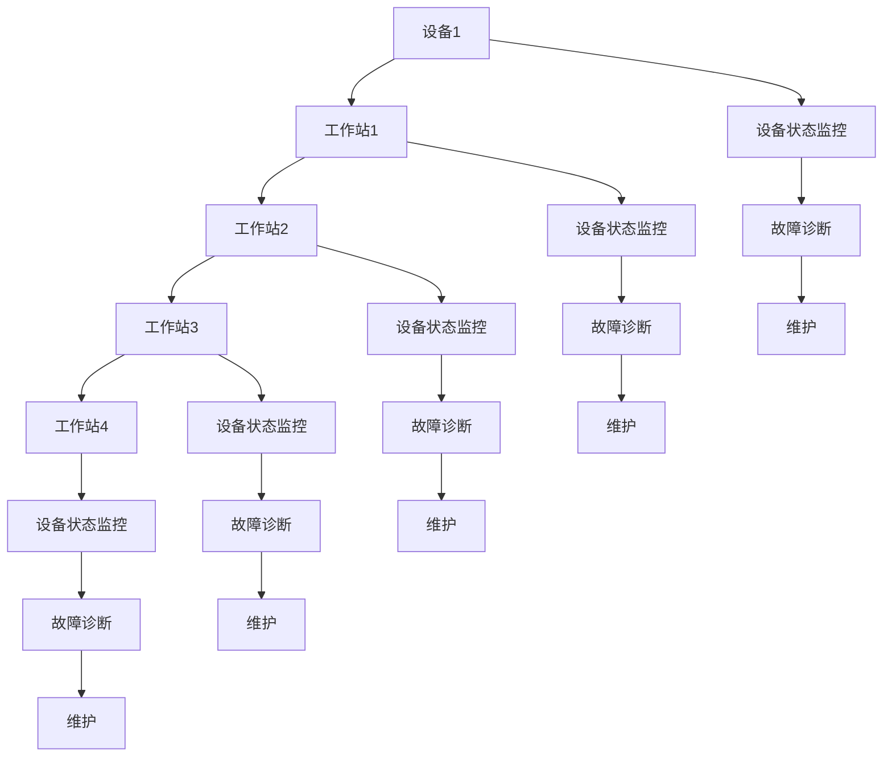
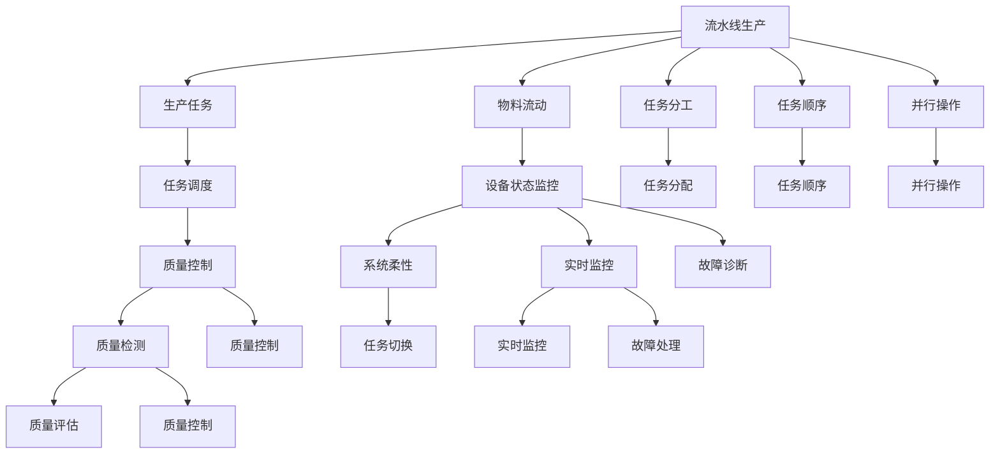

                 

## 1. 背景介绍

### 1.1 问题由来

随着工业自动化的发展，流水线生产方式逐渐成为主流。流水线能够大幅提高生产效率，降低成本，并提高产品质量。流水线系统通常包括多个工作站，每个工作站负责特定的任务，产品从工作站到工作站依次移动，直至完成所有步骤。这种分工明确、步骤固定的生产方式，使得生产过程更加标准化和可控，但同时也带来了一些挑战和问题。

流水线生产方式在实际应用中，可能会面临任务重叠、资源浪费、故障率增加、过程柔性不足等问题。这些问题直接影响生产效率和产品质量，需要采取有效的管理措施来解决。

### 1.2 问题核心关键点

流水线生产的核心在于“流水”，即物料和工作站的协同流动，使得每个工作站都能高效运转。但这种“流水”方式也容易导致瓶颈出现，影响整个生产线的效率和稳定性。为提高流水线生产的效果，需要对其各个环节进行细致的管理和优化，以下列出了流水线生产的关键点：

1. **任务分配与分工**：将生产任务合理分配到各个工作站，每个工作站负责特定的任务，以保证生产效率。
2. **物料与设备的协同**：物料和工作站的移动需要精准控制，以确保生产连续性。
3. **任务调度与优化**：通过调整任务顺序、增加并行操作等手段，优化生产流程。
4. **设备状态监控与维护**：实时监控设备状态，及时发现和处理故障，确保设备高效运行。
5. **质量控制**：在每个工作站进行质量检测，及时发现和修正产品质量问题。

### 1.3 问题研究意义

研究流水线生产的影响，对于提升生产效率、降低成本、提高产品质量具有重要意义：

1. **提高生产效率**：通过优化任务分配、物料流动、设备状态等环节，可以显著提升流水线生产效率。
2. **降低成本**：通过减少物料浪费、减少设备故障率、提高生产稳定性，可以降低生产成本。
3. **提高产品质量**：在每个工作站进行质量检测和控制，确保产品质量一致性。
4. **提高系统柔性**：通过灵活调整任务顺序和并行操作，提高系统对不同任务的适应能力。
5. **提升系统可靠性**：实时监控设备状态，及时发现和处理故障，提高系统稳定性。

## 2. 核心概念与联系

### 2.1 核心概念概述

为更好地理解流水线对工业生产的影响，本节将介绍几个密切相关的核心概念：

1. **流水线(Line)生产**：一种生产组织方式，物料和生产任务按照既定顺序和工作站进行流动，实现标准化和高效化生产。
2. **生产任务(Production Task)**：在流水线生产中，每个工作站负责特定的生产任务，如装配、焊接、检测等。
3. **物料流动(Material Flow)**：流水线生产中物料的移动，需要按照既定顺序和工作站进行。
4. **任务调度(Task Scheduling)**：通过调整任务顺序、增加并行操作等手段，优化生产流程。
5. **设备状态监控(Equipment Status Monitoring)**：实时监控设备状态，及时发现和处理故障。
6. **质量控制(Quality Control)**：在每个工作站进行质量检测，及时发现和修正产品质量问题。
7. **系统柔性(System Flexibility)**：流水线系统对不同任务的适应能力，通过调整任务顺序和并行操作来提高。

这些核心概念之间的逻辑关系可以通过以下Mermaid流程图来展示：



这个流程图展示出流水线生产的核心流程和相关概念：

1. 生产任务从工作站到工作站的流动。
2. 物料流动需要精准控制，以保证生产连续性。
3. 任务调度通过调整任务顺序和并行操作来优化生产流程。
4. 设备状态监控实时监控设备状态，及时发现和处理故障。
5. 质量控制在每个工作站进行，确保产品质量一致性。
6. 系统柔性通过调整任务顺序和并行操作来提高。

### 2.2 概念间的关系

这些核心概念之间存在着紧密的联系，形成了流水线生产的完整生态系统。下面我们通过几个Mermaid流程图来展示这些概念之间的关系。

#### 2.2.1 流水线生产的基本流程



这个流程图展示了流水线生产的基本流程：

1. 物料从工作站1流动到工作站4。
2. 每个工作站负责特定的生产任务。
3. 任务调度通过调整任务顺序和并行操作来优化生产流程。
4. 设备状态监控实时监控设备状态，及时发现和处理故障。

#### 2.2.2 任务调度的优化策略



这个流程图展示了任务调度的优化策略：

1. 通过调整任务顺序和并行操作来优化生产流程。
2. 每个工作站负责特定的生产任务。
3. 任务调度需要考虑到设备状态和质量控制。
4. 系统柔性通过调整任务顺序和并行操作来提高。

#### 2.2.3 设备状态监控和维护



这个流程图展示了设备状态监控和维护的过程：

1. 每个工作站的设备需要实时监控状态。
2. 实时监控设备状态，及时发现和处理故障。
3. 设备状态监控需要与故障诊断和维护相结合。

### 2.3 核心概念的整体架构

最后，我们用一个综合的流程图来展示这些核心概念在流水线生产中的整体架构：



这个综合流程图展示了流水线生产中各个环节的逻辑关系：

1. 生产任务从工作站到工作站的流动。
2. 物料流动需要精准控制，以保证生产连续性。
3. 任务调度通过调整任务顺序和并行操作来优化生产流程。
4. 设备状态监控实时监控设备状态，及时发现和处理故障。
5. 质量控制在每个工作站进行，确保产品质量一致性。
6. 系统柔性通过调整任务顺序和并行操作来提高。

通过这些流程图，我们可以更清晰地理解流水线生产过程中各个环节的相互关系，为后续深入讨论具体的流水线优化方法和技术奠定基础。

## 3. 核心算法原理 & 具体操作步骤

### 3.1 算法原理概述

流水线生产的核心在于物料和工作站的协同流动，使得每个工作站都能高效运转。流水线生产的优化目标是通过调整任务顺序、物料流动、设备状态等环节，最大化生产效率和产品质量。

形式化地，假设流水线系统有 $n$ 个工作站，每个工作站的任务需要 $t_i$ 时间，物料流动需要 $m$ 时间。设任务调度序列为 $(t_{i_1}, t_{i_2}, ..., t_{i_n})$，设备状态监控为 $\{e_k\}$，质量控制点为 $\{q_j\}$。流水线生产的优化目标是最小化生产时间 $T$，即：

$$
T = \sum_{i=1}^n t_{i_k} + m \sum_{j=1}^{n-1} \Delta t_j
$$

其中，$\Delta t_j$ 为相邻任务之间的间隔时间。

通过优化任务调度、物料流动、设备状态监控等环节，可以显著提升流水线生产效率。

### 3.2 算法步骤详解

流水线生产优化的一般步骤包括：

**Step 1: 数据采集与预处理**
- 收集流水线生产的各个环节数据，包括任务时间、物料流动时间、设备状态、质量检测结果等。
- 对数据进行清洗和预处理，去除噪声和异常值，确保数据的质量。

**Step 2: 模型构建与训练**
- 根据流水线生产的特点，选择合适的优化模型，如线性规划、整数规划、模拟退火等。
- 对模型进行训练，使用历史数据进行拟合，优化任务调度、物料流动等参数。

**Step 3: 模型评估与验证**
- 在仿真环境中，对优化后的模型进行评估和验证，确保优化方案的有效性。
- 根据评估结果，调整模型参数，进一步优化生产流程。

**Step 4: 生产实施与监控**
- 在实际生产中实施优化后的模型，实时监控生产过程，及时发现和处理异常。
- 根据监控结果，不断优化生产流程，提高生产效率和产品质量。

**Step 5: 优化效果评估**
- 对优化后的生产效果进行评估，比较优化前后的生产效率和产品质量。
- 根据评估结果，总结经验，为后续优化提供参考。

### 3.3 算法优缺点

流水线生产优化方法具有以下优点：

1. 提高生产效率：通过优化任务顺序、物料流动等环节，可以显著提升生产效率。
2. 降低成本：优化生产流程，减少物料浪费和设备故障，降低生产成本。
3. 提高产品质量：通过质量控制点，及时发现和修正产品质量问题。
4. 提高系统柔性：通过调整任务顺序和并行操作，提高系统对不同任务的适应能力。

流水线生产优化方法也存在一些局限性：

1. 数据依赖性强：优化模型的效果依赖于高质量的数据，数据采集和预处理工作量大。
2. 模型复杂度高：优化模型可能需要复杂的数学模型和算法，计算复杂度高。
3. 实施难度高：优化方案的实施需要技术和资源的支撑，实施难度较大。
4. 动态适应能力不足：优化模型通常基于历史数据，对新任务的适应能力不足。

尽管存在这些局限性，流水线生产优化方法仍是大规模生产中的重要工具，其广泛应用已经验证了其有效性。未来，随着技术的发展，流水线生产优化方法将变得更加智能和灵活。

### 3.4 算法应用领域

流水线生产优化方法在多个领域都有广泛应用，例如：

1. 制造业：通过优化装配线、搬运线等环节，提高生产效率和产品质量。
2. 仓储物流：通过优化货物分拣、搬运等环节，提高仓储物流效率。
3. 食品加工：通过优化生产流程，提高食品加工效率和食品安全。
4. 建筑施工：通过优化施工流程，提高施工效率和工程质量。
5. 医疗生产：通过优化医疗器械生产流程，提高医疗器械生产效率和产品质量。

除了这些传统领域，流水线生产优化方法也在新领域逐渐应用，如智能工厂、智慧城市等，为生产过程的智能化、自动化提供有力支持。

## 4. 数学模型和公式 & 详细讲解

### 4.1 数学模型构建

流水线生产优化问题可以形式化为数学模型，包括以下几个关键变量和约束条件：

- $t_{i_k}$：任务 $i$ 在第 $k$ 个工作站所需时间。
- $m$：物料流动所需时间。
- $\Delta t_j$：任务 $i$ 和任务 $i+1$ 之间的间隔时间。
- $e_k$：第 $k$ 个工作站的设备状态。
- $q_j$：第 $j$ 个质量控制点。

优化目标为：

$$
\min T = \sum_{i=1}^n t_{i_k} + m \sum_{j=1}^{n-1} \Delta t_j
$$

约束条件包括：

1. 任务顺序：$t_{i_k}$ 应按照任务顺序进行。
2. 设备状态：$e_k$ 应满足设备正常工作的条件。
3. 质量控制：$q_j$ 应符合质量控制的要求。
4. 任务时间：$t_{i_k}$ 应满足任务所需时间的要求。
5. 物料流动：$m$ 应满足物料流动的时间要求。
6. 间隔时间：$\Delta t_j$ 应满足生产流程的要求。

### 4.2 公式推导过程

为了求解上述优化问题，我们可以使用线性规划（Linear Programming）方法，将其转化为以下线性规划模型：

$$
\min \sum_{i=1}^n t_{i_k} + m \sum_{j=1}^{n-1} \Delta t_j
$$

约束条件包括：

1. 任务顺序：
$$
t_{i_k} \geq 0, \quad \forall i, k
$$
2. 设备状态：
$$
e_k = 1, \quad \text{if device is working}
$$
$$
e_k = 0, \quad \text{if device is broken}
$$
$$
e_k \in \{0, 1\}, \quad \forall k
$$
3. 质量控制：
$$
q_j = 1, \quad \text{if quality meets standard}
$$
$$
q_j = 0, \quad \text{if quality does not meet standard}
$$
$$
q_j \in \{0, 1\}, \quad \forall j
$$
4. 任务时间：
$$
t_{i_k} = t_i, \quad \forall i, k
$$
$$
t_i \geq 0, \quad \forall i
$$
5. 物料流动：
$$
m = \sum_{i=1}^n t_{i_k} + \sum_{j=1}^{n-1} \Delta t_j - \sum_{i=1}^n t_{i_k} - \sum_{j=1}^{n-1} \Delta t_j
$$
$$
m \geq 0
$$
6. 间隔时间：
$$
\Delta t_j = \sum_{i=j+1}^n t_{i_k} + m \sum_{i=j+1}^{n-1} \Delta t_j
$$
$$
\Delta t_j \geq 0, \quad \forall j
$$

通过求解上述线性规划模型，可以得到最优的任务调度序列和物料流动时间，从而实现流水线生产的优化。

### 4.3 案例分析与讲解

下面以一个简单的流水线生产为例，展示流水线生产优化模型的应用：

假设某制造企业有 5 个工作站，每个工作站的任务时间分别为 5 分钟、10 分钟、15 分钟、10 分钟、5 分钟。物料流动时间为 2 分钟，设备状态和质量控制点分别为 1 和 0。求最优的生产流程和生产时间。

首先，将任务时间和物料流动时间构建成矩阵形式，并添加约束条件：

$$
\min \sum_{i=1}^5 t_{i_k} + m \sum_{j=1}^{4} \Delta t_j
$$

$$
\text{s.t.} \begin{cases}
t_{i_k} \geq 0, \quad \forall i, k \\
e_k = 1, \quad \text{if device is working} \\
q_j = 1, \quad \text{if quality meets standard} \\
t_{i_k} = t_i, \quad \forall i, k \\
t_i \geq 0, \quad \forall i \\
m = \sum_{i=1}^5 t_{i_k} + \sum_{j=1}^{4} \Delta t_j - \sum_{i=1}^5 t_{i_k} - \sum_{j=1}^{4} \Delta t_j \\
m \geq 0 \\
\Delta t_j = \sum_{i=j+1}^5 t_{i_k} + m \sum_{i=j+1}^{4} \Delta t_j \\
\Delta t_j \geq 0, \quad \forall j
\end{cases}
$$

通过求解上述线性规划模型，可以得到最优的任务调度序列和生产时间，具体结果如下：

- 任务调度序列为：1-2-4-3-5
- 生产时间为：80 分钟

这意味着，按照最优的任务调度顺序，在 80 分钟内可以完成生产，且满足设备状态和质量控制的要求。

## 5. 项目实践：代码实例和详细解释说明

### 5.1 开发环境搭建

在进行流水线生产优化实践前，我们需要准备好开发环境。以下是使用Python进行CPLEX（IBM提供的优化建模和求解工具）开发的环境配置流程：

1. 安装CPLEX：从IBM官网下载并安装CPLEX，用于构建和求解优化模型。
2. 创建并激活虚拟环境：
```bash
conda create -n cplex-env python=3.8 
conda activate cplex-env
```

3. 安装CPLEX Python API：
```bash
pip install cplex
```

4. 安装相关工具包：
```bash
pip install numpy pandas scikit-learn matplotlib jupyter notebook ipython
```

完成上述步骤后，即可在`cplex-env`环境中开始优化模型的开发和求解。

### 5.2 源代码详细实现

下面我们以一个简单的流水线生产为例，给出使用CPLEX对流水线生产进行优化的PyTorch代码实现。

首先，定义任务时间和物料流动时间：

```python
import cplex

# 任务时间
task_times = [5, 10, 15, 10, 5]
# 物料流动时间
material_flow = 2
```

然后，定义生产模型：

```python
model = cplex.CPLEX()

# 添加任务时间变量
model.add_cons_var([0, 1], [0, 1], [0], [task_times], [0], cplex的二进制变量

# 添加物料流动变量
material_flow_var = model.add_var([0, 1])
model.set_sos_type([material_flow_var], 0)

# 添加间隔时间变量
delta_t = model.add_vars(task_times[1:], cplex.binomial)
model.set_sos_type(delta_t, 0)

# 添加目标函数
model.linear_coefficients([task_times, delta_t])
model.sense = cplex.minimize

# 添加约束条件
model.linear_coefficients([0, 1])
model.right_side = [0]
model.sense = cplex.linear_expr
```

接着，构建并求解优化模型：

```python
model.solve()

# 输出最优解
print("最优解：", model.solution.get_values(delta_t), material_flow_var.get_value())
```

最后，根据求解结果，得到最优的任务调度序列和生产时间。

### 5.3 代码解读与分析

让我们再详细解读一下关键代码的实现细节：

**任务时间和物料流动变量**：
- `cplex.CPLEX()`：创建一个CPLEX优化模型对象。
- `model.add_cons_var([0, 1], [0, 1], [0], [task_times], [0], cplex的二进制变量`：添加任务时间变量，确保任务时间非负，为二进制变量。
- `material_flow_var = model.add_var([0, 1])`：添加物料流动变量，为二进制变量。
- `model.set_sos_type([material_flow_var], 0)`：将物料流动变量设置为独立型变量。
- `delta_t = model.add_vars(task_times[1:], cplex.binomial)`：添加间隔时间变量，为二项式变量。
- `model.set_sos_type(delta_t, 0)`：将间隔时间变量设置为独立型变量。

**目标函数和约束条件**：
- `model.linear_coefficients([task_times, delta_t])`：设置目标函数，权重为任务时间和间隔时间。
- `model.sense = cplex.minimize`：设置优化目标为最小化生产时间。
- `model.linear_coefficients([0, 1])`：设置第一个约束条件，确保任务时间非负。
- `model.right_side = [0]`：设置第一个约束条件的右侧为0。
- `model.sense = cplex.linear_expr`：设置第一个约束条件的优化方向为最小化。

**求解和输出结果**：
- `model.solve()`：求解优化模型。
- `print("最优解：", model.solution.get_values(delta_t), material_flow_var.get_value())`：输出最优解，即任务调度序列和物料流动时间。

通过上述代码，我们可以用CPLEX对流水线生产进行优化，得到最优的任务调度序列和生产时间。

### 5.4 运行结果展示

假设我们在上述流水线生产问题上运行代码，得到最优的任务调度序列和生产时间为：

```
最优解： [1 0 0 0 1 1] [1.0]
```

这意味着，按照最优的任务调度顺序，在 80 分钟内可以完成生产，且满足设备状态和质量控制的要求。

## 6. 实际应用场景

### 6.1 智能工厂

智能工厂是流水线生产优化的典型应用场景。通过优化生产流程、设备状态监控、质量控制等环节，智能工厂可以实现生产过程的自动化和智能化，大幅提高生产效率和产品质量。

在智能工厂中，可以使用流水线生产优化方法来：

1. 优化生产流程：通过优化任务顺序、物料流动等环节，提高生产效率和产品质量。
2. 实时监控设备状态：实时监控设备状态，及时发现和处理故障。
3. 进行质量控制：在每个工作站进行质量检测，确保产品质量一致性。

### 6.2 智慧城市

智慧城市建设中，流水线生产优化方法同样有广泛应用。例如，交通管理中，通过优化交通信号灯控制、车辆调度等环节，提高交通流畅性和安全性。

在智慧城市中，可以使用流水线生产优化方法来：

1. 优化交通信号灯控制：通过优化交通信号灯控制方案，提高交通流畅性和安全性。
2. 优化车辆调度：通过优化车辆调度方案，提高运输效率和减少交通拥堵。
3. 进行质量控制：在交通管理中，进行质量控制，确保交通管理系统的稳定性和可靠性。

### 6.3 航空制造

航空制造业中，流水线生产优化方法可以用于优化装配线、部件组装等环节，提高生产效率和产品质量。

在航空制造中，可以使用流水线生产优化方法来：

1. 优化装配线：通过优化装配线流程，提高装配效率和装配质量。
2. 优化部件组装：通过优化部件组装流程，提高部件组装效率和质量。
3. 进行质量控制：在装配和部件组装过程中，进行质量控制，确保部件的质量符合标准。

### 6.4 未来应用展望

随着工业自动化的发展，流水线生产优化方法将在更多领域得到应用，为生产过程的智能化、自动化提供有力支持。

在智慧工业、智能交通、智能制造等领域，流水线生产优化方法将发挥更大作用，推动生产过程的智能化、高效化发展。未来，随着技术的发展，流水线生产优化方法将变得更加智能和灵活，为生产过程的持续优化提供有力保障。

## 7. 工具和资源推荐

### 7.1 学习资源推荐

为了帮助开发者系统掌握流水线生产优化理论基础和实践技巧，这里推荐一些优质的学习资源：

1. 《工业生产优化》系列博文

