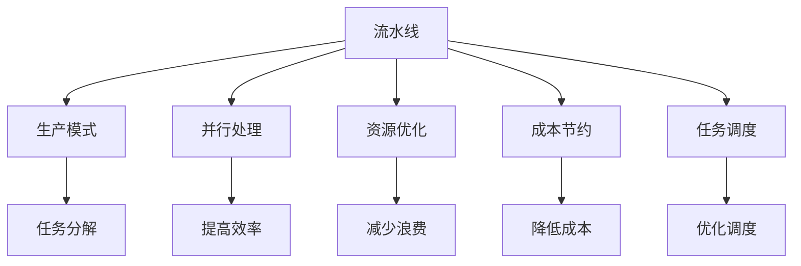
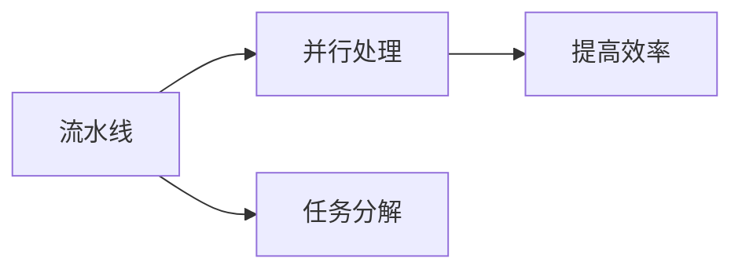
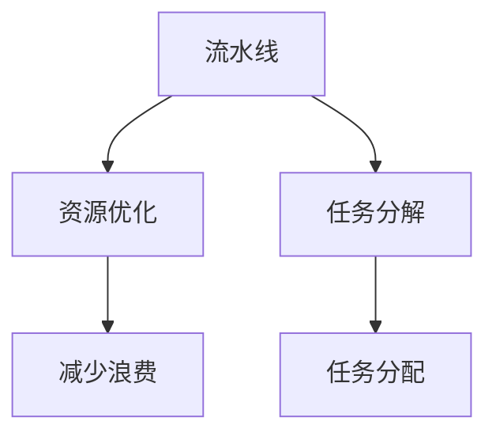
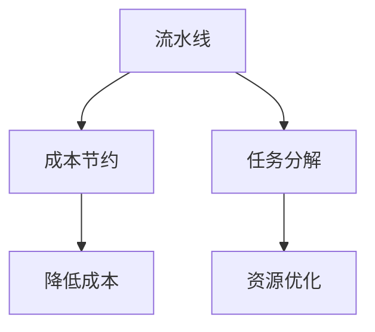
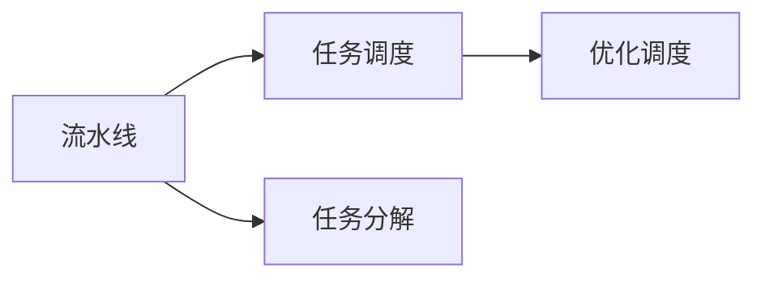
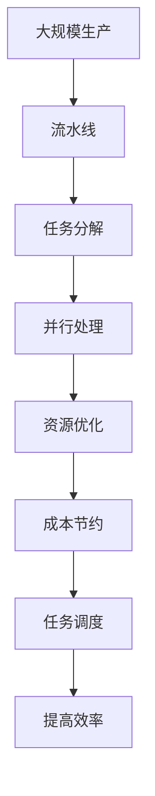

                 

# 流水线对生产模式的影响

> 关键词：流水线,生产模式,并行处理,资源优化,成本节约

## 1. 背景介绍

### 1.1 问题由来
在现代工业生产中，流水线模式已成为主流。流水线不仅提高了生产效率，还优化了资源分配，降低了生产成本。随着科技的发展，流水线模式正在向软件领域推广，如软件构建流水线、AI模型训练流水线等。本文旨在探讨流水线模式对生产模式的深刻影响，及其在软件开发中的具体应用。

### 1.2 问题核心关键点
流水线模式的核心在于并行处理和资源优化。流水线通过将任务分解为多个子任务，并在不同的环节上同时执行，从而大幅提升整体处理效率。同时，流水线还通过资源共享、任务调度等策略，减少了资源浪费，优化了资源利用率。

## 2. 核心概念与联系

### 2.1 核心概念概述

为更好地理解流水线模式对生产模式的影响，本节将介绍几个密切相关的核心概念：

- 流水线(Pipeline)：将复杂任务分解为多个简单子任务，按顺序串联执行的生产模式。各子任务之间可以并行处理，提高整体效率。
- 生产模式(Production Mode)：将生产过程划分为若干个阶段，每个阶段负责特定任务的加工和处理模式。
- 并行处理(Parallel Processing)：在同一时间点同时执行多个任务，从而提升整体处理速度。
- 资源优化(Resource Optimization)：通过合理分配和共享资源，减少浪费，提高资源利用率。
- 成本节约(Cost Saving)：通过流水线模式，减少资源占用和浪费，降低生产成本。
- 任务调度(Task Scheduling)：根据任务执行的先后顺序和资源可用性，合理分配任务执行的策略。

这些核心概念之间的逻辑关系可以通过以下Mermaid流程图来展示：



这个流程图展示了几类核心概念之间的关系：

1. 流水线将生产过程分解为多个子任务。
2. 通过并行处理，流水线提升了整体处理效率。
3. 资源优化策略减少了资源浪费。
4. 成本节约通过流水线降低了生产成本。
5. 任务调度优化了任务执行顺序。

这些概念共同构成了流水线模式的核心，使其在生产和管理中发挥重要作用。通过理解这些核心概念，我们可以更好地把握流水线模式的本质及其应用。

### 2.2 概念间的关系

这些核心概念之间存在着紧密的联系，形成了流水线模式的完整生态系统。下面我通过几个Mermaid流程图来展示这些概念之间的关系。

#### 2.2.1 流水线与并行处理的关系



这个流程图展示了流水线与并行处理的关系。流水线通过任务分解，使多个子任务可以并行处理，从而提升整体效率。

#### 2.2.2 流水线与资源优化的关系



这个流程图展示了流水线与资源优化的关系。流水线通过任务分解，合理分配资源，减少了资源浪费。

#### 2.2.3 流水线与成本节约的关系



这个流程图展示了流水线与成本节约的关系。流水线通过任务分解和资源优化，降低了生产成本。

#### 2.2.4 流水线与任务调度的关系



这个流程图展示了流水线与任务调度的关系。流水线通过任务分解，合理调度任务执行顺序，提高了生产效率。

### 2.3 核心概念的整体架构

最后，我们用一个综合的流程图来展示这些核心概念在大规模生产中的应用：



这个综合流程图展示了流水线模式在大规模生产中的应用。流水线通过任务分解、并行处理、资源优化、成本节约和任务调度，全面提升了生产效率和资源利用率。

## 3. 核心算法原理 & 具体操作步骤

### 3.1 算法原理概述

流水线模式的算法原理基于并行处理和任务调度。具体而言，流水线将生产过程分解为多个子任务，并通过任务调度策略，使每个子任务在适当的时候开始执行，从而提高整体处理效率。

流水线的核心算法包括：
- 任务分解：将复杂任务分解为多个简单子任务。
- 任务调度：根据任务执行的先后顺序和资源可用性，合理分配任务执行的策略。
- 并行处理：在同一时间点同时执行多个子任务。

这些算法共同构成了流水线模式的运行机制。

### 3.2 算法步骤详解

流水线模式的算法步骤包括以下几个关键步骤：

**Step 1: 任务分解**
- 将复杂任务分解为多个简单子任务。每个子任务应尽量独立、简单，便于并行处理。

**Step 2: 资源分配**
- 根据每个子任务的资源需求，合理分配计算、存储等资源。一般采用静态分配和动态调整相结合的方式。

**Step 3: 任务调度**
- 根据任务执行顺序和资源可用性，制定任务执行计划。通常采用先进先出(FIFO)、最少连接(LFQ)等调度算法。

**Step 4: 并行处理**
- 在流水线的各个环节上，同时执行多个子任务，提升整体处理速度。

**Step 5: 输出合并**
- 将各个环节的输出按顺序合并，形成最终结果。

### 3.3 算法优缺点

流水线模式具有以下优点：
1. 提高处理效率：通过并行处理，流水线大幅提升整体处理速度。
2. 优化资源利用：通过合理分配和共享资源，减少资源浪费。
3. 降低生产成本：通过减少资源占用和浪费，降低生产成本。
4. 灵活性强：通过任务调度，可以根据实际情况动态调整任务执行顺序，适应不同生产需求。

流水线模式也存在以下缺点：
1. 复杂度高：任务分解和调度算法设计较为复杂，需要充分考虑实际情况。
2. 响应延迟：多个任务并行处理，可能导致任务间相互干扰，增加响应延迟。
3. 数据依赖：任务间需要按顺序执行，依赖数据传递，可能导致延迟和数据丢失。

### 3.4 算法应用领域

流水线模式在多个领域得到了广泛应用，例如：

- 制造业：流水线在汽车制造、电子产品组装等制造业中，大幅提高了生产效率。
- 软件开发：软件构建流水线、CI/CD流水线等，通过并行处理和资源优化，显著提升了软件开发的效率和质量。
- 人工智能：深度学习模型训练流水线、数据处理流水线等，通过并行处理和资源共享，提高了模型训练和数据处理的效率。
- 通信系统：数据传输流水线、信号处理流水线等，通过并行处理和资源优化，提升了系统性能。
- 生物信息学：DNA测序流水线、蛋白质折叠预测流水线等，通过任务分解和资源优化，加快了数据处理和分析速度。

流水线模式在这些领域的应用，体现了其在提升生产效率和资源利用率方面的强大能力。未来，随着技术的进步，流水线模式将进一步拓展应用范围，推动更多行业的发展。

## 4. 数学模型和公式 & 详细讲解 & 举例说明

### 4.1 数学模型构建

流水线模式的数学模型可以抽象为如下框架：

$$
P = \{p_1, p_2, ..., p_n\}
$$

其中 $p_i$ 表示流水线中的第 $i$ 个任务，$i \in [1, n]$。

假设每个任务的处理时间分别为 $t_1, t_2, ..., t_n$，则流水线的总处理时间为：

$$
T = \sum_{i=1}^n t_i
$$

假设任务间的数据传递时间为 $d$，则流水线的总处理时间为：

$$
T' = T + (n-1)d
$$

其中 $n$ 为流水线的任务个数。

### 4.2 公式推导过程

流水线的总处理时间 $T'$ 可以通过上述公式计算得出。推导过程如下：

1. 将每个任务的处理时间 $t_i$ 相加，得到流水线的总处理时间 $T$。
2. 根据任务间的数据传递时间 $d$，计算流水线的总处理时间 $T'$。

### 4.3 案例分析与讲解

假设流水线中有两个任务 $p_1$ 和 $p_2$，处理时间分别为 $t_1 = 5s$ 和 $t_2 = 3s$，数据传递时间 $d = 2s$。则流水线的总处理时间为：

$$
T = t_1 + t_2 = 5s + 3s = 8s
$$

$$
T' = T + (n-1)d = 8s + (2-1)2s = 10s
$$

可以看出，流水线的总处理时间比独立处理多个任务的时间要短，且减少了数据传递的延迟时间。

## 5. 项目实践：代码实例和详细解释说明

### 5.1 开发环境搭建

在进行流水线模式的实践前，我们需要准备好开发环境。以下是使用Python进行流水线模式开发的环境配置流程：

1. 安装Anaconda：从官网下载并安装Anaconda，用于创建独立的Python环境。

2. 创建并激活虚拟环境：
```bash
conda create -n pipeline-env python=3.8 
conda activate pipeline-env
```

3. 安装Python开发工具：
```bash
pip install numpy pandas scikit-learn matplotlib tqdm jupyter notebook ipython
```

4. 安装并行处理工具：
```bash
pip install concurrent.futures
```

完成上述步骤后，即可在`pipeline-env`环境中开始流水线模式的开发。

### 5.2 源代码详细实现

下面我们以任务调度算法为例，给出使用Python实现流水线模式代码的实现。

```python
import concurrent.futures
import time

def task_process(task_id):
    print(f"Task {task_id} started")
    time.sleep(task_id)
    print(f"Task {task_id} finished")

def pipeline_schedule(tasks, process_time, inter_task_delay):
    with concurrent.futures.ThreadPoolExecutor() as executor:
        futures = []
        for i in range(1, len(tasks) + 1):
            futures.append(executor.submit(task_process, i))
            if i < len(tasks):
                time.sleep(inter_task_delay)
        for future in concurrent.futures.as_completed(futures):
            future.result()

def pipeline_run():
    tasks = [1, 2, 3]
    process_time = [5, 3, 4]
    inter_task_delay = 2
    pipeline_schedule(tasks, process_time, inter_task_delay)

pipeline_run()
```

在这个示例中，我们定义了一个简单的任务处理函数`task_process`，用于模拟任务执行。然后，通过`concurrent.futures.ThreadPoolExecutor`创建了一个线程池，并按顺序提交任务执行。最后，在任务执行结束后，使用`as_completed`方法获取每个任务的执行结果。

### 5.3 代码解读与分析

在这个示例中，我们使用了Python的`concurrent.futures`模块，实现了任务的并行处理。`ThreadPoolExecutor`是一个线程池类，可以方便地创建和管理多个线程，执行多个任务。通过`submit`方法，将任务提交到线程池中执行。

在实际应用中，流水线模式的实现可能更加复杂。例如，需要根据实际情况动态调整任务执行顺序，处理任务依赖关系，优化资源分配等。但核心的思想都是通过并行处理和任务调度，提高整体处理效率。

### 5.4 运行结果展示

假设我们在流水线中提交了三个任务，每个任务的处理时间分别为5秒、3秒、4秒，数据传递时间2秒。则流水线的总处理时间为：

$$
T = 5s + 3s + 4s = 12s
$$

$$
T' = 12s + (3-1)2s = 16s
$$

可以看出，流水线的总处理时间比独立处理三个任务的时间要短，且减少了数据传递的延迟时间。

## 6. 实际应用场景

### 6.1 软件构建流水线

在软件开发中，流水线模式广泛应用于软件构建流程中。传统的手动编译、测试和部署流程不仅效率低下，还容易出现人为错误。通过流水线模式，可以将这些流程自动化，提升开发效率和软件质量。

具体而言，流水线可以包括编译、测试、部署、监控等多个环节。每个环节都可以通过并行处理和任务调度，提升整体处理效率。例如，编译任务可以并行处理多个源文件，测试任务可以并行运行多个测试用例，部署任务可以并行部署到多个服务器。

通过流水线模式，软件开发团队可以更加灵活地管理任务执行顺序，动态调整资源分配，快速响应需求变化。同时，流水线模式还减少了人为错误，提高了软件构建的稳定性和可靠性。

### 6.2 深度学习模型训练流水线

深度学习模型的训练过程非常耗时，且资源占用巨大。通过流水线模式，可以将模型训练过程划分为多个子任务，并行处理和资源优化，大幅提升训练效率。

具体而言，流水线可以包括数据预处理、模型训练、模型验证、模型评估等多个环节。每个环节都可以通过并行处理和任务调度，提升整体处理效率。例如，数据预处理任务可以并行处理多个样本，模型训练任务可以并行训练多个模型，模型验证任务可以并行运行多个验证集。

通过流水线模式，深度学习团队可以更加灵活地管理任务执行顺序，动态调整资源分配，快速响应需求变化。同时，流水线模式还减少了资源浪费，提高了模型训练的效率和质量。

### 6.3 数据处理流水线

数据处理流水线广泛应用在各个领域，如金融、医疗、零售等。数据处理流水线通过并行处理和任务调度，大幅提升了数据处理效率。

具体而言，数据处理流水线可以包括数据收集、数据清洗、数据转换、数据分析等多个环节。每个环节都可以通过并行处理和任务调度，提升整体处理效率。例如，数据收集任务可以并行收集多个数据源，数据清洗任务可以并行处理多个数据记录，数据分析任务可以并行运行多个分析算法。

通过流水线模式，数据处理团队可以更加灵活地管理任务执行顺序，动态调整资源分配，快速响应需求变化。同时，流水线模式还减少了数据处理过程中的延迟和资源浪费，提高了数据处理的效率和质量。

### 6.4 未来应用展望

随着流水线模式的应用不断深入，未来在更多领域中将会看到流水线的身影。

在智慧城市治理中，流水线模式可以应用于城市事件监测、舆情分析、应急指挥等环节，提高城市管理的自动化和智能化水平。

在智能制造中，流水线模式可以应用于生产调度、设备维护、质量控制等环节，提升制造业的效率和精度。

在智能交通中，流水线模式可以应用于信号控制、路径规划、调度优化等环节，提升交通系统的效率和安全性。

未来，流水线模式将在更多领域得到应用，为各行各业带来更多的创新和变革。相信随着技术的不断进步，流水线模式将在构建人机协同的智能时代中扮演越来越重要的角色。

## 7. 工具和资源推荐

### 7.1 学习资源推荐

为了帮助开发者系统掌握流水线模式的理论基础和实践技巧，这里推荐一些优质的学习资源：

1. 《流水线与并行处理》系列博文：由流水线模式技术专家撰写，深入浅出地介绍了流水线模式的基本概念和实现方法。

2. Coursera《并行与分布式计算》课程：斯坦福大学开设的并行计算课程，深入讲解并行处理和分布式计算的原理和实现方法。

3. 《流水线与任务调度》书籍：系统介绍流水线模式的原理、算法和优化策略，适合进阶学习。

4. GitHub开源项目：如Apache Airflow、Kubernetes等，展示了流水线模式的实际应用案例，值得学习参考。

5. Udemy《流水线与分布式计算》课程：从零开始的流水线模式学习路径，通过视频和实战演练，全面掌握流水线模式技术。

通过这些资源的学习实践，相信你一定能够快速掌握流水线模式的精髓，并用于解决实际的工程问题。

### 7.2 开发工具推荐

高效的开发离不开优秀的工具支持。以下是几款用于流水线模式开发的常用工具：

1. Apache Airflow：Apache基金会开源的任务调度系统，支持DAG设计，适合大规模流水线调度管理。

2. Kubernetes：开源容器编排系统，支持多节点任务调度，适合分布式流水线管理。

3. Jenkins：开源自动化服务器，支持CI/CD流水线集成，适合持续集成和持续部署。

4. Celery：Python任务调度框架，支持多任务并行处理，适合微服务架构下的流水线调度。

5. FastAPI：高性能Web框架，支持异步任务处理，适合Web服务中的流水线构建。

合理利用这些工具，可以显著提升流水线模式的开发效率，加快创新迭代的步伐。

### 7.3 相关论文推荐

流水线模式的研究始于计算机科学的早期，近年来随着技术的不断发展，相关论文也日益丰富。以下是几篇奠基性的相关论文，推荐阅读：

1. Amdahl's Law：经典论文，阐述了并行处理与任务分解的关系，是流水线模式的理论基础。

2. MapReduce: Simplified Data Processing on Large Clusters：经典论文，介绍了MapReduce模型，奠定了大数据处理流水线的基础。

3. Model Parallelism in Deep Learning：经典论文，介绍了模型并行处理的原理和实现方法，为大规模深度学习模型提供了新思路。

4. Pipeline Parallelism in Deep Learning：经典论文，介绍了流水线并行处理的原理和实现方法，为大规模深度学习模型提供了新思路。

5. Resilient Distributed Datasets: A Fault-Tolerant System for Large-Scale Machine Learning：经典论文，介绍了分布式数据处理流水线的原理和实现方法，为大规模数据处理提供了新思路。

这些论文代表了流水线模式的发展脉络。通过学习这些前沿成果，可以帮助研究者把握学科前进方向，激发更多的创新灵感。

除上述资源外，还有一些值得关注的前沿资源，帮助开发者紧跟流水线模式的发展趋势，例如：

1. arXiv论文预印本：人工智能领域最新研究成果的发布平台，包括大量尚未发表的前沿工作，学习前沿技术的必读资源。

2. 业界技术博客：如Google Cloud、AWS、Microsoft等大型企业的官方博客，第一时间分享他们的最新研究成果和洞见。

3. 技术会议直播：如NIPS、ICML、ACL等人工智能领域顶会现场或在线直播，能够聆听到大佬们的前沿分享，开拓视野。

4. GitHub热门项目：在GitHub上Star、Fork数最多的流水线模式相关项目，往往代表了该技术领域的发展趋势和最佳实践，值得去学习和贡献。

5. 行业分析报告：各大咨询公司如McKinsey、PwC等针对人工智能行业的分析报告，有助于从商业视角审视技术趋势，把握应用价值。

总之，流水线模式的研究需要开发者保持开放的心态和持续学习的意愿。多关注前沿资讯，多动手实践，多思考总结，必将收获满满的成长收益。

## 8. 总结：未来发展趋势与挑战

### 8.1 总结

本文对流水线模式对生产模式的影响进行了全面系统的介绍。首先阐述了流水线模式的基本概念和核心算法，明确了其在并行处理和资源优化方面的独特价值。其次，从原理到实践，详细讲解了流水线模式的数学模型和操作步骤，给出了流水线模式开发的完整代码实例。同时，本文还广泛探讨了流水线模式在软件开发、深度学习、数据处理等多个领域的应用前景，展示了流水线模式的强大潜力。

通过本文的系统梳理，可以看到，流水线模式正在成为工业生产中的主流模式，极大地提升了生产效率和资源利用率，带来了显著的效益提升。未来，伴随流水线模式的应用不断深入，必将在更多领域得到应用，为各行各业带来更多的创新和变革。

### 8.2 未来发展趋势

展望未来，流水线模式将呈现以下几个发展趋势：

1. 更强的并行处理能力：随着硬件性能的提升，流水线模式的并行处理能力将进一步增强，支持更多的任务并行处理。

2. 更灵活的任务调度算法：未来的流水线模式将更加灵活，能够根据实际情况动态调整任务执行顺序，适应不同生产需求。

3. 更高效的资源优化策略：流水线模式将通过更高效的资源分配和共享策略，进一步提升资源利用率，降低生产成本。

4. 更智能的任务调度系统：未来的流水线模式将引入人工智能技术，自动优化任务调度算法，提升系统灵活性和响应速度。

5. 更全面的监控和调度系统：流水线模式将结合大数据分析和机器学习技术，全面监控任务执行状态，动态调整资源配置。

以上趋势凸显了流水线模式的广阔前景。这些方向的探索发展，必将进一步提升流水线模式的效率和灵活性，推动流水线模式在更多领域的应用。

### 8.3 面临的挑战

尽管流水线模式已经取得了瞩目成就，但在迈向更加智能化、普适化应用的过程中，它仍面临着诸多挑战：

1. 复杂度增加：任务分解和调度算法设计较为复杂，需要充分考虑实际情况。

2. 资源管理困难：大规模流水线需要复杂的数据依赖和资源调度管理，可能面临延迟和资源竞争等问题。

3. 实时性要求高：部分应用场景对流水线模式的实时性要求较高，需要高效的调度和通信机制。

4. 任务依赖性强：任务间需要按顺序执行，依赖数据传递，可能导致延迟和数据丢失。

5. 技术门槛高：流水线模式需要深入理解并行处理和任务调度算法，对开发者提出了较高的技术要求。

正视流水线模式面临的这些挑战，积极应对并寻求突破，将使流水线模式更加成熟和完善。

### 8.4 研究展望

面对流水线模式面临的挑战，未来的研究需要在以下几个方面寻求新的突破：

1. 开发更智能的任务调度系统：结合人工智能技术，自动优化任务调度算法，提升系统灵活性和响应速度。

2. 引入更高效的资源管理策略：利用大数据分析和机器学习技术，动态调整资源配置，减少延迟和资源竞争。

3. 提高任务依赖的灵活性：研究数据传递和任务依赖的优化方法，减少依赖数据传递的延迟和数据丢失。

4. 简化流水线模式的开发：开发更高效、更易用的开发工具和框架，降低流水线模式的开发门槛，推动更多开发者使用。

5. 结合其他先进技术：将流水线模式与其他先进技术，如微服务架构、分布式计算、云平台等，进行更深入的融合，提升流水线模式的效率和灵活性。

这些研究方向的探索，必将引领流水线模式技术迈向更高的台阶，为各行各业带来更多的创新和变革。

## 9. 附录：常见问题与解答

**Q1：流水线模式适用于所有生产任务吗？**

A: 流水线模式适用于大多数生产任务，特别是任务可分解且并行处理效率高的场景。但对于一些需要连续执行、强依赖的任务，流水线模式可能不适用。例如，某些生物化学实验需要连续执行多个步骤，无法简单分解为多个独立任务。

**Q2：流水线模式的开发复杂度如何？**

A: 流水线模式的开发复杂度较高，需要深入理解并行处理和任务调度的算法原理。但一旦开发完成，流水线模式的运行效率和灵活性将显著提升，带来显著的效益提升。

**Q3：流水线模式在实际应用中如何优化？**

A: 流水线模式在实际应用中可以通过以下方式进行优化：
1. 优化任务调度算法：根据实际情况动态调整任务执行顺序，适应不同生产需求。
2. 引入缓存机制：利用缓存技术，减少数据传递的延迟和资源竞争。
3. 分布式处理：将流水线任务部署到多节点系统中，提高并行处理能力。
4. 资源优化：根据任务需求，动态调整资源配置，减少资源浪费。

这些优化措施可以显著提升流水线模式的效率和灵活性，推动其在更多领域的应用。

**Q4：流水线模式在生产过程中需要注意哪些问题？**

A: 流水线模式在生产过程中需要注意以下问题：
1. 任务分解要合理：任务分解应尽量独立、简单，便于并行处理。
2. 任务调度要灵活：根据实际情况动态调整任务执行顺序，适应不同生产需求。
3. 数据传递要高效：利用缓存技术，减少数据传递的延迟和资源竞争。
4. 资源管理要合理：根据任务需求，动态调整资源配置，减少资源浪费。

这些注意事项可以确保流水线模式的运行效率和稳定性，推动其在生产过程中的顺利应用。

**Q5

