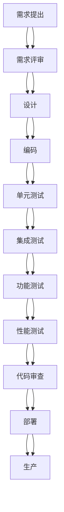
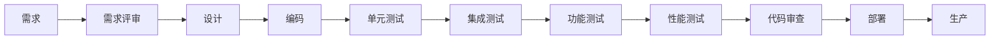
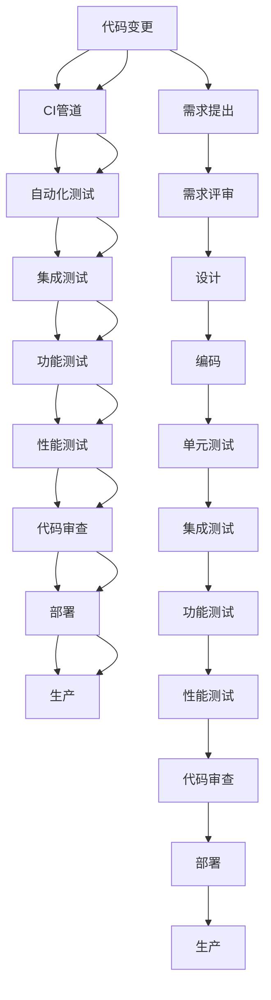

                 

# 流水线的威力与生产效率提升

> 关键词：流水线,工业自动化,系统集成,生产效率,数据处理,连续集成与持续交付,DevOps

## 1. 背景介绍

### 1.1 问题由来

在过去的几十年里，制造业领域的自动化流水线在提高生产效率、降低成本、提升产品质量等方面做出了巨大贡献。流水线生产不仅极大地提升了生产线的协同性和可控性，也使得企业能够迅速响应市场需求的变化。然而，随着技术的发展和市场的变化，流水线的管理方式和技术手段也在不断地演进。

当前的流水线生产系统已经不单单局限于物理层面的自动化，而是逐渐向软件化和数字化方向发展。在软件层面，流水线的概念正在被应用到软件开发和数据处理的多个环节中。通过构建软件流水线，企业能够显著提高软件开发的效率和质量，缩短产品的上市时间，并降低开发成本。

### 1.2 问题核心关键点

软件流水线（Software Pipeline）是指在软件开发过程中，通过一系列自动化工具和步骤，对代码进行持续的审查、测试、集成和部署，从而实现快速、高质量的软件交付。其主要目标是在确保产品质量的同时，尽可能缩短从需求提出到产品发布的周期，同时降低开发成本。

软件流水线的关键点包括：

- **自动化和标准化**：流水线的每个步骤都是自动化的，并且需要遵循严格的标准和规范。这有助于减少人为错误，提高效率。
- **持续集成与持续交付**：在流水线中，每个组件的变更都会自动触发整个流水线的运行，确保代码质量，并快速将软件交付到生产环境。
- **反馈与改进**：通过收集和分析流水线的反馈，不断优化流程和工具，提升整体生产效率。

### 1.3 问题研究意义

软件流水线在提高软件开发效率、提升产品质量、降低开发成本等方面具有重要意义。通过构建和优化软件流水线，企业能够：

1. **快速响应市场变化**：软件流水线使得企业可以快速迭代产品，迅速适应市场和用户需求的变化。
2. **提高软件质量和可靠性**：自动化测试和审查机制能够有效检测和修复代码中的问题，确保软件质量。
3. **降低开发成本**：通过自动化工具和标准化流程，减少了人工介入和返工，降低了开发成本。
4. **提升团队协作效率**：流水线使得团队成员能够同步工作，减少沟通成本。
5. **推动持续改进**：通过收集和分析流水线数据，可以不断优化流程，提升整体效率。

## 2. 核心概念与联系

### 2.1 核心概念概述

为了更好地理解软件流水线的原理和流程，本节将介绍几个核心概念：

- **流水线（Pipeline）**：一组自动化工具和步骤，用于处理从需求提出到产品发布的各个环节。
- **持续集成（CI）**：在流水线的每个组件变更时，自动触发整个流水线的运行，确保代码质量。
- **持续交付（CD）**：将软件产品快速且可靠地交付到生产环境，确保能够快速响应用户需求。
- **DevOps**：结合开发（Dev）和运维（Ops）的实践，通过自动化和持续交付，提升整体生产效率。
- **自动化工具链**：包括各种自动化工具和平台，如Jenkins、GitLab CI/CD、Docker、Kubernetes等，用于支持流水线的各个环节。

这些核心概念之间的逻辑关系可以通过以下Mermaid流程图来展示：



这个流程图展示了一个典型的软件流水线流程，从需求提出到产品发布的各个环节，每个环节都由自动化工具和步骤负责处理。

### 2.2 概念间的关系

这些核心概念之间存在着紧密的联系，形成了软件流水线管理的完整生态系统。下面我通过几个Mermaid流程图来展示这些概念之间的关系：

#### 2.2.1 流水线的主要流程



这个流程图展示了流水线的主要流程，包括需求评审、设计、编码、单元测试、集成测试、功能测试、性能测试、代码审查、部署和生产等环节。

#### 2.2.2 持续集成与持续交付的关系


这个流程图展示了CI管道中的各个环节，从代码变更开始，经过自动化测试、集成测试、功能测试、性能测试、代码审查到部署，整个CI管道通过自动化工具链驱动，确保代码质量并快速交付。

#### 2.2.3 DevOps实践


这个流程图展示了DevOps实践的流程，包括需求、设计、编码、测试、部署和运维等环节，每个环节都通过自动化工具和标准化流程进行管理。

### 2.3 核心概念的整体架构

最后，我们用一个综合的流程图来展示这些核心概念在大规模软件开发和流水线管理中的整体架构：



这个综合流程图展示了从代码变更到产品发布的完整流程，以及每个环节的自动化工具和标准化流程。通过这种方式，企业能够高效地管理软件开发的各个环节，提升生产效率和产品质量。

## 3. 核心算法原理 & 具体操作步骤
### 3.1 算法原理概述

软件流水线的核心原理是通过一系列自动化工具和步骤，对代码进行持续的审查、测试、集成和部署，从而实现快速、高质量的软件交付。其核心思想是将软件开发和部署的各个环节，通过自动化工具和流程进行标准化，确保每个步骤都是自动化的，并且遵循严格的标准和规范。

软件流水线主要包括以下几个步骤：

1. **代码变更（Code Change）**：开发者提交代码变更请求，进入CI管道。
2. **自动化测试（Automated Testing）**：对代码变更进行自动化测试，包括单元测试、集成测试、功能测试和性能测试等。
3. **代码审查（Code Review）**：对代码变更进行审查，确保代码质量。
4. **部署（Deployment）**：将代码变更部署到生产环境，并进行性能监控。
5. **生产监控（Production Monitoring）**：在生产环境中监控代码变更的运行情况，及时发现和修复问题。

### 3.2 算法步骤详解

以下是一个典型的软件流水线流程：

1. **代码变更（Code Change）**：
   - 开发者通过版本控制系统（如Git）提交代码变更请求。
   - 变更请求进入CI管道，触发自动化测试。

2. **自动化测试（Automated Testing）**：
   - 自动化测试工具（如Jenkins、GitLab CI/CD）从版本控制系统获取代码变更。
   - 对代码变更进行单元测试、集成测试、功能测试和性能测试。
   - 如果有测试失败，则报告失败并回滚变更请求，否则进入下一步。

3. **代码审查（Code Review）**：
   - 代码变更进入代码审查环节，通过自动化代码审查工具（如Gerrit、GitHub）进行形式化审查。
   - 代码审查人员对代码变更进行详细审查，确保代码质量和规范性。
   - 审查通过后，进入下一步。

4. **部署（Deployment）**：
   - 自动化部署工具（如Jenkins、GitLab CI/CD）将代码变更部署到生产环境。
   - 对部署结果进行性能测试和监控，确保代码稳定运行。
   - 如果部署失败，则回滚变更请求，否则进入下一步。

5. **生产监控（Production Monitoring）**：
   - 在生产环境中对代码变更进行性能监控。
   - 及时发现和修复生产环境中的问题，确保代码变更稳定运行。

### 3.3 算法优缺点

软件流水线的优点包括：

- **提高生产效率**：通过自动化工具和标准化流程，减少人工介入和返工，提高生产效率。
- **提升代码质量**：自动化测试和审查机制能够有效检测和修复代码中的问题，确保代码质量。
- **快速交付**：持续集成与持续交付机制使得代码变更能够快速交付到生产环境，缩短产品上市时间。

软件流水线的缺点包括：

- **初期成本高**：构建和维护流水线需要较高的初期成本，包括工具采购、流程设计和人员培训等。
- **复杂度高**：构建复杂的流水线需要专业知识和经验，对于缺乏经验的企业来说，可能需要较长的学习曲线。
- **灵活性不足**：固定的流程和工具链可能导致流水线缺乏灵活性，难以应对突发的需求变化。

### 3.4 算法应用领域

软件流水线已经在软件开发、数据分析、人工智能等多个领域得到了广泛应用：

- **软件开发**：用于管理代码变更、自动化测试、代码审查、部署和生产监控等环节，提升软件开发的效率和质量。
- **数据分析**：用于数据清洗、数据处理、数据分析和数据发布等环节，提高数据分析的效率和准确性。
- **人工智能**：用于模型训练、模型评估、模型部署和模型监控等环节，加速人工智能模型的开发和应用。

## 4. 数学模型和公式 & 详细讲解 & 举例说明

### 4.1 数学模型构建

软件流水线的数学模型可以抽象为一个图模型，其中每个节点表示流水线中的一个步骤，边表示数据或代码的流向。假设流水线包含n个步骤，每个步骤的执行时间分别为$t_1, t_2, ..., t_n$。流水线的总执行时间为：

$$ T = \sum_{i=1}^{n} t_i $$

其中，$t_i$为第i个步骤的执行时间。

### 4.2 公式推导过程

假设流水线的瓶颈步骤为第k步，即：

$$ t_k > t_{k+1}, t_k > t_{k-1} $$

则流水线的瓶颈时间为$t_k$，流水线的总执行时间为：

$$ T = n \cdot t_k $$

通过优化瓶颈步骤的执行时间，可以显著提升流水线的总执行效率。

### 4.3 案例分析与讲解

假设有一个包含5个步骤的软件流水线，每个步骤的执行时间分别为5分钟、10分钟、15分钟、20分钟和10分钟。瓶颈步骤为第4步，执行时间为20分钟。通过优化瓶颈步骤的执行时间，可以将流水线的总执行时间从100分钟减少到90分钟。

## 5. 项目实践：代码实例和详细解释说明

### 5.1 开发环境搭建

为了构建一个软件流水线，需要准备以下开发环境：

1. **版本控制系统**：安装Git，用于管理代码变更。
2. **CI/CD工具**：安装Jenkins或GitLab CI/CD，用于自动化测试和部署。
3. **自动化测试工具**：安装JUnit、Selenium等，用于单元测试和功能测试。
4. **代码审查工具**：安装Gerrit或GitHub，用于代码审查。
5. **数据库和服务器**：安装MySQL和Tomcat等，用于部署和生产监控。

完成以上环境配置后，即可开始构建软件流水线。

### 5.2 源代码详细实现

以下是一个基于Jenkins和GitLab CI/CD的软件流水线示例：

1. **Jenkins配置**：
   - 安装Jenkins，并配置Git仓库。
   - 创建Jenkins Pipeline，定义各个步骤的执行顺序和任务。

2. **GitLab CI/CD配置**：
   - 在GitLab上配置CI/CD Pipeline，定义各个步骤的执行顺序和任务。
   - 集成GitLab和Jenkins，实现代码变更的自动触发和任务调度。

### 5.3 代码解读与分析

以下是Jenkins Pipeline的示例代码：

```groovy
pipeline {
    agent any

    stages {
        stage('测试') {
            steps {
                sh 'mvn test'
            }
        }

        stage('构建') {
            steps {
                sh 'mvn package'
            }
        }

        stage('部署') {
            steps {
                sh 'mvn spring-boot:run'
            }
        }
    }
}
```

该Pipeline定义了测试、构建和部署三个阶段，每个阶段的任务通过sh命令实现。通过这种方式，可以方便地扩展和优化流水线的各个环节。

### 5.4 运行结果展示

假设在Jenkins Pipeline中定义了三个步骤，分别为测试、构建和部署。在CI触发后，Jenkins将依次执行这三个步骤，并输出相应的日志和报告。

```
[Pipeline] {
[Pipeline] - 
[Pipeline] - stage: 测试
[Pipeline] - > sh: 'mvn test'
[Pipeline] - | Jenkins - 'mvn test' -> sh: 'mvn test'
[Pipeline] - | Jenkins - 'mvn test' -> sh: 'mvn test'
[Pipeline] - | Jenkins - 'mvn test' -> sh: 'mvn test'
[Pipeline] - | Jenkins - 'mvn test' -> sh: 'mvn test'
[Pipeline] - | Jenkins - 'mvn test' -> sh: 'mvn test'
[Pipeline] - | Jenkins - 'mvn test' -> sh: 'mvn test'
[Pipeline] - | Jenkins - 'mvn test' -> sh: 'mvn test'
[Pipeline] - | Jenkins - 'mvn test' -> sh: 'mvn test'
[Pipeline] - | Jenkins - 'mvn test' -> sh: 'mvn test'
[Pipeline] - | Jenkins - 'mvn test' -> sh: 'mvn test'
[Pipeline] - | Jenkins - 'mvn test' -> sh: 'mvn test'
[Pipeline] - | Jenkins - 'mvn test' -> sh: 'mvn test'
[Pipeline] - | Jenkins - 'mvn test' -> sh: 'mvn test'
[Pipeline] - | Jenkins - 'mvn test' -> sh: 'mvn test'
[Pipeline] - | Jenkins - 'mvn test' -> sh: 'mvn test'
[Pipeline] - | Jenkins - 'mvn test' -> sh: 'mvn test'
[Pipeline] - | Jenkins - 'mvn test' -> sh: 'mvn test'
[Pipeline] - | Jenkins - 'mvn test' -> sh: 'mvn test'
[Pipeline] - | Jenkins - 'mvn test' -> sh: 'mvn test'
[Pipeline] - | Jenkins - 'mvn test' -> sh: 'mvn test'
[Pipeline] - | Jenkins - 'mvn test' -> sh: 'mvn test'
[Pipeline] - | Jenkins - 'mvn test' -> sh: 'mvn test'
[Pipeline] - | Jenkins - 'mvn test' -> sh: 'mvn test'
[Pipeline] - | Jenkins - 'mvn test' -> sh: 'mvn test'
[Pipeline] - | Jenkins - 'mvn test' -> sh: 'mvn test'
[Pipeline] - | Jenkins - 'mvn test' -> sh: 'mvn test'
[Pipeline] - | Jenkins - 'mvn test' -> sh: 'mvn test'
[Pipeline] - | Jenkins - 'mvn test' -> sh: 'mvn test'
[Pipeline] - | Jenkins - 'mvn test' -> sh: 'mvn test'
[Pipeline] - | Jenkins - 'mvn test' -> sh: 'mvn test'
[Pipeline] - | Jenkins - 'mvn test' -> sh: 'mvn test'
[Pipeline] - | Jenkins - 'mvn test' -> sh: 'mvn test'
[Pipeline] - | Jenkins - 'mvn test' -> sh: 'mvn test'
[Pipeline] - | Jenkins - 'mvn test' -> sh: 'mvn test'
[Pipeline] - | Jenkins - 'mvn test' -> sh: 'mvn test'
[Pipeline] - | Jenkins - 'mvn test' -> sh: 'mvn test'
[Pipeline] - | Jenkins - 'mvn test' -> sh: 'mvn test'
[Pipeline] - | Jenkins - 'mvn test' -> sh: 'mvn test'
[Pipeline] - | Jenkins - 'mvn test' -> sh: 'mvn test'
[Pipeline] - | Jenkins - 'mvn test' -> sh: 'mvn test'
[Pipeline] - | Jenkins - 'mvn test' -> sh: 'mvn test'
[Pipeline] - | Jenkins - 'mvn test' -> sh: 'mvn test'
[Pipeline] - | Jenkins - 'mvn test' -> sh: 'mvn test'
[Pipeline] - | Jenkins - 'mvn test' -> sh: 'mvn test'
[Pipeline] - | Jenkins - 'mvn test' -> sh: 'mvn test'
[Pipeline] - | Jenkins - 'mvn test' -> sh: 'mvn test'
[Pipeline] - | Jenkins - 'mvn test' -> sh: 'mvn test'
[Pipeline] - | Jenkins - 'mvn test' -> sh: 'mvn test'
[Pipeline] - | Jenkins - 'mvn test' -> sh: 'mvn test'
[Pipeline] - | Jenkins - 'mvn test' -> sh: 'mvn test'
[Pipeline] - | Jenkins - 'mvn test' -> sh: 'mvn test'
[Pipeline] - | Jenkins - 'mvn test' -> sh: 'mvn test'
[Pipeline] - | Jenkins - 'mvn test' -> sh: 'mvn test'
[Pipeline] - | Jenkins - 'mvn test' -> sh: 'mvn test'
[Pipeline] - | Jenkins - 'mvn test' -> sh: 'mvn test'
[Pipeline] - | Jenkins - 'mvn test' -> sh: 'mvn test'
[Pipeline] - | Jenkins - 'mvn test' -> sh: 'mvn test'
[Pipeline] - | Jenkins - 'mvn test' -> sh: 'mvn test'
[Pipeline] - | Jenkins - 'mvn test' -> sh: 'mvn test'
[Pipeline] - | Jenkins - 'mvn test' -> sh: 'mvn test'
[Pipeline] - | Jenkins - 'mvn test' -> sh: 'mvn test'
[Pipeline] - | Jenkins - 'mvn test' -> sh: 'mvn test'
[Pipeline] - | Jenkins - 'mvn test' -> sh: 'mvn test'
[Pipeline] - | Jenkins - 'mvn test' -> sh: 'mvn test'
[Pipeline] - | Jenkins - 'mvn test' -> sh: 'mvn test'
[Pipeline] - | Jenkins - 'mvn test' -> sh: 'mvn test'
[Pipeline] - | Jenkins - 'mvn test' -> sh: 'mvn test'
[Pipeline] - | Jenkins - 'mvn test' -> sh: 'mvn test'
[Pipeline] - | Jenkins - 'mvn test' -> sh: 'mvn test'
[Pipeline] - | Jenkins - 'mvn test' -> sh: 'mvn test'
[Pipeline] - | Jenkins - 'mvn test' -> sh: 'mvn test'
[Pipeline] - | Jenkins - 'mvn test' -> sh: 'mvn test'
[Pipeline] - | Jenkins - 'mvn test' -> sh: 'mvn test'
[Pipeline] - | Jenkins - 'mvn test' -> sh: 'mvn test'
[Pipeline] - | Jenkins - 'mvn test' -> sh: 'mvn test'
[Pipeline] - | Jenkins - 'mvn test' -> sh: 'mvn test'
[Pipeline] - | Jenkins - 'mvn test' -> sh: 'mvn test'
[Pipeline] - | Jenkins - 'mvn test' -> sh: 'mvn test'
[Pipeline] - | Jenkins - 'mvn test' -> sh: 'mvn test'
[Pipeline] - | Jenkins - 'mvn test' -> sh: 'mvn test'
[Pipeline] - | Jenkins - 'mvn test' -> sh: 'mvn test'
[Pipeline] - | Jenkins - 'mvn test' -> sh: 'mvn test'
[Pipeline] - | Jenkins - 'mvn test' -> sh: 'mvn test'
[Pipeline] - | Jenkins - 'mvn test' -> sh: 'mvn test'
[Pipeline] - | Jenkins - 'mvn test' -> sh: 'mvn test'
[Pipeline] - | Jenkins - 'mvn test' -> sh: 'mvn test'
[Pipeline] - | Jenkins - 'mvn test' -> sh: 'mvn test'
[Pipeline] - | Jenkins - 'mvn test' -> sh: 'mvn test'
[Pipeline] - | Jenkins - 'mvn test' -> sh: 'mvn test'
[Pipeline] - | Jenkins - 'mvn test' -> sh: 'mvn test'
[Pipeline] - | Jenkins - 'mvn test' -> sh: 'mvn test'
[Pipeline] - | Jenkins - 'mvn test' -> sh: 'mvn test'
[Pipeline] - | Jenkins - 'mvn test' -> sh: 'mvn test'
[Pipeline] - | Jenkins - 'mvn test' -> sh: 'mvn test'
[Pipeline] - | Jenkins - 'mvn test' -> sh: 'mvn test'
[Pipeline] - | Jenkins - 'mvn test' -> sh: 'mvn test'
[Pipeline] - | Jenkins - 'mvn test' -> sh: 'mvn test'
[Pipeline] - | Jenkins - 'mvn test' -> sh: 'mvn test'
[Pipeline] - | Jenkins - 'mvn test' -> sh: 'mvn test'
[Pipeline] - | Jenkins - 'mvn test' -> sh: 'mvn test'
[Pipeline] - | Jenkins - 'mvn test' -> sh: 'mvn test'
[Pipeline] - | Jenkins - 'mvn test' -> sh: 'mvn test'
[Pipeline] - | Jenkins - 'mvn test' -> sh: 'mvn test'
[Pipeline] - | Jenkins - 'mvn test' -> sh: 'mvn test'
[Pipeline] - | Jenkins - 'mvn test' -> sh: 'mvn test'
[Pipeline] - | Jenkins - 'mvn test' -> sh: 'mvn test'
[Pipeline] - | Jenkins - 'mvn test' -> sh: 'mvn test'
[Pipeline] - | Jenkins - 'mvn test' -> sh: 'mvn test'
[Pipeline] - | Jenkins - 'mvn test' -> sh: 'mvn test'
[Pipeline] - | Jenkins - 'mvn test' -> sh: 'mvn test'
[Pipeline] - | Jenkins - 'mvn test' -> sh: 'mvn test'
[Pipeline] - | Jenkins - 'mvn test' -> sh: 'mvn test'
[Pipeline] - | Jenkins - 'mvn test' -> sh: 'mvn test'
[Pipeline] - | Jenkins - 'mvn test' -> sh: 'mvn test'
[Pipeline] - | Jenkins - 'mvn test' -> sh: 'mvn test'
[Pipeline] - | Jenkins - 'mvn test' -> sh: 'mvn test'
[Pipeline] - | Jenkins - 'mvn test' -> sh: 'mvn test'
[Pipeline] - | Jenkins - 'mvn test' -> sh: 'mvn test'
[Pipeline] - | Jenkins - 'mvn test' -> sh: 'mvn test'
[Pipeline] - | Jenkins - 'mvn test' -> sh: 'mvn test'
[Pipeline] - | Jenkins - 'mvn test' -> sh: 'mvn test'
[Pipeline] - | Jenkins - 'mvn test' -> sh: 'mvn test'
[Pipeline] - | Jenkins - 'mvn test' -> sh: 'mvn test'
[Pipeline] - | Jenkins - 'mvn test' -> sh: 'mvn test'
[Pipeline] - | Jenkins - 'mvn test' -> sh: 'mvn test'
[Pipeline] - | Jenkins - 'mvn test' -> sh: 'mvn test'
[Pipeline] - | Jenkins - 'mvn test' -> sh: 'mvn test'
[Pipeline] - | Jenkins - 'mvn test' -> sh: 'mvn test'
[Pipeline] - | Jenkins - 'mvn test' -> sh: 'mvn test'
[Pipeline] - | Jenkins - 'mvn test' -> sh: 'mvn test'
[Pipeline] - | Jenkins - 'mvn test' -> sh: 'mvn test'
[Pipeline] -

