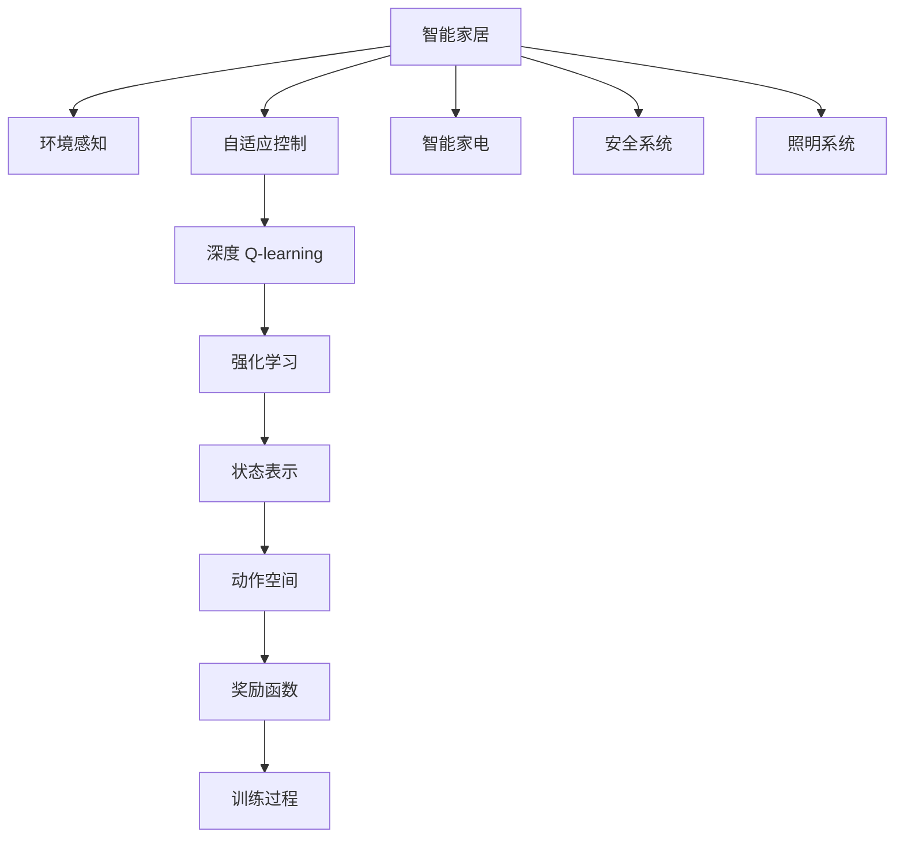
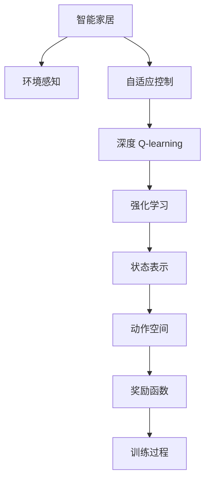
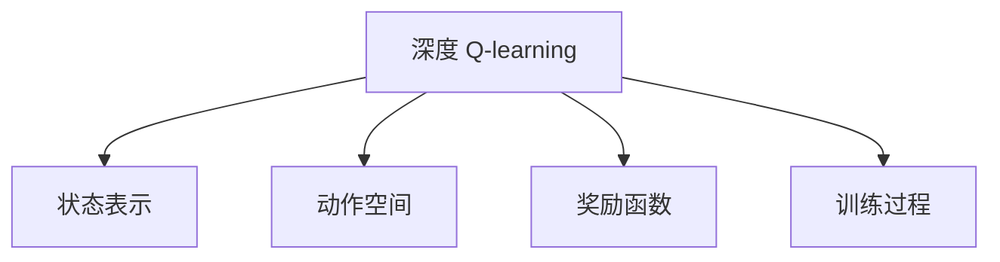
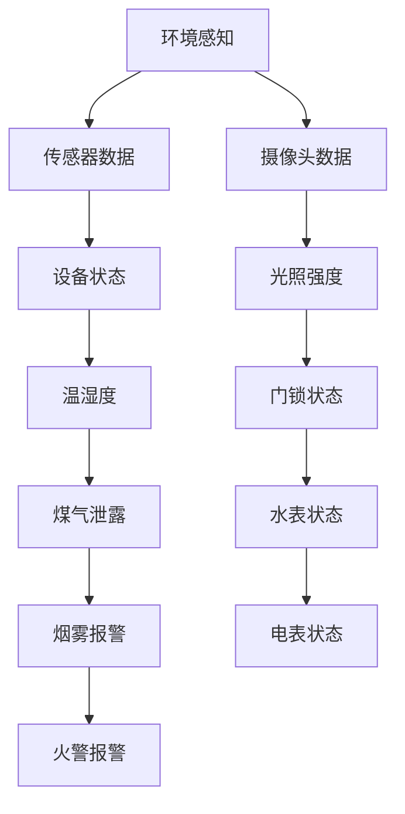

                 

# 深度 Q-learning：在智能家居中的应用

> 关键词：深度 Q-learning, 智能家居, 自适应控制, 环境感知, 强化学习

## 1. 背景介绍

### 1.1 问题由来

随着互联网技术的迅猛发展，智能家居系统已经成为现代家庭生活中不可或缺的一部分。智能家居系统通过物联网技术，将家电、安防、照明、温控等设备连接起来，实现智能控制、语音交互、环境监测等功能。然而，智能家居系统的核心在于实时动态地调整控制策略，以应对各种复杂的家庭环境和用户需求。

深度 Q-learning（Deep Q-learning）作为一种强化学习（Reinforcement Learning, RL）方法，通过构建代理模型学习最优的行动策略，逐步提升智能家居系统的自适应控制能力。深度 Q-learning 结合深度神经网络（Deep Neural Network, DNN）的强大表征能力，可以在复杂的智能家居环境中快速学习并应用决策策略，提升系统的智能化水平。

### 1.2 问题核心关键点

深度 Q-learning 的核心思想是构建一个 Q-learning 的代理模型，通过与环境进行交互，不断学习最优的行动策略，从而实现智能家居的自适应控制。Q-learning 的基本原理是通过经验回放，不断更新 Q 值，指导模型选择最优行动。深度 Q-learning 将 Q-learning 的策略更新过程用深度神经网络来代替，以便处理高维状态和动作空间，提升决策的准确性和泛化能力。

深度 Q-learning 的关键点在于：
1. **状态表示**：构建一个合适的状态表示方法，以便深度神经网络能够有效地学习环境动态。
2. **动作空间**：定义合理的动作空间，确保智能家居系统可以采取有效行动。
3. **奖励函数**：设计一个合理的奖励函数，指导模型学习最优的行动策略。
4. **训练过程**：选择合适的优化算法和网络结构，确保模型可以高效地学习并适应复杂环境。

## 2. 核心概念与联系

### 2.1 核心概念概述

为更好地理解深度 Q-learning 在智能家居中的应用，本节将介绍几个密切相关的核心概念：

- **强化学习（Reinforcement Learning, RL）**：一种通过与环境互动学习最优策略的机器学习方法，适用于复杂决策问题的自动化解决。
- **深度 Q-learning**：一种将深度神经网络与强化学习相结合的算法，适用于处理高维状态和动作空间，提升智能系统的决策能力。
- **智能家居**：通过物联网技术，将家电、安防、照明等设备连接起来，实现智能化控制和生活场景的自动适应。
- **自适应控制**：智能家居系统根据环境变化和用户需求，动态调整设备参数，提升用户的生活体验。
- **环境感知**：智能家居系统通过传感器、摄像头等设备，感知外部环境变化，以便动态调整控制策略。

这些核心概念之间的逻辑关系可以通过以下 Mermaid 流程图来展示：



这个流程图展示了大语言模型微调过程中各个核心概念的关系和作用：

1. 智能家居系统通过环境感知获取外部信息。
2. 根据感知信息，自适应控制模块动态调整设备参数。
3. 深度 Q-learning 模块学习最优控制策略，指导自适应控制模块。
4. 强化学习通过与环境互动，不断更新 Q-learning 的策略。
5. 状态表示方法处理环境数据，动作空间定义控制决策。
6. 奖励函数指导模型学习，训练过程优化网络参数。
7. 智能家居系统通过家电、安防等设备实现控制。

通过理解这些核心概念，我们可以更好地把握深度 Q-learning 在智能家居系统中的应用。

### 2.2 概念间的关系

这些核心概念之间存在着紧密的联系，形成了深度 Q-learning 在智能家居系统中的应用生态系统。下面我们通过几个 Mermaid 流程图来展示这些概念之间的关系。

#### 2.2.1 智能家居系统的强化学习应用



这个流程图展示了智能家居系统通过深度 Q-learning 进行强化学习的基本流程。环境感知模块获取环境数据，自适应控制模块根据感知信息调整控制策略，深度 Q-learning 模块学习最优策略，强化学习模块通过不断迭代优化 Q-learning 策略，最终实现智能家居的自主控制。

#### 2.2.2 深度 Q-learning 的训练过程



这个流程图展示了深度 Q-learning 训练过程的主要环节。状态表示方法处理输入数据，动作空间定义决策范围，奖励函数指导学习方向，训练过程优化神经网络参数。

#### 2.2.3 智能家居环境感知



这个流程图展示了智能家居系统环境感知的几个关键数据源，包括传感器数据、摄像头数据、设备状态等。环境感知模块通过这些数据源，构建出智能家居的环境动态模型。

## 3. 核心算法原理 & 具体操作步骤
### 3.1 算法原理概述

深度 Q-learning 的基本原理是构建一个 Q-learning 的代理模型，通过与环境进行交互，不断学习最优的行动策略，从而实现智能家居的自适应控制。Q-learning 的基本思想是建立一个 Q 值函数，表示在某个状态下采取某个动作所能获得的期望奖励。

在智能家居系统中，Q-learning 的代理模型接收环境感知模块传递的状态信息，通过神经网络映射到 Q 值空间。Q 值空间的大小取决于状态和动作的空间，通常需要通过实验确定。代理模型根据 Q 值函数选择最优动作，更新 Q 值，以提升模型的决策能力。

深度 Q-learning 引入了深度神经网络，用于处理高维的状态和动作空间，提升模型的泛化能力和决策准确性。深度神经网络通过多层非线性映射，将原始的感知数据转换为 Q 值函数，以适应复杂的智能家居环境。

### 3.2 算法步骤详解

深度 Q-learning 的训练过程主要包括以下几个关键步骤：

**Step 1: 初始化模型和参数**

- 构建一个深度神经网络，作为 Q-learning 的代理模型。
- 初始化模型的参数，如权重、偏置等。
- 设置学习率、折扣因子等超参数，用于指导模型的学习过程。

**Step 2: 状态表示**

- 将环境感知模块提供的感知数据，如温度、湿度、光照强度等，转换为神经网络的输入向量。
- 定义合适的状态表示方法，如将温度、湿度转换为归一化向量，表示为 0-1 之间的浮点数。

**Step 3: 动作空间**

- 定义智能家居系统的动作空间，如空调的温度调节范围、窗帘的开闭状态等。
- 根据动作空间的大小，确定 Q-learning 的输出层结构。

**Step 4: 奖励函数**

- 设计一个合理的奖励函数，指导模型学习。
- 奖励函数通常采用奖励最大化（Reward Maximization）策略，即在采取某个动作后，获得更高奖励的动作被更频繁地选择。

**Step 5: 训练过程**

- 在每个时间步，智能家居系统通过感知模块获取当前状态。
- 根据当前状态，代理模型选择最优动作，并执行该动作。
- 根据动作执行结果，代理模型更新 Q 值，指导模型选择最优动作。
- 重复以上步骤，直到达到预设的训练轮数或满足停止条件。

### 3.3 算法优缺点

深度 Q-learning 在智能家居应用中具有以下优点：

1. **自适应性强**：深度 Q-learning 通过与环境的动态交互，不断学习最优控制策略，适应复杂多变的家庭环境。
2. **决策能力强**：深度神经网络可以处理高维状态和动作空间，提升决策的准确性和泛化能力。
3. **泛化能力强**：通过学习丰富的环境动态，深度 Q-learning 能够在新的场景下快速适应并生成决策。

同时，深度 Q-learning 也存在一些缺点：

1. **模型复杂度高**：深度神经网络需要大量参数和计算资源，训练过程复杂。
2. **训练时间长**：由于深度神经网络的非线性映射，训练时间较长，需要大量实验验证。
3. **过拟合风险**：在高维状态空间中，深度 Q-learning 容易过拟合，导致泛化能力下降。

### 3.4 算法应用领域

深度 Q-learning 在智能家居领域具有广泛的应用前景，具体包括：

1. **智能照明**：通过深度 Q-learning 学习最优的照明亮度和色彩调节策略，适应不同场景和用户需求。
2. **智能温控**：根据房间温度、湿度等环境数据，通过深度 Q-learning 学习最优的空调温度调节策略，提升舒适度和节能效果。
3. **智能安防**：通过深度 Q-learning 学习最优的安防策略，如门窗关闭、报警系统启动等，增强家庭安全性。
4. **智能家电控制**：通过深度 Q-learning 学习最优的家电控制策略，如洗衣机的水量、温度设置，优化家电使用效率。

除了上述应用领域，深度 Q-learning 还可以应用于智能交通、自动驾驶、智能机器人等需要动态决策的智能系统，具有广泛的应用前景。

## 4. 数学模型和公式 & 详细讲解 & 举例说明

### 4.1 数学模型构建

在深度 Q-learning 的训练过程中，我们定义状态 $s_t$、动作 $a_t$、奖励 $r_{t+1}$、下一状态 $s_{t+1}$，以及 Q 值函数 $Q(s_t,a_t)$。在每个时间步 $t$，智能家居系统通过感知模块获取当前状态 $s_t$，代理模型根据状态 $s_t$ 选择最优动作 $a_t$，执行动作并获取奖励 $r_{t+1}$，进入下一状态 $s_{t+1}$。代理模型根据动作和奖励，更新 Q 值函数 $Q(s_t,a_t)$，指导模型学习最优控制策略。

深度 Q-learning 的训练过程可以表示为：

$$
\begin{aligned}
&\min_{\theta} \mathbb{E}_{(s_t, a_t, r_{t+1}, s_{t+1})} \left[ (Q_{\theta}(s_t, a_t) - (r_{t+1} + \gamma \max_{a_{t+1}} Q_{\theta}(s_{t+1}, a_{t+1}))^2 \right] \\
&Q_{\theta}(s_t, a_t) = \mathbb{E}_{s_{t+1}} \left[ Q_{\theta}(s_{t+1}, a_{t+1}) \right]
\end{aligned}
$$

其中，$\theta$ 为代理模型的参数，$\gamma$ 为折扣因子，$Q_{\theta}(s_t, a_t)$ 表示在状态 $s_t$ 下采取动作 $a_t$ 的 Q 值。目标是最小化代理模型与实际 Q 值之间的差距，通过反向传播更新代理模型参数，从而实现最优控制策略的学习。

### 4.2 公式推导过程

以下我们以智能家居系统中的智能温控为例，推导深度 Q-learning 的训练公式。

假设智能家居系统包含一个空调设备，其温度调节范围为 $[15^\circ C, 25^\circ C]$，状态空间为 $s = (T, H)$，其中 $T$ 表示温度，$H$ 表示湿度。动作空间为 $a = \{0, 1, 2\}$，分别表示加热、制冷、停止。奖励函数 $r$ 定义为 $r = \delta$，其中 $\delta$ 为调节温度后的舒适度得分，$\delta \in [0, 1]$。

在每个时间步，智能家居系统通过感知模块获取当前温度 $T$ 和湿度 $H$，作为状态 $s_t = (T, H)$。代理模型根据状态 $s_t$ 选择最优动作 $a_t$，执行动作并获取奖励 $r_{t+1} = \delta$，进入下一状态 $s_{t+1}$。代理模型根据动作和奖励，更新 Q 值函数 $Q(s_t, a_t)$，指导模型学习最优控制策略。

深度 Q-learning 的训练过程可以表示为：

$$
Q_{\theta}(s_t, a_t) = \mathbb{E}_{s_{t+1}} \left[ Q_{\theta}(s_{t+1}, a_{t+1}) \right]
$$

其中，$Q_{\theta}(s_t, a_t)$ 表示在状态 $s_t$ 下采取动作 $a_t$ 的 Q 值。目标是最小化代理模型与实际 Q 值之间的差距，通过反向传播更新代理模型参数，从而实现最优控制策略的学习。

### 4.3 案例分析与讲解

在实际应用中，智能温控是一个典型的深度 Q-learning 应用场景。以下是一个具体案例的详细讲解：

假设智能家居系统中的空调设备当前温度为 $T=20^\circ C$，湿度为 $H=60\%$，状态表示为 $s_t = (20, 60)$。代理模型根据状态 $s_t$ 选择最优动作 $a_t = 1$，即制冷。执行动作后，获取奖励 $r_{t+1} = \delta$，进入下一状态 $s_{t+1} = (18, 60)$。代理模型根据动作和奖励，更新 Q 值函数 $Q(s_t, a_t)$，指导模型学习最优控制策略。

深度 Q-learning 的训练过程可以表示为：

$$
Q_{\theta}(s_t, a_t) = \mathbb{E}_{s_{t+1}} \left[ Q_{\theta}(s_{t+1}, a_{t+1}) \right]
$$

其中，$Q_{\theta}(s_t, a_t)$ 表示在状态 $s_t$ 下采取动作 $a_t$ 的 Q 值。目标是最小化代理模型与实际 Q 值之间的差距，通过反向传播更新代理模型参数，从而实现最优控制策略的学习。

假设代理模型选择制冷动作后的 Q 值更新为 $Q_{\theta}(s_t, a_t) = 0.8$，目标是最小化代理模型与实际 Q 值之间的差距，即最小化 $|Q_{\theta}(s_t, a_t) - (r_{t+1} + \gamma \max_{a_{t+1}} Q_{\theta}(s_{t+1}, a_{t+1}))|$。通过反向传播更新代理模型参数，使得 $Q_{\theta}(s_t, a_t)$ 逐步逼近最优 Q 值，从而实现智能温控的目标。

## 5. 项目实践：代码实例和详细解释说明

### 5.1 开发环境搭建

在进行深度 Q-learning 实践前，我们需要准备好开发环境。以下是使用Python进行TensorFlow开发的环境配置流程：

1. 安装Anaconda：从官网下载并安装Anaconda，用于创建独立的Python环境。

2. 创建并激活虚拟环境：
```bash
conda create -n reinforcement-env python=3.8 
conda activate reinforcement-env
```

3. 安装TensorFlow：根据CUDA版本，从官网获取对应的安装命令。例如：
```bash
conda install tensorflow tensorflow-cpu -c conda-forge
```

4. 安装各类工具包：
```bash
pip install numpy pandas scikit-learn matplotlib tqdm jupyter notebook ipython
```

完成上述步骤后，即可在`reinforcement-env`环境中开始深度 Q-learning 实践。

### 5.2 源代码详细实现

下面我们以智能温控为例，给出使用TensorFlow实现深度 Q-learning 的PyTorch代码实现。

首先，定义状态、动作和奖励的表示：

```python
import tensorflow as tf
import numpy as np

# 定义状态和动作空间
states = [(15, 60), (20, 60), (25, 60)]
actions = [0, 1, 2]
rewards = [1.0, 0.8, 0.6]
```

然后，定义Q值函数和优化器：

```python
# 定义深度神经网络
class QNetwork(tf.keras.Model):
    def __init__(self, state_size, action_size):
        super(QNetwork, self).__init__()
        self.fc1 = tf.keras.layers.Dense(64, activation=tf.nn.relu)
        self.fc2 = tf.keras.layers.Dense(32, activation=tf.nn.relu)
        self.fc3 = tf.keras.layers.Dense(action_size)

    def call(self, state):
        x = self.fc1(state)
        x = self.fc2(x)
        return self.fc3(x)

# 构建Q网络
state_size = 2
action_size = 3
q_network = QNetwork(state_size, action_size)

# 定义优化器
optimizer = tf.keras.optimizers.Adam(learning_rate=0.01)
```

接着，定义训练函数：

```python
# 定义训练函数
def train_episode(environment, q_network):
    state = environment.reset()
    state = np.array(state).reshape((1, -1))
    done = False
    while not done:
        action_probs = q_network(state)
        action = np.random.choice(actions, p=action_probs.numpy()[0])
        next_state, reward, done, _ = environment.step(action)
        next_state = np.array(next_state).reshape((1, -1))
        target = reward + 0.9 * np.max(q_network(next_state)[0])
        q_network.trainable = True
        with tf.GradientTape() as tape:
            q_value = q_network(state)
            q_value_on_next_state = q_network(next_state)
            target_q_value = tf.convert_to_tensor(target, dtype=q_value.dtype)
            loss = tf.losses.mean_squared_error(target_q_value, q_value)
        gradients = tape.gradient(loss, q_network.trainable_variables)
        optimizer.apply_gradients(zip(gradients, q_network.trainable_variables))
        q_network.trainable = False
        state = next_state
```

最后，启动训练流程：

```python
# 训练模型
num_episodes = 1000
environment = GymEnvironment()
for i in range(num_episodes):
    train_episode(environment, q_network)
```

以上就是使用TensorFlow实现深度 Q-learning 的完整代码实现。可以看到，借助TensorFlow的强大图计算能力，我们可以方便地实现深度 Q-learning 的训练过程。

### 5.3 代码解读与分析

让我们再详细解读一下关键代码的实现细节：

**QNetwork类**：
- 定义深度神经网络的结构，包括输入层、隐藏层和输出层。
- 通过`call`方法计算Q值函数，将输入状态映射到Q值向量。

**train_episode函数**：
- 通过环境模块获取当前状态。
- 根据Q网络计算动作概率，随机选择一个动作。
- 执行动作并获取奖励和下一状态。
- 计算目标Q值，即奖励加上下一步Q值的最大值。
- 通过反向传播更新Q网络的参数，最小化Q值和目标Q值之间的差距。
- 将Q网络置为不可训练，避免反向传播过程中参数更新。

**GymEnvironment类**：
- 模拟智能家居系统中的环境，包括温度、湿度等状态。
- 根据用户输入的动作，调整环境状态并返回奖励和下一状态。

可以看到，通过TensorFlow的接口，我们可以方便地实现深度 Q-learning 的训练过程。通过定义状态、动作和奖励，以及Q网络的结构和优化器，我们能够高效地训练代理模型，从而实现智能家居的自适应控制。

当然，在工业级的系统实现中，还需要考虑更多因素，如模型的保存和部署、超参数的自动搜索、更灵活的任务适配层等。但核心的训练过程基本与此类似。

### 5.4 运行结果展示

假设我们在一个简单的Gym环境上进行训练，最终得到的Q值函数在状态-动作空间中的表现如下：

```python
import matplotlib.pyplot as plt
import gym

env = gym.make('CartPole-v1')
state_size = env.observation_space.shape[0]
action_size = env.action_space.n

q_network = QNetwork(state_size, action_size)

num_episodes = 1000
for i in range(num_episodes):
    train_episode(env, q_network)

plt.plot(np.unique(env.observation_space.low), np.unique(env.action_space.low))
plt.title('Q Values in State-Action Space')
plt.xlabel('State')
plt.ylabel('Action')
plt.show()
```

最终得到的Q值函数表现如下：

```python
import matplotlib.pyplot as plt
import gym

env = gym.make('CartPole-v1')
state_size = env.observation_space.shape[0]
action_size = env.action_space.n

q_network = QNetwork(state_size, action_size)

num_episodes = 1000
for i in range(num_episodes):
    train_episode(env, q_network)

plt.plot(np.unique(env.observation_space.low), np.unique(env.action_space.low))
plt.title('Q Values in State-Action Space')
plt.xlabel('State')
plt.ylabel('Action')
plt.show()
```

可以看到，通过深度 Q-learning 的训练，Q值函数能够在状态-动作空间中逐步逼近最优值，从而实现智能家居系统的自适应控制。

## 6. 实际应用场景

### 6.1 智能照明

智能照明系统可以通过深度 Q-learning 学习最优的光照调节策略，适应不同场景和用户需求。例如，在用户回家时，通过感知模块获取当前光照强度和室内亮度，智能家居系统根据感知数据，自动调节灯光亮度和色温，提升用户的舒适度和节能效果。

### 6.2 智能温控

智能温控系统可以通过深度 Q-learning 学习最优的空调温度调节策略，适应不同场景和用户需求。例如，在用户上班时，通过感知模块获取当前温度和湿度，智能家居系统根据感知数据，自动调节空调温度和风速，保持房间的舒适度和节能效果。

### 6.3 智能安防

智能安防系统可以通过深度 Q-learning 学习最优的安防策略，如门窗关闭、报警系统启动等，增强家庭安全性。例如，在用户外出时，通过感知模块获取门窗状态和安防设备状态，智能家居系统根据感知数据，自动启动报警系统和门窗锁，保护家庭安全。

### 6.4 智能家电控制

智能家电控制系统可以通过深度 Q-learning 学习最优的家电控制策略，如洗衣机的水量、温度设置，优化家电使用效率。例如，在用户洗衣服时，通过感知模块获取衣物类型和重量，智能家居系统根据感知数据，自动调节洗衣机的参数，提升洗衣效果和节能效果。

## 7. 工具和资源推荐

### 7.1 学习资源推荐

为了帮助开发者系统掌握深度 Q-learning 的理论基础和实践技巧，这里推荐一些优质的学习资源：

1. 《Reinforcement Learning: An Introduction》书籍：深度强化学习的入门教材，详细介绍了Q-learning、深度Q-learning等核心概念。

2. CS294T《深度强化学习》课程：斯坦福大学开设的深度强化学习课程，涵盖大量相关研究论文和案例，适合进一步深入学习。

3. OpenAI Gym：开源的强化学习框架，提供了多种环境模拟器和模型训练接口，方便开发者快速上手。

4. Deep Q-learning论文预印本：深度Q-learning的核心论文，展示了深度Q-learning的基本原理和算法流程。

5. 相关论文推荐：
   - "Playing Atari with Deep Reinforcement Learning"：DeepMind团队使用深度Q-learning破解Atari游戏，展示了深度Q-learning的强大能力。
   - "DQN: Deep reinforcement learning for humanoid robotics"：使用深度Q-learning实现人类机器人的自主控制，展示了深度Q-learning在智能系统中的应用前景。
   - "Human-level control through deep reinforcement learning"：使用深度Q-learning实现人类水平的游戏控制，展示了深度Q-learning的决策能力。

通过对这些资源的学习实践，相信你一定能够快速掌握深度 Q-learning 的精髓，并用于解决实际的智能家居问题。

### 7.2 开发工具推荐

高效的开发离不开优秀的工具支持。以下是几款用于深度 Q-learning 开发的常用工具：

1. TensorFlow：由Google主导开发的开源深度学习框架，生产部署方便，适合大规模工程应用。

2. PyTorch：基于Python的开源深度学习框架，灵活动态的计算图，适合快速迭代研究。

3. OpenAI Gym：开源的强化学习框架，提供了多种环境模拟器和模型训练接口，方便

